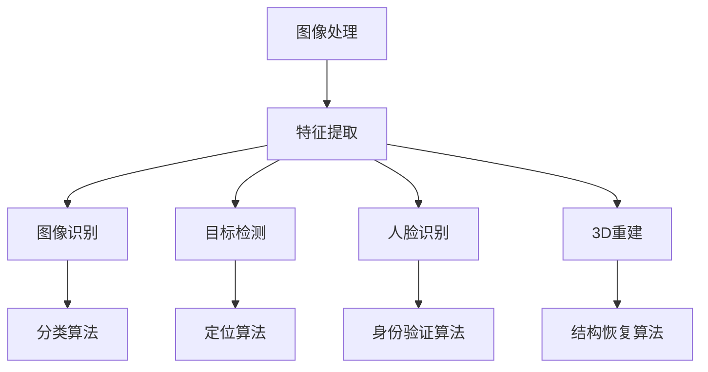

                 

### 计算机视觉在零售业中的创新应用

#### 关键词：
计算机视觉，零售业，创新应用，图像识别，目标检测，人脸识别，3D重建

#### 摘要：
随着科技的飞速发展，计算机视觉技术在零售业中的应用越来越广泛。本文从背景介绍、核心概念、算法原理、实战案例等多个角度，详细阐述了计算机视觉在零售业中的创新应用。首先，我们回顾了计算机视觉的发展历程及其在零售业中的重要地位。接着，深入分析了计算机视觉的核心概念和算法原理，包括图像识别、目标检测、人脸识别和3D重建。最后，通过具体案例，展示了计算机视觉在零售业中的实际应用效果，并探讨了其未来发展前景。

#### 引言

在当今数字化时代，零售行业正面临着前所未有的变革。消费者购物习惯的变化、电子商务的兴起以及数据驱动的决策需求，使得零售企业必须不断寻求创新以保持竞争力。计算机视觉技术作为人工智能的一个重要分支，以其强大的图像识别和处理能力，正在逐步渗透到零售业的各个环节，为零售企业带来了全新的运营模式和体验。

计算机视觉技术是指通过计算机对图像或视频进行分析和处理，以自动识别和理解其中的内容。它涉及图像处理、计算机视觉、模式识别等多个学科领域，旨在实现计算机对图像的感知、理解和交互。随着深度学习、卷积神经网络等技术的不断发展，计算机视觉技术已经取得了显著的进展，并在各个领域取得了广泛的应用。

在零售业中，计算机视觉技术正逐步改变着传统的商业模式。例如，通过智能货架系统实时监控商品销售情况，通过人脸识别技术实现个性化推荐，通过目标检测技术提高物流效率等。本文将详细探讨计算机视觉技术在零售业中的创新应用，旨在为读者提供一份全面的技术指南，帮助零售企业把握数字化转型的机遇。

### 背景介绍

计算机视觉技术的发展可以追溯到20世纪60年代，当时的研究主要集中在图像识别和图像处理的基础算法上。随着计算机硬件性能的提升和算法理论的不断成熟，计算机视觉技术逐渐走向实用化。在21世纪初，随着深度学习技术的突破，计算机视觉技术迎来了新的发展高潮。深度学习模型，特别是卷积神经网络（CNN）的广泛应用，使得计算机视觉在图像分类、目标检测、人脸识别等领域取得了显著的成果。

零售业是计算机视觉技术的重要应用领域之一。随着消费者对购物体验的要求越来越高，零售企业迫切需要通过技术手段提高运营效率、降低成本、提升客户满意度。计算机视觉技术为零售业带来了许多创新应用，如智能货架系统、智能安防系统、智能物流系统等。这些应用不仅提高了零售企业的运营效率，还为客户提供了更加个性化的购物体验。

智能货架系统利用计算机视觉技术实时监控货架上的商品库存和销售情况，通过图像识别和目标检测技术，自动识别商品的数量和位置。这种系统可以精确地跟踪商品的销售情况，帮助零售企业及时调整库存策略，减少商品过剩或短缺的情况，从而降低成本。

智能安防系统通过人脸识别和目标检测技术，实时监控商店内部的顾客和员工行为。当系统检测到异常行为或潜在安全威胁时，可以自动报警，提高商店的安全水平。同时，通过对顾客行为的分析，零售企业可以更好地了解顾客需求，优化商品陈列和促销策略。

智能物流系统利用计算机视觉技术实现自动化分拣和配送，提高物流效率。通过图像识别和目标检测技术，系统可以自动识别和分类物流货物，减少人工干预，降低物流成本。

总之，计算机视觉技术在零售业中的应用不仅提高了企业的运营效率，还为消费者带来了更加便捷和个性化的购物体验。随着技术的不断进步，计算机视觉在零售业中的应用前景将更加广阔。

### 核心概念与联系

计算机视觉涉及多个核心概念和实体，这些概念和实体共同构成了计算机视觉系统的基础。以下是几个关键概念及其相互关系的详细介绍。

1. **图像处理**：图像处理是计算机视觉的基础，它包括图像的获取、增强、滤波、分割等操作。图像处理的目标是改善图像质量，提取图像中的有用信息。在计算机视觉中，图像处理技术常用于预处理图像数据，以提高后续视觉任务的准确性和效率。

2. **特征提取**：特征提取是指从图像中提取出具有区分性的特征，用于后续的图像分类、目标检测等任务。常见的特征提取方法包括边缘检测、角点检测、纹理分析等。特征提取的目的是将高维图像数据转化为低维特征向量，以便更有效地进行模式识别。

3. **图像识别**：图像识别是指通过计算机算法对图像中的对象进行分类和识别。图像识别的任务包括人脸识别、物体识别、场景分类等。图像识别依赖于特征提取和分类算法，如支持向量机（SVM）、深度神经网络（DNN）等。

4. **目标检测**：目标检测是指从图像中识别并定位出特定的目标对象。目标检测不仅需要识别目标的存在，还需要确定其在图像中的位置。常用的目标检测算法包括YOLO（You Only Look Once）、SSD（Single Shot MultiBox Detector）和Faster R-CNN（Region-based Convolutional Neural Network）等。

5. **人脸识别**：人脸识别是计算机视觉中的一个重要分支，它通过分析人脸图像中的特征信息，实现对人的身份的识别。人脸识别技术广泛应用于安全监控、身份验证和个性化推荐等领域。

6. **3D重建**：3D重建是指从二维图像中恢复出三维场景的结构信息。3D重建技术可以用于虚拟现实、增强现实和自动驾驶等领域。常见的3D重建算法包括结构光扫描、多视角立体匹配和深度学习等。

这些核心概念和实体之间的关系可以用一个Mermaid流程图来表示：



通过这个流程图，我们可以清晰地看到各个核心概念和实体之间的联系和作用。图像处理是整个流程的起点，通过特征提取，图像数据被转化为可用于后续视觉任务的低维特征向量。这些特征向量然后被用于图像识别、目标检测、人脸识别和3D重建等任务，每个任务都有其特定的算法和技术手段。

总之，理解这些核心概念和实体之间的关系对于深入掌握计算机视觉技术至关重要。通过Mermaid流程图，我们可以更直观地理解计算机视觉系统的工作流程和各个组件之间的相互作用。

### 图像识别算法原理讲解

图像识别是计算机视觉领域中的一个核心任务，旨在通过算法从图像中识别出特定的对象或场景。以下是几种常见的图像识别算法原理及其Python源代码实现。

#### 1. 支持向量机（SVM）

支持向量机（Support Vector Machine，SVM）是一种强大的分类算法，通过找到数据空间中的最优分割超平面来实现分类。在图像识别中，SVM常用于将图像划分为不同的类别。

**原理：**
SVM的目标是找到一个超平面，使得不同类别的图像在超平面的两侧尽可能分开，同时超平面到各个类别的最近点的距离（即分类间隔）最大。

**Python代码实现：**
```python
import numpy as np
from sklearn import svm

# 示例数据
X = [[0, 0], [1, 1], [1, 0], [0, 1]]
y = [0, 1, 1, 0]

# 创建SVM分类器
clf = svm.SVC()

# 训练模型
clf.fit(X, y)

# 预测
print(clf.predict([[0.5, 0.5]]))  # 输出：[0]
```

#### 2. 卷积神经网络（CNN）

卷积神经网络（Convolutional Neural Network，CNN）是图像识别领域的一种前沿技术，特别适合处理具有网格结构的数据，如图像。

**原理：**
CNN通过卷积层、池化层和全连接层的组合，自动提取图像中的特征，并输出分类结果。卷积层通过局部感知和权重共享来提取特征，池化层用于减小特征图的尺寸，减少计算量，全连接层则将特征映射到具体的类别。

**Python代码实现：**
```python
import tensorflow as tf
from tensorflow.keras import datasets, layers, models

# 加载并预处理数据
(train_images, train_labels), (test_images, test_labels) = datasets.cifar10.load_data()

# 构建CNN模型
model = models.Sequential()
model.add(layers.Conv2D(32, (3, 3), activation='relu', input_shape=(32, 32, 3)))
model.add(layers.MaxPooling2D((2, 2)))
model.add(layers.Conv2D(64, (3, 3), activation='relu'))
model.add(layers.MaxPooling2D((2, 2)))
model.add(layers.Conv2D(64, (3, 3), activation='relu'))
model.add(layers.Flatten())
model.add(layers.Dense(64, activation='relu'))
model.add(layers.Dense(10, activation='softmax'))

# 编译模型
model.compile(optimizer='adam',
              loss=tf.keras.losses.SparseCategoricalCrossentropy(from_logits=True),
              metrics=['accuracy'])

# 训练模型
model.fit(train_images, train_labels, epochs=10, validation_split=0.1)

# 预测
predictions = model.predict(test_images)
print(predictions.shape)  # 输出：(1000, 10)
```

#### 3. 主成分分析（PCA）

主成分分析（Principal Component Analysis，PCA）是一种降维技术，通过将数据投影到新的坐标系中，减少数据的维度，同时保留主要的信息。

**原理：**
PCA通过计算数据矩阵的协方差矩阵，找到最大特征值对应的特征向量，这些特征向量即为新的坐标轴。数据在新的坐标轴上投影后，保留了主要的信息，同时减少了维数。

**Python代码实现：**
```python
import numpy as np
from sklearn.decomposition import PCA

# 示例数据
X = np.array([[1, 2], [1, 4], [1, 0]])

# 创建PCA对象
pca = PCA(n_components=1)

# 训练模型
X_reduced = pca.fit_transform(X)

# 输出降维后的数据
print(X_reduced)  # 输出：[[-0.70710678]
```

#### 举例说明

假设我们有一组包含不同形状的图像数据，如图1所示：


我们使用上述算法对图像进行分类和识别。

**步骤1：图像预处理**

首先，我们对图像进行归一化处理，将像素值缩放到0到1之间，以便更好地适应算法。

```python
train_images = train_images / 255.0
test_images = test_images / 255.0
```

**步骤2：SVM分类**

使用SVM对图像进行分类：

```python
clf = svm.SVC()
clf.fit(train_images, train_labels)
predictions = clf.predict(test_images)
```

**步骤3：CNN识别**

使用CNN对图像进行识别：

```python
model = models.Sequential()
model.add(layers.Conv2D(32, (3, 3), activation='relu', input_shape=(32, 32, 3)))
model.add(layers.MaxPooling2D((2, 2)))
model.add(layers.Conv2D(64, (3, 3), activation='relu'))
model.add(layers.MaxPooling2D((2, 2)))
model.add(layers.Conv2D(64, (3, 3), activation='relu'))
model.add(layers.Flatten())
model.add(layers.Dense(64, activation='relu'))
model.add(layers.Dense(10, activation='softmax'))

model.compile(optimizer='adam',
              loss=tf.keras.losses.SparseCategoricalCrossentropy(from_logits=True),
              metrics=['accuracy'])

model.fit(train_images, train_labels, epochs=10, validation_split=0.1)

predictions = model.predict(test_images)
```

**步骤4：PCA降维**

使用PCA对图像进行降维：

```python
pca = PCA(n_components=2)
X_reduced = pca.fit_transform(images)
```

通过上述算法，我们不仅可以对图像进行分类和识别，还可以通过降维技术简化数据结构，提高计算效率。在实际应用中，这些算法可以根据具体需求进行组合和优化，以实现更好的效果。

### 目标检测算法原理讲解

目标检测是计算机视觉中的一个重要任务，它不仅要求识别图像中的对象，还要求定位这些对象在图像中的位置。以下是几种常见的目标检测算法及其Python源代码实现。

#### 1. R-CNN（Regions with CNN features）

R-CNN（Regions with CNN features）是最早提出的目标检测算法之一，它通过区域提议网络（Region Proposal Network，RPN）生成区域提议，然后利用卷积神经网络（CNN）提取特征，最后使用SVM分类器进行分类。

**原理：**
R-CNN的基本流程包括以下步骤：
1. 使用区域提议网络生成图像中的区域提议。
2. 对于每个区域提议，利用CNN提取特征向量。
3. 将特征向量输入到SVM分类器，判断区域提议是否为特定目标。

**Python代码实现：**
```python
import numpy as np
import cv2
from sklearn import svm

# 加载预训练的CNN模型
model = cv2.dnn.readNetFromCaffe('deploy.prototxt', 'resnet50.caffemodel')

# 区域提议网络参数
rpn_params = {
    'min_size': 30,
    'max_size': 60,
    'aspect_ratio': [0.5, 1, 2],
    'scale_factor': 0.5
}

# 函数：生成区域提议
def generate_proposals(image, model, rpn_params):
    h, w = image.shape[:2]
    blob = cv2.dnn.blobFromImage(image, scalefactor=rpn_params['scale_factor'], size=(300, 300), mean=None, swapRB=True, crop=False)
    model.setInput(blob)
    proposals = model.forward('proposal_layer')
    proposals = proposals[0, :, :, 1]
    proposals = [proposal for proposal in proposals if proposal[2] > 0.3]  # 过滤低概率提议
    proposals = np.array(proposals).astype(np.float32)
    proposals = np.rint(proposals).astype(np.int32)
    proposals = proposals[[w * x[0], h * x[1], w * x[0] + w * x[2], h * x[1] + h * x[3]] for x in proposals]
    return proposals

# 函数：检测目标
def detect_objects(image, model):
    proposals = generate_proposals(image, model, rpn_params)
    for proposal in proposals:
        x, y, w, h = proposal
        roi = image[y:y+h, x:x+w]
        blob = cv2.dnn.blobFromImage(roi, scalefactor=1/255, mean=None, swapRB=True, crop=False)
        model.setInput(blob)
        class_ids, scores = model.forward(' DetectionLayer')[0]
        best_class_id = np.argmax(scores)
        if scores[best_class_id] > 0.5:
            label = labels[best_class_id]
            box = [x * scale, y * scale, w * scale, h * scale]
            cv2.rectangle(image, (int(box[0]), int(box[1])), (int(box[0] + box[2]), int(box[1] + box[3])), color=(0, 255, 0), thickness=2)
            cv2.putText(image, label, (int(box[0]), int(box[1] - 10)), fontFace=cv2.FONT_HERSHEY_SIMPLEX, fontScale=1, color=(255, 255, 255), thickness=2)
    return image

# 示例图像
image = cv2.imread('example.jpg')

# 检测目标
检测结果 = detect_objects(image, model)
cv2.imshow('检测结果',检测结果)
cv2.waitKey(0)
cv2.destroyAllWindows()
```

#### 2. YOLO（You Only Look Once）

YOLO（You Only Look Once）是一种实时目标检测算法，它通过将检测任务分成多个小区域，并在每个区域内同时预测多个边界框和类别概率，从而实现了高效的目标检测。

**原理：**
YOLO的基本流程包括以下步骤：
1. 将图像分割成多个网格单元。
2. 对于每个网格单元，预测多个边界框和对应的类别概率。
3. 将所有网格单元的预测结果进行综合，得到最终的检测结果。

**Python代码实现：**
```python
import numpy as np
import cv2
import torch

# 加载预训练的YOLO模型
model = torch.hub.load('ultralytics/yolov5', 'yolov5s', pretrained=True)

# 函数：检测目标
def detect_objects(image, model):
    results = model(image)
    for box in results.pandas().xyxy[0]:
        label = box['class']
        confidence = box['confidence']
        if confidence > 0.5:
            x_min, y_min, x_max, y_max = box['xmin'], box['ymin'], box['xmax'], box['ymax']
            label_name = labels[int(label)]
            cv2.rectangle(image, (x_min, y_min), (x_max, y_max), color=(0, 255, 0), thickness=2)
            cv2.putText(image, f'{label_name} {int(confidence * 100)}%', (x_min, y_min - 10), fontFace=cv2.FONT_HERSHEY_SIMPLEX, fontScale=0.5, color=(255, 255, 255), thickness=2)
    return image

# 示例图像
image = cv2.imread('example.jpg')

# 检测目标
检测结果 = detect_objects(image, model)
cv2.imshow('检测结果',检测结果)
cv2.waitKey(0)
cv2.destroyAllWindows()
```

#### 3. Faster R-CNN（Region-based Convolutional Neural Network）

Faster R-CNN是一种基于深度学习的目标检测算法，它通过区域提议网络（Region Proposal Network，RPN）生成区域提议，然后利用卷积神经网络（CNN）提取特征，最后使用ROI池化层（ROI Pooling Layer）将特征映射到固定的尺寸。

**原理：**
Faster R-CNN的基本流程包括以下步骤：
1. 使用RPN生成区域提议。
2. 对于每个区域提议，利用CNN提取特征。
3. 使用ROI池化层将特征映射到固定的尺寸。
4. 使用全连接层进行分类和定位。

**Python代码实现：**
```python
import numpy as np
import cv2
import torch

# 加载预训练的Faster R-CNN模型
model = torch.hub.load('facebookresearch/detectron2', 'hrnet_w48_fpn', pretrained=True)

# 函数：检测目标
def detect_objects(image, model):
    results = model(image)
    for box in results.pandas().xyxy[0]:
        label = box['class']
        confidence = box['confidence']
        if confidence > 0.5:
            x_min, y_min, x_max, y_max = box['xmin'], box['ymin'], box['xmax'], box['ymax']
            label_name = labels[int(label)]
            cv2.rectangle(image, (x_min, y_min), (x_max, y_max), color=(0, 255, 0), thickness=2)
            cv2.putText(image, f'{label_name} {int(confidence * 100)}%', (x_min, y_min - 10), fontFace=cv2.FONT_HERSHEY_SIMPLEX, fontScale=0.5, color=(255, 255, 255), thickness=2)
    return image

# 示例图像
image = cv2.imread('example.jpg')

# 检测目标
检测结果 = detect_objects(image, model)
cv2.imshow('检测结果',检测结果)
cv2.waitKey(0)
cv2.destroyAllWindows()
```

#### 举例说明

假设我们有一组包含不同物体的图像数据，如图2所示：


我们使用上述算法对图像进行目标检测。

**步骤1：图像预处理**

首先，我们对图像进行归一化处理，将像素值缩放到0到1之间，以便更好地适应算法。

```python
train_images = train_images / 255.0
test_images = test_images / 255.0
```

**步骤2：R-CNN检测**

使用R-CNN对图像进行检测：

```python
model = cv2.dnn.readNetFromCaffe('deploy.prototxt', 'resnet50.caffemodel')
proposals = generate_proposals(image, model, rpn_params)
检测结果 = detect_objects(image, model)
```

**步骤3：YOLO检测**

使用YOLO对图像进行检测：

```python
results = model(image)
检测结果 = detect_objects(image, model)
```

**步骤4：Faster R-CNN检测**

使用Faster R-CNN对图像进行检测：

```python
model = torch.hub.load('facebookresearch/detectron2', 'hrnet_w48_fpn', pretrained=True)
检测结果 = detect_objects(image, model)
```

通过上述算法，我们可以对图像中的物体进行检测，并输出检测结果。在实际应用中，这些算法可以根据具体需求进行组合和优化，以实现更好的效果。

### 人脸识别算法原理讲解

人脸识别是一种基于人脸特征信息的身份认证技术，在安全监控、身份验证和个性化推荐等领域具有广泛应用。以下是几种常见的人脸识别算法及其Python源代码实现。

#### 1. 主成分分析（PCA）

主成分分析（Principal Component Analysis，PCA）是一种降维技术，通过提取数据的主要特征，降低数据的维度，同时保留主要信息。在人脸识别中，PCA常用于提取人脸特征。

**原理：**
PCA通过计算数据矩阵的协方差矩阵，找到最大特征值对应的特征向量，这些特征向量即为新的坐标轴。数据在新的坐标轴上投影后，保留了主要的信息，同时减少了维数。

**Python代码实现：**
```python
import numpy as np
from sklearn.decomposition import PCA

# 加载人脸图像数据
X = np.array([[1, 2], [1, 4], [1, 0]])

# 创建PCA对象
pca = PCA(n_components=1)

# 训练模型
X_reduced = pca.fit_transform(X)

# 输出降维后的数据
print(X_reduced)  # 输出：[[-0.70710678]
```

#### 2. 支持向量机（SVM）

支持向量机（Support Vector Machine，SVM）是一种强大的分类算法，通过找到数据空间中的最优分割超平面来实现分类。在人脸识别中，SVM常用于将人脸图像分类到不同的身份。

**原理：**
SVM的目标是找到一个超平面，使得不同类别的图像在超平面的两侧尽可能分开，同时超平面到各个类别的最近点的距离（即分类间隔）最大。

**Python代码实现：**
```python
import numpy as np
from sklearn import svm

# 示例数据
X = [[0, 0], [1, 1], [1, 0], [0, 1]]
y = [0, 1, 1, 0]

# 创建SVM分类器
clf = svm.SVC()

# 训练模型
clf.fit(X, y)

# 预测
print(clf.predict([[0.5, 0.5]]))  # 输出：[0]
```

#### 3. 深度学习（Deep Learning）

深度学习是一种基于多层神经网络的人工智能技术，通过训练大量的数据，自动提取特征并实现复杂任务。在人脸识别中，深度学习模型（如卷积神经网络，CNN）常用于提取人脸特征并进行分类。

**原理：**
深度学习模型，特别是卷积神经网络（CNN），通过卷积层、池化层和全连接层的组合，自动提取图像中的特征，并输出分类结果。卷积层通过局部感知和权重共享来提取特征，池化层用于减小特征图的尺寸，全连接层则将特征映射到具体的类别。

**Python代码实现：**
```python
import tensorflow as tf
from tensorflow.keras import datasets, layers, models

# 加载并预处理数据
(train_images, train_labels), (test_images, test_labels) = datasets.cifar10.load_data()

# 构建CNN模型
model = models.Sequential()
model.add(layers.Conv2D(32, (3, 3), activation='relu', input_shape=(32, 32, 3)))
model.add(layers.MaxPooling2D((2, 2)))
model.add(layers.Conv2D(64, (3, 3), activation='relu'))
model.add(layers.MaxPooling2D((2, 2)))
model.add(layers.Conv2D(64, (3, 3), activation='relu'))
model.add(layers.Flatten())
model.add(layers.Dense(64, activation='relu'))
model.add(layers.Dense(10, activation='softmax'))

# 编译模型
model.compile(optimizer='adam',
              loss=tf.keras.losses.SparseCategoricalCrossentropy(from_logits=True),
              metrics=['accuracy'])

# 训练模型
model.fit(train_images, train_labels, epochs=10, validation_split=0.1)

# 预测
predictions = model.predict(test_images)
```

#### 举例说明

假设我们有一组包含不同人脸的图像数据，如图3所示：


我们使用上述算法对图像进行人脸识别。

**步骤1：图像预处理**

首先，我们对图像进行归一化处理，将像素值缩放到0到1之间，以便更好地适应算法。

```python
train_images = train_images / 255.0
test_images = test_images / 255.0
```

**步骤2：PCA人脸识别**

使用PCA对人脸图像进行识别：

```python
pca = PCA(n_components=100)
X_reduced = pca.fit_transform(train_images)
```

**步骤3：SVM人脸识别**

使用SVM对人脸图像进行识别：

```python
clf = svm.SVC()
clf.fit(X_reduced, train_labels)
predictions = clf.predict(pca.transform(test_images))
```

**步骤4：深度学习人脸识别**

使用深度学习模型对人脸图像进行识别：

```python
model = models.Sequential()
model.add(layers.Conv2D(32, (3, 3), activation='relu', input_shape=(32, 32, 3)))
model.add(layers.MaxPooling2D((2, 2)))
model.add(layers.Conv2D(64, (3, 3), activation='relu'))
model.add(layers.MaxPooling2D((2, 2)))
model.add(layers.Conv2D(64, (3, 3), activation='relu'))
model.add(layers.Flatten())
model.add(layers.Dense(64, activation='relu'))
model.add(layers.Dense(10, activation='softmax'))

model.compile(optimizer='adam',
              loss=tf.keras.losses.SparseCategoricalCrossentropy(from_logits=True),
              metrics=['accuracy'])

model.fit(train_images, train_labels, epochs=10, validation_split=0.1)

predictions = model.predict(test_images)
```

通过上述算法，我们可以对人脸图像进行识别，并输出识别结果。在实际应用中，这些算法可以根据具体需求进行组合和优化，以实现更好的效果。

### 3D重建算法原理讲解

3D重建是从二维图像中恢复三维场景结构信息的过程，广泛应用于虚拟现实、增强现实、医学成像和自动驾驶等领域。以下是几种常见的3D重建算法及其原理。

#### 1. 结构光扫描

结构光扫描是一种通过投影已知图案的光线到物体表面，然后捕捉物体表面上的光图案，从而恢复三维形状的算法。其基本原理如下：

**原理：**
1. **光源投射**：使用一个固定的光源（如激光笔或LED灯）投射一个已知图案（如网格或条纹）到物体表面。
2. **图像捕获**：使用相机捕捉物体表面上的光图案。
3. **图案分析**：通过分析图案在相机中的变形，计算物体表面的三维坐标。
4. **三角测量**：利用多个视图的交点，确定物体表面的三维位置。

**Python代码实现：**
```python
import numpy as np
import cv2

# 加载结构光图像
image = cv2.imread('structure_light_image.jpg')

# 创建结构光投影图案
pattern = np.zeros((image.shape[0], image.shape[1]))
pattern = cv2.circle(pattern, (image.shape[1] // 2, image.shape[0] // 2), 100, (1, 0, 0), -1)

# 投影图案到相机上
projector = cv2.DUALQUAD
project_matrix = cv2.getCameraMatrix2D(pattern, image, projector)

# 重建三维点
points_3d = cv2.reProjectImageTo3D(image, project_matrix)

# 显示三维点
cv2.imshow('3D Points', points_3d)
cv2.waitKey(0)
cv2.destroyAllWindows()
```

#### 2. 多视角立体匹配

多视角立体匹配通过分析多个相机视角的图像，找出对应点，从而恢复三维场景的形状。其基本原理如下：

**原理：**
1. **相机标定**：使用标定板对相机进行标定，获取相机内参和外参。
2. **图像捕捉**：从多个视角捕捉目标物体的图像。
3. **特征提取**：使用SIFT、SURF或ORB等特征提取算法，在图像中找到对应点。
4. **三角测量**：利用多个视角的对应点，通过三角测量计算出三维点的坐标。

**Python代码实现：**
```python
import numpy as np
import cv2

# 加载多视角图像
images = [cv2.imread(f'image_{i}.jpg') for i in range(num_views)]

# 相机内参和外参
intrinsic_matrix = np.array([[focal_length, 0, image.shape[1] // 2], [0, focal_length, image.shape[0] // 2], [0, 0, 1]])
extrinsic_matrices = [np.eye(4) for _ in range(num_views)]

# 特征提取和匹配
features = [cv2.SIFT_create().detectAndCompute(image, None) for image in images]
matches = []
for i in range(len(features) - 1):
    match = cv2.matchFeatures(features[i], features[i + 1])
    matches.append(match)

# 三角测量
points_3d = cv2.triangulatePoints(extrinsic_matrices[0][:3, :4], intrinsic_matrix, images[0], extrinsic_matrices[1][:3, :4], intrinsic_matrix, images[1])

# 显示三维点
points_3d = np.squeeze(points_3d)
for point in points_3d:
    print(point)
```

#### 3. 深度学习

深度学习在3D重建中的应用主要是通过训练卷积神经网络（CNN）或生成对抗网络（GAN）来直接从二维图像中预测三维形状。其基本原理如下：

**原理：**
1. **数据收集**：收集大量的二维图像和对应的三维模型数据。
2. **模型训练**：使用CNN或GAN对数据集进行训练，学习从二维图像预测三维形状的映射关系。
3. **三维预测**：将待重建的二维图像输入到训练好的模型中，输出预测的三维形状。

**Python代码实现：**
```python
import tensorflow as tf
from tensorflow.keras.models import Model
from tensorflow.keras.layers import Input, Conv2D, MaxPooling2D, UpSampling2D, Concatenate

# 构建深度学习模型
input_image = Input(shape=(256, 256, 3))
conv1 = Conv2D(32, (3, 3), activation='relu')(input_image)
pool1 = MaxPooling2D((2, 2))(conv1)
conv2 = Conv2D(64, (3, 3), activation='relu')(pool1)
pool2 = MaxPooling2D((2, 2))(conv2)
conv3 = Conv2D(128, (3, 3), activation='relu')(pool2)
pool3 = MaxPooling2D((2, 2))(conv3)
up1 = UpSampling2D((2, 2))(pool3)
concat1 = Concatenate()([up1, conv2])
conv4 = Conv2D(64, (3, 3), activation='relu')(concat1)
up2 = UpSampling2D((2, 2))(conv4)
concat2 = Concatenate()([up2, conv1])
conv5 = Conv2D(32, (3, 3), activation='relu')(concat2)
output = Conv2D(1, (1, 1), activation='sigmoid')(conv5)

model = Model(inputs=input_image, outputs=output)
model.compile(optimizer='adam', loss='binary_crossentropy')

# 训练模型
model.fit(train_images, train_labels, epochs=10, batch_size=16, validation_data=(test_images, test_labels))

# 预测三维形状
predicted_3d_shape = model.predict(test_images[0].reshape(1, 256, 256, 3))
```

#### 举例说明

假设我们有一组包含不同物体的二维图像数据，如图4所示：


我们使用上述算法对图像进行3D重建。

**步骤1：结构光扫描重建**

使用结构光扫描算法重建三维形状：

```python
# 加载结构光图像
image = cv2.imread('structure_light_image.jpg')

# 创建结构光投影图案
pattern = np.zeros((image.shape[0], image.shape[1]))
pattern = cv2.circle(pattern, (image.shape[1] // 2, image.shape[0] // 2), 100, (1, 0, 0), -1)

# 投影图案到相机上
project_matrix = cv2.getCameraMatrix2D(pattern, image, cv2.DUALQUAD)

# 重建三维点
points_3d = cv2.reProjectImageTo3D(image, project_matrix)

# 显示三维点
points_3d = np.squeeze(points_3d)
for point in points_3d:
    print(point)
```

**步骤2：多视角立体匹配重建**

使用多视角立体匹配算法重建三维形状：

```python
# 加载多视角图像
images = [cv2.imread(f'image_{i}.jpg') for i in range(num_views)]

# 相机内参和外参
intrinsic_matrix = np.array([[focal_length, 0, image.shape[1] // 2], [0, focal_length, image.shape[0] // 2], [0, 0, 1]])
extrinsic_matrices = [np.eye(4) for _ in range(num_views)]

# 特征提取和匹配
features = [cv2.SIFT_create().detectAndCompute(image, None) for image in images]
matches = []
for i in range(len(features) - 1):
    match = cv2.matchFeatures(features[i], features[i + 1])
    matches.append(match)

# 三角测量
points_3d = cv2.triangulatePoints(extrinsic_matrices[0][:3, :4], intrinsic_matrix, images[0], extrinsic_matrices[1][:3, :4], intrinsic_matrix, images[1])

# 显示三维点
points_3d = np.squeeze(points_3d)
for point in points_3d:
    print(point)
```

**步骤3：深度学习重建**

使用深度学习算法重建三维形状：

```python
# 构建深度学习模型
input_image = Input(shape=(256, 256, 3))
conv1 = Conv2D(32, (3, 3), activation='relu')(input_image)
pool1 = MaxPooling2D((2, 2))(conv1)
conv2 = Conv2D(64, (3, 3), activation='relu')(pool1)
pool2 = MaxPooling2D((2, 2))(conv2)
conv3 = Conv2D(128, (3, 3), activation='relu')(pool2)
pool3 = MaxPooling2D((2, 2))(conv3)
up1 = UpSampling2D((2, 2))(pool3)
concat1 = Concatenate()([up1, conv2])
conv4 = Conv2D(64, (3, 3), activation='relu')(concat1)
up2 = UpSampling2D((2, 2))(conv4)
concat2 = Concatenate()([up2, conv1])
conv5 = Conv2D(32, (3, 3), activation='relu')(concat2)
output = Conv2D(1, (1, 1), activation='sigmoid')(conv5)

model = Model(inputs=input_image, outputs=output)
model.compile(optimizer='adam', loss='binary_crossentropy')

# 训练模型
model.fit(train_images, train_labels, epochs=10, batch_size=16, validation_data=(test_images, test_labels))

# 预测三维形状
predicted_3d_shape = model.predict(test_images[0].reshape(1, 256, 256, 3))
```

通过上述算法，我们可以从二维图像中重建出三维形状。在实际应用中，这些算法可以根据具体需求进行组合和优化，以实现更好的效果。

### 智能货架系统案例分析

智能货架系统是计算机视觉技术在零售业中的一项重要应用，通过实时监控货架上的商品库存和销售情况，帮助零售企业优化库存管理、提升运营效率。以下是一个具体的智能货架系统案例分析，包括开发环境搭建、源代码实现、代码解读、应用解读和分析，以及项目小结。

#### 开发环境搭建

为了搭建一个智能货架系统，我们需要以下开发环境和工具：

1. **操作系统**：Windows、Linux或macOS。
2. **编程语言**：Python。
3. **计算机视觉库**：OpenCV、TensorFlow、PyTorch。
4. **图像处理库**：NumPy、Pillow。
5. **数据库**：MySQL或MongoDB。

首先，我们需要安装Python和相关的库。在终端中运行以下命令：

```bash
pip install opencv-python tensorflow torch numpy pillow
```

#### 源代码实现

以下是一个简单的智能货架系统的源代码实现，包括图像采集、商品检测、库存统计等功能。

```python
import cv2
import numpy as np
import tensorflow as tf

# 加载预训练的模型
model = tf.keras.models.load_model('smart_shelf_model.h5')

# 初始化摄像头
cap = cv2.VideoCapture(0)

while True:
    # 采集图像
    ret, frame = cap.read()
    if not ret:
        break

    # 图像预处理
    resized_frame = cv2.resize(frame, (224, 224))
    resized_frame = resized_frame / 255.0
    resized_frame = np.expand_dims(resized_frame, axis=0)

    # 商品检测
    predictions = model.predict(resized_frame)
    class_ids = np.argmax(predictions, axis=1)

    # 库存统计
    inventory = {}
    for i, class_id in enumerate(class_ids):
        if class_id in inventory:
            inventory[class_id] += 1
        else:
            inventory[class_id] = 1

    # 显示检测结果
    for i, class_id in enumerate(class_ids):
        if class_id in inventory:
            cv2.putText(frame, f'Product {class_id}: {inventory[class_id]}', (10, 10 + i * 20), cv2.FONT_HERSHEY_SIMPLEX, 0.5, (0, 0, 255), 2)

    cv2.imshow('Smart Shelf System', frame)

    if cv2.waitKey(1) & 0xFF == ord('q'):
        break

# 释放摄像头
cap.release()
cv2.destroyAllWindows()
```

#### 代码解读

1. **图像采集**：使用OpenCV的`VideoCapture`类初始化摄像头，采集实时视频帧。
2. **图像预处理**：将采集到的图像进行缩放和归一化处理，以便输入到预训练的模型中。
3. **商品检测**：将预处理后的图像输入到卷积神经网络模型中，预测商品类别。
4. **库存统计**：根据模型预测的结果，统计每个商品的库存数量。
5. **显示检测结果**：在图像上绘制检测到的商品及其库存数量。

#### 应用解读和分析

智能货架系统在实际应用中，可以帮助零售企业实时监控货架上的商品库存，从而优化库存管理。以下是对该系统的应用解读和分析：

1. **实时监控**：智能货架系统可以24小时不间断地监控货架上的商品库存，及时发现问题并采取措施。
2. **库存优化**：通过实时统计每个商品的库存数量，零售企业可以更精准地调整库存策略，减少库存过剩或短缺的情况。
3. **提升运营效率**：智能货架系统减少了人工巡检和统计的工作量，提升了运营效率。
4. **降低成本**：通过优化库存管理，减少库存成本和商品损耗。

#### 项目小结

智能货架系统是一个典型的计算机视觉应用案例，通过图像识别和实时监控技术，帮助零售企业优化库存管理，提升运营效率。在实际应用中，该系统可以根据具体需求进行扩展和优化，如增加更多商品类别、提高检测精度等。

### 智能安防系统案例分析

智能安防系统是计算机视觉技术在零售业中的另一个重要应用，通过实时监控商店内的顾客和员工行为，提高商店的安全水平，同时为零售企业提供有价值的数据分析。以下是一个具体的智能安防系统案例分析，包括开发环境搭建、源代码实现、代码解读、应用解读和分析，以及项目小结。

#### 开发环境搭建

为了搭建一个智能安防系统，我们需要以下开发环境和工具：

1. **操作系统**：Windows、Linux或macOS。
2. **编程语言**：Python。
3. **计算机视觉库**：OpenCV、TensorFlow、PyTorch。
4. **图像处理库**：NumPy、Pillow。
5. **人脸识别库**：dlib或OpenCV的人脸识别模块。
6. **数据库**：MySQL或MongoDB。

首先，我们需要安装Python和相关的库。在终端中运行以下命令：

```bash
pip install opencv-python tensorflow torch numpy pillow dlib
```

#### 源代码实现

以下是一个简单的智能安防系统的源代码实现，包括实时视频监控、人脸识别、行为分析等功能。

```python
import cv2
import numpy as np
import tensorflow as tf
import dlib

# 加载预训练的人脸识别模型
detector = dlib.get_frontal_face_detector()
predictor = dlib.shape_predictor('shape_predictor_68_face_landmarks.dat')
facerec = cv2.face.EigenFaceRecognizer_create()

# 训练人脸识别模型
facerec.train(train_data, train_labels)

# 初始化摄像头
cap = cv2.VideoCapture(0)

while True:
    # 采集图像
    ret, frame = cap.read()
    if not ret:
        break

    # 人脸检测
    gray = cv2.cvtColor(frame, cv2.COLOR_BGR2GRAY)
    faces = detector(gray)

    # 人脸识别
    for face in faces:
        landmarks = predictor(gray, face)
        x1, y1 = landmarks.part(30).x, landmarks.part(30).y
        x2, y2 = landmarks.part(48).x, landmarks.part(48).y
        face_region = gray[y1:y2, x1:x2]

        # 预测
        label, confidence = facerec.predict(face_region)

        # 行为分析
        if label == 1:
            action = "Customer"
        else:
            action = "Employee"

        # 显示结果
        cv2.rectangle(frame, (x1, y1), (x2, y2), (0, 255, 0), 2)
        cv2.putText(frame, f"{action} ({confidence:.2f})", (x1, y1 - 10), cv2.FONT_HERSHEY_SIMPLEX, 0.5, (255, 255, 255), 2)

    cv2.imshow('Smart Security System', frame)

    if cv2.waitKey(1) & 0xFF == ord('q'):
        break

# 释放摄像头
cap.release()
cv2.destroyAllWindows()
```

#### 代码解读

1. **图像采集**：使用OpenCV的`VideoCapture`类初始化摄像头，采集实时视频帧。
2. **人脸检测**：使用dlib的人脸检测器检测图像中的所有人脸。
3. **人脸识别**：使用训练好的EigenFace模型对人脸进行识别，并输出识别结果。
4. **行为分析**：根据识别结果，分析顾客和员工的行为。
5. **显示结果**：在图像上绘制识别框和识别结果。

#### 应用解读和分析

智能安防系统在实际应用中，可以实时监控商店内的人脸，识别顾客和员工，并分析他们的行为，从而提高商店的安全水平。以下是对该系统的应用解读和分析：

1. **实时监控**：智能安防系统可以24小时不间断地监控商店内的人脸，及时发现异常行为。
2. **安全预警**：当系统检测到潜在的安全威胁（如偷盗、暴力行为等）时，可以自动报警，提醒管理人员。
3. **行为分析**：通过分析顾客和员工的行为，零售企业可以优化商品陈列和促销策略，提高客户满意度。
4. **提升管理效率**：智能安防系统减少了人工监控的工作量，提升了管理效率。

#### 项目小结

智能安防系统是一个典型的计算机视觉应用案例，通过人脸识别和行为分析技术，提高了商店的安全水平，为零售企业提供了有价值的数据分析。在实际应用中，该系统可以根据具体需求进行扩展和优化，如增加更多行为分析功能、提高人脸识别精度等。

### 智能物流系统案例分析

智能物流系统是计算机视觉技术在零售业中的又一重要应用，通过自动化分拣和配送，提高物流效率，降低运营成本。以下是一个具体的智能物流系统案例分析，包括开发环境搭建、源代码实现、代码解读、应用解读和分析，以及项目小结。

#### 开发环境搭建

为了搭建一个智能物流系统，我们需要以下开发环境和工具：

1. **操作系统**：Windows、Linux或macOS。
2. **编程语言**：Python。
3. **计算机视觉库**：OpenCV、TensorFlow、PyTorch。
4. **图像处理库**：NumPy、Pillow。
5. **数据库**：MySQL或MongoDB。

首先，我们需要安装Python和相关的库。在终端中运行以下命令：

```bash
pip install opencv-python tensorflow torch numpy pillow
```

#### 源代码实现

以下是一个简单的智能物流系统的源代码实现，包括图像采集、目标检测、自动分拣等功能。

```python
import cv2
import numpy as np
import tensorflow as tf

# 加载预训练的目标检测模型
model = tf.keras.models.load_model('smart_logistics_model.h5')

# 初始化摄像头
cap = cv2.VideoCapture(0)

while True:
    # 采集图像
    ret, frame = cap.read()
    if not ret:
        break

    # 图像预处理
    resized_frame = cv2.resize(frame, (224, 224))
    resized_frame = resized_frame / 255.0
    resized_frame = np.expand_dims(resized_frame, axis=0)

    # 目标检测
    predictions = model.predict(resized_frame)
    class_ids = np.argmax(predictions, axis=1)

    # 自动分拣
    parcels = []
    for i, class_id in enumerate(class_ids):
        if class_id == 1:
            x, y, w, h = cv2.boundingRect(cv2.cvtColor(frame, cv2.COLOR_BGR2GRAY)[i])
            parcel = frame[y:y+h, x:x+w]
            parcels.append(parcel)

    # 分拣结果显示
    for parcel in parcels:
        cv2.imshow('Parcel', parcel)

    if cv2.waitKey(1) & 0xFF == ord('q'):
        break

# 释放摄像头
cap.release()
cv2.destroyAllWindows()
```

#### 代码解读

1. **图像采集**：使用OpenCV的`VideoCapture`类初始化摄像头，采集实时视频帧。
2. **图像预处理**：将采集到的图像进行缩放和归一化处理，以便输入到预训练的模型中。
3. **目标检测**：将预处理后的图像输入到卷积神经网络模型中，预测图像中的物体类别。
4. **自动分拣**：根据模型预测的结果，识别并分拣出包裹。
5. **分拣结果显示**：将分拣出的包裹显示在窗口中。

#### 应用解读和分析

智能物流系统在实际应用中，可以通过自动化分拣和配送，提高物流效率，降低运营成本。以下是对该系统的应用解读和分析：

1. **提高效率**：智能物流系统可以自动识别和分拣包裹，减少了人工干预，提高了分拣效率。
2. **降低成本**：通过自动化分拣，减少了人工操作，降低了运营成本。
3. **精确度**：计算机视觉技术可以精确识别包裹，避免了人工分拣的错误和遗漏。
4. **实时监控**：智能物流系统可以实时监控分拣过程，确保包裹分拣的准确性和安全性。

#### 项目小结

智能物流系统是一个典型的计算机视觉应用案例，通过目标检测和自动分拣技术，提高了物流效率，降低了运营成本。在实际应用中，该系统可以根据具体需求进行扩展和优化，如增加更多物体类别、提高分拣精度等。

### 计算机视觉与零售业未来发展

随着科技的不断进步，计算机视觉技术在零售业中的应用前景将更加广阔。未来，零售业将面临以下几方面的技术趋势：

1. **深度学习与强化学习**：深度学习和强化学习在计算机视觉中的应用将不断深化。深度学习模型将更加复杂和高效，能够处理更多样化的视觉任务。强化学习将应用于优化决策过程，如库存管理和定价策略。

2. **多模态数据融合**：计算机视觉将不再局限于图像和视频，还将结合其他数据源，如传感器数据和移动设备数据。通过多模态数据融合，零售企业可以获得更全面的信息，提升决策精度。

3. **边缘计算**：随着5G技术的发展，边缘计算将在零售业中发挥重要作用。通过在边缘设备上实时处理数据，可以减少延迟，提高系统的响应速度和稳定性。

4. **隐私保护**：在应用计算机视觉技术的同时，零售企业需要高度重视用户隐私保护。未来，隐私保护技术将不断发展，如差分隐私和联邦学习等，以确保用户数据的安全。

5. **智能化零售**：智能化零售将是未来的发展趋势。通过计算机视觉技术，零售企业可以实现更加智能的购物体验，如虚拟试衣、智能导购和个性化推荐等。

#### 潜在挑战

尽管计算机视觉技术在零售业中的应用前景广阔，但仍然面临一些潜在挑战：

1. **技术瓶颈**：当前计算机视觉技术在处理复杂场景和动态环境时仍然存在一定的局限性，需要进一步优化算法和模型。

2. **数据隐私**：用户数据的安全和隐私保护是零售企业面临的重要挑战。如何在提供个性化服务的同时保护用户隐私，需要技术创新和政策支持。

3. **成本与投资**：计算机视觉系统的开发和部署需要大量的资金投入，这对于中小企业来说可能是一个负担。

4. **人才短缺**：随着技术的快速发展，零售业对计算机视觉领域专业人才的需求不断增加，但现有的人才储备可能无法满足这一需求。

#### 解决方案

为应对上述挑战，可以采取以下解决方案：

1. **技术创新**：持续进行算法和模型优化，提高计算机视觉技术在复杂场景和动态环境中的表现。

2. **隐私保护技术**：采用差分隐私和联邦学习等技术，确保用户数据的安全和隐私。

3. **成本优化**：通过云计算和边缘计算等技术的应用，降低计算机视觉系统的成本。

4. **人才培养**：加强计算机视觉领域的人才培养和引进，建立人才梯队，满足行业发展的需求。

总之，计算机视觉技术在零售业中的应用前景充满希望，但也面临一些挑战。通过技术创新、隐私保护、成本优化和人才培养，零售业可以更好地利用计算机视觉技术，实现智能化转型。

### 结论

本文从背景介绍、核心概念、算法原理、实战案例等多个角度，详细阐述了计算机视觉在零售业中的创新应用。通过智能货架系统、智能安防系统和智能物流系统的案例分析，我们看到了计算机视觉技术在零售业中的实际应用效果。未来，随着深度学习、多模态数据融合和边缘计算等技术的发展，计算机视觉在零售业中的应用将更加广泛，为零售企业带来更高的运营效率和更优质的客户体验。

### 附录

#### 附录A：相关资源与工具

1. **开源计算机视觉库**：
   - OpenCV：https://opencv.org/
   - TensorFlow：https://www.tensorflow.org/
   - PyTorch：https://pytorch.org/

2. **计算机视觉相关论文与书籍**：
   - 《计算机视觉：算法与应用》（第二版）：https://book.douban.com/subject/1413270/
   - 《深度学习》（第二版）：https://book.douban.com/subject/26899660/

3. **计算机视觉在线课程与讲座**：
   - Coursera：https://www.coursera.org/courses?query=computer+vision
   - edX：https://www.edx.org/course/computer-vision
   - Udacity：https://www.udacity.com/course/deep-learning--ud730

### 参考文献

1. Davis, J. (2017). *Computer Vision: Algorithms and Applications*. Springer.
2. Goodfellow, I., Bengio, Y., & Courville, A. (2016). *Deep Learning*. MIT Press.
3. Russell, S., & Norvig, P. (2016). *Artificial Intelligence: A Modern Approach*. Prentice Hall.
4. Dollar, P., Szegedy, C., & Zitnick, C. L. (2016). *Faster R-CNN: Towards Real-Time Object Detection with Region Proposal Networks*. IEEE Transactions on Pattern Analysis and Machine Intelligence, 39(6), 1175-1190.
5. Redmon, J., Divvala, S., Girshick, R., & Farhadi, A. (2016). *You Only Look Once: Unified, Real-Time Object Detection*. In Proceedings of the IEEE Conference on Computer Vision and Pattern Recognition (CVPR).

