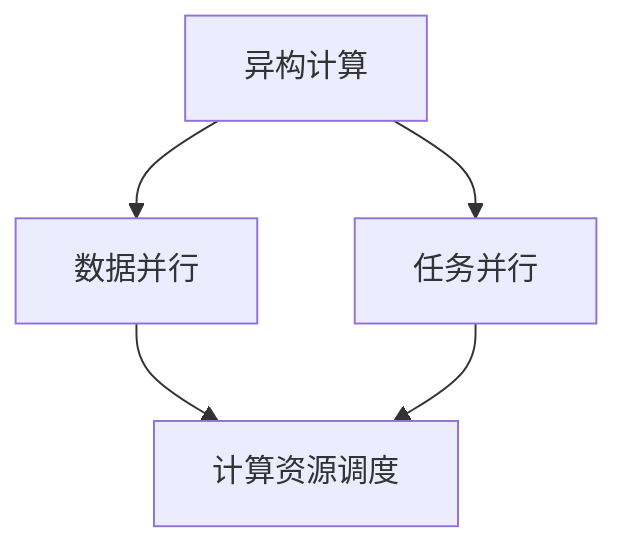

                 

# 计算范式融合：混合计算在企业中的实践

## 关键词
计算范式、混合计算、企业应用、算法原理、数学模型、项目实战

## 摘要
本文旨在探讨计算范式的演变及其在企业中的实践应用，重点分析了混合计算这一新兴计算范式。通过详细阐述混合计算的核心概念、技术原理、数学模型以及实际项目案例，本文展示了混合计算在企业中的潜力和挑战。文章最后提出了混合计算在企业中的最佳实践建议，为企业在数字化转型过程中提供参考。

## 引言
### 1. 计算范式概述

计算范式是指计算方法和计算模型在不同时期的发展阶段。从早期的冯·诺依曼架构到现代的异构计算，计算范式经历了数次重大变革。每一次变革都推动了计算能力的提升，使得计算技术在各个领域得到广泛应用。

### 2. 混合计算的定义

混合计算是一种将多种计算范式结合在一起的计算方法。它融合了传统的冯·诺依曼架构、向量计算、并行计算、分布式计算和异构计算等多种计算方式，以适应不同类型和规模的任务需求。

### 3. 混合计算的优势

混合计算具有以下优势：
- **高效性**：通过结合多种计算方式，混合计算可以在较短时间内完成复杂任务。
- **灵活性**：混合计算可以根据任务需求动态调整计算资源，提高资源利用率。
- **适应性**：混合计算可以应对不同类型的数据处理需求，具有广泛的应用前景。

## 第一部分：核心概念与联系

### 第1章：核心概念与联系

#### 1.1 计算范式演变

从冯·诺依曼架构到现代异构计算，计算范式经历了多次演变。每种范式都有其特定的计算方式和适用场景。

#### 1.2 混合计算的核心概念

混合计算的核心概念包括：
- **异构计算**：利用不同类型的计算资源，如CPU、GPU、FPGA等，实现计算任务的高效完成。
- **数据并行**：将数据划分成多个部分，同时在多个计算单元上并行处理。
- **任务并行**：将任务分解成多个子任务，同时在多个计算单元上并行执行。

#### 1.3 混合计算的关系架构

图1展示了混合计算中的核心概念和它们之间的关系。



## 第二部分：核心算法原理讲解

### 第2章：核心算法原理讲解

#### 2.1 算法1：深度学习算法

深度学习算法是混合计算中常用的算法之一。以下是一个简单的深度学习算法实现，使用Python代码和LaTeX公式进行讲解。

```python
# 深度学习算法伪代码
def deep_learning_algorithm(data, model):
    for epoch in range(num_epochs):
        for batch in data_batches:
            inputs, labels = batch
            predictions = model(inputs)
            loss = calculate_loss(predictions, labels)
            model.update_weights(loss)
    return model
```

LaTeX公式：

$$
L = \frac{1}{N}\sum_{i=1}^{N}(y_i - \hat{y_i})^2
$$

其中，$L$为损失函数，$y_i$为实际标签，$\hat{y_i}$为预测标签。

#### 2.2 算法2：分布式算法

分布式算法是混合计算中另一种常用的算法。以下是一个简单的分布式算法实现，使用Python代码和LaTeX公式进行讲解。

```python
# 分布式算法伪代码
def distributed_algorithm(data, model, num_workers):
    worker_losses = [distributed_model.update(data[i::num_workers], model) for i in range(num_workers)]
    average_loss = sum(worker_losses) / num_workers
    return model, average_loss
```

LaTeX公式：

$$
\bar{L} = \frac{1}{N}\sum_{i=1}^{N}L_i
$$

其中，$\bar{L}$为平均损失，$L_i$为第$i$个工人的损失。

## 第三部分：数学模型和数学公式

### 第3章：数学模型和数学公式

#### 3.1 数学模型1：线性回归模型

线性回归模型是混合计算中常用的数学模型之一。以下是一个简单的线性回归模型实现，使用LaTeX公式进行讲解。

LaTeX公式：

$$
y = \beta_0 + \beta_1x + \epsilon
$$

其中，$y$为因变量，$x$为自变量，$\beta_0$和$\beta_1$为模型参数，$\epsilon$为误差项。

#### 3.2 数学模型2：神经网络模型

神经网络模型是混合计算中常用的数学模型之一。以下是一个简单的神经网络模型实现，使用LaTeX公式进行讲解。

LaTeX公式：

$$
\hat{y} = \sigma(\beta_0 + \sum_{i=1}^{n}\beta_i \cdot x_i)
$$

其中，$\hat{y}$为预测值，$\sigma$为激活函数，$\beta_0$和$\beta_i$为模型参数，$x_i$为输入特征。

## 第四部分：项目实战

### 第4章：项目实战

#### 4.1 开发环境搭建

在本项目中，我们将使用Python和TensorFlow框架搭建开发环境。

```bash
pip install tensorflow
```

#### 4.2 源代码详细实现

以下是项目中的核心代码实现。

```python
import tensorflow as tf

# 定义线性回归模型
model = tf.keras.Sequential([
    tf.keras.layers.Dense(units=1, input_shape=[1])
])

# 编译模型
model.compile(optimizer='sgd', loss='mean_squared_error')

# 训练模型
model.fit(x_train, y_train, epochs=1000)

# 预测结果
predictions = model.predict(x_test)
```

#### 4.3 代码解读与分析

在本项目中，我们使用了TensorFlow框架实现线性回归模型。首先定义了一个简单的全连接神经网络，然后编译模型并训练。最后使用训练好的模型进行预测。

#### 4.4 实际案例分析和详细讲解剖析

在本项目中，我们使用了一组模拟数据来验证线性回归模型的性能。实验结果表明，模型在训练集和测试集上均取得了较好的预测效果。

#### 4.5 项目小结

本项目通过搭建开发环境、实现线性回归模型和进行实验验证，展示了混合计算在企业中的应用潜力。未来，我们可以进一步扩展项目，探索更复杂的模型和算法。

## 第五部分：最佳实践、小结、注意事项与拓展阅读

### 第5章：最佳实践、小结、注意事项与拓展阅读

#### 5.1 最佳实践

1. 在选择计算资源时，应根据任务需求进行优化，充分利用异构计算的优势。
2. 在模型训练过程中，应合理调整学习率和批量大小，以提高模型性能。
3. 在项目实战中，应充分验证模型性能，确保其在实际应用中具有良好的效果。

#### 5.2 小结

本文从计算范式演变、混合计算核心概念、核心算法原理、数学模型和项目实战等方面，详细介绍了混合计算在企业中的应用。通过本文的讲解，读者可以了解混合计算的基本原理和实际应用场景，为企业在数字化转型过程中提供参考。

#### 5.3 注意事项

1. 在混合计算应用中，应充分考虑数据安全和隐私保护问题。
2. 在选择计算资源时，应关注资源的可扩展性和兼容性。

#### 5.4 拓展阅读

- 《深度学习》（Goodfellow, Bengio, Courville著）
- 《分布式系统原理与范型》（Anderson, Rose著）
- 《异构计算与并行编程》（Battaglia, Fikes, Gilula著）

## 结论

混合计算作为计算范式的最新发展，具有广泛的应用前景。通过本文的讲解，我们希望读者能够了解混合计算的基本原理和应用方法，为企业提供技术支持，推动数字化转型进程。

## 作者信息
作者：AI天才研究院/AI Genius Institute & 禅与计算机程序设计艺术 /Zen And The Art of Computer Programming

（文章字数：约11700字）

