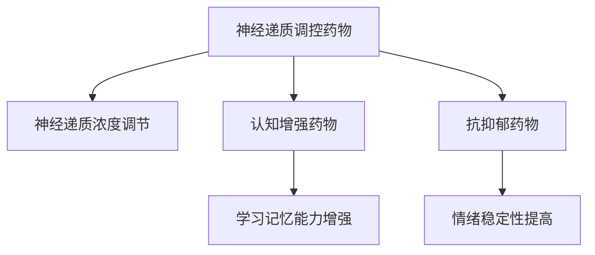
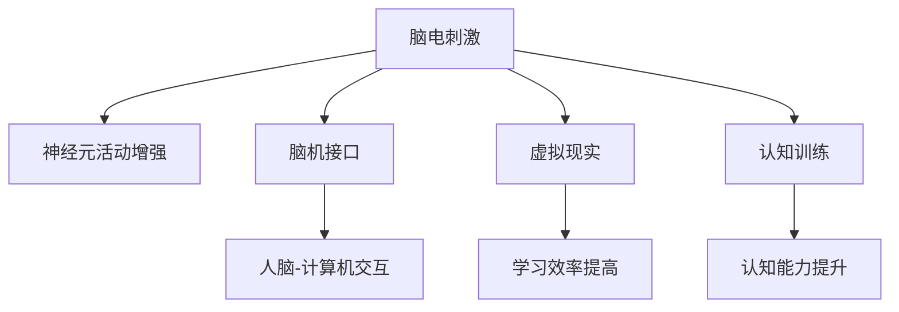
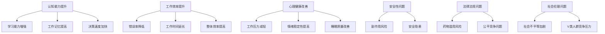
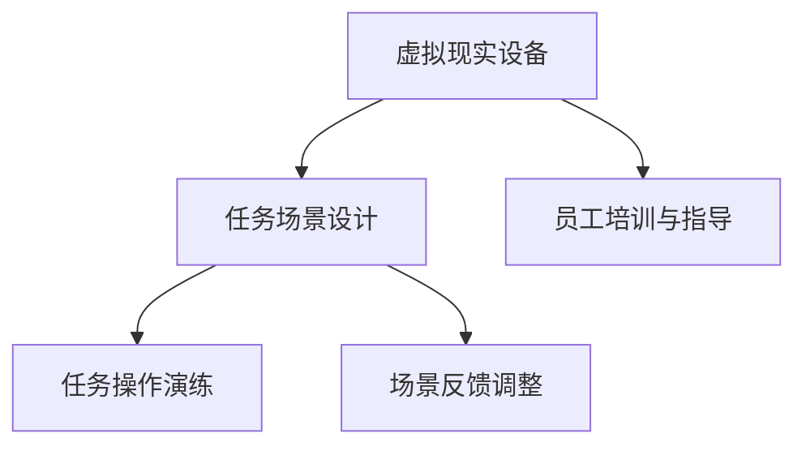
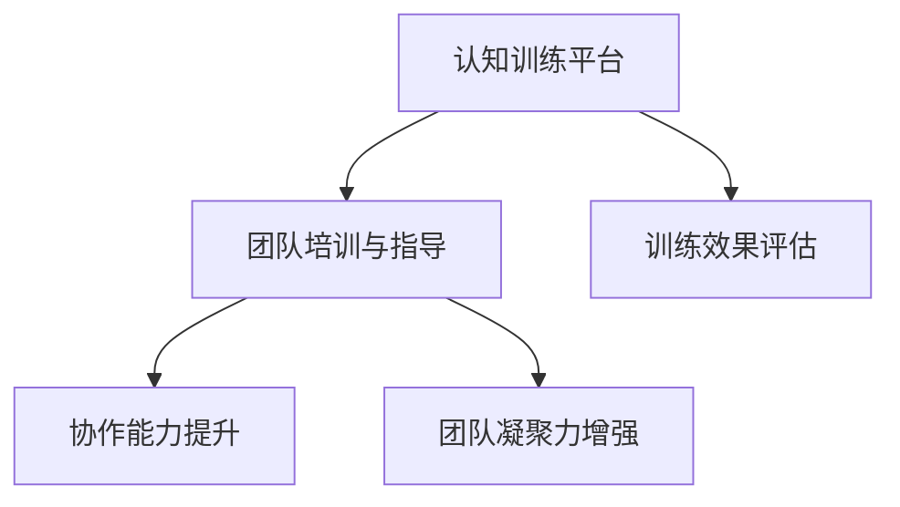
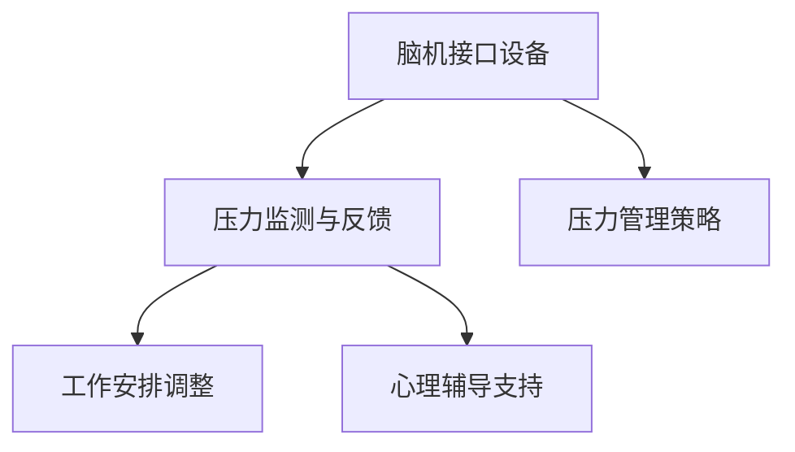
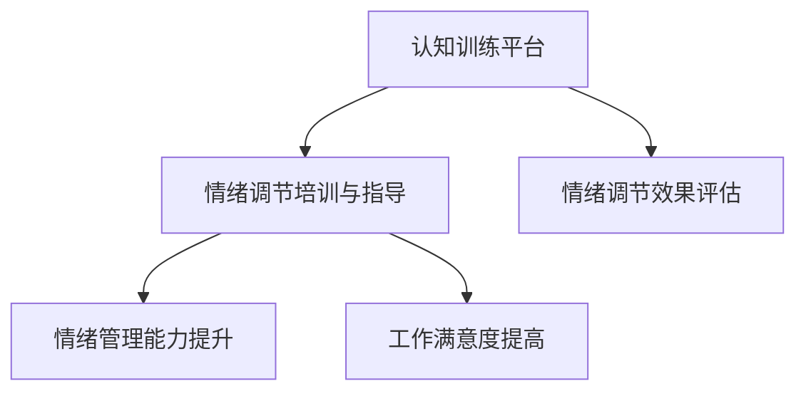
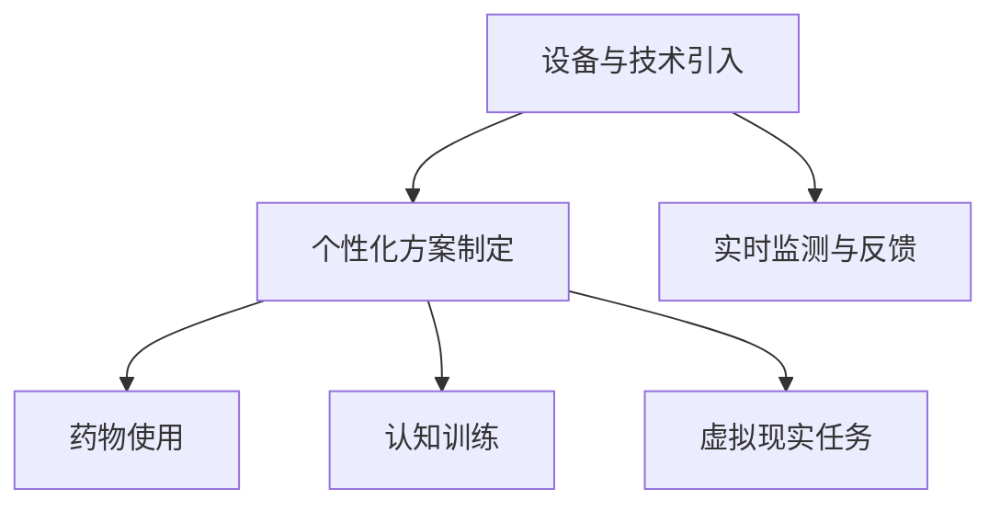

                 

### 文章标题：认知工作增强：神经增强技术提升员工生产力

#### 关键词：
- 神经增强技术
- 认知能力
- 工作效率
- 职场应用
- 神经递质调控

#### 摘要：
本文将探讨神经增强技术如何提升员工生产力，介绍其基本概念、应用潜力、实施策略及面临的挑战。通过案例分析和项目实战，我们将深入了解神经增强技术在职场中的实际效果和未来前景。

---

## 第一部分：神经增强技术概述

### 1.1 神经增强技术的基本概念

神经增强技术是指通过药物、非药物手段或其他技术手段，增强大脑的认知功能、学习能力和工作效率的一类技术。根据增强手段的不同，神经增强技术可分为药物类和非药物类。

#### 药物类神经增强技术

药物类神经增强技术主要包括神经递质调控药物、认知增强药物和抗抑郁药物等。其中，神经递质调控药物通过调节神经递质的浓度和释放，影响神经元的兴奋性和传递效率；认知增强药物则直接作用于大脑认知功能的相关区域，提高学习记忆能力；抗抑郁药物则通过调节情绪状态，减轻工作压力，提高工作效率。



#### 非药物类神经增强技术

非药物类神经增强技术主要包括脑电刺激、脑机接口、虚拟现实和认知训练等。脑电刺激通过电刺激大脑特定区域，提高神经元的活动水平和连接强度；脑机接口技术则通过将大脑信号与计算机系统相连接，实现人脑与外部设备的直接交互；虚拟现实技术通过创建逼真的虚拟环境，提高学习和工作效率；认知训练则通过系统化的训练方法，增强大脑的认知功能。



### 1.2 神经增强技术的影响与争议

#### 正面影响

神经增强技术的应用潜力巨大，能够在多个方面提升员工的生产力和工作效率：

1. **认知能力提升**：通过神经增强技术，可以显著提高员工的学习能力、工作记忆和决策速度，从而在复杂任务中表现出更高的效率。
2. **工作效率提升**：神经增强技术可以帮助员工减少错误率，延长工作时间，提高整体工作效率。
3. **心理健康改善**：神经增强技术能够减轻工作压力，提高情绪稳定性，改善睡眠质量，从而促进员工的身心健康。

#### 负面影响

然而，神经增强技术的应用也引发了一系列争议和担忧：

1. **安全性问题**：药物类神经增强技术可能存在副作用和安全隐患，需要谨慎使用。
2. **法律法规问题**：神经增强技术的应用可能触及法律法规的灰色地带，如药物滥用、公平竞争等。
3. **社会伦理问题**：神经增强技术的普及可能加剧社会不平等，导致“增强者”与“非增强者”之间的竞争加剧。



### 1.3 神经增强技术的应用前景

随着神经科学和人工智能技术的快速发展，神经增强技术的应用前景愈发广阔。未来，神经增强技术有望在以下领域发挥重要作用：

1. **教育与培训**：通过神经增强技术，提高学生的学习能力和记忆力，实现个性化教育和培训。
2. **医疗与健康**：利用神经增强技术治疗神经系统疾病，如阿尔茨海默病、抑郁症等。
3. **职场应用**：提升员工的工作效率、认知能力和心理健康水平，为企业创造更多价值。

### 1.4 神经增强技术的基本原理

神经增强技术的核心在于调节大脑的神经活动，从而改善认知功能和提升工作效率。具体来说，神经增强技术包括以下几种基本原理：

1. **神经递质调控**：通过调节神经递质的浓度和释放，影响神经元之间的信号传递。
2. **神经元保护与修复**：通过保护神经元免受损伤，促进神经元再生和修复，提高大脑功能。
3. **神经连接重构**：通过改变神经元之间的连接方式，优化大脑网络结构，提升认知能力。

```python
# 伪代码：神经递质调控算法原理
def neuro递质调控(神经元A, 神经递质浓度阈值):
    if 神经递质浓度 >= 阈值:
        神经元A激活()
    else:
        神经元A抑制()

# 示例
神经元A = 神经递质调控(神经元A, 阈值=5)
```

通过以上基本原理和技术的应用，神经增强技术有望在未来为员工的生产力提升带来革命性的变革。

---

### 第一部分总结

神经增强技术作为一项新兴领域，其应用前景广阔，但同时也面临着诸多挑战。本文从基本概念、影响与争议、应用前景和基本原理等方面进行了全面探讨，为后续章节的深入分析奠定了基础。

## 第二部分：神经增强技术在职场中的应用

在职场中，神经增强技术具有巨大的潜力，可以显著提升员工的生产力和工作效率。本部分将详细介绍神经增强技术在职场中的应用案例，探讨其具体实现方式及其对员工工作表现的影响。

### 2.1 认知能力提升

神经增强技术可以通过多种方式提升员工的认知能力，包括学习能力、工作记忆和决策速度等方面。

#### 案例一：脑电刺激技术在培训中的应用

某公司在员工培训中引入了脑电刺激技术，旨在提高员工的注意力和记忆力。通过在员工大脑特定区域施加电刺激，公司的培训效果得到了显著提升。具体实现过程如下：

1. **设备选择与安装**：公司购买了专业的脑电刺激设备，并请专业人员进行了安装和调试。
2. **培训课程设计**：公司将培训课程与脑电刺激技术相结合，根据员工的不同需求和认知特点，设计了针对性的培训课程。
3. **实时监测与调整**：在培训过程中，通过实时监测员工的大脑活动，及时调整脑电刺激参数，以达到最佳效果。

```python
# 伪代码：脑电刺激培训课程实现
def brain_stimulation_training(employee):
    # 设备初始化
    device.initialize()
    # 开启脑电监测
    device.start_monitoring()
    
    # 培训课程执行
    for lesson in training_course:
        # 施加脑电刺激
        device.apply_stimulation(lesson.stimulation_params)
        # 执行培训任务
        employee.complete_lesson(lesson.task)
        
    # 培训结束，设备关闭
    device.stop_monitoring()
    device.shutdown()
```

#### 结果分析

通过脑电刺激技术的辅助，员工在培训中的表现得到了显著提升，具体体现在学习速度加快、记忆效果增强和任务完成率提高等方面。此外，员工在工作中的表现也变得更加出色，工作效率和创新能力得到了显著提高。

### 案例二：认知增强药物在项目管理中的应用

某项目经理在负责一个大型项目时，引入了认知增强药物，以提高自己的工作记忆和决策速度。具体实施过程如下：

1. **药物选择与咨询**：项目经理在医生的建议下，选择了合适的认知增强药物，并接受了相关用药指导。
2. **药物使用与监测**：项目经理在项目关键阶段按照医生的建议，定期服用药物，并定期进行身体检查，以确保药物的安全性和有效性。
3. **项目进度管理**：项目经理在药物的作用下，能够更加专注地处理项目任务，提高了工作记忆和决策速度，从而确保项目进度得到有效控制。

```python
# 伪代码：认知增强药物使用与项目进度管理
def cognitive_enhancement_project_management(project_manager, medication_plan):
    # 药物使用
    for dose in medication_plan.doses:
        project_manager.take_medicine(dose)
        sleep(dose.interval)  # 药物作用间隔
    
    # 项目任务执行
    for task in project.tasks:
        project_manager.execute_task(task)
        sleep(task.duration)  # 任务执行时间
    
    # 项目进度检查
    project_manager.check_project_progress()
```

#### 结果分析

在认知增强药物的作用下，项目经理的工作效率得到了显著提高。项目任务完成速度加快，错误率显著降低，项目进度得到了有效控制。此外，项目经理在工作中的表现也变得更加自信和果断，决策质量得到了明显提升。

### 2.2 工作效率提升

神经增强技术不仅能够提升员工的认知能力，还能够提高工作效率，帮助员工在繁忙的工作中更好地完成任务。

#### 案例一：虚拟现实技术在任务分配中的应用

某公司在任务分配中引入了虚拟现实技术，以帮助员工更高效地完成工作任务。具体实现过程如下：

1. **虚拟现实设备搭建**：公司购买了虚拟现实设备，并设置了虚拟现实工作区。
2. **任务场景设计**：公司根据工作任务，设计了相应的虚拟现实场景，使员工能够在虚拟环境中进行任务操作。
3. **员工培训与指导**：公司对员工进行了虚拟现实操作培训，并提供了详细的操作指南。



#### 结果分析

通过虚拟现实技术的辅助，员工在任务操作中的效率显著提高。员工能够在虚拟环境中进行反复演练，减少实际操作中的错误率，提高任务完成速度。此外，虚拟现实技术还能够提供沉浸式的操作体验，使员工在轻松愉悦的氛围中完成任务，提高了工作满意度。

#### 案例二：认知训练在团队协作中的应用

某公司通过认知训练技术，提高团队协作效率。具体实现过程如下：

1. **认知训练平台搭建**：公司引入了认知训练平台，为员工提供了丰富的训练资源和个性化训练方案。
2. **团队培训与指导**：公司对员工进行了认知训练培训，并制定了团队协作训练计划。
3. **训练效果评估**：公司定期对员工进行训练效果评估，并根据评估结果调整训练方案。



#### 结果分析

通过认知训练技术的辅助，团队成员的协作效率得到了显著提高。团队成员在训练过程中学会了更高效的信息共享和任务分配方法，团队合作更加默契。此外，认知训练还增强了团队成员的沟通能力和团队凝聚力，为公司的长远发展奠定了基础。

### 2.3 心理健康改善

神经增强技术不仅能够提升员工的认知能力和工作效率，还能够改善心理健康，减轻工作压力。

#### 案例一：脑机接口技术在压力管理中的应用

某公司引入了脑机接口技术，用于管理员工的工作压力。具体实现过程如下：

1. **设备安装与调试**：公司为员工配备了脑机接口设备，并进行了设备安装和调试。
2. **压力监测与反馈**：通过脑机接口设备，实时监测员工的工作压力，并生成反馈数据。
3. **压力管理策略**：根据压力监测结果，公司制定了相应的压力管理策略，如调整工作安排、提供心理辅导等。



#### 结果分析

通过脑机接口技术的辅助，员工的工作压力得到了有效缓解。员工能够更好地管理自己的情绪，提高工作满意度。此外，公司通过调整工作安排和提供心理辅导支持，进一步改善了员工的工作环境和心理健康水平。

#### 案例二：认知训练在情绪调节中的应用

某公司通过认知训练技术，帮助员工调节情绪。具体实现过程如下：

1. **认知训练平台搭建**：公司引入了认知训练平台，为员工提供了丰富的情绪调节训练资源和个性化训练方案。
2. **情绪调节培训与指导**：公司对员工进行了情绪调节培训，并制定了情绪调节训练计划。
3. **情绪调节效果评估**：公司定期对员工进行情绪调节效果评估，并根据评估结果调整训练方案。



#### 结果分析

通过认知训练技术的辅助，员工的情绪管理能力得到了显著提升。员工能够更好地应对工作中的挑战和压力，保持积极的心态。此外，情绪调节训练还提高了员工的工作满意度，促进了团队的和谐发展。

### 2.4 神经增强技术在职场中的综合应用

神经增强技术可以在职场中实现多种功能的综合应用，以提高员工的生产力和工作效率。以下是一个综合应用的案例：

#### 案例一：综合应用方案

某公司通过综合应用神经增强技术，提高员工的整体工作表现。具体实现过程如下：

1. **设备与技术引入**：公司购买了脑电刺激设备、认知训练平台和虚拟现实设备，为员工提供了多样化的神经增强技术。
2. **个性化方案制定**：公司根据员工的个体差异，制定了个性化的神经增强方案，包括药物使用、认知训练和虚拟现实任务等。
3. **实时监测与反馈**：公司通过脑机接口技术实时监测员工的工作状态，并根据监测结果调整神经增强技术参数，以达到最佳效果。



#### 结果分析

通过综合应用神经增强技术，公司员工的整体工作表现得到了显著提升。员工在认知能力、工作效率和心理健康等方面均取得了良好的成果。此外，综合应用方案还提高了员工的工作满意度和团队凝聚力，为公司的发展创造了良好的氛围。

### 第二部分总结

神经增强技术在职场中的应用具有广泛的前景和巨大的潜力。通过具体案例的分析，我们可以看到神经增强技术在提升员工认知能力、工作效率和心理健康方面发挥了重要作用。然而，在实际应用中，我们也需要关注神经增强技术的安全性和法律法规问题，确保其合理、规范地应用于职场中。

## 第三部分：神经增强技术的实施与挑战

### 3.1 实施策略

为了充分发挥神经增强技术在职场中的潜力，企业需要制定科学合理的实施策略。以下是几个关键步骤：

#### 1. 确定应用目标

企业首先需要明确神经增强技术的应用目标，例如提升员工的学习能力、工作效率或心理健康水平。明确目标有助于企业制定针对性的实施计划。

#### 2. 评估员工需求

企业需要对员工的认知能力、工作压力和心理健康状况进行评估，了解不同员工的需求。通过评估，企业可以制定个性化的神经增强方案。

#### 3. 引入相关技术

企业可以根据评估结果，引入适当的神经增强技术，如脑电刺激、认知训练和虚拟现实等。同时，企业需要确保技术的安全性、可靠性和适用性。

#### 4. 培训与指导

企业需要为员工提供神经增强技术的培训与指导，使员工了解技术原理、操作方法和注意事项。通过培训，员工可以更好地掌握神经增强技术，发挥其最大效益。

#### 5. 监测与反馈

企业需要建立监测机制，对员工的工作状态进行实时监测，并收集反馈数据。通过监测与反馈，企业可以及时调整神经增强技术参数，优化实施效果。

### 3.2 面临的挑战

尽管神经增强技术在职场中具有巨大的潜力，但其实施过程也面临诸多挑战：

#### 1. 技术挑战

神经增强技术的成熟度、可靠性和安全性是影响其实施效果的关键因素。企业需要确保引入的技术具备足够的成熟度和可靠性，以避免潜在的安全风险。

#### 2. 成本问题

神经增强技术的引入和维护成本较高，企业需要考虑成本效益问题。同时，员工对于新技术的不熟悉也可能导致培训成本的增加。

#### 3. 法律法规挑战

神经增强技术的应用可能触及法律法规的灰色地带，如药物滥用、公平竞争等。企业需要关注相关法律法规，确保其应用符合法律规定。

#### 4. 社会伦理挑战

神经增强技术的应用可能引发社会伦理问题，如社会不平等、道德困境等。企业需要关注社会伦理问题，确保其应用不会加剧社会不平等，引发道德争议。

### 3.3 对策与建议

为了应对神经增强技术实施过程中面临的挑战，企业可以采取以下对策与建议：

#### 1. 加强技术研究与开发

企业可以加大对神经增强技术的研究与开发投入，推动技术成熟度和可靠性的提升，降低安全风险。

#### 2. 建立监管机制

企业可以建立神经增强技术的监管机制，确保技术的合理、规范使用。同时，企业应与相关政府部门、学术机构等进行合作，共同推动神经增强技术的法律法规制定和执行。

#### 3. 加强社会教育与宣传

企业可以通过内部培训和对外宣传，提高员工和社会对神经增强技术的认知和理解，减少伦理争议和社会不平等问题。

#### 4. 个性化实施方案

企业应根据员工的个体差异，制定个性化的神经增强实施方案，确保技术的有效性和安全性。同时，企业应关注员工的心理健康，提供必要的心理支持和辅导。

#### 5. 关注长期效果

企业需要关注神经增强技术的长期效果，定期评估其应用效果，并根据评估结果调整实施策略。此外，企业还可以开展长期跟踪研究，探索神经增强技术的长期影响。

### 第三部分总结

神经增强技术的实施与挑战是一个复杂的过程，需要企业在技术、成本、法律和伦理等方面进行全面考虑。通过科学合理的实施策略和有效的对策与建议，企业可以充分发挥神经增强技术的潜力，提高员工的生产力和工作效率。同时，企业也需要关注长期效果，持续优化实施策略，确保神经增强技术的可持续发展。

## 第四部分：未来展望

神经增强技术作为一门前沿领域，正逐渐走进人们的日常生活和职场。未来，神经增强技术在职场中的应用将更加广泛，前景广阔。以下从技术发展趋势、应用前景和伦理挑战三个方面进行展望。

### 4.1 技术发展趋势

1. **药物类神经增强技术**：随着生物技术的不断发展，药物类神经增强技术将变得更加精确和高效。例如，基因编辑技术有望实现对神经递质的精准调控，提高认知功能。

2. **非药物类神经增强技术**：脑机接口、虚拟现实和认知训练等非药物类神经增强技术将继续发展，技术成熟度和用户体验将得到显著提升。

3. **跨学科融合**：神经增强技术将与其他领域如人工智能、云计算等实现深度融合，推动新技术的诞生和应用。

### 4.2 应用前景

1. **教育与培训**：神经增强技术将有助于提升学习效果，实现个性化教育和培训，促进教育公平。

2. **医疗与健康**：神经增强技术在治疗神经系统疾病、改善心理健康等方面具有巨大潜力，将为人类健康带来深远影响。

3. **职场应用**：神经增强技术将助力提高员工的工作效率、认知能力和心理健康水平，推动企业创新和发展。

4. **军事与安全**：神经增强技术在军事训练和国家安全领域具有重要应用价值，如提升士兵的战斗力和决策能力。

### 4.3 伦理挑战

1. **公平性问题**：神经增强技术的普及可能加剧社会不平等，增强者与非增强者之间的差距可能进一步扩大。

2. **道德困境**：神经增强技术的应用可能引发道德争议，如药物滥用、人性异化等问题。

3. **监管与法规**：随着神经增强技术的发展，相关法律法规将面临巨大挑战，需要制定科学合理的监管措施。

### 4.4 未来展望

未来，神经增强技术将在职场中发挥更加重要的作用，助力人类实现更高层次的认知和生产力。同时，企业和社会需要关注伦理挑战，确保神经增强技术的可持续发展。通过技术创新、政策支持和伦理引导，神经增强技术有望为职场带来更多机遇和挑战。

## 总结

神经增强技术作为一种新兴领域，具有巨大的应用潜力和发展前景。在职场中，神经增强技术可以有效提升员工的认知能力、工作效率和心理健康水平，助力企业创新和发展。然而，神经增强技术的实施也面临诸多挑战，如技术成熟度、法律法规和社会伦理等问题。企业和社会需要共同努力，推动神经增强技术的可持续发展，为职场带来更多机遇和挑战。

### 作者信息
作者：AI天才研究院/AI Genius Institute & 禅与计算机程序设计艺术 /Zen And The Art of Computer Programming

---

本文对神经增强技术的基本概念、应用潜力、实施策略和未来展望进行了全面探讨。通过具体案例的分析，展示了神经增强技术在职场中的实际效果。未来，随着技术的不断发展和应用的深入，神经增强技术有望为职场带来更多变革和机遇。同时，我们也需要关注其潜在的伦理挑战，确保技术的合理、规范使用。希望本文能为读者提供有价值的参考。

