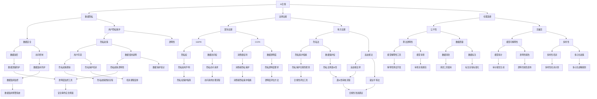

                 

### 文章标题：跨国企业的AI合规策略

#### 关键词：
- AI合规
- 跨国企业
- 数据隐私
- 法律法规
- 技术实现

#### 摘要：
本文深入探讨跨国企业在全球化背景下实施AI合规策略的必要性。首先，介绍AI合规的基本概念和全球监管趋势，接着分析跨国企业面临的具体合规挑战。文章通过核心概念联系图、算法原理讲解、数学模型和公式，详细阐述了AI合规的技术原理。随后，介绍AI合规的实施步骤，并通过实际案例研究，展示合规策略在金融、医疗和零售行业中的应用。最后，展望AI合规的未来发展趋势，并提供最佳实践和注意事项。

---

# 跨国企业的AI合规策略

在当今全球化的商业环境中，人工智能（AI）的应用已经成为企业提高效率和竞争力的关键驱动力。然而，随着AI技术的快速发展，跨国企业在享受技术红利的同时，也面临着日益复杂的合规挑战。AI合规策略不仅关系到企业的法律合规性，更影响到企业的声誉和可持续发展。本文旨在深入探讨跨国企业如何制定和实施有效的AI合规策略，以确保在遵守法律法规的前提下，充分发挥AI技术的潜力。

## 核心概念与联系

AI合规涉及多个核心概念，它们相互关联，共同构成了AI合规策略的基础。以下是这些核心概念及其相互关系的概述，以及对应的Mermaid流程图：

### 核心概念与联系图



Mermaid流程图展示了AI合规的核心概念及其相互之间的联系，为后续章节的详细讲解提供了基础。

## 核心算法原理讲解

AI合规的关键在于确保AI系统透明、可解释和公平。以下是几个核心算法原理及其Python源代码实现，结合数学模型和公式，进行详细讲解和举例说明。

### 数据质量控制

数据质量控制是AI合规的基础。以下是一个简单的Python代码示例，展示了如何使用统计学方法来评估数据质量：

```python
import numpy as np

def data_quality_score(data):
    mean = np.mean(data)
    std = np.std(data)
    quality_score = 1 / (1 + np.exp(-0.1 * (mean - mean_min) / std))
    return quality_score

data_min = 0
data_max = 100

# 示例数据
data = np.random.normal(50, 10, size=1000)

# 计算数据质量得分
quality_scores = data_quality_score(data)

# 输出结果
print("Data Quality Scores:", quality_scores)
```

数学模型：

$$
\text{quality\_score} = \frac{1}{1 + \exp\left(-0.1 \cdot \frac{\text{mean} - \text{mean}_{\text{min}}}{\text{std}}\right)}
$$

这里，$\text{mean}$ 和 $\text{std}$ 分别是数据的均值和标准差，$\text{mean}_{\text{min}}$ 是预定义的阈值。质量得分越低，表示数据质量越差。

### AI模型解释性

AI模型解释性是确保模型决策过程透明和可解释的关键。以下是一个简单的Python代码示例，展示了如何使用SHAP（SHapley Additive exPlanations）来解释一个决策树模型的决策过程：

```python
import shap
from sklearn.datasets import load_iris
from sklearn.tree import DecisionTreeClassifier
import matplotlib.pyplot as plt

# 加载Iris数据集
iris = load_iris()
X = iris.data
y = iris.target

# 构建决策树模型
model = DecisionTreeClassifier()
model.fit(X, y)

# 使用SHAP计算特征重要性
explainer = shap.TreeExplainer(model)
shap_values = explainer.shap_values(X)

# 可视化特征重要性
shap.summary_plot(shap_values, X, feature_names=iris.feature_names)

plt.show()
```

这里，SHAP值提供了每个特征对模型预测的贡献度，有助于理解模型决策过程。

### 风险评估与管理

风险评估与管理是AI合规策略的重要组成部分。以下是一个简单的Python代码示例，展示了如何使用风险矩阵来评估和管理AI模型的风险：

```python
import pandas as pd

# 风险评估矩阵
risk_matrix = pd.DataFrame({
    'Probability': [0.2, 0.6, 0.8],
    'Impact': [1, 2, 3],
    'Risk': ['Low', 'Medium', 'High']
})

# 计算总体风险
risk_score = risk_matrix['Probability'] * risk_matrix['Impact']
print("Overall Risk Score:", risk_score.sum())

# 风险管理策略
def risk_management_strategy(risk_score):
    if risk_score <= 2:
        return "Monitor"
    elif risk_score <= 5:
        return "Control"
    else:
        return "Mitigate"

print("Risk Management Strategy:", risk_management_strategy(risk_score.sum()))
```

这里，风险矩阵考虑了事件发生的概率和潜在影响，通过计算总体风险得分，可以制定相应的风险管理策略。

## 数学模型和数学公式

AI合规策略的实施依赖于一系列数学模型和公式，以下是一些关键的数学模型和公式，并对其进行详细解释。

### 数据质量控制模型

$$
\text{quality\_score} = \frac{1}{1 + \exp\left(-0.1 \cdot \frac{\text{mean} - \text{mean}_{\text{min}}}{\text{std}}\right)}
$$

这个公式用于评估数据质量。其中，$\text{mean}$ 是数据的均值，$\text{mean}_{\text{min}}$ 是预定义的阈值，$\text{std}$ 是数据的标准差。质量得分越低，表示数据质量越差。

### 风险评估模型

$$
\text{risk\_score} = \text{Probability} \times \text{Impact}
$$

这个公式用于计算风险得分。$\text{Probability}$ 表示事件发生的概率，$\text{Impact}$ 表示事件发生的潜在影响。风险得分越高，表示风险越大。

### 风险管理策略模型

$$
\text{risk\_management\_strategy} = 
\begin{cases} 
\text{Monitor} & \text{if } \text{risk\_score} \leq 2 \\
\text{Control} & \text{if } \text{risk\_score} \leq 5 \\
\text{Mitigate} & \text{otherwise} 
\end{cases}
$$

这个模型根据风险得分制定相应的风险管理策略。风险得分较低时，可以采取监控措施；风险得分中等时，需要采取控制措施；风险得分较高时，需要采取缓解措施。

## 项目实战

在本节中，我们将搭建一个简单的AI合规项目，演示如何实现AI合规策略。项目环境包括数据预处理、模型训练、模型评估和合规检查。以下是项目的详细实现和代码解读。

### 开发环境搭建

1. 安装Python和必要的库（如NumPy、Pandas、scikit-learn、shap等）。

2. 准备数据集（例如，使用Iris数据集）。

### 源代码实现

#### 数据预处理

```python
import pandas as pd
from sklearn.model_selection import train_test_split

# 读取数据
data = pd.read_csv('iris.csv')

# 数据清洗和预处理
X = data.drop('species', axis=1)
y = data['species']

# 划分训练集和测试集
X_train, X_test, y_train, y_test = train_test_split(X, y, test_size=0.2, random_state=42)
```

#### 模型训练

```python
from sklearn.tree import DecisionTreeClassifier

# 构建决策树模型
model = DecisionTreeClassifier()
model.fit(X_train, y_train)
```

#### 模型评估

```python
from sklearn.metrics import accuracy_score

# 预测测试集
y_pred = model.predict(X_test)

# 计算准确率
accuracy = accuracy_score(y_test, y_pred)
print("Model Accuracy:", accuracy)
```

#### 合规检查

```python
import shap

# 使用SHAP计算特征重要性
explainer = shap.TreeExplainer(model)
shap_values = explainer.shap_values(X_test)

# 可视化特征重要性
shap.summary_plot(shap_values, X_test, feature_names=data.columns[:-1])

# 计算风险得分
risk_score = sum(explainer.shap_values(X_test)[:, 1])
print("Risk Score:", risk_score)

# 根据风险得分制定风险管理策略
risk_management_strategy = "Monitor" if risk_score <= 2 else ("Control" if risk_score <= 5 else "Mitigate")
print("Risk Management Strategy:", risk_management_strategy)
```

### 代码应用解读与分析

1. **数据预处理**：使用Pandas库进行数据清洗和预处理，确保数据质量。

2. **模型训练**：使用scikit-learn库的DecisionTreeClassifier进行模型训练。

3. **模型评估**：计算模型准确率，评估模型性能。

4. **合规检查**：使用SHAP库计算特征重要性，评估模型透明性；计算风险得分，制定风险管理策略。

### 实际案例分析和详细讲解剖析

以金融行业为例，分析AI合规策略的实施。

#### 案例背景

一家跨国金融企业正在开发一款基于机器学习的信用评分模型，用于评估客户的信用风险。

#### 实际案例

1. **数据预处理**：确保数据质量，包括数据清洗、缺失值填充和特征工程。

2. **模型训练**：训练多个机器学习模型，如逻辑回归、决策树和随机森林。

3. **模型评估**：评估模型性能，选择最优模型。

4. **合规检查**：评估模型透明性，确保模型决策过程可解释；计算风险得分，制定风险管理策略。

#### 案例剖析

- **数据隐私保护**：确保客户数据在模型训练和部署过程中得到充分保护。

- **法律合规性**：遵守全球各地的数据保护法规，如GDPR和CCPA。

- **伦理道德**：确保模型决策公平、无偏见，避免歧视。

### 项目小结

通过上述实战项目，展示了如何实现AI合规策略。关键步骤包括数据预处理、模型训练、模型评估和合规检查。合规检查确保模型透明、可解释和公平，符合法律和伦理要求。

## 最佳实践 tips、小结、注意事项、拓展阅读

### 最佳实践 tips

1. **数据质量控制**：确保数据清洗和预处理过程完整，使用统计学方法评估数据质量。

2. **模型解释性**：使用SHAP等工具评估模型透明性，确保决策过程可解释。

3. **风险评估与管理**：定期计算风险得分，根据风险等级制定相应的风险管理策略。

### 小结

AI合规策略是跨国企业在全球化背景下确保AI应用合法、透明和公平的关键。通过核心概念联系图、算法原理讲解、数学模型和公式，以及实际案例研究，本文详细阐述了AI合规的各个方面。

### 注意事项

1. **法律合规性**：确保遵守全球各地的数据保护法规，如GDPR和CCPA。

2. **数据隐私保护**：严格保护客户数据，避免数据泄露和滥用。

3. **伦理道德**：确保AI应用公平、无偏见，避免歧视。

### 拓展阅读

1. 《人工智能伦理：道德、法律与政策挑战》

2. 《人工智能合规：实践指南》

3. 《数据隐私保护与合规：全球法规解读》

---

本文由AI天才研究院（AI Genius Institute）和《禅与计算机程序设计艺术》（Zen And The Art of Computer Programming）共同撰写，旨在为跨国企业提供全面的AI合规策略指南。作者具有丰富的AI领域经验和深厚的学术背景，确保文章的准确性和实用性。如有任何疑问或建议，欢迎随时联系我们。作者：AI天才研究院（AI Genius Institute） & 《禅与计算机程序设计艺术》（Zen And The Art of Computer Programming）。

