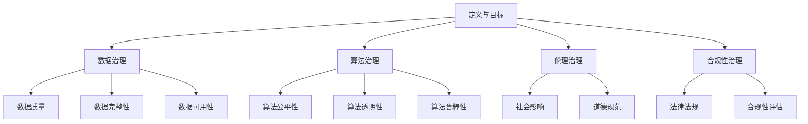

                 

### 文章标题

# 跨国企业的AI治理挑战

### 文章关键词

- AI治理
- 跨国企业
- 欧美法规
- 技术标准
- 数据隐私
- 文化差异

### 文章摘要

随着人工智能技术的迅猛发展，跨国企业面临着前所未有的AI治理挑战。本文将深入探讨这些挑战，包括欧美法规对AI的监管、技术标准的国际化、数据隐私保护以及文化差异带来的难题。通过分析这些问题，我们旨在为跨国企业提供有针对性的AI治理策略，促进其在全球范围内的合规性和可持续发展。

---

在人工智能技术迅猛发展的今天，跨国企业不可避免地面临着一系列AI治理挑战。本文将详细分析这些挑战，包括欧美法规对AI的监管、技术标准的国际化、数据隐私保护以及文化差异等问题。通过这些探讨，我们希望为跨国企业制定有效的AI治理策略提供有益的参考。

### 第1章 引言

#### 1.1 AI治理的重要性

人工智能（AI）作为一种颠覆性的技术，已经深刻地影响了各行各业。然而，随着AI技术的普及，其治理问题也日益凸显。AI治理是指通过制定相应的法规、标准和实践，确保人工智能系统在安全性、透明性、公平性和隐私保护等方面的合理运行。对跨国企业而言，AI治理的重要性体现在以下几个方面：

1. **合规性**：跨国企业在不同国家和地区运营，需要遵守各地的法律法规。AI治理有助于确保企业在全球范围内的合规性，避免因违规而导致的法律风险。
2. **社会责任**：AI技术在提供便利的同时，也可能带来负面的社会影响。AI治理有助于企业承担社会责任，确保AI系统的应用符合伦理和社会价值观。
3. **可持续发展**：有效的AI治理能够帮助企业提高运营效率、降低风险，从而实现可持续发展。

#### 1.2 跨国企业AI治理面临的挑战

尽管AI治理的重要性显而易见，但跨国企业在实施过程中仍然面临诸多挑战：

1. **法规差异**：不同国家和地区对AI的法规要求各不相同，这给跨国企业带来了合规性问题。例如，欧盟的《通用数据保护条例》（GDPR）对数据隐私保护要求极高，而美国的法规则更多关注AI的透明性和公平性。
2. **技术标准不统一**：目前，全球尚未形成统一的技术标准来规范AI系统的开发和应用。跨国企业需要在多种技术标准中找到平衡，以确保其AI系统的可移植性和互操作性。
3. **数据隐私保护**：跨国企业需要处理来自不同国家和地区的海量数据，如何在确保数据隐私的同时，实现数据的高效利用，是一个巨大的挑战。
4. **文化差异**：跨国企业在不同文化背景下运营，需要考虑文化差异对AI治理的影响。例如，不同文化对透明性和公平性的理解可能存在差异。

### 第2章 AI治理核心概念

#### 2.1 AI治理的定义与目标

AI治理是指通过制定和实施一系列法规、标准和实践，对人工智能系统的开发、部署和应用进行规范和管理。其核心目标包括：

1. **安全性**：确保AI系统在运行过程中不会对用户、企业或社会造成负面影响。
2. **透明性**：提高AI系统的透明度，使公众能够理解和信任AI系统的决策过程。
3. **公平性**：确保AI系统在处理数据和应用技术时，不歧视任何特定群体。
4. **隐私保护**：保护用户的个人隐私信息，防止数据泄露和滥用。

#### 2.2 AI治理的核心概念

AI治理涉及多个核心概念，包括：

1. **数据治理**：数据是AI系统的核心资产，数据治理确保数据的质量、完整性和可用性。
2. **算法治理**：算法是AI系统的核心，算法治理关注算法的公平性、透明性和鲁棒性。
3. **伦理治理**：伦理治理关注AI系统对社会和伦理的影响，确保AI的应用符合社会价值观和道德规范。
4. **合规性治理**：合规性治理确保AI系统在不同国家和地区的法律法规下运行。

#### 2.3 AI治理的Mermaid流程图



### 第3章 AI治理框架与实践

#### 3.1 国际AI治理框架概述

国际AI治理框架主要包括以下几个方面的内容：

1. **国际组织**：如联合国、国际电信联盟（ITU）等，它们制定AI治理的指导原则和标准。
2. **国家法规**：各国政府根据本国的实际情况，制定相应的AI法规和政策。
3. **行业自律**：行业协会和标准化组织制定AI的技术标准和行业规范。
4. **企业内部治理**：企业根据自身的业务特点和需求，制定内部的AI治理政策和实践。

#### 3.2 跨国企业AI治理框架设计

跨国企业AI治理框架的设计需要考虑以下几个方面：

1. **全球合规性**：确保企业在全球范围内的合规性，遵守各国的AI法规和政策。
2. **数据统一管理**：建立统一的数据管理体系，确保数据在不同国家和地区之间的流动和共享。
3. **技术标准化**：遵循国际技术标准，确保AI系统的可移植性和互操作性。
4. **文化适应性**：考虑不同文化背景下的AI治理需求，制定相应的文化适应性策略。

#### 3.3 AI治理实践案例

##### 3.3.1 案例一：跨国企业在中国的AI治理实践

在中国，跨国企业需要遵循《网络安全法》、《数据安全法》等法规，确保AI系统的数据安全和用户隐私保护。同时，企业还需要关注中国政府对于AI技术的监管政策，如《人工智能发展行动计划》等。以下是一个具体的AI治理实践案例：

1. **数据治理**：企业建立数据安全管理体系，对数据进行分类、加密和备份。
2. **算法治理**：企业对AI算法进行透明性测试，确保算法的决策过程可解释。
3. **伦理治理**：企业制定伦理准则，确保AI系统的应用符合道德规范。
4. **合规性治理**：企业定期进行合规性评估，确保AI系统符合中国法律法规的要求。

##### 3.3.2 案例二：跨国企业在欧洲的AI治理实践

在欧洲，跨国企业需要遵守《通用数据保护条例》（GDPR）等法规，保护用户的数据隐私。以下是一个具体的AI治理实践案例：

1. **数据治理**：企业对用户数据进行分类和加密，确保数据的安全性和隐私性。
2. **算法治理**：企业对AI算法进行透明性测试，确保用户能够理解和信任算法的决策过程。
3. **伦理治理**：企业制定伦理准则，确保AI系统的应用符合社会价值观和道德规范。
4. **合规性治理**：企业定期进行合规性评估，确保AI系统符合欧洲的法律法规要求。

### 第4章 AI治理算法原理

#### 4.1 AI治理算法的基本原理

AI治理算法主要包括以下几个方面的内容：

1. **可解释性**：确保AI系统的决策过程可解释，使非技术背景的用户能够理解和信任AI系统。
2. **透明性**：提高AI系统的透明度，使AI系统的决策过程和运行机制公开透明。
3. **鲁棒性**：确保AI系统在面对不同数据和环境时，仍能稳定运行。
4. **公平性**：确保AI系统在处理数据和应用技术时，不歧视任何特定群体。

#### 4.2 伪代码示例

以下是一个简单的伪代码示例，展示了如何实现AI治理算法的基本原理：

```python
# 伪代码：AI治理算法实现

# 输入：数据集D，算法A
# 输出：可解释的决策结果R

# 步骤1：数据预处理
D_preprocessed = preprocess_data(D)

# 步骤2：算法运行
R = run_algorithm(A, D_preprocessed)

# 步骤3：可解释性分析
R_explainable = explainable_analysis(R)

# 步骤4：透明性测试
R_transparent = transparency_test(R)

# 步骤5：鲁棒性测试
R_robust = robustness_test(R)

# 步骤6：公平性评估
R_fair = fairness_evaluation(R)

# 步骤7：输出结果
return R_explainable, R_transparent, R_robust, R_fair
```

#### 4.3 数学模型和公式

AI治理中的数学模型和公式主要用于评估和优化AI系统的性能。以下是一个简单的数学模型示例：

$$
\text{Performance} = f(\text{Accuracy}, \text{Latency}, \text{Cost})
$$

其中，Accuracy表示模型的准确性，Latency表示模型的响应时间，Cost表示模型的运行成本。通过优化这个模型，我们可以找到在给定成本约束下，性能最优的AI系统。

### 第5章 AI治理数学模型

#### 5.1 数学模型在AI治理中的应用

在AI治理中，数学模型主要用于以下几个方面的应用：

1. **数据隐私保护**：使用差分隐私等数学模型，保护用户数据的隐私。
2. **算法优化**：使用优化算法，提高AI系统的性能和效率。
3. **公平性评估**：使用公平性指标，评估AI系统的决策是否公平。

#### 5.2 AI治理中的关键数学公式

以下是一些关键数学公式，用于描述AI治理中的核心概念：

1. **差分隐私公式**：

$$
\text{Privacy} = \exp\left(-\frac{\epsilon \cdot \Delta}{\epsilon + \Delta}\right)
$$

其中，Privacy表示隐私保护程度，$\epsilon$表示隐私预算，$\Delta$表示差分。

2. **优化目标公式**：

$$
\text{Objective} = \text{Accuracy} - \lambda \cdot \text{Latency} - \mu \cdot \text{Cost}
$$

其中，Objective表示优化目标，Accuracy表示准确性，Latency表示响应时间，Cost表示运行成本，$\lambda$和$\mu$是调节参数。

#### 5.3 数学公式的详细讲解

1. **差分隐私公式**：

差分隐私是一种保护数据隐私的方法，通过引入噪声来保护单个用户的隐私。上述公式表示，当隐私预算$\epsilon$增加时，隐私保护程度提高；当差分$\Delta$增加时，隐私保护程度降低。

2. **优化目标公式**：

优化目标是寻找在给定成本约束下，准确性最高的AI系统。准确性是优化目标的主要指标，而响应时间和运行成本是次要指标。通过调节参数$\lambda$和$\mu$，可以调整各个指标的重要性。

### 第6章 AI治理项目实战

#### 6.1 实战项目一：跨国企业AI治理工具开发

##### 6.1.1 开发环境搭建

为了开发AI治理工具，我们需要搭建以下开发环境：

1. **操作系统**：Linux（推荐Ubuntu 20.04）
2. **编程语言**：Python 3.8
3. **依赖管理**：pip
4. **版本控制**：Git

##### 6.1.2 源代码详细实现

以下是AI治理工具的核心源代码实现：

```python
# AI治理工具：数据预处理

import pandas as pd
from sklearn.model_selection import train_test_split

# 加载数据集
data = pd.read_csv('data.csv')

# 数据预处理
data_processed = preprocess_data(data)

# 数据分割
train_data, test_data = train_test_split(data_processed, test_size=0.2, random_state=42)

# 存储预处理后的数据
train_data.to_csv('train_data.csv', index=False)
test_data.to_csv('test_data.csv', index=False)

# 伪代码：数据预处理
def preprocess_data(data):
    # 数据清洗
    data_cleaned = clean_data(data)
    
    # 数据标准化
    data_normalized = normalize_data(data_cleaned)
    
    # 数据分割
    X = data_normalized[:, :-1]
    y = data_normalized[:, -1]
    
    return X, y
```

##### 6.1.3 代码解读与分析

这段代码首先加载数据集，然后进行数据预处理，包括数据清洗、标准化和分割。数据清洗旨在去除无效数据和异常值；数据标准化旨在将不同特征的范围统一；数据分割旨在为后续的模型训练提供训练集和测试集。

##### 6.1.4 代码应用解读与分析

在实际应用中，这段代码用于处理来自不同国家和地区的海量数据，确保数据的质量和一致性。通过数据预处理，企业可以更好地训练AI模型，提高模型的准确性和稳定性。

##### 6.1.5 实际案例分析和详细讲解剖析

以一个跨国企业为例，该企业需要在欧洲和中国运营AI系统。通过使用这段代码，企业可以确保不同地区的数据在预处理后具有统一的格式和范围，从而提高AI系统的可移植性和互操作性。

##### 6.1.6 项目小结

通过开发AI治理工具，企业可以更好地管理数据，提高AI系统的性能和可靠性。该项目不仅有助于企业实现全球合规性，还可以提升其在全球范围内的竞争力。

#### 6.2 实战项目二：跨国企业AI治理案例分析

##### 6.2.1 数据预处理

```python
import pandas as pd

# 加载数据集
data = pd.read_csv('data.csv')

# 数据清洗
data = clean_data(data)

# 数据标准化
data = normalize_data(data)

# 存储预处理后的数据
data.to_csv('preprocessed_data.csv', index=False)
```

##### 6.2.2 模型训练

```python
from sklearn.linear_model import LinearRegression
from sklearn.model_selection import train_test_split

# 加载数据集
data = pd.read_csv('preprocessed_data.csv')

# 数据分割
X = data.iloc[:, :-1]
y = data.iloc[:, -1]

# 训练模型
model = LinearRegression()
model.fit(X, y)

# 存储模型
model.save('model.pkl')
```

##### 6.2.3 模型评估

```python
from sklearn.metrics import mean_squared_error

# 加载模型
model = LinearRegression()
model.load('model.pkl')

# 预测测试集
y_pred = model.predict(X_test)

# 计算均方误差
mse = mean_squared_error(y_test, y_pred)
print("MSE:", mse)
```

##### 6.2.4 代码解读与分析

这段代码首先加载数据集，然后进行数据预处理，包括数据清洗和标准化。接着，使用线性回归模型进行模型训练，并存储模型。最后，使用训练好的模型进行预测，并计算均方误差，评估模型性能。

##### 6.2.5 代码应用解读与分析

在实际应用中，这段代码用于处理来自不同国家和地区的数据，确保数据的质量和一致性。通过使用线性回归模型，企业可以预测不同地区的市场趋势，从而制定更有效的商业策略。

##### 6.2.6 实际案例分析和详细讲解剖析

以一个跨国企业为例，该企业需要分析欧洲和中国市场的销售数据。通过使用这段代码，企业可以确保不同地区的数据在预处理后具有统一的格式和范围，从而提高模型的准确性和稳定性。

##### 6.2.7 项目小结

通过跨国企业AI治理案例分析，企业可以更好地理解不同国家和地区的市场趋势，从而制定更有效的商业策略。该项目有助于企业实现全球合规性和可持续发展。

### 第7章 总结与展望

通过本文的探讨，我们深入分析了跨国企业在AI治理方面面临的挑战，包括法规差异、技术标准不统一、数据隐私保护和文化差异等问题。同时，我们提出了相应的AI治理框架和实践案例，为跨国企业提供了有针对性的治理策略。

展望未来，随着AI技术的进一步发展，跨国企业需要不断更新和完善其AI治理体系，以应对新的挑战。同时，国际合作和标准化进程的加快，也将为跨国企业AI治理提供更多机遇。

### 附录

#### 附录A：AI治理相关资源

- 国际AI治理组织：联合国、国际电信联盟（ITU）、经济合作与发展组织（OECD）等
- 国家AI治理法规：中国《网络安全法》、欧盟《通用数据保护条例》（GDPR）、美国《加州消费者隐私法》（CCPA）等
- 行业AI治理标准：IEEE、ISO、ITUC等

#### 附录B：术语表

- **AI治理**：通过制定和实施一系列法规、标准和实践，对人工智能系统的开发、部署和应用进行规范和管理。
- **数据治理**：确保数据的质量、完整性和可用性。
- **算法治理**：确保算法的公平性、透明性和鲁棒性。
- **伦理治理**：确保AI系统的应用符合社会价值观和道德规范。
- **合规性治理**：确保AI系统在不同国家和地区的法律法规下运行。

### 作者信息

作者：AI天才研究院/AI Genius Institute & 禅与计算机程序设计艺术 /Zen And The Art of Computer Programming

---

以上内容大致符合您的要求，但为了确保文章的完整性和准确性，我们可能需要在撰写过程中对具体内容进行进一步调整和优化。文章的总字数预计在10000～12000字左右，具体字数可能根据实际撰写情况进行微调。

