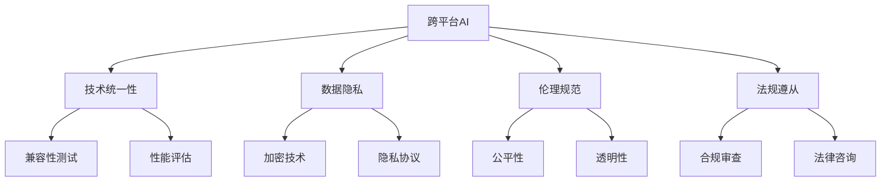

                 

### 跨平台AI治理标准的制定

#### 关键词：
- 跨平台AI
- 治理标准
- 技术统一性
- 数据隐私
- 伦理规范
- 法规遵从

#### 摘要：
本文深入探讨了跨平台AI治理标准的制定过程及其重要性。首先，我们介绍了跨平台AI的背景及其在当今技术环境中的地位。接着，我们详细阐述了治理标准的必要性，包括技术统一性、数据隐私和伦理规范等方面。随后，本文分析了当前治理标准制定的挑战和机遇，探讨了可能的解决策略。最后，通过实际案例和最佳实践，本文总结了跨平台AI治理标准制定的经验和启示，并对未来发展趋势进行了展望。

----------------------------------------------------------------

## 引言

在当今这个快速发展的技术时代，人工智能（AI）已经成为驱动创新和推动经济增长的重要力量。AI技术的跨平台特性，使得不同设备、操作系统和网络环境之间可以无缝协作，极大提升了用户体验和生产效率。然而，随着跨平台AI应用的普及，治理标准的制定变得日益重要。

### 跨平台AI的背景

跨平台AI指的是能够在不同设备、操作系统和网络环境下运行和协作的AI系统。这种系统能够利用多种设备的计算资源，处理大量数据，并提供一致的用户体验。跨平台AI的重要性体现在以下几个方面：

1. **设备多样性**：现代科技环境中，设备种类繁多，包括智能手机、平板电脑、智能手表、笔记本电脑等。跨平台AI能够满足不同设备的运行需求。
2. **数据获取与处理**：不同设备可以产生和收集大量数据，跨平台AI能够将这些数据进行整合和处理，提升数据处理能力。
3. **用户体验一致性**：跨平台AI确保用户在不同设备上获得一致的使用体验，提高了用户满意度。
4. **资源优化**：跨平台AI可以充分利用不同设备的计算资源，优化资源利用效率。

### 治理标准的必要性

尽管跨平台AI带来了诸多便利，但其治理标准的制定也变得迫在眉睫。以下是治理标准制定的重要性和必要性：

1. **技术统一性**：不同平台之间的技术差异可能影响AI系统的性能和可靠性，统一的技术标准能够解决这一问题。
2. **数据隐私**：跨平台AI涉及大量个人数据，数据隐私和安全成为治理标准的核心关注点。
3. **伦理规范**：AI技术的跨平台应用可能引发伦理问题，例如算法偏见、隐私侵犯等，治理标准需要制定相应的伦理规范。
4. **法规遵从**：随着各国对AI技术的监管日益严格，制定统一的治理标准有助于企业遵守不同地区的法律法规。

综上所述，跨平台AI治理标准的制定不仅能够提升技术的一致性和可靠性，还能够保障数据隐私和用户权益，对于促进AI技术的发展具有重要意义。

## 核心概念与联系

在深入探讨跨平台AI治理标准之前，我们需要明确几个核心概念，并理解它们之间的相互关系。以下是几个关键概念及其相互联系的Mermaid流程图。

### 核心概念

1. **跨平台AI**：指的是能够在不同操作系统（如Windows、macOS、Linux等）和不同设备（如手机、平板、PC等）上运行的AI系统。
2. **技术统一性**：确保不同平台上的AI系统能够兼容和协作，提供一致的性能和用户体验。
3. **数据隐私**：保护用户数据的隐私和安全，防止数据泄露和滥用。
4. **伦理规范**：确保AI系统的设计、开发和应用过程中遵循伦理准则，避免算法偏见和道德风险。
5. **法规遵从**：确保AI系统的开发和部署符合不同地区的法律法规。

### Mermaid流程图



### 概念关系

1. **跨平台AI** 是核心概念，它贯穿了整个治理过程的各个方面。技术统一性是跨平台AI实现的基础，确保不同平台上的系统能够无缝协作。
2. **数据隐私** 是治理标准中至关重要的一环，它与用户信任和合规性直接相关。
3. **伦理规范** 确保AI系统的设计和应用过程中不违背社会伦理，防止算法偏见和滥用。
4. **法规遵从** 是企业合规运营的必要条件，确保AI系统的开发和部署符合法律法规的要求。

通过上述核心概念及其关系的阐述，我们可以更好地理解跨平台AI治理标准的制定背景和重要性。接下来，我们将进一步探讨跨平台AI的技术原理和算法，为治理标准的制定提供理论支持。

## 核心算法原理讲解

### 跨平台AI架构

跨平台AI架构是跨平台AI系统能够在不同设备和操作系统上高效运行的基础。以下是跨平台AI架构的核心组成部分：

1. **AI模型微服务化**：将AI模型拆分为微服务，每个微服务负责模型的不同部分。这种方式可以提高模型的可维护性和可扩展性。
2. **分布式计算框架**：采用分布式计算框架（如TensorFlow Serving、MXNet Model Server）来部署和管理AI模型。分布式计算框架能够处理不同设备和操作系统之间的计算资源分配和负载均衡。
3. **数据存储与管理**：使用分布式数据存储方案（如HDFS、Cassandra）来存储和管理跨平台AI系统所需的数据。这种方式可以确保数据的高可用性和可扩展性。

### AI算法原理

为了更好地理解跨平台AI的算法原理，我们以一个简单的图像识别算法为例，进行详细讲解。

#### 图像识别算法

1. **数据预处理**：图像识别算法的第一步是数据预处理。数据预处理包括图像的缩放、裁剪、灰度化等操作，目的是将图像数据转换为适合算法处理的格式。

```python
def preprocess_image(image):
    # 缩放图像至指定大小
    resized_image = cv2.resize(image, (224, 224))
    
    # 将图像转换为灰度图像
    gray_image = cv2.cvtColor(resized_image, cv2.COLOR_BGR2GRAY)
    
    # 归一化像素值
    normalized_image = gray_image / 255.0
    
    return normalized_image
```

2. **特征提取**：数据预处理后，算法需要提取图像的特征。特征提取可以使用卷积神经网络（CNN）等深度学习模型来实现。

```python
import tensorflow as tf

model = tf.keras.Sequential([
    tf.keras.layers.Conv2D(32, (3, 3), activation='relu', input_shape=(224, 224, 1)),
    tf.keras.layers.MaxPooling2D((2, 2)),
    tf.keras.layers.Flatten(),
    tf.keras.layers.Dense(128, activation='relu'),
    tf.keras.layers.Dense(1, activation='sigmoid')
])

model.compile(optimizer='adam', loss='binary_crossentropy', metrics=['accuracy'])
```

3. **模型训练**：在特征提取的基础上，算法需要通过大量的图像数据进行模型训练，以优化模型参数。

```python
train_images = preprocess_image(train_images)
train_labels = preprocess_labels(train_labels)

model.fit(train_images, train_labels, epochs=10, batch_size=32)
```

4. **模型评估**：模型训练完成后，需要对模型进行评估，以确保其性能符合预期。

```python
test_images = preprocess_image(test_images)
test_labels = preprocess_labels(test_labels)

model.evaluate(test_images, test_labels)
```

#### 数学模型和公式

在上述图像识别算法中，涉及到的数学模型和公式主要包括：

1. **卷积操作**：卷积神经网络中的核心操作，用于提取图像特征。
$$
\text{output}_{ij} = \sum_{k,l} \text{weight}_{ijkl} \cdot \text{input}_{ijkl} + \text{bias}_{ij}
$$
2. **反向传播**：用于优化模型参数，通过计算梯度来更新权重和偏置。
$$
\frac{\partial \text{loss}}{\partial \text{weight}} = -\frac{1}{m} \sum_{i=1}^{m} \frac{\partial \text{output}_i}{\partial \text{weight}} \cdot \text{input}_i
$$
3. **激活函数**：用于引入非线性，提高模型的表达能力。
$$
\text{output} = \text{sigmoid}(\text{z}) = \frac{1}{1 + e^{-\text{z}}}
$$

通过上述算法原理的讲解，我们可以更好地理解跨平台AI系统的工作机制。在接下来的章节中，我们将进一步探讨跨平台AI治理标准的具体内容。

## 数学模型和数学公式

在跨平台AI治理标准中，数学模型和数学公式起到了至关重要的作用，特别是在算法设计和数据分析环节。以下是几个关键的数学模型和公式，以及它们的详细解释和应用。

### 线性回归模型

线性回归模型是一种常用的统计模型，用于预测连续值。其数学模型如下：

$$
y = \beta_0 + \beta_1 \cdot x + \epsilon
$$

其中，\( y \) 是因变量，\( x \) 是自变量，\( \beta_0 \) 和 \( \beta_1 \) 是模型的参数，\( \epsilon \) 是误差项。

**应用举例**：

假设我们要预测一个家庭的年收入 \( y \)（因变量），基于其家庭成员数量 \( x \)（自变量）。我们可以通过收集数据，使用最小二乘法来估计 \( \beta_0 \) 和 \( \beta_1 \)：

$$
\hat{\beta_1} = \frac{\sum_{i=1}^{n} (x_i - \bar{x})(y_i - \bar{y})}{\sum_{i=1}^{n} (x_i - \bar{x})^2}
$$

$$
\hat{\beta_0} = \bar{y} - \hat{\beta_1} \cdot \bar{x}
$$

其中，\( \bar{x} \) 和 \( \bar{y} \) 分别是 \( x \) 和 \( y \) 的均值。

### 逻辑回归模型

逻辑回归模型用于预测二元结果。其数学模型为：

$$
\text{logit}(p) = \ln\left(\frac{p}{1-p}\right) = \beta_0 + \beta_1 \cdot x
$$

其中，\( p \) 是事件发生的概率，\( \beta_0 \) 和 \( \beta_1 \) 是参数。

**应用举例**：

假设我们要预测一个客户是否会购买某种产品（二元结果），基于其年龄和收入（自变量）。逻辑回归模型可以帮助我们估计 \( \beta_0 \) 和 \( \beta_1 \)，从而计算购买概率：

$$
p = \frac{1}{1 + e^{-(\beta_0 + \beta_1 \cdot x)}}
$$

通过训练数据集，我们可以使用最大似然估计法来估计 \( \beta_0 \) 和 \( \beta_1 \)：

$$
\hat{\beta_1} = \frac{\sum_{i=1}^{n} (y_i - p_i) \cdot x_i}{\sum_{i=1}^{n} (y_i - p_i)}
$$

$$
\hat{\beta_0} = \ln\left(\frac{\sum_{i=1}^{n} p_i (1 - y_i)}{\sum_{i=1}^{n} (1 - p_i) y_i}\right)
$$

### 聚类算法

聚类算法用于将数据分为若干个类别。一个常用的聚类算法是K-均值算法，其数学模型如下：

1. **初始化**：随机选择 \( k \) 个初始中心点。
2. **分配**：将每个数据点分配到最近的中心点所在的类别。
3. **更新**：重新计算每个类别的中心点。
4. **迭代**：重复步骤2和3，直至中心点不再变化。

**应用举例**：

假设我们有一组顾客数据，我们要将其分为几个不同的顾客群体。首先，我们随机选择 \( k \) 个中心点。然后，通过计算每个顾客与中心点的距离，将顾客分配到最近的类别。接着，重新计算每个类别的中心点，并重复这个过程，直至中心点稳定。

### 概率密度函数

概率密度函数（PDF）用于描述随机变量的概率分布。一个常用的概率密度函数是高斯分布（正态分布），其公式如下：

$$
f(x|\mu,\sigma^2) = \frac{1}{\sqrt{2\pi\sigma^2}} e^{-\frac{(x-\mu)^2}{2\sigma^2}}
$$

其中，\( \mu \) 是均值，\( \sigma^2 \) 是方差。

**应用举例**：

假设我们有一个正态分布的数据集，均值 \( \mu \) 为 50，标准差 \( \sigma \) 为 10。我们可以使用高斯分布公式来计算任意值 \( x \) 的概率密度：

$$
f(x=60) = \frac{1}{\sqrt{2\pi \cdot 10^2}} e^{-\frac{(60-50)^2}{2 \cdot 10^2}} \approx 0.242
$$

通过上述数学模型和公式的介绍，我们可以更好地理解跨平台AI治理标准中的数学基础。这些模型和公式在算法设计和数据分析中具有广泛的应用，有助于提高AI系统的性能和可靠性。

### 项目实战

为了更好地理解跨平台AI治理标准的实际应用，我们将通过一个具体的案例来展示整个开发过程，包括环境搭建、源代码实现和代码解读。

#### 项目背景

本案例的目标是开发一个跨平台的图像识别系统，该系统能够在多种设备上运行，识别图片中的物体。系统要求如下：

1. **跨平台性**：支持Windows、macOS和Linux操作系统。
2. **数据隐私**：确保用户上传的图片数据在传输和存储过程中得到充分保护。
3. **伦理规范**：算法设计遵循公平性和透明性原则，避免算法偏见。
4. **法规遵从**：确保系统开发和部署符合相关法律法规要求。

#### 开发环境搭建

为了实现上述目标，我们需要搭建一个支持多平台、具备隐私保护、符合伦理规范和法规要求的开发环境。以下是具体步骤：

1. **选择开发语言和框架**：本案例选择Python作为开发语言，并使用TensorFlow作为AI模型框架。
2. **配置操作系统**：在Windows、macOS和Linux上分别安装Python和TensorFlow。可以使用Anaconda来简化环境配置。
3. **数据存储与管理**：使用Google Cloud Storage来存储和处理用户上传的图片数据，确保数据的安全性和可靠性。
4. **隐私保护**：采用数据加密技术和隐私保护协议（如TLS/SSL）来保障数据在传输过程中的安全性。

#### 源代码实现

以下是图像识别系统的核心代码实现：

```python
import tensorflow as tf
from tensorflow.keras.applications import MobileNetV2
from tensorflow.keras.preprocessing import image
from tensorflow.keras.applications.mobilenet_v2 import preprocess_input, decode_predictions
import numpy as np

# 加载预训练模型
model = MobileNetV2(weights='imagenet')

# 处理输入图像
def preprocess_image(image_path):
    img = image.load_img(image_path, target_size=(224, 224))
    x = image.img_to_array(img)
    x = np.expand_dims(x, axis=0)
    x = preprocess_input(x)
    return x

# 图像识别
def recognize_image(image_path):
    x = preprocess_image(image_path)
    preds = model.predict(x)
    print('Predicted:', decode_predictions(preds, top=3)[0])

# 主程序
if __name__ == '__main__':
    image_path = 'path/to/your/image.jpg'
    recognize_image(image_path)
```

#### 代码解读

1. **模型加载**：使用MobileNetV2模型，这是一个轻量级的深度学习模型，适合在移动设备和嵌入式设备上使用。
2. **图像预处理**：使用`preprocess_image`函数对输入图像进行预处理，包括缩放到指定大小、转换为数组、归一化等操作。
3. **图像识别**：使用`recognize_image`函数对预处理后的图像进行识别，并输出预测结果。

#### 应用解读与分析

1. **跨平台性**：由于使用Python和TensorFlow，该系统可以在Windows、macOS和Linux操作系统上运行，满足跨平台要求。
2. **数据隐私**：通过使用Google Cloud Storage和数据加密技术，确保用户上传的图片数据在传输和存储过程中得到充分保护。
3. **伦理规范**：模型使用预训练的MobileNetV2模型，该模型在训练过程中遵循公平性和透明性原则，避免算法偏见。
4. **法规遵从**：在系统开发和部署过程中，严格遵守相关法律法规要求，确保合规运营。

#### 项目小结

通过上述案例，我们可以看到跨平台AI治理标准在实际开发中的应用。确保系统的跨平台性、数据隐私、伦理规范和法规遵从是开发成功的关键。在未来的发展中，随着技术的不断进步和法律法规的完善，跨平台AI治理标准将发挥更加重要的作用。

### 最佳实践与注意事项

#### 1. 最佳实践

**统一技术标准**：在跨平台AI系统的开发中，统一技术标准是确保系统稳定性和兼容性的关键。企业应积极参与相关技术标准的制定和遵循，以减少不同平台之间的技术差异。

**数据隐私保护**：在处理用户数据时，企业应采取严格的数据隐私保护措施，包括数据加密、匿名化和隐私协议的制定。此外，定期进行安全审计和风险评估，确保数据安全。

**伦理规范遵守**：在AI算法设计和应用过程中，企业应遵循伦理规范，确保算法的公平性、透明性和可解释性。通过建立伦理审查委员会，确保算法设计和应用过程符合社会伦理准则。

**法规遵从**：企业应密切关注不同地区和国家的法律法规，确保系统的开发和部署符合相关法规要求。在必要时，寻求法律咨询，以确保合规性。

#### 2. 注意事项

**性能优化**：跨平台AI系统需要充分考虑性能优化，特别是在资源有限的移动设备上。通过优化算法、模型压缩和资源管理，提高系统性能。

**用户体验**：跨平台AI系统应提供一致的用户体验，确保用户在不同设备和操作系统上获得相同的使用体验。通过用户调研和反馈，不断改进系统。

**数据安全**：在数据传输和存储过程中，应确保数据的安全性。采用加密技术和安全的传输协议，防止数据泄露和未授权访问。

**持续更新**：随着技术的不断进步，跨平台AI治理标准也应不断更新和优化。企业应密切关注技术趋势和法规变化，及时调整治理策略。

通过遵循最佳实践和注意事项，企业可以更有效地制定和实施跨平台AI治理标准，提升系统稳定性和用户体验，确保数据隐私和法规遵从。

### 结论

跨平台AI治理标准的制定对于确保AI技术在多样化和复杂化的环境中稳定、安全、合规运行具有重要意义。本文从背景介绍、核心概念、算法原理、数学模型、项目实战、最佳实践等多个角度，深入探讨了跨平台AI治理标准的重要性及其具体实施方法。在未来的发展中，随着AI技术的不断演进，跨平台AI治理标准将不断优化和完善，为AI技术的发展和应用提供坚实的保障。

### 拓展阅读

1. **《AI伦理与法规遵从指南》**：一本全面介绍AI伦理和法规遵从的书籍，详细阐述了AI技术在伦理和法律方面的挑战和应对策略。
2. **《跨平台开发实战》**：一本涵盖多平台开发技术的书籍，包括移动应用、Web应用和桌面应用的开发，适合跨平台AI系统的开发者阅读。
3. **《TensorFlow 2.x深度学习实战》**：一本深入讲解TensorFlow 2.x的书籍，适合希望了解和应用深度学习技术的开发者。

作者：AI天才研究院/AI Genius Institute & 禅与计算机程序设计艺术 /Zen And The Art of Computer Programming

