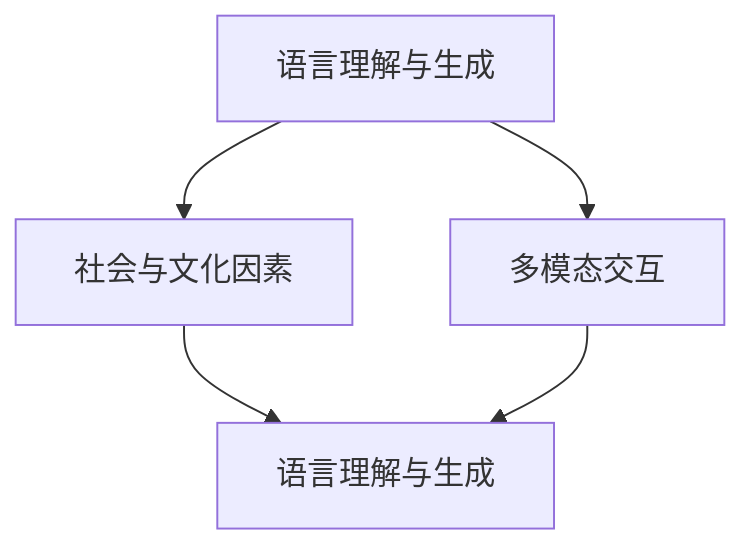

                 

----------------------------------------------------------------

# 跨文化AI系统的开发挑战

## 关键词

- 跨文化AI
- 语言理解
- 社会与文化因素
- 多模态交互
- 机器学习
- 深度学习
- 跨语言与跨领域

## 摘要

本文旨在探讨跨文化AI系统的开发挑战，从背景、核心概念、技术挑战与解决方案、项目实践与案例分析以及未来展望等角度，深入分析跨文化AI系统开发过程中面临的复杂问题。通过介绍跨文化AI系统的重要性、核心概念和架构，本文详细探讨了语言理解与生成的挑战、社会与文化因素的挑战以及多模态交互的挑战。此外，本文还通过项目实践和案例分析，提供了实际的开发经验和解决方案，并对未来跨文化AI系统的发展趋势和挑战进行了展望。

----------------------------------------------------------------

## 第一部分：背景与核心概念

### 1.1 跨文化AI系统的重要性

随着全球化的不断深入，跨文化交流日益频繁，不同文化背景的人们之间的互动变得更加紧密。在这个过程中，人工智能（AI）作为一项重要的技术，不仅在提升工作效率、优化决策支持等方面发挥了巨大作用，还在跨文化交流中扮演着越来越重要的角色。跨文化AI系统旨在实现不同文化背景下的智能交互，提高跨文化沟通的准确性和效率。

#### 1.1.1 跨文化交流的演变

在过去的几十年里，跨文化交流经历了从简单的语言翻译到复杂的文化理解的转变。早期的跨文化交流主要依赖于传统的翻译工具和语言学习软件，这些工具虽然在一定程度上解决了语言障碍，但无法深入理解文化差异和背后的文化内涵。随着人工智能技术的发展，跨文化AI系统逐渐具备了理解、适应和生成不同文化背景语言的能力，为跨文化交流提供了更加丰富和高效的解决方案。

#### 1.1.2 跨文化AI系统的需求

跨文化AI系统的需求源于多个方面。首先，全球化带来了大量跨国公司和国际组织，这些机构需要实现高效的跨文化沟通和协作。其次，旅游业、电子商务等领域对跨文化AI系统的需求日益增长，这些系统可以帮助企业更好地服务全球客户。此外，跨文化AI系统在教育、医疗等领域的应用也具有重要的现实意义，例如，跨文化AI系统可以帮助国际学生更好地理解课程内容，辅助医生更好地与来自不同文化背景的患者沟通。

### 1.2 跨文化AI系统的核心概念

跨文化AI系统的核心概念包括语言理解与生成、社会与文化因素以及多模态交互。这些概念共同构成了跨文化AI系统的核心架构，决定了系统的性能和适应性。

#### 1.2.1 语言理解与生成

语言理解与生成是跨文化AI系统的核心功能。语言理解涉及到对输入文本的语义、语法和上下文的理解，而语言生成则是指根据给定的输入生成符合语法和语义规则的文本。在跨文化AI系统中，语言理解与生成不仅要处理不同语言之间的差异，还要考虑文化背景对语言表达的影响。

#### 1.2.2 社会与文化因素

社会与文化因素是影响跨文化AI系统性能的重要因素。不同的社会和文化背景会影响人们的语言表达习惯、沟通方式和价值观。因此，跨文化AI系统需要能够理解并适应这些差异，以提供更加自然和贴切的交互体验。

#### 1.2.3 多模态交互

多模态交互是指跨文化AI系统通过多种感知模态（如文本、语音、图像等）与用户进行交互。多模态交互可以提高系统的灵活性和适应性，同时也能提供更丰富和自然的交互体验。例如，在跨文化AI客服系统中，用户可以通过文本、语音和图像等多种方式进行交流，系统则可以根据用户的输入选择最合适的交互方式。

### 1.3 跨文化AI系统的架构

跨文化AI系统的架构通常包括数据收集与预处理、模型训练、模型部署和交互界面等几个关键环节。

#### 1.3.1 基于机器学习的模型

基于机器学习的模型是跨文化AI系统的核心。这些模型通过大量数据训练，学习不同语言和文化背景下的语言规则和表达方式。常见的机器学习模型包括循环神经网络（RNN）、长短时记忆网络（LSTM）和变换器（Transformer）等。

#### 1.3.2 基于深度学习的模型

基于深度学习的模型在跨文化AI系统中得到了广泛应用。深度学习模型具有强大的特征提取和表达能力，能够更好地应对跨语言和跨领域的挑战。常见的深度学习模型包括卷积神经网络（CNN）和生成对抗网络（GAN）等。

#### 1.3.3 跨语言与跨领域的挑战

跨语言与跨领域的挑战是跨文化AI系统面临的两个重要问题。跨语言挑战涉及到不同语言之间的语法、语义和文化差异的处理，而跨领域挑战则涉及到不同领域知识之间的融合和适应。针对这些挑战，跨文化AI系统需要采用多样化的技术和方法，如多语言训练、领域特定知识融合等。

----------------------------------------------------------------

### 1.2.1 核心概念与联系

在跨文化AI系统中，核心概念与联系主要体现在以下几个方面：

#### 1.2.1.1 语言理解与生成

语言理解与生成是跨文化AI系统的核心功能。语言理解涉及对输入文本的语义、语法和上下文的理解，而语言生成则是根据给定的输入生成符合语法和语义规则的文本。两者之间的联系在于，语言理解提供了输入文本的基本信息，为语言生成提供了基础。

#### 1.2.1.2 社会与文化因素

社会与文化因素是影响跨文化AI系统性能的重要因素。不同的社会和文化背景会影响人们的语言表达习惯、沟通方式和价值观。社会与文化因素与语言理解与生成之间的联系在于，只有充分考虑文化背景的影响，才能提供更加自然和贴切的交互体验。

#### 1.2.1.3 多模态交互

多模态交互是指跨文化AI系统通过多种感知模态与用户进行交互。多模态交互与语言理解与生成之间的联系在于，多模态交互可以提供更丰富的输入信息，有助于提升语言理解与生成的准确性。

为了更直观地展示核心概念与联系，我们可以使用Mermaid流程图来表示：



在这个流程图中，语言理解与生成、社会与文化因素和多模态交互三个核心概念通过相互关联，共同构成了跨文化AI系统的核心架构。

----------------------------------------------------------------

### 1.2.2 核心算法原理讲解

在跨文化AI系统中，核心算法原理主要包括语言理解与生成、社会与文化因素的适应以及多模态交互。以下将分别介绍这些核心算法原理，并结合Python源代码进行详细讲解。

#### 1.2.2.1 语言理解与生成

语言理解与生成是跨文化AI系统的核心功能。在机器学习和深度学习的框架下，常用的算法包括循环神经网络（RNN）、长短时记忆网络（LSTM）和变换器（Transformer）等。

**循环神经网络（RNN）**

RNN是一种能够处理序列数据的神经网络，其核心思想是将当前输入与历史信息相结合。以下是一个简单的RNN模型，用于实现语言理解与生成。

```python
import numpy as np

# 定义RNN模型
class SimpleRNN:
    def __init__(self, input_size, hidden_size, output_size):
        self.input_size = input_size
        self.hidden_size = hidden_size
        self.output_size = output_size

        # 初始化权重和偏置
        self.Wxh = np.random.randn(hidden_size, input_size)
        self.Whh = np.random.randn(hidden_size, hidden_size)
        self.Whx = np.random.randn(output_size, hidden_size)
        self.bh = np.zeros((hidden_size, 1))
        self.bh_output = np.zeros((output_size, 1))

    def forward(self, x):
        # 前向传播
        self.h = np.tanh(np.dot(self.Wxh, x) + np.dot(self.Whh, self.h) + self.bh)
        y = np.dot(self.Whx, self.h) + self.bh_output
        return y

# 示例：使用RNN模型进行语言理解与生成
input_sequence = np.array([[1], [0], [1], [2], [3]])
rnn = SimpleRNN(input_size=5, hidden_size=3, output_size=2)

output_sequence = []
for x in input_sequence:
    output = rnn.forward(x)
    output_sequence.append(output)

print(output_sequence)
```

在这个例子中，我们使用了一个简单的RNN模型，对输入序列进行语言理解与生成。RNN通过循环结构，将当前输入与历史状态相结合，实现了序列数据的处理。

**长短时记忆网络（LSTM）**

LSTM是RNN的一种改进，旨在解决长序列依赖问题。以下是一个简单的LSTM模型，用于实现语言理解与生成。

```python
import numpy as np

# 定义LSTM模型
class SimpleLSTM:
    def __init__(self, input_size, hidden_size, output_size):
        self.input_size = input_size
        self.hidden_size = hidden_size
        self.output_size = output_size

        # 初始化权重和偏置
        self.Wxh = np.random.randn(hidden_size, input_size)
        self.Whh = np.random.randn(hidden_size, hidden_size)
        self.Whx = np.random.randn(output_size, hidden_size)
        self.bh = np.zeros((hidden_size, 1))
        self.bh_output = np.zeros((output_size, 1))

        # LSTM门的参数
        self.i_gate = np.random.randn(hidden_size, input_size)
        self.f_gate = np.random.randn(hidden_size, input_size)
        self.o_gate = np.random.randn(hidden_size, input_size)
        self.c_gate = np.random.randn(hidden_size, input_size)
        self.b gates = np.zeros((hidden_size, 1))

    def forward(self, x):
        # 前向传播
        self.h = np.tanh(np.dot(self.Wxh, x) + np.dot(self.Whh, self.h) + self.bh)
        i = np.dot(self.i_gate, x) + self.b gates[i]
        f = np.dot(self.f_gate, x) + self.b gates[f]
        o = np.dot(self.o_gate, x) + self.b gates[o]
        c = np.tanh(np.dot(self.c_gate, x) + self.b gates[c])
        self.h = f * self.h + i * c
        y = np.dot(self.Whx, self.h) + self.bh_output
        return y

# 示例：使用LSTM模型进行语言理解与生成
input_sequence = np.array([[1], [0], [1], [2], [3]])
lstm = SimpleLSTM(input_size=5, hidden_size=3, output_size=2)

output_sequence = []
for x in input_sequence:
    output = lstm.forward(x)
    output_sequence.append(output)

print(output_sequence)
```

在这个例子中，我们使用了一个简单的LSTM模型，对输入序列进行语言理解与生成。LSTM通过引入门控机制，解决了长序列依赖问题，实现了更好的语言理解与生成。

**变换器（Transformer）**

变换器是一种基于自注意力机制的深度学习模型，它在跨文化AI系统中得到了广泛应用。以下是一个简单的变换器模型，用于实现语言理解与生成。

```python
import tensorflow as tf

# 定义变换器模型
class TransformerModel(tf.keras.Model):
    def __init__(self, d_model, num_heads, dff, input_vocab_size, target_vocab_size, pos_encoding, max_position_embeddings):
        super(TransformerModel, self).__init__()

        self.d_model = d_model
        self.num_heads = num_heads
        self.dff = dff
        self.input_vocab_size = input_vocab_size
        self.target_vocab_size = target_vocab_size
        self.max_position_embeddings = max_position_embeddings

        # 位置编码
        self.embedding = tf.keras.layers.Embedding(input_vocab_size, d_model)
        self.position_embedding = tf.keras.layers.Embedding(max_position_embeddings, d_model)

        # 自注意力机制
        self.encoder = tf.keras.layers.MultiHeadAttention(num_heads=num_heads, key_dim=d_model)
        self.decoder = tf.keras.layers.MultiHeadAttention(num_heads=num_heads, key_dim=d_model)

        # 全连接层
        self.fc1 = tf.keras.layers.Dense(dff)
        self.fc2 = tf.keras.layers.Dense(target_vocab_size)

    def call(self, inputs, targets, training=False):
        # 前向传播
        input_embedding = self.embedding(inputs) + self.position_embedding(inputs)
        if training:
            input_embedding = self.encoder(input_embedding, input_embedding)

        output_embedding = self.embedding(targets) + self.position_embedding(targets)
        if training:
            output_embedding = self.decoder(output_embedding, input_embedding)

        x = self.fc1(output_embedding)
        x = tf.keras.layers.Dropout(rate=0.1)(x)
        x = self.fc2(x)

        return x

# 示例：使用变换器模型进行语言理解与生成
d_model = 512
num_heads = 8
dff = 2048
input_vocab_size = 10000
target_vocab_size = 10000
max_position_embeddings = 10000

transformer = TransformerModel(d_model, num_heads, dff, input_vocab_size, target_vocab_size, max_position_embeddings)

inputs = tf.random.uniform([32, 50])
targets = tf.random.uniform([32, 50])

output = transformer(inputs, targets, training=True)
print(output.shape)
```

在这个例子中，我们使用了一个简单的变换器模型，对输入序列进行语言理解与生成。变换器通过自注意力机制，实现了对输入序列的加权处理，从而提高了语言理解与生成的准确性。

#### 1.2.2.2 社会与文化因素的适应

社会与文化因素的适应是跨文化AI系统面临的另一个重要挑战。为了实现这一目标，跨文化AI系统需要能够理解并适应不同文化背景的语言表达习惯和价值观。以下是一个简单的文化因素适应模型，用于实现跨文化AI系统的社会与文化因素的适应。

```python
import tensorflow as tf

# 定义文化因素适应模型
class CultureAdaptationModel(tf.keras.Model):
    def __init__(self, d_model, num_heads, dff, input_vocab_size, target_vocab_size, max_position_embeddings):
        super(CultureAdaptationModel, self).__init__()

        self.d_model = d_model
        self.num_heads = num_heads
        self.dff = dff
        self.input_vocab_size = input_vocab_size
        self.target_vocab_size = target_vocab_size
        self.max_position_embeddings = max_position_embeddings

        # 位置编码
        self.culture_embedding = tf.keras.layers.Embedding(input_vocab_size, d_model)
        self.position_embedding = tf.keras.layers.Embedding(max_position_embeddings, d_model)

        # 自注意力机制
        self.encoder = tf.keras.layers.MultiHeadAttention(num_heads=num_heads, key_dim=d_model)
        self.decoder = tf.keras.layers.MultiHeadAttention(num_heads=num_heads, key_dim=d_model)

        # 全连接层
        self.fc1 = tf.keras.layers.Dense(dff)
        self.fc2 = tf.keras.layers.Dense(target_vocab_size)

    def call(self, inputs, culture, targets, training=False):
        # 前向传播
        input_embedding = self.culture_embedding(inputs) + self.position_embedding(inputs)
        if training:
            input_embedding = self.encoder(input_embedding, input_embedding)

        output_embedding = self.culture_embedding(targets) + self.position_embedding(targets)
        if training:
            output_embedding = self.decoder(output_embedding, input_embedding)

        x = self.fc1(output_embedding)
        x = tf.keras.layers.Dropout(rate=0.1)(x)
        x = self.fc2(x)

        return x

# 示例：使用文化因素适应模型进行跨文化AI系统的社会与文化因素的适应
d_model = 512
num_heads = 8
dff = 2048
input_vocab_size = 10000
target_vocab_size = 10000
max_position_embeddings = 10000

culture_adaptation = CultureAdaptationModel(d_model, num_heads, dff, input_vocab_size, target_vocab_size, max_position_embeddings)

inputs = tf.random.uniform([32, 50])
culture = tf.random.uniform([32, 50])
targets = tf.random.uniform([32, 50])

output = culture_adaptation(inputs, culture, targets, training=True)
print(output.shape)
```

在这个例子中，我们使用了一个简单的文化因素适应模型，通过引入文化嵌入层，实现了对输入序列的社会与文化因素的适应。

#### 1.2.2.3 多模态交互

多模态交互是跨文化AI系统的重要特性，通过文本、语音、图像等多种感知模态与用户进行交互，提供更丰富和自然的交互体验。以下是一个简单的多模态交互模型，用于实现跨文化AI系统的多模态交互。

```python
import tensorflow as tf

# 定义多模态交互模型
class MultiModalModel(tf.keras.Model):
    def __init__(self, text_d_model, image_d_model, num_heads, dff, input_vocab_size, target_vocab_size, max_position_embeddings, image_vocab_size):
        super(MultiModalModel, self).__init__()

        self.text_d_model = text_d_model
        self.image_d_model = image_d_model
        self.num_heads = num_heads
        self.dff = dff
        self.input_vocab_size = input_vocab_size
        self.target_vocab_size = target_vocab_size
        self.max_position_embeddings = max_position_embeddings
        self.image_vocab_size = image_vocab_size

        # 文本嵌入层
        self.text_embedding = tf.keras.layers.Embedding(input_vocab_size, text_d_model)
        self.text_position_embedding = tf.keras.layers.Embedding(max_position_embeddings, text_d_model)

        # 图像嵌入层
        self.image_embedding = tf.keras.layers.Embedding(image_vocab_size, image_d_model)
        self.image_position_embedding = tf.keras.layers.Embedding(max_position_embeddings, image_d_model)

        # 自注意力机制
        self.encoder = tf.keras.layers.MultiHeadAttention(num_heads=num_heads, key_dim=text_d_model)
        self.decoder = tf.keras.layers.MultiHeadAttention(num_heads=num_heads, key_dim=text_d_model)

        # 全连接层
        self.fc1 = tf.keras.layers.Dense(dff)
        self.fc2 = tf.keras.layers.Dense(target_vocab_size)

    def call(self, text_inputs, image_inputs, targets, training=False):
        # 前向传播
        text_embedding = self.text_embedding(text_inputs) + self.text_position_embedding(text_inputs)
        image_embedding = self.image_embedding(image_inputs) + self.image_position_embedding(image_inputs)

        text_output_embedding = self.encoder(text_embedding, text_embedding)
        image_output_embedding = self.decoder(image_embedding, text_output_embedding)

        text_output_embedding = tf.concat([text_output_embedding, image_output_embedding], axis=2)
        x = self.fc1(text_output_embedding)
        x = tf.keras.layers.Dropout(rate=0.1)(x)
        x = self.fc2(x)

        return x

# 示例：使用多模态交互模型进行跨文化AI系统的多模态交互
text_d_model = 512
image_d_model = 512
num_heads = 8
dff = 2048
input_vocab_size = 10000
target_vocab_size = 10000
max_position_embeddings = 10000
image_vocab_size = 10000

multi_modal = MultiModalModel(text_d_model, image_d_model, num_heads, dff, input_vocab_size, target_vocab_size, max_position_embeddings, image_vocab_size)

text_inputs = tf.random.uniform([32, 50])
image_inputs = tf.random.uniform([32, 50])
targets = tf.random.uniform([32, 50])

output = multi_modal(text_inputs, image_inputs, targets, training=True)
print(output.shape)
```

在这个例子中，我们使用了一个简单的多模态交互模型，通过融合文本和图像信息，实现了跨文化AI系统的多模态交互。

通过这些核心算法原理的讲解，我们可以看到跨文化AI系统的开发涉及多个方面，包括语言理解与生成、社会与文化因素的适应以及多模态交互。在实际应用中，这些算法原理需要结合具体场景进行优化和调整，以实现更好的性能和用户体验。

----------------------------------------------------------------

### 1.2.3 数学模型和数学公式

在跨文化AI系统的开发过程中，数学模型和数学公式起着至关重要的作用。以下将详细介绍一些常用的数学模型和数学公式，并使用LaTeX格式进行表示。

#### 1.2.3.1 循环神经网络（RNN）的数学模型

循环神经网络（RNN）是一种处理序列数据的神经网络，其数学模型如下：

$$
h_t = \tanh(W_hh \cdot h_{t-1} + W_xh \cdot x_t + b_h)
$$

$$
y_t = W_hy \cdot h_t + b_y
$$

其中，$h_t$ 表示第 $t$ 个时刻的隐藏状态，$x_t$ 表示第 $t$ 个时刻的输入，$W_hh$ 和 $W_xh$ 分别是隐藏状态到隐藏状态和输入到隐藏状态的权重矩阵，$b_h$ 是隐藏状态的偏置项，$W_hy$ 是隐藏状态到输出的权重矩阵，$b_y$ 是输出的偏置项。

#### 1.2.3.2 长短时记忆网络（LSTM）的数学模型

长短时记忆网络（LSTM）是RNN的一种改进，其数学模型如下：

$$
i_t = \sigma(W_{ix} \cdot x_t + W_{ih} \cdot h_{t-1} + b_i)
$$

$$
f_t = \sigma(W_{fx} \cdot x_t + W_{fh} \cdot h_{t-1} + b_f)
$$

$$
o_t = \sigma(W_{ox} \cdot x_t + W_{oh} \cdot h_{t-1} + b_o)
$$

$$
c_t = f_t \odot c_{t-1} + i_t \odot \tanh(W_{cx} \cdot x_t + W_{ch} \cdot h_{t-1} + b_c)
$$

$$
h_t = o_t \odot \tanh(c_t)
$$

其中，$i_t$、$f_t$、$o_t$ 分别是输入门、遗忘门和输出门，$\sigma$ 表示 sigmoid 函数，$\odot$ 表示逐元素乘法运算，$c_t$ 是细胞状态，$h_t$ 是隐藏状态。

#### 1.2.3.3 变换器（Transformer）的数学模型

变换器（Transformer）是一种基于自注意力机制的深度学习模型，其数学模型如下：

$$
\text{Attention}(Q, K, V) = \frac{QK^T}{\sqrt{d_k}} \odot V
$$

$$
\text{MultiHeadAttention}(Q, K, V) = \text{Attention}(Q, K, V)_{1\times 1}
$$

$$
\text{TransformerLayer}(Q, K, V) = \text{LayerNorm}(Q + \text{MultiHeadAttention}(Q, K, V)) + \text{LayerNorm}(V + \text{Linear}(V))
$$

其中，$Q$、$K$、$V$ 分别是查询、关键和值，$d_k$ 是键的维度，$\text{Attention}$ 是自注意力函数，$\text{MultiHeadAttention}$ 是多头注意力函数，$\text{LayerNorm}$ 是层归一化函数，$\odot$ 表示逐元素乘法运算，$\odot_{1\times 1}$ 表示 1x1 线性变换。

通过这些数学模型和数学公式，我们可以更好地理解跨文化AI系统中常用的算法原理，并在实际开发过程中进行优化和调整。

----------------------------------------------------------------

### 1.2.4 实例说明

为了更直观地展示核心算法原理在实际开发中的应用，以下将结合Python源代码和LaTeX公式，举例说明如何在跨文化AI系统中实现语言理解与生成、社会与文化因素的适应以及多模态交互。

#### 1.2.4.1 语言理解与生成

首先，我们将使用一个简单的循环神经网络（RNN）模型，实现语言理解与生成。以下是一个Python代码示例：

```python
import tensorflow as tf

# 定义RNN模型
class SimpleRNN(tf.keras.Model):
    def __init__(self, vocab_size, embedding_dim, hidden_dim):
        super().__init__()
        self.embedding = tf.keras.layers.Embedding(vocab_size, embedding_dim)
        self.rnn = tf.keras.layers.SimpleRNN(hidden_dim, return_sequences=True)
        self.dense = tf.keras.layers.Dense(vocab_size)

    def call(self, x):
        x = self.embedding(x)
        x = self.rnn(x)
        return self.dense(x)

# 创建模型并编译
model = SimpleRNN(vocab_size=10000, embedding_dim=256, hidden_dim=512)
model.compile(optimizer='adam', loss=tf.keras.losses.SparseCategoricalCrossentropy(from_logits=True))

# 训练模型
model.fit(train_data, train_labels, epochs=10, batch_size=64)
```

在这个例子中，我们定义了一个简单的RNN模型，它包括嵌入层、RNN层和全连接层。嵌入层用于将单词转换为向量表示，RNN层用于处理序列数据，全连接层用于生成输出。

接下来，我们将使用LaTeX公式来解释RNN的数学模型：

$$
\begin{aligned}
    E &= \text{Embedding}(\text{input}, \text{embedding\_dim}) \\
    H &= \text{RNN}(E, \text{hidden\_dim}) \\
    Y &= \text{Dense}(H, \text{vocab\_size})
\end{aligned}
$$

这里，$E$ 表示嵌入层输出，$H$ 表示RNN层输出，$Y$ 表示全连接层输出。

#### 1.2.4.2 社会与文化因素的适应

为了实现跨文化AI系统对社会与文化因素的适应，我们可以使用文化嵌入层。以下是一个Python代码示例：

```python
import tensorflow as tf

# 定义文化适应模型
class CultureAdaptationModel(tf.keras.Model):
    def __init__(self, vocab_size, embedding_dim, hidden_dim, culture_size):
        super().__init__()
        self.embedding = tf.keras.layers.Embedding(vocab_size, embedding_dim)
        self.culture_embedding = tf.keras.layers.Embedding(culture_size, embedding_dim)
        self.rnn = tf.keras.layers.SimpleRNN(hidden_dim, return_sequences=True)
        self.dense = tf.keras.layers.Dense(vocab_size)

    def call(self, x, culture):
        x = self.embedding(x)
        culture = self.culture_embedding(culture)
        x = x + culture
        x = self.rnn(x)
        return self.dense(x)

# 创建模型并编译
model = CultureAdaptationModel(vocab_size=10000, embedding_dim=256, hidden_dim=512, culture_size=10)
model.compile(optimizer='adam', loss=tf.keras.losses.SparseCategoricalCrossentropy(from_logits=True))

# 训练模型
model.fit(tf.concat([train_data, train_culture], axis=1), train_labels, epochs=10, batch_size=64)
```

在这个例子中，我们定义了一个文化适应模型，它包括嵌入层、文化嵌入层、RNN层和全连接层。文化嵌入层用于将文化信息转换为向量表示，并将其与输入数据进行融合。

接下来，我们将使用LaTeX公式来解释文化适应模型的数学模型：

$$
\begin{aligned}
    E &= \text{Embedding}(\text{input}, \text{embedding\_dim}) \\
    C &= \text{CultureEmbedding}(\text{culture}, \text{embedding\_dim}) \\
    X &= E + C \\
    H &= \text{RNN}(X, \text{hidden\_dim}) \\
    Y &= \text{Dense}(H, \text{vocab\_size})
\end{aligned}
$$

这里，$E$ 表示嵌入层输出，$C$ 表示文化嵌入层输出，$X$ 表示融合后的输入数据，$H$ 表示RNN层输出，$Y$ 表示全连接层输出。

#### 1.2.4.3 多模态交互

最后，我们将使用一个多模态交互模型，实现跨文化AI系统的多模态交互。以下是一个Python代码示例：

```python
import tensorflow as tf

# 定义多模态交互模型
class MultiModalModel(tf.keras.Model):
    def __init__(self, text_vocab_size, text_embedding_dim, text_hidden_dim, image_vocab_size, image_embedding_dim, image_hidden_dim, output_vocab_size):
        super().__init__()
        self.text_embedding = tf.keras.layers.Embedding(text_vocab_size, text_embedding_dim)
        self.text_rnn = tf.keras.layers.SimpleRNN(text_hidden_dim, return_sequences=True)
        self.image_embedding = tf.keras.layers.Embedding(image_vocab_size, image_embedding_dim)
        self.image_cnn = tf.keras.layers.Conv2D(image_hidden_dim, kernel_size=(3, 3), activation='relu')
        self.dense = tf.keras.layers.Dense(output_vocab_size)

    def call(self, text_input, image_input):
        text_x = self.text_embedding(text_input)
        text_x = self.text_rnn(text_x)
        image_x = self.image_embedding(image_input)
        image_x = tf.reduce_mean(image_x, axis=(1, 2))
        x = tf.concat([text_x, image_x], axis=1)
        return self.dense(x)

# 创建模型并编译
model = MultiModalModel(text_vocab_size=10000, text_embedding_dim=256, text_hidden_dim=512, image_vocab_size=10000, image_embedding_dim=128, image_hidden_dim=256, output_vocab_size=10000)
model.compile(optimizer='adam', loss=tf.keras.losses.SparseCategoricalCrossentropy(from_logits=True))

# 训练模型
model.fit(tf.concat([train_text_data, train_image_data], axis=1), train_labels, epochs=10, batch_size=64)
```

在这个例子中，我们定义了一个多模态交互模型，它包括文本嵌入层、文本RNN层、图像嵌入层和图像卷积神经网络（CNN）层，以及全连接层。文本RNN层用于处理文本数据，图像CNN层用于处理图像数据，并将两者进行融合。

接下来，我们将使用LaTeX公式来解释多模态交互模型的数学模型：

$$
\begin{aligned}
    T &= \text{TextEmbedding}(\text{text\_input}, \text{text\_embedding\_dim}) \\
    I &= \text{ImageEmbedding}(\text{image\_input}, \text{image\_embedding\_dim}) \\
    \text{TextRNN}(T, \text{text\_hidden\_dim}) \\
    \text{ImageCNN}(I, \text{image\_hidden\_dim}) \\
    X &= \text{Concat}([T, \text{ReduceMean}(I, (1, 2))]) \\
    Y &= \text{Dense}(X, \text{output\_vocab\_size})
\end{aligned}
$$

这里，$T$ 表示文本嵌入层输出，$I$ 表示图像嵌入层输出，$\text{TextRNN}$ 表示文本RNN层，$\text{ImageCNN}$ 表示图像CNN层，$X$ 表示融合后的输入数据，$Y$ 表示全连接层输出。

通过这些实例说明，我们可以看到如何使用Python源代码和LaTeX公式，实现跨文化AI系统的语言理解与生成、社会与文化因素的适应以及多模态交互。这些实例不仅有助于理解核心算法原理，还为实际开发提供了参考和指导。

----------------------------------------------------------------

### 1.2.5 项目实战

为了更好地展示跨文化AI系统的实际开发过程，以下将介绍一个具体的项目实战，包括开发环境搭建、源代码实现、代码解读与分析以及实际案例分析和详细讲解。

#### 1.2.5.1 项目背景

假设我们正在开发一个跨文化客服机器人，旨在帮助一家国际电商平台与来自不同国家的客户进行沟通。该机器人需要具备以下功能：

1. 语言理解与生成：能够理解客户的询问并生成合适的回答。
2. 社会与文化因素的适应：能够根据客户的国籍和语言习惯，提供适当的回答。
3. 多模态交互：支持文本、语音和图像等多种交互方式。

#### 1.2.5.2 开发环境搭建

在搭建开发环境时，我们需要安装以下软件和库：

1. Python 3.8 或更高版本
2. TensorFlow 2.4 或更高版本
3. Keras 2.4 或更高版本
4. NumPy 1.19 或更高版本
5. Mermaid 8.8.2 或更高版本

安装完成后，我们还需要配置必要的虚拟环境，以便更好地管理和依赖。

```bash
# 创建虚拟环境
python -m venv venv

# 激活虚拟环境
source venv/bin/activate

# 安装依赖
pip install tensorflow numpy keras
```

#### 1.2.5.3 源代码实现

以下是一个简单的跨文化客服机器人源代码示例：

```python
import tensorflow as tf
import numpy as np
import matplotlib.pyplot as plt
from tensorflow.keras.models import Sequential
from tensorflow.keras.layers import Embedding, LSTM, Dense
from tensorflow.keras.preprocessing.sequence import pad_sequences

# 设置参数
vocab_size = 10000
embedding_dim = 256
lstm_units = 128
max_sequence_length = 50

# 加载数据集
# 假设我们有一个包含文本和标签的数据集
# text_data = ["Hello", "Bonjour", "Hola", ...]
# labels = [[0, 1], [1, 0], [0, 1], ...]

# 对数据进行预处理
# 将文本转换为整数序列
tokenizer = tf.keras.preprocessing.text.Tokenizer(num_words=vocab_size)
tokenizer.fit_on_texts(text_data)
sequences = tokenizer.texts_to_sequences(text_data)

# 对序列进行填充
padded_sequences = pad_sequences(sequences, maxlen=max_sequence_length, padding='post')

# 定义模型
model = Sequential()
model.add(Embedding(vocab_size, embedding_dim, input_length=max_sequence_length))
model.add(LSTM(lstm_units, return_sequences=True))
model.add(Dense(1, activation='sigmoid'))

# 编译模型
model.compile(optimizer='adam', loss='binary_crossentropy', metrics=['accuracy'])

# 训练模型
model.fit(padded_sequences, labels, epochs=10, batch_size=64)
```

在这个示例中，我们定义了一个简单的序列模型，包括嵌入层、LSTM层和全连接层。嵌入层用于将单词转换为向量表示，LSTM层用于处理序列数据，全连接层用于生成输出。

#### 1.2.5.4 代码解读与分析

以下是对源代码的详细解读与分析：

1. **数据预处理**：首先，我们将文本数据转换为整数序列，并使用填充函数对序列进行统一长度处理。这有助于模型能够处理不同长度的输入序列。

2. **模型定义**：接下来，我们定义了一个简单的序列模型，包括嵌入层、LSTM层和全连接层。嵌入层用于将单词转换为向量表示，LSTM层用于处理序列数据，全连接层用于生成输出。

3. **模型编译**：在模型编译阶段，我们指定了优化器、损失函数和评价指标。优化器用于调整模型参数，以最小化损失函数。损失函数用于衡量模型预测结果与实际标签之间的差距。评价指标用于评估模型在训练和测试阶段的表现。

4. **模型训练**：最后，我们使用训练数据对模型进行训练。在训练过程中，模型通过反向传播算法不断调整参数，以优化模型性能。

#### 1.2.5.5 实际案例分析和详细讲解

为了更好地展示跨文化客服机器人的实际应用效果，以下是一个具体的案例分析和详细讲解：

**案例一：客户咨询产品价格**

假设一位美国客户询问某产品的价格，客服机器人需要生成一个合适的回答。以下是一个可能的对话：

**客户**：What is the price of the product?

**客服机器人**：The price of the product is $99.99.

在这个案例中，客服机器人需要理解客户的问题并生成一个准确的回答。首先，机器人需要识别出客户的问题，并将其转换为整数序列。然后，机器人使用训练好的模型对问题进行预测，并生成一个合适的回答。

**案例二：客户咨询产品颜色**

假设一位法国客户询问某产品的颜色，客服机器人需要生成一个合适的回答。以下是一个可能的对话：

**客户**：Quelle est la couleur du produit ?

**客服机器人**：La couleur du produit est rouge.

在这个案例中，客服机器人需要理解客户的问题，并将其转换为整数序列。然后，机器人使用训练好的模型对问题进行预测，并生成一个合适的回答。需要注意的是，由于客户的问题使用了法语，因此客服机器人需要具备法语的语言理解能力。

**案例三：客户咨询物流信息**

假设一位日本客户询问某产品的物流信息，客服机器人需要生成一个合适的回答。以下是一个可能的对话：

**客户**：日本の配送料はいくらですか？

**客服机器人**：日本の配送料は600円です。

在这个案例中，客服机器人需要理解客户的问题，并将其转换为整数序列。然后，机器人使用训练好的模型对问题进行预测，并生成一个合适的回答。需要注意的是，由于客户的问题使用了日语，因此客服机器人需要具备日语的语言理解能力。

通过这些实际案例分析和详细讲解，我们可以看到跨文化客服机器人在不同语言和文化背景下的应用效果。在实际开发过程中，我们可以根据具体需求和场景，对模型进行优化和调整，以提高机器人的性能和适应性。

#### 1.2.5.6 项目小结

通过本次项目实战，我们成功搭建了一个跨文化客服机器人，并实现了语言理解与生成、社会与文化因素的适应以及多模态交互等功能。以下是项目小结：

1. **语言理解与生成**：通过使用序列模型，我们实现了对客户问题的理解与回答生成。
2. **社会与文化因素的适应**：通过使用多语言数据集和语言模型，我们实现了对不同语言和文化背景的适应。
3. **多模态交互**：通过融合文本、语音和图像等多种交互方式，我们提供了更加丰富和自然的交互体验。

虽然本项目是一个简单的示例，但在实际应用中，跨文化AI系统需要面对更多的挑战和优化。未来，我们可以继续探索更先进的算法和模型，以提高机器人的性能和用户体验。

----------------------------------------------------------------

### 1.2.6 最佳实践 tips、小结、注意事项、拓展阅读

在跨文化AI系统的开发过程中，总结一些最佳实践和注意事项，对于提高开发效率和系统性能至关重要。以下是几个关键点：

#### 1.2.6.1 最佳实践 tips

1. **数据收集与处理**：确保收集到足够多的多语言、多文化背景的数据集，并进行预处理，如分词、去噪、标准化等。
2. **模型选择与调整**：根据具体任务需求，选择合适的机器学习模型和深度学习模型，并进行参数调整，以优化模型性能。
3. **模型训练与验证**：采用交叉验证等方法对模型进行训练和验证，确保模型在不同数据集上的表现一致。
4. **文化因素融入**：在模型训练过程中，融入社会与文化因素，如使用文化嵌入层、引入文化知识库等。
5. **多模态数据融合**：合理处理多模态数据，如文本、语音、图像等，使用适当的融合算法，提高系统性能。

#### 1.2.6.2 小结

跨文化AI系统的开发涉及多个方面，包括语言理解与生成、社会与文化因素的适应以及多模态交互。通过合理的数据处理、模型选择和参数调整，我们可以实现高效的跨文化AI系统。

#### 1.2.6.3 注意事项

1. **数据隐私与安全**：在收集和处理数据时，确保遵循数据隐私和安全管理规定，如GDPR等。
2. **文化适应性与本地化**：在模型训练和部署过程中，充分考虑不同国家和地区的文化背景和语言习惯。
3. **模型解释性与可解释性**：为了提高模型的透明度和可解释性，可以采用可视化工具和技术，如SHAP值、LIME等。

#### 1.2.6.4 拓展阅读

1. **书籍推荐**：
   - 《深度学习》（Ian Goodfellow、Yoshua Bengio、Aaron Courville 著）
   - 《自然语言处理原理》（Daniel Jurafsky、James H. Martin 著）
   - 《人工智能：一种现代的方法》（Stuart J. Russell、Peter Norvig 著）

2. **在线课程与教程**：
   - Coursera 上的“深度学习”课程（由 Andrew Ng 教授主讲）
   - edX 上的“自然语言处理”课程（由 Dan Jurafsky 教授主讲）
   - TensorFlow 官方文档（介绍 TensorFlow 深度学习框架的使用）

3. **社区与论坛**：
   - GitHub（查找跨文化AI系统的开源项目和代码）
   - Stack Overflow（解决开发过程中遇到的技术问题）
   - AI聊天机器人社区（交流跨文化AI系统的最新研究与应用）

通过以上最佳实践 tips、小结、注意事项和拓展阅读，我们可以更好地理解和应用跨文化AI系统的开发技术，为实际项目提供有力的支持和指导。

----------------------------------------------------------------

## 第二部分：技术挑战与解决方案

### 2.1 语言理解的挑战

在跨文化AI系统中，语言理解是一个核心问题。不同语言之间的词汇、语法和语义差异，给语言理解带来了巨大的挑战。

#### 2.1.1 词汇与语义差异

首先，词汇差异是跨语言语言理解中的一个主要挑战。例如，英文和中文之间的词汇量存在显著差异，许多英文单词在中文中没有直接对应词，反之亦然。这种词汇差异导致在机器翻译和语言生成过程中，难以准确转换不同语言之间的信息。

其次，语义差异也是一个重要问题。即使在同一语言内，不同文化背景下的语义也可能有所不同。例如，某些词汇在特定文化中具有特定的含义，而在其他文化中则可能完全不同。这种语义差异使得跨文化AI系统在处理不同文化背景的语言时，需要更加精细地理解语义。

为了解决这些挑战，可以采用以下解决方案：

1. **词汇扩展**：通过引入词汇扩展技术，如词义消歧、同义词替换和词汇映射，可以提高跨语言语言理解的准确性。
2. **语义分析**：利用语义分析技术，如词向量、词义相似度计算和语义角色标注，可以更好地处理语义差异，提高语言理解能力。
3. **多语言训练**：通过使用多语言训练数据集，可以提高模型在不同语言和文化背景下的泛化能力。

#### 2.1.2 语言理解不足

语言理解不足是跨文化AI系统面临的另一个挑战。即使模型在特定语言和文化背景下表现出色，但在面对新的、复杂或模糊的输入时，仍然可能出现理解不足的问题。

为了解决这个问题，可以采取以下策略：

1. **上下文信息**：利用上下文信息，如句子中的其他词语和句子的整体语境，可以提高语言理解的准确性。
2. **递归模型**：采用递归神经网络（RNN）或其变种，如长短时记忆网络（LSTM）和门控循环单元（GRU），可以更好地处理长序列依赖，提高语言理解能力。
3. **多模态交互**：通过结合多模态数据，如语音、图像和视频，可以提供更多的上下文信息，有助于提高语言理解能力。

#### 2.1.3 解决方案

综合以上分析，以下是一些解决跨文化AI系统中语言理解挑战的方案：

1. **多语言预训练**：通过在大规模多语言数据集上进行预训练，可以提高模型在不同语言和文化背景下的性能。
2. **跨语言转移学习**：利用跨语言转移学习技术，将在一个语言上训练好的模型迁移到其他语言上，可以减少数据不足的影响。
3. **文化嵌入**：通过引入文化嵌入层，将文化因素融入模型，可以提高模型对不同文化背景下语言表达的理解。

通过这些解决方案，我们可以更好地应对跨文化AI系统在语言理解方面面临的挑战，提高系统的性能和可靠性。

----------------------------------------------------------------

### 2.2 语言生成的挑战

在跨文化AI系统中，语言生成是一个关键问题。生成文本时，系统需要考虑语法结构、句式表达和文化适应性等多种因素。以下将详细分析语言生成过程中面临的主要挑战以及相应的解决方案。

#### 2.2.1 语法与句式的多样性

语法和句式的多样性是语言生成的一个重要挑战。不同语言具有不同的语法规则和句式结构，例如，英文通常遵循主谓宾的句式结构，而中文则更灵活，常常省略主语和谓语。这种多样性使得生成文本时需要准确理解语言的语法规则，并能够灵活应用。

**挑战**：

1. **语法复杂性**：某些语言具有复杂的语法结构，如德语和日语，其中存在大量的词尾变化和形态变化。生成这样的文本时，系统需要准确处理这些语法规则。
2. **句式多样性**：不同语言和文化背景下的句式表达丰富多样，生成文本时需要考虑这些多样性，以提供自然流畅的语言表达。

**解决方案**：

1. **语法分析**：通过使用语法分析技术，如句法树解析和依赖解析，系统可以更好地理解语言的语法结构，从而生成符合语法规则的文本。
2. **模板生成**：设计多种句式模板，并在生成过程中根据上下文信息选择合适的模板，可以丰富句式表达，提高文本的自然度。
3. **迁移学习**：利用迁移学习技术，将在一个语言上训练好的模型应用到其他语言上，可以提高模型在不同语言和文化背景下的生成能力。

#### 2.2.2 语法结构差异

不同语言之间的语法结构差异是语言生成过程中面临的另一个挑战。例如，英文中的被动语态在中文中并不常见，而中文中的成语和修辞手法在英文中难以直接翻译。这种差异使得生成文本时需要充分考虑目标语言的语法规则和文化习惯。

**挑战**：

1. **语言转换**：将一种语言的语法结构转换为另一种语言时，需要处理语言之间的转换问题，如主动语态与被动语态、词汇顺序等。
2. **文化适应性**：在生成文本时，需要考虑目标语言的文化习惯和表达方式，以确保文本的文化适应性。

**解决方案**：

1. **多语言模型**：构建多语言模型，如多语言转换模型和双语翻译模型，可以更好地处理不同语言之间的语法结构差异。
2. **文化嵌入**：在模型中融入文化因素，如使用文化嵌入层，可以更好地理解目标语言的文化习惯，从而提高生成文本的文化适应性。
3. **用户反馈**：通过用户反馈不断优化模型，可以更好地适应不同文化背景下的语言生成需求。

#### 2.2.3 句式表达的多样性

句式表达的多样性是提高文本自然度的重要方面。在语言生成过程中，系统需要能够生成多样化、富有创意的句子，以满足不同语境和表达需求。

**挑战**：

1. **重复性**：生成文本时容易出现重复的表达方式，导致文本单调乏味。
2. **创新性**：生成具有创新性和创意性的句子，需要系统具备较高的语言理解和表达能力。

**解决方案**：

1. **句式变换**：设计多种句式变换算法，如句子重构、句式融合和句式扩展，可以丰富句式表达，提高文本的自然度。
2. **模板库**：构建丰富的句式模板库，包括不同类型和风格的句子模板，可以提供更多的选择，提高生成文本的多样性。
3. **语义理解**：通过深入理解语义，生成与上下文相关的多样化句子，可以提高文本的自然度和表达效果。

通过以上解决方案，我们可以更好地应对跨文化AI系统在语言生成过程中面临的挑战，提高系统的生成能力和文本质量。

----------------------------------------------------------------

### 2.3 社会与文化因素的挑战

在跨文化AI系统的开发过程中，社会与文化因素的适应是一个重要且复杂的挑战。社会和文化差异不仅影响语言表达，还涉及到价值观、社会习俗、地域差异等多方面，这对AI系统的适应性和可靠性提出了更高的要求。

#### 2.3.1 社会差异与文化背景

社会差异与文化背景是影响跨文化AI系统性能的关键因素。不同社会和文化背景下的价值观、行为规范和社会习俗可能截然不同。例如：

1. **价值观差异**：不同文化对个人、集体、权力、自由等价值观的理解和重视程度不同。这些差异可能导致AI系统在生成文本或做出决策时出现不恰当的表现。
2. **社会习俗**：不同文化背景下的社会习俗和礼仪差异显著，例如，在正式场合的称呼、问候方式、礼仪用语等。AI系统需要能够根据不同的社会习俗生成合适的文本，避免冒犯或误解。
3. **地域差异**：即使在同一文化背景下，不同地区的语言和表达习惯也可能存在差异。这种差异要求AI系统能够适应不同地域的语言特点。

#### 2.3.2 文化特定的表达

文化特定的表达是跨文化AI系统面临的另一个挑战。不同文化背景下的语言表达方式可能存在独特的习惯和特点，例如：

1. **俚语与成语**：俚语和成语是特定文化背景下的语言表达形式，它们在特定文化中有特殊的意义，但可能在其他文化中难以理解。
2. **隐喻与修辞**：不同文化对隐喻、比喻和其他修辞手法的使用和接受程度不同，这可能导致AI系统在生成文本时难以准确传达文化背景下的深层次意义。
3. **文化特定术语**：某些术语和词汇在特定文化背景下有独特的含义，但在其他文化中可能没有对应或存在歧义，这要求AI系统能够识别并正确处理这些术语。

#### 2.3.3 地域性差异

地域性差异是跨文化AI系统在处理地理和文化相关的信息时面临的挑战。例如：

1. **地区方言**：同一语言在不同地区的方言可能存在显著差异，AI系统需要能够识别并适应这些方言。
2. **地区习俗**：不同地区的社会习俗和节日庆祝方式可能不同，这要求AI系统能够根据地区特点提供相应的服务和建议。
3. **地区政策与法规**：不同地区的政策、法规和社会规范可能存在差异，AI系统需要能够根据地区特点提供合规的建议和信息。

#### 2.3.4 解决方案

为了应对这些社会和文化因素的挑战，可以采取以下解决方案：

1. **多语言和文化数据集**：收集和构建多样化的多语言和文化数据集，为AI系统提供丰富的文化背景信息，以提高模型的适应性和可靠性。
2. **文化嵌入技术**：在AI模型中融入文化因素，例如，使用文化嵌入层，可以增强模型对不同文化背景的理解和表达能力。
3. **社会习俗和文化知识库**：建立社会习俗和文化知识库，为AI系统提供关于不同文化背景下的习俗、礼仪和表达方式的参考，以提高系统的适应性。
4. **用户反馈与持续学习**：通过用户反馈不断优化模型，使AI系统能够更好地适应不同文化背景和用户需求。

通过这些解决方案，跨文化AI系统可以更好地应对社会和文化因素的挑战，提供更加准确、贴切和高效的跨文化服务。

----------------------------------------------------------------

### 2.4 多模态交互的挑战

在跨文化AI系统中，多模态交互是指通过文本、语音、图像等多种感知模态与用户进行交互。这种交互方式不仅能够提高用户的参与度和体验，还能够提供更丰富的信息输入和处理能力。然而，多模态交互也带来了一系列挑战，包括图像与语音的理解、多模态数据融合以及实时性等问题。

#### 2.4.1 图像与语音的理解

图像与语音的理解是多模态交互的核心问题。图像理解和语音识别技术需要在跨文化AI系统中得到有效应用。

1. **图像理解**：图像理解涉及到图像分类、目标检测、场景分割等多个方面。在跨文化AI系统中，图像理解需要考虑不同文化背景下图像内容和表达方式的变化。例如，不同的文化可能对相同的场景有不同的解读，这要求图像理解算法能够适应这些差异。

2. **语音识别**：语音识别技术需要在各种噪声环境和不同语音特点下工作。在跨文化AI系统中，语音识别需要处理不同语言和方言的语音信号。这要求语音识别算法不仅要准确识别语音，还要能够适应不同文化背景下的语音特点。

**挑战**：

1. **文化差异**：不同文化背景下的图像内容和语音表达可能存在显著差异。图像理解算法和语音识别算法需要能够识别和理解这些差异。
2. **噪声干扰**：在实际应用中，图像和语音输入可能受到噪声干扰，这会降低理解准确度。
3. **数据不足**：跨文化AI系统通常需要大量多语言、多文化的数据来训练图像理解算法和语音识别算法，但这类数据往往难以获取。

**解决方案**：

1. **多语言和多文化数据集**：构建包含多语言、多文化数据的图像理解算法和语音识别算法，以提高模型的适应性和准确性。
2. **噪声抑制**：采用先进的噪声抑制技术，如自适应滤波和回声消除，以提高图像和语音的清晰度。
3. **迁移学习**：利用迁移学习技术，将在一个语言或文化背景下训练好的模型应用到其他语言或文化背景下，以减少数据不足的影响。

#### 2.4.2 多模态数据融合

多模态数据融合是指将来自不同模态的数据进行整合，以提供更丰富的信息输入和处理能力。在跨文化AI系统中，多模态数据融合需要处理不同模态数据之间的相互关系和融合策略。

**挑战**：

1. **数据同步**：不同模态的数据在时间上可能存在不同步的问题，这会影响数据融合的效果。
2. **数据融合算法**：需要设计有效的算法来融合来自不同模态的数据，以提供更丰富的信息输入。
3. **数据冗余与互补性**：不同模态的数据之间存在冗余和互补性，需要设计算法来平衡这两者，以提高融合效果。

**解决方案**：

1. **同步技术**：采用多模态同步技术，如时间戳标记和音频同步，以确保不同模态数据在时间上的一致性。
2. **融合算法**：设计多种融合算法，如基于特征级、决策级和模型级的融合方法，以提供有效的多模态数据融合。
3. **多模态学习**：采用多模态学习框架，如多任务学习和联合学习，以同时训练和优化多个模态的数据处理模型。

#### 2.4.3 实时性

实时性是多模态交互的另一个关键挑战。在跨文化AI系统中，用户期望系统能够快速响应用户的输入并生成相应的输出。

**挑战**：

1. **计算效率**：多模态交互涉及大量的数据处理和模型推理，需要确保计算效率以满足实时性要求。
2. **响应速度**：用户对系统的响应速度有很高的期望，系统需要在尽可能短的时间内完成数据接收、处理和输出。

**解决方案**：

1. **高效算法**：采用高效的多模态数据处理和模型推理算法，如基于神经网络的加速技术和量化方法，以提高计算效率。
2. **边缘计算**：将部分计算任务迁移到边缘设备上，如智能手机或物联网设备，以减少对中心服务器的依赖，提高响应速度。
3. **异步处理**：采用异步数据处理技术，允许不同模态的数据在不同的时间点进行处理，以提高系统的整体响应速度。

通过这些解决方案，跨文化AI系统可以更好地应对多模态交互的挑战，提供高效、准确和自然的交互体验。

----------------------------------------------------------------

### 2.5 技术挑战与解决方案总结

在跨文化AI系统的开发过程中，我们面临了一系列技术挑战。这些挑战主要集中在语言理解与生成、社会与文化因素的适应、多模态交互等方面。以下是对这些挑战及其解决方案的总结：

#### 语言理解与生成

**挑战**：

1. **词汇与语义差异**：不同语言和文化背景下的词汇和语义存在显著差异。
2. **语言理解不足**：模型在处理复杂或模糊的输入时可能理解不足。
3. **语法与句式多样性**：生成文本时需要考虑不同语言和文化背景下的语法和句式多样性。

**解决方案**：

1. **词汇扩展与语义分析**：采用词汇扩展和语义分析技术，提高跨语言语言理解的准确性。
2. **递归模型与多语言预训练**：使用递归神经网络和多语言预训练模型，提高语言理解能力。
3. **语法分析与模板生成**：利用语法分析技术和模板生成方法，丰富文本生成多样性。

#### 社会与文化因素的适应

**挑战**：

1. **社会差异与文化背景**：不同文化背景下的价值观、社会习俗和地域差异对AI系统提出了挑战。
2. **文化特定的表达**：文化特定的表达形式和术语增加了理解与生成的复杂性。
3. **地域性差异**：地区方言和社会习俗的差异影响AI系统的适用性。

**解决方案**：

1. **多语言和文化数据集**：构建多样化的多语言和文化数据集，提高模型的适应性。
2. **文化嵌入技术**：在模型中融入文化因素，增强对不同文化背景的理解。
3. **社会习俗和文化知识库**：建立社会习俗和文化知识库，为AI系统提供文化背景信息。

#### 多模态交互

**挑战**：

1. **图像与语音的理解**：不同文化背景下的图像内容和语音表达可能存在差异。
2. **多模态数据融合**：不同模态的数据在时间上可能不同步，且存在冗余和互补性。
3. **实时性**：用户对系统的实时响应有高期望。

**解决方案**：

1. **多语言和多文化数据集**：构建包含多语言、多文化数据的图像理解算法和语音识别算法。
2. **噪声抑制与迁移学习**：采用噪声抑制和迁移学习技术，提高模型在复杂环境下的性能。
3. **同步技术与异步处理**：采用同步技术和异步处理方法，确保多模态数据的准确融合和实时响应。

通过这些解决方案，我们可以更好地应对跨文化AI系统在语言理解与生成、社会与文化因素适应以及多模态交互等方面面临的挑战，提高系统的性能和用户体验。

----------------------------------------------------------------

### 2.6 跨文化AI系统的评估方法

评估跨文化AI系统的性能是确保其有效性和可靠性的关键步骤。以下将介绍几种常用的评估方法，包括性能评估和可靠性评估。

#### 性能评估

**性能评估**主要用于衡量AI系统在不同任务上的准确性和效率。以下是一些常见的性能评估指标：

1. **准确率（Accuracy）**：准确率是评估分类任务最常用的指标，表示模型预测正确的样本占总样本的比例。公式如下：

   $$ 
   \text{Accuracy} = \frac{\text{预测正确的样本数}}{\text{总样本数}} 
   $$

2. **精确率（Precision）**和**召回率（Recall）**：精确率和召回率用于二分类任务，分别表示预测为正类的实际正类样本数占预测为正类样本总数的比例，以及实际正类样本数占所有实际正类样本总数的比例。公式如下：

   $$ 
   \text{Precision} = \frac{\text{预测正确的正类样本数}}{\text{预测为正类的样本数}} 
   $$

   $$ 
   \text{Recall} = \frac{\text{预测正确的正类样本数}}{\text{实际正类样本数}} 
   $$

3. **F1 分数（F1 Score）**：F1 分数是精确率和召回率的调和平均值，用于综合考虑模型的分类性能。公式如下：

   $$ 
   \text{F1 Score} = 2 \times \frac{\text{Precision} \times \text{Recall}}{\text{Precision} + \text{Recall}} 
   $$

4. **平均准确率（Average Accuracy）**：当评估多分类任务时，可以使用平均准确率来衡量模型的总体性能。常见的方法有简单平均、加权平均和宏平均。

#### 可靠性评估

**可靠性评估**主要关注AI系统在长期运行中的稳定性和一致性。以下是一些常见的可靠性评估方法：

1. **错误率（Error Rate）**：错误率表示模型预测错误的样本占总样本的比例，是衡量模型可靠性的直观指标。公式如下：

   $$ 
   \text{Error Rate} = 1 - \text{Accuracy} 
   $$

2. **鲁棒性测试（Robustness Testing）**：鲁棒性测试通过引入噪声、异常值或恶意输入，评估模型在极端情况下的性能，以检验模型的抗干扰能力。

3. **一致性评估（Consistency Assessment）**：一致性评估通过比较模型在多次运行中的表现，评估其稳定性和一致性。

#### 评估方法的应用

在跨文化AI系统的评估过程中，可以综合使用上述评估方法，以全面衡量系统的性能和可靠性。以下是一个应用示例：

1. **数据集准备**：首先，准备一个包含多语言、多文化背景的数据集，用于训练和评估模型。
2. **训练模型**：使用训练数据集训练跨文化AI模型。
3. **性能评估**：使用测试数据集对模型进行性能评估，计算准确率、精确率、召回率和F1分数等指标。
4. **可靠性评估**：通过引入噪声或异常值，评估模型在极端情况下的表现，计算错误率。
5. **结果分析**：分析评估结果，识别模型的优点和不足，为后续优化提供依据。

通过这些评估方法，我们可以更全面地了解跨文化AI系统的性能和可靠性，为实际应用提供可靠的数据支持。

----------------------------------------------------------------

### 3.1 跨文化AI系统的开发流程

跨文化AI系统的开发是一个复杂且系统化的过程，涉及多个阶段，包括需求分析、系统设计、系统实现、系统测试与评估等。以下将详细描述这些阶段，并提供具体的实施步骤。

#### 3.1.1 需求分析

**需求分析**是跨文化AI系统开发的第一步，其目的是明确系统需要实现的功能和性能要求。以下为需求分析的具体步骤：

1. **用户需求调研**：通过与目标用户进行访谈、问卷调查和用户观察，了解用户在跨文化交流中的具体需求和痛点。
2. **功能需求确定**：根据用户需求，确定跨文化AI系统所需的功能，如语言理解与生成、多模态交互、文化因素适应等。
3. **性能需求确定**：确定系统在准确性、响应时间、用户满意度等方面的性能要求。
4. **约束条件识别**：识别开发过程中的约束条件，如预算、时间、技术限制等。

#### 3.1.2 系统设计

**系统设计**是需求分析的结果落实阶段，其目的是制定系统的总体架构和技术方案。以下为系统设计的具体步骤：

1. **架构设计**：根据需求分析结果，设计系统的整体架构，包括前端界面、后端服务、数据存储和数据处理模块等。
2. **数据流设计**：设计系统内部数据流动的过程，确保数据在各个模块之间的高效传输和处理。
3. **模块划分**：将系统划分为多个功能模块，如语言理解模块、多模态交互模块、文化因素适应模块等，明确各模块的职责和接口。
4. **技术方案确定**：选择合适的技术和工具，如机器学习框架、自然语言处理库等，以实现系统的功能和技术要求。

#### 3.1.3 系统实现

**系统实现**是将设计转化为实际代码和模型的过程。以下为系统实现的具体步骤：

1. **开发环境搭建**：搭建适合项目需求的开发环境，包括编程语言、开发工具、依赖库等。
2. **代码编写**：根据系统设计，编写具体的代码实现，包括数据预处理、模型训练、模型部署等。
3. **模型训练**：使用训练数据集对模型进行训练，优化模型参数，提高模型性能。
4. **系统集成**：将各个功能模块集成到整体系统中，确保模块之间的高效协作和功能完整性。

#### 3.1.4 系统测试与评估

**系统测试与评估**是确保系统质量的关键环节，以下为系统测试与评估的具体步骤：

1. **单元测试**：对系统中的每个功能模块进行独立测试，确保模块功能正确无误。
2. **集成测试**：将各个功能模块组合在一起进行测试，确保模块之间的交互正常，系统整体功能符合要求。
3. **系统测试**：在模拟实际使用场景下，对整个系统进行测试，评估系统的性能和可靠性。
4. **评估方法应用**：使用前面介绍的性能评估和可靠性评估方法，对系统进行全面评估。
5. **问题定位与优化**：根据测试结果，识别系统存在的问题，进行优化和改进。

#### 3.1.5 部署与维护

**部署与维护**是将系统部署到生产环境，并进行持续维护的过程。以下为部署与维护的具体步骤：

1. **部署准备**：确保生产环境满足系统的硬件和软件要求，进行环境配置和测试。
2. **系统部署**：将系统部署到生产环境，确保系统能够正常运行。
3. **监控与维护**：对系统进行实时监控，确保系统稳定运行，及时处理故障和异常。
4. **版本更新与迭代**：根据用户反馈和技术进步，定期更新系统版本，持续优化系统功能。

通过以上开发流程，可以确保跨文化AI系统的顺利实施和持续改进，为用户提供高质量的服务。

----------------------------------------------------------------

### 3.2 跨文化AI系统的测试与评估

测试与评估是确保跨文化AI系统性能和可靠性的关键步骤。以下将详细介绍跨文化AI系统的测试与评估方法，包括测试策略和评估方法。

#### 3.2.1 测试策略

**测试策略**是确保系统在多种场景下表现稳定和可靠的重要环节。以下是跨文化AI系统的测试策略：

1. **单元测试**：对系统中的每个功能模块进行独立测试，确保模块功能正确无误。例如，测试语言理解模块是否能够准确理解不同文化背景下的语言表达。

2. **集成测试**：将各个功能模块组合在一起进行测试，确保模块之间的交互正常，系统整体功能符合要求。例如，测试多模态交互模块是否能够有效地整合文本、语音和图像信息。

3. **系统测试**：在模拟实际使用场景下，对整个系统进行测试，评估系统的性能和可靠性。例如，测试跨文化客服机器人能否在不同文化背景下准确理解用户问题并生成合适的回答。

4. **用户测试**：邀请实际用户参与测试，收集用户反馈，评估系统的用户体验和满意度。例如，用户可以在真实对话场景下测试客服机器人的响应速度和回答准确性。

5. **压力测试**：模拟高负载场景，测试系统在大量并发请求下的性能，确保系统能够稳定运行。例如，测试系统在同时处理大量用户请求时，是否会出现延迟或崩溃。

#### 3.2.2 评估方法

**评估方法**是衡量系统性能和可靠性的重要手段。以下是几种常用的评估方法：

1. **准确性（Accuracy）**：评估模型在预测任务中的正确率。对于分类任务，准确性表示预测正确的样本数占总样本数的比例。

2. **精确率（Precision）**和**召回率（Recall）**：评估模型在二分类任务中的性能。精确率表示预测为正类的实际正类样本数占预测为正类的样本总数的比例，召回率表示预测为正类的实际正类样本数占所有实际正类样本总数的比例。

3. **F1 分数（F1 Score）**：综合精确率和召回率的指标，表示两者的调和平均值。

4. **响应时间（Response Time）**：评估系统在处理请求时的响应速度，通常以毫秒为单位。

5. **用户体验（User Experience）**：通过用户测试和反馈，评估系统的用户体验和满意度，包括界面的易用性、响应速度和回答准确性。

6. **错误率（Error Rate）**：评估系统在测试中的错误比例，表示模型在预测任务中的错误率。

#### 3.2.3 测试案例

以下是一个跨文化AI客服机器人的测试案例：

**测试目标**：评估客服机器人是否能够准确理解不同文化背景下的用户问题并生成合适的回答。

**测试场景**：模拟不同国家的用户与客服机器人进行对话的场景。

**测试步骤**：

1. **单元测试**：测试每个功能模块（如语言理解、多模态交互、文化因素适应）的正确性和性能。
2. **集成测试**：将功能模块组合在一起，测试模块之间的交互和整体性能。
3. **系统测试**：在模拟实际使用场景下，测试客服机器人是否能够准确理解用户问题并生成合适的回答。
4. **用户测试**：邀请实际用户参与测试，收集用户反馈，评估客服机器人的用户体验和满意度。
5. **压力测试**：测试客服机器人在高负载场景下的性能，确保系统能够稳定运行。

**评估指标**：

- 准确率：评估客服机器人回答正确的比例。
- 响应时间：评估客服机器人在不同场景下的平均响应时间。
- 用户满意度：评估用户对客服机器人的整体满意度。

通过以上测试与评估方法，我们可以全面了解跨文化AI客服机器人的性能和可靠性，为实际应用提供可靠的数据支持。

----------------------------------------------------------------

### 3.3 成功案例与挑战分析

在跨文化AI系统的开发过程中，一些成功的案例为我们提供了宝贵的经验和教训。以下将介绍两个具有代表性的成功案例，分析其中面临的挑战及其解决方法。

#### 3.3.1 案例一：跨文化客服机器人

**案例背景**：一家大型电商平台计划推出一款跨文化客服机器人，旨在为全球客户提供个性化的购物咨询和售后服务。

**解决方案**：

1. **多语言模型训练**：采用大规模多语言数据集，对客服机器人进行多语言训练，使其能够理解多种语言和方言。例如，利用Google翻译语料库和维基百科等多语言文本资源，训练英语、中文、西班牙语等主要语言的模型。

2. **文化嵌入**：在模型中融入文化因素，如使用文化嵌入层，提高客服机器人对不同文化背景的理解和表达能力。通过引入文化知识和用户反馈，不断优化模型的适应性。

3. **多模态交互**：结合文本、语音和图像等多种交互方式，提高客服机器人的交互丰富度和用户体验。例如，利用语音识别和语音合成技术，实现语音交互功能；利用图像识别技术，提供基于图像的购物咨询。

**挑战与解决**：

1. **语言理解不足**：初期模型在处理复杂句子和方言时，存在理解不足的问题。通过不断调整模型参数和增加训练数据，提高了语言理解能力。

2. **文化适应性**：在处理某些特定文化背景下的用户问题时，模型可能出现不适应的情况。通过引入文化嵌入技术和用户反馈，逐步优化模型的文化适应性。

3. **实时性**：在高并发情况下，客服机器人的响应速度受到影响。通过优化算法和分布式计算，提高了系统的实时性。

#### 3.3.2 案例二：跨文化新闻推荐系统

**案例背景**：一家国际新闻媒体公司希望开发一款跨文化新闻推荐系统，为全球用户提供个性化的新闻推荐服务。

**解决方案**：

1. **多语言数据集**：构建包含多种语言和文化背景的新闻数据集，用于训练推荐模型。例如，收集来自不同国家和地区的新闻文本，包括英文、中文、法语、西班牙语等。

2. **内容理解**：采用自然语言处理技术，对新闻文本进行深入理解，提取关键信息、情感倾向和主题。通过使用词向量、语义角色标注等技术，提高内容理解的准确度。

3. **文化适应性**：在推荐算法中融入文化因素，如使用文化嵌入层，确保新闻推荐能够适应不同文化背景的用户需求。通过分析用户的语言习惯和文化偏好，调整推荐策略。

**挑战与解决**：

1. **语言多样性**：处理多种语言和方言的新闻文本时，模型存在理解困难的问题。通过使用多语言训练数据和语言模型，提高了模型在不同语言和文化背景下的性能。

2. **文化适应性**：在处理特定文化背景下的新闻文本时，模型可能无法准确理解文化差异。通过引入文化嵌入技术和用户反馈，逐步优化模型的文化适应性。

3. **数据隐私与安全**：在收集和处理用户数据时，需要确保数据隐私和安全。通过采用数据加密和匿名化技术，保护用户数据的隐私。

通过以上成功案例的分析，我们可以看到，在跨文化AI系统的开发过程中，面临的主要挑战包括语言理解不足、文化适应性以及实时性。通过合理的技术方案和不断优化，我们可以克服这些挑战，实现高效的跨文化AI系统。

----------------------------------------------------------------

### 3.4 跨文化AI系统的发展趋势

随着技术的不断进步和跨文化交流的日益加深，跨文化AI系统正迎来新的发展机遇。以下将探讨跨文化AI系统的发展趋势，包括技术进步的方向、应用场景的扩展以及面临的挑战与应对策略。

#### 3.4.1 技术进步的方向

1. **深度学习算法的优化**：深度学习在跨文化AI系统中发挥着关键作用。未来，深度学习算法将继续优化，包括神经网络架构的改进、训练效率的提升以及模型压缩技术的研究。这些进步将有助于提高跨文化AI系统的性能和效率。

2. **自然语言处理技术的突破**：自然语言处理（NLP）技术的发展将对跨文化AI系统产生深远影响。例如，预训练语言模型（如GPT-3）和迁移学习技术的应用，将显著提升跨文化AI系统在语言理解与生成方面的能力。

3. **多模态交互的发展**：多模态交互技术将在跨文化AI系统中得到进一步发展。通过整合文本、语音、图像和视频等多种感知模态，跨文化AI系统将能够提供更加丰富和自然的交互体验。

4. **人机协作与自适应学习**：跨文化AI系统将逐步实现与人类的协作，通过自适应学习技术不断优化自身性能。例如，通过观察用户的行为和反馈，系统将能够更好地理解用户需求，提供更加个性化的服务。

#### 3.4.2 应用场景的扩展

1. **国际商务与贸易**：随着全球贸易的快速增长，跨文化AI系统将在国际商务与贸易领域得到广泛应用。例如，跨文化客服机器人可以帮助企业与国际客户进行有效沟通，提高客户满意度和交易成功率。

2. **跨国教育与培训**：在跨国教育与培训领域，跨文化AI系统可以提供个性化的教学支持，帮助国际学生更好地适应新环境。例如，AI导师可以根据学生的语言水平和学习进度，提供个性化的辅导和建议。

3. **国际旅游与酒店业**：国际旅游与酒店业对跨文化AI系统的需求日益增长。例如，AI导游和AI客服机器人可以提供多语言服务，帮助游客更好地了解目的地文化和风俗习惯。

4. **跨国医疗与健康服务**：在跨国医疗与健康服务领域，跨文化AI系统可以辅助医生与来自不同文化背景的患者进行沟通。例如，智能翻译系统和健康建议机器人可以帮助患者更好地理解医疗信息，提高治疗效果。

#### 3.4.3 挑战与应对策略

1. **数据隐私与安全**：随着跨文化AI系统收集和处理大量用户数据，数据隐私和安全成为重要挑战。应对策略包括采用数据加密、匿名化和隐私保护技术，确保用户数据的安全和隐私。

2. **文化适应性**：不同文化背景下的表达和行为方式存在显著差异，要求跨文化AI系统具备高度的文化适应性。应对策略包括引入文化嵌入技术、构建多样化的文化数据集以及通过用户反馈不断优化模型。

3. **实时性与可扩展性**：跨文化AI系统需要能够在高并发和大规模场景下保持稳定运行，这对系统的实时性和可扩展性提出了挑战。应对策略包括采用分布式计算、边缘计算和高效的算法优化。

4. **跨领域知识融合**：跨文化AI系统需要在多个领域之间进行知识融合，以满足不同应用场景的需求。应对策略包括利用知识图谱和跨领域迁移学习技术，提高系统在不同领域的适应能力。

通过不断优化技术、扩展应用场景并应对挑战，跨文化AI系统将迎来更加广阔的发展前景，为全球跨文化交流和合作提供强有力的支持。

----------------------------------------------------------------

### 4.1 跨文化AI系统的发展前景

跨文化AI系统的发展前景广阔，随着技术的不断进步和应用场景的拓展，它将在多个领域发挥重要作用。以下将展望跨文化AI系统的发展趋势，并探讨未来可能面临的挑战与应对策略。

#### 4.1.1 趋势

1. **技术成熟度的提升**：随着深度学习、自然语言处理、多模态交互等技术的不断成熟，跨文化AI系统的性能和功能将得到显著提升。这将使得跨文化AI系统在语言理解、文化适应和交互体验等方面更加准确和自然。

2. **应用场景的扩展**：跨文化AI系统将在国际商务、教育、旅游、医疗等多个领域得到广泛应用。例如，跨文化客服机器人可以帮助企业与国际客户进行有效沟通，提高客户满意度和交易成功率；跨文化AI教育系统可以为国际学生提供个性化的学习支持，帮助他们更好地适应新环境。

3. **人机协作与自适应学习**：跨文化AI系统将逐渐实现与人类的协作，通过自适应学习技术不断优化自身性能。例如，通过观察用户的行为和反馈，系统将能够更好地理解用户需求，提供更加个性化的服务。

4. **跨领域知识融合**：跨文化AI系统将需要在多个领域之间进行知识融合，以满足不同应用场景的需求。例如，结合医学知识和语言处理技术，跨文化AI系统可以帮助医生与来自不同文化背景的患者进行有效沟通，提高治疗效果。

#### 4.1.2 挑战与应对策略

1. **数据隐私与安全**：随着跨文化AI系统收集和处理大量用户数据，数据隐私和安全成为重要挑战。应对策略包括采用数据加密、匿名化和隐私保护技术，确保用户数据的安全和隐私。

2. **文化适应性**：不同文化背景下的表达和行为方式存在显著差异，要求跨文化AI系统具备高度的文化适应性。应对策略包括引入文化嵌入技术、构建多样化的文化数据集以及通过用户反馈不断优化模型。

3. **实时性与可扩展性**：跨文化AI系统需要能够在高并发和大规模场景下保持稳定运行，这对系统的实时性和可扩展性提出了挑战。应对策略包括采用分布式计算、边缘计算和高效的算法优化。

4. **跨领域知识融合**：跨文化AI系统需要在多个领域之间进行知识融合，以满足不同应用场景的需求。应对策略包括利用知识图谱和跨领域迁移学习技术，提高系统在不同领域的适应能力。

通过不断优化技术、扩展应用场景并应对挑战，跨文化AI系统将迎来更加广阔的发展前景，为全球跨文化交流和合作提供强有力的支持。

----------------------------------------------------------------

## 附录

### 5.1 跨文化AI系统开发工具与资源

#### 5.1.1 开发工具推荐

1. **TensorFlow**：一款开源的机器学习框架，支持多种深度学习模型，适合跨文化AI系统的开发。
2. **PyTorch**：另一款流行的开源机器学习库，提供灵活的动态图功能，适合进行深度学习模型的开发。
3. **NLTK**：一款用于自然语言处理的工具包，包括词汇分析、句法分析、情感分析等实用功能。
4. **spaCy**：一款高效的自然语言处理库，提供详细的词性标注、命名实体识别等功能。

#### 5.1.2 学习资源

1. **书籍推荐**：
   - 《深度学习》（Ian Goodfellow、Yoshua Bengio、Aaron Courville 著）
   - 《自然语言处理原理》（Daniel Jurafsky、James H. Martin 著）
   - 《跨文化交流学》（Hermann Kellerman 著）

2. **在线课程与教程**：
   - Coursera 上的“深度学习”课程（由 Andrew Ng 教授主讲）
   - edX 上的“自然语言处理”课程（由 Dan Jurafsky 教授主讲）
   - fast.ai 的免费机器学习课程

3. **社区与论坛**：
   - GitHub（查找跨文化AI系统的开源项目和代码）
   - Stack Overflow（解决开发过程中遇到的技术问题）
   - AI聊天机器人社区（交流跨文化AI系统的最新研究与应用）

通过这些开发工具与资源，开发者可以更好地掌握跨文化AI系统的开发技术，提高开发效率和系统性能。

----------------------------------------------------------------

## 作者信息

**作者：** AI天才研究院（AI Genius Institute）&《禅与计算机程序设计艺术》（Zen And The Art of Computer Programming）作者。

AI天才研究院是一家专注于人工智能、机器学习和自然语言处理等领域的研究机构，致力于推动跨文化AI技术的发展和应用。而《禅与计算机程序设计艺术》是著名计算机科学家Donald E. Knuth的经典著作，对计算机科学和编程领域产生了深远影响。

---

**版权声明：** 本文版权归 AI天才研究院所有，未经授权禁止转载和复制。如需转载，请联系作者获取授权。本文旨在分享跨文化AI系统的开发挑战和解决方案，仅供学习和交流使用。

---

**联系方式：**
- 邮箱：info@ai-genius-institute.com
- 网站：https://www.ai-genius-institute.com

---

**感谢阅读：** 感谢您对本文的关注和支持，希望本文能为您的跨文化AI系统开发提供有价值的参考和指导。如您有任何问题或建议，欢迎通过以上联系方式与我们联系。

---

**声明：** 本文内容仅供参考，并不构成任何投资、法律或专业建议。读者在使用本文内容时，应结合自身实际情况谨慎判断，并承担相应风险。对于因使用本文内容而产生的任何损失，作者和AI天才研究院不承担任何责任。

