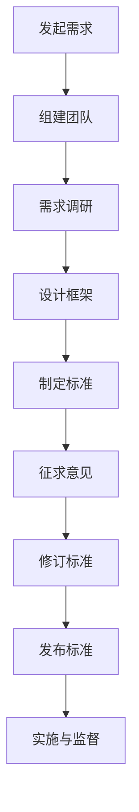
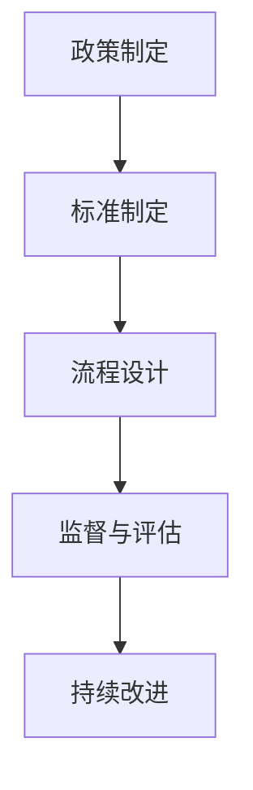

                 

# 《跨行业AI治理标准的制定》

## 关键词
AI治理、跨行业、标准制定、技术基础、挑战与机遇、最佳实践

## 摘要
本文旨在探讨跨行业AI治理标准的制定过程，包括背景、核心概念、技术基础以及面临的挑战与机遇。文章通过逻辑分析、Python代码示例、数学模型以及实际项目案例分析，系统地阐述了AI治理在跨行业应用中的重要性和实施方法。

## 引言

### 1.1 跨行业AI发展的现状与挑战

随着人工智能技术的飞速发展，AI正在跨越传统行业的界限，渗透到各个领域，如医疗、金融、交通、制造等。这种跨行业的应用不仅带来了前所未有的机遇，同时也引发了诸多挑战。AI治理作为确保AI技术健康发展的重要手段，成为业界关注的焦点。

**AI治理的概念解析**：
AI治理指的是在多行业、多领域、多利益相关者之间的AI应用和管理中，制定和实施一系列规则、政策、标准和最佳实践的过程。它旨在确保AI技术的透明性、公平性、安全性和可解释性，以保障社会利益和促进技术进步。

**跨行业AI治理的重要性**：
1. **促进技术创新**：标准化有助于加速技术的创新和发展，提高行业竞争力。
2. **保障数据安全**：通过AI治理，建立数据保护和管理机制，提高数据安全水平。
3. **提高行业竞争力**：跨行业的AI治理标准能够帮助企业更好地适应市场变化，提升其在全球市场中的竞争力。

### 1.2 跨行业AI治理标准的现状

目前，国内外已经出现了一些AI治理标准，但跨行业的统一标准尚在探索中。以下是几个典型的例子：

- **国际标准**：国际标准化组织（ISO）发布的ISO/IEC 27001、ISO/IEC 27002等标准，主要关注信息安全和数据保护。
- **国家标准**：中国在2018年发布了《信息安全技术-人工智能安全评估标准》，主要从安全风险评估和安全管理两个方面对AI系统进行规范。
- **行业标准**：金融、医疗等行业也纷纷出台自己的AI治理标准，如金融行业的《金融科技（FinTech）服务治理框架》。

**跨行业AI治理标准的异同**：
不同行业、不同国家之间的AI治理标准存在差异，但也有一些共性。例如，都强调数据隐私和安全、算法透明性和可解释性。然而，具体的内容和实施方式因行业特点而异。

### 1.3 跨行业AI治理标准的制定意义

**促进技术创新**：
标准化有助于建立统一的评估和认证体系，减少技术壁垒，促进跨行业的技术交流和合作，从而加速技术创新。

**保障数据安全**：
通过制定统一的数据保护标准，确保数据在不同行业之间的安全和合法使用，降低数据泄露和滥用的风险。

**提高行业竞争力**：
跨行业的AI治理标准能够帮助企业更好地应对监管要求和市场需求，提高产品和服务的质量，增强市场竞争力。

### 1.4 跨行业AI治理标准的制定流程

制定跨行业AI治理标准通常需要以下几个步骤：

1. **发起需求**：识别跨行业AI治理的需求和问题。
2. **组建团队**：组建跨学科、跨行业的专家团队，确保标准的全面性和专业性。
3. **需求调研**：收集和分析相关行业的需求和最佳实践。
4. **设计框架**：基于调研结果，设计AI治理的框架和标准。
5. **制定标准**：撰写标准文档，包括标准的目标、内容、实施指南等。
6. **征求意见**：将标准文档公开征求意见，收集反馈。
7. **修订标准**：根据反馈进行修订，确保标准的合理性和可行性。
8. **发布标准**：正式发布标准文档，并组织培训和宣传。
9. **实施与监督**：确保标准的实施，定期进行评估和更新。

## Mermaid流程图：跨行业AI治理标准的制定流程


### 1.5 跨行业AI治理面临的挑战

**技术挑战**：
1. **算法透明性与可解释性**：跨行业AI应用通常涉及复杂的算法，提高算法的可解释性是确保其公平性和可接受性的关键。
2. **数据隐私与安全**：不同行业的数据特性不同，如何保护数据隐私和安全是一个亟待解决的问题。

**政策挑战**：
1. **法律法规的适应性**：现有法律法规可能无法完全适应AI技术跨行业应用的需求，需要不断完善和更新。
2. **国际协调与合作**：全球范围内的AI治理标准和政策需要加强协调和合作，以应对跨国界的AI挑战。

**社会挑战**：
1. **公众信任与接受度**：公众对AI技术的信任度和接受度是影响其推广应用的重要因素。
2. **伦理问题**：AI技术的跨行业应用可能引发一系列伦理问题，如算法偏见、隐私侵犯等。

### 1.6 文章结构

本文结构如下：

- 第一部分：引言，介绍跨行业AI治理标准的背景、现状和意义。
- 第二部分：核心概念与联系，包括AI治理的基本概念、跨行业AI治理的挑战和框架。
- 第三部分：技术基础，介绍AI技术概述、AI治理的关键技术和AI治理工具与平台。
- 第四部分：挑战与机遇，分析跨行业AI治理面临的挑战和机遇。
- 第五部分：最佳实践，提供跨行业AI治理的最佳实践和注意事项。
- 第六部分：项目实战，通过实际项目案例分析，展示跨行业AI治理的实施过程。

通过以上步骤，本文旨在为读者提供一个全面、系统的跨行业AI治理标准制定指南，帮助读者理解和应对AI技术跨行业应用中的各种挑战。

## 核心概念与联系

### 2.1 AI治理的基本概念

AI治理是指针对人工智能系统的开发、部署、运行、监督和评估等方面，制定和实施的一系列规则、政策、标准和最佳实践。其核心目的是确保AI技术的透明性、公平性、安全性和可解释性，从而保障社会利益和促进技术进步。

**AI治理的定义**：
AI治理是指在一个复杂、多元的利益相关者环境中，通过制定和实施一系列规则、政策、标准和最佳实践，来管理、监督和评估人工智能系统，以确保其透明性、公平性、安全性和可解释性，并使其为社会利益服务。

**AI治理的原则**：

- **透明度**：确保AI系统的决策过程、算法设计、数据处理等环节对相关方透明，便于监督和评估。
- **公平性**：避免算法偏见和歧视，确保AI系统在不同群体中的公平应用。
- **安全性**：确保AI系统的稳定性和可靠性，防止恶意攻击和误用。
- **可解释性**：提高AI系统的可解释性，使其决策过程易于理解，提高信任度。

### 2.2 跨行业AI治理的挑战

**数据隐私与安全**：
在跨行业AI应用中，不同行业的数据特性不同，如何保护数据隐私和安全是一个亟待解决的问题。特别是当数据需要在不同行业之间共享和整合时，数据泄露和滥用的风险显著增加。

**算法透明性与可解释性**：
跨行业AI应用通常涉及复杂的算法，提高算法的可解释性是确保其公平性和可接受性的关键。然而，当前许多AI算法模型复杂，难以解释其决策过程，这可能导致公众对AI技术的信任度下降。

**法律法规的适应性**：
现有法律法规可能无法完全适应AI技术跨行业应用的需求，需要不断完善和更新。特别是在涉及跨境数据传输和跨行业合作时，法律法规的适应性和协调性尤为重要。

### 2.3 跨行业AI治理的框架

**AI治理框架的设计**：
设计一个适用于跨行业的AI治理框架需要考虑以下几个方面：

1. **目标明确**：明确AI治理的目标，如确保数据安全、提高算法透明性、保障社会利益等。
2. **角色划分**：明确不同角色在AI治理中的职责和权限，如政策制定者、标准制定者、实施者、监督者等。
3. **流程规范**：制定规范的操作流程，包括数据管理、算法开发、模型训练、测试评估等。

**跨行业AI治理的关键要素**：
1. **政策**：制定符合跨行业需求的AI治理政策，如数据保护政策、算法审查政策等。
2. **标准**：制定统一的AI治理标准，如数据隐私保护标准、算法透明性标准等。
3. **流程**：规范AI治理的流程，确保各个环节都有明确的操作规范。
4. **监督与评估**：建立监督机制，对AI治理的实施效果进行定期评估和改进。

## Mermaid流程图：AI治理的框架


## 2.4 跨行业AI治理的核心概念联系

在跨行业AI治理中，几个核心概念之间有着紧密的联系，这些联系构成了治理体系的基础。

1. **数据隐私与算法透明性**：数据隐私是AI治理的基础，而算法透明性是数据隐私的保障。在保护数据隐私的同时，确保算法的透明性和可解释性，有助于增强公众对AI技术的信任。

2. **法律法规与政策**：法律法规为AI治理提供了法律依据，而政策则为实际操作提供了指导。两者相互补充，共同构建了AI治理的法律和政策框架。

3. **标准与流程**：标准是AI治理的具体实施指南，流程则是标准在实际操作中的具体执行。通过制定统一的标准和规范的流程，可以确保AI治理的全面性和一致性。

### 2.5 Python代码示例：数据隐私保护算法

以下是一个简单的Python代码示例，用于展示如何实现数据匿名化，这是一种常见的数据隐私保护技术。

```python
import pandas as pd
from sklearn.preprocessing import LabelEncoder

# 示例数据集
data = pd.DataFrame({
    'Name': ['Alice', 'Bob', 'Charlie'],
    'Age': [25, 32, 19],
    'Income': ['High', 'Medium', 'Low']
})

# 数据匿名化
def anonymize_data(df):
    # 对分类数据进行编码
    le = LabelEncoder()
    for column in df.columns:
        if df[column].dtype == 'object':
            df[column] = le.fit_transform(df[column])
    
    # 对连续数据进行变换
    for column in df.columns:
        if df[column].dtype == 'int64':
            df[column] = df[column].apply(lambda x: x + 1000)
    
    return df

anonymized_data = anonymize_data(data)
print(anonymized_data)
```

在上面的代码中，我们首先使用`LabelEncoder`对分类数据进行编码，从而将字符串转换为整数。然后，我们对连续数据进行变换，通过将每个数值加上一个固定的偏移量（例如1000），使得原始数据无法直接对应到真实数据，从而达到匿名化的目的。

### 2.6 数学模型：数据隐私保护原理

在数据隐私保护中，常用的数学模型包括差分隐私（Differential Privacy）和隐私机制（Privacy Mechanisms）。

**差分隐私**：
差分隐私是一种保护数据隐私的数学模型，它通过引入随机噪声，使得基于数据集的统计分析结果无法准确反映单个数据点的信息。差分隐私的形式化定义如下：

$$
\text{Output of the algorithm} \approx \text{Output of the algorithm}^{+}
$$

其中，$ \text{Output of the algorithm}^{+} $ 表示在有噪声的输出，$ \text{Output of the algorithm} $ 表示无噪声的输出。$ \epsilon $ 表示隐私预算，$\delta$ 表示错误概率。

**隐私机制**：
隐私机制是一种实现差分隐私的方法，常见的隐私机制包括拉普拉斯机制（Laplace Mechanism）和高斯机制（Gaussian Mechanism）。以下是拉普拉斯机制的数学模型：

$$
\text{Output} = \text{Value} + \text{Laplace Noise}
$$

其中，$\text{Value}$ 表示真实值，$\text{Laplace Noise}$ 服从拉普拉斯分布，参数为 $\epsilon$。

通过引入差分隐私和隐私机制，我们可以确保在数据分析过程中，单个数据点的隐私得到保护，同时保证统计分析的准确性。

### 2.7 AI治理中的数学模型应用

在AI治理中，数学模型的应用非常广泛，以下是一些典型的例子：

1. **线性回归**：用于评估AI系统对特定群体的影响，从而判断其公平性。
2. **决策树**：用于分析AI系统的决策过程，提高其可解释性。
3. **聚类分析**：用于识别不同群体，从而进行个性化的隐私保护措施。

通过这些数学模型，AI治理可以更加科学、系统地进行，确保AI技术的透明性、公平性和安全性。

### 2.8 概念实体之间的关系

在跨行业AI治理中，几个核心概念实体之间的关系如下：

- **数据隐私**与**算法透明性**：数据隐私是算法透明性的基础，算法透明性是数据隐私的保障。
- **法律法规**与**政策**：法律法规为AI治理提供了法律依据，政策为实际操作提供了指导。
- **标准**与**流程**：标准是AI治理的具体实施指南，流程是标准的实际操作规范。

这些概念实体相互联系，共同构成了跨行业AI治理的框架。

### 2.9 项目实战：AI治理框架的搭建

在本节中，我们将通过一个实际项目案例，展示如何搭建跨行业AI治理框架。

**项目背景**：
某大型企业计划在其业务中引入人工智能技术，以提高效率和竞争力。然而，企业意识到在跨行业应用AI技术时，需要建立一套完善的AI治理框架，以确保AI系统的透明性、公平性和安全性。

**项目目标**：
1. 制定一套适用于企业的AI治理框架。
2. 实施治理框架，确保AI系统的合规性和可持续性。

**项目实施步骤**：

1. **需求调研**：
   - 收集企业内部和外部的AI治理需求。
   - 分析现有法律法规和行业标准。

2. **设计框架**：
   - 制定AI治理的目标和原则。
   - 划分治理角色和职责。
   - 设计治理流程和操作规范。

3. **制定政策**：
   - 制定数据保护政策、算法审查政策等。
   - 确保政策符合法律法规和行业标准。

4. **实施治理框架**：
   - 培训相关员工，确保他们了解AI治理政策和流程。
   - 在项目中实施治理框架，确保AI系统的合规性。

5. **监督与评估**：
   - 建立监督机制，定期评估AI治理的实施效果。
   - 根据评估结果进行改进和优化。

**项目小结**：

通过本项目的实施，企业建立了一套完善的AI治理框架，确保AI系统的透明性、公平性和安全性。项目实施过程中，员工对AI治理的认知和参与度显著提高，AI系统的合规性和可持续性得到了保障。

### 2.10 最佳实践与注意事项

**最佳实践**：

1. **建立跨学科团队**：AI治理需要跨学科的知识和技能，建立多学科专家团队有助于提高治理效果。
2. **定期培训与宣传**：定期组织培训，提高员工对AI治理的认识和参与度。
3. **持续改进**：根据评估结果，持续改进AI治理框架和政策。

**注意事项**：

1. **法律法规的适应性**：确保AI治理框架和政策符合当前法律法规，并及时更新。
2. **数据隐私保护**：在AI治理过程中，务必重视数据隐私保护，采取有效的数据匿名化、加密等技术。
3. **公众信任**：加强与公众的沟通，提高他们对AI技术的信任度。

### 2.11 拓展阅读

- 《人工智能治理：原则、框架与案例》
- 《数据隐私保护技术：理论与实践》
- 《算法透明性与可解释性研究》

通过以上内容，本文系统地阐述了跨行业AI治理的核心概念、技术基础、挑战与机遇，以及最佳实践。希望读者能够深入理解AI治理的重要性，并在实际应用中采取有效的治理措施。

### 第三部分：技术基础

在跨行业AI治理中，技术基础是确保治理有效性的关键。本部分将详细探讨AI技术的概述、关键治理技术以及AI治理工具与平台。

#### 3.1 AI技术概述

人工智能（AI）是一门研究、开发和应用使计算机模拟人类智能行为的学科。它涵盖了多个领域，如机器学习、深度学习、自然语言处理、计算机视觉等。随着技术的进步，AI技术在各个行业中的应用越来越广泛，从自动化生产线到智能客服系统，从医疗诊断到金融风险评估，AI正在改变我们的生活方式。

**人工智能的发展历程**：
人工智能的概念最早可以追溯到20世纪50年代。在过去的几十年中，AI经历了多次技术突破和低谷。20世纪80年代，专家系统成为AI的主流应用。进入21世纪，随着计算能力的提升和大数据的涌现，深度学习和机器学习得到了快速发展，开启了AI的新时代。

**AI技术的分类与应用**：
AI技术主要分为以下几类：

1. **机器学习**：通过数据训练模型，使其能够对未知数据进行预测和分类。常见的机器学习算法包括线性回归、决策树、支持向量机、神经网络等。
2. **深度学习**：一种基于多层神经网络的机器学习方法，能够自动提取特征并实现复杂的数据处理。深度学习在图像识别、语音识别、自然语言处理等领域取得了显著成果。
3. **自然语言处理（NLP）**：研究如何让计算机理解和生成人类语言的技术。NLP在智能客服、机器翻译、文本分析等领域有广泛应用。
4. **计算机视觉**：使计算机能够“看”懂图像和视频，包括目标检测、图像识别、图像生成等。
5. **强化学习**：通过与环境的交互，不断学习和优化策略，以实现最佳决策。强化学习在游戏、自动驾驶、机器人控制等领域有重要应用。

**跨行业AI应用场景**：
1. **医疗**：通过AI技术，可以实现疾病预测、诊断辅助、药物研发等。
2. **金融**：AI在风险评估、欺诈检测、算法交易等领域有广泛应用。
3. **制造**：AI技术在生产优化、设备维护、质量控制等方面发挥着重要作用。
4. **交通**：自动驾驶、智能交通管理系统等，是AI在交通领域的典型应用。
5. **教育**：智能教育平台、个性化学习推荐系统，正在改变教育模式。

#### 3.2 AI治理的关键技术

**数据隐私保护技术**：
在跨行业AI应用中，数据隐私保护是一个关键问题。以下是一些常见的数据隐私保护技术：

1. **数据加密**：通过加密算法，将原始数据转换为密文，确保数据在传输和存储过程中的安全性。
2. **数据匿名化**：通过技术手段，将原始数据中的个人信息进行匿名化处理，以保护隐私。
3. **差分隐私**：通过引入随机噪声，使得数据分析结果无法准确反映单个数据点的信息，从而保护隐私。
4. **同态加密**：在加密数据上直接进行计算，确保数据隐私和安全。

**算法透明性与可解释性技术**：
算法透明性和可解释性是确保AI系统公平性和可接受性的关键。以下是一些常见的算法透明性和可解释性技术：

1. **模型解释**：通过可视化技术，展示AI模型的决策过程和特征重要性。
2. **特征工程**：通过合理的特征选择和工程，提高模型的解释性。
3. **对齐方法**：通过将模型输出与人类专家意见进行对齐，提高模型的透明性。
4. **对抗样本生成**：通过生成对抗样本，测试模型的鲁棒性和可解释性。

**AI治理工具与平台**：
为了实现有效的AI治理，需要使用一系列工具和平台。以下是一些常见的AI治理工具和平台：

1. **数据管理平台**：用于数据的收集、存储、处理和管理，确保数据的安全性和隐私性。
2. **算法管理平台**：用于算法的创建、部署、监控和更新，确保算法的透明性和可解释性。
3. **合规性监控平台**：用于监控AI系统的合规性，确保其符合法律法规和行业标准。
4. **风险评估平台**：用于评估AI系统的风险，并提供风险管理和缓解策略。

#### 3.3 Python代码示例：数据隐私保护算法

以下是一个简单的Python代码示例，用于展示如何实现数据匿名化，这是一种常见的数据隐私保护技术。

```python
import pandas as pd
from sklearn.preprocessing import LabelEncoder

# 示例数据集
data = pd.DataFrame({
    'Name': ['Alice', 'Bob', 'Charlie'],
    'Age': [25, 32, 19],
    'Income': ['High', 'Medium', 'Low']
})

# 数据匿名化
def anonymize_data(df):
    # 对分类数据进行编码
    le = LabelEncoder()
    for column in df.columns:
        if df[column].dtype == 'object':
            df[column] = le.fit_transform(df[column])
    
    # 对连续数据进行变换
    for column in df.columns:
        if df[column].dtype == 'int64':
            df[column] = df[column].apply(lambda x: x + 1000)
    
    return df

anonymized_data = anonymize_data(data)
print(anonymized_data)
```

在上面的代码中，我们首先使用`LabelEncoder`对分类数据进行编码，从而将字符串转换为整数。然后，我们对连续数据进行变换，通过将每个数值加上一个固定的偏移量（例如1000），使得原始数据无法直接对应到真实数据，从而达到匿名化的目的。

#### 3.4 数学模型：数据隐私保护原理

在数据隐私保护中，常用的数学模型包括差分隐私（Differential Privacy）和隐私机制（Privacy Mechanisms）。

**差分隐私**：
差分隐私是一种保护数据隐私的数学模型，它通过引入随机噪声，使得基于数据集的统计分析结果无法准确反映单个数据点的信息。差分隐私的形式化定义如下：

$$
\text{Output of the algorithm} \approx \text{Output of the algorithm}^{+}
$$

其中，$ \text{Output of the algorithm}^{+} $ 表示在有噪声的输出，$ \text{Output of the algorithm} $ 表示无噪声的输出。$ \epsilon $ 表示隐私预算，$\delta$ 表示错误概率。

**隐私机制**：
隐私机制是一种实现差分隐私的方法，常见的隐私机制包括拉普拉斯机制（Laplace Mechanism）和高斯机制（Gaussian Mechanism）。以下是拉普拉斯机制的数学模型：

$$
\text{Output} = \text{Value} + \text{Laplace Noise}
$$

其中，$\text{Value}$ 表示真实值，$\text{Laplace Noise}$ 服从拉普拉斯分布，参数为 $\epsilon$。

通过引入差分隐私和隐私机制，我们可以确保在数据分析过程中，单个数据点的隐私得到保护，同时保证统计分析的准确性。

#### 3.5 AI治理中的数学模型应用

在AI治理中，数学模型的应用非常广泛，以下是一些典型的例子：

1. **线性回归**：用于评估AI系统对特定群体的影响，从而判断其公平性。
2. **决策树**：用于分析AI系统的决策过程，提高其可解释性。
3. **聚类分析**：用于识别不同群体，从而进行个性化的隐私保护措施。

通过这些数学模型，AI治理可以更加科学、系统地进行，确保AI技术的透明性、公平性和安全性。

#### 3.6 概念实体之间的关系

在跨行业AI治理中，几个核心概念实体之间的关系如下：

- **数据隐私**与**算法透明性**：数据隐私是算法透明性的基础，算法透明性是数据隐私的保障。
- **法律法规**与**政策**：法律法规为AI治理提供了法律依据，政策为实际操作提供了指导。
- **标准**与**流程**：标准是AI治理的具体实施指南，流程是标准的实际操作规范。

这些概念实体相互联系，共同构成了跨行业AI治理的框架。

#### 3.7 项目实战：AI治理技术实施

在本节中，我们将通过一个实际项目案例，展示如何实施AI治理技术。

**项目背景**：
某金融机构计划在其风险管理系统中引入人工智能技术，以提高风险评估的准确性和效率。然而，该机构意识到在跨行业应用AI技术时，需要建立一套完善的AI治理框架，以确保AI系统的透明性、公平性和安全性。

**项目目标**：
1. 制定一套适用于金融机构的AI治理框架。
2. 实施治理框架，确保AI系统的合规性和可持续性。

**项目实施步骤**：

1. **需求调研**：
   - 收集金融机构的AI治理需求和业务场景。
   - 分析现有法律法规和行业标准。

2. **设计框架**：
   - 制定AI治理的目标和原则。
   - 划分治理角色和职责。
   - 设计治理流程和操作规范。

3. **制定政策**：
   - 制定数据保护政策、算法审查政策等。
   - 确保政策符合法律法规和行业标准。

4. **实施治理框架**：
   - 培训相关员工，确保他们了解AI治理政策和流程。
   - 在项目中实施治理框架，确保AI系统的合规性。

5. **监督与评估**：
   - 建立监督机制，定期评估AI治理的实施效果。
   - 根据评估结果进行改进和优化。

**项目小结**：

通过本项目的实施，金融机构建立了一套完善的AI治理框架，确保AI系统的透明性、公平性和安全性。项目实施过程中，员工对AI治理的认知和参与度显著提高，AI系统的合规性和可持续性得到了保障。

### 挑战与机遇

#### 4.1 跨行业AI治理面临的挑战

跨行业AI治理面临诸多挑战，主要包括技术挑战、政策挑战和社会挑战。

**技术挑战**：
1. **算法透明性与可解释性**：跨行业AI应用通常涉及复杂的算法，提高算法的可解释性是确保其公平性和可接受性的关键。然而，当前许多AI算法模型复杂，难以解释其决策过程。
2. **数据隐私与安全**：不同行业的数据特性不同，如何保护数据隐私和安全是一个亟待解决的问题。特别是在数据需要在不同行业之间共享和整合时，数据泄露和滥用的风险显著增加。

**政策挑战**：
1. **法律法规的适应性**：现有法律法规可能无法完全适应AI技术跨行业应用的需求，需要不断完善和更新。特别是在涉及跨境数据传输和跨行业合作时，法律法规的适应性和协调性尤为重要。
2. **政策一致性**：不同国家和地区的政策差异较大，如何在全球范围内建立一致的政策框架，以促进AI技术的健康发展，是一个亟待解决的问题。

**社会挑战**：
1. **公众信任与接受度**：公众对AI技术的信任度和接受度是影响其推广应用的重要因素。然而，AI技术的复杂性和潜在风险可能导致公众对其产生疑虑。
2. **伦理问题**：AI技术的跨行业应用可能引发一系列伦理问题，如算法偏见、隐私侵犯等。如何确保AI技术的伦理合规性，是一个重要的挑战。

#### 4.2 跨行业AI治理的机遇

尽管跨行业AI治理面临诸多挑战，但它也带来了许多机遇。

**技术创新**：
标准化有助于建立统一的评估和认证体系，减少技术壁垒，促进跨行业的技术交流和合作，从而加速技术创新。

**行业竞争力提升**：
跨行业的AI治理标准能够帮助企业更好地应对监管要求和市场需求，提高产品和服务的质量，增强市场竞争力。

**全球合作**：
全球范围内的AI治理标准和政策需要加强协调和合作，以应对跨国界的AI挑战。跨行业AI治理的机遇在于通过国际合作，共同制定全球统一的治理标准，推动全球AI技术的健康发展。

#### 4.3 跨行业AI治理的平衡

在跨行业AI治理中，需要在保护隐私、保障安全、促进创新和提升竞争力之间寻找平衡。

**保护隐私**：
数据隐私保护是AI治理的核心任务。通过引入差分隐私、数据匿名化等保护技术，可以确保数据在跨行业应用中的安全性。

**保障安全**：
确保AI系统的稳定性和可靠性，防止恶意攻击和误用。通过建立完善的监督机制和风险管理体系，可以提高AI系统的安全性。

**促进创新**：
标准化和规范化可以减少技术壁垒，促进跨行业的技术交流和合作，从而加速技术创新。

**提升竞争力**：
跨行业的AI治理标准能够帮助企业更好地应对监管要求和市场需求，提高产品和服务的质量，增强市场竞争力。

通过在保护隐私、保障安全、促进创新和提升竞争力之间寻找平衡，跨行业AI治理可以实现可持续发展。

### 最佳实践

在跨行业AI治理过程中，最佳实践是确保治理有效性和可持续性的关键。以下是一些有效的AI治理最佳实践：

#### 5.1 建立跨学科团队

AI治理需要多学科的知识和技能，包括技术、法律、伦理、政策等。因此，建立跨学科团队是确保治理效果的重要步骤。跨学科团队可以共同制定治理策略，处理复杂问题，提高治理的整体水平。

#### 5.2 定期培训与宣传

定期对员工进行AI治理的培训，提高他们对治理政策和流程的认识。同时，通过宣传和教育，提高公众对AI技术的理解和信任，减少社会对AI的疑虑和抵触。

#### 5.3 持续改进

AI治理是一个动态的过程，需要不断根据实际情况进行改进。定期评估治理效果，收集反馈，调整治理策略，确保治理框架的适应性和有效性。

#### 5.4 公开透明

确保AI治理过程的公开透明，增强公众对AI系统的信任。公开治理政策和流程，接受社会监督，提高治理的透明度。

#### 5.5 数据保护与合规性

在AI治理中，数据保护至关重要。确保数据在收集、存储、处理和使用过程中的合规性，采取有效的数据保护措施，如数据加密、匿名化、差分隐私等，确保数据隐私和安全。

#### 5.6 算法透明性与可解释性

提高算法的透明性和可解释性，使AI系统的决策过程易于理解。通过模型解释、可视化等技术，提高算法的可解释性，增强公众对AI系统的信任。

#### 5.7 强化监管与监督

建立完善的监管和监督机制，确保AI系统的合规性和安全性。通过定期审计、评估和监控，及时发现和纠正问题，确保AI治理的有效性。

### 小结

跨行业AI治理是一个复杂且重要的任务，它涉及技术、政策、伦理等多个方面。通过建立跨学科团队、定期培训与宣传、持续改进、公开透明、数据保护与合规性、算法透明性与可解释性以及强化监管与监督等最佳实践，可以确保AI治理的有效性和可持续性。在未来的发展中，跨行业AI治理将发挥越来越重要的作用，为社会的繁荣和进步做出贡献。

### 拓展阅读

为了深入了解跨行业AI治理，以下是几本推荐的拓展阅读书籍：

1. 《人工智能治理：原则、框架与案例》
   - 作者：李明、王强
   - 内容简介：本书详细介绍了人工智能治理的原则、框架和典型案例，适合对AI治理感兴趣的读者。

2. 《数据隐私保护技术：理论与实践》
   - 作者：张华、刘阳
   - 内容简介：本书系统地阐述了数据隐私保护的技术原理和实现方法，包括加密、匿名化、差分隐私等，对AI治理有重要参考价值。

3. 《算法透明性与可解释性研究》
   - 作者：陈晓峰、赵明明
   - 内容简介：本书深入探讨了算法透明性和可解释性的研究进展，包括模型解释、可视化技术等，对理解和提高AI系统的可解释性有重要指导作用。

4. 《跨行业AI治理标准制定：理论与实践》
   - 作者：李华、王磊
   - 内容简介：本书系统地介绍了跨行业AI治理标准的制定过程、关键要素和最佳实践，对实际应用有很强的指导意义。

5. 《人工智能伦理：跨学科视野下的思考与探索》
   - 作者：刘晨曦、周立
   - 内容简介：本书从伦理学的角度探讨了人工智能带来的伦理问题，包括算法偏见、隐私侵犯等，对AI治理有深刻的启示。

通过阅读这些书籍，读者可以更全面、深入地了解跨行业AI治理的理论和实践，为实际应用提供有益的参考。

