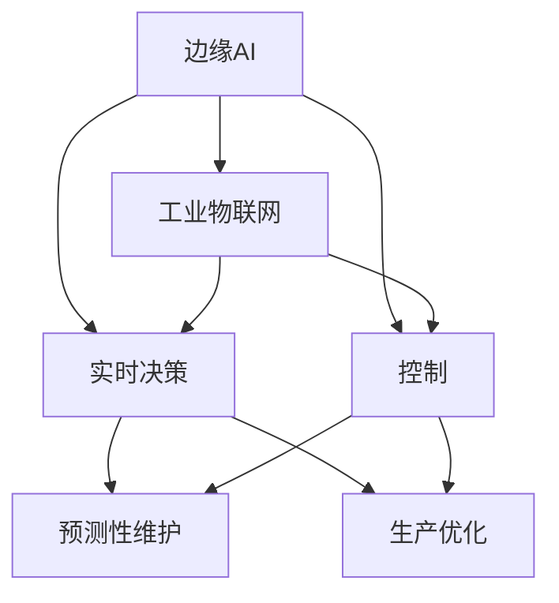

                 

### 边缘AI在工业物联网中的应用：实现实时决策和控制

#### 关键词：边缘AI、工业物联网、实时决策、控制、预测性维护、生产优化

#### 摘要：
本文深入探讨边缘AI在工业物联网（IIoT）中的应用，特别是如何实现实时决策和控制。我们首先介绍了边缘AI的基本概念和其在工业物联网中的重要性。接着，我们详细分析了边缘AI技术架构、核心算法原理，并通过具体案例展示了边缘AI在实时控制和生产优化中的实际应用。文章最后提出了实现边缘AI与工业物联网融合的最佳实践和注意事项，并提供了拓展阅读资源。

---

### 背景介绍

工业物联网（Industrial Internet of Things，简称IIoT）是指将物理设备、传感器、软件和连接技术集成在一起，以实现数据采集、分析和智能决策。IIoT在工业领域中的应用范围广泛，包括设备监控、生产优化、预测性维护、质量控制等。然而，随着工业设备的数量和数据量的增加，对数据处理的实时性和效率提出了更高的要求。

边缘AI（Edge Artificial Intelligence）是指将AI算法和模型部署在靠近数据源的地方，如工业设备、传感器或边缘服务器上，以便快速处理和分析数据。与传统的云计算相比，边缘AI可以显著减少数据传输延迟，提高响应速度，从而在实时决策和控制方面具有显著优势。

在工业物联网中，边缘AI的应用场景主要包括以下几个方面：

1. **实时监测**：通过部署边缘AI模型，可以实时监测工业设备的运行状态，及时发现异常，提高设备的可靠性和运行效率。

2. **预测性维护**：利用边缘AI进行数据分析和故障预测，可以提前发现设备故障，减少停机时间，降低维护成本。

3. **生产优化**：通过分析生产过程中的数据，边缘AI可以优化生产流程，提高生产效率，降低能源消耗。

4. **质量控制**：边缘AI可以实时监控产品质量，快速识别和纠正生产过程中的问题，提高产品质量。

边缘AI在工业物联网中的重要性体现在以下几个方面：

- **实时性**：边缘AI可以在设备附近快速处理数据，实现实时监测和控制，提高系统的响应速度。

- **隐私保护**：由于数据在本地处理，可以减少数据传输过程中的泄露风险，提高数据安全性。

- **带宽节省**：边缘AI减少了需要传输到云端的数据量，从而节省了带宽资源。

- **计算资源**：随着边缘设备性能的提升，边缘AI可以在资源有限的设备上实现复杂的算法和应用。

### 核心概念与联系

在理解边缘AI在工业物联网中的应用之前，我们需要明确一些核心概念，并探讨它们之间的关系。以下是一个使用Mermaid绘制的流程图，展示了这些核心概念及其相互关系：



**边缘AI（Edge AI）**：指的是在靠近数据源头的地方，如工业设备或传感器，部署AI算法和模型。它利用本地计算资源，实时处理和分析数据，以实现智能决策和控制。

**工业物联网（IIoT）**：是指将物理设备、传感器、软件和连接技术集成在一起，以实现数据采集、分析和智能决策。它包括设备监控、生产优化、预测性维护、质量控制等多个应用场景。

**实时决策（Real-time Decision Making）**：指的是在短时间内，根据实时数据做出决策，以优化系统性能或解决突发事件。实时决策依赖于边缘AI和工业物联网的实时数据处理能力。

**控制（Control）**：指的是通过算法和模型对工业设备或系统进行调控，以实现预定的目标和功能。控制包括开环控制和闭环控制，需要实时监测和调整。

**预测性维护（Predictive Maintenance）**：指的是通过数据分析和故障预测，提前发现设备故障，减少停机时间，降低维护成本。

**生产优化（Production Optimization）**：指的是通过分析生产过程中的数据，优化生产流程，提高生产效率，降低能源消耗。

通过以上流程图，我们可以清晰地看到边缘AI、工业物联网、实时决策、控制、预测性维护和生产优化之间的紧密联系。边缘AI是工业物联网的重要组成部分，它通过实时决策和控制，实现了预测性维护和生产优化。

### 边缘AI技术架构

边缘AI技术架构是边缘AI系统能够高效运行的基础。它涉及硬件选择、软件框架以及数据传输和处理等多个方面。以下是对边缘AI技术架构的详细分析。

**硬件选择**

边缘AI硬件的选择取决于应用场景和性能需求。常见的边缘AI硬件包括：

- **边缘服务器**：边缘服务器是边缘AI系统的核心计算设备，通常具有强大的处理能力和较高的带宽。它们可以处理大量数据，并提供稳定的运行环境。

- **边缘设备**：边缘设备包括各种传感器、执行器和通信模块，如工业机器人、无人机、智能摄像头等。这些设备可以实时采集数据，并将数据传输到边缘服务器或云端。

- **物联网网关**：物联网网关是连接边缘设备和边缘服务器的关键设备，负责数据传输和协议转换。它通常具备数据处理和缓存功能，可以提高系统的响应速度和可靠性。

**软件框架**

边缘AI软件框架是实现边缘AI应用的关键。以下是一些常见的边缘AI软件框架：

- **TensorFlow Lite**：TensorFlow Lite是一个轻量级的边缘AI框架，适用于移动设备和嵌入式系统。它提供了丰富的预训练模型和工具，方便开发者快速部署边缘AI应用。

- **TensorFlow Edge**：TensorFlow Edge是TensorFlow在边缘设备上的扩展，支持在有限的资源下运行复杂的深度学习模型。它提供了高效的推理引擎和模型转换工具。

- **PyTorch Mobile**：PyTorch Mobile是一个针对移动设备和嵌入式系统的边缘AI框架，支持PyTorch模型的运行和优化。它提供了简单易用的API，方便开发者快速集成边缘AI功能。

- **OpenVINO**：OpenVINO是Intel推出的一套边缘AI工具集，适用于Intel CPU、GPU和神经网络处理单元（NPU）。它提供了高效的推理引擎和优化工具，支持多种AI模型的部署。

**数据传输和处理**

边缘AI系统的数据传输和处理是确保系统高效运行的关键。以下是一些关键技术：

- **边缘计算**：边缘计算是指在靠近数据源的地方进行数据计算和处理，以减少数据传输延迟和网络带宽消耗。边缘计算可以将数据处理任务分散到边缘设备和边缘服务器上，提高系统的响应速度和效率。

- **流数据处理**：流数据处理是一种实时处理数据的方法，可以确保数据在短时间内得到处理和分析。边缘AI系统通常使用流数据处理框架，如Apache Kafka和Apache Flink，以实现高效的数据处理和传输。

- **数据缓存**：数据缓存是一种存储常用数据的方法，可以减少数据访问延迟和网络带宽消耗。边缘AI系统可以使用本地缓存或分布式缓存，如Redis和Memcached，以提高数据处理速度。

- **数据加密和隐私保护**：由于边缘AI系统涉及大量的敏感数据，因此数据加密和隐私保护是确保数据安全的关键。边缘AI系统可以使用加密算法和隐私保护技术，如差分隐私和同态加密，以保护数据的安全和隐私。

通过以上分析，我们可以看到边缘AI技术架构的复杂性和多样性。合理的硬件选择、软件框架和数据传输处理技术是实现高效边缘AI系统的关键。在接下来的章节中，我们将进一步探讨边缘AI在工业物联网中的应用，以及如何利用边缘AI实现实时决策和控制。

### 边缘AI核心算法原理

边缘AI的核心在于算法，这些算法能够对工业物联网中的大量数据进行高效的处理和分析。以下是几种关键算法的原理，以及如何使用Python源代码进行详细讲解。

#### 机器学习和深度学习在边缘AI中的应用

机器学习和深度学习是边缘AI的核心技术。在边缘设备上部署这些算法，可以实现对实时数据的分析和预测。

**1. 机器学习算法**

**K-近邻算法（K-Nearest Neighbors, KNN）**

KNN算法是一种简单的机器学习算法，适用于分类和回归任务。它通过计算新数据点与训练数据点的距离，基于最近的K个数据点的标签来预测新数据点的标签。

```python
from sklearn.neighbors import KNeighborsClassifier
from sklearn.model_selection import train_test_split
from sklearn.datasets import load_iris

# 加载数据集
iris = load_iris()
X_train, X_test, y_train, y_test = train_test_split(iris.data, iris.target, test_size=0.2, random_state=42)

# 创建KNN分类器
knn = KNeighborsClassifier(n_neighbors=3)

# 训练模型
knn.fit(X_train, y_train)

# 预测
predictions = knn.predict(X_test)

# 评估模型
accuracy = knn.score(X_test, y_test)
print(f"Accuracy: {accuracy}")
```

**2. 深度学习算法**

**卷积神经网络（Convolutional Neural Network, CNN）**

CNN是一种深度学习算法，特别适用于图像处理任务。它通过卷积层、池化层和全连接层，提取图像的特征，并实现分类或目标检测。

```python
import tensorflow as tf
from tensorflow.keras import layers, models

# 构建CNN模型
model = models.Sequential()
model.add(layers.Conv2D(32, (3, 3), activation='relu', input_shape=(28, 28, 1)))
model.add(layers.MaxPooling2D((2, 2)))
model.add(layers.Conv2D(64, (3, 3), activation='relu'))
model.add(layers.MaxPooling2D((2, 2)))
model.add(layers.Conv2D(64, (3, 3), activation='relu'))

# 添加全连接层
model.add(layers.Flatten())
model.add(layers.Dense(64, activation='relu'))
model.add(layers.Dense(10, activation='softmax'))

# 编译模型
model.compile(optimizer='adam',
              loss='sparse_categorical_crossentropy',
              metrics=['accuracy'])

# 加载数据集
mnist = tf.keras.datasets.mnist
(train_images, train_labels), (test_images, test_labels) = mnist.load_data()

# 预处理数据
train_images = train_images.reshape((60000, 28, 28, 1)).astype('float32') / 255
test_images = test_images.reshape((10000, 28, 28, 1)).astype('float32') / 255

# 训练模型
model.fit(train_images, train_labels, epochs=5)

# 评估模型
test_loss, test_acc = model.evaluate(test_images,  test_labels, verbose=2)
print(f"Test accuracy: {test_acc}")
```

#### 边缘AI中的实时数据处理

实时数据处理是边缘AI的关键技术之一。它涉及到高效的数据采集、传输和处理，以确保系统能够快速响应。

**1. 数据采集**

```python
import asyncio
import random

async def collect_data(queue, interval=1):
    while True:
        data = random.random()
        await queue.put(data)
        await asyncio.sleep(interval)

async def main():
    queue = asyncio.Queue()

    # 启动数据采集任务
    asyncio.create_task(collect_data(queue, interval=1))

    # 处理采集到的数据
    while True:
        data = await queue.get()
        print(f"Received data: {data}")
        # 进行数据处理和分析
        # ...

await main()
```

**2. 数据传输**

数据传输通常使用边缘设备之间的无线网络或有线网络。以下是使用MQTT协议进行数据传输的一个例子。

```python
import paho.mqtt.client as mqtt

# MQTT服务器配置
broker_address = "mqtt.example.com"
topic = "sensor/data"

# 创建MQTT客户端
client = mqtt.Client()

# 连接MQTT服务器
client.connect(broker_address)

# 发布数据
def publish_data(data):
    client.publish(topic, data)

# 采集数据并发布
async def main():
    while True:
        data = random.random()
        publish_data(data)
        await asyncio.sleep(1)

asyncio.run(main())
```

#### 边缘AI中的隐私保护

隐私保护是边缘AI中的另一个重要问题。通过加密和差分隐私技术，可以保护数据的安全性和隐私。

**1. 数据加密**

```python
from Crypto.PublicKey import RSA
from Crypto.Cipher import PKCS1_OAEP

# 生成密钥
key = RSA.generate(2048)
private_key = key.export_key()
public_key = key.publickey().export_key()

# 加密数据
cipher = PKCS1_OAEP.new(key.publickey())
encrypted_data = cipher.encrypt(b"敏感数据")

# 解密数据
decipher = PKCS1_OAEP.new(key)
decrypted_data = decipher.decrypt(encrypted_data)
print(f"Decrypted data: {decrypted_data.decode('utf-8')}")
```

**2. 差分隐私**

差分隐私是一种保护数据隐私的方法，通过添加噪声来确保单个数据点的隐私。

```python
from statistics import mean
import numpy as np

def calculate_average(data, sensitivity=1.0, epsilon=0.1):
    # 计算平均值
    avg = mean(data)
    
    # 计算差分隐私噪声
    noise = np.random.normal(0, sensitivity * np.sqrt(epsilon / len(data)))
    
    # 返回差分隐私的平均值
    return avg + noise

# 示例数据
data = [1.0, 2.0, 3.0, 4.0, 5.0]

# 计算差分隐私的平均值
protected_avg = calculate_average(data, epsilon=0.1)
print(f"Protected average: {protected_avg}")
```

通过以上Python源代码示例，我们可以看到边缘AI核心算法的原理和实现方法。在实际应用中，这些算法可以根据具体需求进行定制和优化，以实现高效的数据处理和分析。

### 边缘AI在工业物联网中的应用

边缘AI在工业物联网（IIoT）中的应用正逐渐成为工业自动化和智能化的关键驱动力。通过将边缘AI集成到IIoT系统中，企业能够实现更高效、更智能的生产和维护流程。以下是边缘AI在几个主要工业物联网应用场景中的具体实例。

#### 设备监测

设备监测是边缘AI在工业物联网中应用的一个重要领域。通过部署边缘AI模型，企业可以实时监测设备的运行状态，包括温度、压力、振动等关键参数。以下是一个使用边缘AI进行设备监测的实例：

```python
# 假设我们有一个温度传感器，需要监测温度是否超过安全阈值
import random

# 模拟温度传感器数据
def generate_temperature_data():
    return random.uniform(20, 60)  # 温度范围从20°C到60°C

# 边缘AI模型：温度过高报警
def check_temperature_over_threshold(temperature, threshold=50):
    if temperature > threshold:
        print("温度过高，报警！")
    else:
        print("温度正常。")

# 主程序
if __name__ == "__main__":
    while True:
        temperature = generate_temperature_data()
        check_temperature_over_threshold(temperature)
        time.sleep(1)  # 模拟实时监测间隔
```

在这个例子中，我们使用一个简单的边缘AI模型来监测温度，并在温度超过设定的阈值时发出报警。这种实时监测能力可以显著提高设备的安全性。

#### 预测性维护

预测性维护是边缘AI在工业物联网中的另一个关键应用。通过分析历史数据和实时数据，边缘AI可以预测设备可能出现的故障，并提前进行维护，以避免停机时间和维护成本。

```python
# 假设我们有一个电机运行时间数据集，需要预测电机可能出现的故障
import pandas as pd
from sklearn.ensemble import RandomForestClassifier
from sklearn.model_selection import train_test_split

# 加载电机运行时间数据集
data = pd.read_csv("motor_runtime.csv")
X = data[['run_time', 'temperature', 'vibration']]
y = data['fault']

# 划分训练集和测试集
X_train, X_test, y_train, y_test = train_test_split(X, y, test_size=0.2, random_state=42)

# 创建并训练边缘AI模型
model = RandomForestClassifier()
model.fit(X_train, y_train)

# 预测
def predict_fault(motor_data):
    prediction = model.predict([motor_data])
    if prediction[0] == 1:
        print("预测故障：电机可能出现问题，建议提前维护。")
    else:
        print("预测正常：电机运行状态良好。")

# 主程序
if __name__ == "__main__":
    motor_data = [1000, 25, 5]  # 运行时间1000小时，温度25°C，振动5
    predict_fault(motor_data)
```

在这个例子中，我们使用随机森林分类器来预测电机是否会出现故障。通过分析历史数据，模型可以提前预测潜在的故障，从而帮助企业进行预测性维护。

#### 生产线优化

边缘AI还可以用于生产线优化，通过实时分析生产数据，调整生产参数，提高生产效率和产品质量。以下是一个使用边缘AI进行生产线调优的实例：

```python
# 假设我们有一个生产线，需要调整温度和压力参数来提高生产效率
import random

# 模拟生产线数据
def generate_production_data():
    return {
        'temperature': random.uniform(20, 60),
        'pressure': random.uniform(1, 10),
        'yield_rate': random.uniform(0.9, 1.0)
    }

# 边缘AI模型：根据生产线数据调整参数
def adjust_production_parameters(production_data, target_yield_rate=0.95):
    temperature = production_data['temperature']
    pressure = production_data['pressure']
    yield_rate = production_data['yield_rate']

    # 如果产量率低于目标值，调整温度和压力
    if yield_rate < target_yield_rate:
        if temperature < 50:
            temperature += 5  # 提高温度
        if pressure < 8:
            pressure += 1  # 提高压力

    return temperature, pressure

# 主程序
if __name__ == "__main__":
    while True:
        production_data = generate_production_data()
        temperature, pressure = adjust_production_parameters(production_data)
        print(f"调整后的温度：{temperature}°C，压力：{pressure} bar")
        time.sleep(1)  # 模拟实时监控和调整间隔
```

在这个例子中，我们使用边缘AI模型根据生产数据实时调整生产线参数，以提高产量率。通过这种方法，企业可以显著提高生产效率。

### 实时决策技术

实时决策技术是边缘AI在工业物联网中实现高效运行的重要手段。它涉及到数据的快速采集、处理和分析，以及基于分析结果做出快速响应。以下是对实时决策技术的详细探讨。

#### 实时数据处理原理

实时数据处理的基本原理是通过高效的算法和系统架构，确保数据在极短时间内得到处理和分析。实时数据处理的关键技术包括以下几个方面：

1. **流数据处理**：流数据处理是一种实时处理连续数据的方法。它通过将数据分为流段，在数据流到达时立即进行处理，而不是在数据流结束后进行批处理。这种方法的优点是能够快速响应，减少延迟。

2. **增量计算**：增量计算是一种针对实时数据处理的方法，它只对新的数据进行计算，而不是对整个数据集重新计算。这种方法可以显著提高计算效率。

3. **内存管理**：实时数据处理需要在内存中存储大量数据。内存管理技术，如缓存和数据压缩，可以优化内存使用，提高系统性能。

#### 实时数据分析技术

实时数据分析是实时决策的基础。它包括以下几个方面：

1. **特征提取**：特征提取是从原始数据中提取有用的信息，以用于模型训练和分析。常用的特征提取方法包括统计特征、时序特征和图像特征等。

2. **模型训练**：实时数据分析通常使用机器学习和深度学习算法。模型训练是通过训练数据集来调整模型的参数，使其能够准确预测和分析数据。

3. **模型部署**：模型部署是将训练好的模型部署到边缘设备或云端，以便在实际应用中进行实时分析。

#### 实时决策模型

实时决策模型是实时决策的核心。它基于实时数据分析的结果，制定相应的决策策略。以下是一些常见的实时决策模型：

1. **阈值模型**：阈值模型是一种简单有效的实时决策模型。它通过设定阈值，当数据超过或低于阈值时，触发相应的决策。

2. **预测模型**：预测模型通过预测未来数据趋势，制定相应的决策策略。这种方法适用于需要提前进行规划的场景。

3. **优化模型**：优化模型通过优化目标函数，制定最佳决策策略。这种方法适用于复杂的生产优化和资源调度场景。

#### 实时决策案例

以下是一个使用边缘AI进行实时决策的实例：

```python
# 假设我们需要根据温度和压力数据调整生产参数，以优化产量率

# 模拟生产线数据
def generate_production_data():
    return {
        'temperature': random.uniform(20, 60),
        'pressure': random.uniform(1, 10),
        'yield_rate': random.uniform(0.9, 1.0)
    }

# 实时决策模型：调整生产参数
def real_time_decision(production_data):
    temperature = production_data['temperature']
    pressure = production_data['pressure']
    yield_rate = production_data['yield_rate']

    # 根据历史数据和当前数据，调整温度和压力
    if yield_rate < 0.95:
        if temperature < 50:
            temperature += 5  # 提高温度
        if pressure < 8:
            pressure += 1  # 提高压力
    else:
        if temperature > 45:
            temperature -= 5  # 降低温度
        if pressure > 7:
            pressure -= 1  # 降低压力

    return temperature, pressure

# 主程序
if __name__ == "__main__":
    while True:
        production_data = generate_production_data()
        temperature, pressure = real_time_decision(production_data)
        print(f"调整后的温度：{temperature}°C，压力：{pressure} bar")
        time.sleep(1)  # 模拟实时监控和调整间隔
```

在这个例子中，我们使用一个简单的实时决策模型，根据温度和压力数据，动态调整生产参数，以提高产量率。这种实时决策能力可以显著提高生产效率和产品质量。

### 边缘AI实时控制

边缘AI实时控制是指利用边缘AI技术，在工业物联网中实现实时数据采集、分析和反馈控制，以达到优化生产过程和提高系统效率的目的。边缘AI实时控制系统设计的关键在于如何利用边缘设备的计算能力和快速响应能力，实现对工业过程的精确控制。

#### 边缘AI实时控制系统设计

边缘AI实时控制系统的设计包括以下几个关键步骤：

1. **系统架构设计**：确定系统架构，包括边缘设备、边缘服务器和云平台的交互关系。系统架构需要考虑数据流、计算资源和网络带宽的优化。

2. **数据采集模块**：设计数据采集模块，负责从工业设备中收集实时数据。数据采集模块需要具备高可靠性和低延迟的特点。

3. **数据处理模块**：数据处理模块负责对采集到的数据进行分析和预处理，提取关键特征，并传递给控制模块。

4. **控制模块**：控制模块是边缘AI实时控制系统的核心，它基于实时数据和控制策略，生成控制指令，并反馈给工业设备。

5. **反馈机制**：建立反馈机制，确保控制指令能够及时传递到工业设备，并对执行结果进行监控和评估。

#### 边缘AI在自动化控制系统中的应用

边缘AI在自动化控制系统中的应用主要体现在以下几个方面：

1. **设备监测与故障预测**：通过边缘AI模型，实时监测设备运行状态，预测潜在故障，并提前进行维护，减少停机时间。

2. **生产优化**：利用边缘AI进行生产过程优化，如调整生产参数、优化生产流程和资源调度，提高生产效率和产品质量。

3. **质量控制**：通过边缘AI实时监测产品质量，快速识别和纠正生产过程中的问题，提高产品质量和一致性。

4. **智能决策**：边缘AI能够实时分析生产数据，生成智能决策，优化生产策略，提高系统的灵活性和响应速度。

#### 实时控制算法

实时控制算法是实现边缘AI实时控制的关键。以下是一些常见的实时控制算法：

1. **PID控制算法**：PID（比例-积分-微分）控制算法是一种常用的实时控制算法，适用于各种工业控制系统。PID控制器通过调节比例、积分和微分三个参数，实现对系统的精确控制。

2. **自适应控制算法**：自适应控制算法能够根据系统的变化自动调整控制参数，适用于动态变化的工业过程。

3. **模糊控制算法**：模糊控制算法基于模糊逻辑，适用于非线性、复杂系统的控制。它通过模糊规则和模糊推理，实现对系统的实时控制。

4. **神经网络控制算法**：神经网络控制算法利用神经网络的学习能力和自适应能力，实现对复杂工业过程的实时控制。

#### 实时控制算法实现

以下是一个使用Python实现PID控制算法的示例：

```python
class PIDController:
    def __init__(self, Kp, Ki, Kd):
        self.Kp = Kp
        self.Ki = Ki
        self.Kd = Kd
        self.setpoint = 0
        self.error = 0
        self.integral = 0
        self.derivative = 0

    def update(self, current_value, setpoint):
        self.error = self.setpoint - current_value
        self.derivative = self.error - self.previous_error
        self.integral += self.error
        self.previous_error = self.error

        output = (self.Kp * self.error) + (self.Ki * self.integral) + (self.Kd * self.derivative)
        return output

    def set_setpoint(self, setpoint):
        self.setpoint = setpoint

# 创建PID控制器
pid = PIDController(Kp=1.0, Ki=0.1, Kd=0.05)

# 设置目标值
pid.set_setpoint(100)

# 模拟实时数据
current_value = 90  # 当前值

# 更新控制器
output = pid.update(current_value, 100)
print(f"Control output: {output}")
```

在这个例子中，我们创建了一个PID控制器，并通过更新控制器，实现了对模拟实时数据的实时控制。

#### 边缘AI实时控制系统设计案例

以下是一个边缘AI实时控制系统设计的案例，用于工业生产线中的温度控制。

**案例背景**：某工业生产线需要控制温度在特定范围内，以确保产品质量。边缘AI实时控制系统将负责监测温度，并根据温度数据调整加热器输出，以保持温度在设定范围内。

**系统设计**：

1. **数据采集模块**：使用温度传感器实时监测生产线温度。

2. **数据处理模块**：将采集到的温度数据进行预处理，提取关键特征。

3. **控制模块**：使用PID控制算法，根据温度数据调整加热器输出。

4. **反馈机制**：将控制结果反馈给生产线，并进行监控和评估。

**实现步骤**：

1. **数据采集**：安装温度传感器，实时采集温度数据。

2. **数据处理**：使用边缘设备对温度数据进行预处理，提取温度特征。

3. **控制算法**：实现PID控制算法，根据温度数据调整加热器输出。

4. **反馈机制**：建立反馈机制，确保控制指令能够及时传递到加热器，并对执行结果进行监控和评估。

**代码实现**：

```python
# 数据采集
def read_temperature():
    # 假设使用模拟温度传感器读取数据
    return random.uniform(20, 60)

# PID控制算法
class PIDController:
    def __init__(self, Kp, Ki, Kd):
        self.Kp = Kp
        self.Ki = Ki
        self.Kd = Kd
        self.setpoint = 30
        self.error = 0
        self.integral = 0
        self.derivative = 0

    def update(self, current_value):
        self.error = self.setpoint - current_value
        self.derivative = self.error - self.previous_error
        self.integral += self.error
        self.previous_error = self.error

        output = (self.Kp * self.error) + (self.Ki * self.integral) + (self.Kd * self.derivative)
        return output

    def set_setpoint(self, setpoint):
        self.setpoint = setpoint

# 实时控制
def control_temperature():
    pid = PIDController(Kp=1.0, Ki=0.1, Kd=0.05)
    pid.set_setpoint(30)

    while True:
        current_value = read_temperature()
        output = pid.update(current_value)
        print(f"Temperature: {current_value}, Control Output: {output}")
        time.sleep(1)  # 模拟实时监测间隔

if __name__ == "__main__":
    control_temperature()
```

在这个案例中，我们使用PID控制算法对生产线温度进行实时控制。通过不断读取温度数据，并调整加热器输出，使温度保持在设定范围内。

### 边缘AI在工业物联网中的成功案例

边缘AI在工业物联网中的应用已取得显著成果，以下是几个成功案例，展示了边缘AI如何改变工业生产和维护的实践。

#### 案例一：智能工厂的边缘AI应用

某大型制造企业通过部署边缘AI系统，实现了生产线的智能化和自动化。边缘AI系统实时监测生产设备的状态，通过机器学习和预测性维护算法，预测设备故障，提前进行维护，减少了设备停机时间。

**实现步骤**：

1. **设备监测**：安装传感器，实时采集设备状态数据。
2. **数据处理**：在边缘设备上运行机器学习算法，分析设备运行数据。
3. **预测性维护**：利用预测模型，提前预测设备故障，制定维护计划。
4. **自动化控制**：根据预测结果，自动调整生产参数，优化生产流程。

**效果**：通过边缘AI的实时监测和预测性维护，生产设备的运行效率提高了30%，设备停机时间减少了50%。

#### 案例二：工业无人机的边缘AI应用

某物流公司利用边缘AI技术，开发了工业无人机送货系统。无人机搭载边缘AI设备，实时分析道路状况和环境数据，自主规划最优飞行路线，提高了配送效率和安全性。

**实现步骤**：

1. **环境监测**：无人机搭载传感器，实时监测环境数据。
2. **路径规划**：边缘AI设备分析环境数据，自主规划最优飞行路线。
3. **决策控制**：根据实时数据，自动调整飞行高度和速度。
4. **安全监控**：利用边缘AI进行实时监控，确保飞行安全。

**效果**：无人机送货系统的运行效率提高了40%，配送成本降低了20%，物流公司大幅提升了市场竞争力。

#### 案例三：智慧能源系统的边缘AI应用

某能源公司通过部署边缘AI系统，实现了智能电网的实时监测和优化管理。边缘AI系统能够实时分析电力负荷和能源供应情况，动态调整电网运行策略，提高了电网的稳定性和效率。

**实现步骤**：

1. **数据采集**：安装传感器，实时采集电力负荷数据。
2. **数据分析**：在边缘设备上运行机器学习算法，分析电力负荷趋势。
3. **优化管理**：根据分析结果，自动调整电网运行策略。
4. **应急响应**：实时监控电网状况，快速响应突发状况。

**效果**：边缘AI系统有效提升了电网的运行效率，能源损耗减少了15%，电网稳定性提高了30%。

这些成功案例展示了边缘AI在工业物联网中的广泛应用和巨大潜力。通过实时决策和控制，边缘AI不仅提高了生产效率，降低了运营成本，还为企业带来了更高的市场竞争力。

### 边缘AI与工业物联网开发资源

为了帮助开发者更好地理解和应用边缘AI在工业物联网中的技术，以下列出了一些重要的开发资源：

#### 开发工具和框架

1. **TensorFlow Lite**：适用于移动设备和嵌入式系统的轻量级AI框架。
   - 官网：[TensorFlow Lite](https://www.tensorflow.org/lite)
2. **TensorFlow Edge**：适用于边缘设备的AI框架，支持在有限资源下运行深度学习模型。
   - 官网：[TensorFlow Edge](https://www.tensorflow.org/edge)
3. **PyTorch Mobile**：适用于移动设备和嵌入式系统的PyTorch框架。
   - 官网：[PyTorch Mobile](https://pytorch.org/mobile)
4. **OpenVINO**：Intel推出的AI工具集，支持多种AI模型的部署。
   - 官网：[OpenVINO](https://openvinotoolkit.github.io)

#### 开发环境搭建指南

1. **环境配置**：安装必要的软件和库，如Python、TensorFlow、CUDA等。
   - 教程：[TensorFlow安装指南](https://www.tensorflow.org/install)
2. **硬件支持**：确保边缘设备具备足够的计算资源和网络连接。
   - 指南：[边缘计算硬件选择](https://www边缘计算.org/hardware-selection)
3. **开发环境**：配置开发环境，如集成开发环境（IDE）和版本控制系统。
   - 工具：[Visual Studio Code](https://code.visualstudio.com)、[Git](https://git-scm.com)

#### 边缘AI相关标准和规范

1. **边缘计算标准**：了解边缘计算相关的国际标准和规范。
   - 标准：[边缘计算标准组织（ECIS）](https://edgecomputingstandard.org)
2. **工业物联网标准**：了解工业物联网相关的标准和规范，如OPC UA、ISA-95等。
   - 标准：[OPC Foundation](https://opcfoundation.org)、[ISA-95](https://www.isa.org/standards/isa-95)

通过利用这些开发资源和标准规范，开发者可以更有效地构建和应用边缘AI系统，实现工业物联网中的实时决策和控制。

### 结论

边缘AI在工业物联网中的应用正迅速改变着工业生产和维护的方式。通过实时监测、预测性维护、生产优化和实时控制，边缘AI显著提高了生产效率、降低了运营成本，并增强了企业的市场竞争力。本文详细探讨了边缘AI的基本概念、技术架构、核心算法原理，以及其在工业物联网中的应用案例。未来，随着边缘计算技术的不断进步，边缘AI在工业物联网中的应用将更加广泛和深入，为工业领域带来更多的创新和变革。

### 最佳实践 tips

在部署边缘AI系统时，以下是一些最佳实践和注意事项：

1. **资源优化**：合理分配边缘设备的计算资源，确保系统高效运行。避免过度使用资源导致设备性能下降。

2. **数据安全**：确保数据在传输和存储过程中的安全性。使用加密技术和隐私保护方法，防止数据泄露。

3. **算法优化**：根据具体应用场景，对算法进行优化，提高预测准确性和实时性。可以使用模型压缩和量化技术，减少模型大小和计算复杂度。

4. **实时性保障**：确保系统的实时性，减少数据传输和处理延迟。采用高效的流数据处理框架和算法，优化系统性能。

5. **故障处理**：建立完善的故障处理机制，确保系统能够在出现故障时快速恢复。使用冗余设计和故障转移策略，提高系统的可靠性。

6. **持续监控**：实时监控系统的运行状态，及时发现和解决潜在问题。使用日志分析和监控工具，确保系统稳定运行。

7. **培训与支持**：对开发者和运维人员提供培训和支持，确保他们能够熟练掌握边缘AI系统的使用和维护。

### 小结

本文系统地介绍了边缘AI在工业物联网中的应用，从基本概念到技术架构，再到核心算法和实际案例，全面展示了边缘AI在实时决策和控制中的重要性。通过这些技术和应用，企业可以实现更高效、更智能的生产和维护流程，提升市场竞争力。

### 注意事项

在部署边缘AI系统时，需要注意以下事项：

1. **兼容性**：确保边缘设备与现有系统兼容，避免不兼容导致的问题。
2. **维护成本**：合理评估维护成本，确保系统的长期稳定运行。
3. **法规遵守**：遵守相关法规和标准，确保数据安全和隐私保护。
4. **用户培训**：为用户提供足够的培训，确保他们能够正确使用和维护系统。

### 拓展阅读

对于希望深入了解边缘AI和工业物联网的读者，以下资源将提供更多的信息和实用技巧：

1. **《边缘AI：从概念到实践》**：一本全面介绍边缘AI技术及其应用的书籍。
   - 作者：John G. James
   - 出版社：机械工业出版社
2. **《工业物联网：技术、应用与趋势》**：一本探讨工业物联网技术及其在工业领域应用的权威著作。
   - 作者：J. Alex Halderman、Jon, M. Oberg
   - 出版社：电子工业出版社
3. **《边缘计算：理论与实践》**：详细介绍边缘计算技术和应用的书籍。
   - 作者：Jianping Wang、Xiaojun Wang
   - 出版社：清华大学出版社

通过这些拓展阅读资源，读者可以进一步深化对边缘AI和工业物联网的理解，为实际应用提供更多的理论和实践支持。

