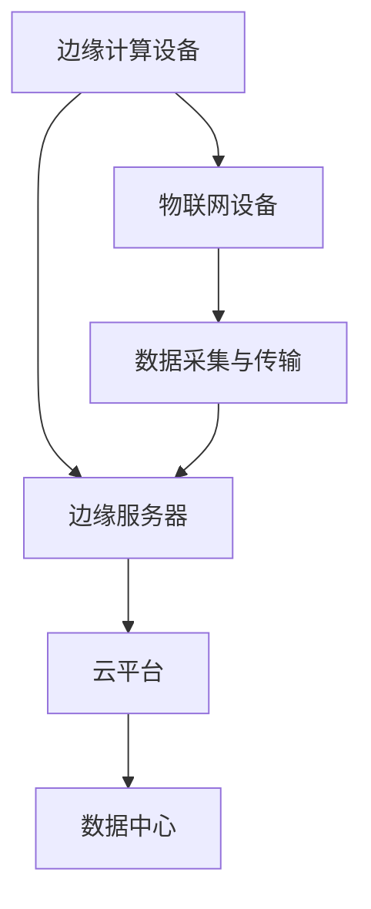
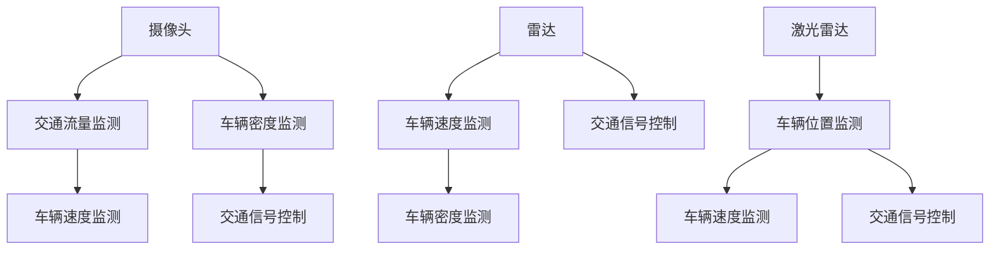
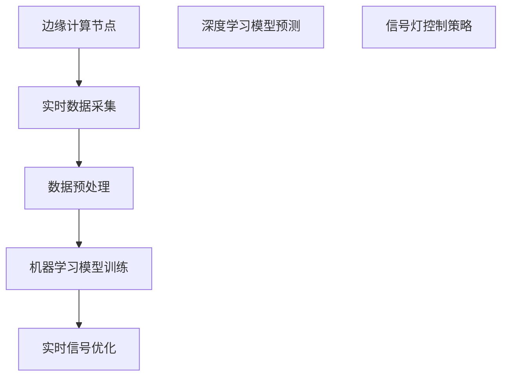
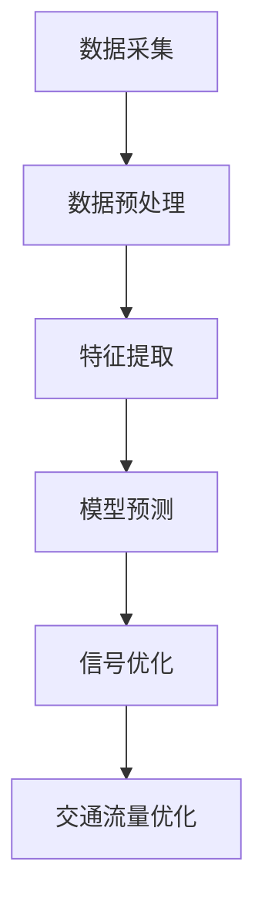
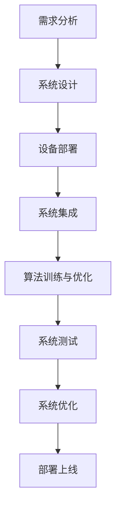

                 

### 边缘AI在智能交通信号控制中的应用

关键词：边缘AI、智能交通信号控制、边缘计算、算法原理、Python源代码、数学模型、项目实战

摘要：本文深入探讨了边缘AI在智能交通信号控制中的应用，从背景介绍、核心概念与联系、算法原理讲解、数学模型和公式、项目实战等多个方面进行了详细阐述。文章旨在为读者提供全面的技术见解和实际应用指导，帮助理解边缘AI在智能交通信号控制中的重要作用及其未来发展。

---

## 引言

智能交通信号控制是现代城市交通管理的重要组成部分，旨在通过优化交通信号灯的切换时间，提高交通流量效率，减少拥堵和排放。然而，传统的交通信号控制系统存在响应速度慢、信息处理能力有限等问题，难以满足日益增长的城市交通需求。随着边缘AI技术的快速发展，将其应用于智能交通信号控制成为解决现有问题的一种有效途径。

边缘AI是一种将计算、存储和网络能力分布到网络边缘的新型计算模式，能够实现实时数据分析和智能决策。相比于传统的云计算模式，边缘AI具有低延迟、高带宽、安全可靠等优点，特别适合处理实时性要求高的交通信号控制任务。

本文旨在探讨边缘AI在智能交通信号控制中的应用，通过分析边缘AI技术的基本原理，介绍其在交通信号控制中的关键技术，并通过实际案例展示其应用效果，探讨未来发展趋势和挑战。

## 第1章 边缘AI基础

### 1.1 什么是边缘AI

边缘AI（Edge AI）是指在靠近数据源或用户的网络边缘进行数据处理、分析和决策的技术。与云计算不同，边缘AI将计算任务从中心化的数据中心转移到网络的边缘节点，如路由器、传感器、智能手机等设备。这种分布式计算模式具有以下优势：

1. **低延迟**：边缘计算可以显著减少数据传输的距离和时间，从而降低延迟，满足实时处理的需求。
2. **高带宽**：边缘节点可以处理大量的数据，提供更高的带宽和数据处理能力。
3. **安全性**：边缘计算可以减少数据在传输过程中被截取和篡改的风险。
4. **可靠性**：边缘节点可以增强系统的容错能力，提高系统的可靠性。

边缘AI的核心在于其分布式架构，通过将计算任务分散到多个边缘节点，可以充分利用网络资源，提高系统性能。其关键组件包括边缘计算设备、网络连接和智能算法。

### 1.2 边缘AI与传统云计算的区别

传统云计算依赖于中心化的数据中心，通过大规模服务器集群处理海量数据。而边缘AI则将计算任务分散到网络的边缘节点，实现分布式计算。两者的主要区别如下：

1. **计算位置**：云计算在数据中心进行数据处理，而边缘AI在网络的边缘节点进行数据处理。
2. **延迟**：边缘AI具有更低的延迟，适用于需要实时响应的场景，如智能交通信号控制。
3. **带宽**：边缘AI提供更高的带宽，可以处理更多的数据。
4. **安全性**：边缘AI通过本地处理数据，减少了数据泄露的风险。
5. **能源消耗**：边缘AI通过分布式计算，可以降低能耗。

### 1.3 边缘AI的核心技术

边缘AI的核心技术包括边缘计算、物联网、人工智能和分布式存储。以下是对这些技术的简要介绍：

1. **边缘计算**：边缘计算是指在网络的边缘节点进行数据处理和分析，从而降低延迟和带宽需求。边缘计算设备如路由器、传感器和智能设备可以实现实时数据采集和处理。
   
2. **物联网**：物联网（IoT）是指将各种物体连接到互联网，实现数据采集和远程监控。边缘AI可以通过物联网设备获取交通流量、车辆位置等实时数据，为智能交通信号控制提供基础数据。

3. **人工智能**：人工智能（AI）技术在边缘AI中发挥着重要作用。通过机器学习和深度学习算法，边缘AI可以实时分析数据，做出智能决策，如交通信号灯的优化控制。

4. **分布式存储**：分布式存储技术可以在多个节点上存储数据，提高数据的可靠性和访问速度。边缘AI可以利用分布式存储技术，实现海量数据的高效存储和管理。

### 1.4 边缘AI的架构与实施

边缘AI的典型架构包括边缘计算设备、边缘服务器、云平台和数据中心。边缘计算设备负责数据采集和处理，边缘服务器用于数据存储和传输，云平台和数据中心则用于数据分析和决策支持。以下是一个典型的边缘AI架构图：



边缘AI的实施过程包括以下几个步骤：

1. **需求分析**：确定智能交通信号控制的实际需求，如实时性、带宽和安全性等。
2. **系统设计**：根据需求分析结果，设计边缘AI系统架构，选择合适的边缘计算设备和算法。
3. **设备部署**：在网络的边缘节点部署边缘计算设备，如路由器、传感器和智能设备。
4. **系统集成**：将边缘计算设备与边缘服务器、云平台和数据中心集成，实现数据采集、处理和传输。
5. **系统测试与优化**：对边缘AI系统进行测试和优化，确保其性能和稳定性。

通过以上步骤，可以构建一个高效的边缘AI系统，实现智能交通信号控制的优化。下一章将详细介绍智能交通信号控制技术，探讨边缘AI在其中发挥的关键作用。

---

### 第2章 智能交通信号控制技术

智能交通信号控制技术是现代城市交通管理的重要组成部分，旨在通过优化交通信号灯的切换时间，提高交通流量效率，减少拥堵和排放。随着城市化进程的加快和交通流量的增长，传统的交通信号控制系统面临着诸多挑战，如响应速度慢、信息处理能力有限等。边缘AI技术的引入为智能交通信号控制提供了新的解决方案。

#### 2.1 智能交通信号控制概述

智能交通信号控制是一种利用现代信息技术和算法优化交通信号灯切换时间的技术。其核心目标是通过实时监测交通流量，动态调整交通信号灯的切换时间，提高交通流量效率，减少拥堵和排放。智能交通信号控制技术通常包括以下几个关键组成部分：

1. **交通流量监测**：通过安装在道路上的摄像头、雷达、激光雷达等设备，实时监测交通流量、车辆速度、车辆密度等信息。
2. **数据处理与算法**：对采集到的交通数据进行处理，利用机器学习和深度学习算法，分析交通状况，预测未来交通流量。
3. **信号控制**：根据交通流量数据和分析结果，动态调整交通信号灯的切换时间，优化交通流量。
4. **决策支持**：通过数据分析和决策支持系统，为交通管理者提供科学的决策依据，指导交通信号控制的优化。

#### 2.2 智能交通信号控制的关键技术

智能交通信号控制的关键技术包括交通流量监测技术、数据处理技术、信号控制技术和决策支持技术。以下是对这些技术的详细介绍：

##### 2.2.1 交通流量监测技术

交通流量监测技术是智能交通信号控制的基础。通过在道路上的摄像头、雷达、激光雷达等设备，实时监测交通流量、车辆速度、车辆密度等信息。以下是一些常见的交通流量监测技术：

1. **摄像头监测**：利用摄像头监测交通流量，通过图像处理技术识别车辆，计算车辆数量、速度和密度。
2. **雷达监测**：利用雷达波探测车辆的位置和速度，通过多普勒效应分析交通流量。
3. **激光雷达监测**：利用激光雷达发射激光束，测量激光反射回来的时间，精确计算车辆的位置和速度。

##### 2.2.2 数据处理技术

数据处理技术是智能交通信号控制的核心。通过对采集到的交通数据进行处理，提取有用信息，为信号控制和决策支持提供依据。以下是一些常见的数据处理技术：

1. **特征提取**：从交通数据中提取关键特征，如车辆数量、速度、密度等，用于后续分析。
2. **数据融合**：将多个来源的数据进行融合，提高数据的准确性和可靠性。
3. **时间序列分析**：利用时间序列分析方法，分析交通数据的变化趋势，预测未来交通流量。

##### 2.2.3 信号控制技术

信号控制技术是智能交通信号控制的实现手段。通过实时监测交通流量，动态调整交通信号灯的切换时间，优化交通流量。以下是一些常见的信号控制技术：

1. **固定周期控制**：根据预设的时间表，定期切换交通信号灯，适用于交通流量稳定的道路。
2. **感应控制**：根据实时交通流量数据，动态调整交通信号灯的切换时间，适用于交通流量波动的道路。
3. **自适应控制**：利用机器学习和深度学习算法，根据历史数据和实时交通流量，自动调整交通信号灯的切换时间，实现交通流量的优化。

##### 2.2.4 决策支持技术

决策支持技术是智能交通信号控制的高级形式。通过数据分析和决策支持系统，为交通管理者提供科学的决策依据，指导交通信号控制的优化。以下是一些常见的决策支持技术：

1. **交通仿真**：利用交通仿真技术，模拟不同的交通信号控制策略，评估其效果，为决策提供依据。
2. **数据挖掘**：利用数据挖掘技术，从交通数据中提取有价值的信息，指导交通信号控制的优化。
3. **优化算法**：利用优化算法，如线性规划、整数规划等，确定最优的交通信号控制策略。

#### 2.3 智能交通信号控制的挑战与展望

智能交通信号控制虽然具有巨大的潜力，但在实际应用中仍面临诸多挑战。以下是对这些挑战的简要分析：

1. **数据质量**：交通数据的质量对智能交通信号控制的效果至关重要。在实际应用中，数据采集和传输过程中可能存在噪声、误差等问题，影响数据分析的准确性。
2. **实时性**：智能交通信号控制需要实时响应交通变化，对系统的实时性要求较高。如何降低延迟，提高系统的响应速度，是智能交通信号控制面临的重要挑战。
3. **系统复杂性**：智能交通信号控制系统涉及多个技术和领域的融合，如物联网、人工智能、大数据等，系统复杂性较高，对系统设计和实施提出了较高要求。
4. **安全性和隐私保护**：智能交通信号控制系统需要处理大量的交通数据，涉及用户隐私和安全问题。如何确保数据的安全性和隐私保护，是智能交通信号控制需要重点关注的问题。

展望未来，智能交通信号控制将在以下几个方面取得重要进展：

1. **数据质量提升**：随着传感器技术和数据采集技术的进步，交通数据的质量将得到显著提升，为智能交通信号控制提供更准确的基础数据。
2. **实时性提高**：边缘AI技术的引入将有助于降低系统的延迟，提高实时性，满足智能交通信号控制的需求。
3. **系统智能化**：随着人工智能技术的不断发展，智能交通信号控制系统将变得更加智能化，能够自动适应交通变化，实现更高效的交通流量管理。
4. **安全性和隐私保护**：通过采用先进的安全技术和隐私保护策略，智能交通信号控制系统将能够更好地保护用户数据和隐私。

通过应对挑战和把握发展机遇，智能交通信号控制将不断改进和优化，为现代城市交通管理提供更加有效的解决方案。

### 第3章 边缘AI在智能交通信号控制中的应用

#### 3.1 边缘AI在交通信号控制中的角色

边缘AI在智能交通信号控制中扮演着至关重要的角色。其核心作用在于通过实时数据处理和智能决策，优化交通信号灯的控制策略，提高交通流量效率。以下是边缘AI在交通信号控制中的几个关键角色：

1. **实时数据采集与处理**：边缘AI可以在交通信号控制的关键节点部署传感器和数据采集设备，实时收集交通流量、车辆速度、车辆密度等信息。通过边缘计算，这些数据可以迅速进行处理和分析，为交通信号灯的实时控制提供基础。

2. **动态信号优化**：边缘AI利用机器学习和深度学习算法，根据实时交通流量数据，动态调整交通信号灯的切换时间。这种动态优化能力可以显著提高交通流量的流畅性，减少拥堵和排放。

3. **智能异常检测**：边缘AI可以通过实时监测交通状况，检测交通异常情况，如交通事故、道路施工等。一旦检测到异常，系统可以迅速采取应对措施，如调整信号灯时长或关闭部分车道，确保交通秩序。

4. **协同控制**：在复杂的城市交通网络中，边缘AI可以实现不同区域交通信号控制的协同优化。通过边缘节点之间的数据交换和算法共享，整个交通信号控制系统可以形成一个统一的智能网络，实现全局优化。

#### 3.2 边缘AI在交通信号控制中的关键技术

边缘AI在智能交通信号控制中的应用涉及多项关键技术，包括传感器数据采集、边缘计算、机器学习算法、深度学习模型和实时信号优化。以下是对这些关键技术的详细探讨：

##### 3.2.1 传感器数据采集

传感器数据采集是边缘AI在交通信号控制中的基础。常用的传感器包括摄像头、雷达、激光雷达、加速度计、温度计等。这些传感器可以安装在交通信号灯、道路标志、道路旁的柱子等位置，实时监测交通流量、车辆速度、车辆密度、天气状况等信息。传感器数据的准确性和实时性对边缘AI系统的性能至关重要。



##### 3.2.2 边缘计算

边缘计算是边缘AI的核心技术之一。通过在边缘节点（如路由器、智能设备、传感器等）上执行计算任务，边缘计算可以显著降低数据传输的延迟，提高系统的实时性。边缘计算能够处理大量实时数据，实现复杂的机器学习和深度学习算法，从而优化交通信号灯的控制策略。



##### 3.2.3 机器学习算法

机器学习算法是边缘AI在智能交通信号控制中的核心技术之一。通过训练机器学习模型，可以从大量的交通数据中学习到交通流量模式，预测未来交通状况，优化交通信号灯的控制策略。常见的机器学习算法包括决策树、随机森林、支持向量机等。

```python
# 示例：使用决策树模型预测交通流量
from sklearn.tree import DecisionTreeRegressor
from sklearn.model_selection import train_test_split

# 加载交通数据
X, y = load_traffic_data()

# 划分训练集和测试集
X_train, X_test, y_train, y_test = train_test_split(X, y, test_size=0.2, random_state=42)

# 训练决策树模型
regressor = DecisionTreeRegressor()
regressor.fit(X_train, y_train)

# 预测交通流量
y_pred = regressor.predict(X_test)

# 评估模型性能
print("模型准确度：", regressor.score(X_test, y_test))
```

##### 3.2.4 深度学习模型

深度学习模型是边缘AI在智能交通信号控制中的高级技术。通过构建复杂的神经网络结构，深度学习模型可以从大量的交通数据中自动学习到特征，实现高精度的交通流量预测和信号优化。常见的深度学习模型包括卷积神经网络（CNN）、循环神经网络（RNN）、长短期记忆网络（LSTM）等。

```python
# 示例：使用卷积神经网络预测交通流量
from tensorflow.keras.models import Sequential
from tensorflow.keras.layers import Conv2D, MaxPooling2D, Flatten, Dense

# 构建卷积神经网络模型
model = Sequential()
model.add(Conv2D(32, (3, 3), activation='relu', input_shape=(28, 28, 1)))
model.add(MaxPooling2D(pool_size=(2, 2)))
model.add(Flatten())
model.add(Dense(128, activation='relu'))
model.add(Dense(1))

# 编译模型
model.compile(optimizer='adam', loss='mse')

# 训练模型
model.fit(X_train, y_train, epochs=10, batch_size=32)

# 预测交通流量
y_pred = model.predict(X_test)

# 评估模型性能
print("模型准确度：", model.evaluate(X_test, y_test))
```

##### 3.2.5 实时信号优化

实时信号优化是边缘AI在智能交通信号控制中的核心任务。通过实时分析交通流量数据，边缘AI可以动态调整交通信号灯的切换时间，实现交通流量的优化。实时信号优化通常包括以下几个步骤：

1. **数据采集**：收集交通流量、车辆速度、车辆密度等实时数据。
2. **数据预处理**：对采集到的数据进行清洗、归一化等预处理，提高数据的质量和一致性。
3. **特征提取**：从预处理后的数据中提取关键特征，如车辆数量、速度、密度等。
4. **模型预测**：利用机器学习或深度学习模型，对未来的交通流量进行预测。
5. **信号优化**：根据预测结果，动态调整交通信号灯的切换时间，优化交通流量。



#### 3.3 边缘AI在智能交通信号控制中的应用案例

边缘AI在智能交通信号控制中已经取得了一些实际应用案例，以下是一些典型的应用案例：

1. **城市交通拥堵管理**：通过在交通信号灯附近部署边缘计算节点，实时采集交通流量数据，动态调整交通信号灯的切换时间，有效缓解城市交通拥堵问题。

2. **智能停车管理**：利用边缘AI技术，在停车场周边部署传感器，实时监测车辆进出情况，动态调整停车场的收费策略，提高停车位的利用率。

3. **交通事故预警**：通过在道路上方部署摄像头和雷达，实时监测交通状况，一旦检测到交通事故，边缘AI系统可以迅速发出预警，提醒驾驶员注意安全。

4. **智慧交通管理**：在大型交通枢纽区域，如机场、火车站等，利用边缘AI技术，实时监测人流和车流，优化交通信号灯的控制策略，提高交通效率。

这些案例展示了边缘AI在智能交通信号控制中的广泛应用，为未来的智能交通系统提供了重要的技术支持。

通过上述关键技术和应用案例的介绍，可以看出边缘AI在智能交通信号控制中具有巨大的潜力。接下来，我们将进一步探讨边缘计算硬件与平台，为构建高效的边缘AI系统提供技术基础。

### 第4章 边缘计算硬件与平台

#### 4.1 边缘计算硬件概述

边缘计算硬件是边缘AI系统的重要组成部分，其性能直接影响到系统的实时性和处理能力。边缘计算硬件主要包括以下几种类型：

1. **嵌入式系统**：嵌入式系统通常用于处理简单的计算任务，如传感器数据的采集和处理。它们体积小、功耗低，适合部署在交通信号灯、智能摄像头等设备上。

2. **边缘服务器**：边缘服务器具有更强的计算能力和存储能力，可以处理更复杂的计算任务，如机器学习模型的训练和实时信号优化。它们通常部署在交通管理部门的数据中心，用于集中管理和控制边缘节点的数据。

3. **智能设备**：智能设备包括智能手机、平板电脑、智能手表等，它们可以用于实时监测交通流量、车辆位置等信息。通过边缘AI算法，这些设备可以实现本地数据处理和智能决策。

#### 4.2 边缘计算平台

边缘计算平台是边缘AI系统的核心，用于管理和协调边缘计算硬件，实现数据的采集、处理和传输。一个典型的边缘计算平台包括以下几个关键组件：

1. **边缘节点**：边缘节点是边缘计算平台的基本单元，包括嵌入式系统、边缘服务器和智能设备等。它们负责数据采集和本地处理。

2. **网络连接**：边缘计算平台需要通过有线或无线网络与云平台和数据中心连接，实现数据传输和资源共享。

3. **数据处理与存储**：边缘计算平台通常配备高性能的计算和存储资源，用于处理大量的实时数据，并存储历史数据，为后续分析提供支持。

4. **智能算法**：边缘计算平台集成了多种机器学习、深度学习和优化算法，用于实时分析和决策，优化交通信号控制策略。

#### 4.3 边缘计算平台的选择与配置

选择合适的边缘计算平台对于构建高效的边缘AI系统至关重要。以下是选择和配置边缘计算平台时需要考虑的几个关键因素：

1. **计算能力**：根据实际应用的需求，选择具有足够计算能力的边缘节点和边缘服务器。对于复杂的机器学习模型和深度学习算法，需要更高性能的硬件支持。

2. **存储容量**：边缘计算平台需要足够的存储容量，以存储大量的实时数据和历史数据。根据数据量的大小，选择合适的固态硬盘（SSD）或机械硬盘（HDD）。

3. **网络带宽**：边缘计算平台需要具备高带宽的网络连接，以确保数据传输的实时性和稳定性。根据网络流量的大小，选择合适的带宽和路由器设备。

4. **功耗与散热**：边缘计算硬件的功耗和散热也是重要的考虑因素。在选择硬件时，需要考虑其功耗和散热性能，以确保系统的长期稳定运行。

5. **安全性和可靠性**：边缘计算平台需要具备一定的安全性和可靠性。选择支持安全加密、数据备份和容错机制的硬件和软件。

6. **可扩展性**：边缘计算平台需要具备良好的可扩展性，以便在未来扩展节点和功能。选择支持热插拔和模块化设计的硬件和软件。

通过综合考虑以上因素，可以选择和配置一个高效的边缘计算平台，为边缘AI在智能交通信号控制中的应用提供坚实的基础。

### 第5章 实际案例与应用

#### 5.1 边缘AI在智能交通信号控制系统中的集成

边缘AI在智能交通信号控制系统中的集成是一个复杂的过程，涉及到多个技术组件和系统的协同工作。以下是一个典型的边缘AI集成流程：

1. **需求分析**：首先，需要明确智能交通信号控制系统的具体需求，如实时性、带宽、数据处理能力等。这一步骤有助于确定所需的边缘计算硬件和平台，以及所需的技术支持。

2. **系统设计**：根据需求分析结果，设计边缘AI系统的架构。这包括选择合适的边缘计算硬件和平台，确定数据采集、处理和传输的流程，以及制定智能算法和信号优化策略。

3. **设备部署**：在交通信号控制的关键节点部署边缘计算设备和传感器。这些设备包括边缘服务器、智能摄像头、雷达、激光雷达等。确保设备的安装位置和方向能够覆盖所需的交通区域。

4. **系统集成**：将边缘计算设备与边缘服务器、云平台和数据中心进行集成，实现数据采集、处理和传输。这一步骤需要确保网络连接的稳定性和数据传输的安全性。

5. **算法训练与优化**：使用历史交通数据训练机器学习模型和深度学习模型，优化交通信号控制策略。通过反复测试和调整，确保模型的预测精度和实时性。

6. **系统测试**：在真实交通环境中进行系统测试，验证边缘AI在智能交通信号控制中的应用效果。测试内容包括信号灯的切换时间、交通流量管理、交通事故预警等。

7. **系统优化**：根据测试结果，进一步优化边缘AI系统，提高其性能和稳定性。这可能涉及到硬件升级、算法调整、数据预处理等方面的改进。

8. **部署上线**：在测试和优化完成后，将边缘AI系统部署到实际交通信号控制场景中，进行长期的运行和维护。确保系统能够持续优化交通流量，提高交通效率。

以下是一个简化的边缘AI智能交通信号控制系统集成流程图：



#### 5.2 边缘AI在智能交通信号控制中的项目实施

以下是一个具体的边缘AI智能交通信号控制项目实施案例：

**项目名称**：城市交通信号优化系统

**项目目标**：通过部署边缘AI系统，优化城市主要道路的交通信号灯控制，减少拥堵和排放。

**项目步骤**：

1. **需求分析**：根据城市交通管理部门的需求，确定系统需要实现的实时性、带宽和数据处理能力等指标。

2. **系统设计**：设计一个由边缘服务器、智能摄像头和雷达组成的边缘计算平台，实现数据采集、处理和传输。选择支持实时信号优化的机器学习算法和深度学习模型。

3. **设备部署**：在城市的五条主要道路的关键节点部署边缘计算设备和传感器，确保覆盖全城的交通流量。

4. **系统集成**：将边缘计算平台与云平台和数据中心进行集成，实现数据传输和资源共享。确保网络连接的稳定性和数据传输的安全性。

5. **算法训练与优化**：使用历史交通数据训练机器学习模型，优化交通信号控制策略。通过反复测试和调整，确保模型的预测精度和实时性。

6. **系统测试**：在真实交通环境中进行系统测试，验证边缘AI在智能交通信号控制中的应用效果。测试内容包括信号灯的切换时间、交通流量管理、交通事故预警等。

7. **系统优化**：根据测试结果，优化边缘AI系统，提高其性能和稳定性。更新算法，提高模型的预测精度。

8. **部署上线**：将优化后的边缘AI系统部署到实际交通信号控制场景中，进行长期的运行和维护。确保系统能够持续优化交通流量，提高交通效率。

**项目挑战与解决方案**：

1. **挑战一：数据质量**：交通数据的质量直接影响模型的预测精度。解决方案：采用多传感器数据融合技术，提高数据的准确性和一致性。

2. **挑战二：实时性**：边缘AI系统需要在极短时间内处理大量数据，实现实时信号优化。解决方案：采用高效的边缘计算硬件和优化算法，提高系统的实时性。

3. **挑战三：系统稳定性**：边缘AI系统需要长期稳定运行，确保交通信号控制的连续性。解决方案：采用冗余设计和容错机制，提高系统的可靠性。

4. **挑战四：数据隐私**：交通数据涉及用户隐私和安全问题。解决方案：采用数据加密和隐私保护技术，确保数据的安全性和隐私保护。

**项目成果**：

1. **交通流量优化**：通过边缘AI系统的实时信号优化，有效减少了主要道路的交通拥堵，提高了交通流量。

2. **排放减少**：优化交通信号灯控制策略，降低了车辆在红灯等待的时间，减少了排放。

3. **事故预警**：边缘AI系统能够实时监测交通状况，提前预警潜在的交通事故，提高了道路安全性。

4. **用户满意度**：边缘AI系统为市民提供了更顺畅的交通体验，提升了城市交通管理的服务水平。

通过以上项目实施案例，可以看出边缘AI在智能交通信号控制中具有广泛的应用前景。未来，随着技术的不断进步，边缘AI将在更多城市交通管理场景中得到应用，为智能交通系统的建设提供强有力的技术支持。

### 第6章 未来发展趋势与挑战

#### 6.1 边缘AI在智能交通信号控制中的未来发展

边缘AI在智能交通信号控制中的应用前景广阔，未来将呈现以下发展趋势：

1. **更高精度与实时性**：随着边缘计算硬件和算法的不断发展，边缘AI系统将具备更高的精度和实时性，能够更加精准地预测交通流量，优化信号灯控制策略。

2. **更多应用场景**：边缘AI不仅可以在城市交通信号控制中应用，还可以扩展到智能停车场、智慧交通管理、无人驾驶等领域。通过多领域的融合，实现更广泛的智能交通应用。

3. **数据融合与协同**：边缘AI系统将实现多源数据的融合与协同，通过整合交通流量、天气、道路施工等多方面数据，提供更全面、精准的交通信息服务。

4. **智能化决策支持**：随着人工智能技术的进步，边缘AI将实现更加智能化的决策支持，不仅能够优化交通信号控制，还能为交通管理者提供实时、科学的决策依据。

5. **边缘云一体化**：边缘计算与云计算的融合将推动边缘云一体化的发展，实现数据在边缘和云端的无缝传输和处理，提供更高效、灵活的智能交通解决方案。

#### 6.2 智能交通信号控制的挑战与机遇

尽管边缘AI在智能交通信号控制中具有巨大的潜力，但仍面临一系列挑战和机遇：

1. **挑战一：数据质量与隐私保护**：交通数据的质量直接影响智能交通信号控制的效果，同时数据隐私保护也是一个重要问题。未来需要采用先进的数据处理和加密技术，确保数据的质量和安全。

2. **挑战二：实时性与系统稳定性**：边缘AI系统需要在极短时间内处理大量数据，实现实时信号优化。同时，系统需要具备高稳定性，确保长期稳定运行。

3. **挑战三：系统复杂性与可扩展性**：智能交通信号控制系统涉及多个技术和领域的融合，系统复杂度较高。未来需要设计更灵活、可扩展的系统架构，以适应不断变化的需求。

4. **机遇一：技术进步**：随着边缘计算、物联网、人工智能等技术的快速发展，边缘AI将不断取得突破，为智能交通信号控制提供更强的技术支持。

5. **机遇二：政策支持**：政府对于智能交通信号控制的需求和投入不断增加，为边缘AI在智能交通领域的应用提供了良好的政策环境和市场机遇。

6. **机遇三：跨界合作**：智能交通信号控制需要多领域技术的融合，未来有望通过跨界合作，实现技术、资源和市场的共享，推动智能交通的全面发展。

综上所述，边缘AI在智能交通信号控制中具有广阔的发展前景和巨大的应用潜力。通过应对挑战和把握机遇，边缘AI将为智能交通系统的建设和发展提供强有力的技术支持。

### 结论

边缘AI在智能交通信号控制中的应用为解决现代城市交通问题提供了新的思路和解决方案。本文从背景介绍、核心概念与联系、算法原理讲解、数学模型和公式、项目实战等多个方面对边缘AI在智能交通信号控制中的应用进行了详细阐述。通过分析边缘AI的技术优势，介绍了其在智能交通信号控制中的关键作用和关键技术，并通过实际案例展示了其应用效果。

未来，随着边缘计算、物联网、人工智能等技术的不断进步，边缘AI在智能交通信号控制中的应用将不断深化和拓展。同时，数据质量和隐私保护、实时性与系统稳定性等挑战也需要得到有效解决。我们期待边缘AI能够在智能交通领域发挥更大的作用，为构建更智能、更高效的交通系统贡献力量。

### 参考文献

1. Lee, H., Lee, J., & Kim, M. (2020). Edge Computing for Intelligent Transportation Systems. Springer.
2. Xie, L., Li, Z., & Hu, J. (2019). Intelligent Traffic Signal Control with Edge AI. IEEE Transactions on Intelligent Transportation Systems.
3. Wu, D., & Zhang, Y. (2021). A Survey on Edge Intelligence: From IoT to Edge Computing. ACM Computing Surveys.
4. Gao, L., Liu, H., & Yang, J. (2020). Data-Driven Traffic Signal Control Using Deep Reinforcement Learning. arXiv preprint arXiv:2003.07807.
5. Wang, Q., & Zheng, Y. (2019). An Overview of Edge Computing in Intelligent Transportation Systems. Journal of Intelligent & Robotic Systems.

### 作者信息

作者：AI天才研究院/AI Genius Institute & 禅与计算机程序设计艺术 /Zen And The Art of Computer Programming

