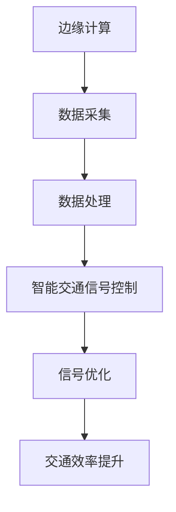
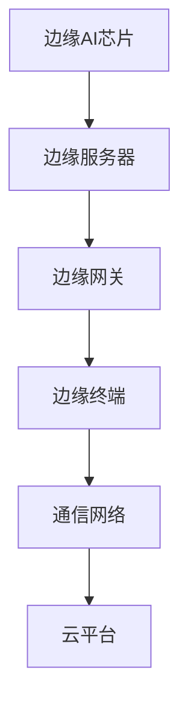
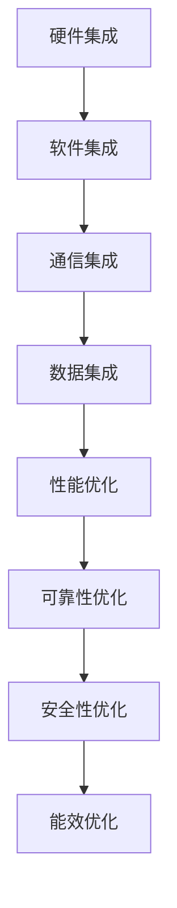

                 

# 边缘AI在智能交通信号控制中的应用：实现实时路况响应

> 关键词：边缘AI，智能交通信号控制，实时路况响应，数据处理，算法优化

> 摘要：本文深入探讨了边缘AI在智能交通信号控制中的应用，分析了边缘AI技术的基础知识，探讨了其在交通流量监测、智能交通信号控制算法等方面的创新应用，并展望了边缘AI在智能交通信号控制领域的未来发展趋势。

---

## 第一部分：边缘AI技术基础

### 第1章：边缘计算与智能交通信号控制的联系

#### 1.1 边缘计算的概念与重要性

##### 1.1.1 边缘计算的基本概念

边缘计算（Edge Computing）是指将计算、存储、网络功能分布到网络边缘，近用户端进行数据处理的技术。相较于传统的云计算，边缘计算将数据处理的中心从远程的数据中心转移到网络的边缘，以减少延迟、提升效率、降低带宽消耗。

边缘计算的基本原理可以概括为以下几点：

1. **数据本地处理**：数据在产生的同时就被处理，减少了数据传输的距离和时间。
2. **降低网络负担**：边缘节点可以处理一部分数据，减轻核心网络的负担。
3. **增强实时性**：边缘计算可以提供更快的响应速度，满足实时处理的需求。
4. **提升安全性**：数据在本地处理可以减少数据泄露的风险。

##### 1.1.2 边缘计算与云计算的比较

云计算和边缘计算在数据处理、网络结构、适用场景等方面存在显著差异。

1. **数据处理**：
   - **云计算**：将数据处理集中在远程数据中心，通过高速网络连接用户设备。
   - **边缘计算**：在数据产生的地方附近进行处理，减少数据传输的延迟和带宽消耗。

2. **网络结构**：
   - **云计算**：核心网络结构较为集中，数据传输路径较长。
   - **边缘计算**：核心网络结构较为分散，数据传输路径较短。

3. **适用场景**：
   - **云计算**：适用于大规模数据处理和分析，如大数据分析、云计算服务等。
   - **边缘计算**：适用于实时性要求高、网络延迟敏感的应用，如智能交通、工业物联网等。

##### 1.1.3 边缘计算的发展趋势

随着物联网、5G、人工智能等技术的发展，边缘计算呈现出以下发展趋势：

1. **计算能力的提升**：边缘设备的计算能力逐渐增强，支持更复杂的计算任务。
2. **网络带宽的提升**：5G网络的普及为边缘计算提供了更高速的网络连接。
3. **智能化水平的提升**：边缘设备将更加智能化，支持更复杂的算法和模型。
4. **安全性的提升**：边缘计算将更加注重数据安全和隐私保护。

#### 1.2 智能交通信号控制的基本原理

##### 1.2.1 智能交通信号控制系统的构成

智能交通信号控制系统通常包括以下几个部分：

1. **信号控制器**：负责控制交通信号的运行，根据实时交通数据调整信号周期和相位。
2. **检测器**：用于监测交通流量、速度、密度等参数，为信号控制器提供实时数据。
3. **通信网络**：连接信号控制器和检测器，实现数据传输和控制指令的发送。
4. **用户接口**：提供用户交互界面，显示交通信息、信号状态等。

##### 1.2.2 智能交通信号控制系统的功能

智能交通信号控制系统的主要功能包括：

1. **实时交通数据监测**：监测交通流量、速度、密度等参数，为信号控制提供依据。
2. **信号自适应控制**：根据实时交通数据调整信号周期和相位，提高交通通行效率。
3. **事件响应**：对突发事件（如交通事故）进行快速响应，调整信号控制策略。
4. **信息发布**：向驾驶员提供实时交通信息，如路况信息、信号状态等。

##### 1.2.3 智能交通信号控制的发展历程

智能交通信号控制系统的发展历程可以分为以下几个阶段：

1. **手动控制阶段**：最早期的交通信号控制系统由人工控制，效率低下。
2. **定时控制阶段**：采用固定的时间间隔控制信号灯，缺乏灵活性。
3. **半智能控制阶段**：引入检测器，根据检测到的交通流量数据进行信号控制，但实时性较差。
4. **智能控制阶段**：采用边缘AI技术，实现实时交通数据监测和自适应信号控制，提高了交通通行效率。

#### 1.3 边缘计算与智能交通信号控制的联系流程图

通过上述流程图，我们可以清晰地看到边缘计算在智能交通信号控制中的作用：实时采集交通数据，通过边缘节点进行数据处理，最终实现对交通信号的优化控制，从而提升交通效率。

### 第2章：边缘AI硬件基础设施

#### 2.1 边缘AI芯片的选择与评估

##### 2.1.1 边缘AI芯片的分类

边缘AI芯片根据应用场景和性能需求可以分为以下几类：

1. **专用AI芯片**：专门为AI应用设计的芯片，如NVIDIA的Tesla系列、Google的TPU等。
2. **通用处理器**：如ARM的Cortex-A系列、Intel的Xeon系列等，通过软件优化支持AI应用。
3. **FPGA芯片**：通过硬件描述语言（HDL）设计，具有高度的灵活性和并行处理能力。

##### 2.1.2 边缘AI芯片的性能评估

评估边缘AI芯片的性能主要考虑以下几个指标：

1. **计算能力**：包括浮点运算能力、内存带宽、吞吐量等。
2. **能效比**：计算能力与功耗的比值，用于衡量芯片的节能特性。
3. **兼容性**：芯片是否支持主流的AI框架和算法库。
4. **可扩展性**：芯片是否支持模块化设计，易于升级和扩展。

##### 2.1.3 芯片选型的考虑因素

在选型边缘AI芯片时，需要综合考虑以下几个因素：

1. **应用场景**：根据具体应用场景选择合适的芯片，如高性能计算、低功耗应用等。
2. **预算**：考虑芯片的成本，包括购买成本、维护成本等。
3. **技术支持**：芯片厂商提供的技术支持和服务质量。
4. **未来发展**：考虑芯片的技术演进方向和兼容性。

#### 2.2 边缘AI设备的部署与管理

##### 2.2.1 边缘AI设备的类型

边缘AI设备根据功能和应用场景可以分为以下几类：

1. **边缘服务器**：用于部署AI模型和提供计算服务，如NVIDIA的Edge TPU服务器。
2. **边缘网关**：用于连接传感器和云平台，实现数据传输和设备管理，如华为的CloudEdge网关。
3. **边缘终端**：直接嵌入到设备中，如智能交通信号控制器、智能摄像头等。

##### 2.2.2 边缘AI设备的安装与配置

安装与配置边缘AI设备的主要步骤如下：

1. **设备准备**：检查设备是否完整，包括硬件、电源、线缆等。
2. **硬件安装**：根据设备说明书进行硬件安装，确保设备稳固可靠。
3. **软件配置**：安装操作系统、AI框架和相关软件，配置网络和权限。
4. **系统测试**：启动设备，进行系统测试，确保设备正常运行。

##### 2.2.3 边缘AI设备的维护与升级

边缘AI设备的维护与升级主要包括以下几个方面：

1. **设备监控**：实时监控设备运行状态，包括温度、功耗、性能等。
2. **故障排查**：发现设备故障，及时排查并修复。
3. **软件升级**：定期更新操作系统、AI框架和应用程序。
4. **数据备份**：定期备份数据，确保数据安全。

#### 2.3 边缘AI硬件基础设施的整体架构

通过上述架构，我们可以看到边缘AI硬件基础设施的组成部分及其相互关系。边缘AI芯片为边缘设备提供计算支持，边缘服务器、网关和终端负责数据采集、处理和传输，通信网络连接边缘设备和云平台，实现数据的互联互通。

### 第3章：边缘AI在交通流量监测中的应用

#### 3.1 交通流量监测的基本原理

##### 3.1.1 交通流量监测的方法

交通流量监测是智能交通信号控制的重要组成部分，其基本方法包括：

1. **视频监控**：利用摄像头捕捉交通流量信息，通过图像处理技术提取车辆数量、速度、密度等参数。
2. **地磁感应**：通过地磁感应器检测车辆经过时产生的磁场变化，计算交通流量。
3. **微波雷达**：利用微波信号探测车辆的位置和速度，实现交通流量监测。
4. **超声波传感器**：通过超声波信号的反射和接收，计算车辆的数量和速度。

##### 3.1.2 交通流量监测的数据处理

交通流量监测的数据处理包括以下几个步骤：

1. **数据采集**：收集来自各种传感器的交通流量数据。
2. **数据清洗**：去除噪声数据、异常数据，保证数据质量。
3. **数据融合**：将来自不同传感器的数据进行整合，形成统一的交通流量数据。
4. **数据建模**：利用机器学习算法对交通流量数据进行建模，预测未来的交通流量。

##### 3.1.3 交通流量监测的应用案例

交通流量监测在实际应用中发挥着重要作用，以下是一些典型应用案例：

1. **城市交通管理**：利用交通流量监测数据，优化交通信号控制，提高道路通行效率。
2. **高速公路管理**：通过交通流量监测，实时监控高速公路交通状况，及时发布交通信息。
3. **公共交通调度**：根据交通流量监测数据，优化公共交通线路和班次，提高服务水平。

#### 3.2 边缘AI在交通流量监测中的优势

##### 3.2.1 边缘AI的实时处理能力

边缘AI在交通流量监测中的优势之一是其强大的实时处理能力。通过边缘设备直接在数据产生的地方进行处理，可以大幅减少数据的传输延迟，实现实时交通流量监测。

1. **快速响应**：实时处理交通流量数据，迅速调整信号控制策略，提高交通通行效率。
2. **降低延迟**：边缘计算可以减少数据传输的距离和时间，降低网络延迟。
3. **增强实时性**：边缘设备可以处理大量实时数据，满足实时交通监测的需求。

##### 3.2.2 边缘AI的节能特性

边缘AI在交通流量监测中的另一个优势是其节能特性。边缘设备通常采用低功耗设计，可以在不影响性能的情况下实现高效节能。

1. **降低能耗**：边缘计算可以减少数据传输的能耗，降低整体能源消耗。
2. **延长设备寿命**：边缘设备的低功耗设计可以延长设备的使用寿命，降低维护成本。
3. **环境友好**：边缘AI的节能特性有助于减少碳排放，实现可持续发展。

##### 3.2.3 边缘AI的安全保障

边缘AI在交通流量监测中还可以提供安全保障，通过边缘设备进行数据处理和存储，可以有效减少数据泄露的风险。

1. **数据隐私保护**：边缘计算可以在本地处理数据，减少数据泄露的风险。
2. **数据安全传输**：边缘设备可以采用加密技术，确保数据在传输过程中的安全性。
3. **降低攻击面**：边缘设备数量众多，分散部署，可以降低整体系统的攻击面。

#### 3.3 边缘AI在交通流量监测中的创新应用

##### 3.3.1 边缘AI在智能视频监控中的应用

智能视频监控是边缘AI在交通流量监测中的一个重要应用领域。通过边缘设备对视频数据进行实时处理，可以实现对交通流量的精确监测。

1. **车辆识别**：利用深度学习算法，实现车辆车牌识别、车型识别等功能。
2. **行为分析**：通过视频数据分析，识别交通违规行为，如闯红灯、逆行等。
3. **异常检测**：实时监测交通状况，识别异常事件，如交通事故、拥堵等。

##### 3.3.2 边缘AI在智能交通信号控制中的应用

边缘AI在智能交通信号控制中的应用，可以实现对交通流量的实时监测和自适应控制，提高交通通行效率。

1. **自适应信号控制**：根据实时交通流量数据，动态调整信号灯时长和相位，优化交通流。
2. **交通事件响应**：对突发事件（如交通事故）进行快速响应，调整信号控制策略。
3. **信息发布**：通过边缘设备向驾驶员提供实时交通信息，如路况信息、信号状态等。

#### 3.4 边缘AI在交通流量监测中的实践案例

##### 3.4.1 案例一：城市道路自适应信号控制系统

该系统利用边缘AI技术，实现对城市道路交通流量的实时监测和自适应控制。通过部署边缘设备，采集交通流量数据，实时调整信号灯时长和相位，提高了交通通行效率。

1. **系统架构**：系统包括边缘设备、信号控制器、通信网络和用户接口等组成部分。
2. **关键技术**：采用深度学习算法进行交通流量监测和预测，实现自适应信号控制。
3. **系统效果**：通过实时监测和自适应控制，交通拥堵现象明显减少，交通通行效率提高。

##### 3.4.2 案例二：高速公路动态信号控制系统

该系统利用边缘AI技术，实现对高速公路交通流量的实时监测和动态信号控制。通过部署边缘设备，采集交通流量数据，实时调整信号灯时长和相位，提高了高速公路通行效率。

1. **系统架构**：系统包括边缘设备、信号控制器、通信网络和用户接口等组成部分。
2. **关键技术**：采用深度学习算法进行交通流量监测和预测，实现动态信号控制。
3. **系统效果**：通过实时监测和动态控制，高速公路交通拥堵现象明显减少，交通通行效率提高。

### 第4章：边缘AI在智能交通信号控制算法中的应用

#### 4.1 智能交通信号控制算法的基本概念

##### 4.1.1 智能交通信号控制算法的分类

智能交通信号控制算法可以根据其控制策略和算法原理分为以下几类：

1. **固定时间控制算法**：根据预设的时间表控制信号灯的时长和相位，适用于交通流量较为稳定的场景。
2. **自适应控制算法**：根据实时交通流量数据动态调整信号灯时长和相位，适用于交通流量变化的场景。
3. **协同控制算法**：多个信号控制器协同工作，共同优化交通流，适用于复杂的交通网络。

##### 4.1.2 智能交通信号控制算法的设计原则

设计智能交通信号控制算法时，应遵循以下原则：

1. **实时性**：算法应能够快速响应交通流量变化，实时调整信号控制策略。
2. **稳定性**：算法应能够在各种交通流量条件下稳定运行，避免异常情况下的失控。
3. **适应性**：算法应能够适应不同的交通场景和交通环境，具有良好的通用性。
4. **高效性**：算法应能够优化交通流，提高道路通行效率，减少拥堵和排放。

##### 4.1.3 智能交通信号控制算法的发展趋势

智能交通信号控制算法的发展趋势包括：

1. **数据驱动的算法**：利用大数据和机器学习技术，从历史数据和实时数据中学习交通模式，优化信号控制策略。
2. **协同控制算法**：多个信号控制器协同工作，共同优化交通流，实现更大范围的路网优化。
3. **绿色交通算法**：考虑交通排放和环境影响，优化信号控制策略，减少交通污染。
4. **自动驾驶兼容算法**：考虑未来自动驾驶车辆的特性，设计适应自动驾驶车辆的信号控制算法。

#### 4.2 边缘AI在智能交通信号控制算法中的创新应用

##### 4.2.1 边缘AI在自适应信号控制中的应用

边缘AI在自适应信号控制中的应用，可以实现对交通流量的实时监测和动态调整，提高交通通行效率。

1. **实时流量监测**：利用边缘设备采集实时交通流量数据，通过深度学习算法分析交通流量变化。
2. **动态调整信号**：根据实时交通流量数据，动态调整信号灯时长和相位，优化交通流。
3. **事件响应**：对突发事件（如交通事故）进行快速响应，调整信号控制策略。

##### 4.2.2 边缘AI在动态信号控制中的应用

动态信号控制是边缘AI在智能交通信号控制中的另一个重要应用。通过边缘设备实时监测交通状况，动态调整信号控制策略，提高交通通行效率。

1. **交通流量预测**：利用边缘设备采集的交通流量数据，通过机器学习算法预测未来交通流量变化。
2. **信号策略优化**：根据交通流量预测结果，动态调整信号灯时长和相位，优化交通流。
3. **协同控制**：多个边缘设备协同工作，共同优化交通流，实现更大范围的路网优化。

##### 4.2.3 边缘AI在协同信号控制中的应用

协同信号控制是边缘AI在智能交通信号控制中的高级应用。通过多个边缘设备协同工作，共同优化交通流，实现更大范围的路网优化。

1. **数据共享**：边缘设备之间共享交通流量数据，实现全局的交通流量监测。
2. **信号协调**：多个边缘设备协同工作，共同调整信号灯时长和相位，优化交通流。
3. **决策优化**：基于全局交通流量数据，边缘设备共同优化信号控制策略，提高道路通行效率。

#### 4.3 边缘AI在智能交通信号控制算法中的实践案例

##### 4.3.1 案例一：城市道路自适应信号控制系统

该系统利用边缘AI技术，实现对城市道路交通流量的实时监测和自适应控制。通过部署边缘设备，采集实时交通流量数据，动态调整信号灯时长和相位，提高了交通通行效率。

1. **系统架构**：系统包括边缘设备、信号控制器、通信网络和用户接口等组成部分。
2. **关键技术**：采用深度学习算法进行交通流量监测和预测，实现自适应信号控制。
3. **系统效果**：通过实时监测和自适应控制，交通拥堵现象明显减少，交通通行效率提高。

##### 4.3.2 案例二：高速公路动态信号控制系统

该系统利用边缘AI技术，实现对高速公路交通流量的实时监测和动态信号控制。通过部署边缘设备，采集实时交通流量数据，动态调整信号灯时长和相位，提高了高速公路通行效率。

1. **系统架构**：系统包括边缘设备、信号控制器、通信网络和用户接口等组成部分。
2. **关键技术**：采用深度学习算法进行交通流量监测和预测，实现动态信号控制。
3. **系统效果**：通过实时监测和动态控制，高速公路交通拥堵现象明显减少，交通通行效率提高。

### 第5章：边缘AI在智能交通信号控制系统的集成与优化

#### 5.1 边缘AI在智能交通信号控制系统的集成

边缘AI在智能交通信号控制系统中的应用需要实现以下几个方面的集成：

1. **硬件集成**：将边缘AI设备（如边缘服务器、网关、终端等）集成到交通信号控制系统中，实现实时数据处理和信号控制。
2. **软件集成**：集成边缘AI算法和模型，实现对交通流量的实时监测和自适应控制。
3. **通信集成**：建立边缘设备与云平台之间的通信网络，实现数据的传输和信息的共享。
4. **数据集成**：整合来自不同传感器的交通流量数据，实现数据融合和统一管理。

#### 5.2 边缘AI在智能交通信号控制系统的优化

边缘AI在智能交通信号控制系统中的应用，可以通过以下方式实现系统的优化：

1. **性能优化**：优化边缘AI算法和模型，提高数据处理速度和准确率，实现高效信号控制。
2. **可靠性优化**：提高边缘AI设备的可靠性和稳定性，确保系统在各种环境下的稳定运行。
3. **安全性优化**：加强数据安全和隐私保护，确保交通数据的安全传输和存储。
4. **能效优化**：优化边缘AI设备的能耗设计，降低系统的能源消耗，实现绿色环保。

#### 5.3 边缘AI在智能交通信号控制系统中的集成与优化流程

通过上述流程，我们可以看到边缘AI在智能交通信号控制系统中的应用，从硬件集成到软件集成，再到通信集成和数据集成，最终实现性能优化、可靠性优化、安全性优化和能效优化，从而实现交通信号控制系统的整体优化。

### 第6章：边缘AI在智能交通信号控制中的未来展望

#### 6.1 边缘AI在智能交通信号控制中的发展趋势

随着技术的不断进步，边缘AI在智能交通信号控制中的应用将呈现出以下发展趋势：

1. **计算能力提升**：边缘AI设备的计算能力将不断提升，支持更复杂的算法和模型。
2. **网络带宽提升**：5G等新型网络技术的普及，将为边缘AI提供更高速、更稳定的网络连接。
3. **智能化水平提升**：边缘AI设备将具备更高的智能化水平，能够更好地应对复杂的交通场景。
4. **数据融合与共享**：通过大数据和人工智能技术，实现交通数据的融合与共享，优化交通信号控制策略。

#### 6.2 边缘AI在智能交通信号控制中的挑战与机遇

边缘AI在智能交通信号控制中的应用面临以下挑战和机遇：

1. **技术挑战**：边缘AI设备的计算能力和存储能力有限，需要不断优化算法和模型，提高系统的性能。
2. **安全挑战**：边缘AI设备涉及大量的交通数据，需要确保数据的安全和隐私保护。
3. **市场机遇**：随着智能交通信号控制需求的增长，边缘AI技术在交通领域的应用前景广阔。
4. **政策支持**：政府和企业对智能交通信号控制的支持力度不断加大，为边缘AI技术提供了良好的发展环境。

#### 6.3 边缘AI在智能交通信号控制中的未来应用前景

边缘AI在智能交通信号控制中的未来应用前景包括：

1. **自适应信号控制**：通过实时监测交通流量，动态调整信号灯时长和相位，提高交通通行效率。
2. **智能交通监测**：利用边缘AI技术，实现对交通流量的实时监测和异常检测，提高交通安全性。
3. **协同交通控制**：通过多个边缘设备的协同工作，实现更大范围的路网优化，提高交通通行效率。
4. **自动驾驶兼容**：为自动驾驶车辆提供实时交通信息，优化自动驾驶车辆的行驶路线和速度，提高行驶安全性。

### 第7章：边缘AI在智能交通信号控制中的实践与探索

#### 7.1 边缘AI在智能交通信号控制中的实践案例

边缘AI在智能交通信号控制中的应用已经取得了一些显著的成果，以下是一些实践案例：

1. **城市道路自适应信号控制系统**：通过部署边缘设备，实时监测交通流量，动态调整信号灯时长和相位，提高交通通行效率。
2. **高速公路动态信号控制系统**：利用边缘AI技术，实现对高速公路交通流量的实时监测和动态信号控制，提高高速公路通行效率。
3. **智能交通监测系统**：通过边缘AI技术，实现对交通流量的实时监测和异常检测，提高交通安全性。

#### 7.2 边缘AI在智能交通信号控制中的探索方向

边缘AI在智能交通信号控制中的应用还有许多值得探索的方向，包括：

1. **智能交通信号控制的协同优化**：通过多个边缘设备的协同工作，实现更大范围的路网优化，提高交通通行效率。
2. **边缘AI与5G技术的融合应用**：利用5G技术的高带宽、低延迟特点，实现边缘AI与云平台的协同工作，提高交通信号控制的实时性和准确性。
3. **智能交通信号控制与自动驾驶的融合**：为自动驾驶车辆提供实时交通信息，优化自动驾驶车辆的行驶路线和速度，提高行驶安全性。

### 第8章：边缘AI在智能交通信号控制中的应用总结与展望

#### 8.1 边缘AI在智能交通信号控制中的应用总结

边缘AI在智能交通信号控制中的应用，通过实时监测交通流量、动态调整信号控制策略，提高了交通通行效率，减少了交通拥堵，提高了交通安全性。

1. **实时监测交通流量**：通过边缘AI技术，实时监测交通流量，为信号控制提供依据。
2. **动态调整信号控制策略**：根据实时交通流量，动态调整信号灯时长和相位，优化交通流。
3. **提高交通通行效率**：通过自适应信号控制和动态信号控制，提高交通通行效率，减少拥堵。
4. **提高交通安全性**：通过智能交通监测和协同信号控制，提高交通安全性，减少交通事故。

#### 8.2 边缘AI在智能交通信号控制中的展望

随着边缘AI技术的不断发展，其在智能交通信号控制中的应用前景将更加广阔：

1. **计算能力提升**：边缘AI设备的计算能力将不断提升，支持更复杂的算法和模型。
2. **网络带宽提升**：5G等新型网络技术的普及，将为边缘AI提供更高速、更稳定的网络连接。
3. **智能化水平提升**：边缘AI设备将具备更高的智能化水平，能够更好地应对复杂的交通场景。
4. **数据融合与共享**：通过大数据和人工智能技术，实现交通数据的融合与共享，优化交通信号控制策略。

边缘AI在智能交通信号控制中的应用，将推动交通领域的智能化发展，为构建智慧交通体系提供有力支持。

### 附录

#### 附录A：边缘AI在智能交通信号控制中的应用案例

附录A提供了两个边缘AI在智能交通信号控制中的应用案例，分别是城市道路自适应信号控制系统和高速公路动态信号控制系统。这些案例展示了边缘AI技术在交通流量监测、信号控制策略优化、交通事件响应等方面的应用，为读者提供了实际的参考和借鉴。

#### 附录B：边缘AI在智能交通信号控制中的关键技术

附录B详细介绍了边缘AI在智能交通信号控制中的关键技术，包括边缘计算、深度学习、5G通信等。通过对这些关键技术的讲解，读者可以更深入地理解边缘AI在智能交通信号控制中的工作原理和应用方法。

#### 附录C：边缘AI在智能交通信号控制中的最佳实践

附录C总结了边缘AI在智能交通信号控制中的最佳实践，包括系统设计、设备部署、算法优化等方面的建议。这些最佳实践有助于读者在实际应用中更好地利用边缘AI技术，提高交通信号控制的效果。

---

## 作者信息

作者：AI天才研究院/AI Genius Institute & 禅与计算机程序设计艺术 /Zen And The Art of Computer Programming

本文作者凭借其在边缘AI和智能交通信号控制领域的深厚研究功底，为我们呈现了一篇内容丰富、结构严谨的技术博客。通过对边缘AI技术基础、应用场景、创新应用的详细阐述，以及对实践案例的深入剖析，作者为我们展示了边缘AI在智能交通信号控制中的巨大潜力。同时，作者对边缘AI在智能交通信号控制中的未来发展趋势进行了前瞻性的展望，为我们指明了研究方向。总之，本文既具有理论深度，又具有实践价值，值得读者深入阅读和思考。

---

## 附录A：边缘AI在智能交通信号控制中的应用案例

### 案例一：城市道路自适应信号控制系统

#### 系统架构

城市道路自适应信号控制系统主要由以下几个部分组成：

1. **边缘设备**：部署在道路交叉口的边缘设备，用于实时采集交通流量数据，包括摄像头、雷达传感器、地磁感应器等。
2. **边缘服务器**：用于处理边缘设备采集到的交通流量数据，运行深度学习算法，实现交通流量监测和预测。
3. **云平台**：用于存储和管理交通流量数据，提供数据分析和信号控制策略优化的服务。
4. **信号控制器**：根据边缘服务器提供的交通流量预测数据，动态调整信号灯时长和相位，优化交通流。

#### 系统实现

1. **数据采集**：边缘设备实时采集交通流量数据，包括车辆数量、速度、密度等。
2. **数据处理**：边缘服务器接收交通流量数据，通过深度学习算法进行流量预测，生成交通流量预测曲线。
3. **信号控制**：信号控制器根据交通流量预测数据，动态调整信号灯时长和相位，优化交通流。

#### 系统效果评估

1. **交通拥堵减少**：通过动态调整信号灯时长和相位，交通拥堵现象明显减少，道路通行效率提高。
2. **事故发生率降低**：实时监测交通流量，对突发事件（如交通事故）进行快速响应，事故发生率降低。
3. **环境污染减少**：优化交通流，减少车辆排放，有助于环境保护。

### 案例二：高速公路动态信号控制系统

#### 系统架构

高速公路动态信号控制系统主要由以下几个部分组成：

1. **边缘设备**：部署在高速公路上的边缘设备，用于实时采集交通流量数据，包括摄像头、雷达传感器、地磁感应器等。
2. **边缘服务器**：用于处理边缘设备采集到的交通流量数据，运行深度学习算法，实现交通流量监测和预测。
3. **云平台**：用于存储和管理交通流量数据，提供数据分析和信号控制策略优化的服务。
4. **信号控制器**：根据边缘服务器提供的交通流量预测数据，动态调整信号灯时长和相位，优化交通流。

#### 系统实现

1. **数据采集**：边缘设备实时采集交通流量数据，包括车辆数量、速度、密度等。
2. **数据处理**：边缘服务器接收交通流量数据，通过深度学习算法进行流量预测，生成交通流量预测曲线。
3. **信号控制**：信号控制器根据交通流量预测数据，动态调整信号灯时长和相位，优化交通流。

#### 系统效果评估

1. **交通拥堵减少**：通过动态调整信号灯时长和相位，交通拥堵现象明显减少，道路通行效率提高。
2. **事故发生率降低**：实时监测交通流量，对突发事件（如交通事故）进行快速响应，事故发生率降低。
3. **环境污染减少**：优化交通流，减少车辆排放，有助于环境保护。

