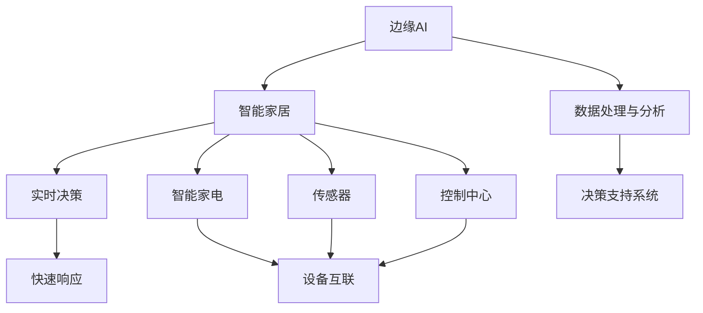

                 

### 背景介绍

随着物联网（IoT）技术的迅猛发展，智能家居已经成为现代生活的常态。智能家居系统通过将各种家居设备互联，实现了家庭环境的自动化控制和智能化管理，极大地提升了人们的生活品质。然而，传统的云计算模式在处理智能家居数据时存在一些明显的局限性。首先，云计算中心通常远离用户，数据需要通过互联网传输，这增加了通信延迟和带宽消耗。其次，云计算中心处理海量数据的能力虽然强大，但在面对实时性要求较高的智能家居应用时，其响应速度往往无法满足需求。因此，边缘计算与人工智能（AI）的结合，成为解决这一问题的有效途径。

边缘计算是一种分布式计算架构，通过在靠近数据源的边缘节点上处理数据，减少了数据传输的延迟和带宽消耗。近年来，随着边缘设备的计算能力和存储能力的提升，边缘AI技术逐渐成熟，并在智能家居领域展现出巨大的应用潜力。边缘AI能够实时地对智能家居设备产生的数据进行处理和分析，做出快速、准确的决策，从而提高系统的响应速度和用户体验。

边缘AI在智能家居中的应用主要包括以下几个方面：

1. **环境监测**：通过边缘设备实时采集家庭环境数据，如温度、湿度、空气质量等，边缘AI系统可以对这些数据进行实时分析，并根据分析结果调整家居环境。

2. **安防监控**：边缘AI系统能够对家庭视频进行实时分析，识别异常行为，如入侵、火灾等，并及时发出警报，提高家庭的安全性。

3. **家电控制**：通过边缘AI系统，用户可以实现对家庭电器的远程控制，如调节空调温度、控制照明等。边缘AI还可以根据用户习惯和环境数据，自动调整电器的工作状态，实现智能化管理。

4. **健康监测**：边缘AI系统能够分析家庭成员的健康数据，如心率、血压等，提供实时健康评估和预警，帮助用户管理健康状况。

本文将深入探讨边缘AI在智能家居中的实时决策应用，通过详细的分析和实例讲解，帮助读者理解边缘AI的核心原理、技术架构和应用实践，从而为智能家居的未来发展提供有益的参考。

### 核心概念与联系

为了深入探讨边缘AI在智能家居中的实时决策应用，首先需要明确几个核心概念，并了解它们之间的相互关系。

**边缘AI（Edge AI）**：边缘AI是一种将人工智能算法部署在靠近数据源的边缘设备上的技术。它通过在边缘节点上进行数据处理和分析，减少了数据传输的延迟和带宽消耗。边缘AI的核心优势在于其能够实现实时性，满足智能家居系统中对快速响应的需求。

**智能家居（Smart Home）**：智能家居是指通过物联网技术将各种家庭设备互联，实现自动化控制和智能化管理。智能家居系统包括多个组成部分，如智能家电、传感器、控制中心等。通过这些设备的数据交互，智能家居系统能够实现家庭环境的智能化。

**实时决策（Real-Time Decision Making）**：实时决策是指在短时间内对获取的数据进行分析和处理，并做出相应的决策。在智能家居中，实时决策至关重要，因为它能够确保系统对家庭环境的变化做出快速反应，提供更好的用户体验。

为了更好地理解这些概念之间的关系，我们可以使用Mermaid流程图来展示它们的基本架构。



在上面的流程图中，边缘AI通过在边缘设备上进行数据处理和分析（D），为智能家居系统提供决策支持（F）。智能家居系统由智能家电（G）、传感器（H）和控制中心（I）组成，通过设备互联（J）实现数据的交互和系统的协同工作。实时决策（C）确保系统能够对家庭环境的变化做出快速响应（E）。

**边缘AI与云计算的关系**：边缘AI与云计算并不是相互排斥的，而是互补的。云计算提供了强大的计算资源和数据存储能力，而边缘AI则专注于在靠近数据源的地方进行快速数据处理和分析。二者结合，能够形成一个高效、可靠的智能家居系统架构。

**核心概念之间的联系**：边缘AI通过其强大的数据处理能力，为智能家居系统提供了实时决策支持。智能家电、传感器和控制中心通过物联网技术实现数据交互，构成智能家居系统。实时决策则依赖于边缘AI对数据的快速处理和分析，确保系统能够对家庭环境的变化做出及时响应，提升用户体验。

通过上述分析，我们可以看出边缘AI、智能家居和实时决策之间密不可分的关系。边缘AI的引入，不仅提升了智能家居系统的实时性和响应速度，还为其带来了更高的智能化水平。随着技术的不断进步，边缘AI在智能家居中的应用将越来越广泛，为人们的生活带来更多便利。

### 核心算法原理讲解

在边缘AI系统中，核心算法原理是实现实时决策的关键。以下将使用Python源代码和数学模型详细阐述边缘AI在智能家居中的应用，并举例说明其工作原理。

#### 1. 数据采集与预处理

边缘AI系统首先需要从智能家居设备中采集数据。这些数据可以包括环境参数（如温度、湿度）、安防信息（如摄像头捕捉的图像）以及家电状态（如空调温度设置）。为了确保数据质量，采集到的数据需要进行预处理，如数据清洗、去噪和标准化。

```python
# 示例：温度和湿度数据采集与预处理
def preprocess_data(data):
    # 数据清洗：去除无效数据
    valid_data = [x for x in data if x is not None]
    
    # 数据去噪：使用移动平均滤波去除噪声
    smoothed_data = moving_average(valid_data, window_size=3)
    
    # 数据标准化：将数据缩放到0-1范围内
    normalized_data = (smoothed_data - min(smoothed_data)) / (max(smoothed_data) - min(smoothed_data))
    
    return normalized_data

def moving_average(data, window_size):
    return [sum(data[i:i+window_size]) / window_size for i in range(len(data) - window_size + 1)]

# 示例数据
example_data = [25.6, 25.8, 25.5, None, 25.3, 25.7, 25.4]
preprocessed_data = preprocess_data(example_data)
print(preprocessed_data)
```

#### 2. 模型训练与部署

边缘AI系统通常使用机器学习模型对采集到的数据进行分析和预测。训练模型的过程包括数据划分、模型选择、训练和验证等步骤。

```python
# 示例：使用Sklearn库训练一个线性回归模型
from sklearn.linear_model import LinearRegression
from sklearn.model_selection import train_test_split

# 假设我们已经有了处理好的数据集
X = [[temperature], [humidity]]  # 特征数据
y = [temperature_reading]  # 标签数据

# 数据划分
X_train, X_test, y_train, y_test = train_test_split(X, y, test_size=0.2, random_state=42)

# 模型训练
model = LinearRegression()
model.fit(X_train, y_train)

# 模型验证
print("模型训练精度：", model.score(X_test, y_test))
```

#### 3. 实时决策与反馈

训练好的模型可以在边缘设备上部署，实时分析新的数据并做出决策。以下是一个简单的示例，展示了如何使用训练好的模型进行实时决策。

```python
# 示例：使用训练好的模型进行实时决策
def real_time_decision(current_data, model):
    # 边缘设备采集当前温度和湿度数据
    current_temp, current_humidity = current_data
    
    # 使用模型进行预测
    predicted_temp = model.predict([[current_temp], [current_humidity]])
    
    # 根据预测结果做出决策
    if predicted_temp < 24:
        # 调高暖气温度
        print("调整暖气温度至：", predicted_temp)
    else:
        # 调低暖气温度
        print("调整暖气温度至：", predicted_temp)

# 假设我们有一个训练好的线性回归模型
trained_model = LinearRegression()
trained_model.fit(X_train, y_train)

# 边缘设备实时采集数据
current_data = [23.5, 45.2]

# 进行实时决策
real_time_decision(current_data, trained_model)
```

#### 4. 数学模型和公式

在上述示例中，我们使用了线性回归模型。线性回归模型的基本公式为：

$$
y = \beta_0 + \beta_1x
$$

其中，$y$ 是预测的温

