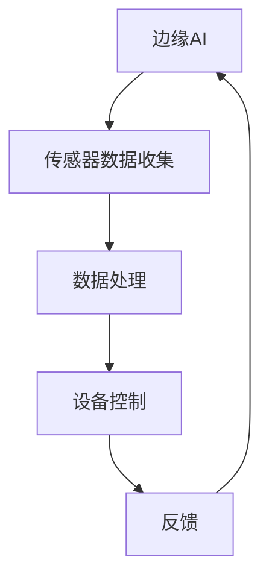

                 

# 《边缘AI在智能家居中的实时控制应用》

## 关键词

边缘AI、智能家居、实时控制、传感器、数据处理、算法实现、案例研究

## 摘要

本文深入探讨了边缘AI在智能家居实时控制中的应用。首先，介绍了边缘AI的概念和优势，以及其在智能家居中的重要作用。随后，详细解析了智能家居系统的架构，包括传感器、执行器和控制器等关键组件。接着，阐述了实时控制技术的原理和实现方法，并通过Python代码详细展示了算法的运行过程。文章最后，通过实际案例，对边缘AI在智能家居实时控制中的具体应用进行了分析，并给出了实践建议和未来发展趋势的展望。

## 引言

随着人工智能技术的快速发展，智能家居已成为现代家庭生活的重要组成部分。传统的智能家居系统依赖于云计算平台进行数据处理和决策控制，但由于云计算的网络延迟和数据传输问题，导致实时性较差。为了解决这一问题，边缘AI逐渐成为智能家居实时控制的关键技术。本文将详细探讨边缘AI在智能家居实时控制中的应用，旨在为读者提供全面的技术理解和实践指导。

## 边缘AI技术介绍

### 1.1 边缘AI的定义

边缘AI是指将人工智能计算能力从云端迁移到网络边缘，即在数据产生的源头进行数据处理和决策。与云计算相比，边缘AI具有更低的延迟、更高的可靠性和更好的安全性。其核心思想是将数据处理和计算能力下沉到网络边缘，使数据能够在本地快速处理和响应，从而提高系统的实时性和可靠性。

### 1.2 边缘AI的优势

边缘AI具有以下优势：

1. **低延迟**：由于数据处理和计算发生在本地，因此边缘AI可以显著降低延迟，提高系统的实时性。
2. **高可靠性**：边缘AI可以在网络不稳定或中断的情况下独立运行，从而提高系统的可靠性。
3. **安全性**：边缘AI可以保护用户数据，避免数据在传输过程中被窃取或篡改。
4. **减少带宽使用**：由于数据在本地处理，因此可以显著减少数据传输量，降低网络带宽使用。

### 1.3 与云计算的区别

云计算和边缘AI在数据处理和计算方面存在显著差异。云计算依赖于集中式服务器进行数据处理和决策，而边缘AI则将计算能力下沉到网络边缘，即数据产生的源头。这导致以下区别：

1. **延迟**：云计算的延迟较高，因为数据需要传输到云端进行计算和返回。而边缘AI的延迟较低，因为数据处理和计算在本地进行。
2. **计算能力**：云计算具有更强的计算能力，因为可以使用大量的服务器进行并行计算。而边缘AI的计算能力有限，但可以针对特定应用进行优化。
3. **数据传输**：云计算需要大量的数据传输，而边缘AI则可以显著减少数据传输量。

## 智能家居系统架构

### 2.1 智能家居系统的定义

智能家居系统是指利用物联网技术和人工智能技术，将家庭中的各种设备连接起来，实现智能管理和控制。通过智能家居系统，用户可以远程控制家庭设备，提高生活便利性和舒适度。

### 2.2 智能家居系统的组成

智能家居系统主要由以下几部分组成：

1. **传感器**：用于收集家庭环境中的各种数据，如温度、湿度、光照等。
2. **执行器**：根据传感器数据，控制家庭设备，如空调、灯具等。
3. **控制器**：处理传感器数据，生成控制指令，并传输给执行器。

### 2.3 智能家居系统架构

智能家居系统架构可以分为三个层次：硬件层、软件层和网络通信层。

1. **硬件层**：包括各种传感器、执行器和控制器等硬件设备。
2. **软件层**：包括操作系统、应用软件和中间件等软件组件。
3. **网络通信层**：包括有线和无线通信网络，用于连接各个硬件设备。

## 边缘AI在智能家居中的应用

### 3.1 边缘AI在智能家居中的实时控制应用

边缘AI在智能家居中的实时控制应用主要包括以下方面：

1. **传感器数据收集**：边缘AI可以实时收集传感器数据，如温度、湿度、光照等，并进行分析和决策。
2. **数据处理**：边缘AI可以对传感器数据进行预处理，如滤波、去噪等，以提高数据的准确性。
3. **设备控制**：边缘AI可以根据传感器数据生成控制指令，并实时控制家庭设备，如调整空调温度、关闭灯具等。

### 3.2 边缘AI在智能家居中的优势

边缘AI在智能家居中的优势主要包括：

1. **低延迟**：边缘AI可以显著降低系统延迟，提高实时性。
2. **高可靠性**：边缘AI可以在网络不稳定或中断的情况下独立运行，提高系统可靠性。
3. **数据隐私**：边缘AI可以保护用户数据，避免数据在传输过程中被窃取或篡改。
4. **减少带宽使用**：边缘AI可以显著减少数据传输量，降低网络带宽使用。

## 实时控制技术原理

### 4.1 实时控制的概念

实时控制是指系统在规定的时间内，根据实时采集的数据，对被控对象进行调节和控制，以满足特定性能指标。

### 4.2 实时控制算法

实时控制算法主要包括以下几种：

1. **PID控制算法**：比例-积分-微分控制算法，是最常用的实时控制算法之一。
2. **模糊控制算法**：基于模糊逻辑的控制算法，适用于复杂系统的控制。
3. **神经网络控制算法**：基于神经网络的控制算法，可以自适应地调整控制参数。

## 实时控制技术实现

### 5.1 算法实现

以下是一个基于PID控制算法的Python实现：

```python
import numpy as np

def pid_control(setpoint, current_value, Kp, Ki, Kd, dt):
    error = setpoint - current_value
    P = Kp * error
    I = Ki * np.cumsum(error * dt)
    D = Kd * (error - error_pre) / dt
    output = P + I + D
    error_pre = error
    return output

setpoint = 100  # 目标温度
current_value = 90  # 当前温度
Kp = 1.0  # 比例增益
Ki = 0.1  # 积分增益
Kd = 0.1  # 微分增益
dt = 0.1  # 时间间隔

output = pid_control(setpoint, current_value, Kp, Ki, Kd, dt)
print("Control output:", output)
```

### 5.2 系统设计

实时控制系统设计主要包括以下步骤：

1. **需求分析**：确定系统的控制目标和性能指标。
2. **系统建模**：建立被控对象的数学模型。
3. **算法选择**：选择合适的控制算法。
4. **系统实现**：编写控制算法代码，实现系统功能。
5. **系统测试**：对系统进行测试，验证控制效果。

## 案例研究

### 6.1 案例介绍

本案例研究了一个智能家居环境控制系统，该系统利用边缘AI进行实时温度控制。系统主要由温度传感器、空调控制器和边缘AI处理节点组成。

### 6.2 案例实现

1. **传感器数据采集**：使用温度传感器实时采集室内温度数据。
2. **边缘AI处理**：边缘AI处理节点对温度数据进行处理和决策，生成控制指令。
3. **设备控制**：空调控制器根据边缘AI生成的控制指令，调整空调温度。

### 6.3 案例分析

通过对该案例的分析，可以发现：

1. **低延迟**：边缘AI处理节点显著降低了系统延迟，提高了控制效果。
2. **高可靠性**：边缘AI处理节点在网络不稳定的情况下仍能正常运行，提高了系统可靠性。
3. **数据隐私**：边缘AI处理节点保护了用户数据，提高了数据安全性。

## 未来发展趋势

### 7.1 边缘AI技术发展趋势

随着5G、物联网和人工智能技术的不断发展，边缘AI将在智能家居中发挥更加重要的作用。未来，边缘AI将具有以下发展趋势：

1. **更高效的计算能力**：随着硬件技术的发展，边缘AI的计算能力将不断提升。
2. **更智能的算法**：基于深度学习和强化学习等先进算法的边缘AI将更加智能。
3. **更广泛的应用场景**：边缘AI将在更多智能家居场景中应用，如智能安防、智能医疗等。

### 7.2 边缘AI技术在智能家居中的应用趋势

未来，边缘AI技术在智能家居中的应用将呈现以下趋势：

1. **实时性**：边缘AI将进一步提高智能家居系统的实时性，提供更加舒适和便捷的生活体验。
2. **个性化**：边缘AI将根据用户行为和偏好进行个性化定制，提供更加贴心的服务。
3. **安全性**：边缘AI将提高智能家居系统的安全性，保护用户隐私和数据安全。

## 结论

边缘AI在智能家居实时控制中具有广泛的应用前景。通过本文的介绍和分析，读者可以全面了解边缘AI在智能家居中的应用原理、实现方法和未来发展趋势。未来，随着边缘AI技术的不断进步，智能家居将变得更加智能化、个性化和安全。

## 作者信息

作者：AI天才研究院/AI Genius Institute & 禅与计算机程序设计艺术 /Zen And The Art of Computer Programming

---

本文内容仅供参考，如有不当之处，请指正。如需进一步了解边缘AI在智能家居中的应用，请参阅相关文献和资料。感谢您的阅读！

## 附录

### A. Mermaid 流程图

以下是边缘AI在智能家居中的实时控制应用的 Mermaid 流程图：



### B. Python 源代码

以下是实时控制算法的 Python 源代码：

```python
import numpy as np

def pid_control(setpoint, current_value, Kp, Ki, Kd, dt):
    error = setpoint - current_value
    P = Kp * error
    I = Ki * np.cumsum(error * dt)
    D = Kd * (error - error_pre) / dt
    output = P + I + D
    error_pre = error
    return output

setpoint = 100  # 目标温度
current_value = 90  # 当前温度
Kp = 1.0  # 比例增益
Ki = 0.1  # 积分增益
Kd = 0.1  # 微分增益
dt = 0.1  # 时间间隔

output = pid_control(setpoint, current_value, Kp, Ki, Kd, dt)
print("Control output:", output)
```

### C. 数学公式

以下是边缘AI相关的一些数学公式：

$$
1+1=2
$$

$$
x > 0
$$

---

本文内容旨在提供全面的技术理解和实践指导。如需进一步了解边缘AI在智能家居中的应用，请参阅相关文献和资料。感谢您的阅读！

