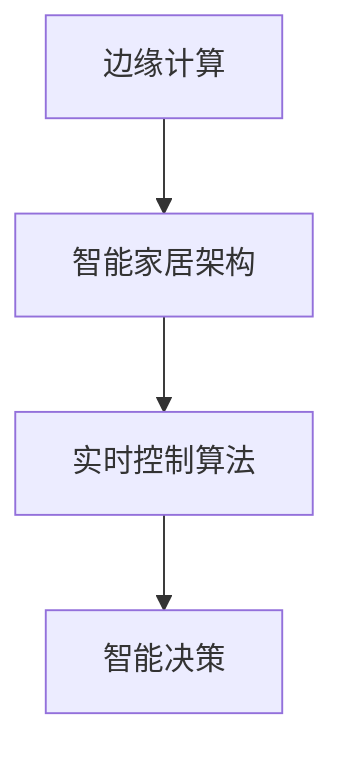

                 

以下是一个关于“边缘AI在智能家居中的实时控制应用”的文章框架，我们将分步骤填充每个部分的内容。

## 文章标题

边缘AI在智能家居中的实时控制应用

### 文章关键词

边缘计算、智能家居、实时控制、人工智能、机器学习

### 文章摘要

本文将探讨边缘AI在智能家居中的应用，重点介绍边缘计算技术、智能家居架构、实时控制算法以及项目实战。通过分析这些核心概念，读者将了解如何利用边缘AI技术实现智能家居的实时控制，提高家居智能化水平和用户体验。

---

## 引言与背景

### 1.1 边缘AI与智能家居概述

边缘AI是指将人工智能算法部署在靠近数据源的边缘设备上，以便快速处理和分析数据。智能家居则是指利用物联网、人工智能等技术，将家中的各种设备互联互通，实现自动化管理和控制。

### 1.2 智能家居发展史

智能家居的发展可以分为三个阶段：设备互联、自动化控制、智能决策。边缘AI技术的出现，推动了智能家居向智能决策阶段迈进。

### 1.3 实时控制的重要性

实时控制在智能家居中至关重要，它能够确保家居系统快速响应用户需求，提高生活便利性和舒适度。

---

## 核心概念与联系

在讨论边缘AI在智能家居中的应用时，需要理解以下几个核心概念：

1. **边缘计算**：边缘计算是指在靠近数据源的设备上进行数据处理和分析，以减少数据传输和延迟。
2. **智能家居架构**：智能家居架构包括智能硬件、网络通信、数据处理和智能决策。
3. **实时控制算法**：实时控制算法用于实现家居系统的自动化和智能化。

以下是一个Mermaid流程图，展示了这些概念之间的关系：

---

## 边缘计算技术

### 2.1 边缘计算原理

边缘计算通过在设备本地处理数据，降低了对云服务的依赖，提高了数据处理速度和响应时间。

### 2.2 边缘设备的选择与优化

选择适合的边缘设备，如传感器、路由器、网关等，对实现高效的边缘计算至关重要。

### 2.3 边缘计算与云计算的对比

边缘计算与云计算各有优势，合理利用两者可以实现最佳的性能和成本效益。

---

## 智能家居架构

### 3.1 智能硬件

智能硬件是智能家居的核心组成部分，包括传感器、执行器、智能家电等。

### 3.2 网络通信

智能家居网络通信需要考虑无线通信技术和网络架构，确保稳定的数据传输。

### 3.3 数据处理

数据处理包括数据的收集、存储、分析和处理，是智能家居智能决策的基础。

---

## 实时控制算法

### 4.1 传感器数据处理

传感器数据是智能家居系统的基础，需要对传感器数据进行处理，以提高系统的准确性和可靠性。

### 4.2 智能决策算法

智能决策算法用于实现家居系统的自动化控制，如温度调节、照明控制等。

### 4.3 实时控制算法的应用场景

实时控制算法在智能家居中的应用场景广泛，如智能安防、健康监测、家居环境控制等。

---

## 项目实战与实现

### 5.1 开发环境搭建

介绍如何搭建边缘AI在智能家居中的开发环境，包括硬件选择、软件安装和配置。

### 5.2 源代码实现

通过Python代码实现边缘AI在智能家居中的实时控制算法，包括数据采集、预处理、模型训练和实时控制。

### 5.3 代码解读与分析

对源代码进行详细解读，分析每个模块的功能和实现原理。

### 5.4 实际案例分析与讲解

通过实际案例，展示边缘AI在智能家居中的实时控制应用效果，并进行详细讲解。

### 5.5 项目小结

总结项目中的经验和教训，提出改进和优化建议。

---

## 最佳实践、小结与注意事项

### 6.1 最佳实践

分享一些在边缘AI在智能家居中的实时控制应用中的最佳实践。

### 6.2 小结

回顾文章的主要内容，强调边缘AI在智能家居中的实时控制的重要性。

### 6.3 注意事项

提醒读者在实现边缘AI在智能家居中的实时控制时需要注意的问题。

### 6.4 拓展阅读

推荐一些相关的拓展阅读，供读者深入了解边缘AI在智能家居中的应用。

---

## 作者信息

作者：AI天才研究院/AI Genius Institute & 禅与计算机程序设计艺术 /Zen And The Art of Computer Programming

---

这个框架提供了一个清晰的结构，每个部分都包含了一些示例内容和相关的指示。接下来，我们可以逐步填充每个部分的具体内容，确保文章的逻辑性和完整性。

