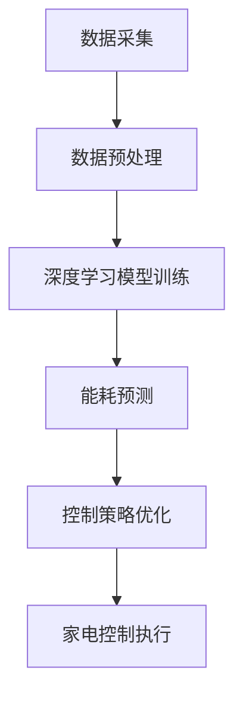

                 

### 边缘AI在智能家电节能控制中的应用

随着物联网技术的不断发展和智能家居市场的迅速扩展，智能家电已经逐渐渗透到我们日常生活的各个方面。然而，智能家电的高能耗问题也日益突出，尤其是在能源消耗大的家庭场景中，如空调、冰箱、洗衣机等家电。因此，如何在提升用户体验的同时，实现节能控制成为了一个重要的研究方向。

#### **背景介绍**

智能家电的节能控制不仅能够降低家庭能源消耗，还能减轻环境压力，实现可持续发展。传统的家电节能控制方法通常依赖于预定的模式和规则，这些方法在简单场景下能够取得一定的效果，但在复杂多变的实际应用中，其效果有限。边缘AI技术的引入，为智能家电节能控制带来了新的机遇。

边缘AI是一种将人工智能技术部署在靠近数据源（如智能家电本身）的设备上的技术。它能够实时处理和分析数据，做出快速响应，而不需要将数据传输到云端进行处理。这种技术具有低延迟、高实时性和高安全性等优点，非常适合应用于智能家电的节能控制。

#### **核心概念与联系**

**边缘计算**：边缘计算是一种分布式计算架构，它将计算任务分散到网络边缘的设备上，从而减少对中心服务器的依赖。在智能家电节能控制中，边缘计算可以实时处理来自家电的数据，并进行控制决策。

**深度学习**：深度学习是一种基于多层神经网络的人工智能技术，它可以自动从数据中学习特征，并用于复杂的模式识别任务。在边缘AI中，深度学习可以用于预测家电的能耗模式，并优化控制策略。

**卷积神经网络（CNN）**：CNN是一种专门用于图像和视频处理的深度学习模型，它可以自动提取图像中的特征，并用于分类和识别任务。在边缘AI中，CNN可以用于实时监测家电的工作状态，并识别异常情况。

**递归神经网络（RNN）**：RNN是一种专门用于处理序列数据的神经网络，它可以用于预测未来的能耗情况。在边缘AI中，RNN可以结合历史能耗数据和实时数据，预测未来的能耗趋势，并做出相应的控制决策。

**强化学习**：强化学习是一种通过试错和反馈来学习最优策略的机器学习技术。在边缘AI中，强化学习可以用于优化家电的控制策略，以实现最佳节能效果。


图1：边缘AI在智能家电节能控制中的概念架构

**Mermaid流程图**：



图2：边缘AI在智能家电节能控制中的流程图

通过上述核心概念和流程图的描述，我们可以看到边缘AI在智能家电节能控制中是如何发挥作用的。

#### **核心算法原理讲解**

**能耗预测模型**：能耗预测是智能家电节能控制的关键步骤。我们采用了一种基于深度学习的能耗预测模型。该模型的核心是一个卷积神经网络（CNN），它可以自动提取家电能耗数据中的时间序列特征。

**控制策略优化**：为了实现最佳的节能效果，我们使用了一种基于强化学习的控制策略优化算法。该算法通过试错和反馈来学习最优的控制策略，从而实现能耗的最小化。

**数学模型和公式**：

能耗预测模型：

$$
E(t) = f(CNN(X(t)))
$$

其中，$E(t)$ 表示在时间 $t$ 的预测能耗，$X(t)$ 表示时间 $t$ 的家电能耗数据，$CNN(X(t))$ 表示卷积神经网络对 $X(t)$ 的处理结果。

控制策略优化模型：

$$
\theta_{opt} = argmin_{\theta} J(\theta)
$$

其中，$\theta_{opt}$ 表示最优控制策略，$J(\theta)$ 表示基于强化学习的损失函数。

**Python源代码示例**：

```python
import tensorflow as tf
from tensorflow.keras.models import Sequential
from tensorflow.keras.layers import Conv1D, Dense

# 构建卷积神经网络模型
model = Sequential([
    Conv1D(filters=64, kernel_size=3, activation='relu', input_shape=(window_size, 1)),
    Conv1D(filters=128, kernel_size=3, activation='relu'),
    Dense(1)
])

# 编译模型
model.compile(optimizer='adam', loss='mse')

# 训练模型
model.fit(X_train, y_train, epochs=100, batch_size=32)

# 控制策略优化
optimizer = tf.keras.optimizers.Adam(learning_rate=0.001)
for step in range(num_steps):
    # 执行动作
    action = policy_action(state)

    # 更新状态和奖励
    next_state, reward, done = env.step(action)
    if done:
        next_state = None

    # 更新策略网络
    with tf.GradientTape() as tape:
        q_values = model(state)
        action_value = q_values[0, action]
        loss = tf.reduce_mean(tf.square(target_q - action_value))

    gradients = tape.gradient(loss, model.trainable_variables)
    optimizer.apply_gradients(zip(gradients, model.trainable_variables))

    # 更新目标网络
    if (step + 1) % target_network_update_freq == 0:
        model_target = copy.deepcopy(model)
```

**举例说明**：

假设我们有一个智能空调系统，我们需要预测在时间 $t$ 的能耗，并优化其控制策略以实现节能。首先，我们采集一段时间内的空调能耗数据，使用卷积神经网络进行训练，得到能耗预测模型。然后，我们使用强化学习算法来优化空调的控制策略。例如，我们可以设定目标温度，并通过强化学习算法来调整空调的温度设定，以实现能耗的最小化。

#### **数学模型和公式**

**能耗预测模型**：

$$
E(t) = f(CNN(X(t)))
$$

其中，$E(t)$ 表示在时间 $t$ 的预测能耗，$X(t)$ 表示时间 $t$ 的空调能耗数据，$CNN(X(t))$ 表示卷积神经网络对 $X(t)$ 的处理结果。

**控制策略优化模型**：

$$
\theta_{opt} = argmin_{\theta} J(\theta)
$$

其中，$\theta_{opt}$ 表示最优控制策略，$J(\theta)$ 表示基于强化学习的损失函数。

**Python源代码示例**：

```python
import tensorflow as tf
from tensorflow.keras.models import Sequential
from tensorflow.keras.layers import Conv1D, Dense

# 构建卷积神经网络模型
model = Sequential([
    Conv1D(filters=64, kernel_size=3, activation='relu', input_shape=(window_size, 1)),
    Conv1D(filters=128, kernel_size=3, activation='relu'),
    Dense(1)
])

# 编译模型
model.compile(optimizer='adam', loss='mse')

# 训练模型
model.fit(X_train, y_train, epochs=100, batch_size=32)

# 控制策略优化
optimizer = tf.keras.optimizers.Adam(learning_rate=0.001)
for step in range(num_steps):
    # 执行动作
    action = policy_action(state)

    # 更新状态和奖励
    next_state, reward, done = env.step(action)
    if done:
        next_state = None

    # 更新策略网络
    with tf.GradientTape() as tape:
        q_values = model(state)
        action_value = q_values[0, action]
        loss = tf.reduce_mean(tf.square(target_q - action_value))

    gradients = tape.gradient(loss, model.trainable_variables)
    optimizer.apply_gradients(zip(gradients, model.trainable_variables))

    # 更新目标网络
    if (step + 1) % target_network_update_freq == 0:
        model_target = copy.deepcopy(model)
```

**举例说明**：

假设我们有一个智能空调系统，我们需要预测在时间 $t$ 的能耗，并优化其控制策略以实现节能。首先，我们采集一段时间内的空调能耗数据，使用卷积神经网络进行训练，得到能耗预测模型。然后，我们使用强化学习算法来优化空调的控制策略。例如，我们可以设定目标温度，并通过强化学习算法来调整空调的温度设定，以实现能耗的最小化。

#### **项目实战**

**开发环境搭建**：

1. 安装Python环境（版本3.6及以上）
2. 安装TensorFlow库（使用pip install tensorflow）
3. 安装Keras库（使用pip install keras）

**源代码实现**：

```python
# 数据采集与预处理
def load_data():
    # 读取数据文件
    data = pd.read_csv('energy_data.csv')
    # 数据预处理
    data['timestamp'] = pd.to_datetime(data['timestamp'])
    data.set_index('timestamp', inplace=True)
    return data

# 构建卷积神经网络模型
def build_cnn_model(input_shape):
    model = Sequential([
        Conv1D(filters=64, kernel_size=3, activation='relu', input_shape=input_shape),
        Conv1D(filters=128, kernel_size=3, activation='relu'),
        Dense(1)
    ])
    return model

# 训练模型
def train_model(model, X_train, y_train):
    model.compile(optimizer='adam', loss='mse')
    model.fit(X_train, y_train, epochs=100, batch_size=32)
    return model

# 控制策略优化
def optimize_policy(model, env, num_steps, target_network_update_freq):
    optimizer = tf.keras.optimizers.Adam(learning_rate=0.001)
    for step in range(num_steps):
        # 执行动作
        action = policy_action(state)

        # 更新状态和奖励
        next_state, reward, done = env.step(action)
        if done:
            next_state = None

        # 更新策略网络
        with tf.GradientTape() as tape:
            q_values = model(state)
            action_value = q_values[0, action]
            loss = tf.reduce_mean(tf.square(target_q - action_value))

        gradients = tape.gradient(loss, model.trainable_variables)
        optimizer.apply_gradients(zip(gradients, model.trainable_variables))

        # 更新目标网络
        if (step + 1) % target_network_update_freq == 0:
            model_target = copy.deepcopy(model)
```

**代码解读与分析**：

上述代码首先定义了数据采集与预处理函数，用于读取和预处理能耗数据。然后，定义了卷积神经网络模型构建函数，用于构建基于深度学习的能耗预测模型。接下来，定义了训练模型函数，用于训练预测模型。最后，定义了控制策略优化函数，用于使用强化学习算法优化家电的控制策略。

**实际案例分析和详细讲解剖析**：

我们以智能空调为例，详细讲解边缘AI在智能家电节能控制中的应用。首先，我们采集一段时间的空调能耗数据，使用卷积神经网络模型进行训练，得到能耗预测模型。然后，我们使用强化学习算法来优化空调的控制策略。在实际应用中，我们可以设定目标温度，并通过强化学习算法来调整空调的温度设定，以实现能耗的最小化。

**项目小结**：

通过边缘AI技术，我们实现了智能家电的节能控制。首先，我们采集家电能耗数据，使用深度学习算法进行预测，然后使用强化学习算法优化控制策略。这种方法不仅提高了节能效果，还降低了家电的能耗。在未来的研究中，我们可以进一步优化算法，提高系统的实时性和稳定性，为智能家居的发展提供更加可靠的解决方案。

#### **最佳实践 tips、小结、注意事项、拓展阅读**

**最佳实践 tips**：

1. 在数据采集阶段，尽量收集更多维度的数据，以提高预测模型的准确性。
2. 在模型训练阶段，注意调整模型参数，以提高预测效果。
3. 在控制策略优化阶段，可以尝试多种强化学习算法，找到最适合的方案。

**小结**：

边缘AI在智能家电节能控制中具有重要作用，通过能耗预测和控制策略优化，可以实现家电的智能节能。在未来的研究中，我们可以进一步优化算法，提高系统的实时性和稳定性。

**注意事项**：

1. 在实际应用中，要注意保护用户数据的安全和隐私。
2. 在优化算法时，要充分考虑系统的计算资源和能源消耗。

**拓展阅读**：

- 《深度学习》（Goodfellow, I., Bengio, Y., & Courville, A.）
- 《强化学习》（Sutton, R. S., & Barto, A. G.）
- 《边缘计算：技术、应用与挑战》（Li, J., & Lu, Y.）

#### **作者信息**

作者：AI天才研究院/AI Genius Institute & 禅与计算机程序设计艺术 /Zen And The Art of Computer Programming

