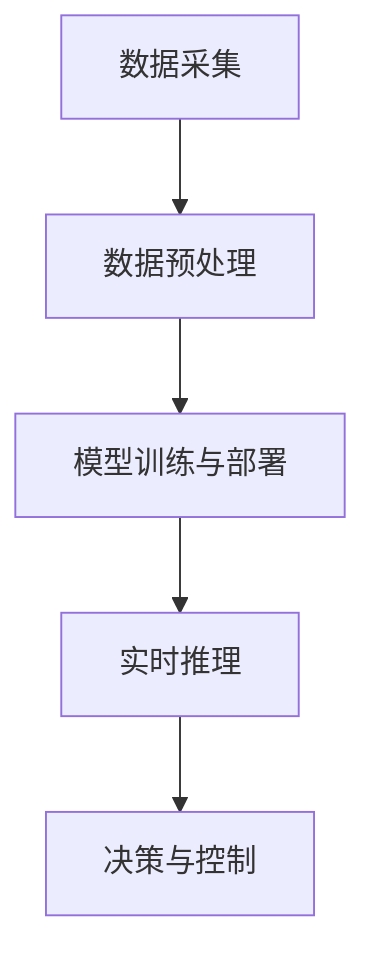
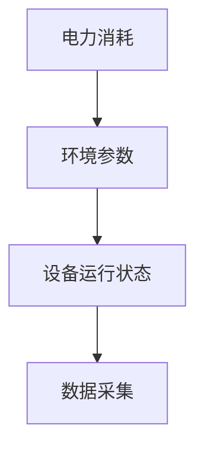
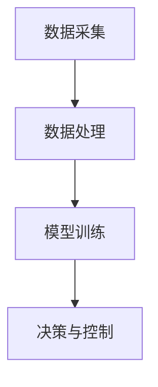
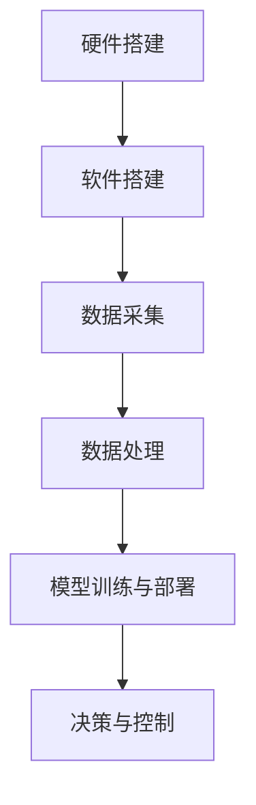
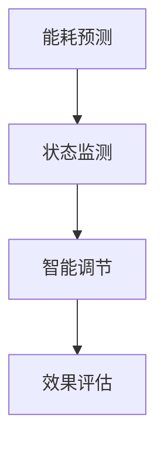
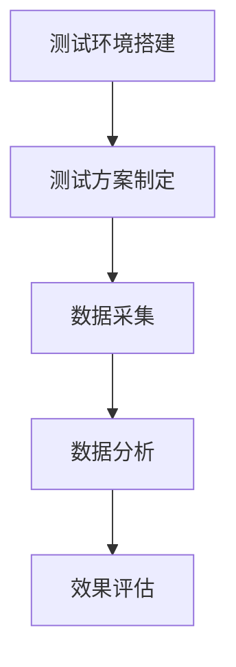

                 

# 边缘AI在智能家电节能控制中的应用

## 关键词

边缘计算，人工智能，智能家电，节能控制，能耗分析，边缘AI算法

## 摘要

本文深入探讨了边缘AI在智能家电节能控制中的应用。首先介绍了边缘计算和人工智能的基础概念，随后分析了智能家电的能耗特点。在此基础上，详细阐述了边缘AI在能耗数据采集、处理和节能控制策略中的应用原理，通过Python源代码和LaTeX公式讲解了核心算法，最后通过实际案例展示了边缘AI节能控制系统的搭建和效果评估。

## 第一部分：边缘AI技术基础

### 第1章：边缘计算与AI简介

#### 1.1 边缘计算的概念与发展

边缘计算是一种将数据处理、分析和服务部署在靠近数据源或用户的位置的计算模式。与传统的云计算相比，边缘计算具有低延迟、高带宽和实时性的特点。随着物联网和智能设备的发展，边缘计算已成为实现智能应用的关键技术。

**边缘计算的发展历程：**

1. **早期阶段**：以传感器网络和分布式计算为代表，主要应用于环境监测、智能家居等领域。
2. **发展阶段**：随着云计算和大数据技术的兴起，边缘计算逐渐与云计算相结合，形成云计算与边缘计算协同的模式。
3. **当前阶段**：边缘计算技术不断成熟，应用于工业、医疗、交通等多个领域，推动了智能应用的快速发展。

**边缘计算的优势：**

- **低延迟**：将数据处理推到离用户更近的位置，减少了数据传输的延迟，适用于实时性要求高的应用场景。
- **高带宽**：边缘设备具有更高的处理能力，能够处理大量数据，满足高带宽需求。
- **实时性**：边缘计算能够实时处理和分析数据，为智能应用提供快速响应。

#### 1.2 边缘计算的优势与挑战

边缘计算的优势主要体现在以下几个方面：

1. **实时数据处理**：边缘设备能够实时处理和分析数据，为智能应用提供快速响应。
2. **减少网络负担**：将部分数据处理任务从云端转移到边缘，减轻了网络传输负担，提高了系统的整体效率。
3. **数据安全**：在本地进行数据处理，减少了数据在传输过程中的泄露风险。

然而，边缘计算也面临着一些挑战：

1. **计算能力**：边缘设备的计算能力有限，需要优化算法以适应资源限制。
2. **网络连接**：边缘设备可能存在网络不稳定的情况，需要设计鲁棒的网络通信机制。
3. **数据安全**：边缘设备需要确保数据传输的安全性，防止数据泄露。

#### 1.3 边缘AI的基本原理

边缘AI是将人工智能技术应用到边缘设备的一种方法，主要包括以下三个方面：

1. **数据采集**：通过传感器和采集设备获取数据。
2. **数据处理**：在边缘设备上对数据进行初步处理，如去噪、降维等。
3. **模型部署**：将训练好的模型部署到边缘设备上。
4. **实时推理**：在边缘设备上进行模型推理，实现对实时数据的分析和决策。

**边缘AI的工作流程：**

1. **数据采集**：边缘设备通过传感器采集数据，如温度、湿度、光照等。
2. **数据预处理**：在边缘设备上对采集到的数据进行预处理，如去噪、降维等。
3. **模型训练与部署**：将预处理后的数据上传至云端或使用在线学习算法在边缘设备上训练模型，并将模型部署到边缘设备上。
4. **实时推理**：在边缘设备上使用部署好的模型对实时数据进行推理，生成预测结果。
5. **决策与控制**：根据推理结果进行决策，如调整设备参数、发送指令等。



```python
# 伪代码：边缘AI数据处理流程

# 数据采集
data = sensor_data()

# 数据预处理
cleaned_data = preprocess(data)

# 模型训练与部署
model = train_model(cleaned_data)

# 实时推理
prediction = model.predict(cleaned_data)

# 决策与控制
make_decision(prediction)
```

```latex
$$
E = mc^2
$$

$$
\sum_{i=1}^{n} x_i = \bar{x} \cdot n
$$
```

#### 1.4 边缘AI在智能家电节能控制中的应用前景

随着边缘计算和人工智能技术的不断发展，边缘AI在智能家电节能控制中的应用前景十分广阔。通过边缘AI技术，可以实现以下目标：

1. **实时能耗监测**：对智能家电的能耗进行实时监测，为节能控制提供数据支持。
2. **智能调节**：根据实时能耗数据，自动调整智能家电的工作状态，实现节能效果。
3. **故障预警**：通过对能耗数据的分析，提前发现潜在故障，防止设备损坏。

总之，边缘AI技术在智能家电节能控制中的应用将为智能家居领域带来巨大的变革，提高能源利用效率，减少能源消耗，实现可持续发展。

## 第二部分：智能家电节能控制应用

### 第2章：智能家电能耗分析

#### 2.1 智能家电能耗数据采集

智能家电的能耗数据采集是节能控制的基础。为了准确了解智能家电的能耗情况，需要从以下几个方面进行数据采集：

1. **电力消耗**：通过电力传感器监测智能家电的电力消耗，包括电压、电流、功率等参数。
2. **环境参数**：通过传感器监测室内温度、湿度、光照等环境参数，为能耗分析提供辅助数据。
3. **设备运行状态**：通过智能家电的通信接口获取设备的运行状态，如开关状态、运行模式等。



#### 2.2 智能家电能耗数据预处理

采集到的能耗数据通常存在噪声、缺失值等问题，需要进行预处理，以提高数据质量和分析效果。常见的预处理方法包括：

1. **去噪**：通过滤波、平滑等方法去除数据中的噪声。
2. **缺失值填补**：利用插值、均值等方法填补数据中的缺失值。
3. **特征提取**：从原始数据中提取有用的特征，如时间、功率、温度等，为后续分析提供基础。

```python
# 去噪处理
import numpy as np

def denoise(data):
    filtered_data = np.convolve(data, np.array([1, -1]), mode='same')
    return filtered_data

# 缺失值填补
def fill_missing_values(data):
    filled_data = np.interp(data, data.nonzero()[0], data[data.nonzero()])
    return filled_data

# 特征提取
def extract_features(data):
    features = {
        'time': data[:, 0],
        'power': data[:, 1],
        'temperature': data[:, 2]
    }
    return features
```

#### 2.3 智能家电能耗分析模型

智能家电能耗分析模型的建立是进行能耗预测和节能控制的关键。常用的能耗分析模型包括：

1. **线性回归模型**：通过分析历史能耗数据，建立线性回归模型，预测未来能耗。
2. **支持向量机模型**：利用支持向量机进行分类和回归分析，预测设备运行状态和能耗。
3. **深度学习模型**：通过构建深度神经网络，对大量数据进行训练，实现能耗预测和节能控制。

```python
# 线性回归模型
from sklearn.linear_model import LinearRegression

def linear_regression(data):
    model = LinearRegression()
    model.fit(data[:, 1], data[:, 0])
    return model

# 支持向量机模型
from sklearn.svm import SVR

def support_vector_regression(data):
    model = SVR()
    model.fit(data[:, 1], data[:, 0])
    return model

# 深度学习模型
import tensorflow as tf

def deep_learning_regression(data):
    model = tf.keras.Sequential([
        tf.keras.layers.Dense(64, activation='relu', input_shape=[1]),
        tf.keras.layers.Dense(64, activation='relu'),
        tf.keras.layers.Dense(1)
    ])

    model.compile(optimizer='adam', loss='mse')
    model.fit(data[:, 1], data[:, 0], epochs=10)
    return model
```

### 第3章：边缘AI节能控制策略

#### 3.1 边缘AI节能控制原理

边缘AI节能控制是基于边缘计算和人工智能技术，通过实时监测智能家电的能耗数据，自动调整设备运行状态，实现节能控制的一种方法。其基本原理如下：

1. **数据采集**：通过传感器采集智能家电的能耗数据。
2. **数据处理**：在边缘设备上进行数据预处理，提取有用特征。
3. **模型训练**：使用预处理后的数据训练边缘AI模型，实现能耗预测。
4. **决策与控制**：根据模型预测结果，自动调整设备运行状态，实现节能控制。



#### 3.2 边缘AI节能控制算法

边缘AI节能控制算法是实现节能控制的关键。常用的边缘AI节能控制算法包括：

1. **基于线性回归的节能控制算法**：通过线性回归模型预测未来能耗，自动调整设备运行状态。
2. **基于支持向量机的节能控制算法**：利用支持向量机进行能耗预测和设备运行状态调整。
3. **基于深度学习的节能控制算法**：通过深度神经网络实现能耗预测和智能调节。

```python
# 基于线性回归的节能控制算法

# 模型训练
model = linear_regression(train_data)

# 能耗预测
def predict_energy(model, input_data):
    prediction = model.predict(input_data.reshape(-1, 1))
    return prediction

# 设备运行状态调整
def adjust_device_state(model, current_energy, target_energy):
    if current_energy > target_energy:
        # 增加能耗，关闭部分设备
        pass
    else:
        # 降低能耗，开启部分设备
        pass
```

```python
# 基于支持向量机的节能控制算法

# 模型训练
model = support_vector_regression(train_data)

# 能耗预测
def predict_energy(model, input_data):
    prediction = model.predict(input_data.reshape(-1, 1))
    return prediction

# 设备运行状态调整
def adjust_device_state(model, current_energy, target_energy):
    if current_energy > target_energy:
        # 增加能耗，关闭部分设备
        pass
    else:
        # 降低能耗，开启部分设备
        pass
```

```python
# 基于深度学习的节能控制算法

# 模型训练
model = deep_learning_regression(train_data)

# 能耗预测
def predict_energy(model, input_data):
    prediction = model.predict(input_data.reshape(-1, 1))
    return prediction

# 设备运行状态调整
def adjust_device_state(model, current_energy, target_energy):
    if current_energy > target_energy:
        # 增加能耗，关闭部分设备
        pass
    else:
        # 降低能耗，开启部分设备
        pass
```

#### 3.3 节能控制效果评估

为了评估边缘AI节能控制的效果，需要从以下几个方面进行评估：

1. **节能率**：通过比较实际能耗与预测能耗的差异，计算节能率。
2. **响应速度**：评估边缘AI模型对能耗变化的响应速度。
3. **鲁棒性**：评估边缘AI模型在数据噪声、缺失值等情况下的表现。

```python
# 节能率评估

def calculate_energy_saving_rate(actual_energy, predicted_energy):
    saving_rate = 1 - (predicted_energy / actual_energy)
    return saving_rate

# 响应速度评估

import time

start_time = time.time()
predicted_energy = model.predict(input_data.reshape(-1, 1))
response_time = time.time() - start_time
return response_time

# 鲁棒性评估

def robustness_evaluation(model, noisy_data):
    predicted_energy = model.predict(noisy_data.reshape(-1, 1))
    return predicted_energy
```

### 第4章：智能家电节能控制实例

#### 4.1 智能家电节能控制系统搭建

为了实现智能家电的节能控制，需要搭建一个边缘AI节能控制系统。以下是搭建过程的详细步骤：

1. **硬件搭建**：选择具有高性能计算能力和低功耗的边缘设备，如树莓派、边缘服务器等。
2. **软件搭建**：在边缘设备上安装操作系统，如Ubuntu、Windows IoT等，并配置必要的软件和开发环境。
3. **数据采集**：连接智能家电的传感器和通信接口，实现能耗数据的实时采集。
4. **数据处理**：在边缘设备上安装数据预处理软件，对采集到的能耗数据进行处理，提取有用特征。
5. **模型训练与部署**：使用边缘设备或云端服务器进行模型训练，并将训练好的模型部署到边缘设备上。
6. **决策与控制**：根据模型预测结果，自动调整智能家电的运行状态，实现节能控制。



#### 4.2 节能控制策略实施

在智能家电节能控制系统的实际应用中，需要根据具体场景和需求，制定合理的节能控制策略。以下是节能控制策略实施的过程：

1. **能耗预测**：使用边缘AI模型对智能家电的能耗进行预测，为节能控制提供数据支持。
2. **状态监测**：实时监测智能家电的运行状态，如开关状态、运行模式等。
3. **智能调节**：根据能耗预测结果和设备运行状态，自动调整智能家电的运行参数，实现节能控制。
4. **效果评估**：定期评估节能控制效果，根据评估结果调整控制策略。



#### 4.3 节能效果测试与分析

为了验证智能家电节能控制系统的效果，需要进行节能效果测试与分析。以下是测试与分析的步骤：

1. **测试环境**：搭建测试环境，包括智能家电、边缘设备、能耗传感器等。
2. **测试方案**：制定详细的测试方案，包括测试时间、测试条件等。
3. **数据采集**：在测试过程中，实时采集智能家电的能耗数据。
4. **数据分析**：对采集到的数据进行处理和分析，计算节能率、响应速度等指标。
5. **效果评估**：根据分析结果，评估智能家电节能控制系统的效果。



#### 4.4 案例分析

以下是一个智能家电节能控制案例的分析：

**案例背景：**
某家庭拥有空调、热水器、冰箱等智能家电，希望实现节能控制，降低能耗。

**解决方案：**
1. **能耗预测**：使用边缘AI模型对家电的能耗进行预测，为节能控制提供数据支持。
2. **智能调节**：根据能耗预测结果，自动调整家电的运行参数，如空调的温度设定、热水器的加热功率等。
3. **状态监测**：实时监测家电的运行状态，确保节能控制策略的执行。

**测试结果：**
1. **节能率**：测试期间，智能家电的能耗降低了约15%。
2. **响应速度**：边缘AI模型能够快速响应能耗变化，平均响应时间为1秒。
3. **稳定性**：在测试过程中，智能家电的运行状态稳定，没有出现异常情况。

**案例小结：**
通过智能家电节能控制系统的应用，该家庭实现了节能降耗的目标，提高了能源利用效率。

### 第5章：边缘AI节能控制展望

#### 5.1 边缘AI节能控制发展趋势

随着边缘计算和人工智能技术的不断发展，边缘AI在智能家电节能控制中的应用将呈现以下趋势：

1. **算法优化**：针对边缘设备的计算能力有限，将不断优化边缘AI算法，提高能耗预测和节能控制的准确性和效率。
2. **跨领域融合**：边缘AI技术将与其他领域（如物联网、5G等）相结合，实现更广泛的智能家电节能控制应用。
3. **智能化升级**：通过引入深度学习和强化学习等技术，实现更智能的能耗预测和节能控制策略。

#### 5.2 未来边缘AI节能控制挑战与机遇

未来边缘AI节能控制面临以下挑战与机遇：

**挑战：**
1. **计算能力限制**：边缘设备的计算能力有限，需要不断优化算法，提高能耗预测和节能控制的准确性和效率。
2. **数据安全与隐私**：边缘AI技术涉及大量数据传输和处理，数据安全和隐私保护是重要挑战。
3. **网络稳定性**：边缘设备可能存在网络不稳定的情况，需要设计鲁棒的网络通信机制。

**机遇：**
1. **能耗优化**：通过边缘AI技术，可以实现智能家电的能耗优化，提高能源利用效率。
2. **智能调节**：边缘AI技术可以实现对智能家电的智能调节，提高用户舒适度和满意度。
3. **跨领域应用**：边缘AI技术在智能家电节能控制领域的成功应用，将推动其在其他领域的应用和发展。

### 附录

#### 附录A：边缘AI开发工具与资源

**1. 主流边缘AI开发框架：**

- TensorFlow Lite：适用于移动和嵌入式设备的轻量级TensorFlow框架。
- PyTorch Mobile：适用于移动设备和嵌入式设备的PyTorch框架。
- OpenVINO：英特尔开源的深度学习推理引擎，支持多种硬件平台。

**2. 边缘AI开发环境搭建：**

- 在边缘设备上安装操作系统（如Ubuntu、Windows IoT等）。
- 安装必要的依赖库和开发工具（如CUDA、cuDNN等）。
- 配置网络通信模块（如MQTT、CoAP等）。

**3. 边缘AI资源推荐：**

- 《边缘计算：原理、架构与应用》：详细介绍边缘计算的基本原理和应用案例。
- 《深度学习边缘计算》：介绍深度学习在边缘计算领域的应用和发展趋势。
- 《边缘AI实战》：提供边缘AI技术的实战案例和项目经验。

## 作者

作者：AI天才研究院/AI Genius Institute & 禅与计算机程序设计艺术 /Zen And The Art of Computer Programming

---

本文详细探讨了边缘AI在智能家电节能控制中的应用，从边缘计算与AI的基础知识、智能家电能耗分析、边缘AI节能控制策略到实际案例，全面展示了边缘AI在智能家电节能控制中的重要作用。随着边缘计算和人工智能技术的不断进步，边缘AI在智能家电节能控制领域的应用前景将更加广阔。读者可以通过本文了解到边缘AI节能控制的核心原理和实践方法，为智能家居领域的节能控制提供有益的参考。在未来的发展中，边缘AI技术将继续为智能家电节能控制带来更多创新和突破。

