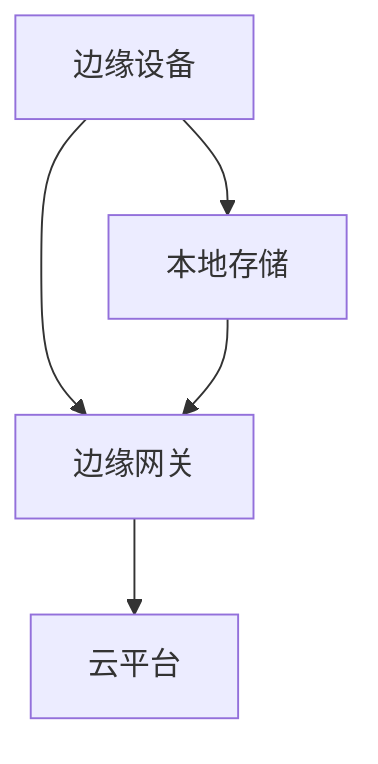
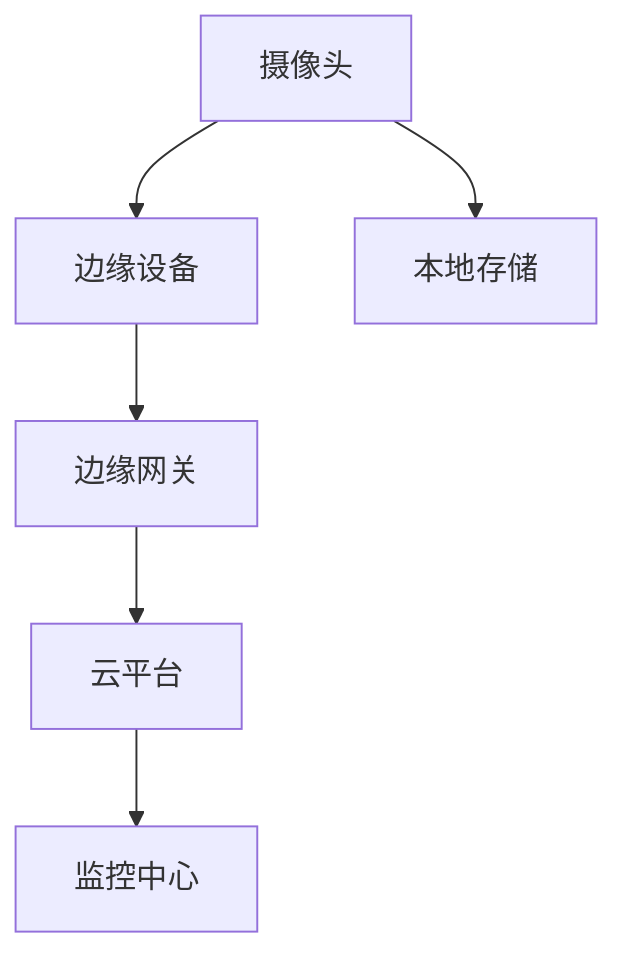
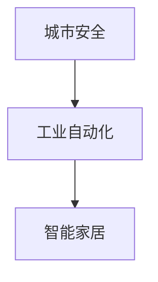
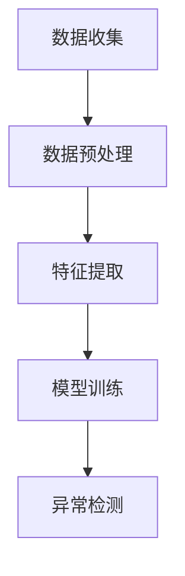
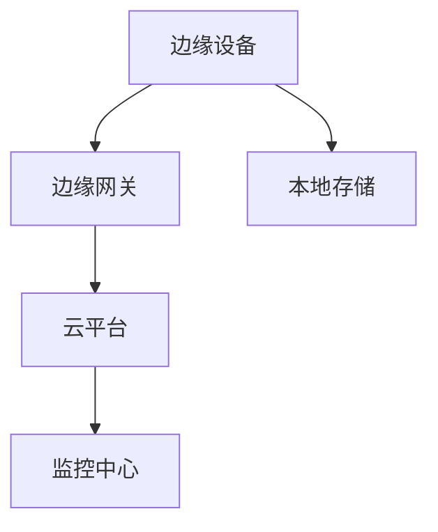

                 


## 边缘AI在智能监控中的应用：实现实时异常行为检测

### 关键词
- 边缘AI
- 智能监控
- 实时异常行为检测
- 边缘计算
- 卷积神经网络
- 深度学习

### 摘要
本文深入探讨了边缘AI在智能监控中的应用，特别是如何实现实时异常行为检测。通过详细分析边缘计算的优势、边缘AI技术基础、算法原理和实际应用案例，本文旨在为开发者提供一套完整的解决方案，帮助他们在智能监控系统中有效集成边缘AI技术。

### 引言

随着物联网（IoT）和智能监控技术的快速发展，实时数据处理和分析变得越来越重要。传统的云计算模型由于网络延迟和数据传输成本，往往难以满足智能监控对实时性的要求。而边缘AI技术的出现，为这一难题提供了一种创新的解决方案。

边缘AI利用分布在网络边缘的设备进行数据处理和分析，从而实现更低的延迟和更高的实时性。智能监控领域，如城市安全、工业自动化和智能家居等，都对实时异常行为检测提出了迫切需求。边缘AI技术正好能够满足这些需求，通过对监控数据进行实时处理，快速识别异常行为，并作出及时响应。

本文将分为以下几个部分：
1. 边缘计算与AI概述
2. 边缘AI硬件与平台
3. 边缘AI算法基础
4. 边缘AI在智能监控中的应用
5. 实时异常行为检测系统设计
6. 边缘AI在智能监控中的实战应用
7. 边缘AI在智能监控中的应用展望

### 第一部分：边缘计算与AI概述

#### 第1章：边缘计算与AI概述

##### 1.1 边缘计算的背景和定义

**核心概念与联系：**
边缘计算是指将数据处理和分析的任务从云端转移到网络的边缘，即接近数据源的地方进行。这有助于减少数据传输的延迟，提高系统的实时性。

**边缘计算架构流程图：**


边缘设备（如传感器、摄像头等）收集到的数据首先在边缘网关进行处理，然后可以选择性地上传到云平台进行进一步分析。这种分布式架构使得数据处理更加高效、实时。

**数学模型和公式：**
$$
\text{边缘计算延迟} \leq \text{云计算延迟}
$$

**举例说明：**
在智能监控中，边缘设备如摄像头可以实时捕捉视频流，并立即进行预处理和初步分析，从而实现秒级响应，而无需将大量数据上传到云端处理。

##### 1.2 边缘AI的核心概念

**核心算法原理讲解：**
边缘AI是指在边缘设备上部署和运行的AI算法，主要用于处理实时性强、数据量较小的任务。常用的算法包括卷积神经网络（CNN）、循环神经网络（RNN）等。

**Python源代码示例：**
```python
def edge_ai_algorithm(data):
    # 初始化神经网络模型
    model = initialize_model()
    # 进行前向传播
    predictions = model.forward_pass(data)
    # 返回预测结果
    return predictions
```

**数学模型和公式：**
卷积神经网络的基本运算公式：
$$
\text{激活函数}(\sum_{i=1}^{n} w_{i} \times a_{i} + b)
$$
其中，$w_i$ 是权重，$a_i$ 是输入特征，$b$ 是偏置。

**举例说明：**
假设我们使用卷积神经网络检测视频流中的异常行为，模型会对每一帧图像进行特征提取和分类，从而实现实时异常检测。

##### 1.3 边缘AI与传统云计算的对比

**数学模型和公式：**
$$
\text{边缘计算延迟} \leq \text{云计算延迟}
$$

**举例说明：**
在智能监控场景中，边缘AI能够实现秒级响应，而传统云计算可能需要几分钟甚至更长时间。例如，一个摄像头在检测到可疑活动时，边缘AI可以立即发出警报，而传统云计算则需要将视频流上传到云端，经过分析后才能发出警报，这期间的延迟可能导致无法及时响应。

**表格：**
| 对比项 | 边缘AI | 传统云计算 |
| --- | --- | --- |
| 延迟 | 低 | 高 |
| 网络带宽 | 节省 | 大量消耗 |
| 数据存储 | 本地处理 | 上传到云端 |
| 实时性 | 高 | 低 |

#### 第2章：边缘AI硬件与平台

##### 2.1 边缘AI硬件选择

**硬件性能指标解释：**
选择边缘AI硬件时，主要关注计算性能、功耗、存储容量等指标。例如，一个高性能的CPU和GPU可以提升边缘设备的计算能力，而低功耗的设计可以延长设备的使用寿命。

**伪代码：**
```python
def select_edge_hardware(need):
    # 根据需求选择硬件
    hardware = find_best_match(need)
    return hardware
```

**表格：**
| 硬件性能指标 | 说明 |
| --- | --- |
| 计算性能 | 用于执行AI算法的速度和效率 |
| 功耗 | 硬件在工作时消耗的电力 |
| 存储容量 | 存储数据和模型的空间 |

##### 2.2 常见的边缘AI开发平台

**平台功能对比：**
常见的边缘AI开发平台包括TensorFlow Lite、PyTorch Mobile、MindSpore等，它们在性能、易用性、生态等方面有所不同。

**表格：**
| 平台 | 计算性能 | 易用性 | 生态 |
| --- | --- | --- | --- |
| TensorFlow Lite | 高 | 中 | 广 |
| PyTorch Mobile | 中 | 高 | 中 |
| MindSpore | 高 | 中 | 窄 |

**举例说明：**
例如，TensorFlow Lite 是一个轻量级的边缘AI框架，适用于移动设备和嵌入式系统。PyTorch Mobile 则提供了更好的模型转换和部署工具，适合开发高性能的移动AI应用。

##### 2.3 硬件平台的性能优化

**最佳实践 tips：**
- 选择合适的硬件配置，根据应用需求调整CPU、GPU、存储等资源。
- 使用高效的AI算法，减少计算资源的消耗。
- 优化数据传输和存储，减少带宽和存储空间的占用。

**注意事项：**
- 在优化硬件性能时，要平衡功耗、计算性能和成本。
- 根据实际应用场景，选择合适的硬件平台和开发工具。

#### 第3章：边缘AI软件框架

##### 3.1 主流边缘AI软件框架

**核心概念与联系：**
主流边缘AI软件框架包括TensorFlow Lite、PyTorch Mobile、MindSpore等，它们提供了丰富的工具和库，帮助开发者快速构建边缘AI应用。

**软件框架的功能与应用：**
这些框架通常提供以下功能：
- 模型转换：将训练好的模型转换为边缘设备支持的格式。
- 模型部署：将模型部署到边缘设备，实现实时推理。
- 数据处理：提供数据预处理和后处理的工具。

**举例说明：**
例如，TensorFlow Lite 可以将训练好的TensorFlow模型转换为 Lite 格式，然后部署到 Android 或 iOS 设备上。PyTorch Mobile 提供了 PyTorch 模型的部署工具，支持移动设备和嵌入式系统。

##### 3.2 软件框架的功能与应用

**核心算法原理讲解：**
这些框架通常基于深度学习技术，提供了一系列的工具和库，如神经网络构建、训练、推理等。开发者可以使用这些工具，快速构建边缘AI应用。

**Python源代码示例：**
```python
import tensorflow as tf

# 加载模型
model = tf.keras.models.load_model('model.h5')

# 进行推理
predictions = model.predict(input_data)
```

**数学模型和公式：**
卷积神经网络（CNN）的基本运算公式：
$$
\text{激活函数}(\sum_{i=1}^{n} w_{i} \times a_{i} + b)
$$

**举例说明：**
使用 TensorFlow Lite 进行边缘AI应用开发，可以通过以下步骤：
1. 训练模型：使用 TensorFlow 在云上进行模型训练。
2. 转换模型：使用 TensorFlow Lite Converter 将模型转换为 Lite 格式。
3. 部署模型：将转换后的模型部署到边缘设备上。
4. 实现实时推理：使用边缘设备进行实时数据分析和预测。

#### 第4章：边缘AI算法基础

##### 4.1 常见的边缘AI算法

**核心概念与联系：**
常见的边缘AI算法包括卷积神经网络（CNN）、循环神经网络（RNN）等，它们广泛应用于图像识别、语音识别、自然语言处理等领域。

**算法原理讲解：**
卷积神经网络（CNN）是一种用于图像识别和处理的深度学习算法，通过对图像进行卷积操作，提取特征并进行分类。

**Python源代码示例：**
```python
import tensorflow as tf

# 创建模型
model = tf.keras.Sequential([
    tf.keras.layers.Conv2D(32, (3, 3), activation='relu', input_shape=(28, 28, 1)),
    tf.keras.layers.MaxPooling2D((2, 2)),
    tf.keras.layers.Flatten(),
    tf.keras.layers.Dense(128, activation='relu'),
    tf.keras.layers.Dense(10, activation='softmax')
])

# 训练模型
model.compile(optimizer='adam', loss='categorical_crossentropy', metrics=['accuracy'])
model.fit(x_train, y_train, epochs=10)

# 进行推理
predictions = model.predict(x_test)
```

**数学模型和公式：**
卷积神经网络（CNN）的基本运算公式：
$$
\text{激活函数}(\sum_{i=1}^{n} w_{i} \times a_{i} + b)
$$

**举例说明：**
使用卷积神经网络（CNN）进行图像识别，可以通过以下步骤：
1. 数据预处理：将图像数据缩放到固定大小，并进行归一化处理。
2. 创建模型：定义卷积层、池化层和全连接层。
3. 训练模型：使用训练数据集训练模型。
4. 进行推理：使用测试数据集进行模型推理，评估模型性能。

##### 4.2 算法优化与资源利用

**核心概念与联系：**
算法优化与资源利用是边缘AI开发中重要的环节，旨在提高算法性能，降低资源消耗。

**算法优化方法：**
- 算法压缩：通过减少模型参数数量和计算量，降低模型复杂度。
- 算法转换：将训练好的模型转换为边缘设备支持的格式，优化模型部署。
- 算法剪枝：通过剪枝冗余的神经网络连接，减少模型计算量。

**Python源代码示例：**
```python
import tensorflow as tf

# 创建模型
model = tf.keras.Sequential([
    tf.keras.layers.Conv2D(32, (3, 3), activation='relu', input_shape=(28, 28, 1)),
    tf.keras.layers.MaxPooling2D((2, 2)),
    tf.keras.layers.Flatten(),
    tf.keras.layers.Dense(128, activation='relu'),
    tf.keras.layers.Dense(10, activation='softmax')
])

# 优化模型
model.compile(optimizer='adam', loss='categorical_crossentropy', metrics=['accuracy'])
model.fit(x_train, y_train, epochs=10)

# 转换模型为 Lite 格式
converter = tf.lite.TFLiteConverter.from_keras_model(model)
tflite_model = converter.convert()

# 保存 Lite 模型
with open('model.tflite', 'wb') as f:
    f.write(tflite_model)
```

**数学模型和公式：**
模型压缩的基本原理：
$$
\text{模型参数数量} = \text{原始模型参数数量} \times \text{压缩比例}
$$

**举例说明：**
使用 TensorFlow Lite 对卷积神经网络（CNN）进行压缩，可以通过以下步骤：
1. 训练模型：使用 TensorFlow 在云上进行模型训练。
2. 优化模型：通过减少模型参数数量和计算量，优化模型。
3. 转换模型：使用 TensorFlow Lite Converter 将模型转换为 Lite 格式。
4. 部署模型：将转换后的模型部署到边缘设备上。
5. 进行推理：使用边缘设备进行实时数据分析和预测。

#### 第5章：边缘AI在智能监控中的应用

##### 5.1 智能监控概述

**核心概念与联系：**
智能监控是一种利用物联网（IoT）和人工智能（AI）技术实现的监控系统，能够对实时数据进行处理和分析，实现自动化的监控和管理。

**智能监控架构图：**


**举例说明：**
一个典型的智能监控系统包括摄像头、边缘设备、边缘网关、云平台和监控中心。摄像头实时捕捉视频流，边缘设备对视频流进行初步分析，边缘网关将分析结果上传到云平台，云平台进行进一步处理，最终监控中心接收和分析结果，实现实时监控和管理。

##### 5.2 边缘AI在智能监控中的优势

**核心概念与联系：**
边缘AI在智能监控中的应用，主要优势在于实时性强、延迟低、数据隐私保护等。

**表格：**
| 优势 | 说明 |
| --- | --- |
| 实时性 | 边缘AI能够实现实时数据处理和分析，降低延迟 |
| 延迟低 | 边缘设备位于数据源附近，数据传输距离短，延迟低 |
| 数据隐私保护 | 数据在边缘设备上进行处理，减少数据传输，降低隐私泄露风险 |

**举例说明：**
在智能监控中，边缘AI技术可以实现秒级响应，快速识别异常行为，并立即采取行动。例如，一个城市监控系统可以在摄像头捕捉到可疑活动后，立即触发报警，并通知相关部门进行处理。

##### 5.3 边缘AI在智能监控中的应用场景

**核心概念与联系：**
边缘AI在智能监控中的应用场景包括城市安全、工业自动化、智能家居等。

**应用场景图：**


**举例说明：**
- 城市安全：边缘AI可以用于实时监控城市交通状况、人员流动等，快速识别异常行为，如交通事故、非法聚集等。
- 工业自动化：边缘AI可以用于监控生产线，实时检测产品质量、设备故障等，提高生产效率。
- 智能家居：边缘AI可以用于智能门锁、智能摄像头等，实现智能家居的自动化管理，提供更便捷的生活体验。

#### 第6章：实时异常行为检测算法原理

##### 6.1 异常行为检测的定义

**核心概念与联系：**
异常行为检测是一种通过分析数据，识别出与正常行为不符的数据点或事件的方法。

**数学模型和公式：**
异常行为检测的基本流程：
$$
\text{数据预处理} \rightarrow \text{特征提取} \rightarrow \text{模型训练} \rightarrow \text{异常检测}
$$

**举例说明：**
例如，在一个交通监控系统中，可以通过分析车辆流量数据，识别出异常流量，如突然增加的车辆流量可能意味着交通事故。

##### 6.2 异常行为检测的常见算法

**核心概念与联系：**
常见的异常行为检测算法包括统计方法、基于规则的方法、机器学习方法等。

**算法原理讲解：**
- 统计方法：基于统计学原理，通过计算数据的概率分布，识别出异常值。
- 基于规则的方法：通过预设规则，识别出不符合规则的行为。
- 机器学习方法：通过训练模型，自动识别出异常行为。

**Python源代码示例：**
```python
from sklearn.ensemble import IsolationForest

# 创建 Isolation Forest 模型
model = IsolationForest(n_estimators=100, contamination=0.1)

# 训练模型
model.fit(X_train)

# 进行异常检测
predictions = model.predict(X_test)
```

**数学模型和公式：**
Isolation Forest 的基本运算公式：
$$
\text{异常得分} = \frac{\sum_{i=1}^{n} \text{深度}}{\text{最大深度}}
$$

**举例说明：**
使用 Isolation Forest 进行异常行为检测，可以通过以下步骤：
1. 数据预处理：将数据缩放至同一量级。
2. 创建模型：使用 Isolation Forest 模型。
3. 训练模型：使用训练数据集训练模型。
4. 进行异常检测：使用测试数据集进行异常检测。

##### 6.3 异常行为检测算法的流程

**核心概念与联系：**
异常行为检测算法的流程包括数据收集、预处理、特征提取、模型训练和异常检测。

**流程图：**


**举例说明：**
以城市监控系统为例，异常行为检测算法的流程如下：
1. 数据收集：从摄像头、传感器等设备收集实时视频流和流量数据。
2. 数据预处理：对收集到的数据进行去噪、滤波等处理。
3. 特征提取：从预处理后的数据中提取关键特征，如车辆速度、流量密度等。
4. 模型训练：使用训练数据集训练异常行为检测模型。
5. 异常检测：使用训练好的模型对实时数据进行异常检测，识别出异常行为。

#### 第7章：实时异常行为检测系统设计

##### 7.1 系统架构设计

**核心概念与联系：**
实时异常行为检测系统通常采用分布式架构，包括边缘设备、边缘网关、云平台和监控中心。

**系统架构图：**


**举例说明：**
系统架构的设计需要考虑以下几个方面：
- 边缘设备：用于实时数据采集和处理。
- 边缘网关：用于数据传输和初步分析。
- 云平台：用于进一步数据处理和分析。
- 监控中心：用于接收和分析结果，实现监控和管理。

##### 7.2 系统实现的关键技术

**核心概念与联系：**
系统实现的关键技术包括数据采集、预处理、特征提取、模型训练和推理等。

**关键技术讲解：**
- 数据采集：通过摄像头、传感器等设备收集实时数据。
- 数据预处理：对采集到的数据进行去噪、滤波、归一化等处理。
- 特征提取：从预处理后的数据中提取关键特征。
- 模型训练：使用训练数据集训练异常行为检测模型。
- 模型推理：使用训练好的模型对实时数据进行异常检测。

**Python源代码示例：**
```python
import cv2
import numpy as np

# 采集视频数据
cap = cv2.VideoCapture(0)

# 预处理和特征提取
def preprocess_frame(frame):
    # 去噪、滤波、归一化等操作
    processed_frame = cv2.resize(frame, (224, 224))
    processed_frame = processed_frame / 255.0
    return processed_frame

# 训练模型
model = ...  # 加载训练好的模型

# 进行推理
while True:
    ret, frame = cap.read()
    if not ret:
        break
    processed_frame = preprocess_frame(frame)
    predictions = model.predict(processed_frame)
    # 输出结果
    print(predictions)
```

**数学模型和公式：**
卷积神经网络（CNN）的基本运算公式：
$$
\text{激活函数}(\sum_{i=1}^{n} w_{i} \times a_{i} + b)
$$

**举例说明：**
使用卷积神经网络（CNN）进行实时异常行为检测，可以通过以下步骤：
1. 数据采集：使用摄像头采集实时视频流。
2. 数据预处理：对采集到的视频帧进行预处理。
3. 特征提取：从预处理后的视频帧中提取特征。
4. 模型训练：使用训练数据集训练异常行为检测模型。
5. 模型推理：使用训练好的模型对实时视频帧进行异常检测。

##### 7.3 系统性能优化

**核心概念与联系：**
系统性能优化主要包括算法优化、硬件优化和系统优化等方面。

**性能优化方法：**
- 算法优化：选择高效算法，减少计算量。
- 硬件优化：选择高性能的边缘设备和硬件平台。
- 系统优化：优化系统架构和流程，提高系统效率。

**最佳实践 tips：**
- 使用轻量级模型和算法，提高实时性和计算效率。
- 优化数据传输和存储，减少带宽和存储空间的占用。
- 采用分布式架构，提高系统可靠性和扩展性。

**注意事项：**
- 在优化系统性能时，要平衡实时性和资源消耗，避免过度优化导致系统不稳定。
- 根据实际应用场景和需求，选择合适的性能优化方法。

#### 第8章：边缘AI在智能监控中的实战应用

##### 8.1 案例一：城市智能监控系统的边缘AI应用

**核心概念与联系：**
城市智能监控系统通过边缘AI技术，实现实时交通监控、人员流动监控等功能，提高城市安全管理水平。

**案例背景：**
一个城市智能监控系统需要实时监控城市交通状况和人员流动情况，以便快速识别异常行为，如交通事故、非法聚集等。

**案例步骤：**
1. 数据采集：使用摄像头和传感器收集实时交通和人员流动数据。
2. 数据预处理：对采集到的数据进行去噪、滤波、归一化等处理。
3. 特征提取：从预处理后的数据中提取关键特征，如车辆速度、流量密度、人员密度等。
4. 模型训练：使用训练数据集训练异常行为检测模型。
5. 模型推理：使用训练好的模型对实时数据进行异常检测。
6. 警报通知：识别出异常行为后，立即通知相关部门进行处理。

**案例效果：**
通过边缘AI技术，城市智能监控系统实现了秒级响应，有效提高了城市安全管理水平，降低了安全事故发生的风险。

##### 8.2 案例二：工业安全监控中的边缘AI应用

**核心概念与联系：**
工业安全监控系统通过边缘AI技术，实现实时设备监控、故障检测等功能，提高生产安全性和效率。

**案例背景：**
一个工业安全监控系统需要实时监控生产线设备状态，识别潜在故障，确保生产安全。

**案例步骤：**
1. 数据采集：使用传感器和监控设备收集实时设备状态数据。
2. 数据预处理：对采集到的数据进行去噪、滤波、归一化等处理。
3. 特征提取：从预处理后的数据中提取关键特征，如设备温度、振动、压力等。
4. 模型训练：使用训练数据集训练故障检测模型。
5. 模型推理：使用训练好的模型对实时数据进行故障检测。
6. 警报通知：识别出故障后，立即通知相关人员进行检查和处理。

**案例效果：**
通过边缘AI技术，工业安全监控系统实现了实时故障检测和预警，有效提高了生产安全性和效率，降低了生产事故的发生。

##### 8.3 案例三：智能家居监控中的边缘AI应用

**核心概念与联系：**
智能家居监控系统通过边缘AI技术，实现实时家居设备监控、行为分析等功能，提供更便捷、智能的生活体验。

**案例背景：**
一个智能家居监控系统需要实时监控家居设备状态，分析用户行为，提供个性化的智能服务。

**案例步骤：**
1. 数据采集：使用传感器和监控设备收集实时家居设备状态数据。
2. 数据预处理：对采集到的数据进行去噪、滤波、归一化等处理。
3. 特征提取：从预处理后的数据中提取关键特征，如设备使用频率、使用时长、用户行为等。
4. 模型训练：使用训练数据集训练行为分析模型。
5. 模型推理：使用训练好的模型对实时数据进行行为分析。
6. 智能服务：根据用户行为分析结果，提供个性化的智能服务，如自动调节灯光、温度等。

**案例效果：**
通过边缘AI技术，智能家居监控系统实现了实时设备监控和行为分析，有效提高了生活便捷性和舒适度，为用户提供更智能、个性化的家居体验。

#### 第9章：边缘AI在智能监控中的应用展望

##### 9.1 技术挑战

**核心概念与联系：**
边缘AI在智能监控中的应用面临诸多技术挑战，包括数据隐私保护、实时性保证、资源优化等。

**挑战讲解：**
- 数据隐私保护：智能监控系统涉及大量的个人隐私数据，如何确保数据在传输和存储过程中的安全性，是一个重要挑战。
- 实时性保证：边缘设备资源有限，如何保证在有限的资源下实现高效、实时的数据处理和分析，是一个关键问题。
- 资源优化：如何在有限的计算资源和存储空间下，实现高效的数据处理和分析，是一个技术难题。

**解决方案：**
- 数据隐私保护：采用加密技术和安全协议，确保数据在传输和存储过程中的安全性。
- 实时性保证：优化算法和系统架构，提高数据处理效率，确保实时性。
- 资源优化：采用轻量级模型和算法，降低计算和存储资源的消耗。

##### 9.2 市场机遇

**核心概念与联系：**
边缘AI在智能监控领域的应用，带来了巨大的市场机遇，包括物联网设备升级、智能监控市场规模增长等。

**市场机遇讲解：**
- 物联网设备升级：随着物联网技术的发展，越来越多的设备开始具备边缘计算能力，为边缘AI提供了广泛的应用场景。
- 智能监控市场规模增长：智能监控在安防、工业、家居等领域的应用越来越广泛，市场前景广阔。

**商业案例：**
例如，智能家居市场的快速增长，为边缘AI在智能家居监控中的应用提供了广阔的市场机遇。

##### 9.3 未来发展趋势

**核心概念与联系：**
未来，边缘AI在智能监控领域的应用将朝着更高效、更智能、更安全的发展方向迈进。

**发展趋势讲解：**
- 边缘AI算法的进步：随着深度学习技术的发展，边缘AI算法将更加高效，能够处理更复杂的数据和任务。
- 跨领域应用：边缘AI将在更多领域得到应用，如医疗、教育等。
- 安全性提升：随着加密技术和安全协议的进步，边缘AI在智能监控中的安全性将得到进一步提升。

**展望：**
边缘AI在智能监控中的应用前景广阔，未来将带来更加智能、高效、安全的监控体验。

### 附录

#### 附录A：边缘AI开发工具与资源

**核心概念与联系：**
边缘AI开发需要使用多种工具和资源，包括开发框架、算法库、硬件平台等。

**工具与资源列表：**
- 开发框架：TensorFlow Lite、PyTorch Mobile、MindSpore等。
- 算法库：scikit-learn、Keras、PyTorch等。
- 硬件平台：NVIDIA Jetson、树莓派、ARM处理器等。

**参考资料：**
- 《边缘AI技术与应用》
- 《深度学习入门》
- 《智能监控系统设计与应用》

### 总结

边缘AI在智能监控中的应用，为实时数据处理和分析提供了创新的解决方案。通过本文的详细分析，我们了解了边缘AI技术的基础、硬件与平台选择、算法原理、实战应用以及未来展望。希望本文能对开发者有所帮助，推动边缘AI技术在智能监控领域的广泛应用。

### 作者信息

作者：AI天才研究院/AI Genius Institute & 禅与计算机程序设计艺术 /Zen And The Art of Computer Programming

### 结语

边缘AI技术在智能监控领域的应用，不仅提高了实时数据处理和分析的能力，也为智能监控系统的安全性和效率提供了保障。未来，随着技术的不断进步，边缘AI在智能监控领域的应用将更加广泛，为我们的生活带来更多便利和安全。让我们共同期待这一美好前景的到来！

