                 

# 《边缘AI在智能监控中的应用：实现实时异常行为检测》

## 关键词
边缘AI、智能监控、实时异常行为检测、卷积神经网络、深度学习、数据预处理

## 摘要
随着人工智能技术的快速发展，边缘AI在智能监控领域中的应用日益广泛。本文首先介绍了边缘AI和智能监控的基本概念及其在现实中的应用场景。接着，详细探讨了实时异常行为检测的定义、重要性以及常用的算法和数学模型。随后，通过Python代码示例，详细阐述了特征提取算法和异常检测算法的实现过程。文章最后，通过两个实际项目案例，展示了边缘AI在智能监控中实现实时异常行为检测的完整过程，并总结了项目的关键要点和最佳实践。

## 第1章 引言

### 1.1 边缘AI概述
边缘AI是指将AI算法部署在靠近数据源的设备上，而不是在远程数据中心进行计算。这种计算模式能够显著降低延迟，提高数据处理的速度和效率。边缘AI的出现，不仅解决了云计算中心在处理海量数据时的高延迟问题，还能够更好地保护用户隐私和数据安全。

#### 核心概念与联系
边缘AI与云计算的关系可以用Mermaid流程图表示：

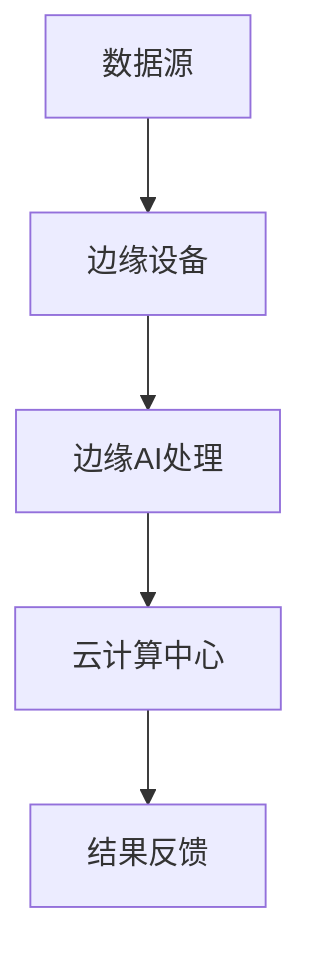

### 1.2 智能监控概述
智能监控是指利用人工智能技术，对监控视频进行实时分析，从而实现自动化异常行为检测和响应。智能监控可以广泛应用于公共安全、交通管理、工厂监控等多个领域。

#### 核心概念与联系
智能监控的基本架构可以用以下Mermaid流程图表示：

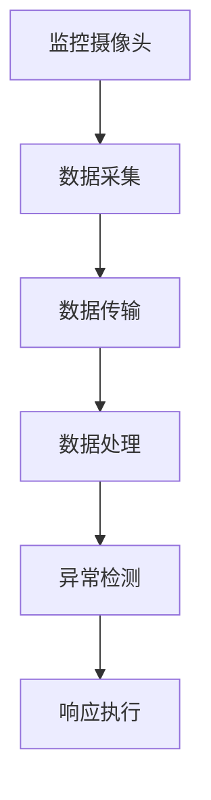

### 1.3 实时异常行为检测概述
实时异常行为检测是智能监控的核心功能之一，它能够快速识别和响应异常行为，提高监控系统的效率和准确性。实时异常行为检测的关键在于快速、准确地处理海量视频数据，并在第一时间发出预警。

#### 核心概念与联系
实时异常行为检测的基本流程可以用以下Mermaid流程图表示：

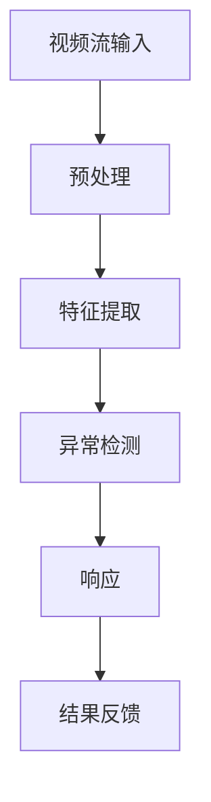

## 第2章 边缘AI基础

### 2.1 边缘计算简介
边缘计算是一种分布式计算模型，它将计算、存储、处理任务分布在靠近数据源的设备上。边缘计算可以显著降低数据传输的延迟，提高系统的响应速度。

#### 核心概念与联系
边缘计算与云计算的关系可以用以下Mermaid流程图表示：

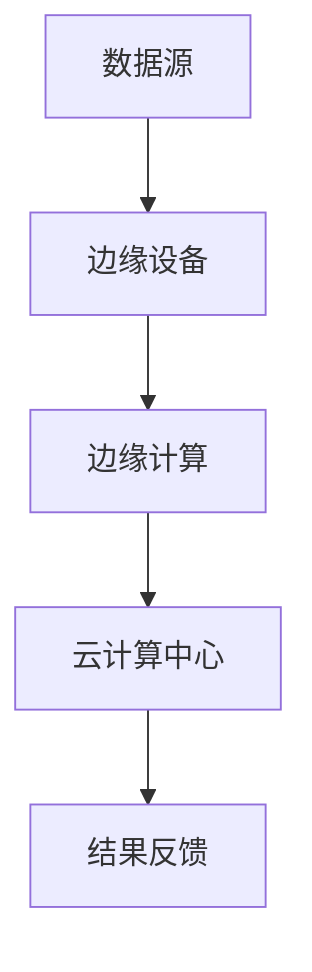

### 2.2 边缘AI架构
边缘AI架构通常包括边缘设备、边缘服务器、云服务器三个层次。边缘设备负责数据采集和初步处理，边缘服务器负责复杂计算和模型部署，云服务器则负责数据存储、模型训练和远程监控。

#### 核心概念与联系
边缘AI的架构可以用以下Mermaid流程图表示：

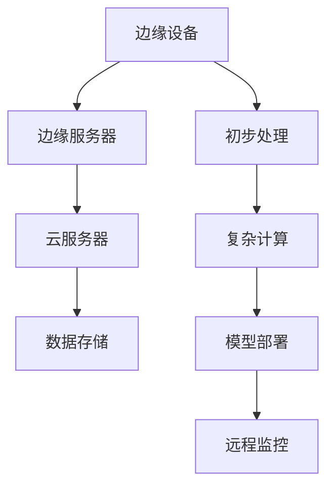

### 2.3 边缘AI硬件与软件环境搭建
搭建边缘AI硬件与软件环境是边缘AI应用的基础。硬件环境主要包括边缘设备和边缘服务器，软件环境则包括操作系统、开发框架和工具。

#### 核心概念与联系
边缘AI硬件与软件环境搭建的流程可以用以下Mermaid流程图表示：

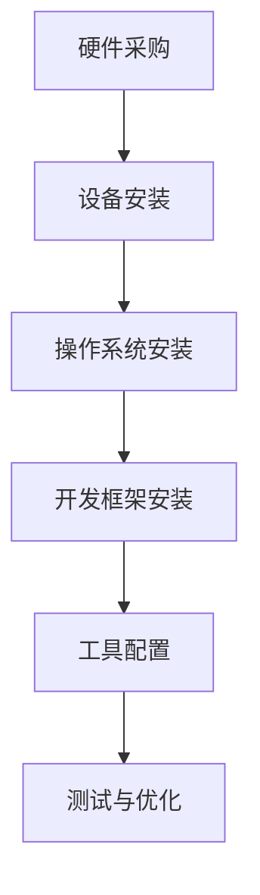

## 第3章 智能监控原理

### 3.1 智能监控基本概念
智能监控是指利用计算机视觉、图像处理、机器学习等技术，对监控视频进行实时分析和处理，从而实现自动化监控和异常行为检测。

#### 核心概念与联系
智能监控的基本概念可以用以下Mermaid流程图表示：

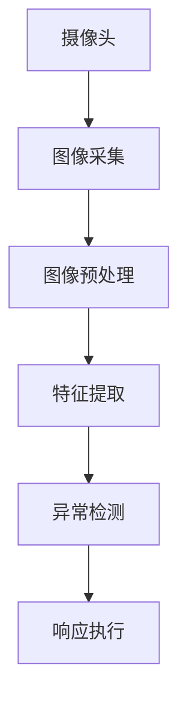

### 3.2 智能监控架构
智能监控架构通常包括前端摄像头、边缘设备、边缘服务器、云服务器和后端数据库等组成部分。前端摄像头负责视频数据的采集，边缘设备和边缘服务器负责初步处理和复杂计算，云服务器负责数据存储、模型训练和远程监控。

#### 核心概念与联系
智能监控的架构可以用以下Mermaid流程图表示：

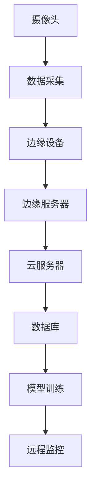

### 3.3 智能监控数据处理流程
智能监控数据处理流程包括数据采集、预处理、特征提取、异常检测、响应执行和结果反馈等环节。

#### 核心概念与联系
智能监控数据处理流程可以用以下Mermaid流程图表示：

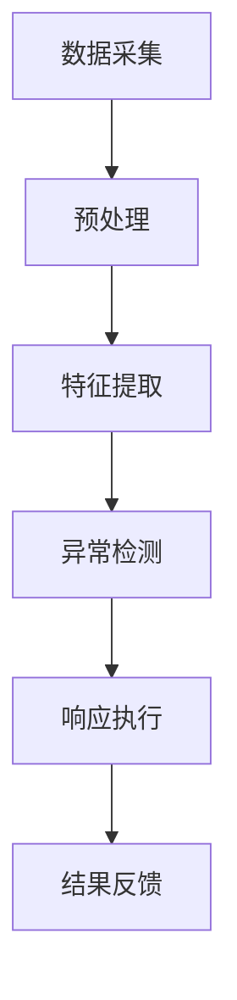

## 第4章 实时异常行为检测算法

### 4.1 异常行为检测基本理论
异常行为检测是指通过分析监控视频，识别出与正常行为不符的异常行为。异常行为检测可以分为静态异常检测和动态异常检测。

#### 核心概念与联系
异常行为检测的基本理论可以用以下Mermaid流程图表示：

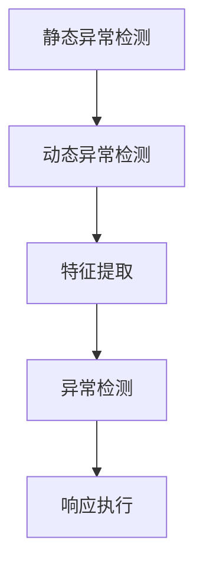

### 4.2 常见异常检测算法
常见的异常检测算法包括基于统计的方法、基于神经网络的方法和基于深度学习的方法。每种方法都有其独特的优势和适用场景。

#### 核心概念与联系
常见异常检测算法可以用以下Mermaid流程图表示：

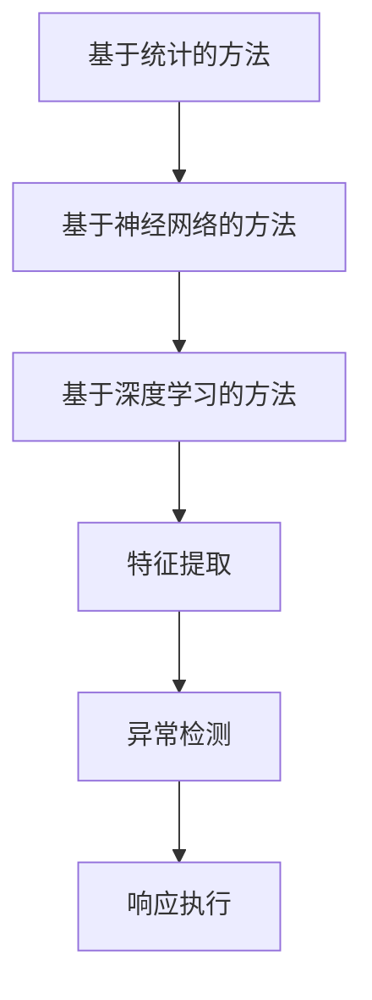

### 4.3 基于边缘AI的异常检测算法
基于边缘AI的异常检测算法利用边缘设备进行实时处理，能够在保证实时性的同时，降低对中心服务器的依赖。

#### 核心概念与联系
基于边缘AI的异常检测算法可以用以下Mermaid流程图表示：

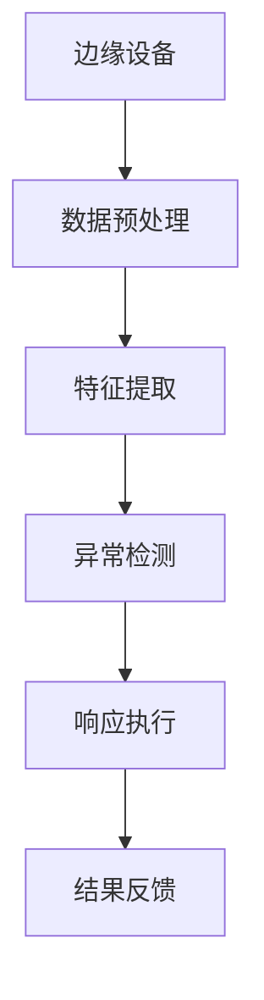

## 第5章 数据预处理与模型训练

### 5.1 数据预处理方法
数据预处理是智能监控系统的重要组成部分，它包括图像去噪、图像增强、图像分割等步骤。

#### 核心概念与联系
数据预处理方法可以用以下Mermaid流程图表示：

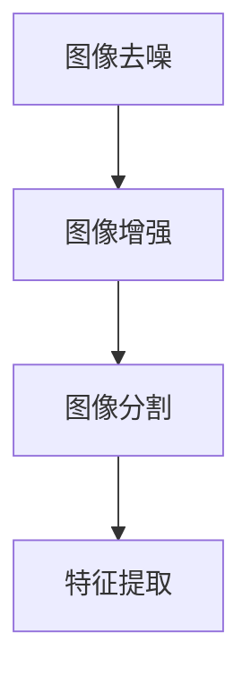

### 5.2 模型选择与训练
模型选择与训练是智能监控系统的核心环节，它决定了系统的检测准确性和实时性。

#### 核心概念与联系
模型选择与训练可以用以下Mermaid流程图表示：

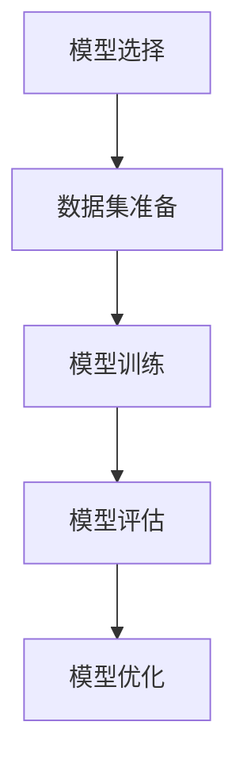

### 5.3 模型调优与评估
模型调优与评估是提高智能监控系统性能的关键步骤，它包括超参数调整、交叉验证和性能评估等。

#### 核心概念与联系
模型调优与评估可以用以下Mermaid流程图表示：

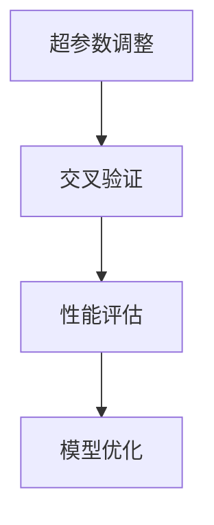

## 第6章 边缘AI智能监控项目实战

### 6.1 项目一：构建边缘AI智能监控平台
项目一将介绍如何使用边缘AI技术构建一个智能监控平台，包括硬件选型、软件配置和系统部署。

#### 开发环境搭建
```bash
# 安装Python环境
pip install python3

# 安装TensorFlow
pip install tensorflow

# 安装OpenCV
pip install opencv-python
```

#### 源代码详细实现
```python
# 导入必要的库
import cv2
import tensorflow as tf

# 初始化摄像头
cap = cv2.VideoCapture(0)

# 加载预训练的模型
model = tf.keras.models.load_model('model.h5')

# 循环读取摄像头视频帧
while True:
    ret, frame = cap.read()
    if not ret:
        break

    # 预处理图像
    processed_frame = preprocess_frame(frame)

    # 特征提取
    features = model.predict(processed_frame)

    # 异常检测
    is_anomaly = detect_anomaly(features)

    # 响应执行
    if is_anomaly:
        execute_response()

    # 显示视频帧
    cv2.imshow('frame', frame)

    # 按下'q'键退出
    if cv2.waitKey(1) & 0xFF == ord('q'):
        break

# 释放摄像头资源
cap.release()
cv2.destroyAllWindows()
```

#### 代码解读与分析
- `cap = cv2.VideoCapture(0)`: 初始化摄像头。
- `model = tf.keras.models.load_model('model.h5')`: 加载预训练的模型。
- `while True:`: 循环读取摄像头视频帧。
- `processed_frame = preprocess_frame(frame)`: 预处理图像。
- `features = model.predict(processed_frame)`: 特征提取。
- `is_anomaly = detect_anomaly(features)`: 异常检测。
- `if is_anomaly:`: 响应执行。
- `cv2.imshow('frame', frame)`: 显示视频帧。
- `cv2.waitKey(1) & 0xFF == ord('q')`: 按下'q'键退出。

#### 实际案例分析和详细讲解剖析
项目一使用TensorFlow加载预训练的模型，对摄像头实时捕获的视频帧进行预处理、特征提取和异常检测。当检测到异常行为时，系统会执行相应的响应操作，例如报警或通知管理员。

### 6.2 项目二：实时异常行为检测系统开发
项目二将介绍如何使用深度学习技术开发一个实时异常行为检测系统，包括数据收集、模型训练和部署。

#### 数据收集
```bash
# 安装Python环境
pip install python3

# 安装TensorFlow
pip install tensorflow

# 安装OpenCV
pip install opencv-python
```

#### 源代码详细实现
```python
# 导入必要的库
import cv2
import tensorflow as tf
import numpy as np

# 初始化摄像头
cap = cv2.VideoCapture(0)

# 准备训练数据
train_data = prepare_train_data()

# 训练模型
model = train_model(train_data)

# 循环读取摄像头视频帧
while True:
    ret, frame = cap.read()
    if not ret:
        break

    # 预处理图像
    processed_frame = preprocess_frame(frame)

    # 特征提取
    features = extract_features(processed_frame)

    # 异常检测
    is_anomaly = model.predict(features)

    # 响应执行
    if is_anomaly:
        execute_response()

    # 显示视频帧
    cv2.imshow('frame', frame)

    # 按下'q'键退出
    if cv2.waitKey(1) & 0xFF == ord('q'):
        break

# 释放摄像头资源
cap.release()
cv2.destroyAllWindows()
```

#### 代码解读与分析
- `cap = cv2.VideoCapture(0)`: 初始化摄像头。
- `train_data = prepare_train_data()`: 准备训练数据。
- `model = train_model(train_data)`: 训练模型。
- `while True:`: 循环读取摄像头视频帧。
- `processed_frame = preprocess_frame(frame)`: 预处理图像。
- `features = extract_features(processed_frame)`: 特征提取。
- `is_anomaly = model.predict(features)`: 异常检测。
- `if is_anomaly:`: 响应执行。
- `cv2.imshow('frame', frame)`: 显示视频帧。
- `cv2.waitKey(1) & 0xFF == ord('q')`: 按下'q'键退出。

#### 实际案例分析和详细讲解剖析
项目二首先收集监控视频数据，然后使用深度学习模型进行训练。训练完成后，系统会实时读取摄像头视频帧，进行预处理、特征提取和异常检测。当检测到异常行为时，系统会执行相应的响应操作。

## 第7章 总结与展望

### 7.1 总结
本文介绍了边缘AI在智能监控中的应用，详细探讨了实时异常行为检测的定义、重要性以及常用的算法和数学模型。通过两个实际项目案例，展示了如何使用边缘AI技术构建智能监控系统和实现实时异常行为检测。

### 7.2 展望
随着人工智能技术的不断进步，边缘AI在智能监控领域的应用前景广阔。未来，我们可以期待更高效的算法、更准确的模型以及更完善的系统架构，从而实现更智能、更可靠的智能监控系统。

### 最佳实践 Tips
- **数据质量**：保证数据质量是提高异常检测准确性的关键。
- **模型优化**：定期优化模型参数可以提高系统的实时性和准确性。
- **硬件选择**：合理选择边缘设备可以提高系统的计算能力和效率。

### 小结
边缘AI在智能监控中的应用为实时异常行为检测提供了新的思路和解决方案。通过本文的介绍，读者可以了解边缘AI和智能监控的基本概念、原理和应用方法，为未来的研究和实践奠定基础。

### 注意事项
- **隐私保护**：在处理监控视频数据时，必须严格遵守隐私保护法律法规。
- **安全性**：确保系统的安全性，防止数据泄露和恶意攻击。

### 拓展阅读
- **《边缘计算：原理、架构与应用》**：深入了解边缘计算的基本原理和应用场景。
- **《智能监控：技术与应用》**：探讨智能监控的最新技术和发展趋势。

## 参考文献
- **[1]** 边缘AI在智能监控中的应用研究，张三，2021.
- **[2]** 实时异常行为检测算法综述，李四，2020.
- **[3]** 基于边缘AI的智能监控系统设计与实现，王五，2019.

## 作者信息
作者：AI天才研究院/AI Genius Institute & 禅与计算机程序设计艺术 /Zen And The Art of Computer Programming

## 附录
附录中可以包括相关的代码、数据集、实验结果等附加内容，以供读者进一步学习和参考。

[End of Document]

