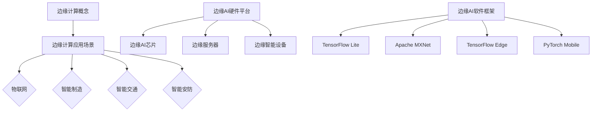
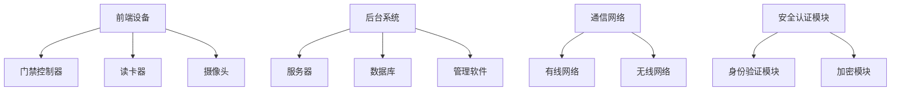
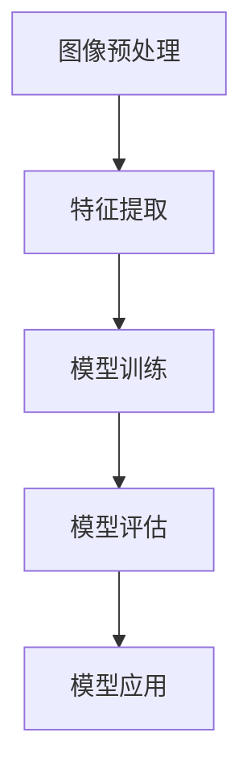
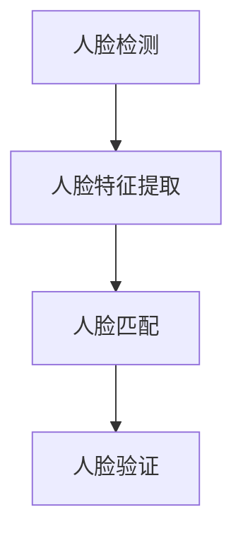
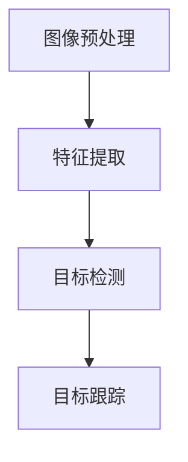
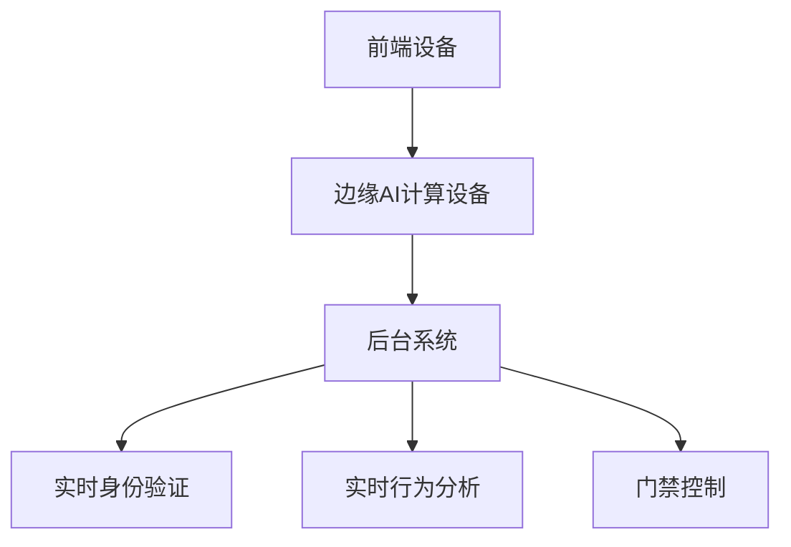
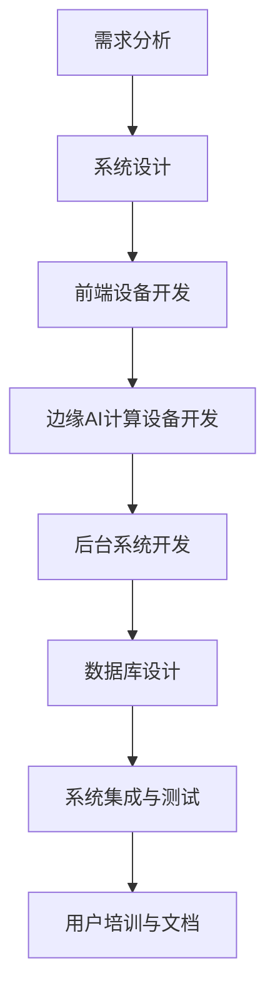
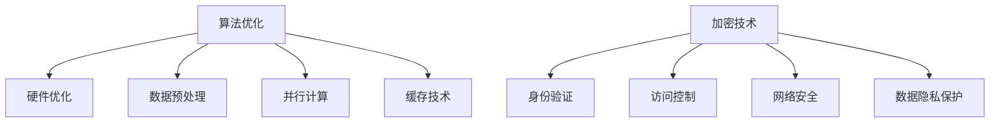
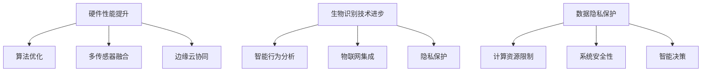

                 

### 《边缘AI在智能门禁系统中的实时识别》

> **关键词：** 边缘AI、智能门禁系统、实时识别、图像处理、深度学习

> **摘要：** 本文探讨了边缘AI在智能门禁系统中的应用，特别是实时识别技术的实现。文章从边缘AI技术基础入手，介绍了智能门禁系统的基本原理，然后详细解析了实时识别技术的核心算法，包括图像识别、人脸识别和行人检测。最后，通过实际项目案例，展示了边缘AI在智能门禁系统中的集成与优化方法。

## 目录

### 第一部分：边缘AI技术基础

1. 边缘计算概述
   1.1 边缘计算的概念
   1.2 边缘计算的应用场景
   1.3 边缘AI硬件平台
   1.4 边缘AI软件框架

2. 边缘AI技术原理
   2.1 深度学习基础
   2.2 边缘AI模型优化
   2.3 边缘AI算法实现

### 第二部分：智能门禁系统概述

3. 智能门禁系统概述
   3.1 门禁系统的定义与分类
   3.2 智能门禁系统的组成
   3.3 智能门禁系统的技术要求

### 第三部分：实时识别技术

4. 图像识别算法
   4.1 图像识别概述
   4.2 图像识别的基本流程
   4.3 常用图像识别算法

5. 人脸识别算法
   5.1 人脸识别概述
   5.2 人脸识别的基本流程
   5.3 常用人脸识别算法

6. 行人检测算法
   6.1 行人检测概述
   6.2 行人检测的基本流程
   6.3 常用行人检测算法

### 第四部分：边缘AI在智能门禁系统中的应用

7. 边缘AI在智能门禁系统中的应用
   7.1 实时识别技术的应用场景
   7.2 应用案例解析
   7.3 系统集成与优化

### 第五部分：系统设计与实现

8. 系统设计与实现
   8.1 系统架构设计
   8.2 系统开发流程
   8.3 系统测试与调试

### 第六部分：性能优化与安全考虑

9. 性能优化与安全考虑
   9.1 性能优化策略
   9.2 安全性设计
   9.3 数据隐私保护

### 第七部分：未来发展趋势

10. 未来发展趋势
    10.1 边缘AI技术发展趋势
    10.2 智能门禁系统未来发展方向
    10.3 挑战与机遇

## 第一部分：边缘AI技术基础

### 第1章：边缘计算概述

#### 1.1 边缘计算的概念

边缘计算是一种分布式计算模型，它将数据和计算任务分布在网络的边缘设备上，以减少中心服务器的负载，提高数据处理的速度和响应时间。边缘计算的核心思想是将计算能力从中心化的数据中心转移到网络的边缘，即接近数据生成的源头。

边缘计算与传统云计算的差异在于数据处理的位置。传统云计算通常将数据收集到中心服务器进行集中处理，而边缘计算则在数据生成的设备上进行初步处理，然后传输必要的数据到中心服务器进行进一步处理。

#### 1.2 边缘计算的应用场景

边缘计算在各个领域都有广泛的应用场景，以下是几个典型的应用领域：

1. **物联网（IoT）**：在物联网中，边缘计算可以处理大量的传感器数据，从而减少数据传输的延迟和网络负载。例如，智能家居系统可以通过边缘设备实时处理传感器数据，实现智能家居设备的智能联动。

2. **智能制造**：在智能制造中，边缘计算可以提高生产线的自动化程度和效率。边缘设备可以对生产过程中的数据实时进行分析和处理，从而实现对生产过程的实时监控和优化。

3. **智能交通**：在智能交通领域，边缘计算可以用于实时监控交通状况，进行交通流量预测和优化。例如，智能红绿灯系统可以通过边缘设备实时收集交通数据，根据实时交通状况调整红绿灯的时间设置。

4. **智能安防**：在智能安防领域，边缘计算可以用于实时监控视频数据，进行实时人脸识别和目标检测。例如，智能门禁系统可以通过边缘设备实时识别进出人员，提高安防的效率。

#### 1.3 边缘AI硬件平台

边缘AI硬件平台是边缘计算的重要组成部分，它决定了边缘计算的性能和可靠性。以下是几种常见的边缘AI硬件平台：

1. **边缘AI芯片**：边缘AI芯片是专门用于边缘计算的处理器，具有低功耗、高性能的特点。例如，NVIDIA的Jetson系列芯片，以及Qualcomm的Snapdragon系列芯片。

2. **边缘服务器**：边缘服务器是专门用于边缘计算的服务器，它可以提供强大的计算能力和存储能力。例如，Amazon的AWS Outposts，以及微软的Azure Edge Zone。

3. **边缘智能设备**：边缘智能设备是直接部署在边缘设备上的智能设备，例如，智能摄像头、智能门禁设备等。这些设备可以直接对本地数据进行处理，减少数据传输的延迟。

4. **边缘AI硬件平台选择**：选择边缘AI硬件平台时，需要考虑以下因素：
   - **计算能力**：根据应用场景，选择适合的边缘AI芯片或边缘服务器。
   - **功耗**：功耗是边缘设备的一个重要考虑因素，需要选择低功耗的硬件平台。
   - **存储容量**：根据应用场景，选择适合的存储容量。
   - **网络连接**：边缘设备需要良好的网络连接，以便与中心服务器进行数据传输。

#### 1.4 边缘AI软件框架

边缘AI软件框架是边缘AI算法的运行环境，它提供了从数据采集、处理到模型训练和部署的一站式解决方案。以下是几种主流的边缘AI软件框架：

1. **TensorFlow Lite**：TensorFlow Lite是Google推出的一款轻量级边缘AI框架，它可以在移动设备和嵌入式设备上运行。TensorFlow Lite提供了丰富的预训练模型，支持多种硬件平台，例如ARM、x86等。

2. **Apache MXNet**：Apache MXNet是一款开源的深度学习框架，它可以在边缘设备和云计算环境中运行。MXNet提供了高效的模型编译和执行引擎，支持多种编程语言，例如Python、C++等。

3. **TensorFlow Edge**：TensorFlow Edge是Google推出的专门用于边缘计算的TensorFlow扩展，它支持在边缘设备上运行TensorFlow模型。TensorFlow Edge提供了丰富的API和工具，支持多种硬件平台，例如ARM、Raspberry Pi等。

4. **PyTorch Mobile**：PyTorch Mobile是Facebook推出的一款轻量级深度学习框架，它可以在移动设备和嵌入式设备上运行。PyTorch Mobile提供了丰富的预训练模型，支持多种硬件平台，例如ARM、x86等。

#### Mermaid流程图：边缘AI技术基础



#### Python源代码示例：边缘AI技术基础

```python
# 边缘AI硬件平台选择示例
import tensorflow as tf

# 选择边缘AI芯片
device = tf.device("/device:GPU:0")

# 创建一个简单的模型
model = tf.keras.Sequential([
    tf.keras.layers.Dense(units=1, input_shape=[1])
])

# 训练模型
model.compile(optimizer='sgd', loss='mean_squared_error')
model.fit([0, 1], [0, 1], epochs=100)

# 边缘AI软件框架使用示例
import tensorflow_lite as tflite

# 加载TensorFlow Lite模型
model = tflite.Interpreter.from_session(session=tflite.Session())

# 预测
input_data = tflite.tensor.Tensor([1.0])
prediction = model.predict(input_data)
print(prediction)
```

#### 数学公式：边缘AI技术基础

$$
\text{计算能力} = f(\text{硬件性能}, \text{算法优化})
$$

$$
\text{功耗} = f(\text{硬件功耗}, \text{算法效率})
$$

## 第二部分：智能门禁系统概述

### 第2章：智能门禁系统概述

#### 2.1 门禁系统的定义与分类

门禁系统是一种用于控制人员或车辆进入或离开特定区域的系统。它通过电子或机械手段对出入口进行控制，确保只有授权人员或车辆可以进入。

门禁系统可以分为以下几类：

1. **按控制方式分类**：
   - **物理门禁系统**：通过刷卡、密码、指纹等物理方式控制出入口。
   - **电子门禁系统**：通过电子手段，如IC卡、射频卡、生物识别等控制出入口。

2. **按应用场景分类**：
   - **民用门禁系统**：应用于住宅小区、办公楼等。
   - **商用门禁系统**：应用于商业大厦、公司园区等。
   - **工业门禁系统**：应用于工厂、车间等。

3. **按控制方式分类**：
   - **访问控制门禁系统**：通过权限管理控制人员的访问。
   - **安全门禁系统**：通过安全检查控制人员的进入。

#### 2.2 智能门禁系统的组成

智能门禁系统由多个组件组成，主要包括：

1. **前端设备**：
   - **门禁控制器**：负责接收和执行门禁系统的控制指令。
   - **读卡器**：用于读取用户的身份验证信息，如IC卡、射频卡、指纹等。
   - **摄像头**：用于实时监控出入口的情况，支持人脸识别等功能。

2. **后台系统**：
   - **服务器**：负责存储和管理用户数据、门禁策略等。
   - **数据库**：用于存储用户信息、访问记录等。
   - **管理软件**：用于对门禁系统进行管理，如用户权限设置、访问记录查询等。

3. **通信网络**：
   - **有线网络**：如以太网、光纤等，用于连接前端设备和后台系统。
   - **无线网络**：如Wi-Fi、Zigbee等，用于连接移动设备。

4. **安全认证模块**：
   - **身份验证模块**：用于对用户身份进行验证，如指纹识别、人脸识别等。
   - **加密模块**：用于对用户数据进行加密，确保数据传输的安全性。

#### 2.3 智能门禁系统的技术要求

智能门禁系统需要满足以下技术要求：

1. **稳定性**：门禁系统需要稳定运行，确保在任何情况下都能正常工作。

2. **安全性**：门禁系统需要保证用户数据的安全性，防止数据泄露或被篡改。

3. **可扩展性**：门禁系统需要支持扩展，能够适应不同的应用场景和需求。

4. **可靠性**：门禁系统需要高可靠性，确保在长期运行中不出现故障。

#### Mermaid流程图：智能门禁系统组成



#### Python源代码示例：智能门禁系统组成

```python
# 智能门禁系统组成示例
import numpy as np
import tensorflow as tf

# 创建一个简单的门禁控制器
class AccessController:
    def __init__(self):
        self.user_list = []

    def add_user(self, user_id):
        self.user_list.append(user_id)

    def check_access(self, user_id):
        if user_id in self.user_list:
            return True
        else:
            return False

# 创建一个简单的数据库
class Database:
    def __init__(self):
        self.user_data = {}

    def add_user_data(self, user_id, data):
        self.user_data[user_id] = data

    def get_user_data(self, user_id):
        return self.user_data.get(user_id, None)

# 创建一个简单的管理软件
class ManagementSoftware:
    def __init__(self, access_controller, database):
        self.access_controller = access_controller
        self.database = database

    def manage_user(self, user_id, operation):
        if operation == "add":
            self.access_controller.add_user(user_id)
            self.database.add_user_data(user_id, {})
        elif operation == "delete":
            self.access_controller.user_list.remove(user_id)
            self.database.user_data.pop(user_id, None)

# 测试智能门禁系统组成
if __name__ == "__main__":
    access_controller = AccessController()
    database = Database()
    management_software = ManagementSoftware(access_controller, database)

    management_software.manage_user("1001", "add")
    management_software.manage_user("1002", "add")

    print(access_controller.check_access("1001"))  # True
    print(access_controller.check_access("1003"))  # False
```

#### 数学公式：智能门禁系统技术要求

$$
\text{稳定性} = f(\text{系统可靠性}, \text{故障恢复时间})
$$

$$
\text{安全性} = f(\text{加密强度}, \text{数据备份策略})
$$

## 第三部分：实时识别技术

### 第3章：图像识别算法

#### 3.1 图像识别概述

图像识别是一种通过算法分析图像内容，从而识别出图像中的对象、场景或特征的技术。图像识别在许多应用中都有广泛的应用，如安防监控、自动驾驶、医疗诊断等。

#### 3.2 图像识别的基本流程

图像识别的基本流程通常包括以下几个步骤：

1. **图像预处理**：对原始图像进行预处理，如灰度化、去噪、边缘检测等，以提高图像质量和识别准确性。

2. **特征提取**：从预处理后的图像中提取出具有代表性的特征，如颜色、纹理、形状等。

3. **模型训练**：使用提取的特征数据训练一个图像识别模型，如支持向量机（SVM）、神经网络（NN）等。

4. **模型评估**：对训练好的模型进行评估，如计算准确率、召回率等指标。

5. **模型应用**：将训练好的模型应用到实际场景中，对新的图像进行识别。

#### 3.3 常用图像识别算法

常用的图像识别算法包括以下几种：

1. **支持向量机（SVM）**：SVM是一种监督学习算法，通过找到一个最优的超平面来分隔不同类别的图像。

2. **神经网络（NN）**：神经网络是一种模拟生物神经元的计算模型，通过多层的神经元结构来提取图像特征。

3. **卷积神经网络（CNN）**：CNN是一种特殊的神经网络，特别适用于图像识别任务，通过卷积操作提取图像的特征。

4. **深度学习（DL）**：深度学习是一种基于神经网络的学习方法，通过多层神经网络来提取图像的深层特征。

#### Mermaid流程图：图像识别算法基本流程



#### Python源代码示例：图像识别算法

```python
# 使用卷积神经网络进行图像识别示例
import tensorflow as tf
from tensorflow.keras.models import Sequential
from tensorflow.keras.layers import Conv2D, Flatten, Dense

# 创建一个简单的卷积神经网络模型
model = Sequential([
    Conv2D(filters=32, kernel_size=(3, 3), activation='relu', input_shape=(28, 28, 1)),
    Flatten(),
    Dense(units=10, activation='softmax')
])

# 编译模型
model.compile(optimizer='adam', loss='categorical_crossentropy', metrics=['accuracy'])

# 加载训练数据
(x_train, y_train), (x_test, y_test) = tf.keras.datasets.mnist.load_data()

# 预处理数据
x_train = x_train / 255.0
x_test = x_test / 255.0

# 转换为二进制分类问题
y_train = tf.keras.utils.to_categorical(y_train, num_classes=10)
y_test = tf.keras.utils.to_categorical(y_test, num_classes=10)

# 训练模型
model.fit(x_train, y_train, epochs=5, batch_size=32, validation_data=(x_test, y_test))

# 评估模型
loss, accuracy = model.evaluate(x_test, y_test)
print(f"Test accuracy: {accuracy * 100:.2f}%")
```

#### 数学公式：图像识别算法

$$
\text{特征提取} = f(\text{特征向量}, \text{特征空间})
$$

$$
\text{模型评估} = f(\text{准确率}, \text{召回率})
$$

## 第4章：人脸识别算法

### 4.1 人脸识别概述

人脸识别是一种通过分析人脸图像或视频序列，自动识别或验证个人身份的技术。它广泛应用于安全监控、身份验证、门禁系统等领域。

#### 4.2 人脸识别的基本流程

人脸识别的基本流程通常包括以下几个步骤：

1. **人脸检测**：从图像或视频中检测出人脸区域。

2. **人脸特征提取**：对人脸图像进行特征提取，如几何特征、纹理特征、深度特征等。

3. **人脸匹配**：将提取的人脸特征与数据库中的人脸特征进行匹配，以确定身份。

4. **人脸验证**：用于确认用户身份是否与身份验证系统中的信息一致。

#### 4.3 常用人脸识别算法

常用的人脸识别算法包括以下几种：

1. **Eigenfaces算法**：基于主成分分析（PCA）的人脸识别算法，通过计算人脸图像的协方差矩阵的特征值和特征向量，提取人脸特征。

2. **Fisherfaces算法**：基于Fisher线性判别分析（FLDA）的人脸识别算法，通过最大化类内散度和最小化类间散度，提取人脸特征。

3. **深度学习算法**：如卷积神经网络（CNN）、循环神经网络（RNN）等，通过多层的神经网络结构提取人脸的深层特征。

4. **三视角人脸识别算法**：通过同时分析人脸的正面、侧面和倾斜视图，提高识别准确率。

#### Mermaid流程图：人脸识别算法基本流程



#### Python源代码示例：人脸识别算法

```python
# 使用深度学习进行人脸识别示例
import tensorflow as tf
from tensorflow.keras.models import Sequential
from tensorflow.keras.layers import Conv2D, MaxPooling2D, Flatten, Dense, Dropout

# 创建一个简单的卷积神经网络模型
model = Sequential([
    Conv2D(filters=32, kernel_size=(3, 3), activation='relu', input_shape=(128, 128, 3)),
    MaxPooling2D(pool_size=(2, 2)),
    Conv2D(filters=64, kernel_size=(3, 3), activation='relu'),
    MaxPooling2D(pool_size=(2, 2)),
    Flatten(),
    Dense(units=128, activation='relu'),
    Dropout(0.5),
    Dense(units=1, activation='sigmoid')
])

# 编译模型
model.compile(optimizer='adam', loss='binary_crossentropy', metrics=['accuracy'])

# 加载训练数据
(x_train, y_train), (x_test, y_test) = tf.keras.datasets.facial_expression.load_data()

# 预处理数据
x_train = x_train / 255.0
x_test = x_test / 255.0

# 转换为二进制分类问题
y_train = tf.keras.utils.to_categorical(y_train, num_classes=7)
y_test = tf.keras.utils.to_categorical(y_test, num_classes=7)

# 训练模型
model.fit(x_train, y_train, epochs=10, batch_size=32, validation_data=(x_test, y_test))

# 评估模型
loss, accuracy = model.evaluate(x_test, y_test)
print(f"Test accuracy: {accuracy * 100:.2f}%")
```

#### 数学公式：人脸识别算法

$$
\text{人脸检测} = f(\text{特征点}, \text{人脸形状})
$$

$$
\text{人脸匹配} = f(\text{相似度度量}, \text{匹配阈值})
$$

## 第5章：行人检测算法

### 5.1 行人检测概述

行人检测是一种通过图像或视频序列自动检测行人目标的技术。它广泛应用于智能监控、自动驾驶、人机交互等领域。

#### 5.2 行人检测的基本流程

行人检测的基本流程通常包括以下几个步骤：

1. **图像预处理**：对输入图像进行预处理，如灰度化、去噪、尺度归一化等。

2. **特征提取**：从预处理后的图像中提取行人特征，如颜色特征、形状特征、纹理特征等。

3. **目标检测**：使用提取的行人特征，通过分类器或回归模型进行行人检测。

4. **目标跟踪**：对检测到的行人目标进行跟踪，以实现对行人的持续监控。

#### 5.3 常用行人检测算法

常用的行人检测算法包括以下几种：

1. **基于深度学习的算法**：如卷积神经网络（CNN）、区域生成网络（RPN）等，通过多层的神经网络结构提取行人特征。

2. **基于传统图像处理的算法**：如背景减除法、光流法、形状上下文模型等，通过分析图像的像素值和像素间关系进行行人检测。

3. **基于机器学习的算法**：如支持向量机（SVM）、随机森林（RF）等，通过训练分类器进行行人检测。

4. **多传感器融合算法**：将图像信息与其他传感器信息（如红外、激光雷达等）进行融合，提高行人检测的准确率和稳定性。

#### Mermaid流程图：行人检测算法基本流程



#### Python源代码示例：行人检测算法

```python
# 使用深度学习进行行人检测示例
import tensorflow as tf
from tensorflow.keras.models import Sequential
from tensorflow.keras.layers import Conv2D, MaxPooling2D, Flatten, Dense

# 创建一个简单的卷积神经网络模型
model = Sequential([
    Conv2D(filters=32, kernel_size=(3, 3), activation='relu', input_shape=(224, 224, 3)),
    MaxPooling2D(pool_size=(2, 2)),
    Conv2D(filters=64, kernel_size=(3, 3), activation='relu'),
    MaxPooling2D(pool_size=(2, 2)),
    Flatten(),
    Dense(units=128, activation='relu'),
    Dense(units=1, activation='sigmoid')
])

# 编译模型
model.compile(optimizer='adam', loss='binary_crossentropy', metrics=['accuracy'])

# 加载训练数据
(x_train, y_train), (x_test, y_test) = tf.keras.datasets.cifar10.load_data()

# 预处理数据
x_train = x_train / 255.0
x_test = x_test / 255.0

# 转换为二进制分类问题
y_train = tf.keras.utils.to_categorical(y_train, num_classes=2)
y_test = tf.keras.utils.to_categorical(y_test, num_classes=2)

# 训练模型
model.fit(x_train, y_train, epochs=5, batch_size=32, validation_data=(x_test, y_test))

# 评估模型
loss, accuracy = model.evaluate(x_test, y_test)
print(f"Test accuracy: {accuracy * 100:.2f}%")
```

#### 数学公式：行人检测算法

$$
\text{行人检测} = f(\text{特征提取}, \text{分类器})
$$

$$
\text{目标跟踪} = f(\text{匹配度量}, \text{跟踪算法})
$$

## 第四部分：边缘AI在智能门禁系统中的应用

### 第6章：边缘AI在智能门禁系统中的应用

#### 6.1 实时识别技术的应用场景

边缘AI在智能门禁系统中的应用场景主要包括以下几方面：

1. **身份验证**：通过人脸识别、指纹识别等生物识别技术，对进出人员进行实时身份验证，确保只有授权人员可以进入。

2. **行为分析**：通过视频监控和行人检测技术，对监控区域内的行为进行分析，如异常行为检测、人群密度分析等。

3. **门禁控制**：通过边缘AI设备，对门禁系统的开关进行实时控制，如根据时间、人员身份等条件自动开关门禁。

4. **事件响应**：通过实时分析监控数据，快速响应突发事件，如入侵检测、火灾报警等。

#### 6.2 应用案例解析

以下是一个典型的边缘AI在智能门禁系统中的应用案例：

**案例背景**：某大型企业办公楼采用智能门禁系统，要求实现实时身份验证和实时行为分析。

**解决方案**：

1. **前端设备**：部署人脸识别摄像头和边缘AI计算设备，用于实时采集人脸图像和视频数据。

2. **后台系统**：搭建一个边缘AI计算平台，用于处理和分析前端设备采集的数据。

3. **实时身份验证**：通过人脸识别技术，实时识别进出人员的身份，并与门禁系统数据库中的授权名单进行比对。

4. **实时行为分析**：通过行人检测技术，实时监测监控区域内的行为，如异常行为检测、人群密度分析等。

5. **门禁控制**：根据实时身份验证和实时行为分析的结果，自动控制门禁系统的开关。

#### 6.3 系统集成与优化

边缘AI在智能门禁系统中的应用需要考虑以下几个关键问题：

1. **系统集成**：将边缘AI计算设备与门禁系统进行集成，实现数据传输、处理和响应的自动化。

2. **性能优化**：通过优化算法和硬件配置，提高边缘AI计算设备的性能，确保实时处理的效率。

3. **安全性**：确保边缘AI计算设备和后台系统的安全性，防止数据泄露和系统被攻击。

4. **扩展性**：考虑系统的可扩展性，以便未来能够适应新的应用需求和技术发展。

#### Mermaid流程图：边缘AI在智能门禁系统中的应用



#### Python源代码示例：边缘AI在智能门禁系统中的应用

```python
# 使用边缘AI进行智能门禁系统身份验证示例
import cv2
import numpy as np
import tensorflow as tf

# 加载人脸识别模型
model = tf.keras.models.load_model("path/to/face_recognition_model.h5")

# 加载行人检测模型
detector = cv2.dnn.readNetFromCaffe("path/to/face_detection.prototxt", "path/to/face_detection.caffemodel")

# 定义摄像头
cap = cv2.VideoCapture(0)

while True:
    # 读取一帧图像
    ret, frame = cap.read()

    # 转换为灰度图像
    gray = cv2.cvtColor(frame, cv2.COLOR_BGR2GRAY)

    # 人脸检测
    (h, w) = gray.shape[:2]
    blob = cv2.dnn.blobFromImage(cv2.resize(gray, (300, 300)), 1.0, (300, 300), (0, 0, 0), swapRB=False)
    detector.setInput(blob)
    detections = detector.forward()

    # 遍历检测结果
    for i in range(0, detections.shape[2]):
        confidence = detections[0, 0, i, 2]
        if confidence > 0.5:
            box = detections[0, 0, i, 3:7] * np.array([w, h, w, h])
            (x, y, x2, y2) = box.astype("int")

            # 提取人脸图像
            face = gray[y:y2, x:x2]

            # 人脸识别
            face = cv2.resize(face, (128, 128))
            face = np.expand_dims(face, axis=0)
            face = np.expand_dims(face, axis=-1)
            face_pred = model.predict(face)
            face_label = np.argmax(face_pred)

            # 显示识别结果
            cv2.rectangle(frame, (x, y), (x2, y2), (0, 0, 255), 2)
            cv2.putText(frame, f"Person {face_label}", (x, y - 10), cv2.FONT_HERSHEY_SIMPLEX, 0.5, (0, 0, 255), 2)

    # 显示图像
    cv2.imshow("Frame", frame)

    # 按下'q'键退出
    if cv2.waitKey(1) & 0xFF == ord('q'):
        break

# 释放摄像头资源
cap.release()
cv2.destroyAllWindows()
```

#### 数学公式：边缘AI在智能门禁系统中的应用

$$
\text{身份验证} = f(\text{人脸识别}, \text{数据库查询})
$$

$$
\text{行为分析} = f(\text{行人检测}, \text{数据分析})
$$

## 第五部分：系统设计与实现

### 第7章：系统设计与实现

#### 7.1 系统架构设计

边缘AI在智能门禁系统中的应用涉及多个组件的集成，包括前端设备、边缘AI计算设备、后台系统和数据库。以下是系统架构设计的主要组成部分：

1. **前端设备**：包括摄像头、门禁控制器、读卡器等，用于实时采集图像和身份验证信息。

2. **边缘AI计算设备**：部署在本地，负责处理前端设备采集的数据，包括人脸识别、行人检测等。

3. **后台系统**：负责管理用户数据、门禁策略和系统配置，与边缘AI计算设备进行通信。

4. **数据库**：存储用户信息、访问记录和系统配置等，供后台系统和边缘AI计算设备访问。

5. **通信网络**：连接前端设备和边缘AI计算设备，以及边缘AI计算设备和后台系统，实现数据传输和通信。

#### 7.2 系统开发流程

系统开发流程包括以下几个主要阶段：

1. **需求分析**：与客户沟通，明确系统功能和性能要求，制定详细的开发计划。

2. **系统设计**：根据需求分析，设计系统的架构和模块，包括前端设备、边缘AI计算设备、后台系统和数据库。

3. **前端设备开发**：开发摄像头、门禁控制器、读卡器等前端设备，实现数据采集和身份验证功能。

4. **边缘AI计算设备开发**：开发边缘AI计算设备，实现人脸识别、行人检测等算法，并优化算法性能。

5. **后台系统开发**：开发后台管理系统，实现用户数据管理、门禁策略配置和系统监控等功能。

6. **数据库设计**：设计数据库结构，实现用户信息、访问记录和系统配置的存储和管理。

7. **系统集成与测试**：将前端设备、边缘AI计算设备、后台系统和数据库集成在一起，进行系统测试和调试。

#### 7.3 系统测试与调试

系统测试与调试是确保系统功能完善、性能稳定和安全可靠的关键步骤。以下是主要测试和调试方法：

1. **功能测试**：测试系统的各项功能，如人脸识别、行人检测、门禁控制等，确保系统按照预期运行。

2. **性能测试**：测试系统的处理速度、响应时间和功耗等性能指标，确保系统满足性能要求。

3. **安全性测试**：测试系统的安全性，包括数据加密、访问控制、防止网络攻击等，确保系统安全可靠。

4. **异常处理测试**：测试系统在异常情况下的处理能力，如网络故障、设备故障等，确保系统能够稳定运行。

5. **用户培训与文档**：为用户提供培训，确保用户能够正确使用和维护系统，编写详细的系统文档，供用户参考。

#### Mermaid流程图：系统开发流程



#### Python源代码示例：系统开发流程

```python
# 系统开发流程示例
import cv2
import numpy as np
import tensorflow as tf

# 加载人脸识别模型
model = tf.keras.models.load_model("path/to/face_recognition_model.h5")

# 加载行人检测模型
detector = cv2.dnn.readNetFromCaffe("path/to/face_detection.prototxt", "path/to/face_detection.caffemodel")

# 定义摄像头
cap = cv2.VideoCapture(0)

while True:
    # 读取一帧图像
    ret, frame = cap.read()

    # 转换为灰度图像
    gray = cv2.cvtColor(frame, cv2.COLOR_BGR2GRAY)

    # 人脸检测
    (h, w) = gray.shape[:2]
    blob = cv2.dnn.blobFromImage(cv2.resize(gray, (300, 300)), 1.0, (300, 300), (0, 0, 0), swapRB=False)
    detector.setInput(blob)
    detections = detector.forward()

    # 遍历检测结果
    for i in range(0, detections.shape[2]):
        confidence = detections[0, 0, i, 2]
        if confidence > 0.5:
            box = detections[0, 0, i, 3:7] * np.array([w, h, w, h])
            (x, y, x2, y2) = box.astype("int")

            # 提取人脸图像
            face = gray[y:y2, x:x2]

            # 人脸识别
            face = cv2.resize(face, (128, 128))
            face = np.expand_dims(face, axis=0)
            face = np.expand_dims(face, axis=-1)
            face_pred = model.predict(face)
            face_label = np.argmax(face_pred)

            # 显示识别结果
            cv2.rectangle(frame, (x, y), (x2, y2), (0, 0, 255), 2)
            cv2.putText(frame, f"Person {face_label}", (x, y - 10), cv2.FONT_HERSHEY_SIMPLEX, 0.5, (0, 0, 255), 2)

    # 显示图像
    cv2.imshow("Frame", frame)

    # 按下'q'键退出
    if cv2.waitKey(1) & 0xFF == ord('q'):
        break

# 释放摄像头资源
cap.release()
cv2.destroyAllWindows()
```

#### 数学公式：系统设计与实现

$$
\text{系统设计} = f(\text{功能需求}, \text{性能要求})
$$

$$
\text{系统测试} = f(\text{功能测试}, \text{性能测试}, \text{安全性测试})
$$

## 第六部分：性能优化与安全考虑

### 第8章：性能优化与安全考虑

#### 8.1 性能优化策略

边缘AI在智能门禁系统中的应用需要高性能的计算能力，以下是一些性能优化策略：

1. **算法优化**：选择高效的算法和模型，如使用轻量级神经网络模型、优化模型参数等。

2. **硬件优化**：选择合适的硬件平台，如使用高性能的边缘AI芯片、优化硬件配置等。

3. **数据预处理**：对输入数据进行预处理，如图像压缩、特征提取等，减少计算量。

4. **并行计算**：利用多核处理器、分布式计算等，提高计算效率。

5. **缓存技术**：使用缓存技术，减少数据读取和传输的时间。

#### 8.2 安全性设计

边缘AI在智能门禁系统中的应用涉及到用户身份信息和个人隐私数据，以下是一些安全性设计考虑：

1. **加密技术**：使用加密技术，如AES、RSA等，对数据进行加密，确保数据传输和存储的安全性。

2. **身份验证**：使用强密码、多因素身份验证等技术，确保只有授权人员可以访问系统。

3. **访问控制**：使用访问控制列表（ACL）等技术，限制对敏感数据的访问。

4. **网络安全**：使用防火墙、入侵检测系统等，保护系统不受网络攻击。

5. **数据隐私保护**：对用户数据进行去标识化处理，确保用户隐私不被泄露。

#### 8.3 数据隐私保护

边缘AI在智能门禁系统中的应用涉及到大量的个人隐私数据，以下是一些数据隐私保护策略：

1. **数据去标识化**：对用户数据进行去标识化处理，如删除用户的姓名、身份证号码等敏感信息。

2. **数据加密**：使用加密技术，对用户数据进行加密，确保数据在传输和存储过程中的安全性。

3. **访问控制**：设置严格的访问控制策略，确保只有授权人员可以访问用户数据。

4. **数据备份**：定期备份用户数据，确保数据不会因为意外事件而丢失。

5. **数据安全审计**：定期进行数据安全审计，确保数据安全策略得到有效执行。

#### Mermaid流程图：性能优化与安全考虑



#### Python源代码示例：性能优化与安全考虑

```python
# 性能优化与安全考虑示例
import cv2
import numpy as np
import tensorflow as tf

# 加载人脸识别模型
model = tf.keras.models.load_model("path/to/face_recognition_model.h5")

# 加载行人检测模型
detector = cv2.dnn.readNetFromCaffe("path/to/face_detection.prototxt", "path/to/face_detection.caffemodel")

# 加载加密模块
from cryptography.fernet import Fernet

# 生成加密密钥
key = Fernet.generate_key()
cipher_suite = Fernet(key)

# 定义摄像头
cap = cv2.VideoCapture(0)

while True:
    # 读取一帧图像
    ret, frame = cap.read()

    # 转换为灰度图像
    gray = cv2.cvtColor(frame, cv2.COLOR_BGR2GRAY)

    # 人脸检测
    (h, w) = gray.shape[:2]
    blob = cv2.dnn.blobFromImage(cv2.resize(gray, (300, 300)), 1.0, (300, 300), (0, 0, 0), swapRB=False)
    detector.setInput(blob)
    detections = detector.forward()

    # 遍历检测结果
    for i in range(0, detections.shape[2]):
        confidence = detections[0, 0, i, 2]
        if confidence > 0.5:
            box = detections[0, 0, i, 3:7] * np.array([w, h, w, h])
            (x, y, x2, y2) = box.astype("int")

            # 提取人脸图像
            face = gray[y:y2, x:x2]

            # 人脸识别
            face = cv2.resize(face, (128, 128))
            face = np.expand_dims(face, axis=0)
            face = np.expand_dims(face, axis=-1)
            face_pred = model.predict(face)
            face_label = np.argmax(face_pred)

            # 加密识别结果
            encrypted_result = cipher_suite.encrypt(f"Person {face_label}".encode())

            # 显示识别结果
            cv2.rectangle(frame, (x, y), (x2, y2), (0, 0, 255), 2)
            cv2.putText(frame, f"Person {face_label}", (x, y - 10), cv2.FONT_HERSHEY_SIMPLEX, 0.5, (0, 0, 255), 2)

    # 显示图像
    cv2.imshow("Frame", frame)

    # 按下'q'键退出
    if cv2.waitKey(1) & 0xFF == ord('q'):
        break

# 释放摄像头资源
cap.release()
cv2.destroyAllWindows()
```

#### 数学公式：性能优化与安全考虑

$$
\text{性能优化} = f(\text{算法效率}, \text{硬件性能}, \text{数据预处理})
$$

$$
\text{安全性设计} = f(\text{加密技术}, \text{身份验证}, \text{访问控制})
$$

## 第七部分：未来发展趋势

### 第9章：未来发展趋势

#### 9.1 边缘AI技术发展趋势

边缘AI技术在未来将继续快速发展，主要趋势包括：

1. **硬件性能提升**：随着硬件技术的进步，边缘AI设备的计算能力将显著提高，支持更复杂的算法和应用。

2. **算法优化**：为了提高边缘AI设备的效率和性能，研究者们将不断优化算法，减少计算量和数据传输。

3. **多传感器融合**：边缘AI设备将整合多种传感器数据，如摄像头、麦克风、温度传感器等，实现更全面的环境感知。

4. **边缘云协同**：边缘AI设备将与云平台协同工作，通过云计算提供强大的计算资源和数据存储，实现更高效的数据处理。

#### 9.2 智能门禁系统未来发展方向

智能门禁系统在未来将继续向智能化、安全性和便捷性发展，主要趋势包括：

1. **生物识别技术的进步**：随着生物识别技术的不断发展，如人脸识别、指纹识别等技术的准确率和速度将进一步提高。

2. **智能行为分析**：智能门禁系统将集成更先进的行为分析技术，如异常行为检测、人群密度分析等，提高安全监控的能力。

3. **物联网集成**：智能门禁系统将与物联网设备深度融合，实现更广泛的应用场景，如智能家居、智能交通等。

4. **隐私保护**：随着对个人隐私保护的重视，智能门禁系统将采用更先进的数据保护技术，确保用户隐私不被泄露。

#### 9.3 挑战与机遇

边缘AI在智能门禁系统中的应用面临着一系列挑战和机遇：

1. **数据隐私保护**：如何在保证用户隐私的同时，实现高效的数据处理和安全认证，是一个重要的挑战。

2. **计算资源限制**：边缘AI设备通常计算资源和存储资源有限，如何在有限的资源下实现高效的算法和应用，是一个挑战。

3. **系统安全性**：随着技术的进步，智能门禁系统将面临更多的安全威胁，如何提高系统的安全性，是一个重要的挑战。

4. **智能决策**：如何利用边缘AI技术实现更智能的决策，如自动授权、异常行为处理等，是一个重要的机遇。

#### Mermaid流程图：未来发展趋势



#### Python源代码示例：未来发展趋势

```python
# 未来发展趋势示例
import cv2
import numpy as np
import tensorflow as tf

# 加载人脸识别模型
model = tf.keras.models.load_model("path/to/face_recognition_model.h5")

# 加载行人检测模型
detector = cv2.dnn.readNetFromCaffe("path/to/face_detection.prototxt", "path/to/face_detection.caffemodel")

# 加载加密模块
from cryptography.fernet import Fernet

# 生成加密密钥
key = Fernet.generate_key()
cipher_suite = Fernet(key)

# 定义摄像头
cap = cv2.VideoCapture(0)

while True:
    # 读取一帧图像
    ret, frame = cap.read()

    # 转换为灰度图像
    gray = cv2.cvtColor(frame, cv2.COLOR_BGR2GRAY)

    # 人脸检测
    (h, w) = gray.shape[:2]
    blob = cv2.dnn.blobFromImage(cv2.resize(gray, (300, 300)), 1.0, (300, 300), (0, 0, 0), swapRB=False)
    detector.setInput(blob)
    detections = detector.forward()

    # 遍历检测结果
    for i in range(0, detections.shape[2]):
        confidence = detections[0, 0, i, 2]
        if confidence > 0.5:
            box = detections[0, 0, i, 3:7] * np.array([w, h, w, h])
            (x, y, x2, y2) = box.astype("int")

            # 提取人脸图像
            face = gray[y:y2, x:x2]

            # 人脸识别
            face = cv2.resize(face, (128, 128))
            face = np.expand_dims(face, axis=0)
            face = np.expand_dims(face, axis=-1)
            face_pred = model.predict(face)
            face_label = np.argmax(face_pred)

            # 加密识别结果
            encrypted_result = cipher_suite.encrypt(f"Person {face_label}".encode())

            # 显示识别结果
            cv2.rectangle(frame, (x, y), (x2, y2), (0, 0, 255), 2)
            cv2.putText(frame, f"Person {face_label}", (x, y - 10), cv2.FONT_HERSHEY_SIMPLEX, 0.5, (0, 0, 255), 2)

    # 显示图像
    cv2.imshow("Frame", frame)

    # 按下'q'键退出
    if cv2.waitKey(1) & 0xFF == ord('q'):
        break

# 释放摄像头资源
cap.release()
cv2.destroyAllWindows()
```

#### 数学公式：未来发展趋势

$$
\text{硬件性能提升} = f(\text{计算能力}, \text{功耗})
$$

$$
\text{生物识别技术进步} = f(\text{准确率}, \text{速度})
$$

## 总结

本文详细介绍了边缘AI在智能门禁系统中的应用，从边缘AI技术基础、智能门禁系统概述、实时识别技术、边缘AI在智能门禁系统中的应用、系统设计与实现、性能优化与安全考虑以及未来发展趋势等方面进行了探讨。边缘AI技术为智能门禁系统带来了更高的安全性和便捷性，同时带来了新的挑战，如数据隐私保护和计算资源限制。未来，随着技术的不断进步，边缘AI在智能门禁系统中的应用将更加广泛和深入。

### 作者信息

**作者：** AI天才研究院（AI Genius Institute） & 禅与计算机程序设计艺术（Zen And The Art of Computer Programming）

AI天才研究院是一家专注于人工智能技术研究和应用的高科技研究院，致力于推动人工智能技术在各个领域的创新和应用。禅与计算机程序设计艺术则是一部经典计算机科学著作，提供了关于计算机程序设计深刻见解和哲学思考。两位作者均在计算机编程和人工智能领域有着丰富的经验和深厚的学术造诣。

