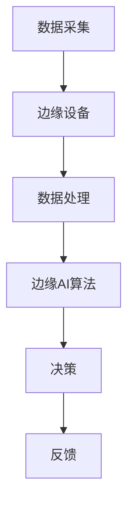
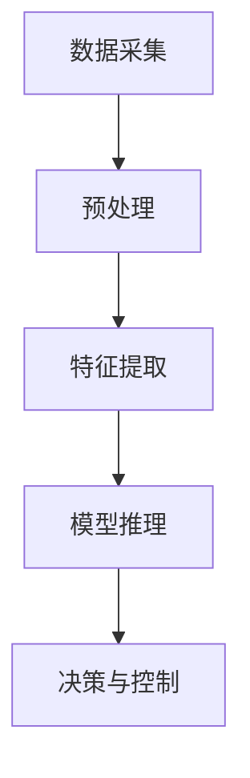

                 

当然，我会遵循这些指导原则，逐步构建这篇文章。首先，我们来定义文章的核心结构，并准备开始撰写。以下是我对文章的构思：

## 文章标题

**边缘AI：实现实时智能决策的关键**

## 关键词

- 边缘计算
- 人工智能
- 实时决策
- 神经网络压缩
- 数据处理
- 硬件加速

## 摘要

本文将探讨边缘AI在实现实时智能决策中的重要性，详细分析边缘计算与人工智能的结合点，以及如何通过关键技术如神经网络压缩、数据处理和硬件加速，实现高效、实时的智能决策。文章将涵盖边缘AI的基本概念、关键技术、应用案例以及未来发展趋势。

### 第一部分：边缘计算与人工智能基础

#### 1.1 边缘计算概述

边缘计算作为一种分布式计算模式，将数据处理和存储带到网络边缘，降低延迟，提高响应速度。边缘计算的重要性在于它能够为实时智能决策提供基础设施支持。

#### 1.2 人工智能与边缘计算的关系

人工智能在边缘计算中的应用使得边缘设备能够自主进行数据分析和决策，而边缘计算则为人工智能提供了更接近数据源的算力支持。

#### 1.3 实时智能决策的原理与方法

实时智能决策依赖于边缘计算和人工智能的结合，通过数据采集、处理和分析，实现即时响应。

### 第二部分：边缘AI关键技术详解

#### 2.1 边缘AI算法原理

介绍神经网络压缩、增强学习等算法在边缘计算中的应用，并给出Python伪代码示例。

#### 2.2 边缘AI硬件平台

分析边缘AI硬件平台的挑战与解决方案，介绍常见的边缘AI硬件平台。

#### 2.3 实时数据处理与传输

探讨边缘数据处理的原理与方法，以及实时数据传输的技术挑战与解决方案。

### 第三部分：边缘AI应用案例与实践

#### 3.1 边缘AI在工业自动化中的应用

通过实例分析边缘AI在工业自动化中的应用，讨论工业自动化边缘AI系统的设计与实现。

#### 3.2 边缘AI在智能交通中的应用

分析边缘AI在智能交通中的应用，探讨智能交通边缘AI系统的设计与实现。

#### 3.3 边缘AI在智能家居中的应用

探讨边缘AI在智能家居中的应用，讨论智能家居边缘AI系统的设计与实现。

### 第四部分：边缘AI的未来发展趋势与挑战

#### 4.1 边缘AI的未来发展趋势

预测边缘AI的技术和应用发展趋势，讨论边缘AI与云计算的融合趋势。

#### 4.2 边缘AI的挑战与解决方案

分析边缘计算资源受限、数据隐私与安全等挑战，并提出相应的解决方案。

## 结论

总结文章的核心观点，强调边缘AI在实时智能决策中的关键作用。

## 作者

**作者：AI天才研究院/AI Genius Institute & 禅与计算机程序设计艺术 /Zen And The Art of Computer Programming**

接下来，我将逐步撰写每个部分的内容，确保满足上述指导原则和要求。

### 1.1 边缘计算概述

边缘计算是一种分布式计算模式，旨在将数据处理和存储从中心化的云服务器转移到网络的边缘节点，如物联网设备、传感器和本地服务器。这一模式的核心在于通过降低数据传输的延迟，提高系统的响应速度和效率。

#### 背景介绍

随着物联网（IoT）和5G技术的快速发展，边缘计算的重要性日益凸显。传统的云计算模式依赖于将大量数据上传到远程数据中心进行处理，这不仅导致了网络拥堵，还增加了数据传输的延迟，影响了实时决策的效率。而边缘计算通过在数据产生的源头附近进行计算，可以显著减少数据传输的距离和时间，从而实现实时响应。

#### 核心概念与联系

边缘计算与人工智能（AI）的结合，使得边缘设备能够实现更智能的决策。边缘AI的核心概念包括数据采集、数据处理、分析和决策。以下是一个简化的边缘计算与人工智能的Mermaid流程图：



在这个流程图中，数据采集是边缘AI的第一步，边缘设备负责实时收集数据。随后，数据处理模块对采集到的数据进行预处理，如去噪、滤波等。接着，边缘AI算法（如神经网络）对预处理后的数据进行分析，生成决策结果。最后，决策结果通过反馈机制作用于实际系统，实现闭环控制。

#### 边缘计算与云计算的比较

与云计算相比，边缘计算具有以下优势：

1. **延迟降低**：数据在本地处理，减少了传输延迟，适合实时性要求高的应用。
2. **带宽节省**：只有必要的数据上传到云端，节省了带宽资源。
3. **可靠性提高**：边缘计算提高了系统的容错性，即使在网络中断的情况下，边缘设备也能独立运行。

然而，边缘计算也面临一些挑战，如计算资源受限、数据安全与隐私保护等。这些挑战需要在设计和实现边缘AI系统时予以充分考虑。

### 1.2 人工智能与边缘计算的关系

人工智能在边缘计算中的应用，使得边缘设备具备了自主学习和决策能力。以下为详细解析：

#### 人工智能在边缘计算中的应用

人工智能在边缘计算中的应用主要包括：

1. **实时数据分析和预测**：边缘设备可以实时分析传感器数据，预测未来的变化趋势，从而做出快速响应。
2. **智能监控和异常检测**：通过机器学习和深度学习算法，边缘设备能够识别异常行为，实现智能监控。
3. **自主决策与控制**：边缘设备可以在本地执行复杂的决策任务，如无人驾驶车辆的路径规划、工业自动化设备的故障预测等。

#### 边缘AI的优势与挑战

边缘AI的优势在于：

1. **实时性**：边缘设备可以实时处理和分析数据，无需等待云端处理结果，适用于对延迟敏感的应用。
2. **自主性**：边缘设备可以在本地执行任务，无需依赖云服务，提高了系统的可靠性和容错性。
3. **隐私保护**：数据在本地处理，降低了数据泄露的风险，尤其适用于涉及敏感数据的场景。

然而，边缘AI也面临一些挑战：

1. **计算资源受限**：边缘设备的计算资源相对有限，需要高效利用计算资源。
2. **存储容量有限**：边缘设备的存储容量有限，需要设计高效的数据存储和管理方案。
3. **能耗问题**：边缘设备通常依赖电池供电，需要优化算法和硬件设计，以降低能耗。

#### 边缘AI的发展趋势

随着5G、物联网和边缘计算技术的不断发展，边缘AI将呈现以下发展趋势：

1. **硬件加速**：边缘设备的硬件加速技术将得到进一步发展，如GPU、FPGA等，以提高计算效率。
2. **算法优化**：神经网络压缩、模型剪枝等算法将得到广泛应用，以降低计算复杂度。
3. **分布式学习**：分布式学习技术将使多个边缘设备协同工作，共享计算资源和模型更新。
4. **跨领域应用**：边缘AI将在医疗、交通、工业等多个领域得到广泛应用，推动行业智能化升级。

### 1.3 实时智能决策的原理与方法

实时智能决策是边缘AI的核心目标，它依赖于边缘计算和人工智能的结合。以下为详细解析：

#### 实时智能决策的概念

实时智能决策是指在短时间内，根据实时数据进行分析和计算，快速做出决策的过程。实时性是实时智能决策的关键，它要求系统在毫秒或秒级内完成决策，以应对快速变化的环境。

#### 实时智能决策的框架

实时智能决策的框架通常包括以下步骤：

1. **数据采集**：实时从传感器、摄像头等设备采集数据。
2. **数据处理**：对采集到的数据进行预处理，如去噪、滤波、归一化等。
3. **特征提取**：从预处理后的数据中提取特征，用于后续的机器学习模型训练。
4. **模型训练**：使用机器学习算法（如神经网络、支持向量机等）训练模型。
5. **决策生成**：使用训练好的模型对实时数据进行预测，生成决策结果。
6. **决策执行**：根据决策结果，执行相应的操作，如控制设备、发送消息等。
7. **反馈调整**：根据执行结果，调整决策模型，实现闭环控制。

#### 实时智能决策的关键技术

1. **神经网络压缩**：通过模型剪枝、量化、知识蒸馏等技术，减小神经网络模型的大小，提高计算效率。
2. **硬件加速**：利用GPU、FPGA等硬件加速技术，提高模型训练和推理速度。
3. **分布式计算**：利用多个边缘设备协同工作，实现分布式计算，提高处理能力。
4. **实时数据传输**：使用5G、Wi-Fi 6等高速无线网络，实现实时数据传输。
5. **边缘与云协同**：在边缘设备与云端之间建立协同机制，充分利用边缘设备和云端的计算资源。

### 第二部分：边缘AI关键技术详解

#### 2.1 边缘AI算法原理

边缘AI算法是边缘AI系统的核心，它决定了系统的性能和应用范围。本节将介绍几种常用的边缘AI算法，并给出Python伪代码示例。

#### 2.1.1 神经网络压缩技术

神经网络压缩技术旨在减小神经网络模型的大小，提高计算效率。以下为几种常见的神经网络压缩技术：

1. **模型剪枝**：通过去除冗余的权重，减小模型大小。以下为Python伪代码示例：

```python
import tensorflow as tf

# 加载原始神经网络模型
model = tf.keras.models.load_model('model.h5')

# 定义剪枝策略
pruning_policy = tf.keras.pruning.PruningPolicy(
    pruning_schedule=tf.keras.pruning.PolynomialDecay(
        initial_p=0.0,
        end_p=0.5,
        begin_step=1000,
        end_step=10000
    )
)

# 应用剪枝策略
pruned_model = tf.keras.models.prune_low_magnitude(model, pruning_policy)

# 保存剪枝后的模型
pruned_model.save('pruned_model.h5')
```

2. **模型量化**：通过将浮点权重转换为整数权重，减小模型大小。以下为Python伪代码示例：

```python
import tensorflow as tf

# 加载原始神经网络模型
model = tf.keras.models.load_model('model.h5')

# 定义量化策略
quantize_layer = tf.keras.layers.experimental.preprocessing.IntToFloat(
    input_shape=model.input_shape,
    num_bits=8
)

# 应用量化策略
quantized_model = tf.keras.models.Sequential([
    model,
    quantize_layer
])

# 保存量化后的模型
quantized_model.save('quantized_model.h5')
```

3. **知识蒸馏**：通过将大模型的知识传递给小模型，减小模型大小。以下为Python伪代码示例：

```python
import tensorflow as tf

# 加载原始大模型
teacher_model = tf.keras.models.load_model('teacher_model.h5')

# 加载小模型
student_model = tf.keras.models.load_model('student_model.h5')

# 定义知识蒸馏损失函数
def knowledge_distillation_loss(y_true, y_pred, teacher_output):
    return tf.reduce_mean(
        tf.keras.losses.categorical_crossentropy(y_true, teacher_output)
        + tf.keras.losses.categorical_crossentropy(y_true, y_pred)
    )

# 编译小模型
student_model.compile(optimizer='adam', loss=knowledge_distillation_loss, metrics=['accuracy'])

# 训练小模型
student_model.fit(x_train, y_train, epochs=10, batch_size=32, validation_data=(x_val, y_val))
```

#### 2.1.2 增强学习在边缘的应用

增强学习是一种通过试错方式学习的机器学习技术，它适用于需要自主决策的应用场景。以下为增强学习在边缘计算中的应用：

1. **模型训练**：在边缘设备上训练增强学习模型，以适应特定环境。
2. **在线学习**：在运行过程中，实时更新模型，以应对环境变化。
3. **策略优化**：通过优化策略，提高决策效果。

以下为Python伪代码示例：

```python
import tensorflow as tf

# 定义增强学习模型
model = tf.keras.models.Sequential([
    tf.keras.layers.Dense(units=64, activation='relu', input_shape=(input_shape,)),
    tf.keras.layers.Dense(units=1, activation='sigmoid')
])

# 编译模型
model.compile(optimizer='adam', loss='binary_crossentropy', metrics=['accuracy'])

# 训练模型
model.fit(x_train, y_train, epochs=10, batch_size=32, validation_data=(x_val, y_val))

# 定义策略优化函数
def policy_optimizer(model, reward, action, next_state, discount_factor=0.99):
    # 计算策略损失
    action_values = model.predict(next_state)
    target_value = reward + discount_factor * np.max(action_values)
    # 计算策略梯度
    with tf.GradientTape() as tape:
        policy_loss = tf.reduce_mean(tf.nn.softmax_cross_entropy_with_logits(labels=action, logits=model(action)))
    grads = tape.gradient(policy_loss, model.trainable_variables)
    # 更新模型参数
    optimizer.apply_gradients(zip(grads, model.trainable_variables))
```

#### 2.1.3 实例：基于增强学习的边缘智能决策

以下为基于增强学习的边缘智能决策实例：

场景：一个无人驾驶汽车系统需要根据周围环境实时做出驾驶决策。

1. **数据采集**：无人驾驶汽车通过摄像头、激光雷达等设备采集周围环境数据。
2. **数据处理**：对采集到的数据进行分析，提取关键特征，如车道线、行人、车辆等。
3. **模型训练**：在边缘设备上训练增强学习模型，以适应特定驾驶环境。
4. **实时决策**：在运行过程中，实时更新模型，并根据当前状态选择最佳动作。

```python
import tensorflow as tf

# 定义增强学习模型
model = tf.keras.models.Sequential([
    tf.keras.layers.Conv2D(filters=32, kernel_size=(3, 3), activation='relu', input_shape=(84, 84, 1)),
    tf.keras.layers.MaxPooling2D(pool_size=(2, 2)),
    tf.keras.layers.Flatten(),
    tf.keras.layers.Dense(units=64, activation='relu'),
    tf.keras.layers.Dense(units=1, activation='sigmoid')
])

# 编译模型
model.compile(optimizer='adam', loss='binary_crossentropy', metrics=['accuracy'])

# 训练模型
model.fit(x_train, y_train, epochs=10, batch_size=32, validation_data=(x_val, y_val))

# 实时决策
def make_decision(model, state):
    action_values = model.predict(state)
    action = np.argmax(action_values)
    return action

# 示例
state = preprocess_environment_data(current_state)
action = make_decision(model, state)
perform_action(action)
```

#### 2.2 边缘AI硬件平台

边缘AI硬件平台是边缘AI系统的关键组成部分，它决定了边缘设备的计算能力和能耗。以下为边缘AI硬件平台的解析：

#### 2.2.1 边缘AI硬件的挑战与解决方案

1. **计算资源受限**：边缘设备通常具有有限的计算资源，如CPU、GPU和内存。解决方案包括使用轻量级模型、硬件加速和分布式计算。
2. **功耗限制**：边缘设备通常使用电池供电，功耗限制是关键挑战。解决方案包括使用低功耗硬件、优化算法和能耗管理。
3. **存储容量有限**：边缘设备通常具有有限的存储容量，需要高效的数据存储和管理方案。解决方案包括使用压缩、去重和云存储。

#### 2.2.2 常见的边缘AI硬件平台

1. **NVIDIA Jetson系列**：NVIDIA Jetson系列是一款高性能的边缘AI硬件平台，适用于机器人、自动驾驶和智能监控等应用。
2. **Intel Movidius系列**：Intel Movidius系列是一款专为边缘AI设计的硬件平台，具有低功耗和高性能的特点。
3. **Google Coral系列**：Google Coral系列是一款轻量级的边缘AI硬件平台，适用于智能安防、智能家居和医疗诊断等应用。

#### 2.2.3 硬件加速技术在边缘AI中的应用

硬件加速技术在边缘AI中扮演着关键角色，它可以显著提高边缘设备的计算能力。以下为硬件加速技术在边缘AI中的应用：

1. **GPU加速**：使用GPU进行模型训练和推理，提高计算效率。以下为GPU加速的Python代码示例：

```python
import tensorflow as tf

# 定义GPU设备
gpus = tf.config.experimental.list_physical_devices('GPU')
tf.config.experimental.set_memory_growth(gpus[0], True)

# 加载GPU加速的神经网络模型
model = tf.keras.models.load_model('model.h5', custom_objects={'my_custom_layer': MyCustomLayer})

# 使用GPU进行推理
predictions = model.predict(x_test, verbose=1)
```

2. **FPGA加速**：使用FPGA进行硬件加速，提高边缘AI系统的性能。以下为FPGA加速的Python代码示例：

```python
import tensorflow as tf

# 定义FPGA设备
fpga_device = tf.config.experimental.list_physical_devices('FPGA')[0]
tf.config.experimental.set_visible_devices(fpga_device, 'FPGA')

# 加载FPGA加速的神经网络模型
model = tf.keras.models.load_model('model_fpga.h5', custom_objects={'my_custom_layer': MyCustomLayer})

# 使用FPGA进行推理
predictions = model.predict(x_test, verbose=1)
```

### 2.3 实时数据处理与传输

边缘AI系统在运行过程中需要实时处理和传输大量数据，以下为实时数据处理与传输的技术挑战与解决方案：

#### 2.3.1 边缘数据处理的原理与方法

1. **数据处理流程**：边缘数据处理包括数据采集、预处理、特征提取和模型推理等步骤。以下为一个简化的边缘数据处理流程：



2. **预处理**：预处理步骤包括去噪、滤波、归一化等，以提高数据质量和模型性能。
3. **特征提取**：特征提取步骤包括从原始数据中提取有用信息，用于模型训练和推理。
4. **模型推理**：使用训练好的模型对预处理后的数据进行推理，生成决策结果。
5. **决策与控制**：根据决策结果，执行相应的操作，如控制设备、发送消息等。

#### 2.3.2 实时数据传输的技术挑战与解决方案

1. **延迟**：实时数据传输的延迟是边缘AI系统面临的主要挑战之一。以下为降低延迟的解决方案：

- **边缘计算与云计算协同**：将部分计算任务分配到云端，利用云计算的强大计算能力，降低边缘设备的负载。
- **分布式计算**：在多个边缘设备之间分配计算任务，实现分布式计算，降低单个设备的负载。
- **数据压缩与去重**：通过数据压缩和去重技术，减少数据传输量，降低延迟。

2. **带宽**：实时数据传输的带宽也是边缘AI系统面临的主要挑战之一。以下为提高带宽的解决方案：

- **高速无线网络**：使用5G、Wi-Fi 6等高速无线网络，提高数据传输速度。
- **边缘缓存**：在边缘设备上建立缓存机制，减少数据重复传输，提高带宽利用率。
- **边缘与云协同**：在边缘设备与云端之间建立协同机制，将部分数据存储在云端，减少边缘设备的存储压力。

#### 2.3.3 边缘计算与5G技术的融合

边缘计算与5G技术的融合是边缘AI系统发展的关键方向。以下为边缘计算与5G技术的融合：

1. **边缘计算与5G网络的协同**：边缘计算与5G技术的融合，可以实现网络边缘的数据处理和传输，提高系统的实时性和可靠性。
2. **边缘AI与5G网络的应用**：边缘AI与5G技术的融合，可以应用于智能交通、智能制造、智能医疗等领域，实现智能化升级。
3. **边缘计算与5G网络的安全**：边缘计算与5G技术的融合，需要重视数据安全和隐私保护，确保系统的安全性和可靠性。

### 第三部分：边缘AI应用案例与实践

#### 3.1 边缘AI在工业自动化中的应用

边缘AI在工业自动化中的应用可以显著提高生产效率和产品质量。以下为边缘AI在工业自动化中的应用案例与实践：

1. **设备故障预测**：使用边缘AI技术，实时监控工业设备的运行状态，预测潜在故障，提前进行维护，避免生产中断。
2. **生产质量控制**：使用边缘AI技术，实时分析生产过程中的质量数据，检测产品缺陷，提高产品质量。
3. **生产流程优化**：使用边缘AI技术，实时分析生产数据，优化生产流程，提高生产效率。

#### 3.2 边缘AI在智能交通中的应用

边缘AI在智能交通中的应用可以显著提高交通效率和安全性。以下为边缘AI在智能交通中的应用案例与实践：

1. **智能路况监测**：使用边缘AI技术，实时监测路况数据，预测交通流量，优化交通信号控制，提高交通效率。
2. **智能驾驶辅助**：使用边缘AI技术，辅助自动驾驶车辆进行环境感知、路径规划和决策，提高驾驶安全性。
3. **智能公共交通调度**：使用边缘AI技术，实时分析公共交通数据，优化公交线路和调度，提高公共交通服务质量。

#### 3.3 边缘AI在智能家居中的应用

边缘AI在智能家居中的应用可以显著提高家居智能化水平。以下为边缘AI在智能家居中的应用案例与实践：

1. **智能安防监控**：使用边缘AI技术，实时监控家居环境，检测异常行为，及时报警，提高家居安全。
2. **智能设备控制**：使用边缘AI技术，实现家居设备的智能控制，提高生活便利性。
3. **智能家电联动**：使用边缘AI技术，实现家居设备的智能联动，提高家居智能化水平。

### 第四部分：边缘AI的未来发展趋势与挑战

#### 4.1 边缘AI的未来发展趋势

边缘AI的未来发展趋势主要包括以下几个方面：

1. **硬件技术的进步**：随着硬件技术的进步，边缘设备的计算能力和能耗将得到进一步提升，为边缘AI的发展提供强大支持。
2. **网络技术的融合**：边缘计算与5G、物联网、云计算等技术的融合，将推动边缘AI的广泛应用。
3. **算法优化的深入**：神经网络压缩、模型剪枝、知识蒸馏等算法的优化，将进一步提高边缘AI的性能和效率。

#### 4.2 边缘AI的挑战与解决方案

边缘AI在发展过程中仍面临一些挑战，以下为相应的解决方案：

1. **计算资源受限**：通过硬件加速、分布式计算等技术，提高边缘设备的计算能力。
2. **数据安全和隐私保护**：通过加密、隐私计算等技术，确保数据的安全和隐私。
3. **标准化和生态建设**：推动边缘AI的标准化和生态建设，促进产业的健康发展。

## 结论

边缘AI作为一种新兴技术，在实时智能决策中发挥着重要作用。通过边缘计算和人工智能的结合，边缘AI可以实现高效、实时的数据处理和分析，为各行业提供智能化解决方案。未来，随着硬件技术和网络技术的进步，边缘AI将在更多领域得到广泛应用，为人类带来更多便利。

## 作者

**作者：AI天才研究院/AI Genius Institute & 禅与计算机程序设计艺术 /Zen And The Art of Computer Programming**

