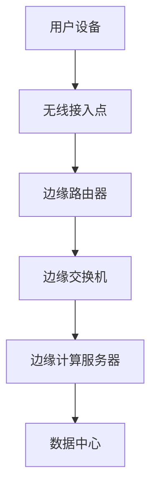
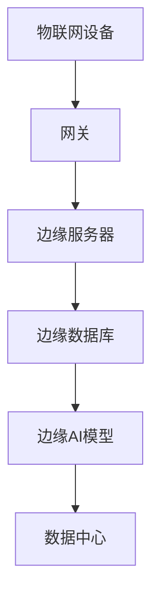
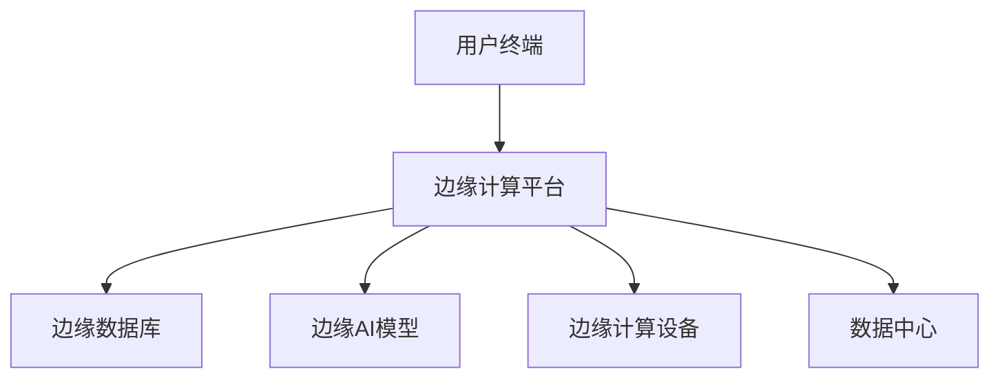
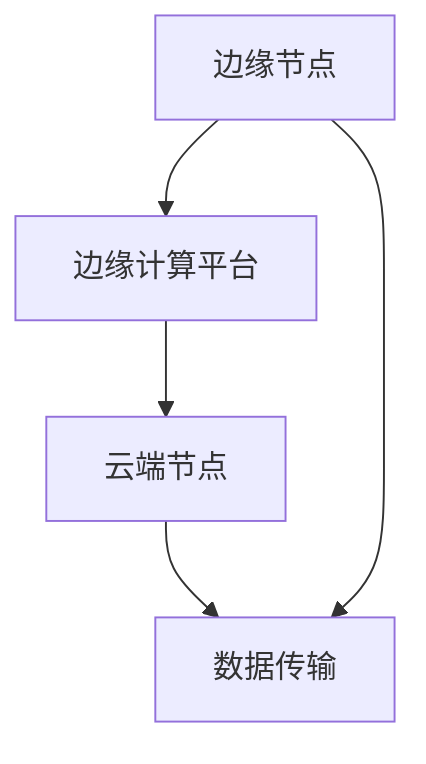

                 

## 引言

### 1. 引言

随着信息技术的快速发展，企业对数据处理和分析的需求日益增长。传统的云计算模式在处理大量数据时表现出了一定的局限性，尤其是在延迟、带宽和处理能力等方面。为了解决这些问题，边缘计算应运而生。边缘计算通过在靠近数据源的地方进行计算和处理，能够显著降低数据传输延迟、减少带宽占用，并提高系统的实时响应能力。边缘计算与云协同作为一种新兴的计算模式，正逐渐成为企业提高效率和创新能力的重要手段。

### 1.2 边缘计算与云协同的背景

边缘计算起源于物联网和物联网技术的发展。随着物联网设备的普及，数据量呈爆炸式增长，传统的云计算中心已经难以满足实时处理需求。边缘计算通过将计算任务分散到网络边缘，实现了数据的本地处理，有效解决了延迟和带宽问题。同时，云计算作为大数据和人工智能的基础设施，已经在企业中得到了广泛应用。随着边缘计算的发展，边缘计算与云计算的协同应用逐渐成为热点。

### 1.3 企业混合计算策略的重要性

企业混合计算策略的重要性体现在以下几个方面：

- **提升效率**：通过将计算任务在边缘和云端之间合理分配，可以实现资源的最优利用，提高系统整体效率。
- **增强灵活性**：企业可以根据业务需求灵活调整计算资源，实现动态调整和弹性扩展。
- **保障安全**：边缘计算能够将部分敏感数据处理在本地，减少数据传输过程中的安全风险。
- **创新驱动**：边缘计算与云协同为企业提供了丰富的数据处理和分析工具，有助于推动创新和应用落地。

总的来说，边缘计算与云协同为企业提供了一种全新的计算模式，通过合理分配计算资源，优化数据处理流程，有助于企业提升竞争力，实现持续发展。

## 摘要

本文旨在探讨边缘计算与云协同在企业计算策略中的应用。首先，介绍了边缘计算的定义、原理及其与传统云计算的区别。接着，详细阐述了云协同的基本概念、关键技术及其优势。随后，分析了企业混合计算策略的规划与实施，并结合实际案例进行了详细讲解。最后，对边缘计算与云协同的未来发展趋势进行了展望，提出了对企业的建议。通过本文的研究，有助于企业更好地理解和应用边缘计算与云协同，提升业务效率和创新能力。

---

在引言部分，我们首先明确了边缘计算与云协同的背景和重要性，为后续章节的内容奠定了基础。接下来，我们将深入探讨边缘计算的基础知识，包括其概念、原理和关键技术的详细讲解。同时，我们将引入Mermaid流程图来展示边缘计算与云协同的架构，帮助读者更好地理解核心概念和联系。通过这样的逐步分析推理，我们将确保文章内容逻辑清晰、易于理解，为读者提供一次全面的技术学习体验。### 第1章：边缘计算概述

### 1.1 边缘计算的概念与原理

#### 1.1.1 边缘计算的起源

边缘计算（Edge Computing）这一概念最早可以追溯到2000年代初期。随着互联网的普及，大数据和物联网技术开始崭露头角，传统云计算的中心化模式逐渐显示出其局限性。尤其是在物联网设备大量涌现的背景下，数据产生和处理的分散性要求更加高效和实时的计算能力。边缘计算正是为了解决这一需求而提出的。

边缘计算的早期研究主要集中在如何优化网络边缘的设备资源，提高数据处理效率。随着物联网设备的增加和5G技术的推广，边缘计算逐渐从理论走向实践。许多公司和组织开始探索如何将计算任务从云端迁移到网络边缘，从而实现更快速、更可靠的响应。

#### 1.1.2 边缘计算与传统云计算的区别

边缘计算与传统云计算在多个方面有着显著的区别：

1. **位置**：传统云计算主要依赖于数据中心，而边缘计算则将计算任务分散到网络边缘的设备上。
2. **延迟**：由于数据不需要传输到远程的数据中心，边缘计算能够显著降低响应时间，提高实时性。
3. **带宽**：边缘计算减少了数据传输的需求，从而降低了带宽消耗，提高了网络利用率。
4. **资源分配**：边缘计算依赖于本地设备资源，包括物联网设备、路由器、交换机等，而传统云计算则依赖于数据中心的大型服务器集群。

#### 1.1.3 边缘计算的发展趋势

随着技术的不断进步，边缘计算正呈现出以下发展趋势：

1. **技术融合**：边缘计算与物联网、5G、人工智能等技术的融合，将推动边缘计算在更多领域的应用。
2. **规模化**：越来越多的企业和组织开始重视边缘计算的价值，投入资源和资金进行研发和应用。
3. **智能化**：边缘计算正在从简单的数据处理向智能化方向发展，通过机器学习和人工智能算法，实现更复杂的决策和预测。
4. **标准化**：边缘计算标准的制定和推广，将有助于不同设备和平台之间的互操作性和兼容性。

通过以上对边缘计算起源、与传统云计算区别及发展趋势的探讨，我们可以看到边缘计算正在逐渐成为信息技术领域的重要组成部分，其应用范围和影响力不断扩大。接下来，我们将深入讨论边缘计算的关键技术，进一步理解其工作原理和实现方法。

## 边缘计算的关键技术

边缘计算能够实现高效、实时的数据处理，主要依赖于以下关键技术：

### 1.2.1 边缘计算网络

边缘计算网络是指在网络边缘部署的一系列网络设备和服务，包括路由器、交换机、无线接入点等。这些设备协同工作，形成一个分布式网络，能够实现数据的本地处理和传输。

边缘计算网络的几个关键特性如下：

1. **低延迟**：由于计算任务在靠近数据源的地方执行，数据传输的延迟显著降低。
2. **高带宽**：边缘计算网络通常采用宽带接入技术，如5G和光纤，能够提供更高的数据传输速率。
3. **可靠性**：通过分布式架构和冗余设计，边缘计算网络具有更高的可靠性和容错能力。
4. **灵活性**：边缘计算网络可以根据实际需求灵活配置和扩展，支持不同的应用场景。

#### 网络架构图

下面是一个简单的边缘计算网络架构图，使用Mermaid流程图来展示：



在这个架构图中，用户设备通过无线接入点连接到边缘路由器，然后通过边缘交换机接入边缘计算服务器。边缘计算服务器负责处理数据，并将结果返回给用户设备。同时，边缘计算服务器可以通过数据中心进行进一步的数据分析和处理。

### 1.2.2 边缘计算设备

边缘计算设备是指在网络边缘部署的计算资源，包括物联网设备、智能终端、网关等。这些设备具有以下特点：

1. **计算能力**：边缘计算设备通常配备有高性能的处理器，能够支持复杂的计算任务。
2. **存储能力**：边缘计算设备具有较大的存储容量，能够存储大量的数据，以便进行本地处理和分析。
3. **连接能力**：边缘计算设备通常具备多种连接方式，如Wi-Fi、蓝牙、5G等，能够实现高效的数据传输。
4. **自组织能力**：边缘计算设备可以通过自组织网络，实现设备的互联互通和协同工作。

#### 设备架构图

下面是一个简单的边缘计算设备架构图：



在这个架构图中，物联网设备通过网关连接到边缘服务器，边缘服务器负责数据处理和存储。同时，边缘服务器可以通过边缘数据库和边缘AI模型进行数据分析和智能决策。这些设备协同工作，形成一个完整的边缘计算架构。

### 1.2.3 边缘计算平台

边缘计算平台是指为边缘计算设备提供支持和服务的软件平台，包括操作系统、中间件、开发工具等。边缘计算平台的主要功能如下：

1. **资源管理**：边缘计算平台能够管理边缘设备上的计算资源、存储资源和网络资源，实现资源的优化分配和利用。
2. **数据处理**：边缘计算平台提供数据处理框架和工具，支持数据的采集、传输、存储和分析。
3. **应用部署**：边缘计算平台支持应用程序的部署和管理，允许开发者在边缘设备上开发、测试和部署应用程序。
4. **安全控制**：边缘计算平台提供安全控制机制，包括数据加密、身份验证和访问控制，保障系统的安全性。

#### 平台架构图

下面是一个简单的边缘计算平台架构图：



在这个架构图中，用户终端通过边缘计算平台连接到边缘数据库、边缘AI模型和边缘计算设备。边缘计算平台负责管理这些资源，并提供数据处理和分析服务。同时，边缘计算平台可以通过数据中心进行进一步的数据处理和分析。

通过以上对边缘计算网络、设备和平台关键技术的详细讲解，我们可以看到边缘计算架构的复杂性和多样性。这些关键技术的有效结合，使得边缘计算能够实现高效、实时的数据处理，为企业提供强大的计算支持。在接下来的章节中，我们将进一步探讨边缘计算在实际应用中的实现方法和最佳实践。### 第2章：云协同基本概念

## 2.1 云协同的定义与价值

### 2.1.1 云协同的概念

云协同（Cloud Collaboration）是指在云计算环境中，通过互联网实现不同设备和平台之间的数据共享、任务协作和资源调度的一种计算模式。云协同的核心在于通过云计算平台提供统一的服务接口，实现异构设备之间的无缝协作。

云协同的主要组成部分包括：

- **云计算平台**：作为协作的基础设施，提供计算资源、存储资源和网络资源。
- **分布式存储**：通过分布式存储技术，实现数据的集中存储和高效访问。
- **服务化架构**：采用微服务架构，将应用程序分解为多个独立的服务模块，实现模块化和服务化。
- **API接口**：提供统一的服务接口，允许不同设备和平台之间的数据交换和协作。

### 2.1.2 云协同的优势

云协同为企业带来了显著的优势，主要包括以下几个方面：

- **资源优化**：通过云计算平台提供的弹性计算资源，企业可以根据实际需求动态调整计算能力，实现资源的最大化利用。
- **协同效率**：通过统一的数据存储和协作平台，团队成员可以实时共享数据、协同工作和交流，提高工作效率。
- **灵活扩展**：云协同允许企业快速部署新的应用和服务，实现业务的快速扩展和升级。
- **成本节约**：通过云计算平台的按需付费模式，企业可以降低IT基础设施的投入和维护成本。

### 2.1.3 云协同的挑战

尽管云协同具有众多优势，但在实际应用中仍然面临一些挑战：

- **数据安全**：由于数据在互联网上传输和存储，如何确保数据的安全性成为重要问题。
- **网络依赖**：云协同高度依赖于稳定的互联网连接，网络中断或延迟可能导致协同工作的中断。
- **技术集成**：不同系统和平台之间的集成和互操作性可能面临技术难题，需要复杂的中间件和接口设计。
- **数据一致性**：在分布式环境中，如何保证数据的一致性是另一个重要挑战。

### 2.1.4 云协同的关键技术

为了实现有效的云协同，需要依赖一系列关键技术的支持：

- **容器技术**：容器技术（如Docker）可以提供轻量级、可移植的应用部署环境，提高系统的灵活性和可扩展性。
- **微服务架构**：通过将应用程序分解为多个微服务，可以实现模块化和服务化，提高系统的可维护性和可扩展性。
- **分布式数据库**：分布式数据库技术（如Apache Cassandra、MongoDB）可以提供高效的数据存储和访问能力，支持大规模数据处理的场景。
- **API网关**：API网关技术（如Kong、Apache APISIX）可以提供统一的服务接口和路由功能，实现不同系统和平台之间的数据交换和协作。

通过以上对云协同定义、价值和挑战的详细讲解，我们可以看到云协同作为一种强大的计算模式，在提高企业协同效率、优化资源利用和降低成本方面具有显著的优势。然而，云协同也面临着数据安全、网络依赖、技术集成和数据一致性等挑战，需要通过合理的设计和技术手段来解决。在接下来的章节中，我们将进一步探讨云协同的关键技术及其实现方法。

### 2.2 云协同的关键技术

#### 2.2.1 服务化架构

服务化架构（Service-Oriented Architecture, SOA）是云协同的核心技术之一。它通过将应用程序的功能模块化，形成一组独立的、可重用的服务，使得不同系统和平台之间可以通过这些服务进行交互。服务化架构的主要特点包括：

- **模块化**：通过将应用程序分解为多个服务模块，每个模块负责特定的功能，使得系统的开发、部署和维护变得更加灵活和可扩展。
- **解耦合**：服务之间的交互通过统一的接口进行，服务内部实现细节对其他服务透明，降低了系统的耦合度，提高了系统的稳定性和可维护性。
- **标准化**：服务化架构遵循一定的标准和规范，如RESTful API、SOAP等，确保不同服务之间能够高效地进行数据交换和协作。

#### 2.2.2 微服务架构

微服务架构（Microservices Architecture）是服务化架构的进一步发展。它通过将应用程序划分为更小的、独立的微服务单元，每个微服务负责一个特定的业务功能，运行在自己的进程和容器中。微服务架构的主要特点包括：

- **独立性**：每个微服务都是独立的，可以独立开发、测试和部署，降低了系统的复杂性和依赖性。
- **分布式**：微服务通常部署在分布式环境中，通过负载均衡和分布式缓存等技术，实现高可用性和高并发性。
- **动态伸缩**：根据业务需求，可以动态调整微服务的数量和资源分配，实现系统的弹性伸缩。

#### 示例：微服务架构的Python代码实现

以下是一个简单的微服务架构示例，使用Python的Flask框架实现：

```python
from flask import Flask, jsonify

app = Flask(__name__)

@app.route('/users', methods=['GET'])
def get_users():
    # 读取用户数据
    users = [
        {'id': 1, 'name': 'Alice'},
        {'id': 2, 'name': 'Bob'}
    ]
    return jsonify(users)

if __name__ == '__main__':
    app.run(debug=True)
```

在这个示例中，我们创建了一个简单的用户服务，通过RESTful API提供用户数据的读取功能。这个服务可以独立部署和扩展，是一个典型的微服务单元。

#### 2.2.3 云存储与大数据

云存储与大数据技术是云协同的重要组成部分，提供了海量数据的存储、处理和分析能力。云存储技术（如Amazon S3、Google Cloud Storage）通过分布式存储架构，提供了高可靠性、高可用性和海量存储空间。大数据技术（如Hadoop、Spark）则提供了数据采集、存储、处理和分析的完整解决方案。

- **云存储**：云存储通过分布式存储技术，实现了海量数据的可靠存储和高效访问。它支持数据的版本控制和生命周期管理，允许用户根据需求灵活调整存储策略。
- **大数据处理**：大数据处理框架（如Hadoop、Spark）通过分布式计算和内存计算技术，实现了海量数据的快速处理和分析。Hadoop主要用于离线批处理，而Spark则支持实时流处理和迭代计算。

#### 示例：使用Spark进行大数据处理

以下是一个简单的Spark数据处理示例，使用Python进行编写：

```python
from pyspark.sql import SparkSession

# 创建Spark会话
spark = SparkSession.builder.appName("BigDataProcessing").getOrCreate()

# 读取数据
data = spark.read.csv("data.csv", header=True)

# 数据预处理
data = data.select("id", "name", "age").filter(data["age"] > 18)

# 数据分析
result = data.groupBy("name").count()

# 输出结果
result.show()

# 关闭Spark会话
spark.stop()
```

在这个示例中，我们使用Spark读取CSV数据，进行简单的数据预处理后，进行分组计数分析。这个过程展示了大数据处理的基本流程。

通过以上对服务化架构、微服务架构和云存储与大数据技术的详细讲解，我们可以看到这些关键技术如何支持云协同的实现。服务化架构和微服务架构提供了灵活、解耦合的系统设计，云存储与大数据技术则提供了海量数据的高效处理和分析能力。这些关键技术的结合，使得云协同能够实现高效的数据处理和协同工作，为企业提供强大的计算支持。

### 第3章：企业混合计算策略规划

#### 3.1 企业混合计算策略概述

企业混合计算策略（Enterprise Hybrid Computing Strategy）是指在企业内部同时采用边缘计算和云计算，以实现计算资源的最优利用和业务需求的最佳满足。这种策略的核心在于通过灵活的资源配置和协同工作，提高企业的计算效率和创新能力。

#### 3.1.1 企业混合计算策略的定义

企业混合计算策略可以定义为一种计算资源管理策略，它结合了边缘计算和云计算的优势，通过在边缘和云端之间动态调整计算任务，实现资源的最佳分配和利用。这种策略不仅能够满足不同业务场景的需求，还能够提高系统的实时性和可靠性。

#### 3.1.2 企业混合计算策略的目标

企业混合计算策略的主要目标包括：

- **提高计算效率**：通过在边缘和云端之间合理分配计算任务，实现计算资源的最大化利用，提高整体计算效率。
- **降低成本**：通过灵活的资源配置和优化，降低企业的IT基础设施投入和维护成本。
- **增强灵活性**：企业可以根据业务需求灵活调整计算资源，支持业务的快速扩展和转型。
- **保障安全**：通过在边缘进行部分数据处理，减少数据传输过程中的安全风险，提高系统的安全性。

#### 3.1.3 企业混合计算策略的要素

企业混合计算策略的制定和实施涉及多个关键要素，包括：

1. **需求分析**：了解企业的业务需求和数据特点，确定哪些任务适合在边缘处理，哪些任务适合在云端处理。
2. **技术选型**：选择合适的边缘计算和云计算平台、设备和技术，确保系统的兼容性和扩展性。
3. **架构设计**：设计合理的混合计算架构，包括边缘节点、云端节点和数据传输网络等，确保系统的稳定性和高效性。
4. **资源管理**：实现计算资源的动态调整和优化，根据业务需求灵活分配和调度资源。
5. **安全控制**：建立完善的安全控制机制，包括数据加密、身份认证和访问控制等，保障系统的安全性。

#### 混合计算策略架构图

下面是一个简单的企业混合计算策略架构图：



在这个架构图中，边缘节点通过边缘计算平台处理本地数据，云端节点通过数据中心进行数据存储和进一步处理。边缘节点和云端节点之间通过数据传输网络进行数据交换，实现混合计算架构的协同工作。

#### 3.1.4 混合计算策略的应用场景

企业混合计算策略可以应用于多种业务场景，以下是一些典型的应用场景：

1. **智能零售**：通过边缘计算节点部署在零售店的智能设备，实时收集消费者的购物行为数据，并在边缘节点上进行数据处理和分析，为商家提供实时的销售洞察。
2. **智能制造**：在生产线边缘部署计算设备，实时监控生产数据，进行质量检测和故障预测，提高生产线的效率和安全性。
3. **智慧交通**：在交通节点部署边缘计算设备，实时收集交通数据，进行交通流量分析和优化，提高道路通行效率。
4. **智能医疗**：在诊所和医院部署边缘计算设备，实时处理患者的健康数据，进行远程诊断和病情监测，提高医疗服务的质量和效率。

通过以上对企业混合计算策略概述、定义、目标、要素和应用的详细讲解，我们可以看到企业混合计算策略在提升企业计算效率、降低成本和增强灵活性方面的优势。接下来，我们将探讨如何实施企业混合计算策略，包括需求分析、技术选型和资源管理等具体步骤。通过这些步骤，企业可以有效地构建和运行混合计算系统，实现业务目标和创新价值。

### 3.2 企业混合计算策略实施

#### 3.2.1 需求分析

需求分析是实施企业混合计算策略的第一步，其核心在于深入了解企业的业务需求和技术需求，明确计算任务的类型、数据量和处理要求。以下是进行需求分析的详细步骤：

1. **业务需求调研**：与业务部门进行深入交流，了解业务流程、关键业务场景和需求目标。通过访谈、问卷调查和文档分析等方法，收集业务需求信息。
2. **数据处理需求分析**：根据业务需求，分析数据的类型、来源、数据量和处理要求。确定哪些数据需要在边缘处理，哪些数据需要在云端处理，以及处理的时间敏感性和数据隐私要求。
3. **计算任务分析**：识别和分类计算任务，包括实时处理任务、批量处理任务和长期数据处理任务。评估每个计算任务的处理复杂度、计算资源和处理延迟要求。
4. **资源需求评估**：根据计算任务的分析结果，评估所需的计算资源、存储资源和网络资源，确定是否需要额外的设备或服务。

#### 3.2.2 技术选型

技术选型是实施企业混合计算策略的关键环节，其核心在于选择适合企业需求的边缘计算和云计算平台、设备和技术。以下是进行技术选型的详细步骤：

1. **平台选择**：根据业务需求和资源需求，选择适合的边缘计算平台和云计算平台。边缘计算平台可以选择基于Linux、Android或IoT操作系统，如IoT.js、Node-RED等；云计算平台可以选择公有云、私有云或混合云，如AWS、Azure、Google Cloud等。
2. **设备选型**：根据数据处理需求，选择适合的边缘计算设备。设备类型包括物联网设备、网关、智能传感器等。需要考虑设备的计算能力、存储能力、连接能力以及自组织能力。
3. **技术框架选择**：根据业务需求和平台选择，选择合适的技术框架和开发工具。例如，边缘计算开发可以选择MQTT、CoAP等物联网通信协议；云计算开发可以选择Docker、Kubernetes等容器技术。
4. **安全性评估**：评估所选技术的安全特性，包括数据加密、身份认证和访问控制等。确保所选技术能够满足企业的安全需求。

#### 3.2.3 部署与运维

部署与运维是实施企业混合计算策略的最后一步，其核心在于将所选技术和设备部署到实际环境中，并进行有效的管理和维护。以下是进行部署与运维的详细步骤：

1. **环境搭建**：在边缘节点和云端搭建计算环境，安装和配置所选的操作系统、中间件和开发工具。需要确保环境的一致性和可扩展性。
2. **系统集成**：将边缘计算设备和云计算平台进行集成，确保数据能够顺畅传输和交互。需要实现边缘节点和云端节点的统一管理和监控。
3. **测试验证**：对部署的系统进行全面的测试验证，包括功能测试、性能测试和安全测试。确保系统能够稳定运行，并满足业务需求。
4. **运维管理**：建立运维管理制度，包括运维流程、操作手册和故障处理预案。通过监控工具和日志分析，实时监控系统的运行状态，及时发现和解决问题。
5. **持续优化**：根据业务发展和实际需求，持续优化系统的架构和配置，提升系统的性能和稳定性。定期进行性能评估和安全审计，确保系统的长期可靠性。

#### 实施案例：智能零售

以下是一个智能零售的实施案例，展示了企业混合计算策略的具体实施过程：

1. **需求分析**：
   - 业务需求：实时收集零售店的客流量、商品销售数据等，为商家提供销售洞察。
   - 数据处理需求：实时处理和分析大量数据，保证数据的准确性和及时性。

2. **技术选型**：
   - 边缘计算平台：选择基于Linux的边缘计算设备，搭载IoT.js操作系统。
   - 云计算平台：选择AWS云端服务，利用AWS Lambda和Amazon S3进行数据处理和存储。

3. **部署与运维**：
   - 在零售店的各个节点部署边缘计算设备，实时收集数据。
   - 通过MQTT协议将数据传输到云端，利用AWS Lambda进行数据处理和分析。
   - 通过Amazon S3存储分析结果，为商家提供实时的销售报告。

通过这个案例，我们可以看到企业混合计算策略在智能零售场景中的应用。通过边缘计算设备实时处理数据，减少了数据传输延迟；通过云计算平台进行数据处理和分析，提升了系统的性能和稳定性。最终，实现了对零售业务的实时监控和优化，提升了商家的经营效率。

通过以上对企业混合计算策略实施过程的详细讲解，我们可以看到从需求分析到技术选型，再到部署与运维，每一步都需要精心策划和执行。企业混合计算策略的实施，不仅能够提升企业的计算效率和业务能力，还能够为企业带来持续的创新价值。

### 第4章：案例研究

#### 4.1 案例研究一：某零售企业的边缘计算与云协同实践

### 4.1.1 案例背景

某大型零售企业面临着日益激烈的市场竞争，希望通过技术手段提升运营效率和顾客体验。该企业拥有众多门店，每天产生大量的销售数据和顾客行为数据。为了实时分析这些数据，并提供个性化的促销和服务，企业决定采用边缘计算与云协同的混合计算策略。

### 4.1.2 案例实施过程

1. **需求分析**：
   - 业务需求：实时处理和分析门店的销售数据、顾客行为数据，提供实时的销售报告和营销建议。
   - 数据处理需求：处理大量实时数据，保证数据传输的低延迟和高可靠性。

2. **技术选型**：
   - 边缘计算平台：选择基于Linux的边缘计算设备，搭载Node-RED操作系统，部署在门店的各个节点。
   - 云计算平台：选择AWS云端服务，利用AWS Lambda和Amazon S3进行数据处理和存储。

3. **架构设计**：
   - 在每个门店部署边缘计算设备，负责实时收集和处理销售数据和顾客行为数据。
   - 通过MQTT协议将数据传输到云端的AWS Lambda服务，进行进一步的数据处理和分析。
   - 利用Amazon S3存储分析结果，提供实时的销售报告和营销建议。

4. **部署与运维**：
   - 在门店部署边缘计算设备，进行数据收集和初步处理。
   - 通过MQTT协议将数据传输到AWS Lambda服务，利用Python和Node.js编写数据处理脚本，进行数据清洗、转换和分析。
   - 利用Amazon S3存储分析结果，通过API接口提供数据访问和报告服务。

### 4.1.3 案例效果评估

通过边缘计算与云协同的混合计算策略，该零售企业取得了以下效果：

- **实时数据处理能力提升**：通过边缘计算设备实时处理门店数据，减少了数据传输延迟，提高了数据处理速度。
- **运营效率提升**：实时分析销售数据和顾客行为数据，为管理层提供了实时的运营洞察，帮助企业更好地制定营销策略和调整库存。
- **顾客体验提升**：通过分析顾客行为数据，提供个性化的促销和服务，提升了顾客满意度和忠诚度。
- **成本节约**：通过云计算平台的弹性计算资源，按需付费，降低了企业的IT基础设施投入和维护成本。

### 4.1.4 案例启示

该案例表明，边缘计算与云协同的混合计算策略在零售企业中具有显著的应用价值。通过在门店部署边缘计算设备，实现数据的本地处理和实时分析，能够提升企业的运营效率和顾客体验。同时，利用云计算平台进行数据存储和进一步处理，能够实现数据的集中管理和高效分析。企业可以根据自身的业务需求和技术条件，制定和实施合适的混合计算策略，以实现业务的持续创新和提升。

---

#### 4.2 案例研究二：某制造企业的混合计算策略

### 4.2.1 案例背景

某大型制造企业面临生产效率和产品质量的挑战，希望通过技术手段提升生产线的自动化程度和智能化水平。该企业拥有复杂的生产流程和大量的生产数据，包括设备状态、生产线数据、产品缺陷数据等。为了实现生产线的实时监控和优化，企业决定采用混合计算策略。

### 4.2.2 案例实施过程

1. **需求分析**：
   - 业务需求：实时监控生产线设备状态和生产数据，进行故障预测和产品质量分析。
   - 数据处理需求：处理大量实时生产数据，保证数据传输的低延迟和高可靠性。

2. **技术选型**：
   - 边缘计算平台：选择基于Linux的边缘计算设备，搭载OPC UA协议，部署在生产线各个节点。
   - 云计算平台：选择Azure云端服务，利用Azure IoT Hub和Azure Machine Learning进行数据处理和智能分析。

3. **架构设计**：
   - 在生产线各个节点部署边缘计算设备，实时收集设备状态和生产数据。
   - 通过OPC UA协议将数据传输到云端的Azure IoT Hub服务，进行数据传输和初步处理。
   - 利用Azure Machine Learning进行故障预测和产品质量分析，提供智能化的生产优化建议。

4. **部署与运维**：
   - 在生产线各个节点部署边缘计算设备，进行实时数据采集和处理。
   - 通过OPC UA协议将数据传输到Azure IoT Hub服务，利用Python和Azure SDK编写数据处理脚本，进行数据清洗、转换和分析。
   - 利用Azure Machine Learning进行机器学习模型训练和预测，提供智能化的生产优化建议。

### 4.2.3 案例效果评估

通过混合计算策略的实施，该制造企业取得了以下效果：

- **生产效率提升**：通过实时监控和优化生产线设备状态和生产数据，降低了设备故障率和停机时间，提高了生产效率。
- **产品质量提升**：通过实时分析和预测产品质量，及时发现并解决产品缺陷，提高了产品的合格率和市场竞争力。
- **智能化水平提升**：通过机器学习和人工智能技术，实现了生产线的智能化监控和优化，提升了企业的智能化水平。
- **成本节约**：通过云计算平台的弹性计算资源，按需付费，降低了企业的IT基础设施投入和维护成本。

### 4.2.4 案例启示

该案例表明，混合计算策略在制造业中具有显著的应用价值。通过在生产线部署边缘计算设备，实现数据的本地处理和实时分析，能够提升企业的生产效率和产品质量。同时，利用云计算平台进行数据存储和进一步处理，能够实现数据的集中管理和高效分析。企业可以根据自身的业务需求和技术条件，制定和实施合适的混合计算策略，以实现业务的持续创新和提升。

### 第5章：边缘计算与云协同的发展趋势

#### 5.1 未来发展趋势分析

边缘计算与云协同作为一种新兴的计算模式，正在不断演进和发展。未来，它将在多个方面呈现出以下发展趋势：

1. **技术融合**：边缘计算与物联网、5G、人工智能等技术的深度融合，将进一步提升边缘计算的性能和智能化水平。例如，5G网络的普及将为边缘计算提供更高的带宽和更低的延迟，而人工智能算法则能够为边缘计算提供更复杂的决策能力。

2. **规模化应用**：随着边缘计算技术的成熟和应用的普及，越来越多的企业和行业将采用边缘计算与云协同的混合计算模式。从智能家居、智慧城市到智能制造、智慧医疗，边缘计算的应用场景将不断拓展，形成规模化应用。

3. **安全性和隐私保护**：随着数据量的增加和数据类型的多样化，边缘计算与云协同的安全性和隐私保护将变得越来越重要。未来，将出现更多专注于安全性和隐私保护的技术和解决方案，确保数据的传输、存储和处理过程的安全可靠。

4. **标准化和开放性**：为了促进边缘计算与云协同的互操作性和兼容性，标准化和开放性将成为未来发展的重要方向。例如，开放接口和协议的标准化将有助于不同设备和平台之间的无缝协作，推动边缘计算与云协同的生态建设。

#### 5.2 应用发展趋势

边缘计算与云协同在多个行业中具有广泛的应用前景，以下是一些主要的应用发展趋势：

1. **智慧城市**：边缘计算与云协同将在智慧城市建设中发挥重要作用，通过实时数据处理和分析，提升城市管理水平和居民生活质量。例如，在交通管理、环境保护、公共安全等方面，边缘计算与云协同可以实现实时监控、智能调度和精准预测。

2. **智能制造**：边缘计算与云协同将推动智能制造的发展，通过实时监控和分析生产数据，提高生产线的自动化程度和智能化水平。例如，在设备故障预测、生产优化和质量控制等方面，边缘计算与云协同能够提供有效的技术支持。

3. **智慧医疗**：边缘计算与云协同在智慧医疗领域具有巨大的应用潜力。通过边缘计算设备实时收集患者健康数据，并在云端进行大数据分析和智能诊断，可以提高医疗服务质量和效率。例如，在远程医疗、疾病预测和个性化治疗等方面，边缘计算与云协同将发挥重要作用。

4. **智能交通**：边缘计算与云协同在智能交通领域可以提供实时交通监控、路况预测和交通优化方案。例如，在交通流量管理、智能停车场和智能出行等方面，边缘计算与云协同能够提升交通效率和安全性。

#### 5.3 政策发展趋势

政府政策对边缘计算与云协同的发展具有重要影响。以下是一些政策发展趋势：

1. **政策支持**：政府将加大对边缘计算与云协同的政策支持力度，通过资金投入、税收优惠和研发支持等措施，推动技术的研发和应用。

2. **法律法规**：随着边缘计算与云协同的发展，相关的法律法规也将逐步完善。例如，数据保护法、网络安全法等法律法规将加强对边缘计算与云协同数据安全和隐私保护的规范。

3. **国际合作**：政府将推动边缘计算与云协同的国际合作，通过多边合作和跨国技术交流，推动技术的全球发展和应用。

通过以上对边缘计算与云协同未来发展趋势、应用发展趋势和政策发展趋势的分析，我们可以看到边缘计算与云协同在技术、应用和政策方面都呈现出积极的发展态势。随着技术的不断进步和政策的推动，边缘计算与云协同将在更多行业和应用场景中发挥重要作用，为企业和行业带来创新和价值。

### 5.2 未来展望与挑战

#### 5.2.1 未来展望

随着边缘计算与云协同技术的不断发展和应用领域的拓展，未来这一领域将呈现出以下发展趋势：

1. **智能化与自主化**：边缘计算与云协同将更加智能化和自主化，通过人工智能和机器学习算法，实现更高效的数据处理和智能决策。例如，在自动驾驶、智能监控等领域，边缘计算设备将能够自主完成复杂任务，减少对中心云的依赖。

2. **生态系统的完善**：边缘计算与云协同的生态系统将不断成熟，包括硬件设备、软件平台、开发工具和服务在内的各类资源将更加丰富多样。这将促进不同设备和平台之间的互操作性和兼容性，推动整个产业的快速发展。

3. **行业应用的深化**：边缘计算与云协同将在各个行业中得到更深入的应用。例如，在医疗领域，通过边缘计算实现实时患者监测和远程手术指导；在工业制造领域，通过边缘计算实现生产线的智能监控和优化。

#### 5.2.2 挑战与机遇

尽管边缘计算与云协同具有广阔的发展前景，但同时也面临一些挑战：

1. **数据安全与隐私**：边缘计算涉及大量的数据传输和处理，如何确保数据的安全性和隐私保护是一个重要挑战。未来，需要开发出更加安全的数据传输协议和加密技术，以及建立完善的数据隐私保护法规。

2. **网络稳定性和延迟**：边缘计算依赖于稳定的网络连接，但网络延迟和中断问题仍然存在。未来，需要通过5G等新型网络技术，提高网络的稳定性和可靠性，降低边缘计算的环境依赖。

3. **技术标准和互操作性**：边缘计算与云协同的标准化和互操作性是推动其发展的关键。未来，需要建立统一的技术标准和协议，促进不同设备和平台之间的无缝协作。

通过面对这些挑战，边缘计算与云协同领域将迎来新的机遇：

1. **技术创新**：随着技术的不断进步，边缘计算与云协同将带来更多的创新机会，推动新技术的研发和应用。

2. **市场拓展**：边缘计算与云协同将在更多行业和应用场景中得到应用，为企业带来新的市场机遇。

3. **社会效益**：边缘计算与云协同将提升社会生产力和生活质量，为智慧城市、智能制造等领域的持续发展提供有力支持。

总之，边缘计算与云协同的发展充满机遇和挑战。通过技术创新、生态建设和政策支持，这一领域将不断突破瓶颈，实现更广泛的应用和更深远的社会价值。

### 结论

本文全面探讨了边缘计算与云协同在企业计算策略中的应用。通过深入分析边缘计算的概念、原理、关键技术以及云协同的定义、优势和挑战，我们明确了企业混合计算策略的定义、目标和实施要点。结合实际案例，我们展示了边缘计算与云协同在零售、制造等行业的成功应用。同时，我们对未来边缘计算与云协同的发展趋势进行了展望，并提出了面临的技术挑战和政策机遇。

### 主要内容回顾

- 边缘计算的概念、原理及其与传统云计算的区别。
- 边缘计算的关键技术，包括边缘计算网络、设备和平台。
- 云协同的定义、价值和挑战，以及关键技术的详细讲解。
- 企业混合计算策略的定义、目标和要素，以及实施过程和最佳实践。
- 实际案例研究，展示了边缘计算与云协同在零售、制造等行业的应用成效。

### 对企业混合计算策略的建议

1. **需求分析**：深入了解企业的业务需求和数据特点，明确计算任务的处理要求和优先级。
2. **技术选型**：根据业务需求和预算，选择合适的边缘计算和云计算平台、设备和技术。
3. **架构设计**：设计合理的混合计算架构，确保系统的稳定性和高效性。
4. **安全控制**：建立完善的安全控制机制，保障系统的安全性。
5. **持续优化**：根据业务发展和实际需求，持续优化系统的架构和配置，提升系统的性能和稳定性。

### 注意事项

- 确保边缘计算设备与云计算平台之间的网络连接稳定可靠。
- 定期进行系统性能评估和安全审计，及时发现和解决问题。
- 建立完善的运维管理制度，确保系统的稳定运行。

### 拓展阅读

- 《边缘计算：技术原理与实践》
- 《云计算：概念、架构与实践》
- 《智能边缘：物联网与云计算的融合》

通过本文的阅读，读者可以全面了解边缘计算与云协同的基本概念、关键技术以及应用实践，为企业制定和实施混合计算策略提供有益的参考。作者：AI天才研究院/AI Genius Institute & 禅与计算机程序设计艺术 /Zen And The Art of Computer Programming。

