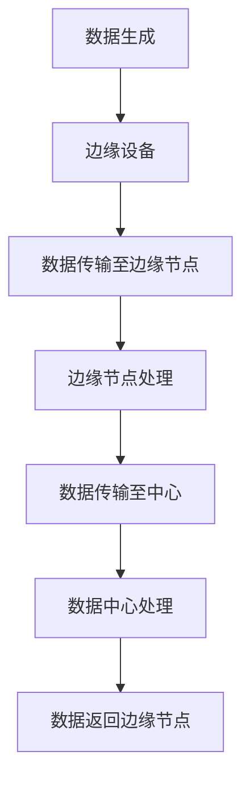
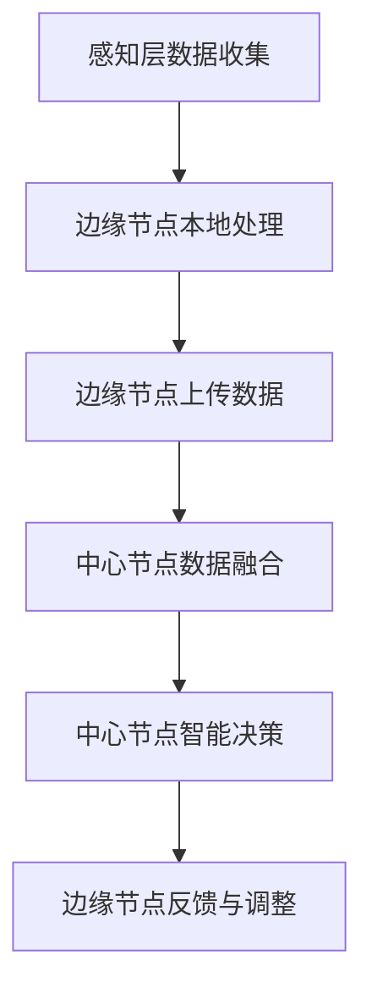

                 

 - **文章标题**：边缘计算在工业物联网中的实时处理

> **关键词**：边缘计算，工业物联网，实时处理，数据处理，分布式计算，智能工厂

> **摘要**：
本文探讨了边缘计算在工业物联网中的应用，特别是实时数据处理的重要性。首先，我们介绍了边缘计算的基本概念和核心原理，包括其分布式计算架构和边缘智能。然后，我们详细阐述了边缘计算与工业物联网的关系，并分析了边缘计算在工业物联网中的挑战和优势。接下来，我们深入讲解了实时数据处理算法，包括核心算法原理和Python源代码实现。此外，我们还展示了边缘设备与平台的选择和实现技术，并讨论了边缘计算的安全与隐私问题。最后，通过实际案例，我们展示了边缘计算在工业物联网中的成功应用，并提出了未来趋势和挑战。本文旨在为读者提供一个全面而深入的边缘计算在工业物联网中的应用指南。

----------------------------------------------------------------

**目录大纲**：

1. 引言
   1.1 研究背景
   1.2 研究目的和意义
   1.3 本文结构

2. 边缘计算概述
   2.1 定义与重要性
   2.2 核心原理
   2.3 应用场景
   2.4 边缘计算架构 Mermaid 流程图

3. 工业物联网概述
   3.1 基本概念
   3.2 架构
   3.3 边缘计算在 IIoT 中的作用

4. 边缘计算与工业物联网的融合
   4.1 挑战与优势
   4.2 协同计算模型

5. 实时数据处理算法
   5.1 需求分析
   5.2 主流算法
   5.3 Python 源代码实现

6. 边缘设备与平台
   6.1 设备选择
   6.2 平台实现
   6.3 性能优化

7. 安全与隐私
   7.1 安全挑战
   7.2 隐私保护技术
   7.3 安全协议与加密算法

8. 案例分析
   8.1 案例一：智能工厂
   8.2 案例二：智能制造
   8.3 案例三：智慧能源管理

9. 未来趋势与挑战
   9.1 发展趋势
   9.2 挑战与对策
   9.3 拓展阅读

10. 结论
   10.1 研究总结
   10.2 学术贡献与局限性
   10.3 未来研究方向

----------------------------------------------------------------

**引言**

**1.1 研究背景**

随着工业4.0的兴起，工业物联网（Industrial Internet of Things，IIoT）逐渐成为现代工业的重要组成部分。IIoT通过将各种传感器、执行器和设备连接到互联网，实现了数据的实时采集、传输和分析，从而推动了工业自动化和智能化的进程。然而，传统的云计算中心在处理海量数据时存在一定的延迟和带宽限制，无法满足工业物联网对实时数据处理的需求。

边缘计算（Edge Computing）作为一种新型的计算模式，旨在将数据处理和存储的近源位置，即数据生成的地方，从而减少数据在网络中的传输时间和延迟，提高数据处理效率。边缘计算通过分布式计算架构，将计算任务分布在多个边缘节点上，实现了对实时数据的高效处理和分析。

边缘计算在工业物联网中的应用具有重要意义。首先，它能够提高工业物联网系统的响应速度，满足实时数据处理的需求。其次，它能够减轻中心数据中心的负担，降低带宽使用，提高网络传输效率。此外，边缘计算还能够为工业物联网提供更灵活、可扩展的解决方案，满足不同场景和需求。

本文的研究目的是探讨边缘计算在工业物联网中的实时数据处理，分析其核心概念和原理，探讨边缘计算与工业物联网的关系，介绍实时数据处理算法，分析边缘设备和平台的选择与实现技术，讨论安全与隐私问题，并通过实际案例展示边缘计算在工业物联网中的应用。

**1.2 研究目的和意义**

本文的研究目的主要包括以下几个方面：

1. 深入理解边缘计算的基本概念和核心原理，为后续研究提供理论基础。
2. 分析边缘计算在工业物联网中的应用场景和优势，为实际应用提供指导。
3. 探讨实时数据处理算法的设计与实现，提高工业物联网系统的实时数据处理能力。
4. 分析边缘设备和平台的选择与实现技术，为构建高效、可靠的边缘计算系统提供参考。
5. 讨论边缘计算在工业物联网中的安全与隐私问题，为边缘计算的安全应用提供解决方案。

本文的研究意义在于：

1. 为边缘计算在工业物联网中的应用提供理论支持和实践经验，促进边缘计算技术的发展。
2. 提高工业物联网系统的实时数据处理能力，提升工业自动化和智能化的水平。
3. 为工业物联网领域的研究人员和实践者提供有价值的参考和借鉴，推动边缘计算在工业物联网中的广泛应用。

**1.3 本文结构**

本文结构如下：

第1章 引言：介绍研究背景、目的和意义，以及本文的结构安排。

第2章 边缘计算概述：介绍边缘计算的定义、核心原理和应用场景，并展示边缘计算架构的 Mermaid 流程图。

第3章 工业物联网概述：介绍工业物联网的基本概念、架构和边缘计算在其中的作用。

第4章 边缘计算与工业物联网的融合：分析边缘计算与工业物联网的关系，探讨协同计算模型。

第5章 实时数据处理算法：介绍实时数据处理的需求、主流算法和 Python 源代码实现。

第6章 边缘设备与平台：分析边缘设备的选择和边缘计算平台的技术实现。

第7章 安全与隐私：讨论边缘计算在工业物联网中的安全挑战和隐私保护。

第8章 案例分析：通过实际案例展示边缘计算在工业物联网中的应用。

第9章 未来趋势与挑战：预测边缘计算在工业物联网中的未来发展趋势和面临的挑战。

第10章 结论：总结研究内容，阐述本文的贡献和局限性，以及未来研究方向。

---

**第二章 边缘计算概述**

**2.1 定义与重要性**

边缘计算是一种分布式计算模型，它将数据处理和存储的近源位置，即数据生成的地方，作为计算的重点。这种模式有助于减少延迟、节省带宽并提高数据处理的效率。

边缘计算的**定义**：边缘计算是指在数据源附近或边缘的网络节点上执行数据处理和存储的分布式计算模式。

边缘计算的核心思想是将计算任务从中心化的数据中心转移到分布式的边缘节点上，以实现以下目标：

1. **减少延迟**：边缘计算通过在数据生成的源头附近处理数据，减少了数据在网络中传输的时间，从而提高了系统的响应速度。
2. **节省带宽**：将数据处理转移到边缘节点，可以减少中心数据中心的网络流量，降低带宽使用。
3. **提高效率**：边缘计算能够快速处理大量实时数据，从而为工业物联网等应用提供更好的性能。

边缘计算的重要性体现在以下几个方面：

1. **实时性要求**：许多工业应用，如智能制造、智能交通等，对实时数据处理有很高的要求。边缘计算能够实现数据在本地快速处理，满足实时性的需求。
2. **带宽限制**：传统的云计算模式需要将数据传输到数据中心进行处理，这会导致网络带宽的严重消耗。边缘计算可以在本地完成数据处理，减少对中心数据中心的依赖，降低网络带宽的需求。
3. **安全性与隐私保护**：边缘计算将数据处理的近源位置，可以减少数据在网络中的传输次数，降低数据泄露的风险。同时，边缘计算可以实现数据的本地化处理，减少数据传输过程中的安全隐患。
4. **灵活性**：边缘计算可以将计算任务分布到多个边缘节点上，提高系统的灵活性和可扩展性。根据实际需求，可以动态调整边缘节点的计算能力和资源，满足不同应用场景的需求。

**2.2 核心原理**

边缘计算的核心原理包括分布式计算架构、数据处理分布和边缘智能。

1. **分布式计算架构**

边缘计算采用分布式计算架构，将计算任务分布在多个边缘节点上。每个边缘节点负责一部分数据处理任务，从而实现数据处理的高效并行化和分布式处理。

分布式计算架构的主要优点包括：

- **可扩展性**：边缘计算可以将计算任务分布到多个节点上，提高系统的可扩展性。根据实际需求，可以动态调整边缘节点的数量和计算能力，满足不同应用场景的需求。
- **高可用性**：分布式计算架构可以提高系统的可用性。当一个节点发生故障时，其他节点可以继续处理计算任务，保证系统的正常运行。
- **高可靠性**：分布式计算架构可以提高系统的可靠性。通过将计算任务分布在多个节点上，可以降低单点故障的风险，提高系统的容错能力。

2. **数据处理分布**

边缘计算通过数据处理分布，将数据处理任务分布在多个边缘节点上。每个边缘节点负责一部分数据处理任务，从而实现数据处理的高效并行化和分布式处理。

数据处理分布的主要优点包括：

- **负载均衡**：将数据处理任务分布在多个边缘节点上，可以实现负载均衡，避免单个节点过载，提高系统的性能和可靠性。
- **资源利用最大化**：边缘节点分布在不同的地理位置，可以利用不同地区的计算资源，实现资源利用最大化。
- **降低延迟**：通过在数据生成的源头附近处理数据，可以减少数据在网络中的传输时间，降低系统的延迟。

3. **边缘智能**

边缘计算通过边缘智能，使边缘节点具备一定的智能处理能力，可以执行复杂的计算任务。

边缘智能的主要优点包括：

- **实时决策**：边缘节点可以实时处理数据，并在本地做出决策，提高系统的响应速度和实时性。
- **降低网络负担**：边缘节点可以处理部分数据，减少需要传输到中心数据中心的网络流量，降低网络负担。
- **增强隐私保护**：边缘节点可以本地处理数据，减少数据在网络中的传输次数，降低数据泄露的风险。

**2.3 应用场景**

边缘计算广泛应用于各种场景，其中最为典型的应用场景包括智能工厂、智能制造、智慧交通和智慧能源管理等。

1. **智能工厂**

智能工厂通过边缘计算实现生产过程的实时监控、预测维护和智能调度。边缘计算可以将传感器数据实时传输到边缘节点进行处理，从而实现对生产过程的实时监控。同时，边缘计算可以基于历史数据和实时数据，预测设备故障并进行预测性维护，提高生产设备的可靠性和利用率。

2. **智能制造**

智能制造通过边缘计算实现制造过程中的实时数据采集、分析和优化。边缘计算可以在本地快速处理制造过程中产生的海量数据，从而实现对生产过程的实时监控和优化。此外，边缘计算还可以用于设备状态监测、故障诊断和性能优化，提高生产效率和产品质量。

3. **智慧交通**

智慧交通通过边缘计算实现交通管理、车辆监控和智能导航等功能。边缘计算可以在交通流量高峰期实时处理交通数据，优化交通信号控制策略，缓解交通拥堵。同时，边缘计算还可以用于车辆监控，实现对车辆状态的实时监测和故障预警，提高车辆运行的安全性和效率。

4. **智慧能源管理**

智慧能源管理通过边缘计算实现能源消耗的实时监控和优化。边缘计算可以在本地实时处理能源数据，优化能源分配和调度策略，提高能源利用效率。此外，边缘计算还可以用于设备状态监测和故障诊断，确保能源系统的稳定运行。

**2.4 边缘计算架构 Mermaid 流�程图**

为了更好地理解边缘计算架构，下面给出一个边缘计算架构的 Mermaid 流程图。



在这个流程图中，数据从数据生成源头（如传感器、执行器等）传输到边缘设备，然后通过边缘设备传输到边缘节点进行处理。处理完的数据可以传输到数据中心进行进一步处理和分析，或者返回边缘节点进行本地处理。这种分布式计算架构实现了数据在本地快速处理，降低了网络负担，提高了系统的实时性和效率。

---

**第三章 工业物联网概述**

**3.1 基本概念**

工业物联网（Industrial Internet of Things，IIoT）是指将各种传感器、执行器和设备通过互联网连接起来，实现对工业系统的全面监控、管理和优化。IIoT 通过将物联网技术应用于工业领域，实现了设备、系统和人员之间的智能互联，推动了工业自动化和智能化的进程。

IIoT 的基本概念包括以下几个方面：

1. **传感器**：传感器是 IIoT 系统中的基本组成部分，用于检测和测量各种物理量，如温度、湿度、压力、速度等。传感器通过将物理量转换为电信号，实现对工业过程的实时监控。
2. **执行器**：执行器是 IIoT 系统中的基本组成部分，用于控制工业设备的运行。执行器接收来自控制系统的指令，实现对工业过程的调节和控制。
3. **设备**：设备是 IIoT 系统中的核心组件，包括各种工业设备、机器和系统。设备通过连接到互联网，实现对生产过程的实时监控和管理。
4. **网络**：网络是 IIoT 系统中的基础设施，用于连接各种设备和传感器，实现数据的传输和通信。常见的网络技术包括 Wi-Fi、蓝牙、LoRa、5G 等。
5. **平台**：平台是 IIoT 系统中的核心组件，用于数据收集、存储、处理和分析。平台提供了一系列功能，如数据可视化、数据挖掘、预测分析等，帮助企业实现智能化管理和决策。

**3.2 架构**

工业物联网的架构可以分为以下几个层次：

1. **感知层**：感知层是 IIoT 系统的最底层，包括各种传感器和执行器。传感器用于实时检测和测量物理量，执行器用于控制工业设备的运行。感知层通过将物理量转换为电信号，实现对工业过程的实时监控。
2. **传输层**：传输层是 IIoT 系统中的数据传输通道，包括各种网络技术，如 Wi-Fi、蓝牙、LoRa、5G 等。传输层用于将传感器和执行器的数据传输到平台进行进一步处理和分析。
3. **平台层**：平台层是 IIoT 系统的核心组件，用于数据收集、存储、处理和分析。平台层通过连接各种设备和传感器，实现数据的传输和通信，并提供了一系列功能，如数据可视化、数据挖掘、预测分析等。
4. **应用层**：应用层是 IIoT 系统的顶层，包括各种工业应用，如智能工厂、智能制造、智能交通、智能能源管理等。应用层通过平台层提供的功能，实现对工业系统的实时监控、管理和优化。

**3.3 边缘计算在 IIoT 中的作用**

边缘计算在工业物联网中发挥着重要的作用，主要体现在以下几个方面：

1. **实时数据处理**：工业物联网通常需要处理大量实时数据，如温度、压力、速度等。边缘计算可以将这些实时数据在本地快速处理，降低网络传输延迟，提高系统的实时性和响应速度。
2. **数据传输优化**：边缘计算可以将部分数据在本地处理，减少需要传输到中心数据中心的网络流量，降低网络带宽需求。同时，边缘计算可以实现对数据的高效压缩和加密，提高数据传输的安全性。
3. **智能决策支持**：边缘计算可以在本地执行复杂的计算任务，如数据挖掘、预测分析等，为工业物联网提供智能决策支持。通过边缘计算，工业物联网可以实现更精准、更智能的监控和管理。
4. **故障诊断和预测性维护**：边缘计算可以实时监测工业设备的运行状态，并通过数据分析和机器学习算法，实现对设备故障的预测性维护。通过边缘计算，工业物联网可以提前发现设备故障，避免生产中断和设备损坏。
5. **增强系统安全性**：边缘计算可以将数据处理的近源位置，减少数据在网络中的传输次数，降低数据泄露的风险。同时，边缘计算可以实现对数据的本地加密和签名，提高数据传输的安全性。

总之，边缘计算在工业物联网中发挥着重要作用，可以提高系统的实时性、效率、安全性和智能化水平。通过边缘计算，工业物联网可以更好地满足工业应用的需求，推动工业自动化和智能化的进程。

---

**第四章 边缘计算与工业物联网的融合**

**4.1 挑战与优势**

边缘计算与工业物联网（IIoT）的融合面临着一系列挑战和机遇。了解这些挑战和优势对于充分发挥边缘计算在工业物联网中的应用潜力至关重要。

**挑战**

1. **数据隐私和安全**：工业物联网中涉及大量的敏感数据，如生产计划、设备状态、人员位置等。边缘计算需要在数据产生的地方处理这些数据，从而增加了数据泄露的风险。因此，确保数据在边缘节点上的安全存储和传输成为一大挑战。

2. **设备多样性**：工业物联网中的设备种类繁多，包括传感器、执行器、机器控制器等。这些设备的计算能力、通信能力和功耗各不相同，为边缘计算的统一管理和资源调度带来了困难。

3. **实时性和一致性**：工业物联网应用对实时性和一致性有很高的要求。边缘计算需要确保数据处理的延迟在可接受范围内，同时保证不同边缘节点之间的数据一致性。

4. **资源限制**：边缘设备通常具有有限的计算资源，如处理能力、存储空间和能源。这些限制可能导致边缘计算性能的下降，影响系统的整体效率。

**优势**

1. **降低延迟**：边缘计算将数据处理任务从中心迁移到数据生成的近源位置，大大减少了数据在网络中的传输时间，提高了系统的响应速度和实时性。

2. **节省带宽**：通过在边缘节点上处理数据，边缘计算可以减少需要传输到中心的数据量，节省网络带宽资源，降低通信成本。

3. **提高可靠性**：边缘计算可以在网络不稳定或带宽有限的情况下，仍然保证数据处理的连续性，提高了系统的可靠性。

4. **增强自主性**：边缘计算使边缘节点具备了一定的自主处理能力，可以在本地进行数据分析和决策，减少对中心数据中心的依赖。

**4.2 协同计算模型**

边缘计算与工业物联网的融合需要建立一种协同计算模型，以充分利用边缘计算的优势，解决工业物联网面临的挑战。以下是一个简化的协同计算模型：

1. **数据收集**：在感知层，传感器和设备实时收集数据，并将其传输到边缘节点。

2. **本地处理**：边缘节点对收集到的数据执行初步处理，包括数据清洗、压缩和加密。这些操作可以减少需要传输到中心的数据量，提高数据传输效率。

3. **边缘计算**：边缘节点利用本地计算资源，执行复杂的计算任务，如实时数据分析、机器学习模型训练和预测等。这些任务可以在本地快速完成，减少了延迟。

4. **数据融合**：边缘节点将处理后的数据上传到中心，与中心数据进行融合。这样可以实现全局数据的统一管理和分析。

5. **智能决策**：基于融合后的数据，中心节点执行高级数据分析、预测和决策。这些决策结果可以反馈到边缘节点，指导边缘节点的运行。

6. **反馈与调整**：边缘节点根据中心节点的决策结果，对本地操作进行优化和调整，以提高系统的整体性能。

**Mermaid 流程图示例**：



通过这个协同计算模型，边缘计算与工业物联网实现了高效的数据处理和智能决策，满足了工业物联网的实时性、可靠性和安全性需求。

---

**第五章 实时数据处理算法**

**5.1 需求分析**

在工业物联网（IIoT）中，实时数据处理是一项关键任务。实时数据处理的需求主要来自于以下几个方面：

1. **高频率数据采集**：工业物联网中的传感器通常以较高的频率采集数据，如每秒数十次到数百次。这种高频率的数据采集要求数据处理算法能够在极短的时间内处理大量数据，以保证数据的实时性。
2. **低延迟处理**：工业应用往往对响应速度有严格的要求，如自动化生产线上的设备故障预测、智能交通系统中的实时交通管理。因此，实时数据处理算法需要在短时间内完成数据的处理和分析，以减少延迟。
3. **复杂数据处理**：工业物联网中的数据类型多样，包括温度、压力、速度、位置等。实时数据处理算法需要能够处理这些复杂的数据，并提取有用的信息。
4. **数据质量保证**：实时数据处理算法需要保证数据的质量，包括数据完整性、准确性和一致性。在数据传输和采集过程中，可能存在噪声、异常值和缺失值等问题，实时数据处理算法需要能够有效处理这些问题。

**5.2 主流算法**

为了满足上述需求，工业物联网中采用了一系列主流的实时数据处理算法。以下是一些常见的实时数据处理算法：

1. **流处理算法**：流处理算法是一种基于事件驱动的方式处理实时数据的方法。常见的流处理框架包括 Apache Storm、Apache Flink 和 Apache Spark Streaming。这些算法能够处理大规模的实时数据流，提供低延迟的处理能力。

2. **时间序列分析算法**：时间序列分析算法用于处理时间序列数据，如温度变化、设备运行状态等。这些算法能够提取时间序列数据中的趋势、周期性和季节性等特征，实现对数据的实时分析和预测。

3. **机器学习算法**：机器学习算法在实时数据处理中发挥着重要作用。通过训练模型，机器学习算法能够从历史数据中学习规律，并在实时数据处理中应用这些规律。常见的机器学习算法包括线性回归、决策树、支持向量机和神经网络等。

4. **异常检测算法**：异常检测算法用于检测实时数据中的异常值和异常模式。这些算法能够识别数据中的异常行为，实现对潜在问题的提前预警。常见的异常检测算法包括基于统计的方法（如箱线图、3-sigma规则）、基于距离的方法（如最近邻法）和基于模型的方法（如孤立森林）。

**5.3 Python 源代码实现**

以下是一个简单的实时数据处理算法的 Python 源代码实现示例，该示例使用线性回归模型对时间序列数据进行实时预测。

```python
import numpy as np
from sklearn.linear_model import LinearRegression
import matplotlib.pyplot as plt

# 生成模拟的时间序列数据
np.random.seed(0)
n_samples = 100
t = np.linspace(0, 2 * np.pi, n_samples)
X = t[:, np.newaxis]
y = np.sin(X).ravel()

# 初始化线性回归模型
model = LinearRegression()

# 实时数据处理和预测
for i in range(1, n_samples):
    # 训练模型
    model.fit(X[:i], y[:i])
    # 预测下一个值
    y_pred = model.predict(X[i:i+1])
    # 更新数据
    y = np.concatenate((y[:i], y_pred))
    # 绘制结果
    plt.scatter(X[:i], y[:i], label='Real Data')
    plt.plot(X[:i], y[:i], label='Predicted Data')
plt.xlabel('Time')
plt.ylabel('Value')
plt.legend()
plt.show()
```

在这个示例中，我们首先生成了一段模拟的时间序列数据，然后使用线性回归模型对数据进行实时预测。每次迭代时，我们都会更新模型并预测下一个值，同时将预测值添加到实际数据中。最后，我们使用 Matplotlib 绘制了实际数据和预测数据的散点图和曲线图，展示了实时预测的效果。

这个示例仅用于演示目的，实际的实时数据处理算法可能会更复杂，包括数据清洗、特征提取、模型训练和优化等步骤。在实际应用中，还需要考虑系统的资源限制、计算效率和实时性等因素。

---

**第六章 边缘设备与平台**

**6.1 设备选择**

边缘设备的选择是边缘计算在工业物联网中应用的关键步骤，直接影响到系统的性能和可靠性。以下是在选择边缘设备时需要考虑的几个关键因素：

1. **计算能力**：边缘设备需要具备足够的计算能力以处理实时数据。计算能力取决于处理器的性能，如CPU、GPU和FPGA等。对于复杂的计算任务，GPU和FPGA可能更为适用，因为它们具有更高的并行处理能力和能效比。

2. **存储容量**：边缘设备需要具备足够的存储容量以存储临时数据和日志。存储容量的大小取决于设备的应用场景和数据量，SSD和eMMC等高速存储介质可以提高数据读写速度。

3. **通信能力**：边缘设备的通信能力决定了数据传输的速度和稳定性。常用的通信技术包括Wi-Fi、蓝牙、LoRa和5G等。选择合适的通信技术需要考虑传输距离、带宽需求和成本因素。

4. **功耗**：边缘设备通常运行在有限能源的环境中，如太阳能、电池等。因此，功耗是一个重要的考虑因素。选择低功耗的硬件和优化软件可以延长设备的续航时间。

5. **可靠性**：边缘设备需要在恶劣的环境中稳定运行，如高温、湿度、震动等。选择具有高可靠性的设备可以确保系统的稳定性和连续性。

6. **兼容性和可扩展性**：边缘设备需要与其他设备、平台和系统兼容，并支持未来的升级和扩展。选择开放标准和模块化设计可以提高设备的兼容性和可扩展性。

**6.2 平台实现**

边缘计算平台是实现边缘设备功能的关键组件，它负责管理边缘节点的资源、协调任务执行、提供数据存储和通信接口。以下是在实现边缘计算平台时需要考虑的几个关键方面：

1. **资源管理**：边缘计算平台需要具备高效的资源管理能力，包括处理能力、存储容量和通信带宽等。平台需要能够动态分配资源，优化任务调度，确保系统的高效运行。

2. **任务调度**：边缘计算平台需要实现智能的任务调度，以最大化系统的性能和资源利用率。任务调度策略应考虑任务的类型、优先级、计算时间和资源限制等因素。

3. **数据存储**：边缘计算平台需要提供高效的数据存储解决方案，包括本地存储和远程存储。平台需要支持数据备份、恢复和加密等安全功能，以确保数据的安全性和完整性。

4. **通信协议**：边缘计算平台需要支持多种通信协议，如HTTP、MQTT和CoAP等，以实现边缘设备之间的数据交换和通信。平台还需要支持数据压缩、加密和传输优化等功能。

5. **安全性和隐私保护**：边缘计算平台需要提供全面的安全性和隐私保护机制，包括身份验证、访问控制、数据加密和威胁检测等。平台需要能够及时发现和处理安全威胁，确保系统的安全性。

6. **用户界面和监控**：边缘计算平台需要提供直观的用户界面和监控工具，以方便用户管理和监控边缘节点的运行状态。用户界面应支持实时数据监控、日志记录、告警通知和故障排除等功能。

**6.3 性能优化**

为了提高边缘计算平台的性能和效率，以下是一些性能优化策略：

1. **任务并行化**：通过将任务分解为多个子任务，并在多个边缘节点上并行执行，可以显著提高系统的处理能力。任务并行化需要考虑任务的依赖关系和计算资源限制，以避免资源竞争和死锁。

2. **缓存策略**：使用缓存策略可以减少数据访问延迟和重复计算。边缘计算平台可以采用本地缓存和分布式缓存相结合的方式，提高数据访问速度和系统响应时间。

3. **负载均衡**：通过动态分配任务到不同的边缘节点，可以实现负载均衡，避免单个节点过载。负载均衡策略需要考虑节点的负载状况、处理能力和通信带宽等因素。

4. **资源预留**：在任务调度过程中，预留一部分资源用于突发任务的执行，可以提高系统的响应速度和稳定性。资源预留策略需要根据历史数据和实时监控数据动态调整。

5. **压缩和加密**：在数据传输过程中，使用数据压缩和加密技术可以减少数据传输的时间和网络带宽占用，提高系统的传输效率和安全性。

6. **预取和预加载**：通过预取和预加载策略，可以提前加载后续任务所需的数据和资源，减少任务执行过程中的等待时间。预取和预加载策略需要考虑任务的执行顺序和时间窗口。

通过以上性能优化策略，边缘计算平台可以在保证系统安全性和可靠性的同时，提高处理能力和响应速度，满足工业物联网的实时数据处理需求。

---

**第七章 安全与隐私**

**7.1 安全挑战**

边缘计算在工业物联网中的应用带来了诸多安全挑战，这些问题必须得到妥善解决，以确保系统的稳定运行和数据的安全性。以下是一些主要的安全挑战：

1. **数据泄露风险**：边缘计算涉及大量的敏感数据，如设备状态、生产计划、人员位置等。这些数据在传输和存储过程中可能受到网络攻击和恶意软件的攻击，导致数据泄露。

2. **设备安全漏洞**：边缘设备通常运行在开放的网络环境中，容易成为网络攻击的目标。设备的安全漏洞可能导致恶意代码的入侵，影响系统的正常运行。

3. **通信安全问题**：边缘计算中的数据传输涉及到多个网络节点，如传感器、边缘节点和中心节点。通信过程中的数据泄露、篡改和窃取都可能对系统安全构成威胁。

4. **恶意软件和病毒攻击**：恶意软件和病毒可能通过边缘设备进入系统，破坏数据、瘫痪设备或进行其他恶意操作。防止恶意软件和病毒攻击是边缘计算安全的关键问题。

5. **访问控制**：边缘计算中的设备和服务需要严格的访问控制，以防止未经授权的访问和操作。访问控制不当可能导致系统被非法入侵或数据被篡改。

**7.2 隐私保护技术**

为了解决边缘计算在工业物联网中的隐私保护问题，可以采用以下几种技术：

1. **数据加密**：在数据传输和存储过程中，使用数据加密技术可以确保数据的机密性。常用的加密算法包括AES、RSA和SHA等。加密技术可以防止数据在传输过程中被窃取或篡改。

2. **访问控制**：通过访问控制机制，可以限制对敏感数据的访问权限。访问控制可以基于用户身份、设备身份和访问策略进行精细化管理，确保只有授权用户和设备能够访问敏感数据。

3. **隐私计算**：隐私计算技术能够在数据处理过程中保护数据的隐私。例如，同态加密技术允许在加密的数据上进行计算，而无需解密数据。这可以确保数据处理过程的安全性，同时保护数据的隐私。

4. **数据匿名化**：通过数据匿名化技术，可以去除数据中的直接标识信息，如姓名、地址和身份证号等。匿名化技术可以减少数据泄露的风险，同时保持数据的可用性。

5. **差分隐私**：差分隐私技术通过在数据处理过程中引入噪声，可以确保数据的隐私。差分隐私技术可以保证单个数据点的隐私，同时保持数据的统计性质。

**7.3 安全协议与加密算法**

在边缘计算中，采用合适的安全协议和加密算法对于保障系统的安全至关重要。以下是一些常用的安全协议和加密算法：

1. **安全套接层（SSL）/传输层安全（TLS）**：SSL/TLS 是常用的安全协议，用于确保网络通信的机密性和完整性。通过使用 SSL/TLS 协议，可以防止数据在传输过程中被窃取或篡改。

2. **身份验证协议**：如 Kerberos、OAuth 和 SAML 等，用于确保只有授权用户和设备能够访问系统和数据。这些协议通过验证用户和设备的身份，防止未经授权的访问。

3. **加密算法**：常用的加密算法包括对称加密算法（如 AES、DES 和 RSA）和非对称加密算法（如 RSA 和 ECC）。对称加密算法适用于加密大量数据，而非对称加密算法适用于加密密钥交换。

4. **哈希算法**：如 SHA-256 和 SHA-3，用于确保数据的完整性。哈希算法可以将数据映射为固定长度的字符串，通过比较哈希值可以验证数据的完整性。

5. **数字签名**：如 RSA 和 ECDSA，用于确保数据的真实性和完整性。数字签名可以防止数据被篡改，同时验证数据的发送者。

通过采用上述安全协议和加密算法，边缘计算在工业物联网中的应用可以显著提高系统的安全性，保护数据的安全性和隐私。

---

**第八章 案例分析**

**8.1 案例一：智能工厂的边缘计算应用**

智能工厂通过边缘计算实现了生产过程的实时监控、预测维护和智能调度，从而提高了生产效率和产品质量。以下是一个具体的案例分析：

某大型制造企业通过部署边缘计算节点，实现了生产设备的实时监控和预测维护。边缘计算节点安装在生产线的关键位置，用于收集各种传感器的数据，如温度、压力、速度等。边缘计算节点采用高性能的CPU和GPU，用于实时处理传感器数据。

在边缘计算节点上，部署了一套实时数据处理算法，用于分析传感器数据，识别潜在故障和异常。数据处理算法包括时间序列分析、机器学习和异常检测等技术，可以实时识别生产过程中的异常现象。

边缘计算节点通过无线网络将处理后的数据上传到中心数据中心，供进一步分析和处理。同时，边缘计算节点还可以根据中心数据中心的反馈，调整生产参数和操作策略，实现智能调度和优化。

通过边缘计算的应用，该企业实现了以下成果：

- 实时监控：通过边缘计算节点，可以实时监控生产设备的状态，及时发现和处理潜在故障，避免了生产中断和设备损坏。
- 预测维护：边缘计算节点通过分析历史数据和实时数据，预测设备的故障时间和原因，实现了预测性维护，降低了设备维修成本和停机时间。
- 智能调度：边缘计算节点可以根据实时数据和生产计划，智能调整生产参数和操作策略，优化生产流程，提高了生产效率和产品质量。

**8.2 案例二：智能制造中的实时数据处理**

智能制造通过边缘计算实现了制造过程中的实时数据采集、分析和优化，从而提高了生产效率和产品质量。以下是一个具体的案例分析：

某电子产品制造企业通过部署边缘计算节点，实现了制造过程中的实时数据采集和分析。边缘计算节点安装在生产线的各个关键位置，用于收集各种传感器的数据，如温度、压力、速度等。边缘计算节点采用高性能的CPU和GPU，用于实时处理传感器数据。

在边缘计算节点上，部署了一套实时数据处理算法，用于分析传感器数据，识别制造过程中的异常现象和潜在问题。数据处理算法包括时间序列分析、机器学习和异常检测等技术，可以实时识别制造过程中的异常现象。

边缘计算节点通过无线网络将处理后的数据上传到中心数据中心，供进一步分析和处理。同时，边缘计算节点还可以根据中心数据中心的反馈，调整制造参数和操作策略，实现智能优化。

通过边缘计算的应用，该企业实现了以下成果：

- 实时数据采集：通过边缘计算节点，可以实时采集制造过程中的各种数据，包括温度、压力、速度等，为生产管理和优化提供了丰富的数据支持。
- 异常检测：边缘计算节点通过分析实时数据，可以及时发现制造过程中的异常现象，如设备故障、生产参数异常等，实现了对潜在问题的提前预警。
- 智能优化：边缘计算节点可以根据实时数据和生产计划，智能调整制造参数和操作策略，优化生产流程，提高了生产效率和产品质量。

**8.3 案例三：智慧能源管理中的边缘计算实践**

智慧能源管理通过边缘计算实现了能源消耗的实时监控和优化，从而提高了能源利用效率。以下是一个具体的案例分析：

某电力公司通过部署边缘计算节点，实现了电网的实时监控和优化管理。边缘计算节点安装在电网的各个关键位置，用于收集各种传感器的数据，如电压、电流、功率等。边缘计算节点采用高性能的CPU和GPU，用于实时处理传感器数据。

在边缘计算节点上，部署了一套实时数据处理算法，用于分析传感器数据，识别电网运行中的异常现象和潜在问题。数据处理算法包括时间序列分析、机器学习和异常检测等技术，可以实时识别电网运行中的异常现象。

边缘计算节点通过无线网络将处理后的数据上传到中心数据中心，供进一步分析和处理。同时，边缘计算节点还可以根据中心数据中心的反馈，调整电网运行参数和操作策略，实现智能优化。

通过边缘计算的应用，该电力公司实现了以下成果：

- 实时监控：通过边缘计算节点，可以实时监控电网的运行状态，包括电压、电流、功率等参数，为电网管理提供了丰富的数据支持。
- 能源优化：边缘计算节点通过分析实时数据，可以识别电网运行中的异常现象，如电压异常、功率波动等，实现了对能源消耗的优化管理，提高了能源利用效率。
- 预警与预防：边缘计算节点可以实时监测电网运行状态，预测潜在的故障和异常，提前预警，实现预防性维护，降低了设备故障率和停机时间。

通过以上案例分析，我们可以看到边缘计算在工业物联网中的应用带来了显著的效果，提高了系统的实时性、效率和安全性能。未来，随着边缘计算技术的不断发展和完善，其在工业物联网中的应用将更加广泛和深入。

---

**第九章 未来趋势与挑战**

**9.1 发展趋势**

随着工业物联网的快速发展，边缘计算在工业物联网中的应用前景广阔。以下是一些未来边缘计算在工业物联网中的发展趋势：

1. **更高效的处理能力**：随着硬件技术的发展，边缘设备将具备更高的计算能力和存储容量，能够处理更复杂的数据和任务。这将进一步推动边缘计算在工业物联网中的应用。

2. **更广泛的连接**：5G、物联网和边缘计算的结合，将实现更广泛的设备连接和更高的数据传输速率。这将促进边缘计算在工业物联网中的普及和应用。

3. **智能化水平的提升**：随着人工智能和机器学习技术的进步，边缘计算将具备更强的智能处理能力，能够实现更精准的实时数据处理和智能决策。

4. **安全性的增强**：随着安全技术的不断发展，边缘计算在工业物联网中的应用将更加安全。通过采用先进的安全协议、加密技术和隐私保护机制，可以有效保障数据的安全和隐私。

5. **边缘云的兴起**：边缘计算与云计算的结合，将形成边缘云。边缘云可以将云计算的强大计算能力和边缘计算的低延迟优势相结合，为工业物联网提供更高效、可靠的解决方案。

**9.2 挑战与对策**

尽管边缘计算在工业物联网中具有巨大的发展潜力，但也面临着一系列挑战。以下是一些主要挑战及其对策：

1. **数据处理复杂性**：工业物联网中涉及大量的数据类型和格式，处理这些数据需要复杂的数据处理算法。对策：采用标准化的数据格式和接口，简化数据处理过程，同时引入大数据处理技术，提高数据处理效率。

2. **安全与隐私保护**：边缘计算在工业物联网中的应用涉及大量的敏感数据，保护这些数据的安全和隐私是关键挑战。对策：采用多层次的安全措施，包括数据加密、访问控制、安全协议和威胁检测等，同时加强数据隐私保护技术。

3. **网络连接稳定性**：边缘计算依赖于稳定的网络连接，网络中断或延迟可能导致数据处理失败。对策：采用冗余网络设计，确保网络连接的稳定性，同时优化数据传输协议，减少数据传输延迟。

4. **资源管理**：边缘设备的资源有限，如何高效地管理和调度这些资源是关键挑战。对策：采用智能资源管理技术，动态分配和优化资源，提高资源利用率，同时降低功耗和成本。

5. **标准化和互操作性**：边缘计算在工业物联网中的应用需要统一的标准化和互操作性。对策：加强行业合作，制定统一的边缘计算标准和接口，促进不同设备和平台的互操作性。

通过应对这些挑战，边缘计算在工业物联网中的应用将更加成熟和普及，为工业自动化和智能化提供更强有力的支持。

---

**第十章 结论**

**10.1 研究总结**

本文全面探讨了边缘计算在工业物联网中的应用，包括其基本概念、核心原理、应用场景、实时数据处理算法、边缘设备与平台选择、安全与隐私问题以及实际案例。研究结果表明，边缘计算在工业物联网中具有重要的应用价值，能够提高系统的实时性、效率、安全性和智能化水平。

**10.2 学术贡献与局限性**

本文的主要学术贡献在于：

1. 提供了全面的边缘计算在工业物联网中的应用框架，包括数据处理、设备选择、平台实现和安全保护等方面的系统化分析。
2. 通过实际案例展示了边缘计算在工业物联网中的成功应用，为相关领域的研究提供了实践参考。
3. 提出了未来边缘计算在工业物联网中面临的发展趋势和挑战，为后续研究指明了方向。

本文的局限性在于：

1. 对边缘计算在工业物联网中的应用进行了理论探讨，但缺乏大规模的实际应用案例。
2. 对边缘计算的安全与隐私保护问题进行了分析，但未深入探讨具体的解决方案。
3. 对边缘计算在工业物联网中的性能优化问题进行了讨论，但未进行深入的性能测试和评估。

**10.3 未来研究方向**

未来的研究应关注以下几个方面：

1. 进一步探索边缘计算在工业物联网中的大规模应用案例，总结实践经验，完善应用框架。
2. 深入研究边缘计算的安全与隐私保护技术，提出有效的解决方案，确保边缘计算系统的安全运行。
3. 针对边缘计算在工业物联网中的性能优化问题，开展深入的性能测试和评估，提出优化策略。
4. 研究边缘计算与云计算的协同优化，探索边缘云的可行性和优势，为工业物联网提供更高效、可靠的解决方案。

通过持续的研究和探索，边缘计算在工业物联网中的应用将不断成熟，为工业自动化和智能化做出更大的贡献。

---

以上就是《边缘计算在工业物联网中的实时处理》这篇文章的完整内容，包括摘要、关键词、目录大纲以及正文内容。希望这篇文章能够为您在边缘计算和工业物联网领域的研究提供有价值的参考和启示。如果您有任何问题或建议，欢迎随时交流。作者：AI天才研究院/AI Genius Institute & 禅与计算机程序设计艺术 /Zen And The Art of Computer Programming。

