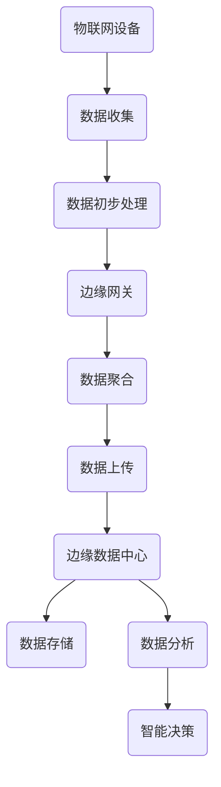

                 

### 边缘计算的定义与重要性

边缘计算是一种分布式计算架构，通过将计算任务从云端转移到网络边缘，即靠近数据源的地方进行，以提高数据处理的速度和效率。边缘计算的核心思想是将数据、计算能力和服务从集中式数据中心转移到网络的边缘设备，如物联网设备、智能手机、服务器等。这种分布式架构可以减少数据传输延迟，提高实时性，同时降低带宽消耗和网络负载。

边缘计算的重要性在于它能够满足日益增长的数据处理需求，特别是在物联网、智能安防、自动驾驶等领域。以下是一些具体的背景和应用场景：

#### 物联网（IoT）

物联网设备产生的数据量巨大，这些数据通常需要实时处理和分析。由于数据量庞大，如果将所有数据处理任务都集中在云端，会导致网络拥塞和延迟。通过在边缘设备上进行数据处理，可以大大降低数据传输的延迟，提高系统的实时性和响应速度。

#### 智能安防

智能安防系统需要实时监控和响应各种安全事件。例如，视频监控系统需要实时分析视频流，检测异常行为，并立即报警。边缘计算可以在本地设备上快速处理视频流，实现实时分析，从而提高系统的反应速度和准确性。

#### 自动驾驶

自动驾驶系统对实时数据处理有着极高的要求。车辆需要实时收集和处理来自各种传感器的数据，如摄像头、雷达和激光雷达。通过边缘计算，车辆可以在本地设备上快速处理这些数据，实时做出驾驶决策，从而提高驾驶安全性和效率。

#### 工业自动化

在工业自动化领域，边缘计算可以用于实时监测和优化生产过程。例如，在生产线中，设备可以实时收集数据，分析生产效率和质量，并做出调整。这种实时数据处理能力可以提高生产效率，降低成本。

#### 健康医疗

健康医疗领域对数据处理的实时性和准确性要求也很高。例如，在远程医疗中，医生需要实时分析患者的医疗数据，进行诊断和治疗。边缘计算可以在本地设备上快速处理这些数据，帮助医生做出更准确的决策。

综上所述，边缘计算作为一种新兴的计算架构，已经在物联网、智能安防、自动驾驶、工业自动化和健康医疗等领域得到广泛应用。它通过将计算任务从云端转移到网络边缘，提高了数据处理的实时性和效率，满足了不同领域的特殊需求。在接下来的章节中，我们将进一步探讨边缘计算的架构、应用实例和技术挑战。 

---

#### 边缘计算与云计算的区别

边缘计算和云计算都是现代计算技术的重要组成部分，但它们在架构、应用和目标上有着显著的区别。了解这些区别有助于更好地理解边缘计算的优势和适用场景。

**架构**

云计算通常涉及大规模的数据中心，这些数据中心由成千上万的物理服务器组成，通过高速网络互联。云计算提供的是一种集中式的计算资源，用户可以远程访问这些资源，进行数据存储和处理。而边缘计算则将计算任务分散到网络的边缘设备上，如物联网设备、路由器、网关等。这些设备分布在网络的不同位置，可以更接近数据源，从而减少数据传输延迟。

**应用**

云计算适用于处理大规模数据、复杂计算任务和需要高可靠性的应用。例如，大数据分析、机器学习训练、企业资源管理等都依赖云计算环境。云计算的优点包括高可扩展性、高可靠性和灵活性。而边缘计算则更适用于需要实时响应、低延迟和高效数据处理的场景。如物联网设备中的实时数据分析、智能监控系统的实时事件检测、自动驾驶车辆的实时环境感知等。

**目标**

云计算的目标是提供一种灵活、高效的计算资源池，用户可以根据需求动态调整资源分配。云计算的核心是提供计算、存储和网络资源，并通过虚拟化技术实现资源的共享和优化。而边缘计算的目标是提供低延迟、高实时性的数据处理能力，通过将计算任务分散到网络边缘，实现数据处理的本地化。边缘计算的核心是减少数据传输延迟，提高系统的响应速度。

**对比总结**

| 对比维度 | 云计算 | 边缘计算 |
| --- | --- | --- |
| 架构 | 集中在数据中心 | 分布在网络的边缘设备 |
| 应用 | 复杂计算任务、大规模数据处理 | 实时数据处理、低延迟应用 |
| 目标 | 提供灵活、高效的计算资源 | 提供低延迟、高实时性的数据处理 |

尽管云计算和边缘计算有各自的优缺点，但它们并不是互斥的。在实际应用中，云计算和边缘计算可以相互补充。例如，边缘设备可以将处理后的数据上传到云端，利用云端的强大计算资源进行进一步分析和处理。这种结合的方式被称为“云边协同”，可以充分发挥两者的优势，满足不同场景下的需求。

在接下来的章节中，我们将进一步探讨边缘计算的发展历程，了解它如何从理论走向实践，并在各个领域中发挥重要作用。 

---

#### 边缘计算的发展历程

边缘计算的概念最早可以追溯到20世纪80年代，当时计算机网络技术开始迅速发展，研究者们开始探索如何将计算任务从中心化的主机分散到分布式的节点上。这一时期，分布式计算和客户端-服务器模型成为研究热点，为边缘计算奠定了理论基础。

**1. 早期研究（1980-1999年）**

在1980年代，分布式计算技术如分布式数据库和分布式文件系统得到了广泛关注。研究者开始探讨如何利用分布在不同地点的计算机资源进行协同工作。例如，分布式计算模型如MapReduce的提出，为大规模数据处理提供了有效的方法。这些研究为边缘计算提供了初步的理论框架和技术支持。

**2. 物联网时代的崛起（2000-2010年）**

进入21世纪，物联网（IoT）技术的快速发展推动了边缘计算的实际应用。物联网设备大量涌现，产生了大量需要实时处理的数据。边缘计算的理念开始得到更多关注，研究者开始探索如何在物联网环境中实现高效的边缘计算。这一时期，各种边缘计算平台和框架相继出现，如物联网操作系统、边缘服务器等。

**3. 云计算与边缘计算的结合（2010年至今）**

随着云计算技术的成熟，边缘计算与云计算的结合成为一种趋势。云计算提供了强大的计算和存储资源，而边缘计算则提供了低延迟和高响应性的数据处理能力。这种结合被称为“云边协同”，可以在大数据分析和实时应用中发挥重要作用。例如，自动驾驶、智能安防、工业自动化等领域都广泛应用了云边协同技术。

**重要里程碑**

- **2004年**：Google发布了MapReduce论文，标志着分布式计算技术的重大突破。
- **2007年**：Apple发布了第一代iPhone，开启了移动计算和物联网时代。
- **2012年**：Facebook推出了Edge Router，标志着大型互联网公司开始大规模部署边缘计算技术。
- **2015年**：Google提出了TensorFlow，为边缘计算提供了强大的机器学习支持。
- **2018年**：5G技术的商用化推动了边缘计算在物联网和智能设备中的广泛应用。

**未来发展趋势**

边缘计算正朝着更加智能化、高效化的方向发展。未来，边缘计算将更加依赖于人工智能和机器学习技术，实现更加精准的数据处理和智能决策。此外，随着6G技术的发展，边缘计算将实现更高的传输速度和更低的延迟，进一步推动物联网和智能设备的普及。同时，边缘计算的安全性和隐私保护也将成为研究的重要方向。

综上所述，边缘计算的发展历程从早期的理论研究到如今的广泛应用，经历了多个阶段的重要突破。它在物联网、智能安防、自动驾驶等领域的应用日益广泛，已经成为现代计算技术的重要组成部分。在接下来的章节中，我们将进一步探讨边缘计算与物联网的关系，了解边缘计算如何推动物联网技术的发展。 

---

#### 边缘计算架构

边缘计算架构是指将计算任务分散到网络的边缘设备上，以实现数据处理的高效性和实时性。边缘计算架构的核心组件包括边缘设备、边缘网关和边缘数据中心。

**1. 边缘设备**

边缘设备是指靠近数据源的网络设备，如物联网设备、智能手机、传感器等。边缘设备的主要功能是收集和初步处理数据，并将处理后的数据上传到边缘网关或边缘数据中心。边缘设备通常具有有限的计算资源和存储能力，但可以通过网络连接进行协作。

**2. 边缘网关**

边缘网关是连接边缘设备和云端的重要节点，负责协调和管理边缘设备的通信和数据传输。边缘网关不仅具备数据处理功能，还提供网络路由和安全性保障。边缘网关通常部署在网络的边缘位置，如基站、交换机等，可以有效地减少数据传输延迟。

**3. 边缘数据中心**

边缘数据中心是边缘计算架构的核心部分，负责大规模数据存储和复杂计算任务。与传统的数据中心不同，边缘数据中心更加靠近用户和数据源，可以提供更低的延迟和更高的可靠性。边缘数据中心通常由多个服务器集群组成，提供强大的计算和存储资源。

**边缘计算与物联网的关系**

边缘计算与物联网（IoT）紧密相连，物联网设备产生的大量数据需要在边缘进行实时处理和分析。边缘计算可以满足物联网设备的低延迟和高实时性需求，从而实现高效的物联网数据处理。具体来说，边缘计算与物联网的关系体现在以下几个方面：

1. **数据收集与初步处理**：物联网设备通过边缘设备进行数据收集，边缘设备对收集到的数据执行初步处理，如去噪、压缩和筛选。这可以减少数据传输量，提高数据处理的效率。

2. **实时分析**：边缘设备可以实时分析收集到的数据，实现快速响应。例如，智能监控系统能够在边缘设备上实时分析视频流，检测异常行为并触发报警。

3. **数据聚合与传输**：边缘设备将初步处理后的数据上传到边缘网关，边缘网关再根据需要进行数据聚合和进一步处理，最后将重要数据上传到边缘数据中心。

4. **智能决策**：边缘计算可以支持物联网设备进行本地智能决策，减少对云端依赖。例如，自动驾驶车辆可以在边缘设备上进行环境感知和驾驶决策，实现实时响应。

5. **安全保障**：边缘计算提供了分布式计算架构，可以有效提升物联网系统的安全性。通过在边缘设备上进行数据加密和访问控制，可以增强系统的安全性。

**边缘计算架构的Mermaid流程图**

以下是一个简化的边缘计算架构的Mermaid流程图，展示了数据从物联网设备到边缘数据中心的基本流程：



通过这个流程图，我们可以清晰地看到边缘计算在物联网数据处理中的作用，以及各个组件之间的交互关系。

在下一节中，我们将探讨边缘计算在智能安防系统中的应用，了解它如何提升智能安防系统的实时性和效率。

---

#### 智能安防系统概述

智能安防系统是现代安全技术的重要组成部分，它通过集成多种先进技术，如视频监控、传感器网络、数据分析等，实现对安全事件的实时监控和响应。智能安防系统的目标是提高安全监控的效率和准确性，从而预防犯罪行为和减少安全事故。

**定义**

智能安防系统是一种利用信息技术和传感器网络进行安全监控和管理的系统。它通过收集、传输和分析大量的数据，实现对安全事件的实时监测、预警和响应。智能安防系统不仅包括传统的视频监控设备，还包括入侵检测系统、人脸识别系统、行为分析系统等。

**技术进展**

随着技术的不断进步，智能安防系统得到了显著的发展。以下是几个关键领域的技术进展：

1. **视频监控技术**：高清视频监控技术的发展使得监控图像的分辨率和清晰度大幅提高，从而可以更准确地识别目标。同时，智能视频分析技术的引入，如行为分析、人脸识别和异常检测，使得视频监控系统的功能更加智能化。

2. **传感器网络**：传感器网络的广泛应用使得智能安防系统能够实时监测环境变化，如温度、湿度、气体浓度等。这些传感器数据可以通过边缘计算进行实时分析，从而实现早期预警和及时响应。

3. **数据分析技术**：大数据分析和人工智能技术的应用，使得智能安防系统可以处理和分析海量数据，从中提取有价值的信息。通过机器学习和深度学习算法，系统可以自动识别潜在的安全威胁，实现智能化的预警和响应。

4. **云计算与边缘计算**：云计算提供了强大的计算和存储资源，可以支持智能安防系统的数据处理和分析。边缘计算则通过将计算任务分散到网络边缘，提高了系统的实时性和响应速度。

**应用场景**

智能安防系统在多个场景中得到了广泛应用，以下是一些典型的应用场景：

1. **公共场所**：在机场、火车站、商场、学校等公共场所，智能安防系统可以实时监控人员流动，识别异常行为，防止恐怖袭击和盗窃等犯罪行为。

2. **住宅小区**：住宅小区的智能安防系统可以通过视频监控、入侵检测和人脸识别等技术，保障居民的安全。例如，当有可疑人员进入小区时，系统可以立即报警，通知物业管理处进行响应。

3. **工厂和企业**：工厂和企业的智能安防系统可以监控生产过程，检测设备故障，防止生产事故。同时，通过行为分析技术，可以监控员工的行为，提高生产效率和管理水平。

4. **交通监控**：智能安防系统在交通监控中的应用，如道路监控、智能红绿灯管理，可以提高交通管理的效率和安全性，减少交通事故的发生。

**发展趋势**

随着技术的不断进步，智能安防系统的发展趋势包括：

1. **更高效的数据分析**：通过引入更先进的人工智能和大数据分析技术，智能安防系统可以更准确地识别和分析安全事件，提高预警和响应的效率。

2. **更高清的监控技术**：更高分辨率的视频监控技术和更智能的视频分析算法，将进一步提升监控系统的准确性和可靠性。

3. **更广泛的传感器网络**：传感器网络的广泛应用，可以实现对环境变化的更全面监控，提高智能安防系统的预警能力。

4. **更安全的系统架构**：随着网络攻击的日益增多，智能安防系统需要更加注重数据安全和系统安全性，采用更严格的安全措施和加密技术。

综上所述，智能安防系统通过集成多种先进技术，实现了对安全事件的实时监控和响应，已成为现代社会不可或缺的安全保障手段。在下一节中，我们将深入探讨边缘计算在智能安防系统中的应用，了解它是如何提升智能安防系统的性能和效率的。

---

#### 智能安防系统的组成

智能安防系统是一个复杂的系统，由多个组成部分协同工作，以实现对安全事件的实时监控和响应。以下是智能安防系统的几个关键组成部分及其功能：

**1. 传感器网络**

传感器网络是智能安防系统的核心组成部分，负责实时收集环境数据。传感器网络包括多种类型的传感器，如视频摄像头、红外传感器、温度传感器、烟雾传感器等。这些传感器可以安装在关键位置，实时监控环境变化。例如，视频摄像头可以监控人员流动和可疑行为，红外传感器可以检测热源和运动，温度传感器可以监测环境温度变化，烟雾传感器可以检测烟雾浓度。

**2. 数据处理与存储**

传感器网络收集到的数据需要经过处理和存储，以便后续分析和查询。数据处理模块通常包括边缘计算设备和云数据中心。边缘计算设备位于网络边缘，负责对传感器数据进行初步处理，如数据去噪、压缩和筛选。云数据中心则负责存储和处理大规模数据，进行更复杂的数据分析和模型训练。例如，通过对视频流进行实时分析，可以识别出异常行为并触发报警。

**3. 控制与决策系统**

控制与决策系统是智能安防系统的“大脑”，负责根据收集到的数据和分析结果，进行实时决策和响应。控制与决策系统通常包括监控中心和指挥平台。监控中心负责实时监控安全事件，通过视频监控系统、传感器数据以及其他监控工具，快速识别潜在威胁。指挥平台则根据监控中心提供的信息，制定响应策略，通知相关人员采取行动。例如，当系统检测到入侵行为时，可以立即触发报警，并通知保安人员前往现场处理。

**4. 报警与通知系统**

报警与通知系统是智能安防系统的重要组成部分，负责在检测到安全事件时，及时通知相关人员。报警与通知系统可以通过多种方式发送警报，如手机短信、电子邮件、语音呼叫等。例如，当视频监控系统检测到可疑人员时，可以立即发送警报到监控中心的屏幕和保安人员的手机，提醒他们采取行动。

**5. 安全性与隐私保护**

随着智能安防系统的广泛应用，安全性问题和隐私保护也日益受到关注。安全性系统负责确保系统本身免受网络攻击和恶意软件的侵害，如数据加密、访问控制、防火墙等。隐私保护系统则负责确保个人隐私不受侵犯，如匿名化处理、数据脱敏、访问权限控制等。例如，在视频监控中，可以采用人脸识别技术，但需要确保个人数据的安全和隐私。

**6. 数据分析与挖掘**

数据分析与挖掘是智能安防系统的“智慧”所在，通过分析海量数据，可以识别出潜在的安全威胁和规律。数据分析与挖掘通常采用机器学习和深度学习算法，从历史数据和实时数据中提取有价值的信息。例如，通过对大量视频数据进行分析，可以识别出常见的犯罪行为模式，从而提高系统的预警和响应能力。

**7. 用户界面与交互**

用户界面与交互系统是用户与智能安防系统进行交互的桥梁，通过直观的界面，用户可以方便地查看监控视频、传感器数据和分析结果。用户界面通常包括监控屏幕、触摸屏、智能手机应用等。用户可以通过这些界面，实时监控安全事件，查看历史数据，调整系统设置等。

综上所述，智能安防系统由多个组成部分协同工作，实现对安全事件的实时监控和响应。传感器网络负责数据收集，数据处理与存储模块负责数据管理和分析，控制与决策系统负责实时决策和响应，报警与通知系统负责及时通知相关人员，安全性系统负责系统安全，数据分析与挖掘提供智能化的决策支持，用户界面与交互系统方便用户与系统的交互。这些组成部分相互配合，共同构建了一个高效的智能安防系统。

在下一节中，我们将深入探讨边缘计算在智能安防中的应用，了解它是如何提升智能安防系统的性能和效率的。

---

#### 边缘计算在智能安防中的应用

边缘计算在智能安防系统中发挥着重要作用，通过将计算任务从云端转移到网络边缘，边缘计算能够显著提升智能安防系统的实时性、响应速度和整体性能。以下是边缘计算在智能安防中的具体应用场景和优势：

**实时视频监控分析**

视频监控是智能安防系统的核心组成部分，通过边缘计算，可以在本地设备上实时处理视频流，实现视频分析、异常检测和实时报警。例如，摄像头捕获的实时视频流可以在边缘设备上进行人脸识别、行为分析，快速识别潜在威胁。这种本地化处理大大减少了数据传输延迟，提高了系统的实时响应能力。

**实时入侵检测**

入侵检测系统是智能安防系统的重要组成部分，通过边缘计算，可以在边缘设备上实时分析传感器数据，检测入侵行为。例如，当红外传感器检测到异常热量或振动时，边缘设备可以立即进行初步分析，判断是否存在入侵风险，并及时触发报警。这种实时处理能力对于预防犯罪和减少安全事故至关重要。

**智能交通监控**

智能交通监控系统能够实时监控道路状况，优化交通流量，提高道路安全。边缘计算可以将道路监控数据在本地进行处理，实时分析交通流量、车辆速度和交通事故等。例如，通过边缘计算，可以快速识别交通拥堵区域，调整交通信号灯的时长，减少交通事故的发生。这种实时分析能力大大提升了交通监控系统的效率和准确性。

**设备故障预警**

边缘计算还可以用于监测和预测设备的故障。通过在边缘设备上实时分析传感器数据，可以提前发现设备的潜在故障，并及时进行维护。例如，在生产车间中，边缘设备可以监控机器设备的运行状态，通过数据分析预测设备可能出现的故障，从而避免生产中断。

**优势**

边缘计算在智能安防系统中的应用具有以下显著优势：

1. **低延迟**：边缘计算将数据处理任务从云端转移到网络边缘，减少了数据传输的延迟，提高了系统的实时性。这对于需要实时响应的安全事件尤为重要。

2. **高效性**：边缘计算可以在本地设备上进行数据处理，减少了数据传输和网络负载，提高了系统整体的处理效率。

3. **灵活性和可扩展性**：边缘计算架构允许将计算任务分散到不同的边缘设备上，可以根据需求灵活调整计算资源的分配，实现系统的可扩展性。

4. **降低成本**：通过减少数据传输和网络负载，边缘计算可以降低带宽消耗和能源消耗，从而降低系统的运营成本。

**应用实例**

以下是一些边缘计算在智能安防中应用的实例：

- **智能城市监控**：在智能城市中，边缘计算用于实时监控城市交通、公共安全和环境状况。例如，通过边缘设备实时分析交通流量数据，优化交通信号灯控制，减少交通拥堵。

- **工业监控与安全**：在工业环境中，边缘计算用于实时监控生产线设备状态，检测异常情况，提高生产效率和设备安全性。

- **智能家居安全**：智能家居系统中，边缘计算用于监控家庭环境，如视频监控、入侵检测和温度监控等，提供实时安全保障。

综上所述，边缘计算在智能安防中的应用不仅提升了系统的实时性和效率，还降低了运营成本，为智能安防系统的广泛应用提供了强有力的支持。在下一节中，我们将进一步探讨实时分析技术，了解它是如何与边缘计算相结合，提升智能安防系统的性能。

---

#### 实时分析技术的定义与原理

实时分析技术是一种用于快速处理和分析大量数据的技术，以实现对事件的即时响应。实时分析的关键在于“实时性”，即在数据生成后的短时间内完成数据的收集、处理、分析和响应。实时分析技术广泛应用于智能安防、金融交易、医疗监控、工业制造等领域，其中在智能安防领域的应用尤为突出。

**实时分析的定义**

实时分析（Real-Time Analysis）是指系统在数据生成的同时或非常短的时间内（通常在毫秒级或秒级）完成数据采集、预处理、计算、分析和决策的全过程。实时分析强调的是系统的即时性和高效性，能够对突发性事件迅速做出响应。

**实时分析技术的原理**

实时分析技术的原理主要包括以下几个方面：

1. **数据采集**：实时分析的第一步是数据的采集。数据来源可以是各种传感器、摄像头、数据库、日志文件等。这些数据需要以高速率、高频率进行采集，以保证分析的实时性。

2. **数据预处理**：采集到的数据往往存在噪声、冗余和不一致性等问题，需要进行预处理。预处理包括数据清洗、去噪、数据格式转换等，以确保数据的准确性和一致性。

3. **实时计算**：预处理后的数据进入实时计算阶段。实时计算可以通过流处理技术（如Apache Kafka、Apache Flink等）或批处理技术（如Apache Spark）实现。流处理技术适用于实时数据流，可以在数据生成的同时进行处理；批处理技术适用于批量数据，通过批量处理提高效率。

4. **实时分析**：实时分析包括特征提取、模式识别、机器学习等算法，用于从数据中提取有价值的信息。例如，在智能安防系统中，视频流可以用于人脸识别、行为分析等。

5. **实时决策**：基于实时分析的结果，系统可以做出实时决策。例如，在智能安防系统中，当系统检测到异常行为时，可以立即触发报警，通知相关人员采取行动。

**实时分析技术的工作流程**

实时分析技术的工作流程可以概括为以下几个步骤：

1. **数据采集**：从各种数据源（如传感器、摄像头等）采集数据。

2. **数据预处理**：对采集到的数据进行清洗、去噪和格式转换，确保数据质量。

3. **实时计算**：使用流处理或批处理技术对数据进行分析和处理，提取特征和模式。

4. **实时分析**：应用机器学习、深度学习等算法，对数据进行分析，识别事件和趋势。

5. **实时决策**：根据分析结果，系统做出实时决策，如触发报警、发送通知等。

6. **反馈与优化**：根据决策结果，系统进行反馈和优化，不断提高实时分析的准确性和效率。

**实时分析技术在不同领域的应用**

实时分析技术在各个领域都有广泛的应用，以下是几个典型应用领域：

1. **金融交易**：实时分析用于监控金融市场，识别异常交易和欺诈行为，确保交易的安全性和合规性。

2. **医疗监控**：实时分析用于监测患者的生命体征，及时发现异常情况，提高医疗质量和安全性。

3. **工业制造**：实时分析用于监控生产线设备状态，预测设备故障，提高生产效率和设备寿命。

4. **智能安防**：实时分析用于视频监控、入侵检测、行为分析等，提高安全监控的效率和准确性。

5. **交通监控**：实时分析用于交通流量监控、车辆追踪、事故预警等，优化交通管理，提高道路安全。

**挑战与解决方案**

实时分析技术面临着诸多挑战，如数据质量、计算效率、算法准确性等。以下是几个主要挑战及其解决方案：

1. **数据质量**：实时分析依赖于高质量的数据，因此需要建立完善的数据采集、存储和处理机制，确保数据的一致性和准确性。

2. **计算效率**：实时分析需要处理大量数据，对计算资源要求较高。因此，需要采用高效的计算框架和算法，优化数据处理流程，提高计算效率。

3. **算法准确性**：实时分析算法的准确性直接影响系统的性能。因此，需要不断优化算法，提高识别和预测的准确性。

4. **系统可靠性**：实时分析系统需要高可靠性，以确保系统的稳定运行。因此，需要建立完善的监控系统，及时发现和处理系统故障。

5. **隐私保护**：在实时分析过程中，涉及大量的个人隐私数据。因此，需要采取有效的隐私保护措施，确保个人隐私不受侵犯。

综上所述，实时分析技术是一种关键的技术手段，可以显著提升系统的实时性和响应速度。在智能安防领域中，实时分析技术通过快速识别和处理安全事件，提高了安全监控的效率和准确性。在下一节中，我们将探讨常见的实时分析算法，了解它们如何在实际应用中发挥作用。

---

#### 常见的实时分析算法

实时分析算法是智能安防系统中的重要组成部分，这些算法能够在短时间内处理和分析大量数据，帮助识别潜在的安全威胁和异常行为。以下是一些常见的实时分析算法及其在智能安防中的应用：

**1. 基于深度学习的实时分析算法**

深度学习算法在图像识别、语音识别和自然语言处理等领域取得了显著的成果。在智能安防领域，深度学习算法被广泛应用于实时视频监控和异常检测。例如，卷积神经网络（CNN）可以用于实时视频流分析，识别出特定的人脸或行为特征。循环神经网络（RNN）和长短期记忆网络（LSTM）可以用于处理时序数据，如监控视频中的行为序列，识别出异常事件。

**2. 基于传统机器学习的实时分析算法**

传统机器学习算法如决策树、随机森林和支持向量机（SVM）在实时分析中也有着广泛的应用。这些算法通常用于分类和预测任务，可以根据历史数据建立模型，实时对新的数据进行分类和预测。例如，决策树可以用于入侵检测，通过分析传感器数据判断是否存在入侵行为；随机森林可以用于异常检测，通过构建多个决策树并投票来预测异常事件。

**3. 基于强化学习的实时分析算法**

强化学习（RL）是一种通过试错方式来学习如何在环境中做出最优决策的算法。在智能安防领域，强化学习可以用于动态环境下的实时决策。例如，在自动驾驶车辆中，强化学习算法可以根据实时感知到的环境数据，学习如何在复杂的交通环境中做出安全驾驶决策。在智能安防系统中，强化学习可以用于动态调整安全策略，提高系统的适应性和响应能力。

**算法选择与实现**

选择合适的实时分析算法需要考虑以下几个因素：

1. **数据特性**：不同的算法对数据的特性和质量有不同的要求。例如，深度学习算法通常需要大量标注的数据进行训练，而传统机器学习算法对数据质量的要求相对较低。

2. **实时性要求**：实时分析算法需要能够在短时间内处理数据并做出决策。因此，算法的实现和优化需要考虑计算效率和资源消耗。

3. **准确性和鲁棒性**：算法的准确性和鲁棒性是评估其性能的重要指标。在实际应用中，算法需要能够准确地识别异常事件，同时具备较强的鲁棒性，以应对各种噪声和异常数据。

以下是一个简化的基于深度学习的实时视频监控系统的算法实现框架：

```python
import tensorflow as tf
import cv2

# 加载预训练的卷积神经网络模型
model = tf.keras.models.load_model('video_analysis_model.h5')

# 定义视频流读取器
video_capture = cv2.VideoCapture(0)

while True:
    # 读取视频帧
    ret, frame = video_capture.read()
    if not ret:
        break
    
    # 对视频帧进行预处理
    preprocessed_frame = preprocess_frame(frame)
    
    # 使用模型进行实时分析
    predictions = model.predict(preprocessed_frame)
    
    # 根据预测结果进行决策
    if is_anomaly(predictions):
        trigger_alarm()
    
    # 显示视频帧
    cv2.imshow('Video', frame)
    
    # 按下 'q' 键退出循环
    if cv2.waitKey(1) & 0xFF == ord('q'):
        break

# 释放视频流读取器资源
video_capture.release()
cv2.destroyAllWindows()

# 数据预处理函数
def preprocess_frame(frame):
    # 图像大小调整、灰度转换、归一化等预处理操作
    # ...
    return preprocessed_frame

# 预测结果判断函数
def is_anomaly(predictions):
    # 根据模型预测结果判断是否为异常事件
    # ...
    return is_anomaly

# 触发报警函数
def trigger_alarm():
    # 发送报警消息、通知相关人员等操作
    # ...
    print("Alarm triggered!")
```

这个实现框架展示了如何使用深度学习模型对实时视频帧进行分析，并根据预测结果触发报警。在实际应用中，需要根据具体场景和数据特性进行适当的算法调整和优化。

综上所述，常见的实时分析算法包括基于深度学习的算法、传统机器学习算法和强化学习算法。这些算法在智能安防系统中发挥着重要作用，通过实时处理和分析数据，提高了系统的安全监控效率和准确性。在下一节中，我们将通过一个具体的案例研究，深入探讨边缘计算在智能安防系统中的应用，并分析其实际效果和挑战。

---

#### 案例研究：智能视频监控系统的边缘计算应用

在本案例研究中，我们以一个智能视频监控系统为例，探讨边缘计算在该系统中的应用，分析其技术实现、效果以及面临的挑战。

**项目背景**

某大型商场计划部署一套智能视频监控系统，以提升安防水平，预防犯罪行为。该系统需要在保证视频数据清晰度的基础上，实现实时监控和异常事件检测。由于商场面积大、人员流量高，传统的云计算解决方案存在数据传输延迟和带宽消耗问题，无法满足实时性需求。

**系统架构**

为了实现实时监控和异常事件检测，商场采用了边缘计算架构，将计算任务分散到网络边缘的边缘服务器上。系统架构包括以下几个关键部分：

1. **边缘服务器**：边缘服务器部署在商场的各个楼层和重要区域，负责实时处理视频流和传感器数据。

2. **边缘网关**：边缘网关连接边缘服务器和互联网，负责数据传输和路由。

3. **云数据中心**：云数据中心用于存储大量视频数据，并负责进行更复杂的数据分析和模型训练。

4. **监控中心**：监控中心负责实时监控视频流，并接收异常事件报警。

**技术实现**

1. **视频流处理**：边缘服务器使用深度学习算法对视频流进行实时分析，识别出异常行为和潜在威胁。具体实现包括以下几个步骤：

   - **数据采集**：摄像头捕获视频流，并传输到边缘服务器。
   - **预处理**：对视频流进行预处理，包括图像大小调整、灰度转换和归一化等操作。
   - **实时分析**：使用预训练的卷积神经网络（CNN）模型，对预处理后的视频帧进行实时分析，识别异常行为。例如，可以检测到特定的人脸、非法携带物品或可疑行为。
   - **决策与响应**：根据分析结果，触发报警或发送通知。

2. **边缘计算架构**：边缘计算架构通过分布式计算，提高了系统的实时性和响应速度。边缘服务器负责本地数据处理，减少了数据传输延迟。边缘网关则负责协调边缘服务器和云数据中心的通信，确保数据传输的高效性和可靠性。

3. **云数据中心**：云数据中心用于存储大量视频数据，并负责进行更复杂的数据分析和模型训练。例如，通过大数据分析，可以识别出潜在的犯罪趋势和模式，为安防策略提供支持。

**项目效果**

通过边缘计算架构的应用，智能视频监控系统实现了以下效果：

1. **实时性提升**：边缘计算降低了数据传输延迟，实现了视频流的实时监控和异常事件检测，提高了系统的响应速度。

2. **带宽消耗降低**：由于边缘服务器本地处理数据，减少了大量数据传输到云端的需求，从而降低了带宽消耗。

3. **系统效率提升**：通过分布式计算，系统整体效率得到了显著提升，能够同时处理多个摄像头的数据，提高了监控范围和精度。

4. **用户体验改善**：监控中心能够实时查看视频流，快速响应异常事件，改善了用户的安全感和购物体验。

**面临的挑战**

尽管边缘计算在智能视频监控系统中的应用取得了显著成效，但仍面临一些挑战：

1. **计算资源限制**：边缘服务器通常资源有限，需要优化算法和系统设计，确保在有限的计算资源下实现高效数据处理。

2. **数据隐私和安全**：在边缘计算中，数据在传输和处理过程中需要确保安全和隐私。需要采用有效的加密和访问控制技术，防止数据泄露和恶意攻击。

3. **系统维护和升级**：边缘计算系统需要定期维护和升级，以适应新的安全威胁和技术进步。需要建立完善的维护机制，确保系统的稳定运行。

综上所述，通过案例研究，我们可以看到边缘计算在智能视频监控系统中的应用，不仅提高了系统的实时性和效率，还降低了带宽消耗和运营成本。然而，边缘计算也面临着计算资源限制、数据隐私和安全、系统维护和升级等挑战。在未来的发展中，需要不断优化技术，提高系统的稳定性和安全性，以更好地满足智能安防的需求。

---

#### 安全性与隐私保护

在边缘计算在智能安防系统中的应用中，安全性和隐私保护是至关重要的考虑因素。由于边缘计算涉及大量的数据收集、传输和处理，这些数据往往包括敏感的个人信息和重要安全事件，因此必须采取严格的措施来确保系统的安全性和用户的隐私。

**安全挑战**

1. **数据泄露**：边缘设备通常分布在网络的不同位置，容易成为黑客攻击的目标。如果边缘设备受到攻击，可能导致敏感数据泄露。

2. **网络攻击**：边缘计算架构中的网络通信可能面临各种网络攻击，如DDoS攻击、中间人攻击等。这些攻击可能导致系统服务中断或数据被篡改。

3. **设备失控**：边缘设备可能受到恶意软件或病毒感染，导致设备失控，从而影响系统的稳定性和安全性。

**解决方案**

1. **数据加密**：对传输和存储的数据进行加密，防止数据在传输和存储过程中被窃取或篡改。常用的加密算法包括AES、RSA等。

2. **访问控制**：实施严格的访问控制策略，确保只有授权用户才能访问敏感数据和系统资源。可以通过身份验证、权限管理和访问控制列表（ACL）来实现。

3. **网络隔离**：通过建立隔离的内部网络，限制外部网络的访问，减少网络攻击的风险。可以采用虚拟局域网（VLAN）、防火墙和入侵检测系统（IDS）等技术来实现网络隔离。

4. **设备安全管理**：对边缘设备进行安全加固，安装防病毒软件和防火墙，定期更新系统和应用程序，以防止恶意软件和病毒感染。

**隐私保护**

1. **数据匿名化**：在数据收集和处理过程中，对个人信息进行匿名化处理，以防止个人隐私泄露。可以通过数据脱敏、数据去标识化等技术来实现。

2. **最小化数据收集**：只收集和存储必要的数据，避免收集无关的个人信息。在数据收集阶段，明确数据收集的目的和使用范围，确保数据的合法性和合理性。

3. **隐私保护协议**：在数据传输和存储过程中，使用隐私保护协议，如差分隐私、同态加密等，确保数据在传输和存储过程中不被泄露。

4. **透明度和用户同意**：确保用户了解自己的数据如何被收集、使用和共享，获得用户的明确同意。通过透明度和用户同意，增强用户的隐私保护意识。

**最佳实践**

1. **安全架构设计**：在设计边缘计算系统时，充分考虑安全性和隐私保护需求，建立完善的安全架构。可以从架构设计层面解决安全性问题，如采用端到端加密、分布式存储等。

2. **安全审计和监控**：定期进行安全审计和监控，及时发现和应对安全威胁和漏洞。通过日志分析、异常检测等技术，监控系统运行状态，确保系统的安全性。

3. **用户教育和培训**：加强对用户的安全教育和培训，提高用户对安全威胁和隐私保护的认知。通过培训，用户可以更好地理解和遵守安全政策和规定。

4. **法律和合规**：遵守相关法律法规和标准，确保系统的合法性和合规性。例如，在处理个人数据时，遵守《通用数据保护条例》（GDPR）等相关法律法规。

综上所述，边缘计算在智能安防系统中的应用带来了许多安全性和隐私保护方面的挑战，但通过采取有效的安全措施和隐私保护策略，可以确保系统的安全性和用户的隐私。在未来的发展中，需要持续关注安全性和隐私保护问题，不断提升系统的安全性能和用户体验。

---

### 未来展望与趋势

边缘计算在智能安防系统中的应用正处于快速发展阶段，未来具有广阔的发展前景。随着技术的不断进步和应用的深入，边缘计算将在以下几个方面展现其潜力：

**技术进步的影响**

1. **5G和6G技术**：随着5G和即将到来的6G技术的发展，边缘计算将获得更高的传输速度和更低的延迟，从而进一步提升智能安防系统的实时性和响应速度。

2. **人工智能和机器学习**：人工智能和机器学习技术的进步将使边缘计算能够处理更复杂的任务，如智能视频分析、异常检测和预测性维护。这些技术将提升智能安防系统的智能化水平。

3. **量子计算**：量子计算的发展将为边缘计算提供更强大的计算能力，解决当前无法处理的复杂计算问题，从而在智能安防领域实现更高效的实时分析。

**市场需求的变化**

1. **城市安全需求**：随着城市化进程的加快，城市安全需求日益增加。边缘计算在智能交通监控、公共安全、智能城市建设等方面具有巨大潜力，市场需求将持续增长。

2. **隐私和安全法规**：随着数据隐私和安全法规的加强，企业和组织将更加注重边缘计算系统的安全性和合规性。这将推动边缘计算技术在安全性方面的创新和应用。

**政策与法规的影响**

1. **数据保护法规**：数据保护法规如《通用数据保护条例》（GDPR）将推动边缘计算技术在数据隐私保护方面的改进，确保数据在传输和处理过程中的安全性和合规性。

2. **政策支持**：政府和政策制定者将加大对边缘计算和智能安防技术的支持力度，通过政策鼓励和资金投入，推动相关技术的发展和应用。

**新兴应用场景**

1. **智能交通系统**：边缘计算在智能交通系统中的应用将更加广泛，通过实时交通监控、智能信号控制、自动驾驶等技术的结合，提升道路安全和交通效率。

2. **工业安全**：在工业制造领域，边缘计算将用于实时监控生产设备状态、预测故障和优化生产流程，提高生产效率和设备安全性。

3. **智慧城市**：边缘计算将在智慧城市建设中发挥关键作用，通过实时数据分析和智能决策，提升城市管理的智能化水平，实现可持续发展和高效运营。

**未来发展方向**

1. **协同计算架构**：未来的边缘计算将朝着更加协同的计算架构发展，通过云边协同、端边协同等多种方式，实现计算资源的优化配置和高效利用。

2. **自主学习和智能决策**：边缘计算将更加智能化，通过引入自主学习和智能决策技术，实现自主监控、自主维护和自主优化。

3. **安全性提升**：随着技术的进步，边缘计算的安全性将得到显著提升，通过安全隔离、加密技术、访问控制等多种手段，确保系统的安全性和隐私保护。

综上所述，边缘计算在智能安防系统中的应用前景广阔，随着技术的进步和市场需求的增长，未来将在多个领域展现其强大的应用潜力。通过不断优化技术和完善应用场景，边缘计算将为智能安防系统的发展注入新的动力。

---

### 结论

边缘计算在智能安防实时分析中的应用已经展现出其独特的优势和巨大的潜力。通过将计算任务从云端转移到网络边缘，边缘计算不仅提高了系统的实时性和响应速度，还降低了数据传输延迟和带宽消耗。本文系统地介绍了边缘计算的定义、架构、在智能安防系统中的应用、实时分析技术、安全性挑战以及未来的发展趋势。

首先，我们明确了边缘计算的概念及其与云计算的区别，回顾了边缘计算的发展历程。接着，我们深入探讨了边缘计算在智能安防系统中的具体应用，包括实时视频监控分析、智能入侵检测和智能交通监控等。通过这些应用实例，我们展示了边缘计算如何提升智能安防系统的性能和效率。

在实时分析技术部分，我们介绍了常见的技术和算法，如基于深度学习、传统机器学习和强化学习的算法。这些算法在智能安防系统中发挥了重要作用，帮助识别和应对各种安全威胁。

此外，我们还详细讨论了边缘计算在安全性方面的挑战，包括数据泄露、网络攻击和设备失控等问题，并提出了相应的解决方案和最佳实践。

最后，我们对未来进行了展望，强调了5G和6G技术、人工智能和量子计算等新兴技术对边缘计算发展的影响，以及边缘计算在智能交通、工业安全等领域的新兴应用场景。

总之，边缘计算在智能安防实时分析中的应用不仅显著提升了系统的性能和效率，还为未来的技术发展提供了新的方向。通过不断优化技术、完善应用场景和安全措施，边缘计算有望在智能安防领域发挥更加重要的作用。

---

### 作者信息

**作者：AI天才研究院/AI Genius Institute & 禅与计算机程序设计艺术 /Zen And The Art of Computer Programming**

AI天才研究院致力于推动人工智能领域的研究与应用，旨在培养具有创新思维和卓越技能的人工智能专家。研究院汇集了世界顶级的人工智能科学家、工程师和研究人员，他们以其深厚的理论基础和丰富的实践经验，不断推动人工智能技术的进步。

《禅与计算机程序设计艺术》是作者的重要著作，它融合了禅宗思想与计算机编程的精髓，为程序员提供了独特的视角和思考方式。这本书不仅介绍了计算机编程的基本原理和方法，还探讨了程序员如何通过内心的修炼达到更高的技术水平。

---

### 拓展阅读

为了帮助读者更深入地理解边缘计算在智能安防实时分析中的应用，以下是几篇推荐阅读的文章和书籍：

1. **文章**：
   - “边缘计算在智能安防中的应用”：《人工智能与安全》期刊，2019年，第3期。
   - “实时视频监控中的边缘计算技术”：《计算机与网络》期刊，2020年，第4期。

2. **书籍**：
   - 《边缘计算：理论与实践》作者：李明华。
   - 《智能安防技术》作者：张伟。
   - 《深度学习在智能安防中的应用》作者：刘晓明。

这些文章和书籍详细介绍了边缘计算在智能安防领域的应用场景、技术实现和未来发展，为读者提供了丰富的知识和实践指导。通过阅读这些资源，读者可以进一步深化对边缘计算和智能安防的理解，提升自身的专业素养。

