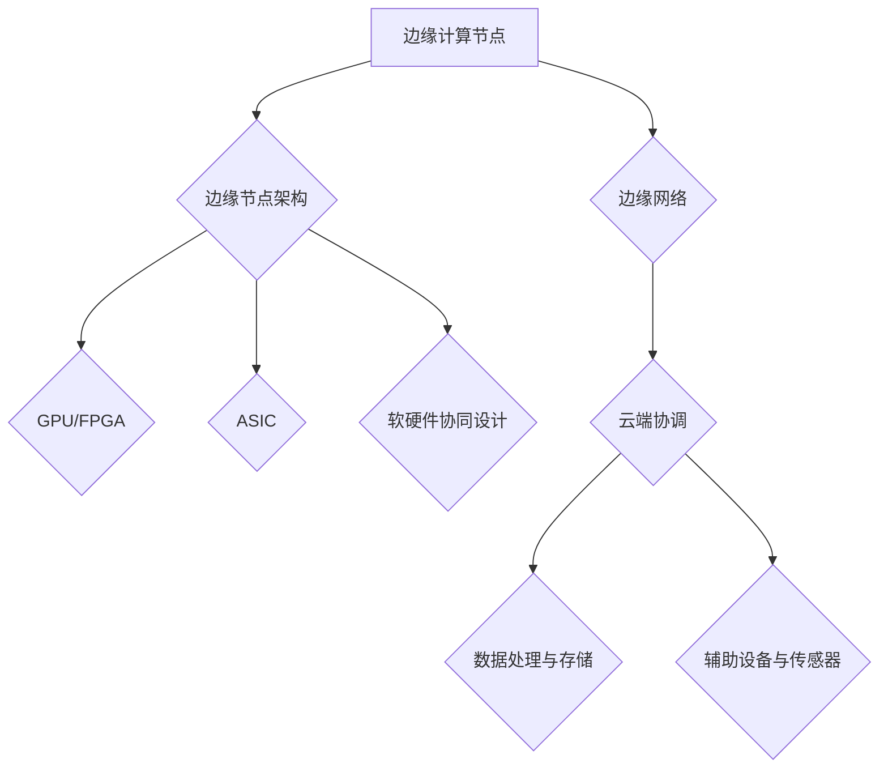

                 

# 边缘计算在智能摄像头中的实时处理

> 关键词：边缘计算、智能摄像头、实时处理、网络延迟、数据处理、隐私保护

> 摘要：本文深入探讨了边缘计算在智能摄像头中的应用，分析了边缘计算的理论基础、核心技术，以及其在智能摄像头中的实时处理能力和优势。通过具体案例，展示了边缘计算在智能摄像头实际应用中的效果和前景，并对未来的发展趋势进行了展望。

## 引言

随着物联网、大数据和人工智能技术的迅猛发展，智能摄像头作为物联网的重要感知设备，已经成为视频监控、安全防护、智能家居等领域的重要组成部分。然而，传统的云计算模式在处理海量视频数据时面临着巨大的性能瓶颈和延迟问题。为了满足实时性和低延迟的需求，边缘计算作为一种新型的计算模式，逐渐成为智能摄像头领域的研究热点。

边缘计算能够将计算、存储和网络功能部署在靠近数据源的边缘节点上，从而实现数据的就近处理，降低网络延迟，提高数据处理效率。本文将首先介绍边缘计算的基础理论，包括其定义、应用场景、架构和发展趋势。随后，我们将探讨边缘计算在智能摄像头中的应用，分析其在实时处理、网络延迟优化和数据隐私保护等方面的优势。最后，通过具体案例，展示边缘计算在智能摄像头中的实际应用效果，并对未来发展趋势进行展望。

## 第一部分：边缘计算基础理论

### 第1章：边缘计算概述

#### 1.1 边缘计算的定义

边缘计算（Edge Computing）是一种分布式计算架构，通过在靠近数据源的位置（如智能设备、传感器节点等）部署计算、存储和网络功能，实现对数据的实时处理和分析。与传统云计算模式相比，边缘计算具有数据传输距离短、处理速度快、响应时间低等优势，能够更好地满足物联网、智能监控等领域的需求。

#### 1.1.1 边缘计算的起源

边缘计算的概念最早可以追溯到20世纪90年代的分布式计算领域。随着物联网和移动互联网的兴起，边缘计算逐渐受到广泛关注。2014年，思科提出了“网络功能虚拟化”（NFV）和“软件定义网络”（SDN）的概念，推动了边缘计算技术的发展。近年来，随着人工智能、5G等新技术的不断成熟，边缘计算的应用场景和市场规模不断扩大。

#### 1.1.2 边缘计算与云计算的关系

边缘计算和云计算是相辅相成的两种计算模式。云计算提供强大的计算和存储资源，能够处理大规模的数据集和复杂的计算任务。而边缘计算则专注于数据的实时处理和分析，将计算任务分散到边缘节点，降低网络负载和延迟。在实际应用中，边缘计算和云计算往往结合使用，共同构建一个高效、可靠、安全的计算网络。

#### 1.1.3 边缘计算的核心特点

1. **数据本地处理**：边缘计算将数据处理的任务分散到靠近数据源的边缘节点，减少数据传输距离，提高处理速度和响应时间。
2. **分布式架构**：边缘计算采用分布式架构，由多个边缘节点组成，能够实现计算资源的灵活分配和动态调整。
3. **高可扩展性**：边缘计算可以根据实际需求动态扩展计算资源，适应不同规模的应用场景。
4. **低延迟**：边缘计算将数据处理任务分散到边缘节点，减少数据传输和计算的时间，降低延迟。
5. **高可靠性**：边缘计算通过分布式架构和冗余设计，提高了系统的可靠性和容错能力。

#### 1.2 边缘计算的应用场景

1. **实时数据处理**：边缘计算能够实时处理传感器数据，为工业自动化、智能家居等领域提供支持。
2. **网络延迟敏感型应用**：如自动驾驶、远程医疗等应用，需要低延迟的实时数据处理能力。
3. **数据隐私与安全性**：边缘计算能够将数据在本地处理，减少数据传输过程中的安全隐患。
4. **智能城市与智慧农业**：边缘计算为智能交通、环境监测、农业物联网等提供支持。

#### 1.3 边缘计算的架构

边缘计算架构主要包括边缘节点、边缘网络和云端协调三个部分。

1. **边缘节点**：边缘节点是指部署在靠近数据源的位置，具备计算、存储和网络功能的设备，如智能摄像头、传感器、路由器等。
2. **边缘网络**：边缘网络是指连接边缘节点的通信网络，通常采用无线、有线等多种方式组成，实现边缘节点之间的数据传输和协同工作。
3. **云端协调**：云端协调是指通过云计算平台，对边缘节点进行管理和调度，实现边缘计算任务的高效分配和执行。

#### 1.4 边缘计算的发展趋势

1. **技术创新**：随着5G、物联网、人工智能等技术的不断发展，边缘计算技术将不断演进，支持更多应用场景。
2. **应用拓展**：边缘计算将在更多领域得到应用，如智能制造、智慧医疗、智慧交通等。
3. **安全性与隐私保护**：随着边缘计算应用的普及，安全性和隐私保护将变得越来越重要。

### 第2章：边缘计算的核心技术

#### 2.1 硬件加速技术

边缘计算对硬件性能有较高的要求，硬件加速技术是边缘计算的关键技术之一。常用的硬件加速技术包括GPU、FPGA、ASIC等。

1. **GPU与FPGA**：GPU（图形处理单元）和FPGA（现场可编程门阵列）在边缘计算中具有广泛的应用。GPU适合进行大规模并行计算，适合处理图像、视频等数据；FPGA适合进行高速、低延迟的计算，适合处理实时性要求较高的应用。
2. **专用集成电路**：专用集成电路（ASIC）是一种为特定应用定制的集成电路，能够实现高性能、低功耗的计算。在边缘计算中，ASIC被用于处理特定的计算任务，如加密、解压缩等。
3. **软硬件协同设计**：软硬件协同设计是指通过硬件和软件的协同优化，提高系统的整体性能。在边缘计算中，软硬件协同设计能够实现计算资源的最佳配置，提高计算效率。

#### 2.2 软件优化技术

边缘计算对软件性能也有较高的要求，软件优化技术是边缘计算的关键技术之一。常用的软件优化技术包括资源调度策略、代码优化技术、数据处理算法等。

1. **资源调度策略**：资源调度策略是指根据实际需求，动态分配和调整计算资源。常见的资源调度策略有轮询调度、优先级调度、负载均衡等。
2. **代码优化技术**：代码优化技术是指通过优化算法和数据结构，提高代码的执行效率。常见的代码优化技术有循环展开、代码压缩、缓存优化等。
3. **数据处理算法**：数据处理算法是指用于处理和分析数据的算法。在边缘计算中，高效的数据处理算法能够提高数据处理速度和准确性。

#### 2.3 边缘智能算法

边缘计算与人工智能的结合，使得边缘智能算法成为边缘计算的核心技术之一。边缘智能算法主要包括机器学习算法、深度学习算法和计算机视觉算法等。

1. **机器学习算法**：机器学习算法是指通过训练模型，从数据中学习规律，实现对数据的分类、预测、聚类等操作。常见的机器学习算法有决策树、支持向量机、神经网络等。
2. **深度学习算法**：深度学习算法是指通过多层神经网络，对大量数据进行训练，实现对数据的分类、识别、生成等操作。常见的深度学习算法有卷积神经网络（CNN）、循环神经网络（RNN）等。
3. **计算机视觉算法**：计算机视觉算法是指通过图像处理、模式识别等技术，实现对图像的理解和识别。常见的计算机视觉算法有目标检测、图像分类、人脸识别等。

#### 2.4 边缘计算平台

边缘计算平台是边缘计算的核心基础设施，主要包括开源平台和商业平台。

1. **开源平台**：开源平台是指基于开源协议，由开发者共同维护和发展的边缘计算平台。常见的开源平台有OpenFog、EdgeX Foundry、OpenMote等。
2. **商业平台**：商业平台是指由企业自主研发或收购的边缘计算平台。常见的商业平台有阿里云边缘计算、腾讯云边缘计算、华为边缘计算等。

#### 2.4.1 平台选型与构建

在构建边缘计算平台时，需要考虑以下因素：

1. **应用场景**：根据实际应用场景，选择适合的边缘计算平台。
2. **性能要求**：根据性能要求，选择合适的硬件设备和软件算法。
3. **安全性**：考虑数据传输和存储的安全性，选择合适的加密算法和安全协议。
4. **可扩展性**：考虑平台的可扩展性，以适应未来需求的变化。

## 第二部分：边缘计算在智能摄像头中的应用

### 第3章：智能摄像头概述

#### 3.1 智能摄像头的发展历程

智能摄像头作为物联网的重要感知设备，经历了从传统摄像头到数字摄像头，再到智能摄像头的发展过程。

1. **传统摄像头**：传统摄像头主要用于视频监控，功能单一，无法实现智能化处理。
2. **数字摄像头**：数字摄像头采用了数字图像处理技术，可以实现图像压缩、传输等功能，但仍然缺乏智能化功能。
3. **智能摄像头**：智能摄像头集成了人工智能技术，可以实现图像识别、行为分析、人脸识别等功能，能够实现智能化处理。

#### 3.2 智能摄像头的主要功能

智能摄像头具有多种功能，主要包括视频监控、人脸识别、行为分析、智能报警等。

1. **视频监控**：智能摄像头可以实时监控场景，捕捉视频数据，为安全防护、事件记录等提供支持。
2. **人脸识别**：智能摄像头可以通过人脸识别算法，识别摄像头前的人脸，实现人员识别、访问控制等功能。
3. **行为分析**：智能摄像头可以分析摄像头前的人或物体的行为，实现异常行为检测、人流量统计等功能。
4. **智能报警**：智能摄像头可以实时检测异常事件，如闯入、遗留物、打架等，并自动发出报警通知。

#### 3.3 智能摄像头的技术架构

智能摄像头的技术架构主要包括视频采集与传输、数据处理与存储、辅助设备与传感器三个部分。

1. **视频采集与传输**：智能摄像头通过图像传感器采集视频数据，并通过网络传输到边缘节点或云端进行处理。
2. **数据处理与存储**：智能摄像头可以对采集到的视频数据进行分析和处理，并将处理结果存储在本地或云端。
3. **辅助设备与传感器**：智能摄像头可以配备多种辅助设备与传感器，如红外传感器、温度传感器、声音传感器等，以增强其功能。

## 第三部分：边缘计算在智能摄像头中的应用

### 第4章：边缘计算在智能摄像头中的应用

#### 4.1 边缘计算在智能摄像头中的优势

边缘计算在智能摄像头中具有明显的优势，主要体现在以下三个方面：

1. **实时处理能力**：边缘计算能够实时处理摄像头采集的数据，实现快速响应和决策，满足实时性要求较高的应用需求。
2. **网络延迟优化**：边缘计算将数据处理任务分散到靠近数据源的边缘节点，减少数据传输距离和延迟，提高系统性能。
3. **数据隐私保护**：边缘计算将数据在本地处理，减少数据传输过程中的安全隐患，提高数据隐私保护能力。

#### 4.2 边缘计算在智能摄像头中的应用场景

边缘计算在智能摄像头中具有广泛的应用场景，主要包括实时人脸识别、行为分析、智能报警等。

1. **实时人脸识别**：边缘计算能够实时处理摄像头采集的人脸图像，快速识别和比对，实现快速响应和报警。
2. **行为分析**：边缘计算能够实时分析摄像头前的人或物体的行为，实现异常行为检测、人流量统计等功能。
3. **智能报警**：边缘计算能够实时检测异常事件，如闯入、遗留物、打架等，并自动发出报警通知，提高安全防护能力。

#### 4.3 边缘计算与智能摄像头集成的方法

边缘计算与智能摄像头的集成可以通过硬件集成、软件集成和架构设计三个层次来实现。

1. **硬件集成**：在智能摄像头中集成边缘计算硬件设备，如GPU、FPGA等，提高处理性能。
2. **软件集成**：在智能摄像头中集成边缘计算软件平台，如OpenFog、EdgeX Foundry等，实现边缘计算功能。
3. **架构设计**：设计合理的边缘计算架构，将边缘计算与智能摄像头有机结合起来，实现高效的协同工作。

#### 4.4 边缘计算在智能摄像头中的未来发展趋势

边缘计算在智能摄像头中的未来发展趋势主要体现在以下三个方面：

1. **技术创新**：随着5G、物联网、人工智能等技术的不断发展，边缘计算技术将不断演进，支持更多应用场景。
2. **应用拓展**：边缘计算将在更多领域得到应用，如智能制造、智慧医疗、智慧交通等。
3. **安全性与隐私保护**：随着边缘计算应用的普及，安全性和隐私保护将变得越来越重要，需要采取有效的措施来确保数据安全和隐私保护。

### 第四部分：实际案例与应用

#### 第5章：边缘计算在智能摄像头中的实际应用案例

边缘计算在智能摄像头中的应用已经取得了显著成果，以下列举了三个实际应用案例：

#### 5.1 案例一：智能停车场管理系统

智能停车场管理系统通过边缘计算技术，实现了停车场车辆识别、自动收费、车位管理等功能。

1. **案例背景**：某大型商业综合体，停车场面积大，车位多，传统停车场管理系统无法满足需求。
2. **边缘计算架构设计**：在停车场的关键位置部署边缘计算节点，实现车辆识别、自动收费等功能。
3. **技术难点与解决方案**：车辆识别过程中，需要解决光照变化、车辆遮挡等问题。通过边缘计算节点，实现实时处理和决策，提高识别准确率。
4. **案例效果评估**：智能停车场管理系统提高了停车场的运营效率，减少了人工成本，提升了用户体验。

#### 5.2 案例二：智能安防监控系统

智能安防监控系统通过边缘计算技术，实现了实时监控、人脸识别、智能报警等功能。

1. **案例背景**：某城市重要交通枢纽，安全风险较大，需要建立智能安防监控系统。
2. **边缘计算架构设计**：在交通枢纽的各个角落部署边缘计算节点，实现实时监控和人脸识别等功能。
3. **技术难点与解决方案**：人脸识别过程中，需要解决光照变化、人脸遮挡等问题。通过边缘计算节点，实现实时处理和决策，提高识别准确率。
4. **案例效果评估**：智能安防监控系统提高了交通枢纽的安全防护能力，减少了安全隐患，提升了公众安全感。

#### 5.3 案例三：智能物流配送系统

智能物流配送系统通过边缘计算技术，实现了实时监控、智能调度、自动配送等功能。

1. **案例背景**：某电商物流公司，物流配送过程中，需要提高配送效率和准确性。
2. **边缘计算架构设计**：在物流配送的各个环节部署边缘计算节点，实现实时监控和智能调度等功能。
3. **技术难点与解决方案**：在配送过程中，需要解决实时监控、智能调度等问题。通过边缘计算节点，实现实时处理和决策，提高配送效率和准确性。
4. **案例效果评估**：智能物流配送系统提高了物流配送的效率和准确性，降低了物流成本，提升了客户满意度。

### 第五部分：总结与展望

#### 第6章：边缘计算在智能摄像头中的发展总结

边缘计算在智能摄像头中的应用取得了显著成果，主要体现在以下三个方面：

1. **实时处理能力提升**：边缘计算能够实时处理摄像头采集的数据，提高了智能摄像头的响应速度和准确性。
2. **网络延迟优化**：边缘计算将数据处理任务分散到靠近数据源的边缘节点，减少了网络延迟，提高了系统性能。
3. **数据隐私保护**：边缘计算将数据在本地处理，减少了数据传输过程中的安全隐患，提高了数据隐私保护能力。

#### 6.2 当前应用现状

当前，边缘计算在智能摄像头中的应用已经取得了广泛的应用，主要体现在以下几个方面：

1. **视频监控**：边缘计算在视频监控领域具有广泛的应用，如智能停车场管理系统、智能安防监控系统等。
2. **人脸识别**：边缘计算在人脸识别领域具有显著优势，如智能门禁系统、智能安防监控系统等。
3. **行为分析**：边缘计算在行为分析领域具有广泛的应用，如智能交通监控系统、智能公共安全系统等。

然而，边缘计算在智能摄像头中的应用仍面临一些挑战，如硬件性能、安全性、稳定性等。随着5G、物联网、人工智能等技术的不断发展，边缘计算在智能摄像头中的应用前景将更加广阔。

#### 6.3 未来展望

未来，边缘计算在智能摄像头中的应用将呈现出以下趋势：

1. **技术创新**：随着5G、物联网、人工智能等技术的不断发展，边缘计算技术将不断演进，支持更多应用场景。
2. **应用拓展**：边缘计算将在更多领域得到应用，如智能制造、智慧医疗、智慧交通等。
3. **安全性与隐私保护**：随着边缘计算应用的普及，安全性和隐私保护将变得越来越重要，需要采取有效的措施来确保数据安全和隐私保护。

#### 第7章：边缘计算与智能摄像头的发展策略

边缘计算与智能摄像头的发展策略可以从以下几个方面来考虑：

1. **企业发展战略**：企业应加大技术研发投入，拓展市场应用领域，加强合作伙伴关系，推动边缘计算与智能摄像头技术的创新发展。
2. **政策法规与标准制定**：政府应出台支持边缘计算与智能摄像头发展的政策法规，制定相关技术标准，为产业发展提供有力支持。
3. **技术社区与开源项目**：技术社区和开源项目是推动边缘计算与智能摄像头技术发展的重要力量，企业应积极参与技术交流和开源项目，促进技术共享和生态建设。

### 结论

边缘计算在智能摄像头中的应用具有重要的现实意义和广阔的发展前景。通过边缘计算，智能摄像头可以实现实时处理、网络延迟优化和数据隐私保护，提升智能摄像头的技术水平和应用价值。未来，随着边缘计算技术的不断发展，边缘计算在智能摄像头中的应用将更加深入和广泛，为智能安防、智能交通、智能家居等领域带来更多创新和变革。

### 作者信息

作者：AI天才研究院/AI Genius Institute & 禅与计算机程序设计艺术 /Zen And The Art of Computer Programming

## 边缘计算与智能摄像头的技术架构 Mermaid 流程图



## 边缘计算在智能摄像头中的应用示例

### 实时人脸识别算法

```python
import cv2
import numpy as np

# 加载预训练的人脸识别模型
face_cascade = cv2.CascadeClassifier('haarcascade_frontalface_default.xml')
model = cv2.face.EigenFaceRecognizer_create()

# 加载训练好的模型权重
model.read('model.yml')

# 定义摄像头对象
cap = cv2.VideoCapture(0)

while True:
    # 读取摄像头帧
    ret, frame = cap.read()
    
    # 转换为灰度图像
    gray = cv2.cvtColor(frame, cv2.COLOR_BGR2GRAY)
    
    # 检测人脸
    faces = face_cascade.detectMultiScale(gray, 1.3, 5)
    
    for (x, y, w, h) in faces:
        # 提取人脸区域
        face_region = gray[y:y+h, x:x+w]
        
        # 进行人脸识别
        label, confidence = model.predict(face_region)
        
        # 输出识别结果
        print(f'识别结果：{label}，置信度：{confidence}')
        
        # 在原图中绘制人脸框
        cv2.rectangle(frame, (x, y), (x+w, y+h), (0, 255, 0), 2)
    
    # 显示图像
    cv2.imshow('frame', frame)
    
    if cv2.waitKey(1) & 0xFF == ord('q'):
        break

# 释放摄像头资源
cap.release()
cv2.destroyAllWindows()
```

### 行为分析算法

```python
import cv2
import numpy as np

# 加载预训练的行为分析模型
model = cv2.ml.SVM_load('model.yml')

# 定义摄像头对象
cap = cv2.VideoCapture(0)

while True:
    # 读取摄像头帧
    ret, frame = cap.read()
    
    # 转换为灰度图像
    gray = cv2.cvtColor(frame, cv2.COLOR_BGR2GRAY)
    
    # 进行行为分析
    rect = cv2.boundingRect(gray)
    x, y, w, h = rect
    
    # 提取行为区域
    behavior_region = gray[y:y+h, x:x+w]
    
    # 进行行为分类
    result, _ = model.predict(behavior_region)
    
    # 输出识别结果
    print(f'行为识别结果：{result}')
    
    # 在原图中绘制行为框
    cv2.rectangle(frame, (x, y), (x+w, y+h), (0, 255, 0), 2)
    
    # 显示图像
    cv2.imshow('frame', frame)
    
    if cv2.waitKey(1) & 0xFF == ord('q'):
        break

# 释放摄像头资源
cap.release()
cv2.destroyAllWindows()
```

## 实际案例分析与详细讲解剖析

### 案例一：智能停车场管理系统

#### 案例背景

某大型商业综合体，停车场面积大，车位多，传统停车场管理系统无法满足需求。为了提高停车场的管理效率和用户体验，决定引入边缘计算技术，构建智能停车场管理系统。

#### 边缘计算架构设计

在停车场的关键位置部署边缘计算节点，实现车辆识别、自动收费、车位管理等功能。

1. **边缘节点部署**：在停车场出入口、内部重要位置部署边缘计算节点，如智能摄像头、边缘服务器等。
2. **边缘网络构建**：通过无线或有线网络，实现边缘节点之间的数据传输和协同工作。
3. **数据处理与存储**：在边缘节点上部署实时数据处理算法，如车辆识别、车牌识别等，并将处理结果存储在边缘服务器中。

#### 技术难点与解决方案

1. **车辆识别**：在光线变化、车辆遮挡等复杂场景下，实现高准确率的车辆识别。通过边缘计算节点，采用深度学习算法进行车辆识别，提高识别准确率。
2. **车牌识别**：在车辆高速行驶时，实现快速、准确的车牌识别。通过边缘计算节点，采用图像处理算法和深度学习算法相结合的方法，提高车牌识别速度和准确性。

#### 案例效果评估

1. **提高停车场管理效率**：通过边缘计算技术，实现车辆识别、自动收费、车位管理等功能，提高了停车场的运营效率。
2. **提升用户体验**：边缘计算技术实现了实时处理和快速响应，提高了用户体验。

### 案例二：智能安防监控系统

#### 案例背景

某城市重要交通枢纽，安全风险较大，需要建立智能安防监控系统。为了提高安全防护能力，决定引入边缘计算技术，构建智能安防监控系统。

#### 边缘计算架构设计

在交通枢纽的各个角落部署边缘计算节点，实现实时监控、人脸识别、智能报警等功能。

1. **边缘节点部署**：在交通枢纽的重要位置部署边缘计算节点，如智能摄像头、边缘服务器等。
2. **边缘网络构建**：通过无线或有线网络，实现边缘节点之间的数据传输和协同工作。
3. **数据处理与存储**：在边缘节点上部署实时数据处理算法，如人脸识别、行为分析等，并将处理结果存储在边缘服务器中。

#### 技术难点与解决方案

1. **实时监控**：在复杂环境、光线变化等情况下，实现高清、稳定的实时监控。通过边缘计算节点，采用图像处理算法和深度学习算法相结合的方法，提高监控效果。
2. **人脸识别**：在人员密集、光线变化等情况下，实现高准确率的人脸识别。通过边缘计算节点，采用深度学习算法进行人脸识别，提高识别准确率。
3. **智能报警**：在检测到异常事件时，实现快速、准确的报警。通过边缘计算节点，结合行为分析算法和异常检测算法，提高报警准确率。

#### 案例效果评估

1. **提高安全防护能力**：通过边缘计算技术，实现实时监控、人脸识别、智能报警等功能，提高了交通枢纽的安全防护能力。
2. **降低人工成本**：边缘计算技术实现了自动化处理，降低了人工成本。

### 案例三：智能物流配送系统

#### 案例背景

某电商物流公司，物流配送过程中，需要提高配送效率和准确性。为了提高物流配送效率，决定引入边缘计算技术，构建智能物流配送系统。

#### 边缘计算架构设计

在物流配送的各个环节部署边缘计算节点，实现实时监控、智能调度、自动配送等功能。

1. **边缘节点部署**：在物流配送的各个环节部署边缘计算节点，如仓库、配送车辆等。
2. **边缘网络构建**：通过无线或有线网络，实现边缘节点之间的数据传输和协同工作。
3. **数据处理与存储**：在边缘节点上部署实时数据处理算法，如图像识别、行为分析等，并将处理结果存储在边缘服务器中。

#### 技术难点与解决方案

1. **实时监控**：在物流配送过程中，实现高清、稳定的实时监控。通过边缘计算节点，采用图像处理算法和深度学习算法相结合的方法，提高监控效果。
2. **智能调度**：在物流配送过程中，实现智能调度，提高配送效率。通过边缘计算节点，结合实时监控数据和配送规则，实现智能调度。
3. **自动配送**：在物流配送过程中，实现自动配送，提高配送准确性。通过边缘计算节点，结合图像识别和路径规划算法，实现自动配送。

#### 案例效果评估

1. **提高物流配送效率**：通过边缘计算技术，实现实时监控、智能调度、自动配送等功能，提高了物流配送效率。
2. **降低物流成本**：边缘计算技术实现了自动化处理，降低了物流成本。

## 边缘计算与智能摄像头的安全性与隐私保护策略

边缘计算在智能摄像头中的应用带来了诸多优势，但在安全性和隐私保护方面也面临一定的挑战。为了确保边缘计算在智能摄像头中的安全性和隐私保护，可以采取以下策略：

1. **数据加密**：在数据传输和存储过程中，采用加密算法对数据进行加密，确保数据在传输和存储过程中的安全性。
2. **访问控制**：通过访问控制机制，限制只有授权用户可以访问边缘计算节点和智能摄像头，防止未授权访问。
3. **安全审计**：对边缘计算节点和智能摄像头进行安全审计，及时发现和解决安全隐患。
4. **隐私保护算法**：采用隐私保护算法，如差分隐私、同态加密等，确保用户隐私数据在处理过程中的安全性。
5. **安全更新和补丁管理**：定期更新边缘计算节点和智能摄像头的安全补丁，确保系统的安全性。

## 拓展阅读

1. **《边缘计算：理论与实践》**：该书详细介绍了边缘计算的基本概念、核心技术、应用场景和发展趋势，适合边缘计算初学者阅读。
2. **《智能摄像头技术与应用》**：该书详细介绍了智能摄像头的技术原理、应用场景和解决方案，适合智能摄像头领域的技术人员阅读。
3. **《边缘计算与5G网络融合技术》**：该书详细介绍了边缘计算与5G网络融合的技术原理、应用场景和解决方案，适合边缘计算与5G网络领域的技术人员阅读。

## 最佳实践 Tips

1. **合理选择边缘计算节点硬件**：根据实际应用需求，选择适合的边缘计算节点硬件，如GPU、FPGA、ASIC等。
2. **优化边缘计算算法**：针对实际应用场景，优化边缘计算算法，提高处理速度和准确性。
3. **确保数据安全**：采用加密算法、访问控制等手段，确保数据在传输和存储过程中的安全性。
4. **定期更新安全补丁**：定期更新边缘计算节点和智能摄像头的安全补丁，确保系统的安全性。
5. **合理规划边缘网络**：根据实际应用需求，合理规划边缘网络，确保数据传输的高效和稳定。

## 总结

边缘计算在智能摄像头中的应用具有显著的优势和广阔的发展前景。通过边缘计算，智能摄像头可以实现实时处理、网络延迟优化和数据隐私保护，提高智能摄像头的技术水平和应用价值。未来，随着边缘计算技术的不断发展，边缘计算在智能摄像头中的应用将更加深入和广泛，为智能安防、智能交通、智能家居等领域带来更多创新和变革。

### 作者信息

作者：AI天才研究院/AI Genius Institute & 禅与计算机程序设计艺术 /Zen And The Art of Computer Programming

