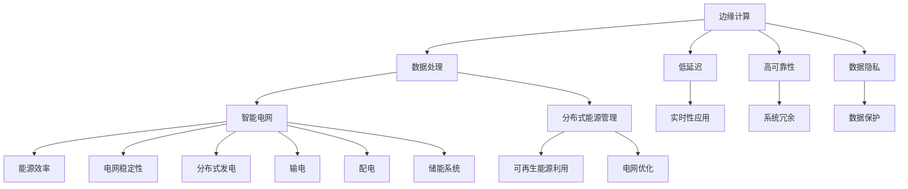

                 

### 第1章 引言与概述

边缘计算与智能电网的结合正逐渐成为现代能源管理领域的一个重要研究方向。随着物联网（IoT）和5G技术的快速发展，边缘计算在智能电网中的应用显得尤为重要。本章将首先介绍边缘计算的背景和特点，然后定义边缘计算，并探讨其与云计算的区别。接下来，我们将深入探讨智能电网的概念，以及分布式能源管理在其中的重要性，最后总结本章的主要内容和后续章节的结构。

#### 1.1.1 边缘计算的背景

边缘计算是一种分布式计算模型，旨在将数据处理、存储和网络连接推向网络边缘，即靠近数据源的地方。这一趋势的兴起源于对实时数据处理和低延迟通信需求的增长。传统的云计算模式由于数据传输的距离和带宽限制，难以满足一些实时性要求较高的应用场景，如自动驾驶、智能制造和智能电网等。

边缘计算通过在靠近数据产生的地方部署计算资源，可以显著减少数据传输的时间，提高处理效率。此外，边缘计算还可以减轻中央数据中心的工作负载，降低能耗，提高系统的可靠性和安全性。

#### 1.1.2 边缘计算的定义与特点

边缘计算是一种分布式计算范式，它通过在网络的边缘节点部署计算、存储和网络功能，实现数据处理、分析和响应的本地化。边缘计算的关键特点包括：

1. **低延迟**：数据在边缘节点被处理，减少了传输到云端的时间延迟，满足实时性要求高的应用需求。
2. **高可靠性**：通过在多个边缘节点部署计算资源，增强了系统的容错性和可靠性。
3. **数据隐私**：由于数据处理发生在边缘节点，可以更好地保护数据的隐私。
4. **带宽优化**：仅将处理后的数据上传至云端，减少了数据传输的带宽需求。

#### 1.1.3 边缘计算与云计算的区别

边缘计算与云计算虽然都是分布式计算的概念，但它们在应用场景和架构上存在显著差异：

1. **架构**：云计算通常以数据中心为核心，而边缘计算则强调在网络的边缘部署计算资源。
2. **处理位置**：云计算是在中心处理数据，而边缘计算是在数据源附近处理数据。
3. **延迟**：云计算的延迟相对较高，而边缘计算可以实现低延迟处理。
4. **数据传输**：云计算传输大量数据到中心处理，而边缘计算仅传输处理后的数据。

#### 1.2 智能电网与分布式能源管理

智能电网是一种利用现代信息技术和自动化控制技术，实现电力系统智能化管理的系统。它通过将通信、传感器、计算和控制技术集成到电网中，提高电网的运行效率、可靠性和可持续性。

分布式能源管理是智能电网中的一个核心概念，它通过整合分布式发电、输电、配电和储能系统，实现能源的灵活管理和优化。分布式能源管理的重要性在于：

1. **提高能源效率**：通过实时监测和优化能源使用，降低能源浪费。
2. **增强电网稳定性**：分布式能源可以提供额外的电力供应，提高电网的冗余性和稳定性。
3. **促进可再生能源发展**：分布式能源管理有利于可再生能源的并网和利用。

#### 1.2.3 分布式能源管理面临的挑战

分布式能源管理虽然具有诸多优势，但也面临一系列挑战：

1. **技术挑战**：分布式能源系统涉及多种技术，如传感器、控制算法和通信协议，实现复杂。
2. **兼容性问题**：不同系统和设备之间的兼容性可能导致集成困难。
3. **数据隐私和安全**：分布式能源系统涉及大量敏感数据，数据隐私和安全成为重要问题。
4. **市场机制**：分布式能源交易和市场机制尚不完善，需要政策支持和市场培育。

### 1.3 小结

本章介绍了边缘计算和智能电网的基本概念，以及它们在分布式能源管理中的重要性。边缘计算通过降低延迟、提高可靠性和优化带宽，为实时性和数据隐私要求高的应用提供了有效解决方案。智能电网通过分布式能源管理，提高了能源效率、稳定性和可持续性。本章内容为后续章节的深入探讨奠定了基础。

### 文章核心概念与联系

为了更好地理解边缘计算与智能电网的关系，我们采用Mermaid流程图来展示核心概念之间的联系：

### 下一步阅读指南

在接下来的章节中，我们将深入探讨边缘计算的核心技术，包括架构、协议和硬件，以及分布式能源管理的原理、技术和挑战。读者可以期待看到边缘计算在分布式能源管理中具体应用案例的详细分析，以及针对该领域的研究方向和未来展望。

## 作者信息

作者：AI天才研究院/AI Genius Institute & 禅与计算机程序设计艺术 /Zen And The Art of Computer Programming

## 1.4 摘要

本章介绍了边缘计算与智能电网的基本概念，探讨了它们在分布式能源管理中的重要性。通过分析边缘计算的特点和优势，以及与云计算的区别，本章为理解边缘计算在智能电网中的应用奠定了基础。同时，对智能电网的构成和分布式能源管理面临的挑战进行了深入探讨，为后续章节的详细讨论提供了背景和框架。边缘计算与智能电网的结合有望推动能源管理向更高效、更智能的方向发展。

