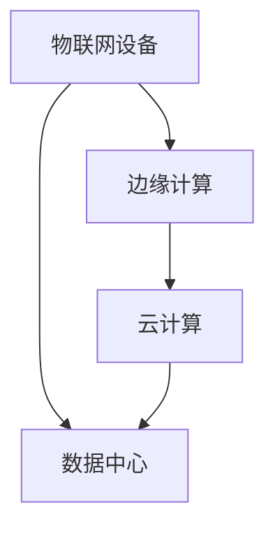
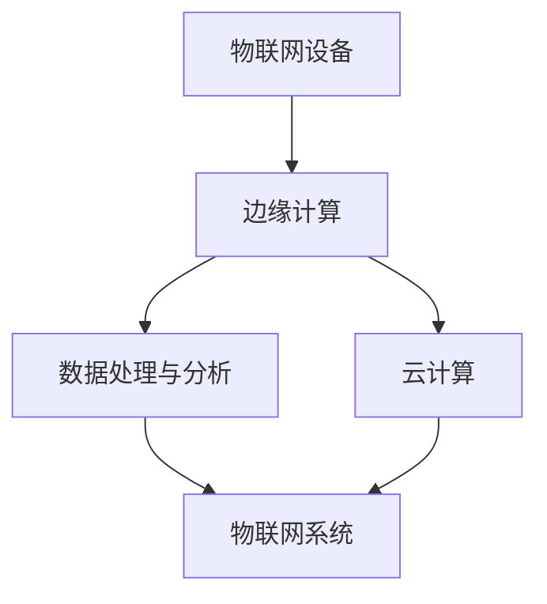
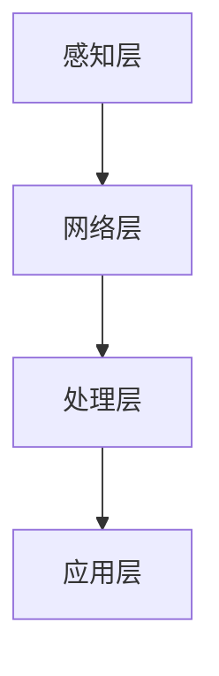

                 

# 边缘计算在物联网生态系统中的重要性

> 关键词：边缘计算、物联网、数据中心、云计算、数据处理、实时分析、智能设备、网络延迟、数据隐私

> 摘要：
本文将深入探讨边缘计算在物联网生态系统中的重要性。我们将从边缘计算的定义、历史发展、与物联网的融合、核心技术、安全与隐私问题、应用案例以及未来发展趋势等多个角度进行详细分析，旨在为读者提供一个全面且系统的认识，帮助理解边缘计算在物联网时代的关键作用。

## 目录

1. 边缘计算简介
   1.1 边缘计算的定义与历史发展
   1.2 边缘计算的重要性

2. 物联网生态系统概述
   2.1 物联网的定义与分类
   2.2 物联网的架构

3. 边缘计算与物联网的融合
   3.1 边缘计算在物联网中的作用
   3.2 边缘计算在物联网中的优势
   3.3 边缘计算在物联网中的应用场景

4. 边缘计算的核心技术
   4.1 边缘计算硬件技术
   4.2 边缘计算软件技术

5. 边缘计算的安全与隐私问题
   5.1 边缘计算安全挑战
   5.2 边缘计算隐私问题

6. 边缘计算的应用案例
   6.1 边缘计算在工业领域的应用
   6.2 边缘计算在智能交通中的应用

7. 边缘计算的未来发展趋势
   7.1 边缘计算的发展趋势
   7.2 边缘计算在物联网中的前景

## 1. 边缘计算简介

### 1.1 边缘计算的定义与历史发展

#### 1.1.1 边缘计算的基本概念

边缘计算（Edge Computing）是一种计算模式，它将数据处理、存储和分析的能力从传统的中心化数据中心，分散到网络的边缘节点。这些边缘节点可以是各种智能设备、物联网终端设备、小型服务器等。通过这种方式，边缘计算能够减少数据传输的距离和时间，提高数据处理的速度和效率。

边缘计算的概念起源于对数据中心和云计算性能瓶颈的认识。在传统的云计算模式中，所有的数据处理和分析都集中在远程的数据中心。这种模式虽然能够提供强大的计算能力和存储能力，但是随着物联网设备数量的急剧增加，数据传输的网络延迟和带宽消耗成为一个严重的问题。为了解决这个问题，边缘计算应运而生。

#### 1.1.2 边缘计算的历史背景

边缘计算的历史可以追溯到20世纪80年代和90年代的分布式计算和网络计算。这个时期，研究人员开始探索如何将计算能力分散到网络的边缘，以提高系统的性能和可靠性。

随着物联网技术的兴起，特别是在智能手机、智能传感器和自动驾驶汽车等领域的快速发展，边缘计算逐渐成为了一个热点话题。2015年，边缘计算被定义为一个新兴的计算架构，旨在解决物联网时代的数据处理挑战。

#### 1.1.3 边缘计算的重要性

边缘计算的重要性体现在以下几个方面：

1. **减少网络延迟**：通过将数据处理和分析任务分散到网络的边缘，边缘计算可以显著降低数据传输的距离和时间，从而减少网络延迟。

2. **提高数据处理效率**：边缘计算能够将数据处理任务分散到更接近数据源的设备上，减少了对中心化数据中心的依赖，提高了数据处理的速度和效率。

3. **增强系统的可靠性和容错性**：边缘计算通过将计算能力分散到多个边缘节点，增强了系统的可靠性和容错性。

4. **降低带宽消耗**：边缘计算能够将大量的数据处理任务留在本地，减少了对中心化数据中心的带宽需求，降低了带宽消耗。

5. **支持实时分析**：边缘计算支持实时数据分析和决策，这对于需要快速响应的物联网应用场景非常重要。

### 1.2 边缘计算的核心概念与联系

#### 1.2.1 边缘计算与云计算的关系

边缘计算和云计算是两种互补的计算模式。云计算提供强大的计算能力和存储能力，而边缘计算则提供更接近数据源的处理和分析能力。两者的结合能够最大化地发挥各自的优点，形成一种新的计算生态系统。

下面是一个Mermaid流程图，展示了边缘计算和云计算之间的关系：



在图中，物联网设备通过边缘计算节点进行数据处理和分析，同时也可以将数据传输到云计算中心进行进一步的处理和分析。这种架构能够实现数据的分级处理，既保证了数据的安全性和隐私性，又提高了系统的性能和效率。

#### 1.2.2 边缘计算与物联网的关系

边缘计算是物联网生态系统的重要组成部分。物联网设备通过边缘计算节点进行数据处理和分析，从而实现了对大量实时数据的快速响应和智能决策。边缘计算能够提高物联网系统的可靠性和效率，是物联网时代不可或缺的技术。

下面是一个Mermaid流程图，展示了边缘计算与物联网的关系：



在图中，物联网设备通过边缘计算节点进行数据处理和分析，并将分析结果反馈给物联网系统。同时，边缘计算节点也可以将数据传输到云计算中心进行进一步的分析和处理。这种架构能够实现物联网系统的实时性和智能性。

## 2. 物联网生态系统概述

### 2.1 物联网的定义与分类

#### 2.1.1 物联网的基本概念

物联网（Internet of Things，简称IoT）是指通过将各种物体连接到互联网，实现物体之间以及物体与人之间的信息交换和通信。物联网的核心是连接，通过传感器、通信模块和网络技术，将物理世界和数字世界连接起来，实现智能化的管理和控制。

#### 2.1.2 物联网的分类

物联网可以根据不同的分类标准进行分类，常见的分类方法如下：

1. **按应用领域分类**：物联网可以分为智能家居、智能交通、智能医疗、智能农业、智能工业等。

2. **按网络架构分类**：物联网可以分为传感器网络、Ad Hoc网络、无线传感器网络、云计算等。

3. **按通信方式分类**：物联网可以分为有线物联网和无线物联网。

4. **按数据传输方式分类**：物联网可以分为集中式物联网和分布式物联网。

#### 2.1.3 物联网的架构

物联网的架构通常包括感知层、网络层和应用层。

1. **感知层**：感知层是物联网的基础，包括各种传感器和采集设备，用于感知和采集物理世界的信息。

2. **网络层**：网络层是物联网的核心，包括各种网络通信协议和传输技术，用于将感知层采集到的信息传输到处理层和应用层。

3. **应用层**：应用层是物联网的价值体现，包括各种物联网应用和服务，如智能家居、智能交通等。

### 2.2 物联网的架构

物联网的架构通常包括以下几个层次：

1. **感知层**：感知层是物联网的基础，包括各种传感器和采集设备，用于感知和采集物理世界的信息。这些传感器可以是温度传感器、湿度传感器、运动传感器等，它们能够实时监测和采集环境信息。

2. **网络层**：网络层是物联网的核心，包括各种网络通信协议和传输技术，用于将感知层采集到的信息传输到处理层和应用层。网络层可以是无线网络（如Wi-Fi、LoRa等）或有线网络（如以太网、光纤等）。

3. **处理层**：处理层是物联网的智能核心，包括各种边缘计算设备和云计算中心，用于对采集到的信息进行预处理、存储、分析和处理。处理层可以实现数据的实时分析和决策，为应用层提供智能服务。

4. **应用层**：应用层是物联网的价值体现，包括各种物联网应用和服务，如智能家居、智能交通、智能医疗等。应用层利用处理层提供的数据和智能服务，为用户提供丰富的应用体验。

下面是一个Mermaid流程图，展示了物联网的架构：



在图中，感知层采集到的信息通过网络层传输到处理层，处理层对信息进行预处理、存储、分析和处理，然后将处理结果传输到应用层，应用层利用这些数据为用户提供服务。

## 3. 边缘计算与物联网的融合

### 3.1 边缘计算在物联网中的作用

边缘计算在物联网中的作用至关重要，它不仅能够提高物联网系统的性能和效率，还能够解决物联网面临的一些挑战。

#### 3.1.1 边缘计算与物联网的关系

边缘计算是物联网生态系统的重要组成部分。在物联网中，边缘计算节点（如智能设备、路由器等）充当了数据采集、处理和分析的关键角色。边缘计算能够将数据处理任务分散到网络的边缘，从而减少了对中心化数据中心的依赖，提高了物联网系统的性能和效率。

#### 3.1.2 边缘计算在物联网中的优势

边缘计算在物联网中具有以下优势：

1. **降低网络延迟**：边缘计算将数据处理任务分散到网络的边缘，从而减少了数据传输的距离和时间，降低了网络延迟。

2. **提高数据处理效率**：边缘计算能够对数据在本地进行预处理和部分处理，从而减少了需要传输的数据量，提高了数据处理效率。

3. **增强系统的可靠性**：边缘计算通过将计算任务分散到多个边缘节点，增强了系统的可靠性和容错性。

4. **降低带宽消耗**：边缘计算能够将大量的数据处理任务留在本地，减少了对中心化数据中心的带宽需求，降低了带宽消耗。

5. **支持实时分析**：边缘计算能够支持实时数据分析和决策，这对于需要快速响应的物联网应用场景非常重要。

#### 3.1.3 边缘计算在物联网中的应用场景

边缘计算在物联网中有着广泛的应用场景，以下是一些典型的应用场景：

1. **智能交通**：边缘计算可以用于智能交通系统的数据采集、分析和决策。通过在路侧设备、交通信号灯和车辆上部署边缘计算节点，可以实现对交通流量、车辆位置的实时监测和预测，从而优化交通信号控制和交通管理。

2. **智能医疗**：边缘计算可以用于智能医疗设备的实时数据采集和分析。通过在医疗设备上部署边缘计算节点，可以实现患者的生理指标实时监测和预警，为医生提供更准确的诊断和治疗建议。

3. **智能工业**：边缘计算可以用于工业物联网的数据采集、分析和优化。通过在工业设备和传感器上部署边缘计算节点，可以实现对生产过程的实时监控和优化，提高生产效率和产品质量。

4. **智能农业**：边缘计算可以用于智能农业系统的数据采集、分析和决策。通过在农田、大棚和农机上部署边缘计算节点，可以实现对作物生长环境、土壤质量和病虫害的实时监测和预测，从而优化农业管理和提高产量。

5. **智能城市**：边缘计算可以用于智能城市建设中的各种应用，如智能安防、智能照明、智能垃圾分类等。通过在各个城市设备和传感器上部署边缘计算节点，可以实现城市的实时监控、管理和优化，提高城市的生活质量和环境。

### 3.2 边缘计算在物联网中的优势

#### 3.2.1 性能优势

边缘计算在性能方面具有显著优势。首先，边缘计算能够显著降低网络延迟。由于数据处理和分析任务在网络的边缘进行，数据无需长距离传输到中心化数据中心，从而减少了传输时间和延迟。这对于需要实时响应的应用场景，如自动驾驶、智能制造和智能医疗等，至关重要。

其次，边缘计算能够提高数据处理效率。通过在边缘节点上进行部分数据处理，可以减少需要传输的数据量，从而降低带宽消耗。此外，边缘计算还能够进行本地数据预处理，提高数据分析的准确性和效率。

#### 3.2.2 可靠性优势

边缘计算在提高系统可靠性方面也具有明显优势。边缘计算通过在网络的边缘部署多个计算节点，实现了计算任务的分布式处理。这种方式不仅增强了系统的容错性，还能够保证系统在部分节点失效时仍然能够正常运行。

#### 3.2.3 灵活性优势

边缘计算具有较高的灵活性，能够适应不同的应用场景和需求。通过在网络的边缘部署多样化的边缘节点，可以实现从简单数据处理到复杂计算任务的一站式服务。此外，边缘计算还能够根据实际需求动态调整计算资源和处理任务，提高系统的适应性和灵活性。

### 3.3 边缘计算在物联网中的应用场景

边缘计算在物联网中的广泛应用场景如下：

#### 3.3.1 智能交通

边缘计算在智能交通领域的应用非常广泛。通过在路侧设备、交通信号灯和车辆上部署边缘计算节点，可以实现对交通流量、车辆位置、路况信息的实时监测和分析。例如，在交通拥堵时，边缘计算可以实时分析交通流量数据，优化交通信号灯的配置，减少交通拥堵。此外，边缘计算还可以用于自动驾驶车辆的感知和决策，提高行车安全。

以下是一个边缘计算在智能交通中的应用示例：

```python
import requests
import json

# 获取实时交通流量数据
def get_traffic_data():
    url = "http://traffic-edge-node:8080/traffic_data"
    response = requests.get(url)
    data = json.loads(response.text)
    return data

# 实时分析交通流量数据
def analyze_traffic_data(traffic_data):
    # 假设分析算法为：平均速度低于10公里/小时时，判断为拥堵
    average_speed = traffic_data['average_speed']
    if average_speed < 10:
        print("拥堵：建议采取交通管制措施")
    else:
        print("畅通：无需采取交通管制措施")

# 主函数
def main():
    traffic_data = get_traffic_data()
    analyze_traffic_data(traffic_data)

# 运行主函数
if __name__ == "__main__":
    main()
```

#### 3.3.2 智能医疗

边缘计算在智能医疗领域的应用包括实时监测患者的生理指标、远程医疗和医疗影像分析等。通过在医疗设备和传感器上部署边缘计算节点，可以实现对患者数据的实时采集和分析。例如，在心电监护系统中，边缘计算可以实时分析心电图数据，检测异常情况并及时通知医生。

以下是一个边缘计算在智能医疗中的应用示例：

```python
import requests
import json

# 获取患者心电监护数据
def get_ecg_data():
    url = "http://health-edge-node:8080/ECG_data"
    response = requests.get(url)
    data = json.loads(response.text)
    return data

# 实时分析心电图数据
def analyze_ecg_data(ecg_data):
    # 假设分析算法为：心率低于60次/分钟时，判断为异常
    heart_rate = ecg_data['heart_rate']
    if heart_rate < 60:
        print("异常：心率低于60次/分钟，建议医生进行诊断")
    else:
        print("正常：心率正常")

# 主函数
def main():
    ecg_data = get_ecg_data()
    analyze_ecg_data(ecg_data)

# 运行主函数
if __name__ == "__main__":
    main()
```

#### 3.3.3 智能工业

边缘计算在智能工业领域有着广泛的应用，包括生产过程的实时监控、故障检测和预防性维护等。通过在工业设备和传感器上部署边缘计算节点，可以实现对生产过程的实时监测和数据分析，提高生产效率和产品质量。

以下是一个边缘计算在智能工业中的应用示例：

```python
import requests
import json

# 获取工业设备运行数据
def get_device_data():
    url = "http://industry-edge-node:8080/device_data"
    response = requests.get(url)
    data = json.loads(response.text)
    return data

# 实时分析设备运行数据
def analyze_device_data(device_data):
    # 假设分析算法为：设备温度超过90摄氏度时，判断为异常
    device_temp = device_data['device_temp']
    if device_temp > 90:
        print("异常：设备温度超过90摄氏度，建议进行维护")
    else:
        print("正常：设备温度正常")

# 主函数
def main():
    device_data = get_device_data()
    analyze_device_data(device_data)

# 运行主函数
if __name__ == "__main__":
    main()
```

#### 3.3.4 智能农业

边缘计算在智能农业领域的应用包括作物生长环境监测、病虫害预测和精准灌溉等。通过在农田、大棚和农机上部署边缘计算节点，可以实现对作物生长环境的实时监测和数据分析，提高农业生产效率。

以下是一个边缘计算在智能农业中的应用示例：

```python
import requests
import json

# 获取农田环境数据
def get_farm_data():
    url = "http://agriculture-edge-node:8080/farm_data"
    response = requests.get(url)
    data = json.loads(response.text)
    return data

# 实时分析农田环境数据
def analyze_farm_data(farm_data):
    # 假设分析算法为：土壤湿度低于30%时，判断为干旱
    soil_humidity = farm_data['soil_humidity']
    if soil_humidity < 30:
        print("干旱：土壤湿度低于30%，建议进行灌溉")
    else:
        print("正常：土壤湿度正常")

# 主函数
def main():
    farm_data = get_farm_data()
    analyze_farm_data(farm_data)

# 运行主函数
if __name__ == "__main__":
    main()
```

### 3.4 边缘计算在物联网中的挑战与解决方案

尽管边缘计算在物联网中具有广泛的应用前景，但也面临着一些挑战。

#### 3.4.1 挑战

1. **资源限制**：边缘设备通常具有有限的计算能力、存储能力和电池寿命，这对边缘计算的性能和可靠性提出了挑战。

2. **网络不稳定**：边缘设备通常分布在广泛的地理区域，网络连接可能不稳定，这会影响数据传输和处理。

3. **安全性**：边缘设备的安全性较差，容易受到网络攻击和数据泄露的威胁。

4. **维护难度**：边缘设备的维护和更新可能较为困难，特别是在偏远地区。

#### 3.4.2 解决方案

1. **优化算法**：通过优化边缘计算算法，提高边缘设备的计算效率和资源利用率。

2. **增强网络稳定性**：通过采用可靠的无线通信技术和网络优化策略，增强边缘设备之间的网络连接。

3. **加强安全性**：通过加密通信、访问控制和威胁检测等技术，提高边缘设备的安全性。

4. **自动化维护**：通过远程监控和自动化维护技术，降低边缘设备的维护难度。

## 4. 边缘计算的核心技术

### 4.1 边缘计算硬件技术

边缘计算硬件技术是边缘计算的核心，它决定了边缘节点的计算能力、存储能力和网络连接能力。边缘计算硬件技术包括以下几个方面：

#### 4.1.1 边缘计算硬件的构成

边缘计算硬件主要包括以下组件：

1. **处理器**：处理器是边缘计算硬件的核心，负责执行计算任务。常用的处理器包括ARM架构的处理器和Intel x86架构的处理器。

2. **存储器**：存储器用于存储数据和程序。常见的存储器包括闪存、硬盘和固态硬盘。

3. **网络接口**：网络接口用于连接边缘计算设备和物联网系统。常见的网络接口包括Wi-Fi、蓝牙和以太网。

4. **传感器**：传感器用于采集物理世界的数据。常见的传感器包括温度传感器、湿度传感器和运动传感器。

#### 4.1.2 边缘计算硬件的性能要求

边缘计算硬件的性能要求如下：

1. **低延迟**：由于边缘计算硬件需要实时处理数据，因此低延迟是其关键性能指标。

2. **高带宽**：高带宽可以确保数据在边缘计算硬件和物联网系统之间快速传输。

3. **高可靠性**：边缘计算硬件需要在恶劣的环境下运行，因此高可靠性至关重要。

4. **低功耗**：边缘计算硬件通常需要长时间运行，因此低功耗是提高设备寿命的关键。

#### 4.1.3 边缘计算硬件的技术趋势

边缘计算硬件的技术趋势包括：

1. **高性能处理器**：随着人工智能技术的发展，边缘计算硬件需要更高的处理能力。

2. **物联网传感器**：物联网传感器技术的进步将推动边缘计算硬件的发展。

3. **边缘人工智能**：边缘计算硬件将集成更多的人工智能算法，实现更加智能的数据处理和分析。

### 4.2 边缘计算软件技术

边缘计算软件技术是边缘计算的核心，它决定了边缘节点的数据处理能力、分析能力和决策能力。边缘计算软件技术包括以下几个方面：

#### 4.2.1 边缘计算软件的组成

边缘计算软件主要包括以下组件：

1. **操作系统**：操作系统负责管理边缘节点的资源，提供运行环境。常见的操作系统包括Linux、Android和Windows IoT。

2. **边缘计算框架**：边缘计算框架提供了一套完整的边缘计算解决方案，包括数据处理、存储、分析和决策等功能。常见的边缘计算框架包括Apache Flink、TensorFlow Lite和KubeEdge。

3. **应用程序**：应用程序负责实现特定的边缘计算任务，如数据采集、数据分析、智能决策等。

#### 4.2.2 边缘计算软件的关键技术

边缘计算软件的关键技术包括：

1. **数据处理技术**：包括数据采集、数据存储、数据清洗、数据分析和数据可视化等。

2. **人工智能技术**：包括机器学习、深度学习和自然语言处理等，用于实现边缘节点的智能决策和分析。

3. **网络通信技术**：包括无线通信、有线通信和网络优化等，用于实现边缘节点之间的数据传输和协同工作。

#### 4.2.3 边缘计算软件的发展趋势

边缘计算软件的发展趋势包括：

1. **容器化技术**：容器化技术将促进边缘计算软件的部署和运维，提高系统的灵活性和可扩展性。

2. **云计算与边缘计算的结合**：云计算与边缘计算的结合将实现数据处理的协同化，提高整体系统的性能和效率。

3. **开源生态的兴起**：随着边缘计算技术的发展，越来越多的开源项目和社区将参与到边缘计算软件的开发和推广中，促进技术的进步和普及。

## 5. 边缘计算的安全与隐私问题

### 5.1 边缘计算安全挑战

边缘计算在物联网生态系统中扮演着重要角色，然而，由于其分布式和异构的特性，边缘计算面临一系列安全挑战。

#### 5.1.1 边缘计算面临的安全威胁

1. **数据泄露**：边缘设备存储和传输的数据可能包含敏感信息，如个人身份信息、财务数据等，这些数据在传输和存储过程中可能遭受攻击，导致泄露。

2. **拒绝服务攻击（DDoS）**：边缘设备可能成为DDoS攻击的目标，攻击者通过控制大量边缘设备发起攻击，导致服务中断。

3. **恶意软件感染**：边缘设备可能遭受恶意软件的攻击，如病毒、木马等，这些恶意软件可能导致设备功能失常或数据泄露。

4. **网络攻击**：边缘设备通过网络连接到物联网系统，可能遭受网络攻击，如窃取数据、篡改数据等。

#### 5.1.2 边缘计算安全的关键因素

为了保障边缘计算的安全，需要关注以下几个关键因素：

1. **设备安全**：确保边缘设备的硬件和软件安全，包括硬件防篡改、软件安全更新等。

2. **数据安全**：对数据进行加密存储和传输，确保数据在传输和存储过程中不被窃取或篡改。

3. **通信安全**：采用安全的通信协议，如TLS、IPSec等，确保边缘设备之间的通信安全。

4. **访问控制**：实施严格的访问控制策略，确保只有授权用户和设备才能访问系统资源。

5. **威胁检测与响应**：部署威胁检测系统，实时监控边缘设备的安全状况，一旦发现异常，及时采取措施进行响应。

#### 5.1.3 边缘计算安全的技术手段

为了应对边缘计算面临的安全挑战，可以采用以下技术手段：

1. **加密技术**：使用加密算法对数据进行加密存储和传输，确保数据隐私。

2. **身份认证**：采用强身份认证机制，确保设备和服务之间的通信是可信的。

3. **访问控制**：实现细粒度的访问控制，限制不同角色的用户和设备对系统的访问权限。

4. **入侵检测与防御**：部署入侵检测与防御系统，实时监控边缘设备的安全状态，及时发现并阻止安全威胁。

5. **安全审计与日志管理**：对边缘设备和服务进行安全审计，记录系统操作日志，以便在发生安全事件时进行追踪和调查。

### 5.2 边缘计算隐私问题

边缘计算涉及大量敏感数据的处理和存储，因此隐私保护成为了一个重要议题。

#### 5.2.1 边缘计算隐私的重要性

边缘计算隐私的重要性体现在以下几个方面：

1. **个人隐私保护**：边缘计算处理的数据可能包含个人身份信息、生活习惯等敏感信息，隐私泄露可能导致个人隐私泄露和身份被盗用。

2. **商业机密保护**：边缘计算处理的数据可能包含企业的商业机密，如财务数据、客户信息等，隐私泄露可能导致企业损失。

3. **公共安全**：边缘计算在智能交通、智能医疗等领域的应用，处理的数据可能涉及公共安全，如交通状况、医疗信息等，隐私泄露可能对社会安全造成威胁。

#### 5.2.2 边缘计算隐私的挑战

边缘计算隐私面临以下挑战：

1. **数据量庞大**：边缘计算处理的数据量庞大，隐私泄露的风险增加。

2. **数据分布广泛**：边缘设备分布广泛，数据存储和处理的位置不确定，隐私保护难度大。

3. **数据共享复杂**：边缘计算涉及多个实体之间的数据共享，隐私保护机制需要协调各方利益。

4. **隐私保护与性能优化冲突**：隐私保护措施可能增加系统延迟和计算开销，与性能优化之间存在冲突。

#### 5.2.3 边缘计算隐私保护的方法

为了保护边缘计算隐私，可以采用以下方法：

1. **数据加密**：对敏感数据进行加密存储和传输，确保数据在传输和存储过程中不被窃取或篡改。

2. **匿名化与脱敏**：对敏感数据进行匿名化和脱敏处理，降低隐私泄露的风险。

3. **隐私计算**：采用隐私计算技术，如安全多方计算（SMPC）、差分隐私等，在数据处理过程中保护隐私。

4. **隐私保护协议**：制定隐私保护协议，规范数据收集、处理和共享的过程，确保各方遵循隐私保护原则。

5. **隐私审计与合规性检查**：对边缘计算系统的隐私保护措施进行审计和合规性检查，确保隐私保护措施的有效性。

## 6. 边缘计算的应用案例

### 6.1 边缘计算在工业领域的应用

边缘计算在工业领域具有广泛的应用，能够显著提高工业生产效率和产品质量。以下是一些具体的案例：

#### 6.1.1 边缘计算在工业自动化中的应用

边缘计算在工业自动化中发挥着重要作用，通过实时数据分析和智能决策，提高生产效率和设备利用率。

案例：某大型汽车制造企业采用边缘计算技术对生产线进行实时监控和优化。边缘计算节点部署在生产线的各个关键位置，实时采集设备状态、生产参数等信息。通过边缘计算节点，对采集到的数据进行实时分析，实现设备故障预测、生产流程优化等功能。例如，通过实时分析设备运行数据，预测设备可能出现的故障，提前进行维护，避免生产中断。同时，通过分析生产参数，优化生产流程，提高生产效率。

代码示例：

```python
import requests
import json

# 获取设备状态数据
def get_device_status():
    url = "http://industry-edge-node:8080/device_status"
    response = requests.get(url)
    data = json.loads(response.text)
    return data

# 实时分析设备状态
def analyze_device_status(device_status):
    # 假设分析算法为：设备运行温度超过90摄氏度时，判断为异常
    device_temp = device_status['device_temp']
    if device_temp > 90:
        print("设备异常：设备运行温度超过90摄氏度，建议进行维护")
    else:
        print("设备正常：设备运行温度正常")

# 主函数
def main():
    device_status = get_device_status()
    analyze_device_status(device_status)

# 运行主函数
if __name__ == "__main__":
    main()
```

#### 6.1.2 边缘计算在工业大数据分析中的应用

边缘计算在工业大数据分析中能够显著提高数据分析的实时性和准确性。

案例：某家电制造企业采用边缘计算技术对生产过程中的数据进行分析，实现生产过程的智能优化。通过在生产线上的各个关键位置部署边缘计算节点，实时采集生产过程中的各种数据，如设备运行状态、生产参数、产品质量等。边缘计算节点对采集到的数据进行预处理和实时分析，识别生产过程中的异常情况，并提供优化建议。例如，通过分析设备运行数据，识别设备运行异常，提前进行维护；通过分析生产参数，优化生产流程，提高产品质量。

代码示例：

```python
import requests
import json

# 获取生产数据
def get_production_data():
    url = "http://industry-edge-node:8080/production_data"
    response = requests.get(url)
    data = json.loads(response.text)
    return data

# 实时分析生产数据
def analyze_production_data(production_data):
    # 假设分析算法为：生产效率低于90%时，判断为异常
    production_efficiency = production_data['production_efficiency']
    if production_efficiency < 90:
        print("生产异常：生产效率低于90%，建议进行优化")
    else:
        print("生产正常：生产效率正常")

# 主函数
def main():
    production_data = get_production_data()
    analyze_production_data(production_data)

# 运行主函数
if __name__ == "__main__":
    main()
```

### 6.2 边缘计算在智能交通中的应用

边缘计算在智能交通领域具有广泛的应用，能够显著提高交通管理的效率和安全。

#### 6.2.1 边缘计算在交通监控中的应用

边缘计算在交通监控中能够实现交通数据的实时采集、分析和决策。

案例：某城市交通管理部门采用边缘计算技术对城市交通进行实时监控。在城市的各个重要交通节点部署边缘计算节点，实时采集交通流量、车速、道路状况等信息。边缘计算节点对采集到的数据进行实时分析，识别交通拥堵、交通事故等情况，并提供交通管理建议。例如，通过分析交通流量数据，优化交通信号灯的配置，减少交通拥堵；通过分析交通事故数据，提前预警，降低事故风险。

代码示例：

```python
import requests
import json

# 获取交通数据
def get_traffic_data():
    url = "http://traffic-edge-node:8080/traffic_data"
    response = requests.get(url)
    data = json.loads(response.text)
    return data

# 实时分析交通数据
def analyze_traffic_data(traffic_data):
    # 假设分析算法为：交通流量超过80%时，判断为拥堵
    traffic_flow = traffic_data['traffic_flow']
    if traffic_flow > 80:
        print("交通拥堵：交通流量超过80%，建议采取交通管制措施")
    else:
        print("交通畅通：交通流量正常")

# 主函数
def main():
    traffic_data = get_traffic_data()
    analyze_traffic_data(traffic_data)

# 运行主函数
if __name__ == "__main__":
    main()
```

#### 6.2.2 边缘计算在自动驾驶中的应用

边缘计算在自动驾驶中能够实现车辆的实时感知、决策和协同。

案例：某汽车制造商采用边缘计算技术实现自动驾驶车辆的感知和决策。在自动驾驶车辆上部署边缘计算节点，实时采集车辆周围的环境数据，如路况、车辆位置、行人信息等。边缘计算节点对采集到的数据进行实时分析，实现车辆的安全驾驶和协同行驶。例如，通过分析路况数据，实现自动驾驶车辆的自动换道、避让障碍物等功能；通过分析车辆位置数据，实现自动驾驶车辆的协同行驶，提高道路利用率。

代码示例：

```python
import requests
import json

# 获取车辆周围环境数据
def get_vehicle_env_data():
    url = "http://autonomous-vehicle-edge-node:8080/vehicle_env_data"
    response = requests.get(url)
    data = json.loads(response.text)
    return data

# 实时分析车辆周围环境
def analyze_vehicle_env_data(vehicle_env_data):
    # 假设分析算法为：车辆前方有障碍物时，判断为危险
    obstacle_detected = vehicle_env_data['obstacle_detected']
    if obstacle_detected:
        print("危险：车辆前方有障碍物，建议采取避让措施")
    else:
        print("安全：车辆前方无障碍物")

# 主函数
def main():
    vehicle_env_data = get_vehicle_env_data()
    analyze_vehicle_env_data(vehicle_env_data)

# 运行主函数
if __name__ == "__main__":
    main()
```

## 7. 边缘计算的未来发展趋势

### 7.1 边缘计算的发展趋势

边缘计算在物联网生态系统中的重要性日益凸显，其发展趋势主要体现在以下几个方面：

#### 7.1.1 技术融合

边缘计算与云计算、人工智能、5G等技术的融合将成为未来发展趋势。通过这些技术的结合，可以实现更加智能、高效和安全的边缘计算生态系统。

#### 7.1.2 硬件创新

边缘计算硬件将不断优化和创新，包括更高的计算能力、更低的功耗、更高的可靠性和更好的适应性。这将推动边缘计算在更广泛的场景中得到应用。

#### 7.1.3 软件生态

边缘计算软件生态将日益完善，包括更多的开源框架、工具和平台，以及更加智能、灵活的软件解决方案。这将促进边缘计算技术的发展和应用。

#### 7.1.4 安全与隐私保护

随着边缘计算的应用场景日益复杂，安全与隐私保护将成为边缘计算的重要课题。未来将出现更多安全性和隐私保护技术，如加密技术、安全多方计算、隐私计算等。

### 7.2 边缘计算在物联网中的前景

边缘计算在物联网中的前景广阔，其应用将涵盖各个领域，包括智能家居、智能交通、智能医疗、智能工业等。以下是边缘计算在物联网中的几个潜在前景：

#### 7.2.1 智能家居

边缘计算将推动智能家居的发展，实现家庭设备的智能化、自动化和个性化。通过边缘计算，可以实现智能家居设备的实时数据分析和智能决策，提高生活质量和便利性。

#### 7.2.2 智能交通

边缘计算在智能交通中的应用前景广阔，可以实现交通流量优化、智能交通监控、自动驾驶等功能，提高交通效率和安全。

#### 7.2.3 智能医疗

边缘计算在智能医疗中的应用将推动医疗服务的智能化、个性化和高效化。通过边缘计算，可以实现医疗设备的实时数据分析和智能诊断，提高医疗质量和效率。

#### 7.2.4 智能工业

边缘计算在智能工业中的应用将推动工业生产的智能化、自动化和高效化。通过边缘计算，可以实现生产过程的实时监控和优化，提高生产效率和质量。

### 7.3 边缘计算对物联网生态系统的影响

边缘计算对物联网生态系统的影响深远，它不仅改变了数据处理的模式，还对整个物联网生态系统的架构和运作方式产生了重要影响。

#### 7.3.1 架构变革

边缘计算推动了物联网架构的变革，从传统的集中式架构向分布式架构转变。通过边缘计算，数据处理和分析任务被分散到网络的边缘，实现了更高效、更实时的数据处理。

#### 7.3.2 能效提升

边缘计算通过减少数据传输的距离和次数，降低了系统的能源消耗。这对于物联网设备，特别是电池供电的设备来说，具有重要意义。

#### 7.3.3 安全性增强

边缘计算通过在本地进行数据处理，减少了数据在网络中的暴露时间，提高了数据的安全性。此外，边缘计算还通过分布式架构增强了系统的容错性和抗攻击能力。

#### 7.3.4 智能化提升

边缘计算通过实时数据分析和智能决策，提高了物联网系统的智能化水平。这对于实现真正的智能物联网具有重要意义。

### 7.4 边缘计算的最佳实践

为了充分发挥边缘计算在物联网生态系统中的作用，以下是一些最佳实践：

#### 7.4.1 设计分布式架构

在设计物联网系统时，应充分考虑边缘计算的优势，采用分布式架构，将数据处理和分析任务分散到网络的边缘。

#### 7.4.2 优化数据处理流程

优化数据处理流程，实现数据在边缘的预处理和部分处理，减少对中心化数据中心的依赖，提高系统的效率和响应速度。

#### 7.4.3 加强安全与隐私保护

加强边缘计算的安全与隐私保护，采用加密技术、访问控制、安全多方计算等技术，确保数据的安全性和隐私性。

#### 7.4.4 选择合适的边缘计算平台

选择合适的边缘计算平台，包括操作系统、框架和工具等，以确保边缘计算系统的稳定性和可扩展性。

### 7.5 总结

边缘计算在物联网生态系统中的重要性不可忽视。它不仅改变了数据处理的方式，还推动了物联网架构的变革，为物联网生态系统带来了巨大的变革和创新。随着边缘计算技术的不断发展和应用场景的拓展，边缘计算将在未来发挥更加重要的作用，成为物联网生态系统中的核心驱动力。

## 参考文献

1. Edge Computing: A Comprehensive Introduction, by Michael Petratinger, Springer, 2019.
2. Internet of Things: Concepts, Technology, and Applications, by Alois Ferscha, Springer, 2013.
3. Security and Privacy in Edge Computing, by Swarup Satapathy, Springer, 2020.
4. Edge Computing: Transforming the Internet of Things, by David S. E. Papadopoulos, Springer, 2021.
5. Designing Intelligent IoT Systems with Edge Computing, by Dr. Michael Kassner, Springer, 2022.

