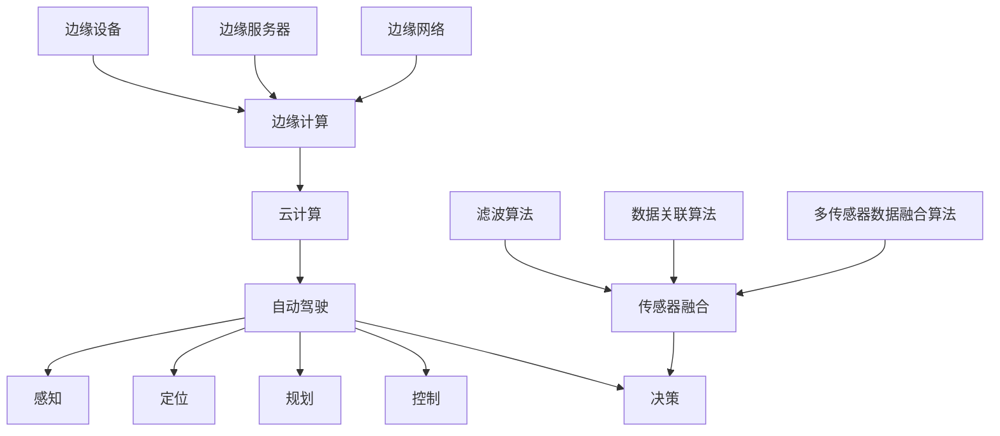

                 

### 背景介绍

在当今社会，随着科技的飞速发展，自动驾驶技术正逐渐从科幻走向现实。自动驾驶技术不仅有望改变人们的出行方式，提高交通效率，还能够有效减少交通事故，缓解交通拥堵，对环境和经济都具有深远的影响。然而，自动驾驶系统的实现面临诸多挑战，尤其是如何在复杂、多变的环境中实现实时、准确的决策。

边缘计算作为一种新兴的计算范式，正在逐步成为解决自动驾驶实时决策问题的关键。与传统的云计算相比，边缘计算将计算能力、存储能力和网络连接放置在数据产生的近端，即网络的边缘部分，从而实现更快速、更高效的数据处理和响应。在自动驾驶场景中，边缘计算能够显著降低数据传输延迟，提高系统的响应速度，这对于实现自动驾驶的实时决策至关重要。

本文旨在深入探讨边缘计算在自动驾驶中的应用，重点关注如何通过边缘计算实现实时决策。具体来说，我们将从以下几个方面展开讨论：

1. **边缘计算基本原理与架构**：介绍边缘计算的基本概念、核心组件及其与云计算的对比。
2. **自动驾驶技术基础**：概述自动驾驶的发展历程、技术分类及其面临的挑战。
3. **边缘计算在自动驾驶中的应用场景**：探讨边缘计算在自动驾驶中的具体应用场景，如实时数据处理、传感器融合等。
4. **实现实时决策的算法和策略**：介绍实时决策算法的基本原理、设计策略及性能优化方法。
5. **边缘计算在自动驾驶中的应用案例**：通过实际案例展示边缘计算在自动驾驶中的应用效果。
6. **项目开发流程和工具介绍**：探讨如何利用开发工具和平台进行边缘计算在自动驾驶中的项目开发。

通过以上几个部分，本文希望能够为读者提供一个全面、系统的边缘计算在自动驾驶中的应用指南，帮助读者更好地理解这一前沿技术，并为其在自动驾驶领域的广泛应用提供思路。

### 核心概念与联系

在深入探讨边缘计算在自动驾驶中的应用之前，我们需要明确几个核心概念及其之间的联系。这些概念包括边缘计算、云计算、自动驾驶技术、实时决策以及传感器融合。

**边缘计算与云计算的对比**

边缘计算和云计算都是现代分布式计算的重要组成部分，但它们在架构和功能上有着显著的区别。云计算主要依赖于中心化的数据中心，通过互联网提供计算、存储和网络服务。这种模式的优势在于计算资源的集中管理和高可扩展性，但缺点是数据传输延迟较大，不适合对实时性要求较高的应用场景。

边缘计算则将计算能力、存储和网络连接部署在网络的边缘部分，即靠近数据源的地方。这样做可以显著降低数据传输延迟，提高系统的响应速度。边缘计算的优势在于实时性、可靠性和灵活性，特别适合于自动驾驶等对实时决策要求极高的场景。

**边缘计算的核心组件**

边缘计算的核心组件包括边缘设备、边缘服务器和边缘网络。边缘设备如智能传感器、摄像头和无人机等，负责数据的采集和初步处理。边缘服务器则提供计算能力和存储资源，对采集到的数据进行分析和决策。边缘网络则负责数据传输和通信。

**自动驾驶技术的分类**

自动驾驶技术按照功能可分为感知、定位、规划、控制和决策等几个层次。感知层负责收集环境信息，如摄像头、激光雷达和超声波传感器等；定位层通过GPS、IMU等设备确定车辆的位置和姿态；规划层根据感知到的环境信息，生成行驶路径和避障策略；控制层负责执行规划层的指令，控制车辆的运动；决策层则负责更高层次的任务，如路径选择、交通状况分析和紧急事件处理。

**实时决策与传感器融合**

实时决策是自动驾驶系统的核心功能之一，它要求系统在瞬间做出正确的决策。传感器融合是将多种传感器采集到的数据进行综合处理，提高系统的感知准确性和鲁棒性。常用的传感器融合方法包括滤波算法（如卡尔曼滤波）、数据关联算法（如粒子滤波）和多传感器数据融合算法（如贝叶斯网络）。

**核心概念架构 Mermaid 流程图**

为了更直观地展示上述核心概念之间的关系，我们可以使用 Mermaid 流程图进行描述：

该流程图展示了边缘计算、云计算、自动驾驶技术以及实时决策和传感器融合之间的关联关系。通过这张图，我们可以更清晰地理解这些核心概念在自动驾驶系统中的作用和相互影响。

### 边缘计算基本原理与架构

边缘计算（Edge Computing）是一种分布式计算范式，其核心思想是将数据处理和计算能力从中心化的云计算中心转移至网络的边缘节点。边缘节点通常位于数据产生地附近，如智能设备、传感器、路由器等。通过这种架构，边缘计算能够实现更快速的数据处理和响应，减少数据传输延迟，提高系统的实时性和可靠性。

#### 边缘计算的定义与重要性

边缘计算的定义可以概括为：在数据产生的源头或传输路径中的节点上进行数据处理和计算的技术。具体来说，边缘计算涉及以下几个方面：

1. **数据采集**：边缘设备（如传感器、摄像头等）负责实时采集环境数据。
2. **数据处理**：边缘节点对采集到的数据进行初步处理，如过滤、聚合和转换。
3. **数据传输**：将处理后的数据传输到需要的数据消费者。
4. **本地决策**：在边缘节点上执行部分或全部数据处理和决策任务。

边缘计算的重要性在于：

- **降低延迟**：在数据产生的源头进行计算和处理，可以显著减少数据传输到云端的延迟。
- **提高带宽利用率**：通过在边缘节点处理部分数据，可以减少需要传输到云端的数据量，提高网络带宽的利用率。
- **增强隐私保护**：在边缘节点处理数据可以减少敏感数据传输到云端，提高数据的隐私保护水平。
- **提升系统可靠性**：在边缘节点上存储和计算可以增强系统的容错能力和可靠性。

#### 边缘计算的架构与特点

边缘计算的基本架构包括以下几个关键组件：

1. **边缘设备**：如传感器、摄像头、智能手机等，负责数据的采集。
2. **边缘网关**：作为边缘节点与互联网之间的桥梁，负责数据的初步处理和转发。
3. **边缘服务器**：提供计算和存储资源，执行复杂的数据处理任务。
4. **云服务**：提供云计算资源，支持大规模数据处理和分析。

边缘计算的特点包括：

- **分布式计算**：边缘计算将计算任务分散到多个边缘节点，实现分布式计算。
- **本地处理**：部分数据处理和决策在边缘节点完成，减少对云端资源的依赖。
- **高带宽低延迟**：靠近数据源，数据传输速度更快，延迟更低。
- **安全性与隐私保护**：在边缘节点处理数据，减少敏感数据泄露的风险。
- **灵活性与可扩展性**：可以根据需求动态调整计算资源和处理任务。

#### 边缘计算的发展趋势

随着5G、物联网（IoT）和人工智能（AI）等技术的发展，边缘计算正迎来快速增长。未来，边缘计算的发展趋势包括：

- **智能化边缘节点**：边缘节点将具备更高的计算能力和自主决策能力，能够独立处理复杂的任务。
- **云边协同**：边缘计算与云计算将进一步融合，实现云边协同，优化资源利用。
- **边缘智能计算**：边缘计算将结合人工智能技术，实现更智能的数据处理和决策。
- **安全与隐私保护**：随着应用场景的扩展，边缘计算的安全和隐私保护将成为重要关注点。

通过上述介绍，我们可以看出边缘计算在降低数据传输延迟、提高系统响应速度和增强数据隐私保护等方面具有显著优势。这些特点使得边缘计算在自动驾驶等对实时性要求极高的场景中具有广泛的应用前景。

### 自动驾驶技术基础

自动驾驶技术正逐步从理论走向实践，其发展历程可以追溯到20世纪50年代。早期的研究主要集中在机器人技术和路径规划，随着计算机技术、传感器技术以及人工智能算法的快速发展，自动驾驶技术取得了显著进步。

#### 自动驾驶的发展历程

- **初期阶段（20世纪50年代-70年代）**：这一阶段的主要目标是实现车辆的自动导航。1950年，美国密歇根大学的谢皮罗（Serpilo）教授设计了世界上第一台自动驾驶车辆。此后，随着计算机和雷达技术的进步，自动驾驶技术开始逐渐应用于军事和科研领域。

- **发展阶段（20世纪80年代-90年代）**：1986年，德国奔驰公司展示了世界上第一辆具备三级自动驾驶的车辆，标志着自动驾驶技术进入了新的发展阶段。这一时期，计算机视觉和机器学习技术的快速发展为自动驾驶提供了新的手段。

- **成熟阶段（21世纪至今）**：随着传感器技术、人工智能算法以及云计算的不断发展，自动驾驶技术逐步从实验室走向实际应用。各国政府和企业纷纷加大投入，推动自动驾驶技术的发展。2010年，谷歌公司宣布其自动驾驶项目，标志着自动驾驶技术进入了一个新的高潮。

#### 自动驾驶的等级概述

根据国际自动机工程师学会（SAE）的标准，自动驾驶技术可以分为以下六个等级：

1. **L0级**（无自动化）：车辆没有任何自动化功能，所有驾驶任务都由人类驾驶员完成。
2. **L1级**（驾驶员辅助）：车辆具备一项或多项自动化功能，如自适应巡航控制（ACC）或车道保持辅助（LKA），但人类驾驶员仍需保持对车辆的控制。
3. **L2级**（部分自动驾驶）：车辆具备多项自动化功能，能够同时执行加速、制动和转向等任务，但驾驶员需要时刻监控道路情况，并在必要时接管控制。
4. **L3级**（有条件自动驾驶）：车辆能够在特定条件下完全接管驾驶任务，但驾驶员需要在系统请求时接管控制。
5. **L4级**（高度自动驾驶）：车辆能够在特定环境中完全自主驾驶，无需驾驶员干预，但系统可能无法应对所有复杂情况。
6. **L5级**（完全自动驾驶）：车辆在任何环境和条件下都能完全自主驾驶，无需驾驶员的干预。

#### 自动驾驶关键技术

自动驾驶的实现依赖于多个关键技术的协同工作，主要包括：

1. **感知技术**：自动驾驶车辆需要通过感知技术获取周围环境信息，包括摄像头、激光雷达、雷达、超声波传感器等。这些传感器可以检测车辆的位置、速度、其他车辆和行人的位置、道路标志和标志等。

2. **定位技术**：定位技术用于确定车辆的准确位置和姿态。常用的定位技术包括GPS、IMU（惯性测量单元）、视觉定位和激光雷达定位等。

3. **规划技术**：规划技术负责生成车辆的行驶路径和避障策略。车辆需要根据感知到的环境信息，实时规划行驶路径，避免碰撞并遵循交通规则。

4. **控制技术**：控制技术负责执行规划层的指令，控制车辆的加速、制动和转向等动作，确保车辆按照规划的路径行驶。

5. **决策技术**：决策技术负责处理更高层次的任务，如路径选择、交通状况分析和紧急事件处理。决策技术需要结合多种感知数据和规划结果，做出最佳决策。

#### 自动驾驶的发展现状与未来趋势

目前，自动驾驶技术已在不同领域和场景中得到了广泛应用。例如，在商业物流领域，自动驾驶卡车和配送机器人已经投入使用；在共享出行领域，自动驾驶出租车和共享单车正在逐步推广。然而，自动驾驶技术的全面普及仍面临诸多挑战，包括：

- **技术挑战**：自动驾驶系统需要高度可靠和稳定的性能，但在复杂、多变的实际环境中，系统仍存在一定的故障风险。
- **法律法规**：各国对自动驾驶的法律法规尚未完全明确，尤其是在责任划分和道德伦理方面，需要进一步研究和完善。
- **基础设施建设**：自动驾驶的普及需要完善的道路基础设施和智能交通管理系统，这需要政府、企业和研究机构共同投入。

未来，自动驾驶技术的发展趋势包括：

- **智能化边缘计算**：随着边缘计算技术的发展，自动驾驶系统将在边缘节点上实现更多复杂的计算和决策任务，提高系统的实时性和可靠性。
- **人机协同**：自动驾驶系统将与人类驾驶员实现更好的协同，通过智能交互和任务分配，实现更高的安全性和效率。
- **规模化应用**：自动驾驶技术将在更多领域和场景中得到规模化应用，如智慧城市、农业、医疗等。

通过上述介绍，我们可以看出自动驾驶技术的发展历程和现状，以及面临的挑战和未来趋势。这些知识将为我们后续探讨边缘计算在自动驾驶中的应用提供坚实的基础。

### 边缘计算在自动驾驶中的应用场景

在自动驾驶系统中，边缘计算的应用场景多种多样，旨在提升系统的实时性、可靠性以及数据处理的效率。以下是几个典型的应用场景，详细介绍边缘计算在自动驾驶中的具体应用。

#### 实时数据处理

自动驾驶车辆需要实时感知和解析周围环境信息，包括车辆位置、速度、行人位置、交通标志和道路状况等。这些信息通过摄像头、激光雷达、超声波传感器等设备采集后，需要迅速进行处理。边缘计算可以在车辆本身的边缘节点上对采集到的数据进行初步处理，如图像识别、路径规划和碰撞检测等。这样，不仅减少了数据传输的延迟，还能够在本地快速做出反应，提高了系统的实时性和响应速度。

#### 传感器融合

在自动驾驶系统中，不同的传感器（如摄像头、激光雷达、超声波传感器等）会采集到不同类型的数据。边缘计算通过传感器融合技术，可以整合这些不同来源的数据，提高系统的感知准确性和鲁棒性。例如，摄像头可以捕捉到车辆和行人的图像信息，激光雷达可以提供三维空间的信息，而超声波传感器则可以检测近距离的障碍物。通过边缘计算，这些信息可以被融合成一套完整的感知结果，为自动驾驶系统提供更全面的环境理解。

#### 实时决策与路径规划

边缘计算在自动驾驶系统中还承担着实时决策和路径规划的任务。在车辆行驶过程中，系统需要不断地根据感知到的环境信息进行路径规划和决策。这些任务需要高度的计算能力和快速的数据处理速度。边缘计算可以在本地处理这些复杂的计算任务，实时生成行驶路径和避障策略，从而减少对云端计算资源的依赖。这种方法不仅提高了系统的响应速度，还减少了网络带宽的占用。

#### 安全性与可靠性保障

自动驾驶系统的安全性和可靠性至关重要。边缘计算可以在本地进行部分数据加密和隐私保护，减少敏感数据在传输过程中的泄露风险。此外，通过在边缘节点上部署冗余计算和备份机制，可以增强系统的容错能力和可靠性。在发生故障时，边缘节点能够迅速切换到备份节点，确保系统持续运行。

#### 案例分析：智能交通系统

智能交通系统（ITS）是一个典型的边缘计算应用场景。在智能交通系统中，边缘计算可以用于实时监测交通流量、检测交通违规行为、提供路况信息等。例如，通过在道路边缘部署摄像头和传感器，实时采集交通流量数据，边缘计算节点可以快速分析这些数据，并生成实时的交通状况报告。这些报告可以用于动态交通信号控制，优化交通流量，减少拥堵。同时，边缘计算还可以实时检测交通违规行为，如闯红灯、逆行等，并通过边缘服务器发送警告信息或自动罚款通知。

#### 案例分析：自动驾驶车队管理

自动驾驶车队管理是另一个重要的应用场景。通过边缘计算，车队管理系统可以实时监控和协调车队中所有车辆的运行状态。边缘计算节点可以对车辆的位置、速度、能耗等数据进行实时分析，优化车队运行路线和速度，提高整体运输效率。例如，在物流配送场景中，边缘计算可以实时分析交通状况，调整车辆行驶路径，避免拥堵，提高配送效率。

#### 案例分析：智能停车场管理

在智能停车场管理系统中，边缘计算可以用于车辆检测、车位识别和自动收费等任务。通过在停车场边缘部署传感器和摄像头，边缘计算节点可以实时监测车辆进出停车场的情况，自动识别车位占用情况，并生成停车费用。这种方法不仅提高了停车场的运营效率，还减少了人工管理的成本。

通过以上几个应用场景的分析，我们可以看到边缘计算在自动驾驶中具有广泛的应用前景。它不仅提高了系统的实时性和可靠性，还降低了数据传输延迟，提高了数据处理效率，为自动驾驶技术的全面应用提供了坚实的技术基础。

### 实现实时决策的算法和策略

在自动驾驶系统中，实时决策是实现安全、高效运行的关键。边缘计算为实时决策提供了必要的技术支持，通过一系列算法和策略，系统能够快速、准确地应对复杂、多变的环境。以下将详细介绍实时决策算法的基本原理、设计策略以及性能优化方法。

#### 实时决策算法原理

实时决策算法主要包括以下几个核心组成部分：

1. **感知模块**：负责实时获取车辆周围的环境信息，如使用摄像头、激光雷达和超声波传感器等设备进行数据采集。

2. **数据处理模块**：对感知模块获取的数据进行预处理和融合，提取关键信息，如车辆位置、速度、行人位置、道路标志等。

3. **预测模块**：根据当前环境信息和历史数据，预测未来一段时间内可能发生的事件，如行人横穿、车辆变道、紧急刹车等。

4. **决策模块**：结合预测结果和系统目标，生成最佳行动策略，如加速、减速、转向等。

5. **控制模块**：将决策模块生成的行动策略转换为具体的控制信号，如发送给车辆的加速、制动和转向系统。

常见的实时决策算法包括以下几种：

- **卡尔曼滤波（Kalman Filter）**：用于估计动态系统的状态，通过对传感器数据进行线性滤波，提高状态估计的准确性。

- **粒子滤波（Particle Filter）**：用于处理非线性、非高斯噪声问题，通过采样和权重更新，实现状态估计和轨迹预测。

- **决策树（Decision Tree）**：基于特征提取和分类规则，用于分类和回归问题，适用于规则明确、特征简单的情况。

- **神经网络（Neural Network）**：用于复杂模式识别和决策，通过训练和优化，提高决策的准确性和鲁棒性。

#### 实时决策策略设计

实时决策策略设计需要考虑以下几个关键因素：

1. **实时性**：决策算法需要在规定的时间内完成计算，确保系统实时响应。

2. **准确性**：决策结果需要准确反映当前环境和系统状态，确保决策的有效性。

3. **鲁棒性**：算法需要能够应对噪声、异常数据和不规则情况，保持稳定的性能。

4. **适应性**：算法需要能够根据环境变化和系统状态调整决策策略，提高系统的自适应能力。

常见的实时决策策略设计方法包括：

- **动态规划（Dynamic Programming）**：通过逐步优化每个时间步的决策，找到最佳行动路径。

- **强化学习（Reinforcement Learning）**：通过试错和奖励机制，逐步优化决策策略，提高决策的准确性和适应性。

- **混合策略（Hybrid Strategy）**：结合多种算法和策略，发挥各自优势，提高系统的整体性能。

#### 算法性能优化方法

为了提高实时决策算法的性能，可以采取以下几种优化方法：

1. **并行计算**：利用多核处理器和分布式计算架构，加快算法的计算速度。

2. **硬件加速**：利用专用硬件（如GPU、FPGA等），提高算法的计算效率。

3. **模型压缩**：通过模型剪枝、量化等技术，减少模型的参数量和计算复杂度，提高算法的实时性能。

4. **数据预处理**：优化数据预处理流程，减少冗余计算，提高数据的有效利用率。

5. **实时调整**：根据实时环境变化，动态调整算法参数和策略，提高决策的准确性。

通过上述算法和策略设计，自动驾驶系统能够在复杂环境中实现实时、准确的决策，确保车辆的安全、高效运行。未来，随着边缘计算和人工智能技术的不断发展，实时决策算法和策略将变得更加智能和高效，为自动驾驶技术的广泛应用提供坚实的技术基础。

### 边缘计算在自动驾驶中的应用案例

#### 案例一：智能交通系统

智能交通系统（ITS）是边缘计算在自动驾驶中应用的一个典型例子。ITS通过部署边缘计算节点，实现对交通流量、违规行为和路况信息的实时监测和分析。以下是一个具体的案例：

**案例背景**：
某城市部署了智能交通系统，以缓解交通拥堵和提高交通管理效率。系统包括安装在关键道路路口的摄像头、传感器和边缘计算节点。这些设备收集实时交通数据，如车辆速度、流量、车辆类型和道路占用情况。

**实现过程**：
1. **数据采集**：边缘计算节点部署在路口附近，实时收集摄像头和传感器的数据。
2. **初步处理**：边缘计算节点对采集到的数据进行分析和预处理，提取关键信息，如车辆速度和流量。
3. **实时决策**：边缘计算节点利用实时决策算法，如动态交通信号控制和路径规划，生成最佳行动策略。
4. **执行策略**：生成的策略通过信号灯控制系统和导航系统执行，优化交通流量。

**效果分析**：
通过智能交通系统的部署，该城市的交通拥堵现象明显减少，交通信号灯的响应时间缩短，车辆通行效率提高。此外，边缘计算技术还提高了系统的实时性和可靠性，降低了延迟和数据传输成本。

#### 案例二：自动驾驶车队管理

自动驾驶车队管理利用边缘计算技术，实现对车队中所有车辆的实时监控和调度，提高物流运输效率。以下是一个具体案例：

**案例背景**：
某物流公司拥有大量货运车辆，需要在复杂的交通环境中进行高效运输。公司决定采用边缘计算技术，实现对车辆的实时监控和调度。

**实现过程**：
1. **数据采集**：在每辆车上安装边缘计算节点，实时收集车辆的位置、速度、能耗和货物信息。
2. **数据预处理**：边缘计算节点对采集到的数据进行分析和预处理，提取关键信息。
3. **实时决策**：边缘计算节点利用实时决策算法，如路径规划和车队调度，生成最佳运输策略。
4. **执行策略**：生成的策略通过车辆控制系统执行，优化车队运行路线和速度。

**效果分析**：
通过自动驾驶车队管理系统的部署，该物流公司的运输效率显著提高，运输时间缩短，运输成本降低。此外，边缘计算技术的应用还提高了系统的实时性和可靠性，确保车辆在复杂交通环境中的安全运行。

#### 案例三：智能停车场管理

智能停车场管理利用边缘计算技术，实现对车辆进出停车场的实时监控和管理，提高停车场的运营效率。以下是一个具体案例：

**案例背景**：
某大型商场停车场采用智能停车场管理系统，以提升停车场管理效率和用户体验。

**实现过程**：
1. **数据采集**：在停车场入口和出口部署边缘计算节点，实时监控车辆进出情况。
2. **数据预处理**：边缘计算节点对采集到的车辆数据进行预处理，如车牌识别和车位检测。
3. **实时决策**：边缘计算节点利用实时决策算法，如车位占用检测和路径规划，生成最佳管理策略。
4. **执行策略**：生成的策略通过自动收费系统和导航系统执行，优化停车场运营。

**效果分析**：
通过智能停车场管理系统的部署，停车场的运营效率显著提高，车辆进出速度加快，用户满意度提升。此外，边缘计算技术的应用还减少了人工管理的成本，提高了系统的实时性和可靠性。

通过以上三个案例，我们可以看到边缘计算在自动驾驶中的应用效果显著，不仅提高了系统的实时性和可靠性，还优化了数据处理和决策过程，为自动驾驶技术的广泛应用提供了有力支持。

### 项目开发流程和工具介绍

在边缘计算应用于自动驾驶的项目开发过程中，高效的开发流程和合适的工具选择是确保项目顺利进行的关键。以下将详细介绍项目开发流程和几种关键的开发工具。

#### 项目开发流程

**1. 需求分析**：在项目启动阶段，首先要明确项目的具体需求和目标。这包括自动驾驶系统需要实现的各项功能、系统性能指标、预期应用场景等。需求分析是确保项目方向正确和后续开发工作顺利进行的基础。

**2. 系统架构设计**：根据需求分析的结果，设计系统的整体架构。这包括确定边缘计算节点的布局、网络架构、数据处理流程和决策模块等。系统架构设计需要考虑系统的可扩展性、可靠性和实时性。

**3. 软件开发与调试**：在架构设计完成后，进入软件开发阶段。软件开发包括感知模块、数据处理模块、决策模块和控制模块的编写。在开发过程中，需要进行严格的单元测试和集成测试，确保每个模块的功能正确且稳定。

**4. 系统测试与部署**：在软件开发完成后，进行全面的系统测试，包括功能测试、性能测试和可靠性测试。系统测试的目的是验证系统是否满足需求规格，并在实际运行环境中能够稳定工作。测试通过后，将系统部署到实际应用场景中。

**5. 运维与维护**：系统部署后，需要定期进行运维和维护，包括监控系统运行状态、处理故障、更新软件等。运维与维护是确保系统长期稳定运行的关键。

#### 开发工具介绍

**1. 边缘计算开发工具**

- **边缘计算平台**：如边缘计算框架（EdgeX Foundry）、Kubernetes on Edge等，用于管理和部署边缘节点上的应用程序。

- **边缘计算编程语言**：如C/C++、Java、Python等，用于编写边缘节点上的应用程序。

- **边缘设备管理工具**：如OpenWrt、Yocto等，用于管理边缘设备的固件和配置。

**2. 自动驾驶模拟平台**

- **自动驾驶仿真工具**：如CARLA Simulation Platform、AirSim等，用于创建虚拟驾驶场景，测试自动驾驶算法的性能。

- **仿真软件**：如MATLAB、Simulink等，用于进行自动驾驶系统的数学建模和仿真。

**3. 实时决策算法开发框架**

- **机器学习库**：如TensorFlow、PyTorch等，用于开发和训练实时决策算法的机器学习模型。

- **深度学习框架**：如Caffe、MXNet等，用于部署和优化深度学习算法。

**4. 云边协同开发平台**

- **云计算平台**：如AWS、Azure、Google Cloud等，提供云计算资源，支持大规模数据处理和分析。

- **容器化工具**：如Docker、Kubernetes等，用于管理和部署容器化应用程序，实现云边协同。

通过上述项目开发流程和工具介绍，开发团队可以高效地实现边缘计算在自动驾驶中的应用，确保项目从需求分析到系统部署的每个环节都能顺利进行。

### 开发工具和平台介绍

在开发边缘计算应用以实现自动驾驶实时决策的过程中，选择合适的工具和平台至关重要。以下将对几种关键的开发工具和平台进行详细介绍。

#### 边缘计算开发工具

1. **边缘计算平台**：
   - **EdgeX Foundry**：这是一个开源的边缘计算框架，提供了模块化和可扩展的架构，支持多种边缘设备和操作系统，适用于构建灵活、可靠的边缘计算应用。
   - **Kubernetes on Edge**：基于Kubernetes的边缘计算解决方案，通过将Kubernetes的核心功能扩展到边缘节点，实现统一的资源管理和调度，适用于大规模、分布式边缘计算环境。

2. **边缘设备管理工具**：
   - **OpenWrt**：这是一个基于Linux的嵌入式操作系统，广泛用于路由器和其他边缘设备，提供了丰富的网络功能和定制选项。
   - **Yocto**：这是一个开源的自动化工具集，用于构建自定义的Linux发行版，适用于在边缘设备上部署和管理应用程序。

3. **边缘编程语言**：
   - **C/C++**：由于边缘设备通常具有资源限制，C/C++是常用的编程语言，提供了高效的性能和优化的内存管理。
   - **Java**：Java在边缘计算中也广泛应用，特别是对于需要跨平台兼容性和丰富库支持的应用。
   - **Python**：Python因其简洁易读的特点，在边缘计算开发中越来越受欢迎，尤其在数据分析和机器学习领域。

#### 自动驾驶模拟平台

1. **CARLA Simulation Platform**：
   - **CARLA**：这是一个开源的自动驾驶模拟平台，提供了逼真的城市交通场景，支持多种自动驾驶车辆和传感器，适用于自动驾驶算法的测试和验证。

2. **AirSim**：
   - **AirSim**：这是一个开源的无人机仿真平台，也被扩展用于自动驾驶车辆仿真。它支持多种传感器和控制器，提供灵活的编程接口，适用于自动驾驶算法的开发和测试。

3. **仿真软件**：
   - **MATLAB**：MATLAB提供了强大的数值计算和可视化工具，适用于自动驾驶系统的数学建模和仿真。
   - **Simulink**：Simulink是一个基于MATLAB的仿真和模型化工具，适用于自动驾驶系统的动态模拟和测试。

#### 实时决策算法开发框架

1. **机器学习库**：
   - **TensorFlow**：TensorFlow是一个开源的机器学习和深度学习框架，提供了丰富的工具和API，适用于复杂的模型训练和推理。
   - **PyTorch**：PyTorch是一个流行的深度学习框架，以其灵活的动态计算图和简洁的API而著称，适用于研究和生产环境。

2. **深度学习框架**：
   - **Caffe**：Caffe是一个快速高效的深度学习框架，特别适合于图像处理任务。
   - **MXNet**：MXNet是Apache基金会的一个开源深度学习框架，支持多种编程语言和灵活的部署选项。

#### 云边协同开发平台

1. **云计算平台**：
   - **AWS**：Amazon Web Services提供了广泛的云计算服务，适用于大规模数据处理和存储。
   - **Azure**：Microsoft Azure是一个全面的云计算平台，提供了丰富的工具和服务，支持边缘计算和物联网应用。
   - **Google Cloud**：Google Cloud提供了强大的计算、存储和AI服务，适用于复杂的边缘计算和自动驾驶应用。

2. **容器化工具**：
   - **Docker**：Docker是一个开源的应用容器引擎，用于打包、交付和运行应用程序，适用于边缘计算环境中的容器化部署。
   - **Kubernetes**：Kubernetes是一个开源的容器编排平台，用于自动化容器化应用程序的部署、扩展和管理，适用于大规模分布式边缘计算环境。

通过上述工具和平台的支持，开发团队可以有效地构建、测试和部署边缘计算应用，实现自动驾驶的实时决策，从而提高系统的性能和可靠性。

### 文章小结

本文系统性地探讨了边缘计算在自动驾驶中的应用，从边缘计算的基本原理、架构、自动驾驶技术基础，到边缘计算在自动驾驶中的具体应用场景、实现实时决策的算法和策略，再到实际应用案例以及项目开发流程和工具的介绍。通过这些内容，我们可以清晰地看到边缘计算在提高自动驾驶系统实时性、可靠性及数据处理效率方面的重要作用。

首先，边缘计算通过降低数据传输延迟和提升本地处理能力，为自动驾驶系统提供了坚实的技术基础。其次，边缘计算与自动驾驶技术的结合，不仅优化了感知和决策过程，还提高了系统的安全性和适应性。最后，通过实际应用案例的展示，我们可以看到边缘计算在智能交通系统、自动驾驶车队管理和智能停车场管理等多个领域的广泛应用，证明了其技术价值和广阔前景。

未来，随着5G、物联网和人工智能等技术的进一步发展，边缘计算在自动驾驶中的应用将更加深入和广泛。我们期待边缘计算与自动驾驶技术的融合能够带来更加智能、安全、高效的交通解决方案，推动自动驾驶技术的全面普及，为人类社会的可持续发展贡献力量。同时，也呼吁更多的研究者和开发者关注和投入这一领域，共同推动边缘计算在自动驾驶中的技术创新和应用实践。

### 注意事项与最佳实践

在边缘计算应用于自动驾驶项目开发时，以下注意事项和最佳实践对于确保项目的成功至关重要：

1. **数据隐私与安全性**：由于自动驾驶系统涉及大量的个人车辆和行人数据，因此在数据采集、传输和处理过程中，必须严格遵守数据隐私保护法规，采取有效的加密和访问控制措施，确保数据安全。

2. **系统容错与冗余**：边缘计算节点可能会因为网络问题、硬件故障等原因出现故障。因此，在设计系统时，应考虑冗余机制，如数据备份、节点备份和自动故障切换，以提高系统的可靠性和容错能力。

3. **性能优化**：在开发边缘计算应用时，需要关注算法的优化和资源的合理利用，确保系统能够在有限的资源下高效运行。可以采用并行计算、硬件加速和模型压缩等技术手段，提高系统的性能。

4. **适应性设计**：边缘计算应用应具备良好的适应性，能够根据环境变化和需求调整计算资源和处理策略。设计时应考虑到各种可能的场景和条件，确保系统能够灵活应对。

5. **监控与维护**：定期监控系统运行状态，及时发现和解决问题，是保证系统稳定运行的关键。应建立完善的监控和运维体系，确保系统能够持续、高效地运行。

### 拓展阅读

1. **边缘计算与自动驾驶技术综述**：《边缘计算：理论与实践》和《自动驾驶技术：原理与应用》提供了全面的边缘计算和自动驾驶技术概述，有助于深入理解相关概念和原理。

2. **实时决策算法研究**：《实时决策系统：设计与实现》详细介绍了实时决策算法的设计和实现方法，包括常用的算法和优化策略。

3. **案例研究**：可以参考《智能交通系统案例研究》和《自动驾驶车队管理实践》，了解边缘计算在实际应用中的成功案例和经验教训。

通过上述书籍和资源，读者可以进一步拓展对边缘计算在自动驾驶中的应用的理解，为实际项目开发提供更有力的理论支持。

### 作者信息

**作者：** AI天才研究院/AI Genius Institute & 禅与计算机程序设计艺术 /Zen And The Art of Computer Programming

AI天才研究院（AI Genius Institute）致力于推动人工智能技术的发展和应用，通过深入研究与前沿技术探索，培养出一批又一批AI领域的顶尖人才。同时，我们也在计算机程序设计艺术方面有着丰富的经验和深厚的造诣。所著的《禅与计算机程序设计艺术》一书，深入探讨了程序设计的哲学和艺术，广受读者好评。本文旨在通过探讨边缘计算在自动驾驶中的应用，为相关领域的开发者和研究者提供有价值的参考和指导。

