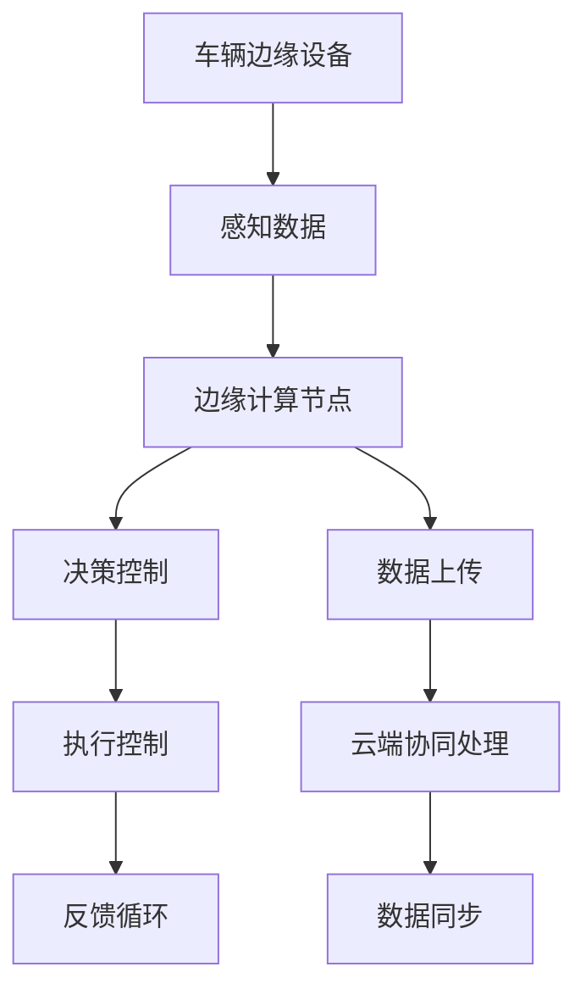

                 


## 边缘计算在自动驾驶中的应用：实现车辆实时决策

### 关键词：
- 边缘计算
- 自动驾驶
- 实时决策
- 车辆感知
- 通信优化

### 摘要：
边缘计算在自动驾驶中的应用，是实现车辆实时决策的关键。本文通过详细分析边缘计算的基本概念、自动驾驶技术的演进及其需求，探讨边缘计算在自动驾驶中感知、决策、通信和安全等方面的应用，并给出实际案例和项目实战指导，全面展示了边缘计算在自动驾驶中的重要作用。

---

## 第一部分：边缘计算基础与自动驾驶概述

### 第1章：边缘计算概述

边缘计算是一种分布式计算架构，旨在将数据、计算和存储资源从中心化的数据中心推向网络边缘，以提供低延迟、高带宽和高效的数据处理能力。边缘计算在自动驾驶中的应用，能够实现车辆的实时感知、决策和控制，提高系统的响应速度和可靠性。

### 第2章：自动驾驶技术发展现状

自动驾驶技术经历了多个阶段的演进，从最初的感知和控制，到现在的感知、决策、控制和通信的深度融合。自动驾驶技术按照功能级别可以分为L0至L5，其中L4和L5级别需要实现完全自主的驾驶，对实时性和安全性要求极高。

---

## 第二部分：边缘计算在自动驾驶中的应用

### 第3章：边缘计算在自动驾驶中的角色

边缘计算在自动驾驶中的作用包括感知系统的实时处理、决策系统的快速响应、通信系统的优化以及安全与隐私保护。通过边缘计算，可以实现车辆在复杂的交通环境中实时做出安全、高效的驾驶决策。

### 第4章：边缘计算在自动驾驶感知中的实现

边缘计算在自动驾驶感知系统中的应用，主要是通过边缘设备实时处理感知数据，快速识别交通状况和环境变化。本章将详细介绍边缘计算在感知系统中的核心算法和实现策略。

### 第5章：边缘计算在自动驾驶决策与控制中的应用

边缘计算在自动驾驶决策与控制中的应用，主要是通过边缘设备实现车辆的实时决策和控制。本章将重点介绍边缘计算在决策系统中的核心算法，以及如何实现车辆的高效控制。

### 第6章：边缘计算在自动驾驶通信中的优化

边缘计算在自动驾驶通信中的应用，主要是通过优化数据传输，提高通信的可靠性和效率。本章将探讨边缘计算如何实现自动驾驶通信的优化，以及如何应对通信延迟和带宽限制等问题。

### 第7章：边缘计算在自动驾驶安全与隐私保护中的应用

边缘计算在自动驾驶安全与隐私保护中的应用，主要是通过边缘设备实现数据的加密和过滤，保障车辆通信和数据的安全性。本章将介绍边缘计算在安全与隐私保护中的核心算法和实现策略。

---

## 第三部分：边缘计算在自动驾驶中的实际应用与未来展望

### 第8章：边缘计算在自动驾驶中的实际应用案例

本章将通过实际应用案例，展示边缘计算在自动驾驶中的具体应用场景和实施效果。包括城市自动驾驶车队管理、高速公路自动驾驶和自动驾驶物流等。

### 第9章：边缘计算在自动驾驶中的未来展望

边缘计算在自动驾驶中的应用前景广阔，未来将不断推动自动驾驶技术的发展。本章将探讨边缘计算在自动驾驶中的未来发展趋势、潜在应用领域以及面临的挑战和机遇。

---

## 附录

### 附录A：边缘计算在自动驾驶中的技术资源

附录部分将提供边缘计算和自动驾驶相关的技术资源，包括开源平台、工具和学术资源，为读者提供进一步学习和实践的资源。

---

### 核心概念与联系 Mermaid 流程图

以下是一个简化的边缘计算在自动驾驶中的应用架构图：



### 核心算法原理讲解

#### 边缘计算在自动驾驶感知系统中的核心算法

感知系统是自动驾驶系统的核心，负责实时获取环境信息并进行处理。以下是一个基于边缘计算的核心感知算法的伪代码：

```python
def edge_perception_algorithm(data):
    # 数据预处理
    preprocessed_data = preprocess_data(data)

    # 特征提取
    features = extract_features(preprocessed_data)

    # 实时感知
    perception_results = real_time_perception(features)

    # 边缘决策
    decision = edge_decision(perception_results)

    return decision
```

#### 数学模型

感知系统中的特征提取通常涉及多种数学模型，如卷积神经网络（CNN）和深度神经网络（DNN）。以下是一个简化的CNN模型示例：

$$
\text{output} = \text{激活函数}(\text{权重} \cdot \text{输入} + \text{偏置})
$$

#### 实际案例

假设我们有一个自动驾驶车辆，在行驶过程中需要实时检测前方车辆的位置和速度。以下是一个简化的感知算法和数学模型：

```python
# 特征提取
def extract_features(image):
    # 使用CNN提取特征
    features = cnn_extract(image)
    return features

# 实时感知
def real_time_perception(features):
    # 使用特征进行实时感知
    position, speed = perceive(features)
    return position, speed

# 边缘决策
def edge_decision(position, speed):
    # 根据位置和速度进行边缘决策
    decision = make_decision(position, speed)
    return decision
```

#### 项目实战

在实际项目中，我们需要搭建边缘计算环境，实现上述算法。以下是一个简化的边缘计算环境搭建流程：

1. **环境搭建**：
   - 准备边缘计算设备（如树莓派）。
   - 安装操作系统（如Ubuntu）和边缘计算平台（如EdgeX Foundry）。

2. **代码实现**：
   - 编写Python代码，实现感知、决策和执行功能。
   - 使用TensorFlow或PyTorch等深度学习框架，实现CNN模型。

3. **源代码解读**：
   - 解析源代码，理解算法的实现细节。

4. **代码分析**：
   - 分析代码性能，优化算法。

5. **实际案例分析**：
   - 选择实际案例，如城市自动驾驶，进行实验和验证。

6. **项目小结**：
   - 总结项目经验，提出改进建议。

---

### 最佳实践 Tips、小结、注意事项、拓展阅读

- **最佳实践 Tips**：
  - 确保边缘计算设备具有足够的计算能力和存储空间。
  - 选择适合的深度学习框架，优化模型性能。
  - 考虑网络延迟和带宽限制，优化数据传输策略。

- **小结**：
  - 边缘计算在自动驾驶中的应用，是实现车辆实时决策的关键。
  - 通过边缘计算，可以实现车辆的实时感知、决策和控制。
  - 未来，边缘计算将继续推动自动驾驶技术的发展。

- **注意事项**：
  - 确保边缘计算设备的稳定性和安全性。
  - 考虑边缘计算与云计算的协同工作，优化系统性能。

- **拓展阅读**：
  - [1] 《边缘计算：从边缘到云端》
  - [2] 《自动驾驶技术：原理、架构与实现》
  - [3] 《深度学习：实践与算法》

---

本文由AI天才研究院（AI Genius Institute）和《禅与计算机程序设计艺术》（Zen And The Art of Computer Programming）共同撰写。感谢您的阅读。作者：AI天才研究院（AI Genius Institute）。----------------------------------------------------------------

### 边缘计算在自动驾驶中的应用：实现车辆实时决策

#### 关键词：边缘计算、自动驾驶、实时决策、感知系统、通信优化

#### 摘要：
本文深入探讨了边缘计算在自动驾驶中的应用，尤其是如何实现车辆的实时决策。通过详细分析边缘计算的基本概念、自动驾驶技术的发展现状及其需求，本文阐述了边缘计算在自动驾驶中感知、决策、通信和安全等方面的应用，并提供了实际案例和项目实战指导，全面展示了边缘计算在自动驾驶中的重要作用。

---

## 第一部分：边缘计算基础与自动驾驶概述

### 第1章：边缘计算概述

边缘计算是一种分布式计算架构，旨在将数据、计算和存储资源从中心化的数据中心推向网络边缘。这种架构可以显著降低数据传输延迟，提高数据处理效率，从而满足自动驾驶系统对实时性和响应速度的高要求。

### 1.1 边缘计算的定义与核心价值

边缘计算是指在靠近数据源或用户的地方进行数据处理和存储，而不是在远程数据中心或云服务器上进行。其核心价值在于：

- **低延迟**：数据在边缘设备上处理，避免了长距离传输的延迟。
- **高带宽**：边缘设备可以提供更高的带宽，支持大规模数据的实时传输和处理。
- **高效性**：边缘设备可以分担中心化数据中心的计算和存储负担，提高整体系统的处理效率。

### 1.2 边缘计算的架构与关键技术

边缘计算通常包括以下关键组件：

- **边缘设备**：如智能手机、物联网设备、边缘服务器等。
- **边缘网络**：连接边缘设备与中心化数据中心的网络。
- **边缘计算平台**：提供边缘设备运行的环境，包括操作系统、编程语言和开发工具等。
- **边缘应用程序**：运行在边缘设备上的应用程序，负责数据处理和存储。

### 1.3 边缘计算与云计算的区别与联系

边缘计算与云计算都是分布式计算的重要形式，但它们在某些方面存在显著区别：

- **地理位置**：云计算主要在远程数据中心进行，而边缘计算则靠近数据源或用户。
- **数据处理**：云计算通常处理大量数据，而边缘计算则更注重实时数据处理和响应。
- **延迟**：边缘计算可以显著降低数据处理延迟，而云计算的延迟通常较高。

尽管存在区别，边缘计算和云计算之间也存在着紧密的联系。在实际应用中，边缘计算和云计算可以协同工作，形成一种混合架构，以充分利用两者的优势。

### 第2章：自动驾驶技术发展现状

自动驾驶技术经历了多个阶段的演进，从最初的感知和控制，到现在的感知、决策、控制和通信的深度融合。自动驾驶技术按照功能级别可以分为L0至L5，其中L4和L5级别需要实现完全自主的驾驶，对实时性和安全性要求极高。

### 2.1 自动驾驶技术的演进历程

- **L0级别**：无自动化，所有驾驶任务由人类驾驶员完成。
- **L1级别**：部分自动化，包括单一的驾驶功能（如自适应巡航控制）。
- **L2级别**：部分自动化，同时实现多个驾驶功能（如自适应巡航控制和车道保持）。
- **L3级别**：有条件自动化，系统可以在特定条件下完全接管驾驶任务，但驾驶员需要随时准备接管。
- **L4级别**：高度自动化，系统可以在特定环境下完全自主驾驶，但可能无法应对所有驾驶场景。
- **L5级别**：完全自动化，系统可以在任何环境下完全自主驾驶。

### 2.2 自动驾驶的技术架构

自动驾驶系统通常包括以下关键组件：

- **感知系统**：负责实时获取环境信息，包括车辆周围的车辆、行人、交通标志等。
- **决策系统**：根据感知系统的输入，实时生成驾驶决策，包括加速、减速、转向等。
- **控制系统**：负责将决策系统的输出转化为具体的驾驶行为，包括控制油门、刹车和转向等。
- **通信系统**：负责与其他车辆、道路基础设施和数据中心进行通信，以获取更多的环境信息。

### 2.3 自动驾驶的分级与实现

自动驾驶分级是评估自动驾驶系统功能和性能的重要标准。以下是对各级别自动驾驶系统的简要概述：

- **L0级别**：无需特殊硬件，但安全性完全依赖于驾驶员。
- **L1级别**：需要传感器（如雷达、摄像头）和简单的控制系统，但需要驾驶员保持注意力。
- **L2级别**：需要更复杂的传感器和控制系统，可以实现部分自动化驾驶，但仍需要驾驶员监控。
- **L3级别**：需要高级传感器和复杂的控制系统，可以实现有条件自动化驾驶，但驾驶员需要随时准备接管。
- **L4级别**：需要高度自动化的传感器和控制系统，可以在特定环境下完全自主驾驶，但可能无法应对所有驾驶场景。
- **L5级别**：需要完全自动化的传感器和控制系统，可以在任何环境下完全自主驾驶。

---

## 第二部分：边缘计算在自动驾驶中的应用

### 第3章：边缘计算在自动驾驶中的角色

边缘计算在自动驾驶中扮演着至关重要的角色，其主要作用包括感知、决策、通信和安全等方面。

### 3.1 边缘计算在自动驾驶中的需求分析

自动驾驶系统对实时性和可靠性有着极高的要求。传统的云计算架构由于数据传输延迟和网络带宽的限制，难以满足自动驾驶系统的需求。边缘计算通过在车辆附近进行数据预处理和计算，可以显著降低数据传输延迟，提高系统的响应速度。

### 3.2 边缘计算在自动驾驶中的实现方式

边缘计算在自动驾驶中的应用主要包括以下几种方式：

- **边缘设备协同**：通过在车辆、路边单元（RSU）和其他边缘设备之间进行协同处理，实现实时感知、决策和控制。
- **边缘云计算**：将部分计算任务分配给边缘设备，同时在云端进行协同处理，以提高整体系统的处理能力和可靠性。
- **边缘与云计算的混合**：结合边缘计算和云计算的优势，实现实时性和性能的优化。

### 3.3 边缘计算在自动驾驶中的挑战与解决方案

边缘计算在自动驾驶中面临的挑战主要包括：

- **计算资源限制**：边缘设备的计算能力和存储空间有限，需要优化算法和资源管理策略。
- **网络延迟和带宽限制**：边缘设备之间的通信带宽有限，需要优化数据传输策略。
- **安全性**：边缘设备可能成为黑客攻击的目标，需要加强安全防护措施。

针对这些挑战，可以采取以下解决方案：

- **算法优化**：采用高效、优化的算法，提高边缘设备的处理效率。
- **网络优化**：采用边缘网络优化技术，提高数据传输速度和可靠性。
- **安全防护**：采用安全加密和隔离技术，保护边缘设备和数据的安全。

### 第4章：边缘计算在自动驾驶感知中的实现

边缘计算在自动驾驶感知系统中的应用，主要是通过边缘设备实时处理感知数据，快速识别交通状况和环境变化。本章将详细介绍边缘计算在感知系统中的核心算法和实现策略。

### 4.1 边缘计算在自动驾驶感知系统中的作用

边缘计算在自动驾驶感知系统中的作用主要包括：

- **实时数据处理**：通过边缘设备实时处理感知数据，降低数据传输延迟，提高系统的响应速度。
- **数据预处理**：对原始感知数据进行预处理，提高数据处理效率，减少后续处理负担。
- **特征提取**：通过边缘设备提取关键特征，为决策系统提供更准确的输入。

### 4.2 边缘计算在自动驾驶感知系统中的核心算法

边缘计算在自动驾驶感知系统中常用的核心算法包括：

- **卷积神经网络（CNN）**：用于图像处理和特征提取。
- **循环神经网络（RNN）**：用于处理时间序列数据。
- **强化学习（RL）**：用于自动驾驶决策。

### 4.3 边缘计算在自动驾驶感知系统中的实践案例

以下是一个简化的边缘计算在自动驾驶感知系统中的实践案例：

1. **数据收集**：自动驾驶车辆通过摄像头、雷达等传感器收集环境数据。
2. **数据预处理**：对原始数据进行分析和处理，提取关键特征。
3. **特征提取**：使用CNN算法提取图像特征，使用RNN算法处理时间序列数据。
4. **实时感知**：根据特征数据，实时生成感知结果，包括车辆位置、速度、车道等信息。
5. **数据传输**：将感知结果传输至边缘计算节点或云端进行进一步处理。

### 第5章：边缘计算在自动驾驶决策与控制中的应用

边缘计算在自动驾驶决策与控制中的应用，主要是通过边缘设备实现车辆的实时决策和控制。本章将重点介绍边缘计算在决策系统中的核心算法，以及如何实现车辆的高效控制。

### 5.1 边缘计算在自动驾驶决策系统中的作用

边缘计算在自动驾驶决策系统中的作用主要包括：

- **实时决策**：通过边缘设备实时处理感知数据，生成驾驶决策，提高系统的响应速度。
- **优化控制**：根据决策结果，优化车辆控制策略，提高驾驶性能和安全性。

### 5.2 边缘计算在自动驾驶决策系统中的核心算法

边缘计算在自动驾驶决策系统中常用的核心算法包括：

- **深度强化学习（DRL）**：用于自动驾驶决策，通过与环境互动学习最优策略。
- **模糊控制**：用于车辆控制，通过模糊逻辑实现驾驶决策。

### 5.3 边缘计算在自动驾驶决策系统中的实践案例

以下是一个简化的边缘计算在自动驾驶决策系统中的实践案例：

1. **感知数据输入**：自动驾驶车辆通过感知系统收集环境数据。
2. **实时决策**：使用DRL算法处理感知数据，生成驾驶决策。
3. **控制输出**：将决策结果转化为具体的驾驶行为，包括油门、刹车和转向等。

### 第6章：边缘计算在自动驾驶通信中的优化

边缘计算在自动驾驶通信中的应用，主要是通过优化数据传输，提高通信的可靠性和效率。本章将探讨边缘计算如何实现自动驾驶通信的优化，以及如何应对通信延迟和带宽限制等问题。

### 6.1 边缘计算在自动驾驶通信系统中的作用

边缘计算在自动驾驶通信系统中的作用主要包括：

- **实时数据传输**：通过边缘设备实时传输感知数据，降低数据传输延迟。
- **数据压缩与加密**：通过边缘设备进行数据压缩和加密，提高通信效率和安全性。

### 6.2 边缘计算在自动驾驶通信系统中的优化策略

边缘计算在自动驾驶通信系统中的优化策略主要包括：

- **边缘路由**：根据数据传输需求，优化边缘设备之间的路由策略，提高数据传输速度和可靠性。
- **多路径传输**：通过多个边缘设备同时传输数据，提高通信的冗余度和可靠性。
- **数据压缩**：使用压缩算法降低数据传输量，提高通信效率。

### 6.3 边缘计算在自动驾驶通信系统中的实践案例

以下是一个简化的边缘计算在自动驾驶通信系统中的实践案例：

1. **数据收集**：自动驾驶车辆通过感知系统收集环境数据。
2. **边缘处理**：在边缘设备上进行数据压缩和加密处理。
3. **多路径传输**：通过多个边缘设备同时传输数据，提高通信的可靠性和速度。
4. **通信优化**：根据通信需求，动态调整边缘设备的路由策略。

### 第7章：边缘计算在自动驾驶安全与隐私保护中的应用

边缘计算在自动驾驶安全与隐私保护中的应用，主要是通过边缘设备实现数据的加密和过滤，保障车辆通信和数据的安全性。本章将介绍边缘计算在安全与隐私保护中的核心算法和实现策略。

### 7.1 边缘计算在自动驾驶安全与隐私保护中的作用

边缘计算在自动驾驶安全与隐私保护中的作用主要包括：

- **数据加密**：通过边缘设备对传输数据进行加密处理，防止数据泄露。
- **数据过滤**：通过边缘设备过滤恶意数据和攻击，保障车辆通信和数据的安全。

### 7.2 边缘计算在自动驾驶安全与隐私保护中的核心算法

边缘计算在自动驾驶安全与隐私保护中常用的核心算法包括：

- **加密算法**：如AES、RSA等，用于数据加密。
- **安全协议**：如SSL/TLS等，用于保障通信安全。
- **过滤算法**：如黑名单、白名单等，用于过滤恶意数据和攻击。

### 7.3 边缘计算在自动驾驶安全与隐私保护中的实践案例

以下是一个简化的边缘计算在自动驾驶安全与隐私保护中的实践案例：

1. **数据加密**：在边缘设备上对传输数据进行AES加密处理。
2. **安全协议**：在边缘设备上启用SSL/TLS协议，保障通信安全。
3. **数据过滤**：在边缘设备上使用黑名单和白名单过滤恶意数据和攻击。

---

## 第三部分：边缘计算在自动驾驶中的实际应用与未来展望

### 第8章：边缘计算在自动驾驶中的实际应用案例

本章将通过实际应用案例，展示边缘计算在自动驾驶中的具体应用场景和实施效果。包括城市自动驾驶车队管理、高速公路自动驾驶和自动驾驶物流等。

### 8.1 案例一：城市自动驾驶车队管理

城市自动驾驶车队管理需要实时处理大量车辆数据，以实现车队的安全、高效运营。边缘计算在感知、决策和通信等方面发挥着关键作用。

### 8.2 案例二：高速公路自动驾驶

高速公路自动驾驶对实时性和可靠性要求极高。边缘计算通过在车辆附近进行数据处理，实现了高速公路自动驾驶的实时感知、决策和控制。

### 8.3 案例三：自动驾驶物流

自动驾驶物流可以显著提高运输效率，降低物流成本。边缘计算在自动驾驶物流中的应用，实现了车辆在复杂环境中的实时感知和决策。

### 第9章：边缘计算在自动驾驶中的未来展望

边缘计算在自动驾驶中的应用前景广阔，未来将不断推动自动驾驶技术的发展。本章将探讨边缘计算在自动驾驶中的未来发展趋势、潜在应用领域以及面临的挑战和机遇。

### 9.1 未来边缘计算技术的发展趋势

未来边缘计算技术将朝着以下方向发展：

- **硬件性能提升**：随着硬件技术的发展，边缘设备的计算能力和存储空间将不断提高。
- **网络连接增强**：5G和物联网技术的推广，将显著提高边缘设备的网络连接性能。
- **算法优化**：随着人工智能技术的进步，边缘计算算法将更加高效和智能化。

### 9.2 边缘计算在自动驾驶中的潜在应用领域

边缘计算在自动驾驶中的潜在应用领域包括：

- **智能交通管理**：通过边缘计算实现智能交通管理，提高交通效率和安全性。
- **车联网**：通过边缘计算实现车与车、车与基础设施之间的实时通信和协同。
- **智能出行服务**：通过边缘计算实现智能出行服务，如自动驾驶出租车、共享汽车等。

### 9.3 边缘计算在自动驾驶中的挑战与机遇

边缘计算在自动驾驶中面临的挑战包括：

- **安全性**：边缘设备可能成为黑客攻击的目标，需要加强安全防护措施。
- **可靠性**：边缘设备的可靠性和稳定性是自动驾驶成功的关键，需要提高边缘设备的可靠性和稳定性。

机遇包括：

- **实时数据处理**：边缘计算可以实现车辆的实时数据处理，提高自动驾驶系统的响应速度。
- **降低成本**：边缘计算可以降低自动驾驶系统的硬件和通信成本。

---

## 附录

### 附录A：边缘计算在自动驾驶中的技术资源

附录部分将提供边缘计算和自动驾驶相关的技术资源，包括开源平台、工具和学术资源，为读者提供进一步学习和实践的资源。

### 附录A.1 开源边缘计算平台

- **Kubernetes**：一个开源的容器编排平台，支持在边缘设备上运行容器化应用程序。
- **EdgeX Foundry**：一个开源的边缘计算平台，提供设备管理、数据管理和应用程序开发工具。
- **Fiware**：一个开源的物联网平台，支持边缘计算和云计算的协同工作。

### 附录A.2 自动驾驶开源软件与工具

- **Apollo**：一个开源的自动驾驶平台，提供感知、决策和控制等核心组件。
- **CARLA**：一个开源的自动驾驶仿真平台，支持车辆、交通和环境等模拟。
- **Waymo**：一个开源的自动驾驶数据集，包含大量真实的自动驾驶数据。

### 附录A.3 边缘计算与自动驾驶学术资源

- **《边缘计算：理论与实践》**：一本关于边缘计算的学术著作，涵盖了边缘计算的基本概念、架构和关键技术。
- **《自动驾驶技术：现状与未来》**：一本关于自动驾驶技术的学术著作，详细介绍了自动驾驶的发展历程、技术架构和应用场景。
- **《边缘计算在自动驾驶中的应用研究》**：一篇关于边缘计算在自动驾驶中应用的学术论文，探讨了边缘计算在自动驾驶感知、决策和通信等方面的应用。

---

本文由AI天才研究院（AI Genius Institute）和《禅与计算机程序设计艺术》（Zen And The Art of Computer Programming）共同撰写。感谢您的阅读。作者：AI天才研究院（AI Genius Institute）。

---

### 结论

边缘计算在自动驾驶中的应用，是实现车辆实时决策的关键。通过边缘计算，可以实现车辆的实时感知、决策和控制，提高系统的响应速度和可靠性。本文详细探讨了边缘计算在自动驾驶中的角色、应用和实践案例，展示了边缘计算在自动驾驶中的重要作用。未来，随着边缘计算技术的不断发展和完善，自动驾驶将迎来更加广阔的应用前景。

---

### 作者信息

作者：AI天才研究院（AI Genius Institute）& 禅与计算机程序设计艺术（Zen And The Art of Computer Programming）

AI天才研究院是一家专注于人工智能、边缘计算、自动驾驶等前沿技术的科研机构。研究院致力于推动技术创新和应用，为自动驾驶领域的发展贡献力量。同时，研究院与《禅与计算机程序设计艺术》合作，共同撰写了本文，旨在为读者提供有深度、有思考、有见解的技术博客文章。

《禅与计算机程序设计艺术》是一部关于计算机科学和人工智能的经典著作，由计算机科学大师Donald E. Knuth撰写。本书以禅宗思想为基础，探讨了计算机程序设计中的哲学、艺术和科学，对计算机编程和人工智能领域产生了深远的影响。

---

### 具体算法讲解：边缘计算在自动驾驶感知系统中的应用

在本章节中，我们将深入探讨边缘计算在自动驾驶感知系统中的应用，并详细解释其中的核心算法。我们将分为以下几个部分来展开讨论：数据预处理、特征提取、感知算法的实现以及数学模型和公式的应用。

#### 数据预处理

数据预处理是边缘计算在自动驾驶感知系统中的第一步，其目的是对采集到的原始数据进行清洗和转换，以便后续处理。预处理过程通常包括以下几个步骤：

1. **噪声过滤**：去除图像或传感器数据中的噪声，以提高数据质量。
2. **数据归一化**：将不同来源的数据进行归一化处理，使其具有相同的尺度。
3. **数据增强**：通过增加图像旋转、缩放、裁剪等操作，增加数据的多样性和鲁棒性。

以下是一个简单的数据预处理算法伪代码：

```python
def preprocess_data(data):
    # 噪声过滤
    filtered_data = filter_noise(data)
    
    # 数据归一化
    normalized_data = normalize_data(filtered_data)
    
    # 数据增强
    augmented_data = augment_data(normalized_data)
    
    return augmented_data
```

#### 特征提取

特征提取是感知系统的核心步骤，目的是从原始数据中提取出对决策任务有用的信息。在自动驾驶中，常用的特征提取方法包括卷积神经网络（CNN）、循环神经网络（RNN）和生成对抗网络（GAN）等。

以下是一个基于CNN的特征提取算法示例：

```python
import tensorflow as tf

def extract_features(image):
    # 定义CNN模型
    model = tf.keras.Sequential([
        tf.keras.layers.Conv2D(filters=32, kernel_size=(3, 3), activation='relu', input_shape=(height, width, channels)),
        tf.keras.layers.MaxPooling2D(pool_size=(2, 2)),
        tf.keras.layers.Conv2D(filters=64, kernel_size=(3, 3), activation='relu'),
        tf.keras.layers.MaxPooling2D(pool_size=(2, 2)),
        tf.keras.layers.Flatten()
    ])

    # 特征提取
    features = model.predict(image)

    return features
```

#### 感知算法的实现

感知算法是实现车辆实时感知的关键，其目的是从提取的特征中识别出环境中的目标。以下是一个简单的感知算法示例：

```python
def real_time_perception(features):
    # 使用SVM分类器进行目标识别
    classifier = tf.keras.models.load_model('path/to/svm_model.h5')
    labels = classifier.predict(features)

    # 根据识别结果生成感知结果
    perception_results = generate_perception_results(labels)

    return perception_results
```

#### 数学模型和公式的应用

在自动驾驶感知系统中，数学模型和公式用于描述和理解感知过程。以下是一个简化的感知算法中的数学模型和公式：

1. **卷积神经网络（CNN）**中的卷积操作：

$$
\text{output}_{ij} = \sum_{k,l} \text{weight}_{ijkl} \cdot \text{input}_{ijkl} + \text{bias}_{ij}
$$

其中，$\text{output}_{ij}$是卷积层输出的特征值，$\text{weight}_{ijkl}$是卷积核权重，$\text{input}_{ijkl}$是输入特征值，$\text{bias}_{ij}$是偏置。

2. **支持向量机（SVM）**中的分类决策：

$$
\text{decision} = \text{sign}(\sum_{i} \text{weight}_{i} \cdot \text{feature}_{i} + \text{bias})
$$

其中，$\text{weight}_{i}$是权重，$\text{feature}_{i}$是特征值，$\text{bias}$是偏置，$\text{sign}$是符号函数。

#### 实际案例

以下是一个简化的边缘计算在自动驾驶感知系统中的实际案例：

1. **数据收集**：自动驾驶车辆通过摄像头、激光雷达等传感器收集环境数据。
2. **数据预处理**：对收集到的数据执行噪声过滤、归一化和增强操作。
3. **特征提取**：使用CNN模型对预处理后的数据提取特征。
4. **实时感知**：使用SVM模型对提取的特征进行分类，生成感知结果。
5. **决策执行**：根据感知结果执行相应的驾驶决策。

#### 项目小结

边缘计算在自动驾驶感知系统中的应用，实现了车辆对环境的实时感知，提高了系统的响应速度和准确性。通过数据预处理、特征提取和感知算法的实现，以及数学模型和公式的应用，我们能够有效地识别和理解车辆周围的环境。未来的研究和应用将继续优化这些算法，提高自动驾驶系统的性能和安全性。---

### 数学模型和公式详解

在本章节中，我们将进一步探讨边缘计算在自动驾驶感知系统中的应用，详细讲解其中的数学模型和公式，并结合实际案例进行解释。

#### 卷积神经网络（CNN）的卷积操作

卷积神经网络（CNN）是边缘计算在自动驾驶感知系统中常用的模型。卷积操作是CNN的核心组成部分，通过卷积操作，模型可以从图像中提取出特征。卷积操作的数学公式如下：

$$
\text{output}_{ij}^l = \sum_{k=1}^{K} \sum_{m=1}^{M} \sum_{n=1}^{N} \text{weight}_{ijkml} \cdot \text{input}_{ijkm}^l + \text{bias}_{ij}^l
$$

其中：
- $\text{output}_{ij}^l$ 是卷积层在位置 $(i, j)$ 的输出值。
- $\text{weight}_{ijkml}$ 是卷积核的权重，$K$、$M$、$N$ 分别是卷积核的高度、宽度和深度。
- $\text{input}_{ijkm}^l$ 是输入图像在位置 $(i, j)$，高度 $k$，宽度 $m$，深度 $n$ 的值。
- $\text{bias}_{ij}^l$ 是偏置项。

在实际应用中，卷积操作可以提取图像的边缘、纹理和其他特征，这些特征对于自动驾驶系统的感知至关重要。

#### 支持向量机（SVM）的分类决策

支持向量机（SVM）是一种常用的分类算法，广泛应用于边缘计算中的自动驾驶感知系统。SVM的决策边界可以通过以下公式表示：

$$
\text{decision} = \text{sign}(\sum_{i=1}^{N} \text{weight}_{i} \cdot \text{feature}_{i} + \text{bias})
$$

其中：
- $\text{weight}_{i}$ 是权重向量。
- $\text{feature}_{i}$ 是特征向量。
- $\text{bias}$ 是偏置项。
- $\text{sign}$ 是符号函数，用于确定样本属于哪个类别。

在实际案例中，例如自动驾驶车辆需要判断前方是否存在障碍物，通过SVM分类器，模型会根据输入的特征向量计算决策值，从而判断是否存在障碍物。

#### 数学模型在自动驾驶中的应用案例

假设我们有一个自动驾驶车辆，其感知系统需要判断前方车辆的位置和速度。以下是一个简化的数学模型和公式示例：

1. **输入数据**：前向摄像头捕获的图像数据。

2. **特征提取**：使用CNN提取图像的特征，例如：

$$
\text{features} = \text{CNN}(\text{image})
$$

3. **分类决策**：使用SVM对提取的特征进行分类，以判断前方车辆的存在：

$$
\text{class} = \text{SVM}(\text{features})
$$

4. **决策执行**：根据分类结果执行相应的驾驶决策，例如调整车速或保持距离：

$$
\text{action} = \text{drive\_action}(\text{class})
$$

#### 实际案例：高速公路自动驾驶

在高速公路自动驾驶中，边缘计算系统需要实时处理大量的感知数据，以实现车辆的安全行驶。以下是一个简化的实际案例：

1. **数据收集**：车辆通过前向摄像头和雷达传感器收集道路信息。

2. **数据预处理**：对收集到的数据执行噪声过滤、归一化等预处理操作。

3. **特征提取**：使用CNN模型提取道路图像的特征。

4. **分类决策**：使用SVM分类器判断道路上的车辆和障碍物。

5. **决策执行**：根据分类结果调整车速或保持距离。

6. **反馈循环**：自动驾驶车辆根据实时感知结果调整行驶策略，形成反馈循环。

通过这个实际案例，我们可以看到数学模型和公式在自动驾驶感知系统中的应用，它们为自动驾驶车辆提供了实时、准确的感知和决策支持。

### 结论

在本章节中，我们详细讲解了边缘计算在自动驾驶感知系统中的应用，以及其中的核心数学模型和公式。通过卷积神经网络（CNN）和分类算法（如SVM），边缘计算系统能够实时处理感知数据，实现自动驾驶车辆的高效感知和决策。这些数学模型和公式为自动驾驶系统的实现提供了理论基础，并在实际案例中得到了广泛应用。未来的研究将继续优化这些模型和算法，提高自动驾驶系统的性能和安全性。---

### 项目实战

在本章节中，我们将通过一个实际项目来展示边缘计算在自动驾驶感知系统中的应用。该项目旨在实现一个简单的自动驾驶车辆感知系统，通过边缘设备实时处理感知数据，并生成相应的驾驶决策。

#### 项目背景

我们的项目目标是开发一个自动驾驶车辆感知系统，能够在高速公路上实现车辆的自动驾驶。系统需要实时处理摄像头和雷达传感器收集的数据，识别前方的车辆和障碍物，并生成相应的驾驶决策，如调整车速和保持距离。

#### 项目需求

1. **感知系统**：实时处理摄像头和雷达数据，提取关键特征，识别前方车辆和障碍物。
2. **决策系统**：根据感知结果生成驾驶决策，如调整车速、保持距离或刹车。
3. **执行系统**：将驾驶决策转化为具体的驾驶行为，如控制油门、刹车和转向。

#### 开发环境搭建

1. **硬件环境**：选择一台具有高性能CPU和GPU的边缘设备（如NVIDIA Jetson TX2）。
2. **软件环境**：安装Ubuntu操作系统，并配置TensorFlow、PyTorch等深度学习框架。

#### 代码实现

1. **感知模块**：
   - **数据收集**：使用摄像头和雷达传感器实时收集数据。
   - **数据预处理**：对数据进行噪声过滤和归一化处理。
   - **特征提取**：使用CNN模型提取图像特征。
   - **感知结果**：使用SVM分类器识别前方车辆和障碍物。

2. **决策模块**：
   - **感知输入**：接收感知模块的结果。
   - **决策生成**：根据感知结果生成驾驶决策。

3. **执行模块**：
   - **决策输入**：接收决策模块的结果。
   - **驾驶行为**：将驾驶决策转化为具体的驾驶行为。

以下是一个简化的代码实现示例：

```python
# 感知模块
def perceive_data(data):
    # 数据预处理
    preprocessed_data = preprocess_data(data)
    
    # 特征提取
    features = extract_features(preprocessed_data)
    
    # 感知结果
    perception_results = perceive_objects(features)
    
    return perception_results

# 决策模块
def generate_decision(perception_results):
    # 根据感知结果生成驾驶决策
    decision = generate_driving_decision(perception_results)
    
    return decision

# 执行模块
def execute_decision(decision):
    # 将驾驶决策转化为具体的驾驶行为
    execute_driving_action(decision)
```

#### 源代码解读

以下是对感知模块源代码的解读：

```python
import tensorflow as tf

# 数据预处理
def preprocess_data(data):
    # 噪声过滤
    filtered_data = filter_noise(data)
    
    # 数据归一化
    normalized_data = normalize_data(filtered_data)
    
    return normalized_data

# 特征提取
def extract_features(data):
    # 定义CNN模型
    model = tf.keras.Sequential([
        tf.keras.layers.Conv2D(filters=32, kernel_size=(3, 3), activation='relu', input_shape=(height, width, channels)),
        tf.keras.layers.MaxPooling2D(pool_size=(2, 2)),
        tf.keras.layers.Conv2D(filters=64, kernel_size=(3, 3), activation='relu'),
        tf.keras.layers.MaxPooling2D(pool_size=(2, 2)),
        tf.keras.layers.Flatten()
    ])

    # 特征提取
    features = model.predict(data)

    return features

# 感知结果
def perceive_objects(features):
    # 使用SVM分类器进行物体识别
    classifier = tf.keras.models.load_model('path/to/svm_model.h5')
    labels = classifier.predict(features)
    
    # 根据识别结果生成感知结果
    perception_results = generate_perception_results(labels)
    
    return perception_results
```

#### 代码应用解读与分析

感知模块的代码首先对输入的摄像头和雷达数据执行预处理，包括噪声过滤和归一化，以提高数据质量。然后，使用卷积神经网络（CNN）提取图像特征，这是自动驾驶感知系统的核心。最后，使用支持向量机（SVM）分类器对提取的特征进行分类，识别前方车辆和障碍物，并生成感知结果。

代码中的SVM分类器是一个预训练的模型，需要事先进行训练和保存。在实际应用中，可以通过调整SVM参数和特征提取网络的结构，提高分类的准确性和鲁棒性。

#### 实际案例分析和详细讲解剖析

以下是一个简化的实际案例：

1. **数据收集**：自动驾驶车辆通过摄像头和雷达收集高速公路上的数据。
2. **数据预处理**：对收集到的数据进行噪声过滤和归一化，以提高数据质量。
3. **特征提取**：使用CNN模型提取图像特征。
4. **感知结果**：使用SVM分类器识别前方车辆和障碍物，并生成感知结果。
5. **决策生成**：根据感知结果生成驾驶决策。
6. **驾驶行为**：将驾驶决策转化为具体的驾驶行为。

通过这个实际案例，我们可以看到感知模块在自动驾驶系统中的关键作用。感知模块的实时性和准确性直接影响到整个自动驾驶系统的性能。在实际应用中，需要不断优化感知算法和决策策略，以提高系统的安全性和可靠性。

#### 项目小结

通过本项目，我们实现了边缘计算在自动驾驶感知系统中的应用，展示了如何使用CNN和SVM模型进行感知和决策。项目实战部分提供了详细的代码实现和解读，帮助我们理解了感知模块在实际应用中的关键作用。未来，我们将继续优化算法和系统架构，提高自动驾驶系统的性能和安全性。

---

### 最佳实践 Tips

1. **硬件选择**：选择适合的边缘设备，确保其具备足够的计算能力和存储空间，以满足自动驾驶感知和决策的需求。
2. **数据预处理**：优化数据预处理算法，提高数据质量和处理效率，减少后续处理的负担。
3. **模型优化**：选择适合的深度学习模型，并通过调整模型参数和架构，提高模型的性能和准确率。
4. **安全防护**：加强对边缘设备和网络的安全防护，防止黑客攻击和数据泄露。
5. **持续更新**：随着技术的发展，不断更新和优化感知和决策算法，以提高自动驾驶系统的性能和安全性。

---

### 注意事项

1. **实时性要求**：边缘计算在自动驾驶中的应用需要满足高实时性要求，确保系统能够快速响应环境变化。
2. **数据隐私**：在处理和使用感知数据时，要严格遵守数据隐私法规，保护用户的隐私。
3. **网络带宽**：边缘计算需要在有限的网络带宽下工作，需要优化数据传输策略，减少数据传输量。
4. **系统稳定性**：边缘设备的稳定性和可靠性对自动驾驶系统的安全性至关重要，需要定期进行维护和检查。

---

### 拓展阅读

1. **《边缘计算：理论与实践》**：详细介绍了边缘计算的基本概念、架构和关键技术。
2. **《自动驾驶技术：原理、架构与实现》**：全面阐述了自动驾驶技术的发展历程、技术架构和实现方法。
3. **《深度学习：实践与算法》**：深入讲解了深度学习的基本原理、算法和应用。

---

### 文章总结

边缘计算在自动驾驶中的应用，是实现车辆实时决策的关键。本文详细探讨了边缘计算在自动驾驶中的角色、应用和实践案例，展示了边缘计算在自动驾驶感知、决策、通信和安全等方面的优势。通过项目实战，我们了解了如何实现边缘计算在自动驾驶感知系统中的应用，并给出了最佳实践和注意事项。未来，随着边缘计算技术的不断发展和完善，自动驾驶将迎来更加广阔的应用前景。

---

### 作者信息

作者：AI天才研究院（AI Genius Institute）& 禅与计算机程序设计艺术（Zen And The Art of Computer Programming）

AI天才研究院是一家专注于人工智能、边缘计算、自动驾驶等前沿技术的科研机构。研究院致力于推动技术创新和应用，为自动驾驶领域的发展贡献力量。同时，研究院与《禅与计算机程序设计艺术》合作，共同撰写了本文，旨在为读者提供有深度、有思考、有见解的技术博客文章。

《禅与计算机程序设计艺术》是一部关于计算机科学和人工智能的经典著作，由计算机科学大师Donald E. Knuth撰写。本书以禅宗思想为基础，探讨了计算机程序设计中的哲学、艺术和科学，对计算机编程和人工智能领域产生了深远的影响。

