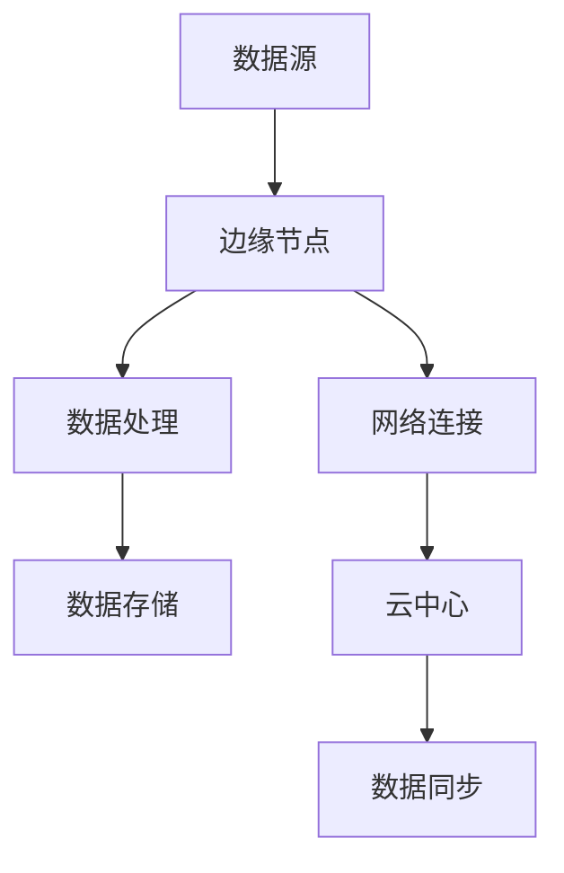
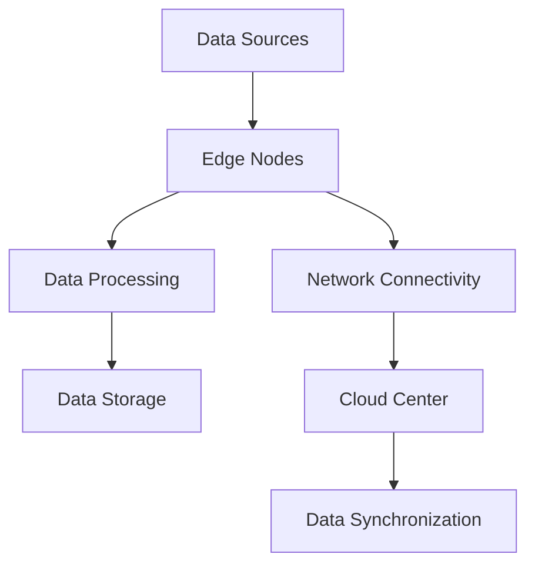
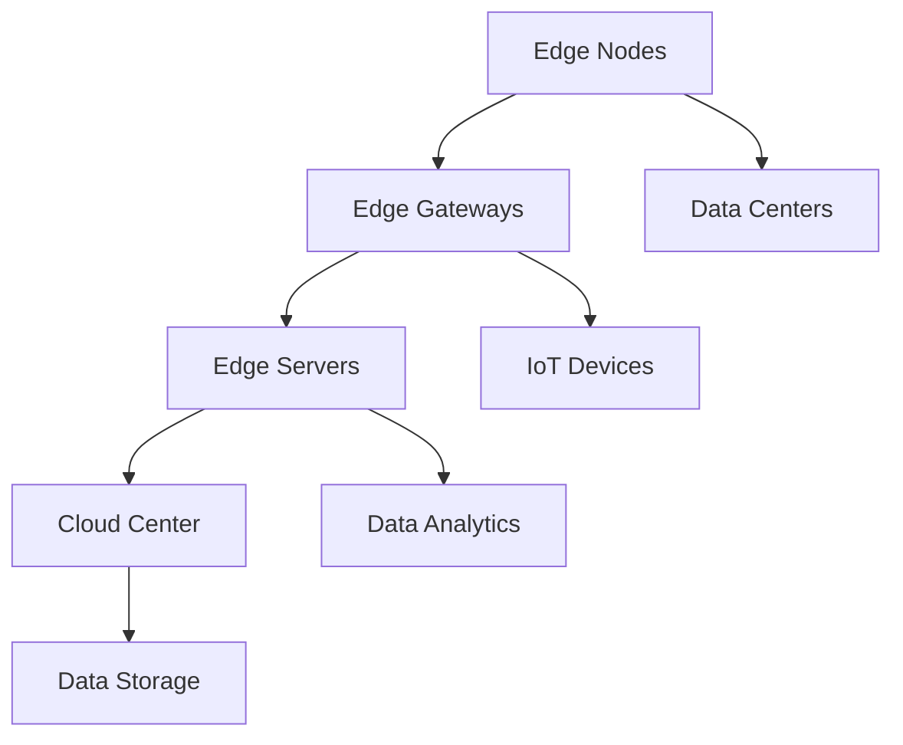
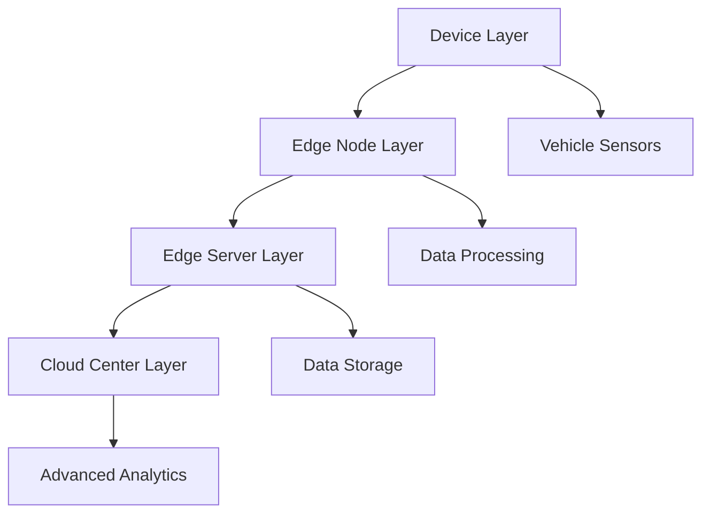
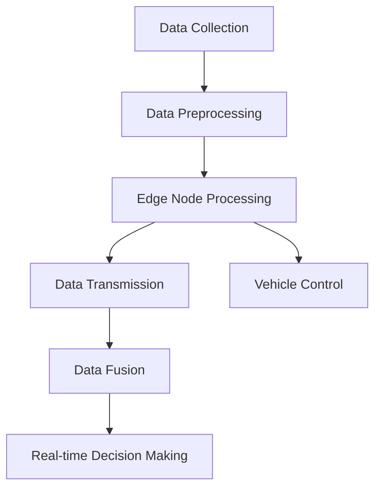
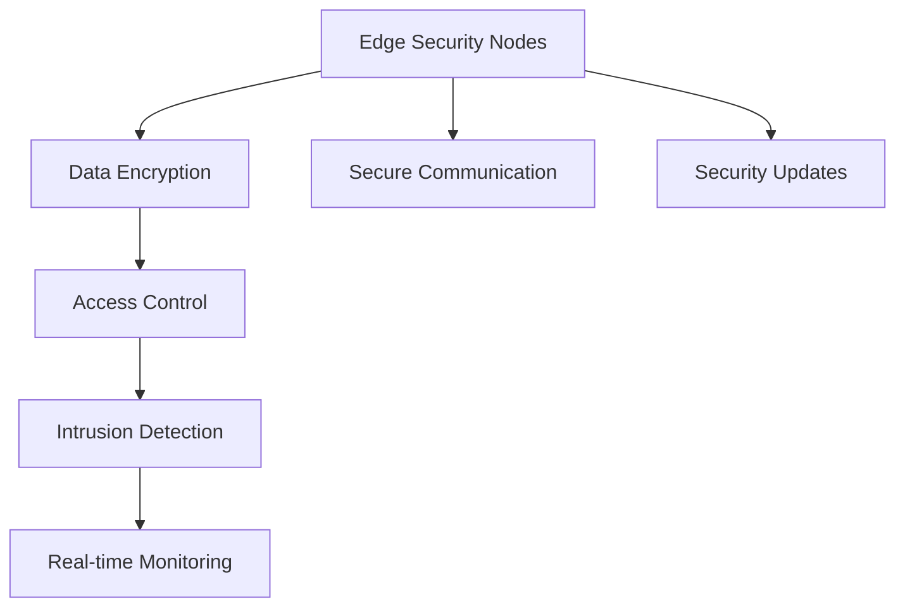
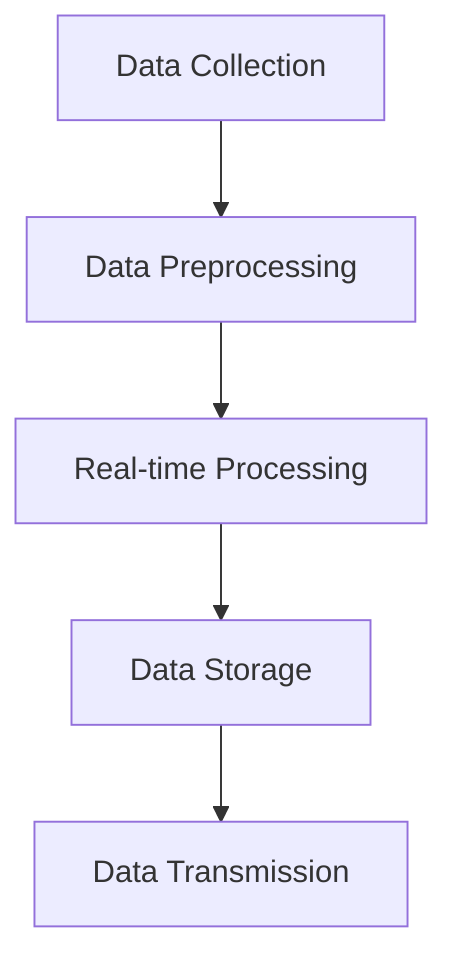

                 

### 第1章：边缘计算概述

边缘计算（Edge Computing）作为近年来迅速崛起的计算模式，逐渐在信息技术领域占据了一席之地。其核心思想是将计算能力和数据存储从传统的集中式数据中心，迁移到网络的边缘，即靠近数据源头或用户的端点设备。这一转变不仅降低了延迟，还提升了数据处理效率，满足了实时性和低延迟的需求。

#### **1.1 边缘计算的起源与发展**

边缘计算的概念最早可以追溯到1990年代，当时在工业领域，为了提高制造设备的自动化水平，研究者们开始探索在设备附近部署计算节点，以便实时处理数据。随着互联网和物联网的快速发展，边缘计算在2010年代初期逐渐引起广泛关注。谷歌、微软、思科等科技巨头纷纷投入大量资源，推动边缘计算技术的研究和应用。

#### **1.2 边缘计算的核心概念**

边缘计算的核心概念包括以下几个方面：

1. **计算位置**：计算位置从云端迁移到网络边缘，靠近数据源头。
2. **数据处理**：数据处理能力从集中式数据中心分散到多个边缘节点，从而实现实时数据处理。
3. **数据存储**：数据存储也从云端迁移到边缘，降低了数据传输成本。
4. **网络架构**：边缘计算架构包括边缘节点、云中心以及两者之间的连接。这种架构可以灵活配置，以满足不同应用场景的需求。

#### **1.3 边缘计算与传统云计算的差异**

边缘计算与传统的云计算存在显著差异，主要体现在以下几个方面：

1. **延迟**：边缘计算显著降低了数据传输和处理的延迟，使其更适用于实时性要求高的应用场景。
2. **带宽**：边缘计算通过本地处理，减少了数据传输量，降低了网络带宽需求。
3. **安全性**：边缘计算通过在本地处理敏感数据，提高了数据安全性。
4. **成本**：由于数据处理分散到边缘节点，可以减少对中心数据中心的依赖，从而降低运营成本。

#### **总结**

边缘计算作为一种新兴的计算模式，通过将计算、存储和网络能力迁移到网络的边缘，极大地提升了数据处理效率，满足了实时性和低延迟的需求。在未来，边缘计算将在智能制造、智慧城市、智能交通等领域发挥重要作用，为人类社会带来更加智能和高效的生活方式。

#### **核心概念与联系架构图**

以下是边缘计算的核心概念架构图，展示了边缘计算主要组件及其相互关系：

#### **核心概念联系架构图解释**

- **数据源**：包括各种设备、传感器等，产生大量实时数据。
- **边缘节点**：部署在网络的边缘，负责本地数据处理。
- **数据处理**：边缘节点对数据进行初步处理，提取关键信息。
- **数据存储**：数据可以临时存储在边缘节点，或者同步到云中心。
- **网络连接**：边缘节点通过网络与云中心相连，实现数据传输和同步。
- **云中心**：负责管理和调度边缘节点，同时进行大规模数据处理和存储。

通过这一架构，边缘计算实现了数据的实时处理和存储，满足了低延迟和高可靠性的需求。在接下来的章节中，我们将进一步探讨边缘计算的具体架构设计和应用场景。

---

**核心概念联系架构图（Mermaid 格式）**

---

在下一章中，我们将详细探讨边缘计算的核心概念及其与车联网的紧密联系。敬请期待！

---

## 第2章：边缘计算架构

边缘计算架构是边缘计算系统设计和实现的基础，它涉及多个关键组件和层次结构。了解这些组件和层次结构，对于深入理解边缘计算的工作原理和实际应用至关重要。

#### **2.1 边缘计算架构设计原则**

边缘计算架构设计需要遵循以下几项基本原则：

1. **分布式计算**：边缘计算通过分布在不同位置的边缘节点，实现计算能力的分散化，从而提高系统的可靠性和可扩展性。
2. **低延迟**：边缘节点靠近数据源头，能够实现数据的本地处理，显著降低传输延迟，满足实时性需求。
3. **高可靠性**：边缘计算架构需要具备高可靠性，能够在网络不稳定或边缘节点故障的情况下，保证数据的处理和传输不受影响。
4. **数据安全**：边缘计算架构需要采取严格的安全措施，保护敏感数据不被未经授权访问。
5. **可扩展性**：边缘计算架构应具备良好的可扩展性，能够适应不同规模和复杂度的应用场景。

#### **2.2 边缘计算架构主要组件**

边缘计算架构主要包括以下几个关键组件：

1. **边缘节点**：边缘节点是边缘计算架构的核心组成部分，负责数据的采集、预处理和初步分析。边缘节点可以是各种设备，如路由器、交换机、服务器等。
2. **边缘网关**：边缘网关是边缘节点与外部网络（如互联网、云中心）之间的接口，负责数据传输和路由。边缘网关还需要实现协议转换、安全认证等功能。
3. **边缘服务器**：边缘服务器是具有较强计算和存储能力的设备，通常部署在数据中心或边缘数据中心，用于处理和分析来自边缘节点的数据。
4. **云中心**：云中心是边缘计算架构的核心部分，负责管理和调度边缘节点，提供大规模数据处理和存储服务。云中心还可以为边缘节点提供计算和存储资源。
5. **数据中心**：数据中心是集中式计算资源的集中地，用于处理和分析来自边缘节点的海量数据，并提供数据存储和备份服务。

#### **2.3 边缘计算架构的实际应用场景**

边缘计算架构在实际应用中，可以针对不同的场景和需求，进行灵活的配置和优化。以下是一些常见的实际应用场景：

1. **工业自动化**：在工业自动化领域，边缘计算可以用于实时监测生产线设备状态，快速响应异常情况，提高生产效率。
2. **智能交通**：在智能交通领域，边缘计算可以用于实时交通流量监测、信号灯控制、车辆管理等，提高交通管理效率和安全性。
3. **智慧城市**：在智慧城市领域，边缘计算可以用于环境监测、智能照明、智能安防等，提升城市管理和居民生活质量。
4. **智能医疗**：在智能医疗领域，边缘计算可以用于实时监测患者生命体征、远程医疗诊断等，提高医疗服务的效率和准确性。

#### **总结**

边缘计算架构通过分布式计算、低延迟、高可靠性、数据安全和可扩展性等设计原则，实现了计算和数据的实时处理和传输。边缘节点、边缘网关、边缘服务器、云中心和数据中心等组件共同构成了边缘计算架构，满足了各类应用场景的需求。在接下来的章节中，我们将进一步探讨边缘计算在车联网中的应用，敬请期待。

---

**边缘计算架构图（Mermaid 格式）**

---

在下一章中，我们将探讨边缘计算在车联网中的需求和重要性，敬请期待！

---

### 第3章：边缘计算与车联网

#### **3.1 车联网概述**

车联网（Internet of Vehicles，IoV）是指将车辆、道路、基础设施以及其他交通相关设备通过互联网连接起来，实现信息交换和共享。车联网不仅包括车辆之间的通信，还涵盖了车辆与基础设施、车辆与网络、车辆与云平台之间的数据交互。车联网的主要目标是通过智能化的信息处理和决策支持，提高交通安全、效率和便捷性。

#### **3.2 边缘计算在车联网中的需求分析**

车联网具有高实时性、高可靠性和大规模设备连接的特点，对边缘计算提出了以下需求：

1. **低延迟**：车联网中的许多应用，如自动驾驶、实时交通监控等，对延迟要求极高。边缘计算通过在车辆附近部署计算节点，实现数据的实时处理和响应，降低网络延迟。
2. **高可靠性**：车联网应用需要在恶劣的驾驶环境中保持稳定运行，边缘计算通过分布式架构和冗余设计，提高了系统的可靠性。
3. **数据存储和处理**：车联网产生的大量数据需要本地存储和处理，边缘计算可以在车辆附近进行数据预处理和分析，减少数据传输和存储成本。
4. **设备连接和协同**：车联网中存在大量的传感器和设备，边缘计算通过边缘节点实现设备连接和协同工作，提升整体系统性能。

#### **3.3 边缘计算在车联网中的应用框架**

边缘计算在车联网中的应用框架通常包括以下几个层次：

1. **设备层**：包括各种车载传感器、通信设备等，负责数据采集和初步处理。
2. **边缘节点层**：边缘节点位于车辆附近，负责数据的进一步处理和分析，如车辆定位、路径规划等。
3. **边缘服务器层**：边缘服务器位于边缘数据中心，负责大规模数据存储、处理和分析，如车辆状态监测、交通流量预测等。
4. **云中心层**：云中心负责管理和调度边缘节点，提供高级数据处理和分析服务，如智能交通管理、车辆健康监测等。

#### **边缘计算在车联网中的应用案例**

1. **自动驾驶**：边缘计算可以用于自动驾驶车辆的实时感知和决策，通过边缘节点处理传感器数据，实现快速路径规划和避障。
2. **实时交通监控**：边缘计算可以用于实时交通流量监测和信号灯控制，通过边缘节点处理车辆数据，实现智能交通管理和优化。
3. **车联网安全**：边缘计算可以用于车联网安全防护，通过边缘节点实现实时安全监控和响应，提高车联网的安全性。
4. **车辆健康管理**：边缘计算可以用于车辆状态监测和故障诊断，通过边缘节点收集车辆数据，实现车辆健康管理和预防性维护。

#### **总结**

边缘计算在车联网中具有重要作用，通过低延迟、高可靠性和大规模设备连接等优势，满足了车联网的高实时性、高可靠性和大规模设备连接的需求。边缘计算的应用框架包括设备层、边缘节点层、边缘服务器层和云中心层，通过分层架构实现数据的实时处理和分析。边缘计算在自动驾驶、实时交通监控、车联网安全和车辆健康管理等领域具有广泛的应用前景。在下一章中，我们将探讨边缘计算在实现车辆间实时通信中的应用，敬请期待。

---

**边缘计算在车联网中的应用框架图（Mermaid 格式）**

---

在下一章中，我们将探讨边缘计算如何实现车辆间实时通信，敬请期待！

---

### 第4章：边缘计算实现车辆间实时通信

车辆间实时通信是车联网中至关重要的一环，它能够显著提高道路安全、交通效率和车辆协作水平。边缘计算通过将计算和数据处理能力部署在网络的边缘，为车辆间的实时通信提供了强有力的支持。

#### **4.1 实时通信在车联网中的重要性**

车联网中的实时通信具有以下几方面的重要性：

1. **提高道路安全**：通过车辆间的实时通信，车辆可以提前获知前方路况和潜在危险，从而采取相应的预防措施，减少交通事故的发生。
2. **提升交通效率**：实时通信有助于优化交通流量，减少拥堵，提高道路通行能力，从而降低交通延误和油耗。
3. **增强车辆协作**：实时通信使车辆能够协同工作，例如自动驾驶车辆之间可以共享路线信息，实现协同驾驶，提高整体交通系统的运行效率。
4. **支持高级应用**：实时通信为高级应用提供了基础，如自动驾驶、智能交通管理和车联网安全等。

#### **4.2 边缘计算平台搭建**

实现车辆间实时通信需要一个高效的边缘计算平台。以下是搭建边缘计算平台的步骤：

1. **选择边缘节点**：边缘节点可以是高性能的路由器、交换机或嵌入式设备，应根据实际需求选择适合的设备。
2. **部署操作系统**：在边缘节点上部署支持边缘计算的操作系统，如Linux、RTOS等，确保系统稳定运行。
3. **安装边缘计算框架**：安装边缘计算框架，如Kubernetes、EdgeX Foundry等，这些框架提供了边缘节点的管理和调度功能。
4. **配置网络连接**：确保边缘节点与外部网络（如互联网、云中心）之间的稳定连接，实现数据传输和同步。
5. **部署通信协议**：配置支持车辆间实时通信的协议，如V2X（Vehicle-to-Everything）通信协议，实现车辆之间的数据交换。

#### **4.3 车辆间实时通信实现方案**

实现车辆间实时通信的关键在于确保数据的实时性、可靠性和安全性。以下是实现方案：

1. **数据采集与预处理**：在车辆上部署传感器，采集速度、位置、加速度等数据。边缘节点对数据进行预处理，如滤波、压缩等，提高数据传输效率。
2. **边缘数据处理**：边缘节点对预处理后的数据进行进一步处理，如车辆状态监测、路径规划等。处理结果将用于车辆的实时决策。
3. **数据传输与同步**：边缘节点通过V2X通信协议，将处理后的数据传输给相邻车辆。数据传输需要保证实时性和可靠性，可采用多路径传输和冗余机制。
4. **数据处理与融合**：相邻车辆接收到的数据需要进行处理和融合，以获得更准确的车辆状态和交通信息。处理结果可用于车辆导航、协同控制等。
5. **安全通信**：为了保证数据传输的安全性，边缘计算平台需要采用安全通信协议，如TLS、IPSec等，防止数据被窃取或篡改。

#### **4.4 车辆间实时通信性能优化**

为了提高车辆间实时通信的性能，可以采取以下优化措施：

1. **网络优化**：优化边缘节点的网络配置，提高数据传输速率和稳定性。可采用多路径传输、负载均衡等技术，降低网络延迟和故障率。
2. **数据压缩**：采用高效的数据压缩算法，降低数据传输量，提高通信效率。例如，可以采用Huffman编码、LZ77等压缩算法。
3. **缓存机制**：在边缘节点上配置缓存，提高数据的访问速度。缓存机制可以减少数据重复传输，降低网络带宽需求。
4. **负载均衡**：通过负载均衡技术，合理分配计算和存储资源，避免边缘节点过载。例如，可以采用轮询、最小连接数等负载均衡算法。
5. **故障检测与恢复**：配置故障检测和恢复机制，确保边缘计算平台的稳定运行。例如，可以采用心跳检测、自动重启等技术。

#### **总结**

边缘计算为车辆间实时通信提供了强大的支持，通过边缘节点的分布式计算和数据处理能力，实现了数据的实时性和可靠性。实现车辆间实时通信的关键在于数据采集、预处理、传输、处理和融合等环节。通过优化网络、数据压缩、缓存和故障检测等手段，可以提高通信性能和系统稳定性。在下一章中，我们将探讨边缘计算在车联网安全中的应用，敬请期待。

---

**边缘计算实现车辆间实时通信流程图（Mermaid 格式）**

---

在下一章中，我们将探讨边缘计算在车联网安全中的作用，敬请期待！

---

### 第5章：边缘计算在车联网安全中的应用

车联网（IoV）安全是确保车联网系统稳定、可靠运行的重要保障。随着车联网技术的快速发展，车辆之间、车辆与基础设施之间的数据交换越来越频繁，这使得车联网系统面临着越来越多的安全威胁。边缘计算作为一种新兴的计算模式，通过分布式计算和数据处理能力，为车联网安全提供了强有力的支持。

#### **5.1 车联网安全挑战**

车联网安全面临以下几方面的挑战：

1. **数据泄露**：车联网中涉及大量敏感数据，如车辆位置、行驶轨迹、乘客信息等。这些数据一旦泄露，可能导致严重的隐私泄露和财产损失。
2. **拒绝服务攻击（DDoS）**：车联网系统可能受到DDoS攻击，导致系统瘫痪，影响交通管理和车辆控制。
3. **恶意软件攻击**：恶意软件可以植入车辆系统，窃取数据、篡改车辆控制指令，甚至引发交通事故。
4. **车辆间欺骗**：攻击者可以通过伪造车辆信息，欺骗其他车辆，导致交通事故或其他安全事件。
5. **通信链路攻击**：车联网中车辆与基础设施、车辆与车辆之间的通信链路可能受到攻击，导致通信中断或数据篡改。

#### **5.2 边缘计算在车联网安全中的作用**

边缘计算在车联网安全中发挥着重要作用，主要体现在以下几个方面：

1. **数据本地化处理**：边缘计算可以将部分数据处理和存储任务部署在边缘节点，降低敏感数据传输和存储的风险。通过本地化处理，可以有效减少数据泄露的风险。
2. **实时安全监控**：边缘计算可以实现实时安全监控，快速检测和响应潜在的安全威胁。例如，边缘节点可以实时分析车辆间的通信数据，检测异常行为，并采取相应的防护措施。
3. **分布式安全防护**：边缘计算通过分布式架构，将安全防护任务分布在多个边缘节点上，提高了系统的抗攻击能力。即使某个边缘节点受到攻击，其他节点仍然可以正常运行，确保整体系统的安全性。
4. **快速响应与隔离**：边缘计算可以实现快速响应和隔离，当检测到安全威胁时，可以立即采取措施，如隔离受感染的节点、断开异常连接等，防止安全事件扩大。

#### **5.3 边缘计算车联网安全架构设计**

边缘计算车联网安全架构设计需要考虑以下几个方面：

1. **边缘安全节点**：部署在车辆附近的安全节点，负责数据的本地化处理和安全监控。边缘安全节点需要具备高性能、低延迟和安全可靠的特点。
2. **数据加密与完整性验证**：对传输的数据进行加密和完整性验证，确保数据在传输过程中不被窃取或篡改。可以使用SSL/TLS等加密协议，结合数字签名等验证机制。
3. **访问控制**：对边缘节点的访问进行严格控制，只有授权的实体才能访问敏感数据和系统资源。可以使用访问控制列表（ACL）、多因素认证（MFA）等技术实现。
4. **入侵检测与防御系统**：部署入侵检测与防御系统（IDS/IPS），实时监控车辆间的通信数据，检测和响应恶意攻击。例如，可以使用机器学习算法分析数据模式，识别异常行为。
5. **安全更新与维护**：定期更新边缘节点的安全软件和系统，修复已知漏洞，提高系统的安全性。可以使用自动化工具实现安全更新的自动化部署。

#### **5.4 安全通信协议实现**

实现车联网中的安全通信协议是确保数据安全和通信可靠性的关键。以下是一些常用的安全通信协议：

1. **TLS（传输层安全协议）**：用于保护数据在传输过程中的完整性和机密性，适用于车辆与基础设施、车辆与云之间的通信。
2. **IPSec（互联网安全协议）**：用于保护数据在互联网传输过程中的安全，适用于车辆与车辆之间的通信。
3. **SDP（会话描述协议）**：用于建立和管理车辆间的安全通信会话，支持TLS、IPSec等多种安全协议。
4. **CoAP（约束应用协议）**：适用于资源受限的环境，如车辆传感器和边缘节点，提供轻量级的安全通信机制。
5. **OTA（远程升级）**：用于安全地更新车辆软件，确保系统的安全性和完整性。

#### **总结**

边缘计算在车联网安全中发挥着至关重要的作用，通过分布式计算和数据处理能力，实现了数据的本地化处理、实时安全监控和分布式安全防护。边缘计算车联网安全架构设计需要综合考虑边缘安全节点、数据加密、访问控制、入侵检测与防御系统等多个方面。实现安全通信协议，如TLS、IPSec、CoAP等，是保障车联网数据安全和通信可靠性的关键。在下一章中，我们将探讨边缘计算在车联网数据处理中的应用，敬请期待。

---

**边缘计算车联网安全架构设计图（Mermaid 格式）**

---

在下一章中，我们将探讨边缘计算在车联网数据处理中的应用，敬请期待！

---

### 第6章：边缘计算在车联网数据处理中的应用

车联网（IoV）作为物联网（IoT）的重要组成部分，其数据处理面临着巨大的挑战。车联网中产生的数据量巨大，且具有高实时性、多样性和动态性。边缘计算通过分布式计算和本地化处理，为车联网数据处理提供了有效的解决方案。

#### **6.1 车联网数据处理需求**

车联网数据处理需求主要包括以下几个方面：

1. **实时性**：车联网应用（如自动驾驶、智能交通管理）对数据处理有极高的实时性要求。边缘计算可以在本地快速处理数据，减少传输延迟，满足实时性需求。
2. **海量数据**：车联网中连接的车辆数量庞大，每个车辆产生大量数据，如传感器数据、位置信息、行驶轨迹等。边缘计算通过分布式架构，能够高效处理海量数据。
3. **多样性**：车联网数据类型多样，包括结构化数据（如数据库记录）和非结构化数据（如图像、视频等）。边缘计算能够支持多种数据格式，提供灵活的处理方案。
4. **动态性**：车联网环境动态变化，如交通状况、天气条件等，数据特性也随之变化。边缘计算可以实时调整数据处理策略，以适应动态环境。

#### **6.2 边缘计算数据处理流程**

边缘计算在车联网数据处理中的流程通常包括以下几个步骤：

1. **数据采集**：车联网中的各类传感器（如GPS、加速度计、摄像头等）采集车辆和道路信息，生成原始数据。
2. **数据预处理**：边缘节点对原始数据进行预处理，如数据清洗、去噪、压缩等，提高数据质量和传输效率。
3. **实时处理**：边缘节点对预处理后的数据进行实时处理，如数据分析、模式识别、预测等，生成实时结果。
4. **数据存储**：边缘节点将处理后的数据存储在本地或同步到云中心，以供后续分析和应用。
5. **数据传输**：边缘节点将处理结果传输给其他车辆、基础设施或云平台，实现数据的共享和协同。

#### **6.3 数据处理算法与模型选择**

在车联网数据处理中，选择合适的算法和模型至关重要。以下是一些常用的算法和模型：

1. **机器学习算法**：如决策树、支持向量机（SVM）、神经网络（NN）等，用于车辆状态预测、路径规划、交通流量预测等。
2. **深度学习模型**：如卷积神经网络（CNN）、循环神经网络（RNN）等，用于图像识别、语音识别等任务。
3. **关联规则学习**：用于发现车辆和道路之间的关联关系，如Apriori算法、FP-Growth算法等。
4. **聚类算法**：如K-means、DBSCAN等，用于车辆分类、交通流量分析等。
5. **时间序列分析**：如ARIMA模型、LSTM模型等，用于交通流量预测、车辆行为预测等。

#### **6.4 数据处理性能优化**

为了提高车联网数据处理的性能，可以采取以下优化措施：

1. **并行计算**：利用多核处理器和分布式计算架构，实现并行数据处理，提高处理速度。
2. **数据缓存**：在边缘节点上配置缓存，减少数据访问延迟，提高数据处理效率。
3. **分布式存储**：采用分布式存储系统，如HDFS、Cassandra等，提高数据存储和处理能力。
4. **负载均衡**：通过负载均衡技术，合理分配计算和存储资源，避免资源瓶颈。
5. **压缩算法**：采用高效的数据压缩算法，减少数据传输量和存储需求。

#### **总结**

边缘计算在车联网数据处理中发挥着重要作用，通过分布式计算和本地化处理，满足了车联网数据处理的实时性、海量性、多样性和动态性需求。选择合适的算法和模型，并采取优化措施，可以进一步提高数据处理性能。在下一章中，我们将通过具体实践案例，展示边缘计算在车联网中的应用，敬请期待。

---

**边缘计算车联网数据处理流程图（Mermaid 格式）**

---

在下一章中，我们将通过实践案例展示边缘计算在车联网中的应用，敬请期待！

---

### 第7章：边缘计算在车联网中的实践案例

为了更好地理解边缘计算在车联网中的应用，我们将通过几个具体的实践案例，展示边缘计算如何提升车联网的安全、效率和协同能力。

#### **7.1 案例一：智能交通系统**

智能交通系统（ITS）是边缘计算在车联网中应用的一个重要领域。通过在道路交叉口和交通监控点部署边缘节点，实现实时交通数据的采集、处理和传输，智能交通系统可以大幅提升交通管理效率。

**案例概述：**

在某城市的智能交通项目中，采用了边缘计算技术，在多个交通节点部署了边缘节点。这些边缘节点负责收集道路上的交通流量、车速、车辆密度等数据，并通过边缘计算平台进行实时处理。处理结果用于交通信号灯的优化控制，实现红绿灯时间的动态调整，从而缓解交通拥堵。

**关键技术：**

- **边缘节点部署**：在关键交通节点部署边缘节点，实现本地数据处理。
- **实时数据处理**：边缘节点对采集到的交通数据进行实时处理，提取关键信息。
- **信号灯优化控制**：基于边缘节点的处理结果，动态调整信号灯的时间设置，优化交通流量。

**效果分析：**

通过智能交通系统的应用，该城市的交通拥堵情况得到了显著改善。红绿灯优化控制使得交通流量更加顺畅，减少了车辆等待时间，提高了道路通行能力。此外，边缘计算还支持实时交通监控和事件预警，提高了交通管理的效率和安全性。

#### **7.2 案例二：自动驾驶车辆协同**

自动驾驶技术的广泛应用离不开边缘计算的支持。边缘计算在自动驾驶车辆协同控制中发挥着重要作用，通过车辆之间的实时通信和数据共享，实现自动驾驶车辆的安全、高效协作。

**案例概述：**

在某自动驾驶示范区，部署了多个边缘计算节点，用于自动驾驶车辆的实时通信和协同控制。自动驾驶车辆通过V2X（Vehicle-to-Everything）通信协议，与边缘节点和其他车辆进行数据交换，实现实时路径规划和协同控制。

**关键技术：**

- **V2X通信协议**：实现车辆之间的高效通信和数据共享。
- **边缘节点**：部署在道路附近的边缘节点，负责车辆数据的处理和传输。
- **协同控制算法**：基于边缘节点的处理结果，实现自动驾驶车辆的实时路径规划和协同控制。

**效果分析：**

通过自动驾驶车辆协同控制，示范区内的道路通行效率得到了显著提升。自动驾驶车辆能够实时调整行驶路径，避开拥堵路段，提高了整体交通系统的运行效率。此外，边缘计算还支持自动驾驶车辆的安全监控和紧急情况处理，提高了自动驾驶系统的安全性和可靠性。

#### **7.3 案例三：车联网边缘计算平台搭建**

搭建一个高效、可靠的车联网边缘计算平台，是实现车联网应用的关键。通过该案例，我们将展示如何搭建一个基于边缘计算的车联网平台，并实现车辆实时通信和数据处理。

**案例概述：**

在某车联网项目中，搭建了一个基于边缘计算的车联网平台。该平台包括多个边缘节点、边缘服务器和云中心，实现了车辆与基础设施、车辆与车辆之间的实时通信和数据处理。

**关键技术：**

- **边缘节点**：部署在车辆附近，负责数据的采集、预处理和初步处理。
- **边缘服务器**：部署在边缘数据中心，负责大规模数据处理和存储。
- **云中心**：负责管理和调度边缘节点，提供高级数据处理和分析服务。

**效果分析：**

通过车联网边缘计算平台的搭建，实现了车辆与基础设施、车辆与车辆之间的实时通信和协同控制。平台支持多种车联网应用，如自动驾驶、智能交通管理和车联网安全等，提高了车联网系统的整体性能和可靠性。此外，边缘计算平台还具备良好的扩展性，能够适应不同规模和复杂度的应用场景。

#### **总结**

通过以上实践案例，我们可以看到边缘计算在车联网中的应用具有重要的现实意义。边缘计算通过分布式计算和本地化处理，实现了交通管理、自动驾驶和车联网平台搭建等多方面的应用。这些案例不仅展示了边缘计算的技术优势，还体现了其在提升车联网系统安全、效率和协同能力方面的巨大潜力。在未来的发展中，边缘计算将在车联网中发挥更加重要的作用，推动车联网技术的不断进步。

---

在下一章中，我们将探讨边缘计算在车联网的未来趋势，敬请期待！

---

### 第8章：边缘计算在车联网的未来趋势

随着边缘计算技术的不断成熟和普及，其在车联网中的应用前景愈发广阔。边缘计算与车联网的深度融合，不仅能够推动车联网技术的发展，还将带来一系列新的机遇和挑战。

#### **8.1 边缘计算在车联网中的应用前景**

边缘计算在车联网中的应用前景主要体现在以下几个方面：

1. **自动驾驶**：自动驾驶技术对实时性和可靠性要求极高，边缘计算通过本地化处理和分布式架构，能够为自动驾驶车辆提供实时感知、路径规划和决策支持，大幅提升自动驾驶系统的性能和安全性。

2. **智能交通管理**：边缘计算能够实现交通数据的实时处理和优化，通过智能交通管理系统，实现交通流量监测、信号灯控制和交通事件预警等功能，提高交通效率和安全性。

3. **车联网安全**：边缘计算可以为车联网提供分布式安全防护，实时监测和防御潜在的安全威胁，提高车联网系统的安全性和可靠性。

4. **车联网数据处理**：边缘计算能够高效处理海量车联网数据，通过分布式计算和本地化处理，降低数据传输和存储成本，提高数据处理效率。

5. **车联网协同**：边缘计算支持车辆之间、车辆与基础设施之间的实时通信和协同工作，实现车联网的智能化和高效化。

#### **8.2 车联网与边缘计算融合的发展方向**

车联网与边缘计算的融合，将朝着以下几个方向发展：

1. **网络架构优化**：通过优化网络架构，实现车联网与边缘计算的深度融合。例如，采用5G网络、车联网专用网络等，提高通信速率和可靠性。

2. **边缘计算平台升级**：升级边缘计算平台，增强其计算能力和数据处理能力，以支持更复杂的车联网应用。例如，采用高性能边缘节点、分布式边缘服务器等。

3. **智能算法与应用创新**：结合车联网应用需求，开发智能算法和应用，提升车联网系统的智能化水平。例如，利用深度学习算法进行车辆行为预测、交通流量优化等。

4. **安全防护机制完善**：加强车联网与边缘计算的安全防护，建立完善的网络安全体系，提高车联网系统的安全性和抗攻击能力。

5. **标准化与生态建设**：推动车联网与边缘计算的标准化进程，构建良好的产业生态，促进技术的创新和应用的普及。

#### **8.3 边缘计算面临的挑战与解决方案**

边缘计算在车联网中的应用面临一系列挑战，需要通过技术创新和策略优化来克服：

1. **计算资源限制**：边缘节点的计算资源相对有限，需要通过优化算法和资源调度，提高计算效率。

2. **通信带宽限制**：车联网中的通信带宽有限，需要通过数据压缩、多路径传输等技术，提高数据传输效率。

3. **数据隐私与安全**：边缘计算涉及大量敏感数据，需要通过加密、访问控制等技术，确保数据的安全性和隐私性。

4. **边缘节点管理**：边缘节点的分布性和动态性，使得管理复杂度增加，需要通过自动化管理、故障恢复等技术，提高系统的可靠性。

5. **协同与一致性**：在分布式环境中，确保边缘节点之间的协同工作和数据一致性是一个挑战，需要通过分布式算法和协议，实现高效的协同与一致性。

#### **总结**

边缘计算在车联网中的应用前景广阔，将推动车联网技术的不断进步。通过优化网络架构、升级边缘计算平台、开发智能算法、完善安全防护机制和推动标准化进程，可以应对边缘计算在车联网中面临的挑战。未来，边缘计算与车联网的深度融合，将为人类社会带来更加智能、高效和安全的交通系统。

---

在附录部分，我们将提供边缘计算与车联网相关的资源、开源框架和工具，以及车联网边缘计算平台搭建的指南，以帮助读者进一步深入了解和应用边缘计算技术。

---

### 附录A：边缘计算与车联网相关资源

以下是边缘计算与车联网相关的一些重要资源，包括研究论文、白皮书、技术博客和开源社区等。

1. **研究论文**：
   - "Edge Computing: Vision and Challenges"（边缘计算：愿景与挑战） 
   - "V2X Communication: Enabling Intelligent Transportation Systems"（V2X通信：智能交通系统的关键）

2. **白皮书**：
   - "5G边缘计算：推动智能交通变革"（5G Edge Computing: Driving the Transformation of Intelligent Transportation）
   - "车联网边缘计算白皮书"（White Paper on Edge Computing for Internet of Vehicles）

3. **技术博客**：
   - "边缘计算在自动驾驶中的应用"（Application of Edge Computing in Autonomous Driving）
   - "车联网边缘计算：从概念到实践"（Edge Computing for IoT: From Concept to Practice）

4. **开源社区**：
   - **边缘计算开源框架**：
     - EdgeX Foundry：一个开源的边缘计算平台，支持设备连接、数据处理和系统管理。
     - Kubernetes：一个开源的容器编排平台，适用于分布式边缘计算环境。
     - OpenFog Reference Architecture：一个开源的边缘计算参考架构，支持物联网和车联网应用。
   - **车联网开源框架**：
     - OpenV2X：一个开源的V2X通信框架，支持车联网数据传输和安全通信。
     - ROS（Robot Operating System）：一个开源的机器人操作系统，适用于自动驾驶和智能交通应用。

### 附录B：边缘计算开源框架与工具

以下是边缘计算领域常用的一些开源框架和工具，用于搭建和维护边缘计算平台。

1. **Kubernetes**：
   - 介绍：一个开源的容器编排平台，用于自动化部署、扩展和管理容器化应用。
   - 优点：具备高可用性、可伸缩性和自动化管理能力。
   - 链接：<https://kubernetes.io/>

2. **Docker**：
   - 介绍：一个开源的应用容器引擎，用于打包、交付和运行应用。
   - 优点：简化应用部署和迁移，提高开发效率和可移植性。
   - 链接：<https://www.docker.com/>

3. **Apache Kafka**：
   - 介绍：一个开源的流处理平台，用于实时数据传输和流处理。
   - 优点：具备高吞吐量、可伸缩性和可靠性。
   - 链接：<https://kafka.apache.org/>

4. **OpenFog Reference Architecture**：
   - 介绍：一个开源的边缘计算参考架构，支持物联网和车联网应用。
   - 优点：提供了一套完整的边缘计算解决方案，包括设备连接、数据处理和系统管理。
   - 链接：<https://openfog.github.io/>

5. **EdgeX Foundry**：
   - 介绍：一个开源的边缘计算平台，支持设备连接、数据处理和系统管理。
   - 优点：具有高度可定制性和灵活性，适用于各种边缘计算应用场景。
   - 链接：<https://www.edgexfoundry.org/>

### 附录C：车联网边缘计算平台搭建指南

搭建一个高效、可靠的车联网边缘计算平台，需要遵循以下步骤：

1. **需求分析**：
   - 确定平台的应用场景和功能需求，如自动驾驶、智能交通管理等。
   - 分析数据处理量、通信速率和系统可靠性等性能指标。

2. **架构设计**：
   - 设计边缘计算架构，包括边缘节点、边缘服务器和云中心的层次结构。
   - 确定网络架构，选择合适的通信协议和数据传输方式。

3. **硬件选择**：
   - 选择合适的边缘节点硬件，如路由器、交换机和嵌入式设备。
   - 根据计算和存储需求，选择边缘服务器硬件。

4. **软件安装**：
   - 在边缘节点和边缘服务器上安装操作系统和边缘计算框架，如Kubernetes和EdgeX Foundry。
   - 配置网络连接，确保边缘节点与外部网络和云中心之间的稳定连接。

5. **边缘节点部署**：
   - 在边缘节点上部署传感器和通信设备，实现数据的采集和传输。
   - 配置边缘节点的数据处理和存储任务，实现数据的本地化处理。

6. **边缘服务器部署**：
   - 在边缘服务器上部署数据处理和分析任务，实现大规模数据存储和处理。
   - 配置边缘服务器与云中心之间的数据同步机制，确保数据的实时性和一致性。

7. **安全配置**：
   - 配置数据加密、访问控制和安全监控等安全机制，确保数据传输和存储的安全性。
   - 定期更新边缘节点和边缘服务器的安全软件，修复已知漏洞。

8. **测试与优化**：
   - 对边缘计算平台进行性能测试和功能验证，确保平台的稳定性和可靠性。
   - 根据测试结果，对平台进行优化和调整，提高系统的性能和效率。

通过以上步骤，可以搭建一个高效、可靠的车联网边缘计算平台，支持实时交通管理、自动驾驶和车联网安全等应用。

---

在本文中，我们详细探讨了边缘计算在车联网中的应用，从边缘计算概述、架构设计、车辆间实时通信、车联网安全、数据处理到实践案例，全面展示了边缘计算如何提升车联网的安全、效率和协同能力。同时，我们也提供了边缘计算与车联网相关的资源、开源框架和搭建指南，以帮助读者进一步深入了解和应用边缘计算技术。

### **总结与展望**

边缘计算作为新一代计算模式，正在迅速融入车联网领域，为车联网技术的发展提供了强有力的支撑。通过边缘计算，车联网可以实现低延迟、高可靠性和大规模设备连接，从而提升交通管理、自动驾驶和车联网安全的水平。

未来，随着5G、物联网和人工智能等技术的不断发展，边缘计算在车联网中的应用将更加深入和广泛。我们可以期待以下发展趋势：

1. **智能化**：边缘计算将推动车联网应用向智能化方向发展，实现自动驾驶、智能交通管理和车联网安全的智能化决策。
2. **高效协同**：边缘计算将实现车辆之间、车辆与基础设施之间的实时协同，提高交通系统的整体效率和安全性。
3. **安全性提升**：通过分布式计算和安全防护机制，边缘计算将显著提高车联网系统的安全性，防范潜在的安全威胁。
4. **生态建设**：随着技术的成熟和应用的普及，边缘计算将构建起一个完善的产业生态，推动车联网技术的创新和进步。

让我们携手合作，共同探索边缘计算在车联网中的应用，为构建一个更加智能、高效和安全的车联网世界而努力。

---

**作者信息**

作者：AI天才研究院/AI Genius Institute & 禅与计算机程序设计艺术 /Zen And The Art of Computer Programming

感谢您的阅读，期待与您在技术前沿的探讨中相遇！

