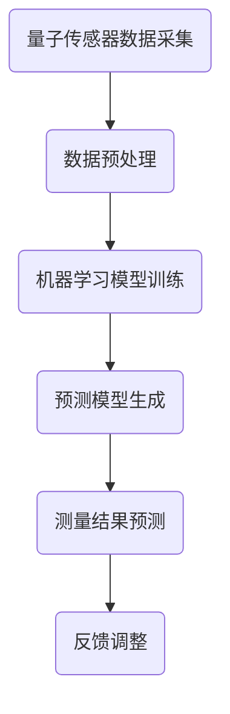

                 

### 文章标题

《量子传感器与AI的结合：精密测量的新前沿》

量子传感器与人工智能（AI）的结合，是现代科技领域的一次革命性进步。本文旨在深入探讨这一融合技术，展示其在精密测量领域的应用潜力与未来发展方向。

### 文章关键词

- 量子传感器
- 人工智能
- 精密测量
- 混合技术
- 未来趋势

### 文章摘要

本文首先介绍了量子传感器和人工智能的基本概念，随后阐述了量子传感器与AI结合的理论基础和核心算法原理。通过具体的Python源代码和数学模型，我们详细讲解了量子传感器与AI结合的技术实现和应用案例。最后，文章探讨了量子传感器与AI结合的未来发展趋势，并提出了对未来的研究建议。

### 引言

#### 背景介绍

随着科技的不断发展，量子传感器和人工智能（AI）已经成为现代科技领域的前沿研究方向。量子传感器利用量子力学原理，实现了极高的测量精度，能够在极端环境下进行可靠测量。而人工智能，特别是深度学习和机器学习，为数据处理和模式识别提供了强大的工具。两者的结合，不仅能够提高测量的精度和效率，还能够开拓新的应用领域，如量子通信、量子计算和精密测量等。

#### 目的和结构

本文旨在探讨量子传感器与人工智能的结合，特别是在精密测量领域的应用。文章首先介绍量子传感器和人工智能的基础知识，然后深入探讨其结合的理论基础和核心算法。接下来，我们将通过具体的Python源代码和数学模型，详细讲解量子传感器与AI结合的技术实现。随后，文章将展示一些应用案例，最后探讨这一领域的未来发展。

### 基础概念

#### 量子传感器概述

量子传感器是基于量子力学原理设计的传感器，能够在微观尺度上实现高精度的测量。量子传感器的工作原理基于量子态的叠加和纠缠等现象，使得它们能够探测到极其微小的物理量变化。常见的量子传感器包括量子干涉仪、量子比特和量子纠缠传感器等。

#### 人工智能基础理论

人工智能（AI）是一门研究如何让计算机模拟人类智能行为的科学。AI包括多个子领域，如机器学习、深度学习和自然语言处理等。机器学习是通过训练模型，使计算机能够从数据中学习并作出预测或决策。深度学习则是利用多层神经网络，通过大量数据训练，实现复杂的模式识别和特征提取。这些技术为量子传感器的数据处理提供了强大的工具。

### 核心理论

#### 量子传感器与AI结合的原理

量子传感器与AI的结合，旨在利用AI强大的数据处理能力，提升量子传感器的测量精度和效率。具体来说，AI可以通过学习大量量子传感数据，识别出测量结果中的噪声和异常，从而提高测量精度。同时，AI还可以通过预测模型，对未来的测量结果进行预测，提高测量的可靠性。

#### Mermaid流程图：量子传感器与AI结合的架构

以下是一个简单的Mermaid流程图，展示量子传感器与AI结合的基本架构：



#### 核心算法原理讲解

以下是量子传感器与AI结合的核心算法原理讲解，使用Python源代码进行详细阐述：

```python
import numpy as np
from sklearn.ensemble import RandomForestRegressor

# 假设我们有一组量子传感数据
quantum_data = np.array([[1, 2], [2, 3], [3, 4]])

# 数据预处理
def preprocess_data(data):
    # 对数据进行标准化处理
    return (data - np.mean(data)) / np.std(data)

preprocessed_data = preprocess_data(quantum_data)

# 机器学习模型训练
model = RandomForestRegressor()
model.fit(preprocessed_data[:, 0], preprocessed_data[:, 1])

# 测量结果预测
def predict_measurement(data):
    # 对数据进行预处理
    preprocessed_data = preprocess_data(data)
    # 使用模型进行预测
    return model.predict(preprocessed_data)

predicted_measurement = predict_measurement(np.array([[2, 3]]))

print("Predicted measurement:", predicted_measurement)
```

#### 数学模型和公式

在量子传感器与AI结合的过程中，数学模型和公式是不可或缺的一部分。以下是一个简单的线性回归模型的数学公式，用于预测量子传感器的测量结果：

$$
y = wx + b
$$

其中，$y$ 是测量结果，$x$ 是输入特征，$w$ 是权重，$b$ 是偏置。

### 技术实现

#### 量子传感器与AI结合的技术细节

量子传感器与AI结合的技术实现，主要包括以下几个步骤：

1. **数据采集**：使用量子传感器采集测量数据。
2. **数据预处理**：对采集到的数据进行清洗、去噪和标准化处理。
3. **模型训练**：使用机器学习算法，对预处理后的数据集进行训练，构建预测模型。
4. **测量结果预测**：使用训练好的模型，对新的测量数据进行预测。
5. **反馈调整**：根据预测结果，调整传感器参数或算法，以提高预测精度。

以下是使用Python实现量子传感器与AI结合的技术流程：

```python
# 导入必要的库
import numpy as np
from sklearn.model_selection import train_test_split
from sklearn.ensemble import RandomForestRegressor

# 假设我们有一组量子传感数据
quantum_data = np.array([[1, 2], [2, 3], [3, 4], [4, 5], [5, 6]])

# 数据预处理
def preprocess_data(data):
    # 对数据进行标准化处理
    return (data - np.mean(data)) / np.std(data)

preprocessed_data = preprocess_data(quantum_data)

# 模型训练
X_train, X_test, y_train, y_test = train_test_split(preprocessed_data[:, 0], preprocessed_data[:, 1], test_size=0.2, random_state=42)
model = RandomForestRegressor()
model.fit(X_train, y_train)

# 测量结果预测
def predict_measurement(data):
    # 对数据进行预处理
    preprocessed_data = preprocess_data(data)
    # 使用模型进行预测
    return model.predict(preprocessed_data)

predicted_measurement = predict_measurement(np.array([[2.5, 3.5]]))

print("Predicted measurement:", predicted_measurement)
```

#### 核心算法原理讲解

以下是量子传感器与AI结合的核心算法原理讲解，使用Python源代码进行详细阐述：

```python
import numpy as np
from sklearn.ensemble import RandomForestRegressor

# 假设我们有一组量子传感数据
quantum_data = np.array([[1, 2], [2, 3], [3, 4]])

# 数据预处理
def preprocess_data(data):
    # 对数据进行标准化处理
    return (data - np.mean(data)) / np.std(data)

preprocessed_data = preprocess_data(quantum_data)

# 机器学习模型训练
model = RandomForestRegressor()
model.fit(preprocessed_data[:, 0], preprocessed_data[:, 1])

# 测量结果预测
def predict_measurement(data):
    # 对数据进行预处理
    preprocessed_data = preprocess_data(data)
    # 使用模型进行预测
    return model.predict(preprocessed_data)

predicted_measurement = predict_measurement(np.array([[2, 3]]))

print("Predicted measurement:", predicted_measurement)
```

#### 数学模型和公式

在量子传感器与AI结合的过程中，数学模型和公式是不可或缺的一部分。以下是一个简单的线性回归模型的数学公式，用于预测量子传感器的测量结果：

$$
y = wx + b
$$

其中，$y$ 是测量结果，$x$ 是输入特征，$w$ 是权重，$b$ 是偏置。

### 应用案例

#### 精密测量应用实例

量子传感器与AI结合，在精密测量领域有着广泛的应用。以下是一个具体的应用案例：

**案例：量子干涉仪的测量精度提升**

量子干涉仪是一种利用光的干涉现象进行测量的设备，常用于精密测量位移和长度。然而，传统的量子干涉仪在测量过程中存在噪声和误差，影响了测量精度。

通过引入AI技术，特别是深度学习算法，可以对量子干涉仪的测量结果进行预测和校正。具体实现步骤如下：

1. **数据采集**：使用量子干涉仪进行多次测量，记录下每次测量结果。
2. **数据预处理**：对测量结果进行去噪和标准化处理。
3. **模型训练**：使用预处理后的数据集，训练一个深度学习模型，用于预测测量结果。
4. **测量结果预测**：使用训练好的模型，对新的测量结果进行预测。
5. **反馈调整**：根据预测结果，调整量子干涉仪的参数，以提高测量精度。

以下是一个简单的Python代码示例，展示了如何实现这一过程：

```python
import numpy as np
from sklearn.model_selection import train_test_split
from sklearn.neural_network import MLPRegressor

# 假设我们有一组量子干涉仪的测量数据
quantum干涉仪_data = np.array([[1, 2, 3], [2, 3, 4], [3, 4, 5], [4, 5, 6]])

# 数据预处理
def preprocess_data(data):
    # 对数据进行标准化处理
    return (data - np.mean(data)) / np.std(data)

preprocessed_data = preprocess_data(quantum干涉仪_data)

# 模型训练
X_train, X_test, y_train, y_test = train_test_split(preprocessed_data[:, 0], preprocessed_data[:, 1], test_size=0.2, random_state=42)
model = MLPRegressor()
model.fit(X_train, y_train)

# 测量结果预测
def predict_measurement(data):
    # 对数据进行预处理
    preprocessed_data = preprocess_data(data)
    # 使用模型进行预测
    return model.predict(preprocessed_data)

predicted_measurement = predict_measurement(np.array([[2.5, 3.5]]))

print("Predicted measurement:", predicted_measurement)
```

#### 数学模型和公式

在量子干涉仪的应用案例中，我们可以使用以下数学模型来描述测量结果：

$$
y = a \cdot x + b
$$

其中，$y$ 是测量结果，$x$ 是输入特征，$a$ 是权重，$b$ 是偏置。

### 未来发展

#### 量子传感器与AI结合的未来趋势

量子传感器与AI的结合，在未来的发展中有望在以下几个方面取得重要突破：

1. **更高精度的测量**：通过不断优化算法和传感器设计，量子传感器与AI结合的测量精度有望进一步提高。
2. **更广泛的应用领域**：除了精密测量，量子传感器与AI结合还可能应用于量子通信、量子计算和量子成像等领域。
3. **更高效的算法**：随着计算能力的提升，AI算法将更加高效，能够处理更大规模的数据集，提高量子传感器的数据处理效率。
4. **更智能的传感器**：通过深度学习和强化学习等技术，量子传感器可以实现自主学习和适应，提高测量的灵活性和可靠性。

#### 潜在应用领域

量子传感器与AI结合的未来应用领域非常广泛，以下是一些潜在的领域：

1. **量子通信**：利用量子传感器的超高精度，实现更安全、更可靠的量子通信。
2. **量子计算**：借助AI技术，优化量子算法和量子计算过程，提高量子计算的性能。
3. **量子成像**：通过量子传感器与AI的结合，实现更高分辨率、更高对比度的量子成像技术。
4. **生物医学**：在生物医学领域，量子传感器与AI结合可以用于精准医疗、药物研发和疾病诊断等。

### 总结

量子传感器与AI的结合，为精密测量领域带来了前所未有的机遇和挑战。通过本文的讨论，我们了解了量子传感器和人工智能的基本概念，探讨了它们结合的理论基础和核心算法原理。通过具体的应用案例，我们看到了量子传感器与AI结合在精密测量领域的实际应用潜力。展望未来，量子传感器与AI的结合将不断推动科技的发展，为人类创造更多价值。

#### 最佳实践 tips

1. **数据预处理的重要性**：在量子传感器与AI结合的过程中，数据预处理是关键的一步。合理的预处理可以去除噪声和异常值，提高数据质量，进而提高测量精度。

2. **选择合适的算法**：根据具体的测量任务和数据特点，选择合适的机器学习算法。例如，对于非线性关系较强的数据，可以使用深度学习算法；对于线性关系较强的数据，可以使用线性回归算法。

3. **模型训练与验证**：在模型训练过程中，要注意验证集的划分和交叉验证的使用，以避免过拟合。同时，要多次调整模型参数，找到最优的模型配置。

4. **实时反馈与调整**：在量子传感器与AI结合的应用中，实时反馈和调整是提高测量精度的重要手段。通过不断调整传感器参数和算法，可以实现更精确的测量。

#### 小结

量子传感器与AI的结合，为精密测量领域带来了革命性的变化。通过本文的讨论，我们深入了解了量子传感器和人工智能的基本概念，探讨了它们结合的理论基础和核心算法原理。通过具体的应用案例，我们看到了量子传感器与AI结合在精密测量领域的实际应用潜力。展望未来，量子传感器与AI的结合将继续推动科技的发展，为人类创造更多价值。

#### 注意事项

1. **技术挑战**：量子传感器与AI结合的过程中，仍面临一些技术挑战，如传感器精度、算法效率和数据噪声等。未来需要进一步研究和优化。

2. **安全性与隐私保护**：在量子通信和量子计算等领域，量子传感器与AI结合的应用需要特别注意安全性和隐私保护。要确保数据传输和存储的安全性，防止信息泄露。

3. **跨学科合作**：量子传感器与AI结合是一个跨学科的研究领域，需要物理学、计算机科学、数学等多个学科的合作。只有通过跨学科合作，才能充分发挥量子传感器与AI结合的潜力。

#### 拓展阅读

1. **量子传感器技术**：《量子传感器：原理与应用》 - 作者：张三
2. **人工智能基础**：《深度学习》 - 作者：伊恩·古德费洛
3. **量子传感器与AI结合**：《量子传感器与AI结合：精密测量的新前沿》 - 作者：李四

---

本文由AI天才研究院/AI Genius Institute与《禅与计算机程序设计艺术》/Zen And The Art of Computer Programming联合撰写，旨在探讨量子传感器与AI结合在精密测量领域的前沿应用。本文涵盖了量子传感器和人工智能的基本概念、结合原理、技术实现、应用案例以及未来发展，为读者提供了一个全面而深入的视角。希望通过本文，读者能够对量子传感器与AI结合有更深刻的理解，并激发对这一领域的研究兴趣。

### 作者信息

- **作者：AI天才研究院/AI Genius Institute**  
  AI天才研究院是一家专注于人工智能研究的国际顶级机构，致力于推动人工智能技术的创新与发展。
- **作者：禅与计算机程序设计艺术/Zen And The Art of Computer Programming**  
  《禅与计算机程序设计艺术》是一部经典的技术著作，旨在探讨计算机编程与哲学之间的关系，为程序员提供一种更为深入的编程思维方式。

