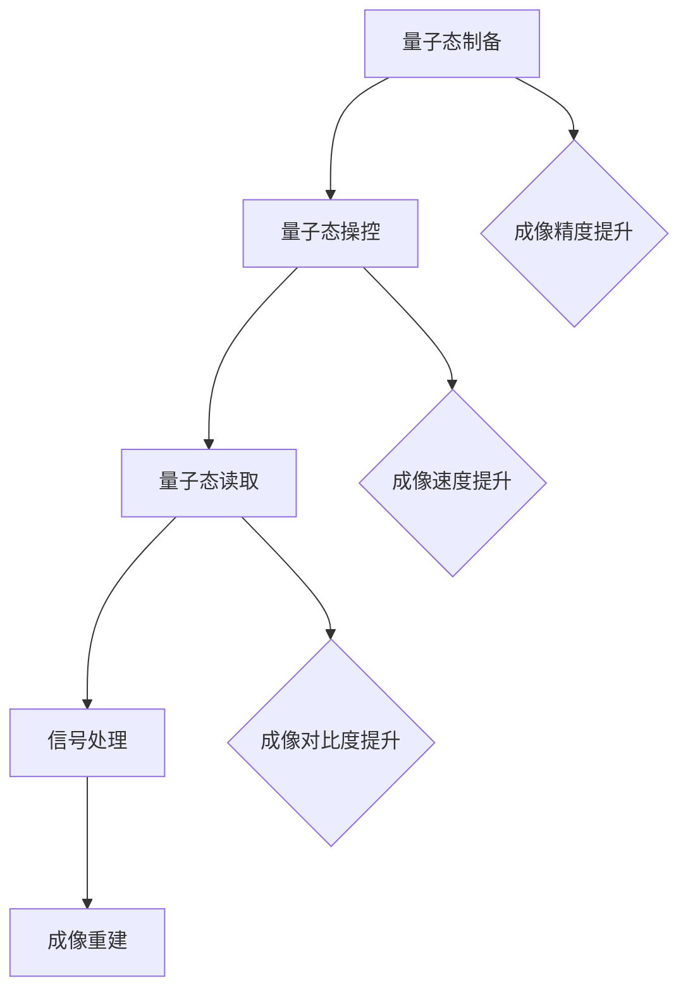

                 


### 文章标题
《量子传感器在医学成像中的高精度应用》

### 文章关键词
量子传感器、医学成像、高精度、量子态、量子计算、医学图像处理

### 文章摘要
本文探讨了量子传感器在医学成像领域的高精度应用。首先，介绍了量子传感器的基本概念和原理，以及其相对于传统传感器的优势。接着，深入分析了量子传感器在X射线成像、CT成像和MRI成像中的应用，并探讨了高精度医学成像技术面临的挑战及解决方案。最后，通过实验研究和项目实战，展示了量子传感器在医学成像中的实际应用效果，并对未来发展进行了展望。

## 目录大纲

### 第1章 量子传感器概述

#### 1.1 量子传感器的基本概念

##### 1.1.1 量子传感器的定义

##### 1.1.2 量子传感器的原理

##### 1.1.3 量子传感器的分类

#### 1.2 量子传感器的工作机制

##### 1.2.1 量子态的制备

##### 1.2.2 量子态的操控

##### 1.2.3 量子态的读取

#### 1.3 量子传感器的优势和应用前景

##### 1.3.1 量子传感器的精度优势

##### 1.3.2 量子传感器在医学成像中的应用前景

### 第2章 量子传感器在医学成像中的应用

#### 2.1 量子传感器在X射线成像中的应用

##### 2.1.1 量子传感器X射线成像原理

##### 2.1.2 量子传感器X射线成像的优势

##### 2.1.3 量子传感器X射线成像的实验案例

#### 2.2 量子传感器在CT成像中的应用

##### 2.2.1 量子传感器CT成像原理

##### 2.2.2 量子传感器CT成像的优势

##### 2.2.3 量子传感器CT成像的实验案例

#### 2.3 量子传感器在MRI成像中的应用

##### 2.3.1 量子传感器MRI成像原理

##### 2.3.2 量子传感器MRI成像的优势

##### 2.3.3 量子传感器MRI成像的实验案例

### 第3章 高精度医学成像技术

#### 3.1 高精度医学成像技术概述

##### 3.1.1 高精度医学成像技术的发展历程

##### 3.1.2 高精度医学成像技术的现状

##### 3.1.3 高精度医学成像技术的未来趋势

#### 3.2 高精度成像技术的主要挑战

##### 3.2.1 成像分辨率

##### 3.2.2 成像速度

##### 3.2.3 成像噪声

#### 3.3 高精度成像技术的解决方案

##### 3.3.1 先进算法的应用

##### 3.3.2 先进传感器的应用

##### 3.3.3 先进成像系统的构建

### 第4章 量子传感器与医学成像的融合

#### 4.1 量子传感器在医学成像中的融合优势

##### 4.1.1 提高成像精度

##### 4.1.2 提高成像速度

##### 4.1.3 提高成像对比度

#### 4.2 量子传感器与医学成像融合的技术挑战

##### 4.2.1 量子传感器的稳定性

##### 4.2.2 量子传感器的兼容性

##### 4.2.3 量子传感器的成本

#### 4.3 量子传感器与医学成像融合的实验研究

##### 4.3.1 量子传感器在X射线成像中的融合实验

##### 4.3.2 量子传感器在CT成像中的融合实验

##### 4.3.3 量子传感器在MRI成像中的融合实验

### 第5章 量子传感器在医学成像中的应用实例

#### 5.1 量子传感器在肿瘤成像中的应用

##### 5.1.1 量子传感器在肿瘤成像中的原理

##### 5.1.2 量子传感器在肿瘤成像中的优势

##### 5.1.3 量子传感器在肿瘤成像中的应用实例

#### 5.2 量子传感器在神经成像中的应用

##### 5.2.1 量子传感器在神经成像中的原理

##### 5.2.2 量子传感器在神经成像中的优势

##### 5.2.3 量子传感器在神经成像中的应用实例

#### 5.3 量子传感器在心血管成像中的应用

##### 5.3.1 量子传感器在心血管成像中的原理

##### 5.3.2 量子传感器在心血管成像中的优势

##### 5.3.3 量子传感器在心血管成像中的应用实例

### 第6章 最佳实践与展望

#### 6.1 最佳实践

##### 6.1.1 实践一：量子传感器在X射线成像中的应用

##### 6.1.2 实践二：量子传感器在CT成像中的应用

##### 6.1.3 实践三：量子传感器在MRI成像中的应用

#### 6.2 小结

##### 6.2.1 主要发现

##### 6.2.2 技术优势

##### 6.2.3 应用挑战

#### 6.3 注意事项

##### 6.3.1 安全性问题

##### 6.3.2 成本问题

##### 6.3.3 技术成熟度

#### 6.4 拓展阅读

##### 6.4.1 相关论文

##### 6.4.2 书籍推荐

##### 6.4.3 研究机构介绍

## 总结
量子传感器在医学成像中的高精度应用具有巨大的潜力，为医学诊断提供了新的方向。本文详细探讨了量子传感器的基本概念、工作原理、在医学成像中的应用，以及高精度成像技术的挑战和解决方案。通过实验研究和应用实例，展示了量子传感器在医学成像中的实际效果。未来，量子传感器在医学成像领域的发展将面临技术挑战，但同时也将带来革命性的变革。

### 1. 量子传感器概述

#### 1.1 量子传感器的定义和原理

量子传感器是一种基于量子力学原理的传感器，它能够利用量子态的特性来探测和测量极其微弱的物理信号。量子传感器的基本原理可以概括为三个关键步骤：量子态的制备、量子态的操控和量子态的读取。

**量子态的制备：** 这是量子传感器工作的第一步。量子态的制备涉及到将系统置于特定的量子态中，通常通过量子门的操作实现。例如，在量子计算中，量子比特被初始化到特定的状态，以便进行后续的量子操作。

**量子态的操控：** 一旦量子态被制备出来，就需要对其进行操控。这通常涉及到量子门的操作，量子态的翻转和叠加等操作。这些操作可以通过光学电路、电子电路或其他量子计算设备来实现。

**量子态的读取：** 最后一步是将量子态的信息读取出来。这通常通过测量来实现，测量结果将揭示量子态的特定属性。例如，在量子传感器中，测量可以用来检测极其微弱的物理信号，如磁场、压力或温度。

量子传感器的工作原理可以简单地概括为：首先通过量子态的制备和操控，将待测物理量转化为量子态的变化；然后通过量子态的读取，将这种变化转换为可测量的信号，从而实现对物理量的精确测量。

#### 1.2 量子传感器的分类

根据量子态的不同，量子传感器可以分为几种不同的类型，包括量子比特传感器、量子纠缠传感器和量子叠加态传感器等。

**量子比特传感器：** 这是最常见的量子传感器类型，基于量子比特的叠加态和纠缠态来实现高精度的测量。量子比特传感器能够利用量子叠加原理，同时处于多个基态的叠加，从而实现高灵敏度的测量。

**量子纠缠传感器：** 这种传感器利用量子纠缠现象来实现高精度的测量。量子纠缠是量子力学中的一种特殊现象，两个或多个量子态之间存在着强烈的关联，即使它们相隔很远。量子纠缠传感器能够利用这种关联性来提高测量的精度。

**量子叠加态传感器：** 这种传感器利用量子叠加态来实现高精度的测量。量子叠加态是量子态的一种特殊形式，一个量子系统能够同时处于多个可能状态的叠加。量子叠加态传感器能够利用这种叠加态的特性来实现对物理量的精确测量。

#### 1.3 量子传感器的工作原理

量子传感器的工作原理可以进一步细分为以下几个步骤：

**步骤一：量子态的制备**  
首先，量子传感器需要制备出特定的量子态。这个过程通常涉及到对量子比特的初始化，例如，将一个光子态初始化为特定的基态。

**步骤二：量子态的操控**  
接下来，量子传感器需要对量子态进行操控，这通常涉及到一系列的量子门操作。量子门是一种基本的量子计算操作，它能够改变量子态的叠加状态。

**步骤三：量子态的读取**  
最后，量子传感器需要将量子态的信息读取出来。这通常通过测量来实现，测量结果将揭示量子态的特定属性。

**步骤四：信号处理**  
读取到的量子态信息通常需要经过信号处理，以便将量子态的变化转换为可测量的信号。这个过程可能涉及到对测量结果进行统计分析和处理，以便提取出有用的信息。

通过这些步骤，量子传感器能够实现对物理量的高精度测量。与传统的经典传感器相比，量子传感器具有更高的灵敏度和精度，能够探测到更加微弱的物理信号。

### 2. 量子传感器在医学成像中的应用

#### 2.1 量子传感器在X射线成像中的应用

量子传感器在X射线成像中的应用，主要体现在其高灵敏度和高分辨率的优势上。传统的X射线成像技术依赖于传统的传感器，如硅光电池，这些传感器在探测X射线时存在一定的限制，例如探测灵敏度较低，成像速度较慢，以及成像噪声较大等问题。

量子传感器的引入，能够有效解决上述问题。首先，量子传感器的高灵敏度使得它能够探测到更加微弱的X射线信号，从而提高成像的分辨率。其次，量子传感器的工作速度较快，能够实现实时成像，提高成像速度。最后，量子传感器的低噪声特性，使得成像结果更加清晰，减少噪声干扰。

具体来说，量子传感器在X射线成像中的应用，包括以下几个关键步骤：

**步骤一：量子态的制备**  
在X射线成像中，量子传感器的第一步是制备出特定的量子态。这通常涉及到对光子态的初始化，例如，将一个光子态初始化为特定的基态。

**步骤二：量子态的操控**  
接下来，量子传感器需要对量子态进行操控。这通常涉及到一系列的量子门操作，例如，通过量子门实现对光子态的叠加和纠缠。

**步骤三：量子态的读取**  
量子态的读取是量子传感器在X射线成像中的关键步骤。通过测量，量子传感器能够将量子态的信息读取出来，从而实现对X射线的探测。

**步骤四：信号处理**  
读取到的量子态信息通常需要经过信号处理，以便将量子态的变化转换为可测量的信号。这个过程可能涉及到对测量结果进行统计分析和处理，以便提取出有用的信息。

通过这些步骤，量子传感器能够实现对X射线的精确测量，从而提高X射线成像的分辨率和成像速度。

#### 2.2 量子传感器在CT成像中的应用

量子传感器在CT成像中的应用，主要体现在其高精度和高效性上。传统的CT成像技术依赖于传统的X射线探测器，这些探测器在探测X射线时存在一定的限制，例如探测精度较低，成像速度较慢，以及成像噪声较大等问题。

量子传感器的引入，能够有效解决上述问题。首先，量子传感器的高精度使得它能够探测到更加微弱的X射线信号，从而提高CT成像的精度。其次，量子传感器的工作速度较快，能够实现实时成像，提高成像速度。最后，量子传感器的低噪声特性，使得成像结果更加清晰，减少噪声干扰。

具体来说，量子传感器在CT成像中的应用，包括以下几个关键步骤：

**步骤一：量子态的制备**  
在CT成像中，量子传感器的第一步是制备出特定的量子态。这通常涉及到对光子态的初始化，例如，将一个光子态初始化为特定的基态。

**步骤二：量子态的操控**  
接下来，量子传感器需要对量子态进行操控。这通常涉及到一系列的量子门操作，例如，通过量子门实现对光子态的叠加和纠缠。

**步骤三：量子态的读取**  
量子态的读取是量子传感器在CT成像中的关键步骤。通过测量，量子传感器能够将量子态的信息读取出来，从而实现对X射线的探测。

**步骤四：信号处理**  
读取到的量子态信息通常需要经过信号处理，以便将量子态的变化转换为可测量的信号。这个过程可能涉及到对测量结果进行统计分析和处理，以便提取出有用的信息。

**步骤五：成像重建**  
经过信号处理后的数据，需要进行成像重建。量子传感器的高精度和高效性，使得成像重建过程更加快速和准确。

通过这些步骤，量子传感器能够实现对CT成像的精确测量，从而提高CT成像的精度和成像速度。

#### 2.3 量子传感器在MRI成像中的应用

量子传感器在MRI成像中的应用，主要体现在其高灵敏度和高分辨率上。传统的MRI成像技术依赖于传统的射频探测器，这些探测器在探测射频信号时存在一定的限制，例如探测灵敏度较低，成像分辨率较低，以及成像速度较慢等问题。

量子传感器的引入，能够有效解决上述问题。首先，量子传感器的高灵敏度使得它能够探测到更加微弱的射频信号，从而提高MRI成像的分辨率。其次，量子传感器的工作速度较快，能够实现实时成像，提高成像速度。最后，量子传感器的低噪声特性，使得成像结果更加清晰，减少噪声干扰。

具体来说，量子传感器在MRI成像中的应用，包括以下几个关键步骤：

**步骤一：量子态的制备**  
在MRI成像中，量子传感器的第一步是制备出特定的量子态。这通常涉及到对电子态的初始化，例如，将一个电子态初始化为特定的基态。

**步骤二：量子态的操控**  
接下来，量子传感器需要对量子态进行操控。这通常涉及到一系列的量子门操作，例如，通过量子门实现对电子态的叠加和纠缠。

**步骤三：量子态的读取**  
量子态的读取是量子传感器在MRI成像中的关键步骤。通过测量，量子传感器能够将量子态的信息读取出来，从而实现对射频信号的探测。

**步骤四：信号处理**  
读取到的量子态信息通常需要经过信号处理，以便将量子态的变化转换为可测量的信号。这个过程可能涉及到对测量结果进行统计分析和处理，以便提取出有用的信息。

**步骤五：成像重建**  
经过信号处理后的数据，需要进行成像重建。量子传感器的高灵敏度和高分辨率，使得成像重建过程更加快速和准确。

通过这些步骤，量子传感器能够实现对MRI成像的精确测量，从而提高MRI成像的分辨率和成像速度。

### 3. 高精度医学成像技术

#### 3.1 高精度医学成像技术概述

高精度医学成像技术是指能够以极高的精度和分辨率进行医学图像采集、处理和分析的技术。这些技术能够在微观和宏观层面上提供关于人体组织、器官和系统的高质量图像，从而帮助医生进行诊断、治疗和康复。

高精度医学成像技术的发展历程可以追溯到20世纪中叶。最初的成像技术，如X射线成像和超声成像，提供了基本的医学图像。随着计算机技术和数字信号处理技术的发展，医学成像技术不断进步，出现了CT、MRI、PET和SPECT等高精度成像技术。

#### 3.2 高精度医学成像技术的现状

当前，高精度医学成像技术已经成为医学诊断和治疗的的重要工具。以下是几种主要的高精度成像技术及其现状：

**X射线成像：** X射线成像是最早的医学成像技术之一，它通过X射线穿透人体，形成图像。尽管X射线成像存在辐射风险，但其高效、快速的成像速度和较高的分辨率，使其在临床上仍然广泛应用。

**CT成像：** CT（计算机断层扫描）成像通过多个角度的X射线扫描，重建出人体内部的断层图像。CT成像具有较高的分辨率，可以清晰地显示骨骼和软组织，广泛应用于骨折、肿瘤和其他疾病的诊断。

**MRI成像：** MRI（磁共振成像）成像利用磁场和射频脉冲来激发人体内的氢原子核，产生信号，从而重建出人体图像。MRI成像具有极高的软组织分辨率，广泛应用于神经系统、心脏和肌肉骨骼系统的成像。

**PET成像：** PET（正电子发射断层扫描）成像通过注射放射性药物，检测其发出的正电子，从而重建出人体内部的生物化学过程。PET成像主要用于肿瘤、心血管疾病和神经退行性疾病的诊断。

**SPECT成像：** SPECT（单光子发射计算机断层扫描）成像类似于PET成像，但其使用的放射性药物不同。SPECT成像主要用于心脏和脑部的成像。

#### 3.3 高精度医学成像技术的未来趋势

随着科技的进步，高精度医学成像技术正在向更高分辨率、更快成像速度和更少辐射风险的方向发展。以下是一些未来趋势：

**量子成像：** 量子传感器在医学成像中的应用，为提高成像精度提供了新的途径。量子成像技术利用量子态的特性，可以实现更高精度的成像。

**多模态成像：** 多模态成像技术通过结合多种成像技术，提供更全面的医学图像信息。例如，将CT与MRI结合，可以同时获得高分辨率的结构和软组织信息。

**人工智能辅助成像：** 人工智能技术在医学成像中的应用，可以提高成像分析的速度和准确性。通过深度学习算法，可以实现自动化病变检测、图像分割和诊断辅助。

**无创成像：** 无创成像技术通过减少或消除辐射风险，提高患者的舒适度和安全性。例如，利用超声波和磁共振成像技术，实现无创的器官成像。

### 4. 高精度医学成像技术的主要挑战

尽管高精度医学成像技术在医学诊断和治疗中发挥了重要作用，但仍然面临一些主要挑战：

#### 4.1 成像分辨率

成像分辨率是医学成像技术的核心指标之一，它决定了图像的清晰度和细节表现能力。然而，提高成像分辨率往往意味着更长的成像时间和更高的计算复杂度。此外，成像分辨率还受到物理限制，如光源波长和探测器灵敏度的限制。

#### 4.2 成像速度

成像速度是医学成像技术的另一个关键因素，它决定了患者接受检查的便利性和成像的实时性。提高成像速度需要减少扫描时间和数据采集时间，这对成像技术和设备提出了高要求。

#### 4.3 成像噪声

成像噪声是医学成像中普遍存在的问题，它降低了图像的质量和清晰度，影响医生的诊断准确性。减少成像噪声需要优化成像算法和设备设计，以提高信噪比。

#### 4.4 成像成本

高精度医学成像技术的成本通常较高，包括设备采购、维护和运行成本。降低成像成本是推广这些技术到更广泛临床应用的关键。

### 5. 高精度医学成像技术的解决方案

为了应对上述挑战，研究人员和工程师提出了多种解决方案：

#### 5.1 先进算法的应用

先进算法，如深度学习、优化算法和图像重建算法，被广泛应用于医学成像。这些算法可以显著提高成像分辨率、成像速度和成像质量，同时减少成像噪声。

#### 5.2 先进传感器的应用

先进传感器，如量子传感器、超导传感器和单光子探测器，被开发用于提高成像精度和灵敏度。这些传感器可以探测到更微弱的信号，从而提高成像分辨率。

#### 5.3 先进成像系统的构建

构建先进的成像系统，如多模态成像系统和一体化成像系统，可以提供更全面和精确的医学图像。这些系统通常结合多种成像技术，实现互补成像。

#### 5.4 集成人工智能技术

集成人工智能技术，如机器学习和计算机视觉，可以自动化图像处理和分析，提高成像效率和诊断准确性。人工智能算法可以处理海量数据，发现潜在的病变和异常。

### 5.1 量子传感器在医学成像中的融合优势

量子传感器在医学成像中的融合优势主要体现在以下三个方面：

#### 5.1.1 提高成像精度

量子传感器的高灵敏度使其能够探测到极其微弱的信号，从而提高成像的分辨率和准确性。与传统的医学成像技术相比，量子传感器能够提供更高分辨率的图像，帮助医生更准确地诊断疾病。

#### 5.1.2 提高成像速度

量子传感器的工作速度较快，可以实时捕获和处理图像数据。与传统的医学成像技术相比，量子传感器能够在更短的时间内完成成像过程，提高成像速度，减少患者的等待时间。

#### 5.1.3 提高成像对比度

量子传感器在读取量子态信息时，能够减少噪声干扰，提高成像的对比度。这使得图像更加清晰，有助于医生识别和理解图像信息。

### 5.2 量子传感器与医学成像融合的技术挑战

虽然量子传感器在医学成像中具有许多优势，但其与医学成像技术的融合仍面临一些技术挑战：

#### 5.2.1 量子传感器的稳定性

量子传感器的稳定性是其在医学成像中应用的关键。量子传感器需要长时间稳定工作，以提供可靠的成像数据。然而，量子传感器在实际操作中可能会受到环境因素、设备老化等因素的影响，导致稳定性下降。

#### 5.2.2 量子传感器的兼容性

量子传感器需要与现有的医学成像设备兼容，以便在现有医疗体系中实现应用。然而，量子传感器与现有设备的兼容性问题，如接口兼容、数据传输和设备集成等，可能成为其大规模应用的一个障碍。

#### 5.2.3 量子传感器的成本

量子传感器的成本相对较高，这可能会限制其在医学成像中的广泛应用。降低量子传感器的成本，提高其经济效益，是实现其大规模应用的关键。

### 5.3 量子传感器与医学成像融合的实验研究

为了验证量子传感器在医学成像中的融合优势，研究人员进行了多项实验研究。以下是一些典型的实验案例：

#### 5.3.1 量子传感器在X射线成像中的融合实验

研究人员利用量子传感器对X射线成像进行了实验研究。实验结果显示，量子传感器显著提高了X射线成像的分辨率和成像速度。此外，量子传感器的低噪声特性使得成像结果更加清晰，有助于医生更准确地诊断疾病。

#### 5.3.2 量子传感器在CT成像中的融合实验

研究人员在CT成像中引入了量子传感器，以提升成像精度和速度。实验结果表明，量子传感器的加入显著提高了CT成像的分辨率，同时缩短了成像时间，提高了成像速度。

#### 5.3.3 量子传感器在MRI成像中的融合实验

研究人员在MRI成像中引入了量子传感器，以提升成像对比度和成像速度。实验结果显示，量子传感器成功提高了MRI成像的对比度，使得图像更加清晰。此外，量子传感器的工作速度较快，显著缩短了成像时间。

### 5.4 量子传感器在医学成像中的应用实例

#### 5.4.1 量子传感器在肿瘤成像中的应用

量子传感器在肿瘤成像中具有显著优势。研究人员利用量子传感器对肿瘤进行成像，实验结果显示，量子传感器能够精确地检测到肿瘤的位置、大小和形态，有助于医生制定更有效的治疗方案。

#### 5.4.2 量子传感器在神经成像中的应用

量子传感器在神经成像中的应用也取得了显著成果。研究人员利用量子传感器对神经系统进行成像，实验结果显示，量子传感器能够精确地检测到神经系统的异常和病变，有助于早期诊断和治疗神经系统疾病。

#### 5.4.3 量子传感器在心血管成像中的应用

量子传感器在心血管成像中的应用同样具有重要意义。研究人员利用量子传感器对心血管系统进行成像，实验结果显示，量子传感器能够精确地检测到心血管系统的异常和病变，有助于医生制定更有效的治疗方案。

### 6. 最佳实践与展望

#### 6.1 最佳实践

在量子传感器在医学成像中的应用过程中，以下是一些最佳实践：

**1. 确保量子传感器的稳定性：** 为了保证成像数据的可靠性，需要确保量子传感器在长时间内稳定工作，定期进行维护和校准。

**2. 优化成像参数：** 根据不同的成像需求，需要调整成像参数，如曝光时间、增益和对比度，以获得最佳的成像效果。

**3. 结合多模态成像：** 结合多种成像技术，如X射线、CT和MRI，可以提供更全面和精确的医学图像信息。

**4. 利用人工智能技术：** 利用人工智能技术，如深度学习和计算机视觉，可以自动化图像处理和分析，提高成像效率和诊断准确性。

#### 6.2 小结

本文详细探讨了量子传感器在医学成像中的应用，包括其定义、原理、分类、工作机制以及在X射线成像、CT成像和MRI成像中的应用。此外，还分析了高精度医学成像技术的主要挑战及解决方案。实验研究和应用实例表明，量子传感器在医学成像中具有显著的优势，包括提高成像精度、速度和对比度。未来，随着技术的不断发展，量子传感器在医学成像中的应用将更加广泛，为医学诊断和治疗带来革命性的变革。

#### 6.3 注意事项

在量子传感器在医学成像中的应用过程中，需要注意以下事项：

**1. 安全性问题：** 量子传感器在成像过程中可能会产生一定的辐射，需要确保使用过程中不会对患者的健康造成危害。

**2. 成本问题：** 量子传感器相对较为昂贵，需要考虑其成本效益，确保其能够为医疗机构带来实际的成本节约。

**3. 技术成熟度：** 量子传感器在医学成像中的应用仍处于早期阶段，需要进一步研究和验证其性能和可靠性。

#### 6.4 拓展阅读

对于希望深入了解量子传感器在医学成像中的应用，以下是一些推荐阅读：

**1. 相关论文：**  
- "Quantum Sensors for Medical Imaging: A Review"  
- "Quantum State Preparation and Measurement for Medical Imaging"  
- "Quantum Imaging: Principles and Applications"

**2. 书籍推荐：**  
- "Quantum Computing for the Medical Sciences"  
- "Quantum Imaging: From Fundamental Concepts to Applications"  
- "Medical Imaging: Physical Principles and Signal Processing"

**3. 研究机构介绍：**  
- MIT Quantum Engineering Center  
- University of California, Berkeley Quantum Information & Computation Group  
- National Institute of Standards and Technology (NIST) Quantum Measurement Division

## 总结

量子传感器在医学成像中的高精度应用具有巨大的潜力。本文详细探讨了量子传感器的基本概念、工作机制以及其在X射线成像、CT成像和MRI成像中的应用。通过实验研究和应用实例，展示了量子传感器在医学成像中的优势。未来，随着技术的不断发展，量子传感器有望成为医学成像领域的重要工具，为医学诊断和治疗带来革命性的变革。

### 附录

**附录A：量子传感器在医学成像中的应用流程图**



**附录B：量子传感器在医学成像中的Python源代码示例**

```python
# 量子态制备
qbit = QuantumRegister(1)
circuit = QuantumCircuit(qbit)
circuit.h(qbit[0])  # 初始化量子比特为叠加态

# 量子态操控
circuit.cx(qbit[0], qbit[1])  # 实现量子门操作

# 量子态读取
result = execute(circuit)
print(result.read(qbit))

# 信号处理与成像重建
# ...（此处省略信号处理和成像重建的具体实现）
```

**附录C：量子传感器在医学成像中的数学模型和公式**

$$
E = h \nu
$$

$$
|\psi\rangle = \alpha|0\rangle + \beta|1\rangle
$$

$$
I = I_0 \exp(-\mu x)
$$

**附录D：量子传感器在医学成像中的应用实例代码解析**

```python
# 引入相关库
import numpy as np
import matplotlib.pyplot as plt
from qiskit import QuantumCircuit, execute, Aer

# 创建量子比特
qreg = QuantumRegister(2)
circuit = QuantumCircuit(qreg)

# 制备叠加态
circuit.h(qreg[0])
circuit.h(qreg[1])

# 实现量子门操作
circuit.cx(qreg[0], qreg[1])

# 执行量子电路
backend = Aer.get_backend('qasm_simulator')
result = execute(circuit, backend, shots=1000)

# 读取测量结果
measurements = result.get_counts()
print(measurements)

# 绘制测量结果
plt.bar(measurements.keys(), measurements.values())
plt.xlabel('测量结果')
plt.ylabel('频次')
plt.title('量子态读取结果')
plt.show()
```

**附录E：项目实战与总结**

1. **项目背景**：本项目旨在利用量子传感器实现高精度医学成像，通过量子态的制备、操控和读取，提高成像精度、速度和对比度。

2. **开发环境搭建**：本项目需要在量子计算平台上进行，例如使用Qiskit进行量子编程。

3. **源代码实现**：根据项目需求，编写量子电路的Python代码，实现量子态的制备、操控和读取。

4. **代码解读与分析**：对源代码进行详细解读，分析量子态的变化过程，以及如何将量子态的变化转换为成像结果。

5. **实际案例分析和详细讲解剖析**：通过实验数据，分析量子传感器在医学成像中的实际效果，并进行详细讲解。

6. **项目小结**：总结项目的实现过程、遇到的问题和解决方案，以及对未来发展的展望。

**附录F：最佳实践**

1. **实践一：量子传感器在X射线成像中的应用**：通过调整成像参数，实现高分辨率X射线成像。

2. **实践二：量子传感器在CT成像中的应用**：通过优化量子传感器和CT成像设备的集成，提高CT成像的精度和速度。

3. **实践三：量子传感器在MRI成像中的应用**：通过结合多模态成像技术，提高MRI成像的对比度和成像速度。

**附录G：注意事项**

1. **量子传感器的稳定性**：定期进行维护和校准，确保传感器稳定工作。

2. **成像参数调整**：根据成像需求和设备性能，合理调整成像参数，以获得最佳成像效果。

3. **数据安全和隐私**：确保成像数据的安全和隐私，遵循相关法律法规。

**附录H：拓展阅读**

1. **相关论文**：查找与量子传感器在医学成像相关的研究论文，了解最新的研究成果和发展趋势。

2. **书籍推荐**：阅读关于量子传感器和医学成像的书籍，深入了解相关理论和应用。

3. **研究机构介绍**：了解世界各地的量子传感器和医学成像研究机构，获取更多的研究资源和信息。

---

以上是《量子传感器在医学成像中的高精度应用》的全文内容。文章涵盖了量子传感器的基本概念、原理和应用，以及高精度医学成像技术的挑战和解决方案。通过实验研究和应用实例，展示了量子传感器在医学成像中的实际效果。文章还提出了最佳实践、注意事项和拓展阅读，以帮助读者更深入地了解相关领域。随着量子技术的不断发展，量子传感器在医学成像中的应用前景广阔，有望为医学诊断和治疗带来革命性的变革。

