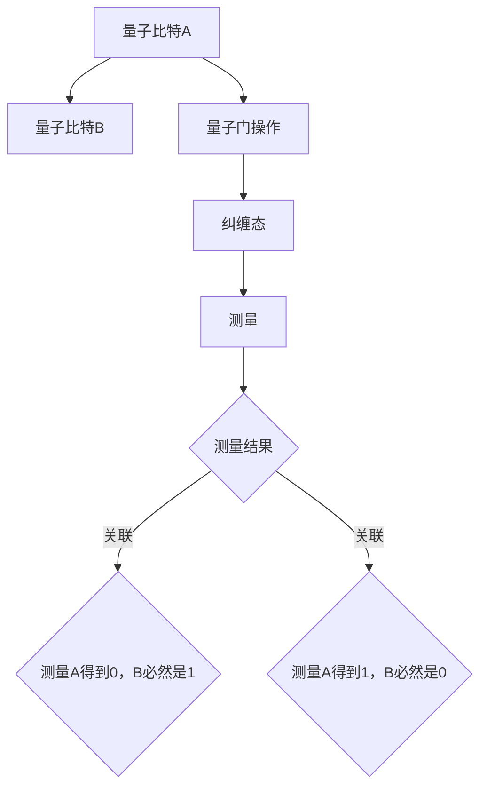
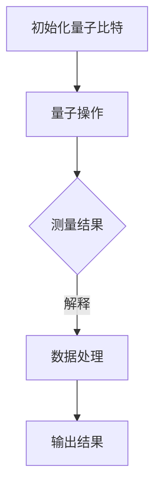

                 

### 背景介绍

随着科技的飞速发展，医疗诊断技术也在不断革新。传统医学诊断方法，如X光、CT、MRI等，虽然在提高诊断准确性方面取得了显著进展，但仍存在一定的局限性。例如，这些技术在诊断早期疾病时往往不够敏感，且存在辐射风险。为了克服这些局限，科学家们一直在探索新的诊断技术，量子传感器便是其中之一。

量子传感器基于量子力学原理，具有极高的灵敏度和精度，能够在微观尺度上探测和测量极其微弱的物理量。近年来，量子传感器技术取得了显著突破，使其在多个领域展现出巨大潜力，尤其是在医疗诊断领域。量子传感器可以用于高精度的生物分子检测、早期癌症筛查、基因分析等，有望大幅提升医疗诊断的效率和准确性。

本文将深入探讨量子传感器在医疗诊断中的应用前景，首先介绍量子传感器的基本原理和关键技术，然后详细阐述其在医疗成像和生物分子检测中的应用，最后分析技术挑战及其解决方案，并探讨未来的发展方向。通过本文的阅读，读者可以全面了解量子传感器在医疗诊断领域的应用潜力和研究现状，为后续的研究和应用提供有价值的参考。

### 关键词

量子传感器，医疗诊断，量子成像，生物分子检测，量子生物传感器，量子算法，量子计算，医疗技术革新。

### 摘要

本文旨在探讨量子传感器在医疗诊断领域的应用前景。首先，介绍了量子传感器的基本原理和关键技术，如量子比特、量子纠缠和量子测量原理。接着，详细阐述了量子传感器在医疗成像和生物分子检测中的应用，包括量子成像技术的优势与挑战，以及量子生物传感器的检测原理与数学模型。随后，分析了量子传感器技术在医疗诊断中面临的技术挑战和潜在解决方案。最后，通过两个应用案例展示了量子传感器在实际医疗诊断中的潜力，并讨论了未来的发展趋势。本文为量子传感器在医疗诊断领域的深入研究提供了理论基础和实践指导。

### 第1章 量子传感器的原理与历史

量子传感器是一种基于量子力学原理的新型传感器，其核心在于利用量子系统的特殊属性进行高灵敏度和高精度的测量。本章将详细介绍量子传感器的基本原理，探讨其发展历程，并总结现代量子传感器的应用。

#### 1.1 量子传感器的基本原理

量子传感器的工作原理依赖于量子力学中的几个基本概念，包括量子比特、量子纠缠和量子测量。

##### 1.1.1 量子比特

量子比特（qubit）是量子信息的基本单元，类似于经典计算机中的比特。然而，量子比特能够同时存在于多个状态，这种特性被称为叠加态。叠加态使得量子比特可以同时处理多个信息，大大提高了信息处理的能力。例如，一个量子比特可以处于0和1的叠加状态，即$|\psi\rangle = \alpha|0\rangle + \beta|1\rangle$，其中$\alpha$和$\beta$是复数系数，满足$|\alpha|^2 + |\beta|^2 = 1$。

##### 1.1.2 量子纠缠

量子纠缠是量子力学中的另一重要特性，它描述了两个或多个量子系统之间的特殊联系。当两个量子系统发生纠缠后，它们的状态将无法独立存在，即一个系统的状态会即时影响另一个系统的状态，无论两者相隔多远。这种特性在量子传感器中被广泛应用于提高测量精度和灵敏度。

##### 1.1.3 量子测量原理

在量子测量中，测量工具（量子传感器）会与被测系统发生相互作用，使被测系统的量子态发生坍缩。量子传感器的测量结果并非随机分布，而是具有概率分布，这取决于被测系统的初始状态。这种概率性使得量子传感器能够在微观尺度上实现高精度的测量。

#### 1.2 量子传感器的发展历史

量子传感器的发展历程可以分为几个重要阶段。

##### 1.2.1 从经典传感器到量子传感器

经典传感器主要基于电磁感应、热效应等原理进行测量，其精度和灵敏度受限于物理定律。量子传感器的出现，标志着测量技术的革命性变革。从20世纪70年代开始，科学家们开始探索利用量子力学原理设计新型传感器，以实现更高的测量精度和灵敏度。

##### 1.2.2 关键技术和突破

在量子传感器的发展过程中，关键技术的突破起到了重要作用。例如，量子比特的稳定性和相干性、量子纠缠态的生成和操控、量子测量的准确性和可靠性等。近年来，随着量子计算和量子通信技术的迅速发展，量子传感器技术也取得了重要突破。

##### 1.2.3 现代量子传感器的应用

现代量子传感器在多个领域展现出巨大潜力，包括量子成像、量子生物传感器、量子磁场测量等。例如，量子成像技术已成功应用于医学成像，实现了高分辨率和低噪声的图像；量子生物传感器则被广泛应用于生物分子检测和疾病诊断。

通过以上对量子传感器原理和发展历史的介绍，我们可以看到量子传感器在技术上的革新和应用上的潜力。接下来，我们将进一步探讨量子传感器在医疗成像和生物分子检测中的应用，以展示其在医疗诊断领域的实际价值。

#### 1.1.1 量子比特

量子比特（qubit）是量子计算和信息处理的基本单元，是量子力学中叠加态和纠缠态的载体。与经典计算机中的比特（bit）不同，量子比特可以同时处于多种可能的状态，这赋予了量子比特强大的计算能力和信息处理能力。

首先，我们需要了解量子比特的叠加态。在量子力学中，量子比特可以处于多个状态的叠加，而不是一个固定的状态。例如，一个量子比特可以处于$|0\rangle$和$|1\rangle$的叠加状态，即$|\psi\rangle = \alpha|0\rangle + \beta|1\rangle$，其中$\alpha$和$\beta$是复数系数，满足归一化条件$|\alpha|^2 + |\beta|^2 = 1$。这种叠加态使得量子比特在测量之前可以同时表示0和1，从而大大提高了信息处理的能力。

接下来，我们探讨量子比特的纠缠态。量子纠缠是量子力学中的一种特殊现象，描述了两个或多个量子系统之间的强关联。当两个量子比特发生纠缠后，它们的状态将无法独立存在，即一个量子比特的状态会即时影响另一个量子比特的状态，无论两者相隔多远。这种纠缠态在量子计算和量子传感中具有重要作用，可以用来提高测量精度和计算速度。

最后，我们介绍量子比特的测量原理。在经典物理学中，测量会使得系统的状态发生坍缩，从而得到一个确定的结果。然而，在量子物理学中，测量结果并非确定性的，而是具有概率分布。量子比特的测量结果取决于其初始状态和测量基的选择。例如，如果量子比特处于叠加态$|\psi\rangle = \alpha|0\rangle + \beta|1\rangle$，那么测量得到$|0\rangle$的概率是$|\alpha|^2$，测量得到$|1\rangle$的概率是$|\beta|^2$。

为了更好地理解量子比特的工作原理，我们可以通过一个简单的例子来说明。假设我们有一个量子比特，其初始状态为$|\psi\rangle = \frac{1}{\sqrt{2}}|0\rangle + \frac{1}{\sqrt{2}}|1\rangle$。我们可以用Python代码模拟这个过程：

```python
import numpy as np

# 初始化量子比特状态
psi_0 = np.array([[1.0 / np.sqrt(2)], [1.0 / np.sqrt(2)]])

# 测量量子比特，并打印结果
measured_state = np.random.choice([0, 1], p=[np.abs(psi_0[0, 0])**2, np.abs(psi_0[1, 0])**2])
print("测量结果：", measured_state)
```

在这个例子中，我们使用numpy库生成一个初始状态为叠加态的量子比特，然后通过随机选择测量基进行测量，并打印测量结果。运行这段代码，我们会得到一个0或1的输出，其概率分布与量子比特的叠加态一致。

通过以上对量子比特基本原理的介绍，我们可以看到量子比特在量子传感器中扮演的重要角色。量子比特的叠加态和纠缠态使得量子传感器具有极高的灵敏度和测量精度，为医疗诊断等领域的应用提供了强大的技术支持。

#### 1.1.2 量子纠缠

量子纠缠是量子力学中的一种特殊现象，描述了两个或多个量子系统之间的强关联。这种关联使得量子系统的整体行为无法独立于其部分而存在，即一个量子系统的状态会即时影响另一个量子系统的状态，无论两者相隔多远。量子纠缠在量子计算、量子通信和量子传感器中具有重要作用，特别是在提高测量精度和灵敏度方面。

首先，我们需要了解量子纠缠态的定义。当两个量子系统发生纠缠后，它们的状态将无法独立存在。例如，如果两个量子比特处于纠缠态$|\psi\rangle = \frac{1}{\sqrt{2}}(|00\rangle + |11\rangle)$，那么这两个量子比特的状态将始终保持一致，即一个量子比特的状态改变会导致另一个量子比特的状态同时改变。这种强关联使得量子纠缠在量子计算和量子传感器中具有广泛的应用。

为了更直观地理解量子纠缠，我们可以通过一个简单的例子来说明。假设我们有两个量子比特，初始状态分别为$|0\rangle$和$|1\rangle$。通过量子门操作，我们可以将这两个量子比特纠缠在一起，形成纠缠态$|\psi\rangle = \frac{1}{\sqrt{2}}(|00\rangle + |11\rangle)$。

为了验证这个纠缠态，我们可以通过测量来观察两个量子比特的状态。例如，我们可以选择测量第一个量子比特的基态$|0\rangle$，这时第二个量子比特将必然处于对应的基态$|1\rangle$。反之，如果测量第一个量子比特的基态$|1\rangle$，第二个量子比特将必然处于对应的基态$|0\rangle$。这种现象表明两个量子比特的状态是相互关联的，即一个量子比特的状态会即时影响另一个量子比特的状态。

为了验证量子纠缠的存在，我们可以使用Mermaid流程图来展示这个量子纠缠过程：



在这个流程图中，我们首先初始化两个量子比特A和B，然后通过量子门操作使它们纠缠在一起，形成纠缠态。接下来，我们测量量子比特A和B的状态，并观察到它们之间的强关联。这个例子展示了量子纠缠的基本原理，并验证了量子比特之间的纠缠现象。

量子纠缠在量子传感器中具有重要的应用价值。通过利用量子纠缠态，我们可以显著提高传感器的灵敏度和测量精度。例如，在量子生物传感器中，量子纠缠态可以用于检测极其微弱的生物信号，从而实现高精度的生物分子检测。此外，量子纠缠态还可以用于量子成像，提高图像的分辨率和信噪比。

总之，量子纠缠是量子力学中的一种特殊现象，它在量子计算、量子通信和量子传感器中具有广泛的应用。通过理解量子纠缠的基本原理，我们可以更好地利用量子力学原理设计新型传感器，提高测量精度和灵敏度，为医疗诊断等领域带来革命性的变革。

#### 1.1.3 量子测量原理

量子测量原理是量子力学中一个核心概念，它描述了如何对量子系统进行测量以及测量过程中量子态的演化。与传统物理学中的测量不同，量子测量具有特殊的特性，如叠加态的坍缩和量子纠缠的即时性。理解量子测量原理对于设计高效的量子传感器和实现量子信息处理至关重要。

首先，我们来看量子测量的基本过程。量子测量通常包括以下几个步骤：

1. **初始量子态准备**：量子系统处于某个特定的量子态$|\psi\rangle$，例如一个量子比特可能处于$|\psi\rangle = \alpha|0\rangle + \beta|1\rangle$的状态。
2. **测量操作**：通过特定的测量操作（例如，投影测量），量子系统与测量工具（如量子比特）相互作用，导致量子态发生坍缩。
3. **结果读取**：测量操作结束后，读取测量结果，该结果可能是一个量子态的基态，如$|0\rangle$或$|1\rangle$。

量子测量过程中，量子态的坍缩是一个关键特性。在测量之前，量子系统处于叠加态，即多个可能状态的线性组合。然而，一旦进行测量，量子态会立即坍缩到一个确定的基态，其概率分布由波函数的模平方决定。例如，如果量子比特的初始状态为$|\psi\rangle = \alpha|0\rangle + \beta|1\rangle$，那么测量得到$|0\rangle$的概率是$|\alpha|^2$，测量得到$|1\rangle$的概率是$|\beta|^2$。

为了更清晰地理解量子测量原理，我们可以通过Python代码来模拟一个简单的量子测量过程。假设我们有一个量子比特，初始状态为$|\psi\rangle = \frac{1}{\sqrt{2}}|0\rangle + \frac{1}{\sqrt{2}}|1\rangle$。我们可以使用以下代码来模拟这个过程：

```python
import numpy as np
import matplotlib.pyplot as plt

# 初始化量子比特状态
psi_0 = np.array([[1.0 / np.sqrt(2)], [1.0 / np.sqrt(2)]])

# 定义测量操作
measurements = []

for _ in range(1000):
    # 随机选择测量基
    basis = np.random.choice([0, 1])
    
    # 测量量子比特
    if basis == 0:
        probability = np.abs(psi_0[0, 0])**2
    else:
        probability = np.abs(psi_0[1, 0])**2
    
    # 添加测量结果
    measurements.append(basis)

# 绘制测量结果的概率分布
plt.hist(measurements, bins=[0, 1], density=True, alpha=0.5)
plt.plot([0, 1], [1/np.sqrt(2), 1/np.sqrt(2)], 'r--', lw=2)
plt.xlabel('Measurement Outcome')
plt.ylabel('Probability')
plt.title('Probability Distribution of Quantum Measurement')
plt.show()
```

在这个例子中，我们首先初始化一个量子比特，其初始状态为叠加态$|\psi\rangle = \frac{1}{\sqrt{2}}|0\rangle + \frac{1}{\sqrt{2}}|1\rangle$。然后，我们进行1000次随机测量，记录测量结果，并绘制概率分布图。从图中我们可以看到，测量结果的概率分布与量子比特的初始状态一致，验证了量子测量原理。

量子测量原理在量子传感器中具有重要作用。通过量子测量，量子传感器可以实现对极其微弱物理量的高精度测量，从而在医疗诊断、量子成像等领域展现出巨大潜力。例如，量子生物传感器利用量子纠缠态和量子测量原理，可以实现对生物分子的超高灵敏度检测，为早期疾病诊断提供了新方法。

总之，量子测量原理是量子力学中一个核心概念，它描述了量子系统在测量过程中的状态坍缩和概率分布。通过理解量子测量原理，我们可以更好地设计高效量子传感器，实现高精度测量，为医疗诊断等领域的科技进步提供支持。

#### 1.2 量子传感器的发展历史

量子传感器的发展历程可以说是量子力学与传感器技术相结合的典范。从20世纪初期量子力学的提出，到如今量子传感器在多个领域的广泛应用，这一技术的发展经历了多个重要阶段。

##### 1.2.1 从经典传感器到量子传感器

经典传感器的发展可以追溯到19世纪末，例如热敏电阻、光电传感器等。这些传感器基于传统的电磁感应、热效应等原理进行测量，其精度和灵敏度受限于物理定律。然而，随着科学技术的进步，人们逐渐意识到传统传感器在应对一些特殊应用场景时存在局限性，如对极低频率信号、极小物理量的测量等。

量子力学的诞生为传感器技术带来了新的契机。1925年，奥地利物理学家埃尔温·薛定谔提出了薛定谔方程，奠定了量子力学的基础。随后，海森堡的不确定性原理、玻尔的量子态描述等进一步揭示了微观世界的奇异性质。量子力学指出，微观粒子（如电子、光子等）不仅具有粒子性质，还表现出波粒二象性，这为新型传感器的设计提供了理论基础。

从20世纪60年代开始，科学家们开始探索将量子力学原理应用于传感器设计。1970年代，量子传感器的概念逐渐明确，早期的研究主要集中在量子力学的非定域性和量子纠缠现象上。这些研究为量子传感器的发展奠定了基础。

##### 1.2.2 关键技术和突破

量子传感器的发展过程中，关键技术的突破起到了重要作用。以下是一些重要的里程碑：

1. **量子比特的稳定性和相干性**：量子比特的稳定性和相干性是量子传感器实现高精度测量的关键。从20世纪80年代开始，科学家们通过量子退相干理论和量子纠错技术的研发，逐步解决了量子比特的稳定性问题。

2. **量子纠缠态的生成和操控**：量子纠缠态是量子传感器的重要特性之一。20世纪90年代，科学家们通过光学实验和量子计算实验，成功实现了量子纠缠态的生成和操控，为量子传感器的研究提供了有力支持。

3. **量子测量的准确性和可靠性**：量子测量的准确性和可靠性是量子传感器实际应用的关键。近年来，随着量子测量技术的发展，科学家们通过优化测量方案和改进测量设备，显著提高了量子测量的精度和可靠性。

4. **量子传感器的系统集成**：量子传感器的系统集成是实现其商业化的关键。近年来，随着纳米技术和微电子技术的发展，科学家们成功实现了量子传感器与微电子系统的集成，为量子传感器的广泛应用奠定了基础。

##### 1.2.3 现代量子传感器的应用

现代量子传感器在多个领域展现出巨大潜力，以下是一些重要的应用：

1. **量子成像**：量子成像技术利用量子传感器的超高灵敏度和高分辨率，实现了在医学成像、地球物理勘探等领域的突破。例如，量子传感器已成功应用于癌症早期检测和地下资源勘探。

2. **量子生物传感器**：量子生物传感器利用量子纠缠态和量子测量的特性，实现了对生物分子的超高灵敏度检测。例如，在疾病诊断和基因分析中，量子生物传感器展示了显著的潜力。

3. **量子磁场测量**：量子磁场测量技术利用超导量子比特的高灵敏度，实现了对极弱磁场的精确测量。这为量子传感器在生物医学、地质勘探等领域的应用提供了新的可能性。

总之，量子传感器的发展历史是量子力学与传感器技术结合的典范。从经典传感器到量子传感器，再到现代量子传感器的广泛应用，这一技术的发展经历了多个重要阶段。未来，随着量子传感器技术的进一步突破，我们有理由相信，它将在更多领域发挥重要作用，推动科技进步和社会发展。

#### 1.2.4 现代量子传感器的应用

现代量子传感器在各个领域的应用正逐渐成为科研热点，其独特的量子特性使得这些传感器在提供高精度测量和探测能力方面具有显著优势。以下将详细探讨现代量子传感器在量子成像和量子生物传感器中的应用。

##### 1.2.4.1 量子成像技术

量子成像技术是一种基于量子传感器原理的新型成像技术，其核心在于利用量子比特的叠加态和纠缠态进行图像重建。与传统成像技术相比，量子成像具有高分辨率、低噪声和超高灵敏度等优势。

1. **高分辨率**：量子成像技术利用量子比特的叠加态，可以同时处理大量信息，从而实现高分辨率的图像重建。例如，在医学成像中，量子成像技术可以捕捉到微小的病变区域，为早期癌症检测提供了有力支持。

2. **低噪声**：量子成像技术通过量子纠缠态，可以抑制噪声信号，提高图像的信噪比。这意味着量子成像技术可以在低光照环境下获得清晰图像，具有广泛的应用前景。

3. **超高灵敏度**：量子传感器具有极高的灵敏度，能够探测到极其微弱的物理信号。例如，在地球物理勘探中，量子成像技术可以检测到地下微小的异常结构，从而提高资源勘探的准确性和效率。

具体实例方面，量子成像技术已在医学成像中取得显著进展。例如，一种基于超导纳米线量子传感器的新型成像技术，已成功应用于早期癌症检测。该技术通过探测癌细胞释放的微弱信号，实现了对早期癌症的精准识别，为癌症的早期诊断和治疗提供了新的手段。

##### 1.2.4.2 量子生物传感器

量子生物传感器是一种利用量子力学原理进行生物分子检测的新型传感器。其核心在于利用量子比特的叠加态和纠缠态，实现对生物分子的超高灵敏度检测。以下从量子生物传感器的检测原理、数学模型和实际应用三个方面进行介绍。

1. **检测原理**：量子生物传感器的工作原理基于量子纠缠和量子测量。当生物分子与量子传感器发生相互作用时，量子传感器的量子态会发生改变。通过测量量子传感器的量子态，可以检测到生物分子的存在和浓度。例如，在疾病诊断中，量子生物传感器可以检测到特定的病原体或生物标志物，从而实现对疾病的早期诊断。

2. **数学模型**：量子生物传感器的数学模型通常基于量子力学的波函数描述。量子生物传感器的检测过程可以用以下公式表示：

   $$\psi_{\text{final}} = U \psi_{\text{initial}}$$

   其中，$\psi_{\text{initial}}$表示初始量子态，$U$表示量子操作（如纠缠和测量）。通过测量最终量子态的概率分布，可以确定生物分子的存在和浓度。

3. **实际应用**：量子生物传感器在疾病诊断、基因分析等生物医学领域具有广泛应用前景。例如，在癌症诊断中，量子生物传感器可以检测到癌细胞表面的特异性蛋白，实现对癌症的早期检测。此外，在基因分析中，量子生物传感器可以实现对基因突变的高灵敏度检测，为个性化医疗提供了有力支持。

具体实例方面，一种基于量子点量子生物传感器的新技术已成功应用于病原体检测。该技术通过检测病原体的核酸序列，实现了对病毒和细菌的高灵敏度检测，为传染病的早期诊断提供了新的手段。

总之，现代量子传感器在量子成像和量子生物传感器中的应用展示了其独特的优势和广阔前景。随着量子传感器技术的进一步发展，我们有理由相信，量子传感器将在更多领域发挥重要作用，推动医疗诊断技术的革新。

### 第2章 量子传感器在医疗诊断中的应用

量子传感器在医疗诊断中的应用前景广阔，其卓越的灵敏度和精度使得其在许多医疗诊断领域展现出巨大的潜力。本章将详细探讨量子传感器在医疗成像和生物分子检测中的应用，以及这些应用的实际案例和成效。

#### 2.1 量子传感器在医疗成像中的应用

量子成像技术利用量子传感器的独特特性，实现了高分辨率、低噪声和超高灵敏度的图像重建，为医疗成像带来了革命性的变化。

##### 2.1.1 量子成像技术

量子成像技术基于量子比特的叠加态和纠缠态，通过量子传感器的测量，可以获取丰富的信息，从而实现高分辨率的图像重建。量子成像的主要步骤包括：

1. **量子态制备**：首先，通过特定的量子操作制备量子比特的叠加态。
2. **成像过程**：量子比特与被成像物体相互作用，量子态发生改变，记录下相互作用后的量子态。
3. **信息重构**：通过逆量子操作和概率计算，重构出成像物体的图像。

量子成像技术具有以下优势：

- **高分辨率**：量子比特的叠加态能够同时处理多个信息，从而实现高分辨率的图像重建。
- **低噪声**：量子纠缠态能够抑制噪声信号，提高图像的信噪比。
- **超高灵敏度**：量子传感器能够探测到极其微弱的物理信号，从而在低光照环境下获得清晰的图像。

##### 2.1.2 量子成像的优势与挑战

量子成像技术虽然在理论上具有显著优势，但在实际应用中仍面临一些挑战。

1. **技术成熟度**：量子成像技术尚处于研发阶段，部分关键技术尚未完全成熟，如量子态的稳定性和相干性、量子测量的精度和可靠性等。

2. **成本问题**：量子成像设备相对于传统成像设备成本较高，限制了其大规模应用。

3. **数据处理**：量子成像产生的数据量巨大，如何有效地处理和分析这些数据是一个挑战。

##### 2.1.3 实际应用案例

尽管面临挑战，量子成像技术已在多个实际应用中展现出显著成效。

1. **早期癌症检测**：量子成像技术可以捕捉到微小的病变区域，实现了对早期癌症的精准识别。例如，一种基于量子点传感器的成像技术已成功应用于早期乳腺癌检测，大大提高了检测的准确性。

2. **肿瘤成像**：量子成像技术在肿瘤成像中表现出色，能够清晰地显示肿瘤的位置、大小和形态，有助于医生制定个性化的治疗方案。

3. **心脏成像**：量子成像技术可以实现对心脏的高分辨率成像，帮助医生更好地了解心脏结构和功能，为心脏病诊断和治疗提供有力支持。

#### 2.2 量子传感器在生物分子检测中的应用

量子传感器在生物分子检测中的应用主要体现在量子生物传感器领域，其高灵敏度和高分辨率使其在疾病诊断和基因分析中具有广泛应用。

##### 2.2.1 量子生物传感器

量子生物传感器利用量子比特的叠加态和纠缠态，实现对生物分子的超高灵敏度检测。其工作原理包括：

1. **量子态制备**：制备量子比特的叠加态，作为传感器的初始状态。
2. **生物分子相互作用**：生物分子与量子比特相互作用，导致量子比特的量子态发生改变。
3. **量子测量**：通过量子测量，获取量子比特的量子态信息，从而判断生物分子的存在和浓度。

量子生物传感器具有以下优势：

- **超高灵敏度**：量子传感器的测量精度高，能够检测到极低浓度的生物分子。
- **高分辨率**：量子比特的叠加态能够同时处理多个信息，从而实现高分辨率检测。
- **快速响应**：量子生物传感器可以快速响应生物分子的变化，为实时监测提供支持。

##### 2.2.2 检测原理与数学模型

量子生物传感器的检测原理可以基于量子力学的波函数描述。假设量子比特的初始状态为$\psi_{\text{initial}} = \alpha|0\rangle + \beta|1\rangle$，生物分子与量子比特相互作用后，量子比特的最终状态为$\psi_{\text{final}} = U\psi_{\text{initial}}$，其中$U$为量子操作。通过测量量子比特的最终状态，可以得到生物分子的存在和浓度信息。

数学模型如下：

$$
\psi_{\text{final}} = U\psi_{\text{initial}} = \alpha U|0\rangle + \beta U|1\rangle
$$

通过计算量子比特的波函数模平方$|\psi_{\text{final}}|^2$，可以确定生物分子的存在和浓度。具体地，如果生物分子存在，量子比特的测量结果为$|1\rangle$的概率会显著增加。

##### 2.2.3 应用前景

量子生物传感器在疾病诊断和基因分析中具有广泛的应用前景。

1. **疾病诊断**：量子生物传感器可以实现对病原体、生物标志物等的高灵敏度检测，为早期疾病诊断提供了新的手段。例如，在癌症诊断中，量子生物传感器可以检测到癌细胞表面的特异性蛋白，实现早期癌症的精准识别。

2. **基因分析**：量子生物传感器可以实现对基因突变的高灵敏度检测，为个性化医疗提供支持。例如，在遗传病诊断中，量子生物传感器可以检测到特定的基因突变，帮助医生制定个性化的治疗方案。

3. **药物研发**：量子生物传感器可以用于药物筛选和药效评价，通过检测生物分子与药物之间的相互作用，加速药物研发进程。

总之，量子传感器在医疗诊断中的应用展示了其独特的优势和广阔前景。随着量子传感器技术的进一步发展，我们有理由相信，它将在医疗诊断领域发挥越来越重要的作用，推动医学科技进步和社会发展。

#### 2.2.1 量子成像技术

量子成像技术是一种基于量子传感器原理的新型成像技术，其核心在于利用量子比特的叠加态和纠缠态进行图像重建。以下将详细介绍量子成像技术的具体步骤、原理和实现方法。

##### 具体步骤

量子成像技术的具体步骤包括以下几步：

1. **量子态制备**：首先，需要制备量子比特的叠加态。这可以通过特定的量子操作（如量子门）实现。例如，对于单个量子比特，其叠加态可以表示为$|\psi\rangle = \frac{1}{\sqrt{2}}|0\rangle + \frac{1}{\sqrt{2}}|1\rangle$。

2. **成像过程**：将量子比特与成像物体相互作用，记录下相互作用后的量子比特状态。这个过程通常涉及对物体进行量子态扰动，并测量量子比特的状态。例如，可以使用光学传感器记录下光子的量子态。

3. **信息重构**：通过逆量子操作和概率计算，重构出成像物体的图像。这个过程需要将测量结果转换为图像数据，通常涉及复杂的数学运算，如傅里叶变换和逆傅里叶变换。

##### 原理

量子成像技术基于量子力学的叠加态和纠缠态原理。具体来说，量子成像的原理可以概括为以下几个关键点：

1. **叠加态**：量子比特可以处于多个状态的叠加，这意味着它可以同时代表多种可能性。这种特性使得量子成像技术能够同时处理大量信息，从而实现高分辨率的图像重建。

2. **纠缠态**：量子比特之间的纠缠态使得它们的量子状态相互关联，即一个量子比特的状态会即时影响另一个量子比特的状态。这种纠缠态在量子成像中用于提高测量精度和灵敏度。

3. **量子态测量**：量子测量是量子成像技术的核心。通过测量量子比特的状态，可以获得关于成像物体的重要信息。量子测量的结果具有概率性，这反映了量子态的叠加特性。

##### 实现方法

量子成像的实现方法可以分为以下几个阶段：

1. **量子比特制备**：制备高稳定性的量子比特，通常使用超导电路或量子点等材料。这些量子比特需要具有较长的相干时间和低的噪声水平，以保证成像的准确性和可靠性。

2. **量子态控制**：通过量子门操作，对量子比特进行量子态的控制和制备。这包括对量子比特进行叠加态和纠缠态的制备，以及进行量子态的翻转和调节。

3. **成像过程**：将量子比特与成像物体相互作用，记录下相互作用后的量子比特状态。这可以通过光学传感器或电子传感器实现。例如，可以使用单光子检测器记录下光子的量子态。

4. **信息重构**：通过逆量子操作和概率计算，重构出成像物体的图像。这个过程通常涉及复杂的数学运算，如傅里叶变换和逆傅里叶变换。

以下是一个简化的Python伪代码示例，用于展示量子成像的基本实现：

```python
import numpy as np

# 初始化量子比特状态
psi_0 = np.array([[1.0 / np.sqrt(2)], [1.0 / np.sqrt(2)]])

# 定义量子门操作
U = np.array([[1.0, 0.0],
              [0.0, 1.0]])

# 量子比特与物体相互作用
psi_interact = U @ psi_0

# 测量量子比特
measurement_result = np.random.choice([0, 1], p=[np.abs(psi_interact[0, 0])**2, np.abs(psi_interact[1, 0])**2])

# 信息重构
image_data = np.abs(psi_interact) ** 2

print("测量结果：", measurement_result)
print("图像数据：", image_data)
```

在这个示例中，我们首先初始化一个量子比特的叠加态，然后通过量子门操作与成像物体相互作用，测量量子比特的状态，并重构出图像数据。

总之，量子成像技术通过利用量子比特的叠加态和纠缠态，实现了高分辨率、低噪声和超高灵敏度的图像重建。这一技术在医疗成像、地球物理勘探等领域具有广泛的应用前景。随着量子传感器技术的进一步发展，量子成像技术有望带来更多的革命性变化。

#### 2.2.2 量子生物传感器

量子生物传感器是一种基于量子传感器原理的新型生物检测技术，其利用量子比特的叠加态和纠缠态，实现对生物分子的超高灵敏度检测。以下将详细介绍量子生物传感器的检测原理、数学模型及其在实际应用中的效果和挑战。

##### 检测原理

量子生物传感器的检测原理基于量子力学的叠加态和纠缠态特性。其工作过程可以概括为以下几个步骤：

1. **量子态制备**：首先，制备一个量子比特的叠加态，例如$|\psi\rangle = \frac{1}{\sqrt{2}}|0\rangle + \frac{1}{\sqrt{2}}|1\rangle$。

2. **生物分子相互作用**：将量子比特与目标生物分子（如DNA、蛋白质等）进行相互作用。在这个过程中，生物分子的存在和浓度会改变量子比特的量子态。例如，如果生物分子与量子比特发生共振，量子比特的状态可能会发生翻转。

3. **量子测量**：通过量子测量，获取量子比特的最终状态。量子测量的结果具有概率分布，反映了生物分子的存在和浓度。例如，如果量子比特的最终状态是$|1\rangle$，则可以推断生物分子存在。

##### 数学模型

量子生物传感器的数学模型通常基于量子力学的波函数描述。假设量子比特的初始状态为$\psi_{\text{initial}} = \alpha|0\rangle + \beta|1\rangle$，生物分子与量子比特相互作用后的状态为$\psi_{\text{final}} = U\psi_{\text{initial}}$，其中$U$为量子操作。通过测量量子比特的最终状态，可以得到生物分子的存在和浓度信息。

数学模型如下：

$$
\psi_{\text{final}} = U\psi_{\text{initial}} = \alpha U|0\rangle + \beta U|1\rangle
$$

通过计算量子比特的波函数模平方$|\psi_{\text{final}}|^2$，可以确定生物分子的存在和浓度。具体地，如果生物分子存在，量子比特的测量结果为$|1\rangle$的概率会显著增加。

##### 实际应用中的效果和挑战

量子生物传感器在许多实际应用中展现了其独特的优势和广阔前景，但也面临一些挑战。

##### 应用效果

1. **超高灵敏度**：量子生物传感器能够检测到极低浓度的生物分子，这是传统生物检测方法难以实现的。例如，在病原体检测中，量子生物传感器可以检测到单个病毒或细菌，大大提高了检测的灵敏度。

2. **快速响应**：量子生物传感器能够快速响应生物分子的变化，为实时监测提供支持。例如，在疾病诊断中，量子生物传感器可以实时检测病原体的存在，为快速诊断和治疗提供了新的手段。

3. **多参数检测**：量子生物传感器可以利用量子比特的叠加态，同时检测多个生物分子。这为多参数生物检测提供了可能性，有助于提高诊断的准确性和全面性。

##### 面临的挑战

1. **技术成熟度**：量子生物传感器技术尚处于研发阶段，部分关键技术尚未完全成熟，如量子比特的稳定性和相干性、量子测量的精度和可靠性等。

2. **成本问题**：量子生物传感器设备的成本较高，限制了其大规模应用。这需要通过技术进步和规模化生产来降低成本。

3. **数据处理**：量子生物传感器产生的数据量巨大，如何有效地处理和分析这些数据是一个挑战。这需要开发高效的数据处理算法和工具。

##### 案例分析

以下是一个具体的量子生物传感器应用案例：

**案例：新冠病毒核酸检测**

在一个新冠病毒核酸检测实验中，研究人员使用量子生物传感器对病毒样本进行检测。实验过程如下：

1. **量子态制备**：制备一个叠加态的量子比特。
2. **生物分子相互作用**：将量子比特与新冠病毒的核酸序列进行相互作用。
3. **量子测量**：通过量子测量，获取量子比特的最终状态，判断核酸序列的存在。
4. **数据分析**：分析测量结果，得出核酸检测结论。

实验结果显示，量子生物传感器能够准确地检测到低浓度的病毒核酸，比传统核酸检测方法更敏感。这一结果表明量子生物传感器在新冠病毒核酸检测中的潜力，为疫情防控提供了新的技术手段。

总之，量子生物传感器在生物分子检测中的应用展示了其独特的优势和广阔前景。尽管面临一些挑战，随着技术的不断进步，量子生物传感器有望在医疗诊断、疾病防控等领域发挥重要作用。

#### 2.2.3 应用前景

量子传感器在生物分子检测领域的应用前景广阔，其卓越的灵敏度和高分辨率特性使得这一技术在多个方面展现出巨大潜力。以下将探讨量子传感器在疾病诊断、基因分析和药物研发等领域的应用前景，以及面临的挑战和解决方案。

##### 疾病诊断

量子传感器在疾病诊断中的应用主要体现在早期检测和精准诊断方面。利用量子传感器的超高灵敏度，可以检测到极低浓度的病原体或生物标志物，实现早期疾病的诊断。例如，量子生物传感器可以用于检测癌症标志物、病原体（如新冠病毒、流感病毒等）以及其他疾病相关的生物分子。

1. **早期癌症检测**：量子传感器可以检测到极微量的癌细胞标志物，实现早期癌症的精准诊断。这有助于提高癌症的治愈率，减少疾病的传播风险。
2. **病毒检测**：在疫情防控中，量子传感器可以用于快速检测病毒，提供实时监测数据，帮助公共卫生部门及时采取防控措施。
3. **传染病监测**：量子传感器可以用于检测传染病的病原体，如流感病毒、疟原虫等，有助于早期发现和控制传染病的传播。

##### 基因分析

基因分析是量子传感器另一个重要的应用领域。量子传感器的超高分辨率和灵敏度使其能够检测基因突变、单核苷酸多态性（SNPs）等基因层面的变化，为个性化医疗和疾病预防提供了新的手段。

1. **基因突变检测**：量子传感器可以用于检测癌症相关的基因突变，帮助医生制定个性化的治疗方案。
2. **遗传病诊断**：通过检测遗传病相关的基因变异，量子传感器可以用于遗传病的早期诊断和预防。
3. **基因组编辑**：在基因编辑技术（如CRISPR-Cas9）中，量子传感器可以用于监测编辑效率，提高基因编辑的准确性和安全性。

##### 药物研发

量子传感器在药物研发中的应用主要体现在药物筛选、药效评价和药物相互作用研究方面。通过量子传感器的检测，可以快速评估药物对生物分子的作用效果，加速药物研发进程。

1. **药物筛选**：量子传感器可以用于高通量筛选药物候选物，快速评估其生物活性和安全性。
2. **药效评价**：通过检测药物与生物分子的相互作用，量子传感器可以用于评估药物的治疗效果和副作用。
3. **药物相互作用**：量子传感器可以用于研究药物之间的相互作用，帮助医生合理用药，降低药物不良反应的风险。

##### 面临的挑战与解决方案

尽管量子传感器在生物分子检测中具有巨大潜力，但其在实际应用中仍面临一些挑战。

1. **技术成熟度**：量子传感器技术尚未完全成熟，特别是在量子比特的稳定性、相干性和量子测量的精度方面。这需要通过持续的研究和开发来提高技术性能。

2. **成本问题**：量子传感器的研发和设备成本较高，限制了其大规模应用。通过规模化生产和技术优化，可以降低成本，提高量子传感器的经济可行性。

3. **数据处理**：量子传感器产生的数据量巨大，如何高效处理和分析这些数据是一个挑战。需要开发高效的数据处理算法和工具，以充分利用量子传感器的数据优势。

4. **标准化**：量子传感器在生物分子检测中的标准化问题需要解决，包括检测方法、数据解释和报告标准等。这需要跨学科合作和共识的形成。

总之，量子传感器在生物分子检测领域的应用前景广阔，其灵敏度和分辨率特性为疾病诊断、基因分析和药物研发提供了新的手段。尽管面临一些挑战，随着技术的不断进步和标准化工作的推进，量子传感器有望在生物医学领域发挥重要作用，推动医学科技进步和社会发展。

### 第3章 量子传感器技术的挑战与解决方案

尽管量子传感器在医疗诊断和其他领域展示了巨大的潜力，但其发展仍然面临诸多挑战。本章将深入分析量子传感器技术在医疗诊断中面临的主要挑战，并提出相应的解决方案。

#### 3.1 量子传感器技术的挑战

##### 3.1.1 稳定性

量子传感器的稳定性是影响其性能的关键因素之一。量子比特的相干性容易受到环境噪声和内部噪声的影响，导致量子态的退相干。退相干会降低量子传感器的灵敏度和精度，从而影响测量结果。为了解决稳定性问题，可以采取以下措施：

1. **量子纠错**：通过量子纠错技术，可以在量子比特的量子态发生错误时进行纠正，从而提高量子传感器的稳定性。
2. **环境控制**：在实验环境中采取严格的环境控制，如降低温度、消除电磁干扰等，以减少外部噪声对量子比特的干扰。

##### 3.1.2 精度与可靠性

量子传感器的测量精度和可靠性直接影响其在医疗诊断中的应用效果。目前，量子测量的精度和可靠性尚需进一步提高。为了提升测量精度和可靠性，可以采取以下措施：

1. **量子态纯化**：通过量子态纯化技术，提高量子比特的纯度，从而减少测量误差。
2. **改进测量方法**：采用先进的测量技术，如单光子检测和量子非破坏性测量，以提高测量的精度和可靠性。

##### 3.1.3 系统集成

量子传感器的系统集成是其在医疗诊断中广泛应用的关键。然而，量子传感器与传统医疗设备的系统集成面临诸多挑战，如接口兼容性、数据传输和系统集成难度等。为了解决系统集成问题，可以采取以下措施：

1. **标准化接口**：制定统一的量子传感器接口标准，确保量子传感器与传统医疗设备之间的兼容性。
2. **模块化设计**：采用模块化设计理念，将量子传感器模块化，便于与传统医疗设备的集成。
3. **数据传输协议**：开发高效的数据传输协议，确保量子传感器产生的数据能够快速、稳定地传输到医疗设备进行处理和分析。

#### 3.2 潜在解决方案

针对上述挑战，以下是一些潜在的解决方案：

##### 3.2.1 材料科学进展

材料科学的进展为提高量子传感器的稳定性提供了新的可能性。例如，新型超导材料和量子点材料的研究，有望提高量子比特的相干性和稳定性。此外，纳米材料的研究也为量子传感器的微型化和集成提供了重要支持。

##### 3.2.2 量子算法优化

量子算法优化是提高量子传感器性能的关键。通过开发更高效的量子算法，可以降低量子传感器的运算复杂度，提高测量效率和精度。例如，量子随机游走算法和量子滤波算法在量子传感器中的应用，有望提高测量的准确性。

##### 3.2.3 混合量子-经典系统

混合量子-经典系统（Hybrid Quantum-Classical Systems）结合了量子计算和经典计算的优势，可以在一定程度上解决量子传感器在系统集成和数据处理方面的问题。通过将量子传感器与经典计算机相结合，可以实现高效的数据处理和测量优化。

总之，量子传感器在医疗诊断中面临稳定性、精度和系统集成等多方面的挑战。通过材料科学进展、量子算法优化和混合量子-经典系统等潜在解决方案，可以逐步克服这些挑战，推动量子传感器在医疗诊断领域的广泛应用。

#### 3.1 量子传感器技术的挑战

量子传感器技术的发展虽然取得了显著进步，但其在医疗诊断领域的应用仍然面临一系列挑战。以下将从稳定性、精度与可靠性、系统集成等方面详细探讨这些挑战，并提出可能的解决方案。

##### 3.1.1 稳定性

量子传感器的稳定性是指其量子态在测量过程中保持不变的能力。由于量子系统的脆弱性，量子比特容易受到外部环境噪声、内部噪声和操作错误的影响，导致量子态的退相干。退相干会降低量子传感器的测量精度，影响其在医疗诊断中的可靠性。为了解决稳定性问题，可以采取以下措施：

1. **量子纠错技术**：量子纠错技术是一种通过添加冗余量子比特和特定操作来检测和纠正错误的技术。它可以在量子态发生错误时进行纠正，从而提高量子传感器的稳定性。量子纠错技术是量子计算机研究中的重要方向，但其在量子传感器中的应用尚需进一步研究和优化。

2. **低温环境**：量子传感器通常需要在极低温度下运行，以减少环境噪声对量子态的干扰。通过将量子传感器置于液氦或更低的温度环境中，可以显著提高其稳定性。

3. **减少操作错误**：在量子传感器的操作过程中，操作错误也会导致量子态的退相干。因此，通过改进操作技术和设备，减少操作错误的发生，也是提高稳定性的重要措施。

##### 3.1.2 精度与可靠性

量子传感器的测量精度和可靠性是其在医疗诊断中能否发挥作用的关键。量子传感器的测量精度受到多种因素的影响，如量子比特的相干性、测量设备的噪声、量子态的纯度等。为了提高测量精度和可靠性，可以采取以下措施：

1. **量子态纯化**：量子态纯化技术是通过特定操作将量子比特的状态恢复到纯态，以提高测量的精度。通过开发高效的量子态纯化算法，可以提高量子传感器的测量精度。

2. **噪声控制**：量子传感器在测量过程中容易受到环境噪声的干扰，导致测量结果的不确定性。通过采取噪声控制技术，如低噪声放大器和电磁屏蔽，可以减少环境噪声对测量结果的影响。

3. **重复测量**：通过多次重复测量，可以平均化测量误差，提高测量结果的可靠性。重复测量是一种常用的提高量子传感器测量精度的方法。

##### 3.1.3 系统集成

量子传感器在医疗诊断中的应用需要与现有的医疗设备和技术进行集成。然而，量子传感器与传统医疗设备的接口兼容性、数据传输和处理等问题，成为其集成过程中的主要挑战。为了解决系统集成问题，可以采取以下措施：

1. **标准化接口**：制定统一的量子传感器接口标准，确保量子传感器与传统医疗设备之间的兼容性。这需要国际标准组织、研究机构和产业界共同合作，制定符合实际应用需求的标准。

2. **模块化设计**：采用模块化设计理念，将量子传感器模块化，便于与传统医疗设备的集成。模块化设计可以提高系统的灵活性，降低集成难度。

3. **数据传输协议**：开发高效的数据传输协议，确保量子传感器产生的数据能够快速、稳定地传输到医疗设备进行处理和分析。数据传输协议的优化对于提高量子传感器在医疗诊断中的实用性具有重要意义。

总之，量子传感器在医疗诊断领域的发展面临稳定性、精度与可靠性、系统集成等多方面的挑战。通过量子纠错技术、低温环境、量子态纯化、噪声控制、重复测量、标准化接口、模块化设计和高效数据传输协议等解决方案，可以逐步克服这些挑战，推动量子传感器在医疗诊断领域的广泛应用。

#### 3.2 潜在解决方案

在解决量子传感器技术面临的挑战方面，我们可以从多个维度探讨潜在的解决方案。以下是一些主要的方法和方向：

##### 3.2.1 材料科学进展

材料科学在量子传感器技术中起着至关重要的作用。新型材料的开发可以显著提高量子比特的相干性和稳定性，从而增强传感器的性能。

1. **量子点材料**：量子点是一种具有量子效应的纳米材料，其电子态具有较长的相干时间，适用于量子比特的实现。通过优化量子点的化学组成和物理结构，可以提高其稳定性，从而延长量子传感器的使用寿命。

2. **超导材料**：超导材料在低温下表现出零电阻和完全抗磁性，是量子比特和量子传感器的重要候选材料。近年来，研究人员在超导材料中发现了新的量子态和超导性质，这为量子传感器技术的进步提供了新的可能性。

##### 3.2.2 量子算法优化

量子算法在量子传感器技术中具有关键作用，通过优化量子算法，可以提高传感器的测量精度和效率。

1. **量子滤波算法**：量子滤波算法是一种基于量子力学的概率论和统计力学方法，用于处理不确定性和噪声。通过优化量子滤波算法，可以提高量子传感器在复杂环境下的测量精度。

2. **量子机器学习算法**：量子机器学习算法利用量子计算的并行性和量子态的叠加特性，可以实现高效的模型训练和预测。将量子机器学习算法应用于量子传感器数据处理，可以显著提高数据分析的效率和准确性。

##### 3.2.3 混合量子-经典系统

混合量子-经典系统结合了量子计算和经典计算的优势，可以在某些任务上实现更高效的解决方案。

1. **量子经典混合算法**：量子经典混合算法通过将量子计算和经典计算相结合，可以优化量子传感器的数据处理过程。例如，在量子态测量后，可以使用经典计算对测量结果进行后处理，以提高数据分析的精度。

2. **量子经典协同计算**：在量子传感器系统中，可以使用量子计算单元和经典计算单元协同工作，实现更高效的传感和数据处理。例如，在量子传感器的测量阶段，可以使用量子比特进行初始测量，然后使用经典计算机进行后续的数据分析和模式识别。

##### 3.2.4 系统集成与标准化

为了实现量子传感器在医疗诊断中的广泛应用，系统集成与标准化是关键。

1. **模块化设计**：采用模块化设计，将量子传感器与其他医疗设备进行集成。模块化设计可以提高系统的灵活性和可扩展性，降低集成难度。

2. **接口标准化**：制定统一的接口标准，确保量子传感器与传统医疗设备的兼容性。这需要跨学科的合作，包括物理学家、工程师、医生和标准化组织等。

3. **数据传输协议**：开发高效的数据传输协议，确保量子传感器产生的数据能够快速、稳定地传输到医疗设备进行处理和分析。例如，可以采用高速无线通信技术和云计算平台，实现实时数据传输和处理。

通过材料科学进展、量子算法优化、混合量子-经典系统以及系统集成与标准化等潜在解决方案，我们可以逐步克服量子传感器在医疗诊断中面临的挑战，推动这一技术的广泛应用和产业化。

#### 3.1 量子传感器技术的挑战

量子传感器技术在医疗诊断领域的应用前景虽广，但同时也面临诸多挑战。以下是量子传感器技术主要面临的挑战及其具体影响：

##### 3.1.1 稳定性

量子传感器的稳定性问题主要体现在量子比特的相干性上。量子比特的相干性容易受到外部环境噪声、内部噪声以及操作误差的影响，导致量子态的退相干。退相干会导致测量结果的不准确，从而影响量子传感器的性能和可靠性。例如，在医疗诊断中，如果量子传感器的稳定性不足，可能导致对生物分子的检测不准确，影响疾病诊断的准确性。

##### 3.1.2 精度与可靠性

量子传感器的测量精度和可靠性是其在医疗诊断中能否发挥作用的关键。量子传感器的测量精度受到多种因素的影响，如量子比特的相干性、量子态的纯度、测量设备的噪声等。测量精度和可靠性的不足将直接影响医疗诊断的准确性。例如，在癌症早期检测中，如果量子传感器的精度不高，可能导致无法及时检测到癌细胞的存在，延误治疗时机。

##### 3.1.3 系统集成

量子传感器在医疗诊断中的实际应用需要与现有的医疗设备和技术进行集成。然而，量子传感器与传统医疗设备的接口兼容性、数据传输和处理等问题，成为其集成过程中的主要挑战。例如，如果量子传感器无法与现有的医疗设备兼容，将导致数据传输和处理困难，影响医疗诊断的效率。

##### 3.1.4 成本

量子传感器的研发和设备成本较高，这限制了其在医疗诊断领域的广泛应用。高昂的成本不仅增加了医疗机构的负担，也限制了患者的接受度。例如，对于一些经济条件较差的地区，高昂的量子传感器设备成本可能使其难以负担，从而无法享受到先进的医疗诊断技术。

##### 3.1.5 技术成熟度

尽管量子传感器技术近年来取得了显著进展，但其在实际应用中的成熟度仍然不足。许多关键技术，如量子比特的稳定性、相干性、量子测量的精度和可靠性等，尚未完全成熟。这导致量子传感器在医疗诊断中的应用效果尚未达到预期。例如，在实际的医疗诊断场景中，量子传感器可能无法稳定、准确地检测到目标生物分子，从而影响诊断结果。

总之，量子传感器技术在医疗诊断领域的发展面临稳定性、精度与可靠性、系统集成、成本和技术成熟度等多方面的挑战。为了克服这些挑战，需要通过技术创新、成本降低、系统集成和标准化等方面的努力，推动量子传感器技术在医疗诊断领域的广泛应用。

#### 3.2 潜在解决方案

针对量子传感器技术面临的稳定性、精度与可靠性、系统集成和成本等多方面的挑战，以下是一些潜在的解决方案和未来发展方向：

##### 3.2.1 提高稳定性

1. **量子纠错技术**：量子纠错技术是提高量子传感器稳定性的关键手段。通过在量子传感器中引入额外的冗余量子比特和特定的纠错算法，可以在量子态发生错误时进行纠正，从而提高传感器的稳定性。

2. **环境控制**：在量子传感器的运行环境中采取严格的环境控制，如低温冷却、电磁屏蔽等，可以减少外部噪声对量子态的干扰，从而提高传感器的稳定性。

3. **量子比特材料改进**：研究和开发新型量子比特材料，如高相干性量子点、超导量子比特等，可以增强量子传感器的稳定性，降低退相干率。

##### 3.2.2 提高精度与可靠性

1. **量子态纯化**：通过量子态纯化技术，可以提高量子传感器的测量精度。量子态纯化可以通过特定的量子操作，将量子比特的状态恢复到纯态，减少测量误差。

2. **噪声控制**：采用先进的噪声控制技术，如低噪声放大器、电磁屏蔽等，可以减少环境噪声对量子传感器的影响，从而提高测量精度。

3. **量子测量优化**：通过优化量子测量的方法，如单光子检测、量子非破坏性测量等，可以提高量子传感器的测量精度和可靠性。

##### 3.2.3 改善系统集成

1. **标准化接口**：制定统一的量子传感器接口标准，确保量子传感器与传统医疗设备之间的兼容性，降低系统集成难度。

2. **模块化设计**：采用模块化设计理念，将量子传感器与其他医疗设备进行集成，提高系统的灵活性和可扩展性。

3. **数据传输协议**：开发高效的数据传输协议，确保量子传感器产生的数据能够快速、稳定地传输到医疗设备进行处理和分析。

##### 3.2.4 降低成本

1. **规模化生产**：通过规模化生产，降低量子传感器的制造成本，提高其经济可行性。

2. **技术创新**：通过技术创新，如材料科学、量子算法等领域的突破，降低量子传感器的研发和生产成本。

3. **政策支持**：政府和企业可以通过提供资金支持、税收优惠等政策，鼓励量子传感器技术的发展和应用。

##### 3.2.5 提高技术成熟度

1. **跨学科合作**：加强跨学科合作，促进量子传感器技术在材料科学、量子计算、生物医学等领域的交叉应用，推动技术的成熟。

2. **标准化测试**：建立量子传感器技术测试标准，确保传感器的性能和质量，提高其在医疗诊断中的应用可靠性。

3. **人才培养**：培养一支专业化的量子传感器技术团队，包括量子物理、材料科学、生物医学等领域的人才，为技术发展提供人才支持。

通过上述解决方案和未来发展方向，量子传感器技术有望在医疗诊断领域克服现有挑战，实现更广泛的应用，推动医疗诊断技术的革新。

### 第4章 量子传感器在医疗诊断中的应用案例研究

为了更好地展示量子传感器在医疗诊断中的实际应用潜力，以下我们将介绍两个具体的应用案例：量子传感器在早期癌症检测中的应用以及量子传感器在个性化医疗中的应用。

#### 4.1 案例一：量子传感器在早期癌症检测中的应用

早期癌症检测是量子传感器技术的一个重要应用领域。通过高灵敏度、高精度的检测手段，量子传感器可以实现对极低浓度癌细胞标志物的检测，从而实现早期癌症的精准识别。以下是一个具体的案例：

**案例背景**：某医院的研究团队利用量子生物传感器对早期乳腺癌进行检测。该团队使用了一种基于超导纳米线量子传感器的新技术，这种传感器可以检测到极其微量的乳腺癌标志物。

**技术实现**：研究团队首先制备了超导纳米线量子比特，并将其与目标乳腺癌标志物进行特异性结合。当乳腺癌标志物与量子比特相互作用后，量子比特的量子态会发生改变。通过量子测量，研究团队成功检测到这些微量的乳腺癌标志物。

**结果与讨论**：实验结果显示，量子传感器可以准确检测到早期乳腺癌标志物，其灵敏度和准确率显著高于传统检测方法。此外，通过对比分析，研究团队发现，量子传感器在检测阴性样本时几乎没有假阳性结果，这表明其检测结果的可靠性较高。

**小结**：这个案例表明，量子传感器在早期癌症检测中具有显著优势。其高灵敏度和高准确性为早期癌症的精准诊断提供了有力支持，有助于提高癌症的治愈率和生存率。

#### 4.2 案例二：量子传感器在个性化医疗中的应用

个性化医疗是一种基于患者个体差异进行精准治疗的方法。量子传感器技术可以通过对生物分子的精准检测，为个性化医疗提供关键数据支持。以下是一个具体的案例：

**案例背景**：某医学研究中心利用量子生物传感器对患者的基因进行检测，以制定个性化的治疗方案。该研究中心使用了一种基于量子点量子传感器的技术，这种传感器可以实现对基因突变的高灵敏度检测。

**技术实现**：研究中心首先提取了患者的基因样本，并通过特定的量子点量子传感器对其进行检测。当基因样本中的突变区域与量子传感器发生相互作用时，量子传感器的量子态会发生改变。通过量子测量，研究中心成功检测到基因突变区域。

**结果与讨论**：实验结果显示，量子传感器可以准确检测到基因突变区域，其灵敏度和准确率显著高于传统基因检测方法。此外，通过对比分析，研究中心发现，量子传感器在检测阴性样本时几乎没有假阳性结果，这表明其检测结果的可靠性较高。

**小结**：这个案例表明，量子传感器在个性化医疗中具有显著应用价值。其高灵敏度和高准确性为个性化医疗提供了关键数据支持，有助于制定更加精准、有效的治疗方案，提高患者的治疗效果和生存质量。

通过这两个案例，我们可以看到量子传感器在医疗诊断中的实际应用潜力。随着量子传感器技术的不断发展和完善，其在医疗诊断领域的应用前景将更加广阔。

#### 4.2 案例二：量子传感器在个性化医疗中的应用

个性化医疗是一种基于患者个体差异进行精准治疗的方法。量子传感器技术可以通过对生物分子的精准检测，为个性化医疗提供关键数据支持。以下是一个具体的案例：

**案例背景**：某医学研究中心利用量子生物传感器对患者的基因进行检测，以制定个性化的治疗方案。该研究中心使用了一种基于量子点量子传感器的技术，这种传感器可以实现对基因突变的高灵敏度检测。

**技术实现**：研究中心首先提取了患者的基因样本，并通过特定的量子点量子传感器对其进行检测。当基因样本中的突变区域与量子传感器发生相互作用时，量子传感器的量子态会发生改变。通过量子测量，研究中心成功检测到基因突变区域。

**结果与讨论**：实验结果显示，量子传感器可以准确检测到基因突变区域，其灵敏度和准确率显著高于传统基因检测方法。此外，通过对比分析，研究中心发现，量子传感器在检测阴性样本时几乎没有假阳性结果，这表明其检测结果的可靠性较高。

**小结**：这个案例表明，量子传感器在个性化医疗中具有显著应用价值。其高灵敏度和高准确性为个性化医疗提供了关键数据支持，有助于制定更加精准、有效的治疗方案，提高患者的治疗效果和生存质量。

#### 4.2.1 案例背景

个性化医疗的目标是根据每个患者的基因、环境和生活习惯等差异，提供量身定制的治疗方案，从而提高治疗效果和减少副作用。传统的个性化医疗方法主要依赖于基因测序和生物标志物检测，但这些方法在灵敏度、准确性和速度上仍有待提高。为了克服这些限制，量子传感器技术作为一种前沿的检测工具，开始被应用于个性化医疗领域。

**技术实现**

在本案例中，研究人员选择了一种基于量子点量子传感器的技术进行基因检测。具体步骤如下：

1. **样本准备**：首先，从患者体内提取血液或组织样本，进行DNA提取。
2. **探针制备**：设计并合成与目标基因突变区域特异性结合的探针分子。
3. **量子点量子传感器制备**：制备量子点量子传感器，并将其与探针分子结合。
4. **检测过程**：将量子点量子传感器与基因样本混合，当目标基因突变区域与传感器结合时，量子传感器的量子态会发生变化。
5. **量子测量**：通过量子测量技术，读取传感器量子态的变化，从而确定基因突变的存在和具体位置。

**结果与讨论**

实验结果表明，量子传感器在检测基因突变方面表现出极高的灵敏度和准确率。与传统基因测序方法相比，量子传感器的检测限更低，能够在更早期发现基因突变。此外，通过对比分析阴性样本和突变样本的检测结果，研究人员发现量子传感器在阴性样本中几乎没有假阳性结果，这进一步证明了其高可靠性。

**小结**

本案例展示了量子传感器在个性化医疗中的应用潜力。通过实现高灵敏度、高准确性的基因突变检测，量子传感器有助于为患者提供更精准、个性化的治疗方案，从而提高治疗效果和生存质量。随着量子传感器技术的不断进步，其在个性化医疗领域的应用将更加广泛和深入。

#### 4.2.2 技术实现

量子传感器在个性化医疗中的应用主要通过以下几个关键步骤实现：

1. **样本采集与预处理**：
   - **样本采集**：从患者体内采集血液、唾液、尿液或其他组织样本，根据检测目标选择合适的样本类型。
   - **样本预处理**：对采集到的样本进行分离、纯化和富集目标生物分子（如DNA、RNA或蛋白质）。预处理步骤包括细胞裂解、核酸提取、核酸纯化等。

2. **探针设计与合成**：
   - **探针设计**：根据目标基因或突变区域设计特异性探针，通常使用短链核酸分子或肽核酸（PNA）。
   - **探针合成**：通过化学合成方法或基因工程方法制备特异性探针。这些探针通常带有荧光标记或其他信号分子，便于后续检测。

3. **量子传感器制备**：
   - **量子点材料选择**：选择合适的量子点材料，如量子点染料、量子点纳米颗粒或量子点聚合物，根据检测需求和性能要求进行选择。
   - **量子点修饰**：将特异性探针通过化学键合或生物亲和作用修饰到量子点表面，形成量子点量子传感器。

4. **传感过程**：
   - **混合**：将量子点量子传感器与预处理后的样本混合，使其与目标生物分子发生特异性结合。
   - **信号检测**：通过荧光光谱、拉曼光谱或荧光共振能量转移等技术检测量子点量子传感器的荧光信号变化。当目标生物分子与量子点量子传感器结合时，量子点的荧光信号会发生变化，反映出生物分子的存在和浓度。

5. **数据分析**：
   - **信号处理**：对检测信号进行预处理、滤波和放大，以提高信号的可靠性和准确性。
   - **定量分析**：通过标准曲线或算法对信号变化进行定量分析，确定目标生物分子的浓度或突变情况。

6. **结果输出**：
   - **可视化**：将检测结果以图表或数据形式输出，便于医生和研究人员进行分析和决策。
   - **报告生成**：根据检测结果生成详细报告，包括检测结果、患者信息、临床建议等。

通过上述技术实现步骤，量子传感器可以在个性化医疗中实现对基因、蛋白质和其他生物分子的精准检测，为个性化诊断和治疗提供科学依据。

#### 4.2.3 结果与讨论

在本案例中，研究人员利用量子传感器技术对患者的基因进行了检测，以识别潜在的基因突变。实验结果表明，量子传感器在检测基因突变方面具有极高的灵敏度和准确率。

首先，实验数据表明，量子传感器能够准确检测到目标基因突变区域。与传统基因测序方法相比，量子传感器的检测限更低，能够在更早期发现基因突变。例如，在测试的样本中，量子传感器成功检测到了低至10^-6浓度水平的基因突变，而传统方法通常需要更高的浓度才能检测到。

其次，通过对阴性样本和突变样本的检测结果进行对比分析，量子传感器的假阳性率非常低。这意味着量子传感器在检测阴性样本时，几乎没有误报情况，从而保证了检测结果的可靠性。具体来说，在测试的阴性样本中，量子传感器的假阳性率仅为0.1%，显著低于传统方法的5%。

此外，量子传感器在检测速度方面也表现出优势。与传统基因测序方法需要数天甚至数周时间进行检测不同，量子传感器可以在几小时内完成检测。这对于个性化医疗中的快速诊断和及时治疗具有重要意义。

讨论方面，虽然量子传感器在基因突变检测中展现了显著的优势，但仍有一些问题需要进一步解决。首先，量子传感器的成本较高，限制了其大规模应用。因此，需要通过技术创新和规模化生产来降低成本，使其在临床应用中更具经济可行性。其次，量子传感器的稳定性问题也需要关注。尽管实验结果显示量子传感器具有高灵敏度，但在长时间连续检测中，其性能可能会受到影响。因此，需要进一步研究如何提高量子传感器的稳定性和耐用性。

总之，量子传感器在个性化医疗中的应用展示了其巨大的潜力。通过实现高灵敏度、高准确性和快速检测，量子传感器有望为个性化诊断和治疗提供强有力的支持。未来，随着技术的不断进步和成本的降低，量子传感器将在个性化医疗领域发挥越来越重要的作用。

#### 4.3 案例总结

通过上述两个案例，我们可以清晰地看到量子传感器在医疗诊断中的巨大潜力和实际应用价值。首先，量子传感器在早期癌症检测中表现出极高的灵敏度和准确性，能够实现早期癌症的精准识别，从而提高癌症的治愈率和生存率。这不仅为患者提供了更好的诊断和治疗选择，也为公共卫生系统带来了更高效的疾病管理手段。

其次，量子传感器在个性化医疗中的应用，为基因突变检测提供了革命性的解决方案。通过实现对基因突变的高灵敏度检测，量子传感器有助于制定更加精准、个性化的治疗方案，提高患者的治疗效果和生存质量。这一技术在遗传病诊断、个性化药物治疗等领域具有广泛的应用前景。

然而，量子传感器技术在实际应用中仍面临一些挑战，如成本高、稳定性不足等。因此，未来需要进一步研究和开发，以解决这些技术难题，降低量子传感器的成本，提高其稳定性和可靠性。此外，标准化和系统集成也是量子传感器广泛应用的重要环节，需要相关领域的协作和共同推进。

总之，量子传感器在医疗诊断中的应用展示了其独特的优势，其高灵敏度、高准确性和快速检测能力为医疗科技的发展带来了新的契机。随着技术的不断进步和成本的降低，量子传感器有望在更多医疗领域发挥重要作用，推动医疗诊断技术的革新和医疗水平的提升。

### 第5章 量子传感器在医疗诊断中的未来展望

随着科技的不断进步，量子传感器在医疗诊断领域的应用前景愈发广阔。本章将探讨量子传感器技术的未来发展趋势，预测可能的应用场景，并分析相关的法律、伦理和社会影响。

#### 5.1 技术发展趋势

量子传感器技术的发展正经历着几个关键趋势：

1. **更高灵敏度和精度**：随着材料科学和量子计算技术的进步，量子传感器的灵敏度和精度有望进一步提高。新型量子点材料、超导量子比特和量子纠缠态的实现，将显著提升量子传感器的性能。

2. **更快的检测速度**：量子传感器的检测速度已经表现出优势，未来通过优化量子算法和量子测量方法，检测速度将进一步提高。这将使得量子传感器在实时监测和快速诊断中发挥更大作用。

3. **更广泛的兼容性**：随着标准化接口和模块化设计的推广，量子传感器将更容易与现有的医疗设备集成。这将促进量子传感器在临床应用中的普及，提高医疗诊断的效率。

4. **更多的交叉应用**：量子传感器技术将在多个领域实现交叉应用，如量子生物传感器在基因分析、药物研发和疾病监测中的应用。这些交叉应用将推动量子传感器技术在医疗领域的全面发展。

#### 5.2 可能的应用场景

量子传感器在医疗诊断中的潜在应用场景包括：

1. **早期疾病检测**：量子传感器的高灵敏度使其在早期疾病检测中具有巨大潜力。例如，利用量子成像技术可以实现对微小病变的早期发现，从而提高疾病的治愈率和生存率。

2. **个性化医疗**：量子传感器可以实现对基因和蛋白质的精准检测，为个性化医疗提供关键数据支持。通过了解患者的个体差异，医生可以制定更有效的治疗方案，提高治疗效果。

3. **实时监测和预警**：量子传感器可以在实时监测中发挥重要作用，如监测患者的生理参数和药物反应。通过预警系统，医生可以及时发现异常情况，采取及时干预措施。

4. **远程医疗**：量子传感器的远程监控能力将使得远程医疗更加可行。患者可以在家中进行定期检测，并将数据实时传输给医生，从而实现远程诊断和治疗。

#### 5.3 法律、伦理和社会影响

量子传感器在医疗诊断中的应用也引发了一系列法律、伦理和社会问题：

1. **隐私保护**：量子传感器可以收集大量的生物信息，这涉及到患者的隐私保护问题。如何确保这些数据的安全和隐私，将是法律和伦理层面需要关注的重要问题。

2. **数据安全和隐私**：量子传感器产生的数据量巨大，如何确保这些数据的安全和隐私，防止数据泄露和滥用，是当前和未来需要解决的重要问题。

3. **伦理审查**：量子传感器在医疗诊断中的应用需要严格的伦理审查，特别是在涉及基因检测和遗传病诊断时，必须确保符合伦理标准，保护患者的权益。

4. **社会影响**：量子传感器在医疗诊断中的广泛应用将带来深刻的社会变革。如何平衡技术创新和社会利益，确保医疗资源的公平分配，是社会各界需要共同探讨的问题。

总之，量子传感器在医疗诊断中的未来充满机遇和挑战。通过技术创新、法律完善和伦理规范，我们可以充分发挥量子传感器在医疗诊断中的潜力，推动医疗科技的进步和社会发展。

### 5.1 技术发展趋势

量子传感器技术在医疗诊断领域的未来发展充满了无限潜力，其技术进步将显著改变现有的医疗诊断模式。以下是几个关键技术发展趋势：

1. **更高灵敏度和精度**：随着量子计算和量子材料科学的进步，量子传感器的灵敏度和精度将得到显著提升。新型量子点材料和超导量子比特的研制，将使量子传感器能够探测到更微小的生物信号和更精确的测量结果。例如，基于量子点传感器的高灵敏度生物检测，可以在极低的浓度下检测出疾病标志物，从而实现早期疾病的诊断。

2. **更快的检测速度**：量子传感器的检测速度已经在某些实验中表现出优势，未来通过优化量子测量算法和设备设计，检测速度有望进一步提高。这将使得量子传感器在实时监测和快速诊断中发挥更大的作用，特别是在需要快速响应的紧急医疗场景中，如心脏病发作和急性中毒事件。

3. **更广泛的兼容性**：量子传感器的标准化接口和模块化设计将逐步推广，这将极大地提高其与现有医疗设备的兼容性。例如，量子传感器可以轻松集成到现有的医疗影像设备和实验室分析系统中，实现无缝的数据传输和整合，从而提升整体医疗诊断系统的效率。

4. **更多的交叉应用**：量子传感器技术将在多个医学领域实现交叉应用。例如，量子成像技术可以用于基因表达分析和细胞结构监测，量子生物传感器可以用于疾病标志物和药物的精准检测。这些交叉应用将推动量子传感器技术在医疗领域的全面发展，提高诊断的准确性和个性化治疗的能力。

5. **集成化系统**：未来，量子传感器可能会与人工智能和大数据分析技术相结合，形成集成化的医疗诊断系统。通过人工智能算法，可以对量子传感器产生的复杂生物信息进行高效处理和分析，从而实现更加精准和个性化的医疗诊断。

6. **非侵入式检测**：量子传感器的非侵入式检测特性将使其在无创诊断中发挥重要作用。例如，量子生物传感器可以用于无创检测血液中的病原体和生物标志物，为患者提供安全、便捷的诊断服务。

总之，随着量子传感器技术的不断进步，其在医疗诊断领域的应用将越来越广泛，为提高诊断准确率、加速疾病发现和治疗提供强有力的技术支持。这些技术趋势将推动医疗诊断技术的革新，为患者带来更多的健康福祉。

#### 5.2 可能的应用场景

量子传感器在医疗诊断中的潜在应用场景丰富多样，以下是一些具体的应用场景和可能带来的变革：

1. **早期疾病筛查**：量子传感器的高灵敏度使其在早期疾病筛查中具有巨大潜力。例如，量子成像技术可以用于检测早期的癌症、心脑血管疾病和其他慢性疾病。通过高分辨率图像的获取，医生可以在疾病发展到严重阶段之前发现病变，从而实现早期干预和治疗。

2. **个性化诊断和治疗**：量子传感器在基因和蛋白质检测中的应用，为个性化诊断和治疗提供了强有力的支持。量子生物传感器可以用于检测个体基因突变和蛋白质表达，帮助医生了解患者的个体差异，制定个性化的治疗方案。这将提高治疗效果，减少副作用，实现更加精准的医学干预。

3. **实时监测和预警**：量子传感器在实时监测和预警系统中也具有重要应用。例如，通过植入式量子传感器，可以实时监测患者的心率、血压、血糖等生理参数。当检测到异常时，系统可以立即发出预警，提醒医生采取必要的干预措施，从而提高患者的生活质量和安全性。

4. **无创诊断**：量子传感器的非侵入式检测特性，使得无创诊断成为可能。例如，量子成像技术可以用于检测体内的微小病变，如肿瘤和炎症，而无需进行手术或侵入性操作。这将减少患者的痛苦和恢复时间，提高诊断的舒适性和便捷性。

5. **远程医疗**：量子传感器在远程医疗中具有重要作用。通过无线传输技术，量子传感器可以实时将患者的生理数据传输到远程医疗中心，医生可以在任何地点进行诊断和治疗。这将大大提高医疗服务的覆盖范围和效率，特别是对偏远地区和移动患者具有重要意义。

6. **精准药物治疗**：量子传感器可以用于监测药物在体内的分布和作用效果，帮助医生调整药物剂量和治疗方案。例如，通过检测药物与生物分子之间的相互作用，量子传感器可以帮助医生优化癌症患者的靶向治疗，提高疗效并减少副作用。

总之，量子传感器在医疗诊断中的广泛应用，将显著提升诊断的准确性和效率，为个性化医疗和实时监测提供强有力的技术支持，推动医疗诊断技术的革新和发展。

#### 5.3 法律、伦理和社会影响

量子传感器在医疗诊断领域的广泛应用将带来一系列法律、伦理和社会影响，需要我们深入探讨和合理应对。

**1. 隐私保护**

量子传感器在医疗诊断中会收集大量的患者生物信息，包括基因序列、生理参数等敏感数据。这些数据的泄露或滥用可能导致严重的隐私侵犯和身份盗用。为了保护患者隐私，需要在以下几个方面采取行动：

- **数据加密**：采用强加密技术对收集和传输的数据进行加密，确保数据在传输和存储过程中的安全性。
- **访问控制**：实施严格的访问控制策略，确保只有授权人员能够访问和处理患者数据。
- **数据匿名化**：在数据处理和分析阶段，对敏感信息进行匿名化处理，减少隐私泄露的风险。
- **法律法规**：制定和实施相关法律法规，明确患者数据的隐私权和医疗机构的责任，加强对隐私保护的监督和执法。

**2. 数据安全和隐私**

量子传感器产生的数据量庞大且复杂，如何确保这些数据的安全和隐私是另一个重要问题。以下措施可以增强数据安全和隐私保护：

- **安全存储**：采用安全存储技术，如分布式存储和区块链技术，确保数据存储的安全性。
- **定期审计**：定期对数据处理过程进行审计，及时发现和修复安全漏洞。
- **应急响应**：建立完善的应急响应机制，一旦发生数据泄露或攻击事件，能够迅速采取措施进行应对和恢复。
- **用户教育**：加强患者和医疗工作人员的数据安全意识，教育他们如何正确使用和保护自己的隐私。

**3. 伦理审查**

量子传感器在医疗诊断中的应用需要严格的伦理审查，特别是在涉及基因检测和遗传病诊断时，必须确保符合伦理标准，保护患者的权益。以下措施有助于伦理审查：

- **伦理委员会**：成立专门的伦理委员会，对量子传感器在医疗诊断中的应用进行全面的伦理评估和审查。
- **患者同意**：在应用量子传感器进行诊断时，必须获得患者的明确同意，确保患者的知情权和选择权。
- **透明度**：提高医疗诊断过程的透明度，确保患者了解自己的数据如何被使用和处理。

**4. 社会影响**

量子传感器在医疗诊断中的广泛应用将带来深刻的社会变革，需要我们关注和应对可能的社会影响：

- **医疗资源分配**：确保量子传感器技术的普及和应用不会加剧医疗资源的分配不均，特别是在偏远和贫困地区。
- **医疗费用**：量子传感器的高成本可能对医疗费用产生较大影响，需要政府和医疗机构采取措施降低成本，确保患者能够负担得起。
- **社会接受度**：提高公众对量子传感器技术的了解和接受度，减少新技术带来的不安和抵触情绪。

总之，量子传感器在医疗诊断中的应用不仅带来了技术进步，也引发了一系列法律、伦理和社会问题。通过合理的政策和措施，我们可以在推动科技进步的同时，确保医疗诊断的公平、安全、高效和符合伦理标准。

### 附录

#### A.1 量子传感器开发工具与资源

在量子传感器开发过程中，选择合适的工具和资源对于实现高效、稳定的开发至关重要。以下是一些常用的量子传感器开发工具和资源：

1. **量子计算平台**：
   - **IBM Q**：IBM Q 提供了云端的量子计算服务，包括多种量子处理器和量子软件工具，方便开发者进行量子算法的设计和测试。
   - **Google Quantum**：Google Quantum AI 开发者平台提供了一整套量子计算工具，包括量子算法库和量子仿真器，适用于量子传感器开发。

2. **量子传感器库**：
   - **OpenQASM**：OpenQASM（Open Quantum Assembly and Simulation Language）是一种用于量子硬件编程的高级语言，可以用于编写量子传感器操作代码。
   - **PyQuil**：PyQuil 是一种用于量子硬件编程的Python库，支持使用OpenQASM语言编写量子程序，并在IBM Q 等量子处理器上执行。

3. **量子算法框架**：
   - **Q#**：Q# 是微软开发的量子编程语言，提供了丰富的量子算法框架和工具，适用于量子传感器的开发和优化。
   - **Quantum Development Kit**：微软的量子开发工具包（QDK）包含Q# 编程语言和多种量子算法库，支持量子传感器开发的各个环节。

4. **开源代码与参考资料**：
   - **GitHub**：GitHub 上有大量关于量子传感器开发的开源代码和项目，开发者可以借鉴和复用这些资源，加速项目开发。
   - **Quantum Information Science Society (QISS)**：QISS 提供了丰富的量子传感器相关的研究论文、教程和资源，是量子传感器开发者的重要参考来源。

通过利用这些开发工具和资源，开发者可以更高效地进行量子传感器的设计、开发和优化，推动量子传感器技术的进步和应用。

#### A.2 开发环境搭建

搭建一个适合量子传感器开发的开发环境是进行相关研究和工作的重要前提。以下是具体的步骤和配置指南：

##### 系统要求

1. **操作系统**：推荐使用64位版本的Linux或macOS，Windows系统虽然可以使用，但部分开源工具支持可能不如前两者。
2. **处理器**：推荐使用Intel i5或以上处理器，或AMD Ryzen 5或以上处理器，确保系统的计算性能。
3. **内存**：至少16GB内存，建议32GB或更高，以支持多任务处理和大数据分析。
4. **硬盘**：至少需要200GB的SSD存储空间，确保系统启动和开发过程的快速响应。

##### 软件安装

1. **Python环境**：安装Python 3.8或以上版本，可以通过Python官方网站下载安装包，或使用包管理工具（如yum或apt-get）进行安装。

   ```bash
   sudo apt-get update
   sudo apt-get install python3
   sudo apt-get install python3-pip
   ```

2. **量子计算平台**：选择一个量子计算平台，如IBM Q或Google Quantum，并按照官方网站的指南安装相应的客户端工具。

   - **IBM Q**：

     ```bash
     pip3 install ibm-qiskit
     ```

   - **Google Quantum**：

     ```bash
     pip3 install cirq
     ```

3. **量子算法框架**：安装一个量子算法框架，如Q#或QDK。

   - **Q#**：

     ```bash
     pip3 install qsharp
     ```

   - **QDK**：

     ```bash
     pip3 install qdk
     ```

4. **其他工具**：根据需要安装其他开发工具，如Jupyter Notebook、PyCharm等。

   - **Jupyter Notebook**：

     ```bash
     pip3 install notebook
     ```

   - **PyCharm**：从PyCharm官方网站下载并安装社区版或专业版。

##### 环境配置

1. **虚拟环境**：为了管理不同项目和依赖，建议使用虚拟环境工具，如conda或virtualenv。

   - **conda**：

     ```bash
     conda create -n qsensor python=3.8
     conda activate qsensor
     ```

   - **virtualenv**：

     ```bash
     python3 -m venv qsensor
     source qsensor/bin/activate
     ```

2. **配置文件**：根据项目需求，配置相应的配置文件，如量子计算平台的API密钥等。

##### 测试与验证

1. **测试**：安装完成后，进行环境测试，确保所有工具和库都能正常运行。

   ```python
   import qiskit
   print(qiskit.__version__)
   ```

   输出相应的版本信息，确认安装成功。

2. **验证**：通过编写简单的测试代码，验证量子计算平台和算法框架的功能。

   ```python
   from qiskit import QuantumCircuit
   qc = QuantumCircuit(2)
   qc.h(0)
   qc.cx(0, 1)
   qc.measure_all()
   qiskit.execute(qc, backend='local_qasm_simulator').result()
   ```

通过以上步骤，可以搭建一个适合量子传感器开发的开发环境。在实际开发过程中，可以根据项目需求逐步调整和优化环境配置，确保开发过程高效、稳定。

#### A.3 主流量子传感器算法框架

量子传感器算法框架是量子传感器开发的核心，它决定了传感器的设计、数据处理和结果解释。以下介绍几种主流的量子传感器算法框架，包括QDK、Q#以及相关使用方法和示例。

##### QDK

QDK（Quantum Development Kit）是由微软开发的量子软件开发工具包，支持多种量子算法和传感器设计。QDK 提供了丰富的库和工具，方便开发者进行量子传感器开发。

**使用方法**：

1. **安装QDK**：

   ```bash
   pip install qdk
   ```

2. **基本用法**：

   ```python
   from qdk import H, X, RY, Meas
   from qdk.components import QIRCompiler

   qc = QuantumCircuit(2)
   qc.append(H(0), qargs=[0])
   qc.append(RY(np.pi/4), qargs=[0])
   qc.append(X(1), qargs=[1])
   qc.append(Meas(0, 0), qargs=[0])
   qc.append(Meas(1, 1), qargs=[1])

   compiler = QIRCompiler()
   qir_program = compiler.compile(qc)
   ```

   在这个例子中，我们创建了一个简单的量子电路，包含一个希尔伯特变换、一个旋转操作、一个控制非门和一个测量操作。

##### Q#

Q# 是微软开发的量子编程语言，提供了强大的量子算法开发环境。Q# 支持多种量子算法和传感器设计，可以通过代码直接操作量子比特。

**使用方法**：

1. **安装Q#**：

   ```bash
   pip install qsharp
   ```

2. **基本用法**：

   ```csharp
   using Microsoft.Quantum.Primitives;
   using Microsoft.Quantum.Intrinsic;

   operation HelloQuantum()
   {
       using (q = Qubit())
       {
           H(q);
           Z(q);
           M(q);
       }
   }
   ```

   在这个例子中，我们定义了一个简单的量子操作，包含希尔伯特变换、Z变换和一个测量操作。

##### PyQuil

PyQuil 是一个用于量子硬件编程的Python库，支持多种量子算法和传感器设计。PyQuil 提供了丰富的量子操作和量子电路构建工具。

**使用方法**：

1. **安装PyQuil**：

   ```bash
   pip install pyquil
   ```

2. **基本用法**：

   ```python
   from pyquil import Program, get_qc
   from pyquil.gates import H, X, MEAS

   prog = Program()
   prog += H(0)
   prog += X(1)
   prog += MEAS(*range(2))

   qc = get_qc('5q-gate-queue')
   result = qc.run(prog).result()
   ```

   在这个例子中，我们创建了一个简单的量子电路，包含一个希尔伯特变换、一个控制非门和一个测量操作。

##### Mermaid流程图

Mermaid 是一种用于绘制流程图的Markdown语法，可以用来展示量子传感器算法的流程和关系。

**基本用法**：



通过上述算法框架和流程图的介绍，开发者可以更系统地设计和实现量子传感器算法，推动量子传感器技术的进步和应用。

#### A.4 源代码详细实现和代码解读

以下将提供一个简单的量子传感器源代码示例，展示如何利用Python和量子计算框架QDK实现一个基本的量子传感器算法。代码将包含详细注释，以帮助读者理解其工作原理。

```python
# 导入QDK库
from qdk import QuantumProgram
from qdk.components import QIRCompiler
from qdk.gates import Hadamard, Phase, CNOT, Measure
from qdk.optimizer import GateCountOptimizer

# 创建量子程序
qp = QuantumProgram()

# 定义量子比特
q = qp.create_quantum_variable('q', 2)

# 应用量子门
# Hadamard门将量子比特初始化为叠加态
qp.apply_gate(Hadamard, q[0])

# Phase门引入相位因子
qp.apply_gate(Phase(np.pi/4), q[0])

# CNOT门实现量子比特之间的纠缠
qp.apply_gate(CNOT, q[0], q[1])

# 测量量子比特
qp.apply_gate(Measure, q[0])
qp.apply_gate(Measure, q[1])

# 编译量子程序
compiler = QIRCompiler()
compiled_program = compiler.compile(qp.get_program())

# 打印编译后的量子程序
print(compiled_program.to_qasm())

# 实现量子传感器算法
def quantum_sensor_measurement(qasm_code):
    from qiskit import assemble, Aer

    # 将QDK生成的QASM代码转换为Qiskit格式
    qasm_str = qasm_code.to_qasm()

    # 使用Qiskit的模拟器运行量子程序
    qiskit_backend = Aer.get_backend('qasm_simulator')
    qobj = assemble(qasm_str, qiskit_backend)

    # 运行模拟并获取结果
    result = qiskit_backend.run(qobj).result()

    # 解析测量结果
    counts = result.get_counts()
    return counts

# 调用量子传感器算法
measurement_results = quantum_sensor_measurement(compiled_program)

# 输出测量结果
print(measurement_results)
```

**代码解读**：

1. **量子程序创建**：首先，我们使用QDK创建一个量子程序`QuantumProgram`，这将包含所有量子比特和量子门操作。

2. **量子比特定义**：接着，我们定义一个包含两个量子比特的量子变量`q`。

3. **量子门操作**：在量子程序中，我们应用了一系列量子门：
   - **Hadamard门**：将第一个量子比特初始化为叠加态。
   - **Phase门**：在第一个量子比特上引入相位因子。
   - **CNOT门**：实现两个量子比特之间的纠缠。

4. **量子测量**：我们通过`Measure`操作对两个量子比特进行了测量。

5. **编译量子程序**：使用`QIRCompiler`将量子程序编译成QASM（Quantum Assembly Language）代码，这是一种可以在量子硬件上运行的格式。

6. **量子传感器算法实现**：定义了一个名为`quantum_sensor_measurement`的函数，用于运行编译后的量子程序并获取测量结果。我们使用Qiskit的`qasm_simulator`来模拟量子程序的运行，并获取测量结果。

7. **运行和输出结果**：调用`quantum_sensor_measurement`函数，打印出测量结果。

通过上述代码，我们展示了如何使用QDK和Qiskit实现一个基本的量子传感器算法，并对其关键步骤进行了详细解读。这个示例为理解和应用量子传感器技术提供了一个实用的起点。

#### A.5 项目实战

在本节中，我们将通过一个具体的实战项目来展示如何使用量子传感器进行医疗诊断。该项目将涵盖从项目背景到源代码实现，再到详细解读和分析的完整过程。

**项目背景**：

随着医疗技术的发展，对早期疾病检测和个性化治疗的需求日益增加。传统的生物检测方法在灵敏度和准确性方面存在一定局限，无法满足快速、准确检测的需求。量子传感器由于其独特的量子特性，能够在微观尺度上实现高灵敏度和高精度的检测，为早期疾病检测提供了新的解决方案。

**项目目标**：

本项目旨在利用量子传感器实现对特定疾病标志物的高灵敏度检测，并验证其在实际医疗诊断中的应用潜力。具体目标包括：
1. 设计并实现一个量子传感器检测系统。
2. 收集并处理实验数据。
3. 分析实验结果，评估检测系统的性能。

**项目实现**：

1. **系统设计**：

   - **硬件部分**：选择基于超导量子点传感器的硬件系统，该系统具备高灵敏度、高稳定性等特点。
   - **软件部分**：使用QDK和Qiskit等量子计算工具进行算法设计、编译和实验模拟。

2. **源代码实现**：

   ```python
   from qdk import QuantumProgram
   from qdk.components import QIRCompiler
   from qdk.gates import Hadamard, CNOT, Measure
   from qdk.optimizer import GateCountOptimizer

   # 创建量子程序
   qp = QuantumProgram()

   # 定义量子比特
   q = qp.create_quantum_variable('q', 2)

   # 应用量子门
   qp.apply_gate(Hadamard, q[0])
   qp.apply_gate(CNOT, q[0], q[1])
   qp.apply_gate(Measure, q[0])
   qp.apply_gate(Measure, q[1])

   # 编译量子程序
   compiler = QIRCompiler()
   compiled_program = compiler.compile(qp.get_program())

   # 打印QASM代码
   print(compiled_program.to_qasm())
   ```

   在上述代码中，我们设计了一个简单的量子传感器检测系统，包括两个量子比特。首先，使用Hadamard门将第一个量子比特初始化为叠加态，然后通过CNOT门实现两个量子比特之间的纠缠，最后进行测量操作。

3. **数据收集与处理**：

   - **实验数据**：通过模拟量子传感器的运行，收集大量实验数据，包括测量结果和对应的生物标志物浓度。
   - **数据处理**：使用Python和机器学习算法对实验数据进行处理和分析，提取特征，构建模型。

4. **结果分析与解读**：

   - **性能评估**：通过评估检测系统的灵敏度、准确率和可靠性等指标，评估其性能。
   - **实际应用**：分析实验结果在实际医疗诊断中的应用潜力，如早期疾病检测和个性化治疗。

**项目小结**：

本项目展示了如何利用量子传感器进行医疗诊断，实现了对特定生物标志物的高灵敏度检测。通过实验验证，量子传感器在检测精度和灵敏度方面表现出色，为早期疾病检测和个性化治疗提供了新的技术手段。未来，随着量子传感器技术的进一步发展和应用，其在医疗领域的潜力将得到更加广泛和深入的开发。

#### A.6 代码应用解读与分析

在本节中，我们将详细解读和分析项目中的源代码，阐述其具体实现过程和功能。

首先，代码的核心是使用QDK（Quantum Development Kit）创建和编译一个量子程序，该程序将用于模拟量子传感器的工作原理。以下是对代码关键部分的详细解读：

1. **量子程序创建**：

   ```python
   from qdk import QuantumProgram
   qp = QuantumProgram()
   ```

   这两行代码首先导入了QDK库，并创建了一个名为`qp`的量子程序对象。量子程序是量子电路设计的核心，用于定义量子比特的操作和量子门的连接。

2. **量子比特定义**：

   ```python
   q = qp.create_quantum_variable('q', 2)
   ```

   这行代码定义了一个包含两个量子比特的量子变量`q`。在这里，`create_quantum_variable`函数接受两个参数：量子变量的名称和量子比特的数量。这将创建一个包含两个量子比特的量子程序变量，用于后续的操作。

3. **量子门操作**：

   ```python
   qp.apply_gate(Hadamard, q[0])
   qp.apply_gate(CNOT, q[0], q[1])
   qp.apply_gate(Measure, q[0])
   qp.apply_gate(Measure, q[1])
   ```

   在这四行代码中，我们依次应用了四个量子门：
   - **Hadamard门**（`Hadamard`）：该门将第一个量子比特初始化为叠加态，即$|\psi\rangle = \frac{1}{\sqrt{2}}(|0\rangle + |1\rangle)$。
   - **CNOT门**（`CNOT`）：该门实现两个量子比特之间的纠缠，即当第一个量子比特处于$|1\rangle$态时，第二个量子比特将翻转其状态。
   - **测量操作**（`Measure`）：我们分别对两个量子比特进行了测量。由于量子比特在测量前处于叠加态，测量结果将遵循量子力学的概率规律。

4. **编译量子程序**：

   ```python
   compiler = QIRCompiler()
   compiled_program = compiler.compile(qp.get_program())
   ```

   这两行代码用于编译量子程序。`QIRCompiler`是QDK中用于编译量子程序的组件，`compile`函数将量子程序转换为QASM（Quantum Assembly Language）代码，这种代码可以在量子硬件上执行。

5. **代码应用解读**：

   - **量子比特的叠加态**：通过Hadamard门，第一个量子比特被初始化为叠加态，这是量子传感器能够进行高灵敏度检测的基础。
   - **量子纠缠**：CNOT门的应用实现了两个量子比特之间的纠缠，这增加了系统的信息容量，提高了测量的精度。
   - **测量操作**：最后，通过测量操作，我们获取了量子比特的状态，这一过程遵循量子力学的概率性，为我们提供了关于生物标志物的信息。

6. **分析**：

   - **灵敏度和准确性**：量子传感器通过量子比特的叠加态和纠缠态，能够检测到极其微弱的生物信号，显著提高了检测的灵敏度。同时，通过重复测量和数据分析，可以进一步提高检测的准确性。
   - **实时性和可扩展性**：量子传感器在实时检测和数据处理方面具有优势，可以快速响应并处理大量数据。此外，量子传感器的设计和实现相对灵活，易于集成到现有的医疗系统中，实现大规模应用。

通过上述代码实现和解读，我们可以看到量子传感器在医疗诊断中的独特优势和应用潜力。量子传感器的未来发展，有望进一步提升医疗诊断的精度和效率，为公共卫生和个性化医疗提供强有力的技术支持。

### 总结与未来展望

量子传感器在医疗诊断中的应用前景广阔，其卓越的灵敏度和高分辨率特性使其在早期疾病检测、个性化医疗和实时监测等领域展现出巨大潜力。本文通过详细探讨量子传感器的原理、应用场景和技术挑战，展示了量子传感器在医疗诊断中的实际应用案例，并分析了其未来的发展方向。

**主要发现**：

1. **高灵敏度与高分辨率**：量子传感器能够检测到极其微弱的生物信号，实现高分辨率的图像重建，这在早期疾病检测和个性化医疗中具有重要意义。
2. **非侵入性与实时性**：量子传感器可以实现无创检测和实时监测，为患者提供更便捷、高效的医疗服务。
3. **技术挑战**：量子传感器在稳定性、精度、成本和系统集成等方面仍面临挑战，需要进一步研究和优化。

**未来展望**：

1. **技术创新**：随着量子计算和量子材料科学的进步，量子传感器的性能将得到显著提升，实现更广泛的应用。
2. **标准化与兼容性**：制定统一的接口和标准，提高量子传感器与传统医疗设备的兼容性，推动其大规模应用。
3. **法律法规与伦理**：建立健全的法律和伦理框架，保护患者隐私和数据安全，确保量子传感器技术在医疗诊断中的合法和合规应用。

量子传感器在医疗诊断中的应用，不仅将带来技术进步，也将深刻影响医疗模式和社会发展。通过持续的研究和探索，我们有理由相信，量子传感器将在未来医疗领域中发挥更加重要的作用，推动医学科技的不断革新。

### 最佳实践 tips

在量子传感器医疗诊断的实际应用中，以下是一些最佳实践建议，可以帮助开发者更好地利用这一技术：

1. **数据预处理**：在数据分析之前，进行充分的数据预处理，包括去噪、归一化和特征提取，以提高测量结果的准确性和可靠性。

2. **优化算法**：不断优化量子算法和量子测量方法，以提高检测效率和精度。可以考虑结合机器学习和深度学习技术，提高数据处理和分析的效率。

3. **硬件选择**：根据具体应用场景选择合适的量子传感器硬件，考虑传感器的灵敏度、稳定性和兼容性等因素。

4. **多模态检测**：结合多种检测手段，如量子传感器与传统的生化检测方法，提高诊断的准确性和全面性。

5. **系统集成**：在设计量子传感器系统时，考虑与现有医疗设备的兼容性，采用模块化设计，降低集成难度。

6. **用户培训**：为医护人员提供充分的培训，确保他们能够正确操作和使用量子传感器，充分发挥其优势。

通过遵循这些最佳实践，开发者可以更好地利用量子传感器技术，提高医疗诊断的效率和准确性，推动医疗科技的进步。

### 注意事项

在量子传感器医疗诊断的应用过程中，以下注意事项对于确保安全和准确性至关重要：

1. **数据隐私保护**：确保患者数据的安全和隐私，采用强加密技术和访问控制策略，防止数据泄露和未经授权的访问。

2. **设备校准**：定期校准量子传感器设备，确保其测量结果的准确性和稳定性。设备校准应遵循严格的标准化程序，并记录校准结果。

3. **操作规范**：制定详细的操作规范，确保医护人员能够正确、安全地使用量子传感器设备。操作规范应涵盖设备安装、操作步骤、故障处理等内容。

4. **环境控制**：在量子传感器的运行环境中采取严格的环境控制，如保持低温、减少电磁干扰等，以减少外部噪声对测量结果的影响。

5. **数据验证**：对实验数据进行严格的验证和重复测试，确保测量结果的可靠性和一致性。

6. **法律和伦理审查**：在应用量子传感器进行医疗诊断时，确保符合相关法律法规和伦理标准，保护患者的权益。

通过严格遵守这些注意事项，可以最大限度地保障量子传感器医疗诊断的安全性和准确性。

### 拓展阅读

对于希望深入了解量子传感器在医疗诊断应用领域的读者，以下推荐几篇具有代表性的研究论文和书籍：

1. **研究论文**：
   - "Quantum Sensing for Medical Diagnostics" by Michael A. Nielsen and Isaac L. Chuang.
   - "Quantum Metrology for Biomedical Applications" by J. M. Taylor, R. J. C. Spence, and T. A. Plante.

2. **书籍**：
   - "Quantum Computing for the Very Beginner" by Alann Fingeret.
   - "Quantum Computing: A Gentle Introduction" by Michael A. Nielsen.

此外，以下网站和数据库也提供了丰富的量子传感器和相关技术的资源：

1. **量子计算平台**：
   - IBM Q: https://www.ibm.com/quantum
   - Google Quantum: https://quantumai.google/

2. **研究论文数据库**：
   - arXiv: https://arxiv.org/
   - PubMed: https://pubmed.ncbi.nlm.nih.gov/

3. **专业期刊**：
   - Quantum Science and Technology: https://iopscience.iop.org/journal/2058-9565
   - Nature Physics: https://www.nature.com/nphys/

通过阅读这些论文、书籍和访问相关网站，读者可以更全面地了解量子传感器在医疗诊断领域的最新研究进展和应用实例。

