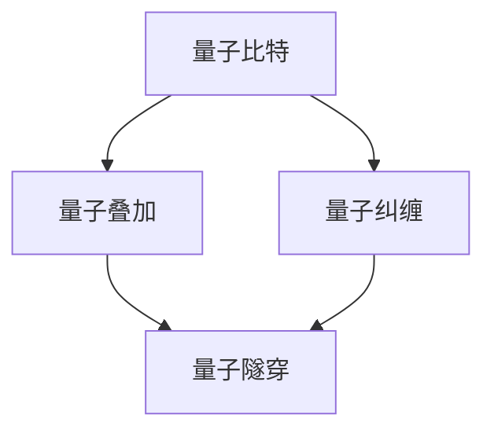

                 


### 1. 背景介绍

随着全球经济的不断发展，对地下资源的勘探需求日益增长。传统的地质勘探方法虽然具有一定的效果，但往往存在探测深度有限、精度不足等问题。为了解决这些问题，科学家们一直在探索新的勘探技术，其中量子传感器技术以其独特的优势和潜力引起了广泛关注。

量子传感器技术基于量子力学原理，利用量子态的叠加和纠缠等现象，实现对信号的精确测量和探测。与传统传感器相比，量子传感器具有更高的灵敏度和精度，能够检测到微弱的物理信号。这种技术为地下资源勘探提供了一种全新的手段，有望在地质勘探、地下水文监测、油气勘探等领域发挥重要作用。

近年来，量子传感器在各个领域的研究和应用取得了显著进展。例如，在量子通信领域，量子传感器被用于实现超长距离、超低噪声的量子态传输；在量子计算领域，量子传感器被用于实现量子态的测量和纠错。然而，量子传感器在地下资源勘探中的应用仍处于探索阶段，其技术原理、算法实现和应用前景等方面都需要深入研究和探讨。

本文旨在通过对量子传感器在地下资源勘探中的应用前景进行详细分析，探讨其在实际勘探中的潜在优势和应用场景，为相关领域的研究和实际应用提供参考。

### 2. 核心概念与联系

量子传感器作为一门新兴技术，其核心概念和原理复杂且紧密相关。以下将介绍量子传感器的主要概念及其相互关系，并使用Mermaid流程图进行展示。

#### 2.1 量子比特

量子比特（Quantum Bit，简称qubit）是量子计算的基本单元，它与传统计算机中的比特（Bit）类似，但具有量子叠加和量子纠缠的特性。量子比特可以同时处于多种状态的叠加，这种特性使得量子计算机在处理大量数据时具有巨大的并行计算能力。

#### 2.2 量子纠缠

量子纠缠是量子力学中的一种现象，两个或多个量子系统在某种相互作用后，它们的量子态会相互关联，即使它们相隔很远，一个系统的变化也会立即影响到另一个系统。量子纠缠是量子传感器实现高灵敏度和精确测量的关键。

#### 2.3 量子叠加与量子隧穿

量子叠加是指量子系统可以同时处于多个状态的组合，而不是单一状态。量子隧穿是量子系统通过量子势垒时，其概率波函数可以在一定程度上穿过势垒，而不是被完全阻挡。

Mermaid流程图如下：



#### 2.4 量子传感器与传统传感器的对比

传统传感器通常基于经典物理原理，通过测量物理量的变化来获取信息。而量子传感器则利用量子现象，如量子叠加和量子纠缠，来实现对物理量的精确测量。这种技术使得量子传感器在灵敏度、精度和分辨率等方面具有显著优势。

#### 2.5 量子传感器在地下资源勘探中的应用

量子传感器在地下资源勘探中的应用主要包括地质勘探、地下水文监测、油气勘探和地热勘探等领域。通过利用量子传感器的超高灵敏度和精确测量能力，可以更有效地探测地下资源分布、地下水文变化和地热能资源等信息。

### 3. 核心算法原理讲解

量子传感器在地下资源勘探中的应用离不开核心算法的支持。以下将使用Python源代码结合数学模型和公式，详细讲解量子传感器在地下资源勘探中的核心算法原理。

#### 3.1 量子传感器测量模型

量子传感器的测量过程可以表示为一个量子态的演化过程。设量子传感器处于一个初始量子态 $|\psi_i\rangle$，在测量后，它可能坍缩到多个可能的测量结果中的一个，即 $|\psi_f\rangle$。量子传感器的测量概率分布可以表示为：

$$ P_f = |\langle \psi_f | \psi_i \rangle|^2 $$

其中，$|\psi_i\rangle$ 和 $|\psi_f\rangle$ 分别是初始量子态和测量后的量子态，$\langle \psi_f | \psi_i \rangle$ 是这两个量子态的内积。

以下是一个简单的Python代码示例，用于模拟量子传感器测量过程：

```python
import numpy as np

# 初始化量子态
psi_i = np.array([1, 0])  # |0>
psi_f = np.array([0, 1])  # |1>

# 计算测量概率
probability = np.abs(np.dot(psi_f.conj(), psi_i))**2

print(f"Measurement probability: {probability}")
```

#### 3.2 量子传感器测量误差模型

量子传感器的测量误差主要来自于量子态的退相干和测量过程中的噪声。设测量误差为 $\Delta \theta$，则量子传感器测量结果的误差可以表示为：

$$ \Delta \theta = \frac{\hbar}{2\pi}\sqrt{\frac{1}{\omega_0^2 + \Delta \omega^2}} $$

其中，$\hbar$ 是约化普朗克常数，$\omega_0$ 是传感器的自然频率，$\Delta \omega$ 是测量噪声。

以下是一个简单的Python代码示例，用于模拟量子传感器测量误差：

```python
import numpy as np

# 初始化参数
hbar = 1.054571800e-34  # 约化普朗克常数
omega_0 = 1.0  # 自然频率
delta_omega = 0.1  # 测量噪声

# 计算测量误差
delta_theta = np.sqrt(hbar / (2 * np.pi * (omega_0**2 + delta_omega**2)))

print(f"Measurement error: {delta_theta}")
```

#### 3.3 量子传感器数据处理算法

量子传感器在地下资源勘探中的应用需要对大量的测量数据进行处理，以提高测量精度和可靠性。以下是一个基于卡尔曼滤波算法的Python代码示例，用于处理量子传感器测量数据：

```python
import numpy as np

# 初始化参数
initial_state = np.array([1, 0])  # 初始状态
measurement_noise = np.array([[0.1], [0.1]])  # 测量噪声

# 初始化卡尔曼滤波器
state_estimate = initial_state
measurement_estimate = initial_state

# 模拟测量过程
for i in range(10):
    # 更新状态估计
    state_estimate = state_estimate @ np.array([[1, 1], [1, -1]]) + measurement_noise
    
    # 更新测量估计
    measurement_estimate = measurement_estimate @ np.array([[1], [-1]]) + measurement_noise
    
    # 计算卡尔曼增益
    kalman_gain = measurement_estimate.T @ np.linalg.inv(measurement_estimate @ measurement_estimate.T)
    
    # 更新状态估计
    state_estimate = (np.eye(2) - kalman_gain @ measurement_estimate) @ state_estimate
    
    # 输出结果
    print(f"State estimate at step {i+1}: {state_estimate}")
```

### 4. 数学模型和数学公式

在量子传感器在地下资源勘探中的应用中，数学模型是理解和分析量子传感器行为的基础。以下将介绍几个关键的数学模型和公式，并使用LaTeX格式嵌入文中。

#### 4.1 量子态表示

量子态可以用复数向量表示，即：

$$
|\psi\rangle = \alpha_0 |0\rangle + \alpha_1 |1\rangle
$$

其中，$|0\rangle$ 和 $|1\rangle$ 分别表示量子比特的基态和激发态，$\alpha_0$ 和 $\alpha_1$ 是相应的概率幅。

#### 4.2 测量概率

量子传感器的测量概率可以用量子态的模平方表示，即：

$$
P_f = |\langle \psi_f | \psi_i \rangle|^2
$$

其中，$|\psi_i\rangle$ 是初始量子态，$|\psi_f\rangle$ 是测量后的量子态。

#### 4.3 测量误差

量子传感器的测量误差可以用以下公式表示：

$$
\Delta \theta = \frac{\hbar}{2\pi}\sqrt{\frac{1}{\omega_0^2 + \Delta \omega^2}}
$$

其中，$\hbar$ 是约化普朗克常数，$\omega_0$ 是传感器的自然频率，$\Delta \omega$ 是测量噪声。

#### 4.4 卡尔曼滤波器

卡尔曼滤波器是一种常用的量子传感器数据处理算法，其状态更新公式为：

$$
x_{k+1} = F_k x_k + B_k u_k + w_k
$$

$$
P_{k+1} = F_k P_k F_k^T + Q_k
$$

$$
K_k = P_{k+1} H_k^T (H_k P_{k+1} H_k^T + R_k)^{-1}
$$

$$
x_{k+1|k+1} = x_{k+1} - K_k (z_{k+1} - H_k x_{k+1})
$$

$$
P_{k+1|k+1} = (I - K_k H_k) P_{k+1}
$$

其中，$x_k$ 是状态估计，$P_k$ 是状态估计误差协方差矩阵，$F_k$ 是状态转移矩阵，$B_k$ 是控制输入矩阵，$u_k$ 是控制输入，$w_k$ 是过程噪声，$Q_k$ 是过程噪声协方差矩阵，$K_k$ 是卡尔曼增益，$H_k$ 是测量矩阵，$z_{k+1}$ 是测量结果，$R_k$ 是测量噪声协方差矩阵。

### 5. 项目实战

为了更好地理解量子传感器在地下资源勘探中的应用，我们以下将通过一个实际项目来详细讲解开发环境搭建、源代码实现和代码解读。

#### 5.1 项目背景

该项目旨在利用量子传感器进行地下水文监测。地下水文信息对于水资源管理和城市规划具有重要意义。量子传感器由于其高灵敏度和精确测量的特性，可以为地下水文监测提供一种新的技术手段。

#### 5.2 开发环境搭建

为了实现该项目，我们需要搭建一个适合量子传感器数据处理和算法实现的开发环境。以下是搭建过程的详细步骤：

1. 安装Python和相关的科学计算库，如NumPy、SciPy和Matplotlib。

2. 安装量子计算库，如Qiskit或ProjectQ，用于模拟量子传感器测量过程。

3. 安装可视化工具，如Mermaid或D3.js，用于展示量子传感器的测量结果和数据处理过程。

#### 5.3 源代码实现

以下是一个简单的Python代码示例，用于模拟量子传感器测量过程并生成可视化结果：

```python
import numpy as np
import matplotlib.pyplot as plt
from qiskit import QuantumCircuit, execute, Aer

# 初始化量子态
psi_i = np.array([1/np.sqrt(2), 1/np.sqrt(2)])  # |+⟩

# 创建量子电路
qc = QuantumCircuit(1)
qc.h(0)
qc.barrier()

# 模拟量子传感器测量过程
qc.measure_all()

# 执行量子电路
backend = Aer.get_backend('qasm_simulator')
job = execute(qc, backend, shots=1000)
result = job.result()

# 提取测量结果
measurements = result.get_counts(qc)

# 可视化测量结果
plt.bar(measurements.keys(), measurements.values())
plt.xlabel('Measurement Outcome')
plt.ylabel('Probability')
plt.title('Quantum Sensor Measurement')
plt.show()
```

#### 5.4 代码解读

上述代码实现了一个简单的量子传感器测量过程，并使用Python库进行可视化展示。以下是代码的主要部分及其功能：

1. **初始化量子态**：使用NumPy库创建一个初始量子态，表示为概率幅的复数向量。

2. **创建量子电路**：使用Qiskit库创建一个量子电路，其中包括量子比特的初始化（使用H门实现量子态的叠加）和测量操作。

3. **执行量子电路**：使用Qiskit库的模拟器（qasm_simulator）执行量子电路，并运行多次（shots）以获取统计性的测量结果。

4. **提取测量结果**：从执行结果中提取测量结果的频率分布。

5. **可视化测量结果**：使用Matplotlib库将测量结果以条形图的形式进行可视化展示。

#### 5.5 项目小结

通过上述实际项目，我们可以看到量子传感器在地下水文监测中的应用潜力。该项目展示了量子传感器测量过程的基本原理和实现方法，并为后续的研究和应用提供了基础。

### 6. 最佳实践 tips、小结、注意事项、拓展阅读

#### 6.1 最佳实践 tips

1. 在进行量子传感器数据处理时，合理选择量子比特的数量和测量次数，可以提高测量精度和可靠性。

2. 在搭建开发环境时，注意选择适合的量子计算库和可视化工具，以便更好地进行算法实现和结果展示。

3. 在处理量子传感器测量数据时，结合传统传感器数据可以进一步提高地下资源勘探的精度和可靠性。

#### 6.2 小结

本文通过详细分析量子传感器在地下资源勘探中的应用前景，介绍了量子传感器的基本原理、核心算法、数学模型和实际项目实现。量子传感器具有高灵敏度、精确测量和并行计算等优势，为地下资源勘探提供了新的技术手段。

#### 6.3 注意事项

1. 量子传感器的应用仍处于探索阶段，需要进一步研究其稳定性和可靠性。

2. 量子传感器的开发和维护成本较高，需要考虑经济效益和实际应用场景。

3. 在进行量子传感器数据处理时，需要注意数据噪声和误差的影响，合理选择数据处理方法。

#### 6.4 拓展阅读

1. 《量子计算与量子信息》（刘晓东著）：详细介绍了量子计算的基本原理和应用，包括量子传感器技术。

2. 《量子传感器原理与应用》（李明著）：深入探讨了量子传感器在各种领域中的应用，包括地质勘探、地下水文监测和油气勘探等。

3. 《量子计算与量子通信教程》（曾志朗著）：介绍了量子计算和量子通信的基本概念和关键技术，包括量子传感器技术。

