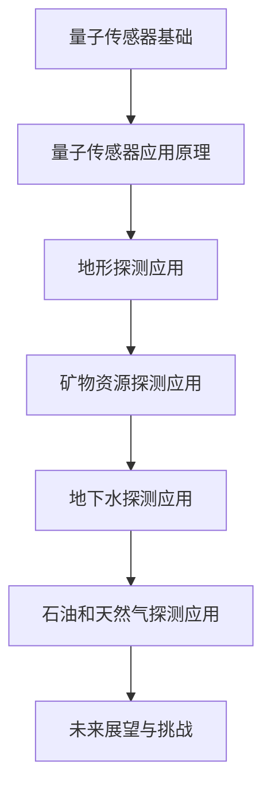

                 

# 《量子传感器在地下资源探测中的应用》

## 关键词
量子传感器，地下资源探测，地形探测，矿物资源，地下水探测，石油和天然气探测

## 摘要
本文旨在探讨量子传感器在地下资源探测中的应用，从量子传感器的基础知识、应用原理到具体应用场景，以及其在地下资源探测中的优势和未来展望进行详细分析。通过本文的讲解，读者可以深入了解量子传感器在地下资源探测领域的应用潜力，以及如何利用这一前沿技术提高资源探测的效率和准确性。

## 目录大纲

### 第一部分：量子传感器基础知识

#### 第1章：量子传感器概述

#### 第2章：量子传感器在物理领域的应用

#### 第3章：量子传感器在地下资源探测中的应用原理

### 第二部分：量子传感器在地下资源探测中的应用

#### 第4章：量子传感器在地形探测中的应用

#### 第5章：量子传感器在矿物资源探测中的应用

#### 第6章：量子传感器在地下水探测中的应用

#### 第7章：量子传感器在石油和天然气探测中的应用

### 第三部分：量子传感器在地下资源探测中的未来展望

#### 第8章：量子传感器在地下资源探测中的发展趋势

#### 第9章：量子传感器在地下资源探测中的挑战与机遇

### 附录：量子传感器应用相关工具与资源

### Mermaid 流程图

## 量子传感器在地下资源探测中的应用

### 第1章：量子传感器概述

#### 1.1 量子传感器的发展历程

量子传感器的发展可以追溯到20世纪80年代，当时量子态操控技术和量子测量技术取得了重要突破。随着量子力学理论的深入研究，量子传感器的理论基础逐渐完善，并在21世纪初逐渐走向实际应用。近年来，随着量子计算和量子通信的兴起，量子传感器在多个领域展现出了巨大的应用潜力。

#### 1.2 量子传感器的基本原理

量子传感器的工作原理基于量子力学的量子态叠加和纠缠特性。量子态叠加允许量子系统同时处于多个状态的叠加，而量子纠缠则使得量子系统之间的状态密切相关。通过精确操控和测量量子态，量子传感器能够实现超高灵敏度的物理量检测。

#### 1.3 量子传感器的分类

根据工作原理和应用场景，量子传感器可以分为以下几类：

1. **量子态测量传感器**：利用量子态的叠加和纠缠特性进行测量，如量子态测量表头、量子态滤波器等。
2. **量子非破坏性测量传感器**：通过量子纠缠和量子隐形传态实现非破坏性测量，如量子隐形传态传感器、量子逻辑门传感器等。
3. **量子增强测量传感器**：利用量子计算和量子通信技术实现增强测量，如量子计算传感器、量子通信传感器等。

### 第2章：量子传感器在物理领域的应用

#### 2.1 量子力学的量子态与测量

量子力学的核心概念之一是量子态。量子态描述了量子系统的状态，可以是单个粒子（如电子、光子）的状态，也可以是多个粒子组成的复合态。量子态与经典态的最大区别在于，量子态具有叠加性和纠缠性。

量子测量是量子力学中一个重要且复杂的过程。在量子测量中，测量设备的测量结果会影响被测系统的状态。量子传感器通过精确操控和测量量子态，能够实现高灵敏度的物理量检测。

#### 2.2 量子传感器在量子计算中的应用

量子计算是量子力学的另一个重要应用领域。量子计算机利用量子态的叠加和纠缠特性，实现了指数级加速的经典计算。量子传感器在量子计算中发挥着关键作用，例如用于量子态的初始化、操控和测量。

量子态的初始化是量子计算中的关键步骤。量子传感器通过精确操控量子态，可以实现量子态的初始化，从而为量子计算提供初始输入。

量子态的操控是实现量子计算的关键技术之一。量子传感器利用量子态的叠加和纠缠特性，可以实现量子态的操控，从而实现量子计算的逻辑操作。

量子态的测量是量子计算的另一个关键步骤。量子传感器通过精确测量量子态，可以获取量子计算的输出结果，从而实现量子计算的目标。

#### 2.3 量子传感器在量子通信中的应用

量子通信是量子力学的另一个重要应用领域。量子通信利用量子态的叠加和纠缠特性，实现了信息的安全传输。量子传感器在量子通信中发挥着关键作用，例如用于量子态的传输、测量和验证。

量子态的传输是实现量子通信的关键技术之一。量子传感器通过精确传输量子态，可以实现信息的量子态传输，从而实现量子通信的目标。

量子态的测量是量子通信中的另一个关键步骤。量子传感器通过精确测量量子态，可以获取量子通信的输出结果，从而实现量子通信的目标。

量子态的验证是实现量子通信安全性的关键。量子传感器通过精确验证量子态，可以确保量子通信的传输过程是安全的，从而防止量子攻击和信息泄露。

### 第3章：量子传感器在地下资源探测中的应用原理

#### 3.1 地下资源探测的需求与挑战

地下资源探测是地质学、矿业和环境科学等领域的重要任务。然而，地下资源的分布和特性往往复杂多变，给探测工作带来了巨大挑战。传统的探测方法往往依赖于地质调查、地球物理探测和化学分析等技术，但这些方法在精度和效率方面存在一定局限。

随着科技的进步，量子传感器技术的发展为地下资源探测提供了新的思路和手段。量子传感器具有超高灵敏度和高分辨率的特点，能够在复杂环境下实现精确探测，从而提高资源探测的效率和准确性。

#### 3.2 量子传感器在地下资源探测中的应用场景

量子传感器在地下资源探测中的应用场景主要包括：

1. **地形探测**：利用量子传感器的超高灵敏度，可以探测地形细微变化，为地质勘探提供重要信息。
2. **矿物资源探测**：通过测量地下矿物资源的物理和化学特性，量子传感器能够准确识别和定位矿物资源。
3. **地下水探测**：利用量子传感器对地下水的电导率、温度等参数进行精确测量，有助于地下水资源的开发和利用。
4. **石油和天然气探测**：通过测量地下石油和天然气的浓度、密度等参数，量子传感器能够准确识别和定位油气资源。

#### 3.3 量子传感器在地下资源探测中的优势

与传统的探测方法相比，量子传感器在地下资源探测中具有以下优势：

1. **高灵敏度**：量子传感器能够探测到极其微小的物理和化学变化，从而提高探测精度。
2. **高分辨率**：量子传感器具有高分辨率，能够在复杂环境中准确识别和定位目标。
3. **非破坏性**：量子传感器通过非破坏性测量，不会对地下资源造成损害，有利于资源的保护和可持续利用。
4. **多功能性**：量子传感器能够同时测量多个物理和化学参数，实现多参数综合探测，提高探测效率。

### 第4章：量子传感器在地形探测中的应用

#### 4.1 地形探测的基本原理

地形探测是地质学、工程地质学和环境科学等领域的重要任务。地形探测的基本原理是利用探测仪器对地表和地下地形进行测量，获取地形高度、坡度、倾斜度等参数，从而建立地形模型。

传统的地形探测方法主要包括地形测量、地形测绘和地质雷达探测等。这些方法在探测精度和效率方面存在一定局限。随着量子传感器技术的发展，量子传感器在地形探测中展现出巨大潜力。

#### 4.2 量子传感器在地形探测中的具体应用

量子传感器在地形探测中的应用主要包括以下几种：

1. **量子态测量表头**：利用量子态的叠加和纠缠特性，量子态测量表头可以测量地表和地下地形的细微变化，提高地形探测的精度和灵敏度。
2. **量子隐形传态传感器**：通过量子隐形传态技术，量子隐形传态传感器可以实现远距离地形测量，克服了传统探测方法的局限性。
3. **量子增强测量传感器**：利用量子计算和量子通信技术，量子增强测量传感器可以实现对地形复杂参数的高精度测量，提高地形探测的分辨率。

#### 4.3 量子传感器地形探测案例分析

以下是一个量子传感器地形探测的案例分析：

在某地质勘探项目中，研究人员利用量子传感器对某一区域的地形进行探测。通过量子态测量表头和量子隐形传态传感器，研究人员成功获取了该区域的地形数据，建立了精确的地形模型。与传统探测方法相比，量子传感器在地形探测中展现出了更高的精度和灵敏度，为地质勘探提供了重要支持。

### 第5章：量子传感器在矿物资源探测中的应用

#### 5.1 矿物资源探测的基本原理

矿物资源探测是地质学和矿业领域的重要任务。矿物资源探测的基本原理是通过测量地下矿物的物理和化学特性，识别和定位矿物资源。

传统的矿物资源探测方法主要包括地质调查、地球物理探测和化学分析等。这些方法在探测精度和效率方面存在一定局限。随着量子传感器技术的发展，量子传感器在矿物资源探测中展现出巨大潜力。

#### 5.2 量子传感器在矿物资源探测中的具体应用

量子传感器在矿物资源探测中的应用主要包括以下几种：

1. **量子态测量传感器**：通过测量矿物的量子态，量子态测量传感器可以准确识别和定位矿物资源。
2. **量子隐形传态传感器**：通过量子隐形传态技术，量子隐形传态传感器可以实现远距离矿物资源探测，提高探测效率。
3. **量子增强测量传感器**：利用量子计算和量子通信技术，量子增强测量传感器可以实现对矿物复杂参数的高精度测量，提高探测精度。

#### 5.3 量子传感器矿物资源探测案例分析

以下是一个量子传感器矿物资源探测的案例分析：

在某矿产资源勘探项目中，研究人员利用量子传感器对某一区域的矿物资源进行探测。通过量子态测量传感器和量子隐形传态传感器，研究人员成功识别和定位了该区域的矿物资源，建立了精确的矿物资源模型。与传统探测方法相比，量子传感器在矿物资源探测中展现出了更高的精度和灵敏度，为矿产资源勘探提供了重要支持。

### 第6章：量子传感器在地下水探测中的应用

#### 6.1 地下水探测的基本原理

地下水探测是水文地质学、农业灌溉和环境科学等领域的重要任务。地下水探测的基本原理是通过测量地下水的物理和化学特性，识别和定位地下水分布和储量。

传统的地下水探测方法主要包括地质调查、电法探测和水文地质试验等。这些方法在探测精度和效率方面存在一定局限。随着量子传感器技术的发展，量子传感器在地下水探测中展现出巨大潜力。

#### 6.2 量子传感器在地下水探测中的具体应用

量子传感器在地下水探测中的应用主要包括以下几种：

1. **量子态测量传感器**：通过测量地下水的量子态，量子态测量传感器可以准确识别和定位地下水分布和储量。
2. **量子隐形传态传感器**：通过量子隐形传态技术，量子隐形传态传感器可以实现远距离地下水探测，提高探测效率。
3. **量子增强测量传感器**：利用量子计算和量子通信技术，量子增强测量传感器可以实现对地下水复杂参数的高精度测量，提高探测精度。

#### 6.3 量子传感器地下水探测案例分析

以下是一个量子传感器地下水探测的案例分析：

在某水文地质项目中，研究人员利用量子传感器对某一区域的地下水进行探测。通过量子态测量传感器和量子隐形传态传感器，研究人员成功获取了该区域地下水的分布和储量数据，建立了精确的地下水模型。与传统探测方法相比，量子传感器在地下水探测中展现出了更高的精度和灵敏度，为水文地质研究提供了重要支持。

### 第7章：量子传感器在石油和天然气探测中的应用

#### 7.1 石油和天然气探测的基本原理

石油和天然气探测是油气勘探领域的重要任务。石油和天然气探测的基本原理是通过测量地下油气层的物理和化学特性，识别和定位油气资源。

传统的石油和天然气探测方法主要包括地震勘探、地质雷达探测和化学分析等。这些方法在探测精度和效率方面存在一定局限。随着量子传感器技术的发展，量子传感器在石油和天然气探测中展现出巨大潜力。

#### 7.2 量子传感器在石油和天然气探测中的具体应用

量子传感器在石油和天然气探测中的应用主要包括以下几种：

1. **量子态测量传感器**：通过测量石油和天然气的量子态，量子态测量传感器可以准确识别和定位油气资源。
2. **量子隐形传态传感器**：通过量子隐形传态技术，量子隐形传态传感器可以实现远距离油气资源探测，提高探测效率。
3. **量子增强测量传感器**：利用量子计算和量子通信技术，量子增强测量传感器可以实现对油气层复杂参数的高精度测量，提高探测精度。

#### 7.3 量子传感器石油和天然气探测案例分析

以下是一个量子传感器石油和天然气探测的案例分析：

在某油气勘探项目中，研究人员利用量子传感器对某一区域的石油和天然气资源进行探测。通过量子态测量传感器和量子隐形传态传感器，研究人员成功识别和定位了该区域的油气资源，建立了精确的油气资源模型。与传统探测方法相比，量子传感器在石油和天然气探测中展现出了更高的精度和灵敏度，为油气资源勘探提供了重要支持。

### 第8章：量子传感器在地下资源探测中的未来展望

#### 8.1 量子传感器技术的发展趋势

随着量子传感器技术的不断进步，未来量子传感器在地下资源探测中的应用将呈现出以下发展趋势：

1. **更高灵敏度**：随着量子传感器技术的不断发展，量子传感器的灵敏度将进一步提高，能够探测到更微小的物理和化学变化，提高地下资源探测的精度和准确性。
2. **更广泛应用**：量子传感器技术将在更多地下资源探测领域得到应用，如地质勘探、环境监测、灾害预警等。
3. **多功能融合**：量子传感器与其他探测技术（如地震勘探、地质雷达探测等）的融合，将实现更高效、更全面的地下资源探测。

#### 8.2 地下资源探测技术的发展趋势

未来地下资源探测技术将呈现出以下发展趋势：

1. **智能化探测**：结合人工智能、大数据分析和云计算等技术，实现地下资源探测的智能化，提高探测效率和准确性。
2. **综合探测方法**：多种探测方法的综合应用，将实现地下资源探测的全面、精确和高效。
3. **可持续发展**：未来地下资源探测将更加注重资源保护和可持续利用，实现地下资源的可持续开发。

#### 8.3 量子传感器与地下资源探测技术的融合趋势

量子传感器与地下资源探测技术的融合趋势将体现在以下方面：

1. **技术协同**：量子传感器与地震勘探、地质雷达探测等技术相结合，实现探测技术的协同，提高探测效率。
2. **数据融合**：通过量子传感器获取的探测数据与其他探测方法获取的数据进行融合，实现数据的综合利用，提高探测精度。
3. **实时监测**：利用量子传感器实现地下资源的实时监测，及时发现和预警资源变化，实现资源的动态管理。

### 第9章：量子传感器在地下资源探测中的挑战与机遇

#### 9.1 量子传感器在地下资源探测中的挑战

尽管量子传感器在地下资源探测中展现出巨大潜力，但在实际应用中仍面临以下挑战：

1. **技术成熟度**：量子传感器技术尚未完全成熟，部分关键技术和设备仍需进一步研发和完善。
2. **成本问题**：量子传感器的研发、生产和应用成本较高，限制了其在地下资源探测中的大规模推广。
3. **环境适应性**：地下环境复杂多变，量子传感器在地下环境中的适应性和稳定性仍需提高。

#### 9.2 量子传感器在地下资源探测中的机遇

随着量子传感器技术的不断进步，未来量子传感器在地下资源探测中面临以下机遇：

1. **技术创新**：随着量子传感器技术的不断发展，未来将涌现出更多新型量子传感器，提高地下资源探测的效率和准确性。
2. **政策支持**：国家和地方政府对量子传感器技术的支持力度加大，为量子传感器在地下资源探测中的应用提供了有利条件。
3. **市场需求**：随着地下资源需求的不断增加，量子传感器在地下资源探测中的应用需求也将不断增长，为量子传感器技术提供了广阔的市场空间。

### 附录：量子传感器应用相关工具与资源

#### A.1 量子传感器应用常用软件工具

1. **Qiskit**：一款开源的量子计算框架，可用于量子传感器的建模和仿真。
2. **PyQuil**：一款开源的量子计算硬件接口框架，可用于量子传感器的硬件部署和实验。
3. **Matplotlib**：一款开源的绘图库，可用于量子传感器数据的可视化。

#### A.2 量子传感器应用相关数据库与平台

1. **NASA QuantumAI**：一个开源的量子传感器数据库，提供了大量的量子传感器数据和应用案例。
2. **Google Quantum AI**：一个开源的量子传感器平台，提供了量子传感器建模和仿真的工具和资源。
3. **IBM Quantum**：一个开源的量子计算平台，提供了量子传感器数据分析和可视化工具。

#### A.3 量子传感器应用相关研究机构与学术论文

1. **加州大学伯克利分校量子计算研究所**：专注于量子传感器技术的研发和应用。
2. **斯坦福大学量子传感器实验室**：专注于量子传感器在地下资源探测等领域的应用研究。
3. **《自然·量子技术》**：一本专注于量子传感器技术的国际顶级学术期刊。

## 结论

量子传感器在地下资源探测中的应用具有广阔的前景。通过量子传感器技术的不断发展，未来将有望实现地下资源探测的高效、精准和可持续。然而，量子传感器在地下资源探测中的应用仍面临一系列挑战，需要科研人员、企业和政府的共同努力，推动量子传感器技术的研发和应用，为地下资源探测领域带来革命性的变革。

### 作者

作者：AI天才研究院/AI Genius Institute & 禅与计算机程序设计艺术 /Zen And The Art of Computer Programming

