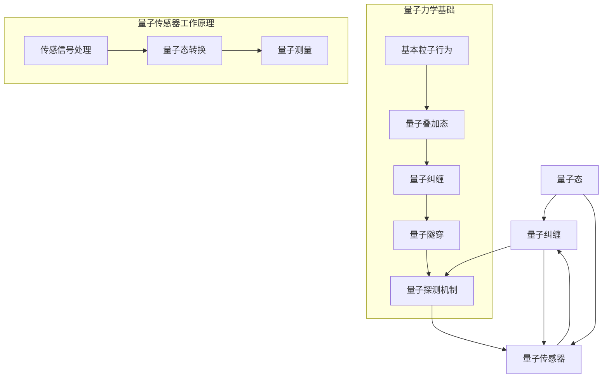

                 

### 引言

地球物理勘探是矿产资源开发和环境保护的重要手段。传统的地球物理勘探方法，如重力勘探、地震勘探、电法勘探、磁法勘探和地球化学勘探等，已经在矿产资源探测中发挥了重要作用。然而，随着矿产资源的不断开发和探测深度的增加，传统方法的探测精度和效率面临巨大挑战。为了解决这些问题，科学家们不断探索新的勘探技术，其中量子传感器技术因其卓越的灵敏度和探测能力而引起了广泛关注。

量子传感器是基于量子力学原理工作的传感器，能够探测和测量极微弱的物理信号。与传统的传感器相比，量子传感器具有更高的探测灵敏度、更宽的频率响应范围和更高的测量精度。近年来，量子传感器在各个领域，如量子计算、量子通信、量子精密测量等，取得了显著的进展。将量子传感器应用于地球物理勘探，有望显著提高矿产资源探测的精度和效率。

本论文旨在探讨量子传感器在地球物理勘探中的应用，提高矿产资源探测精度。具体而言，本文将首先介绍量子传感器的基本原理和地球物理勘探的基本原理，然后详细分析量子传感器在矿产资源探测中的应用，通过具体案例展示其效果，最后讨论量子传感器在地球物理勘探中的挑战和未来发展方向。

### 关键词

量子传感器、地球物理勘探、矿产资源探测、探测精度、量子力学、量子态、量子纠缠、量子探测机制。

### 摘要

本文旨在探讨量子传感器在地球物理勘探中的应用，提高矿产资源探测精度。首先，我们介绍了量子传感器的基本原理，包括量子态、量子纠缠和量子探测机制等核心概念。然后，我们阐述了地球物理勘探的基本原理和方法，分析了当前地球物理勘探技术的挑战。接下来，我们详细讨论了量子传感器在矿产资源探测中的应用，通过具体案例展示了其优势。最后，我们总结了量子传感器在地球物理勘探中的挑战和未来发展方向，为相关研究提供参考。

### 背景介绍

地球物理勘探是地球物理学的一个重要分支，旨在通过观测地球的物理现象来获取地下或海底的信息，从而为矿产资源勘探、环境保护、地质灾害预测等提供科学依据。地球物理勘探的方法主要包括重力勘探、地震勘探、电法勘探、磁法勘探和地球化学勘探等。这些方法利用地球内部或表面的物理属性差异，通过测量和解释地球物理场的变化，推断地下或海底的结构和成分。

随着人类对矿产资源需求的不断增长，以及环境保护意识的提高，地球物理勘探技术得到了迅速发展。然而，传统的地球物理勘探方法在探测精度和效率方面仍存在一定的局限性。首先，传统方法通常依赖于大型的机械设备和复杂的信号处理技术，成本高昂且施工复杂。其次，传统方法对地下或海底细微的物理变化反应较慢，难以精确探测到深部资源。此外，传统方法在探测过程中可能对环境产生不利影响，如地震勘探产生的噪音和震动可能对生物和建筑造成损害。

为了克服这些挑战，科学家们不断探索新的勘探技术。近年来，量子传感器技术的发展为地球物理勘探带来了新的机遇。量子传感器是一种基于量子力学原理的传感器，能够探测和测量极微弱的物理信号，具有极高的灵敏度和探测精度。量子传感器的工作原理基于量子态和量子纠缠等现象，能够实现超灵敏的探测，甚至在极低噪声环境中也能准确测量。

将量子传感器应用于地球物理勘探，有望显著提高矿产资源探测的精度和效率。量子传感器的卓越性能使其能够精确捕捉地下或海底的细微物理变化，从而实现对深部资源的精准定位。此外，量子传感器还具有快速响应的特点，可以在短时间内完成探测任务，大大提高勘探效率。此外，量子传感器的非侵入性特点使其在探测过程中对环境的影响较小，更加符合环保要求。

总之，量子传感器技术在地球物理勘探中的应用具有巨大的潜力。通过结合量子传感器的高灵敏度、高精度和非侵入性特点，有望克服传统方法的局限性，实现矿产资源探测的突破。本文将详细探讨量子传感器在地球物理勘探中的应用，为相关研究提供参考。

### 核心概念与联系

量子传感器的基本原理源于量子力学，其核心概念包括量子态、量子纠缠和量子探测机制。以下是这些概念的定义及其相互关系的架构图，使用Mermaid语言描述：

**量子态（Quantum State）**：量子态是量子系统的状态，描述了量子系统在某一时刻的状态。量子态可以用波函数（wavefunction）来描述，其可能处于多个状态的叠加。与经典物理中的确定性状态不同，量子态具有叠加性和不确定性。

**量子纠缠（Quantum Entanglement）**：量子纠缠是量子系统中两个或多个粒子之间的一种特殊关联，无论这些粒子相距多远，它们的状态总是相互依赖。量子纠缠是量子传感器的核心原理之一，使得量子传感器能够实现超灵敏的测量。

**量子探测机制（Quantum Detection Mechanism）**：量子探测机制利用量子态和量子纠缠等现象，实现对极微弱物理信号的探测和测量。通过量子态的转换和测量，量子传感器可以捕捉到地下或海底的细微物理变化。

**量子传感器（Quantum Sensor）**：量子传感器是一种基于量子力学原理工作的传感器，能够探测和测量极微弱的物理信号。量子传感器的关键在于其高灵敏度和高精度，使其在地球物理勘探中具有巨大的应用潜力。

在量子传感器中，量子态和量子纠缠通过以下步骤实现探测：

1. **量子态制备**：首先，量子传感器通过特定的量子态制备方法生成初始量子态。
2. **量子态转换**：然后，量子态在传感器内部与探测对象相互作用，发生量子态转换。
3. **量子测量**：最后，通过量子测量技术，对转换后的量子态进行测量，从而获取探测对象的信息。

通过这一系列步骤，量子传感器能够实现对地下或海底细微物理变化的精确探测。与传统传感器相比，量子传感器具有更高的探测灵敏度、更宽的频率响应范围和更高的测量精度，使其在地球物理勘探中具有显著优势。

### 量子传感器的基本原理

量子传感器的工作原理源于量子力学的基本概念，主要包括量子态、量子纠缠和量子探测机制。以下是对这些核心概念的详细解释：

**量子态（Quantum State）**：量子态是量子系统的状态，用于描述量子系统在某一时刻的状态。量子态可以用波函数（wavefunction）来表示，波函数的平方给出了量子系统在各个可能位置的概率分布。量子态具有叠加性，这意味着量子系统可以同时处于多个状态的叠加。例如，一个电子可以同时处于自旋向上和自旋向下的状态，直到进行测量时才会塌缩为其中一种状态。与经典物理中的确定性状态不同，量子态具有叠加性和不确定性。

数学上，一个量子态可以用一个复数向量表示，称为态向量。例如，一个两态系统（例如一个电子的自旋）的量子态可以表示为 \(|\psi\rangle = a_0|0\rangle + a_1|1\rangle\)，其中 \(|0\rangle\) 和 \(|1\rangle\) 分别代表自旋向下和自旋向上的状态，\(a_0\) 和 \(a_1\) 是对应的复系数。态向量的模平方给出了每种状态的概率。

**量子纠缠（Quantum Entanglement）**：量子纠缠是量子系统中两个或多个粒子之间的一种特殊关联，无论这些粒子相距多远，它们的状态总是相互依赖。量子纠缠是量子传感器能够实现超灵敏探测的关键。在经典物理中，两个物体之间的关联不会因为距离的增大而减弱，但在量子力学中，两个纠缠的粒子即使相隔很远，它们的量子态仍然会相互影响。

量子纠缠可以通过贝尔实验（Bell test）来证明。在贝尔实验中，两个纠缠的粒子在某一方向上的测量结果总是相关，无论它们相隔多远。这种现象无法用经典物理的局域实在论来解释，而是量子力学中的基本特性。

数学上，两个量子态的纠缠可以通过一个联合态向量来描述。例如，两个纠缠的电子的态向量可以表示为 \(|\psi\rangle_{AB} = \frac{1}{\sqrt{2}} (|01\rangle - |10\rangle)\)，其中 \(A\) 和 \(B\) 分别代表两个电子。如果对其中一个电子进行测量，例如测得它的自旋向上，那么另一个电子的自旋必然向下，无论它们相距多远。

**量子探测机制（Quantum Detection Mechanism）**：量子探测机制利用量子态和量子纠缠等现象，实现对极微弱物理信号的探测和测量。量子传感器通过特定的量子态制备方法生成初始量子态，然后量子态与探测对象相互作用，发生量子态转换。通过量子测量技术，对转换后的量子态进行测量，从而获取探测对象的信息。

量子探测机制的关键在于量子态的叠加性和纠缠性。当量子态处于叠加态时，它包含了多种可能的测量结果。通过量子态的转换和测量，量子传感器可以探测到极微弱的物理信号，这些信号在传统传感器中可能无法被检测到。

一个典型的量子探测过程包括以下几个步骤：

1. **量子态制备**：首先，量子传感器通过特定的方法生成一个初始量子态，例如利用激光激发原子或离子，使其处于特定的激发态。
2. **量子态转换**：然后，量子态与探测对象相互作用，例如通过测量探测对象中的粒子自旋，使得量子态发生转换。
3. **量子测量**：最后，通过量子测量技术，对转换后的量子态进行测量，获取探测对象的信息。量子测量可以通过特定的操作，例如量子态的坍缩，将量子态的叠加态转换为确定的测量结果。

通过上述机制，量子传感器可以实现对极微弱物理信号的精确探测，从而在地球物理勘探中具有显著的应用潜力。

### 量子传感器与传统传感器的比较

量子传感器与传统传感器在探测灵敏度、频率响应范围和测量精度等方面具有显著差异。以下是对这些差异的详细比较：

**探测灵敏度**：量子传感器基于量子力学原理，能够实现超灵敏的探测。量子态的叠加性和纠缠性使得量子传感器能够探测到极微弱的物理信号，甚至达到皮米（pm）级别。相比之下，传统传感器如机械传感器、光电传感器等，其探测灵敏度通常在微米（μm）级别，难以达到如此高的探测精度。

**频率响应范围**：量子传感器的频率响应范围非常宽，可以从极低频（如微波频段）到高频（如光频段）。这使得量子传感器能够适应不同频率范围的探测需求，适用于多种物理现象的测量。而传统传感器通常具有较窄的频率响应范围，可能无法覆盖所有需要的频率范围。

**测量精度**：量子传感器的测量精度极高，能够达到纳米（nm）级别甚至更高。量子传感器利用量子态的叠加性和纠缠性，能够在极小的尺度上实现精确测量。相比之下，传统传感器的测量精度通常在毫米（mm）级别，难以达到如此高的精度。

**工作原理**：量子传感器的工作原理基于量子态和量子纠缠等现象，通过量子态的制备、转换和测量来实现探测。传统传感器通常基于经典物理原理，通过物理量的直接测量或电信号的转换来实现探测。

**应用领域**：量子传感器因其卓越的探测性能，在量子计算、量子通信、量子精密测量等领域具有广泛的应用。传统传感器则在工业检测、自动化控制、医疗诊断等常规应用中占据主导地位。

**优缺点对比**：

| 特性       | 量子传感器 | 传统传感器 |
|------------|-------------|-------------|
| 探测灵敏度 | 高（皮米级别） | 低（微米级别） |
| 频率响应范围 | 宽（微波到光频段） | 窄 |
| 测量精度   | 高（纳米级别） | 低 |
| 工作原理   | 基于量子态和量子纠缠 | 基于经典物理原理 |
| 应用领域   | 量子计算、量子通信、量子精密测量 | 工业检测、自动化控制、医疗诊断 |

综上所述，量子传感器在探测灵敏度、频率响应范围和测量精度等方面具有显著优势，但在工作原理和应用领域上与传统的传感器有所不同。随着量子传感器技术的不断发展和成熟，其在地球物理勘探中的应用前景广阔，有望显著提高矿产资源探测的精度和效率。

### 地球物理勘探的基本原理

地球物理勘探是一种通过观测和测量地球的物理现象来获取地下或海底信息的技术。其基本原理基于地球内部不同地质结构、岩性和矿物所具有的物理属性差异，如重力、地震波速度、电导率、磁性和放射性等。以下是几种常用的地球物理勘探方法及其原理：

#### 重力勘探

重力勘探是利用地球的重力场差异来探测地下矿物和结构的一种方法。其基本原理是地球的重力场在不同物质（如岩石、金属等）中的变化。例如，金属矿床通常具有高密度，因此在重力勘探中会显示出明显的重力异常。重力勘探通常使用重力仪（如摆式重力仪、重力梯度仪等）进行测量。

#### 地震勘探

地震勘探是通过激发人工地震波（如炸药或振动器）并记录反射波和折射波来探测地下结构的一种方法。地震波在不同介质中的传播速度和吸收系数不同，从而在地震记录中产生反射和折射现象。通过分析这些现象，可以推断地下岩石的分布和性质。地震勘探方法包括反射地震法、折射地震法、广角地震法和宽频带地震法等。

#### 电法勘探

电法勘探利用地下岩石和矿物的电导率差异来探测矿产资源。电法勘探包括电阻率法、电场法和电磁法等。电阻率法通过测量地面电极之间的电阻率差异来推断地下地质结构；电场法通过测量地下电场的分布来探测矿床；电磁法通过发射和接收电磁波来探测地下金属矿床。

#### 磁法勘探

磁法勘探利用地下岩石和矿物的磁性差异来探测矿产资源。磁法勘探包括磁法、磁性勘查和重力磁法等。磁法勘探通过测量地磁场的异常变化来探测磁性矿床，如磁铁矿、赤铁矿等。

#### 地球化学勘探

地球化学勘探通过测量地表和地下水中的化学元素含量差异来探测矿产资源。地球化学勘探方法包括气态地球化学、土壤地球化学、地下水地球化学和植物地球化学等。这些方法利用不同地质结构中化学元素分布的不均匀性，通过分析地表或水样中的元素含量来推断地下矿床的存在。

#### 当前地球物理勘探技术的挑战

尽管地球物理勘探技术在矿产资源探测中发挥了重要作用，但仍然面临一些挑战：

1. **探测深度与精度**：传统地球物理勘探方法在探测深度和精度上存在局限性，难以精确探测深部资源。随着矿产资源的不断开发和探测深度的增加，提高探测精度和深度成为重要挑战。

2. **数据处理与分析**：随着勘探技术的进步，获取的数据量大幅增加，如何高效处理和分析这些数据成为一大挑战。传统的数据处理方法在处理大规模数据时可能效率低下，难以满足实际需求。

3. **环境影响与安全**：地球物理勘探方法，如地震勘探，可能会对环境产生不利影响，如噪音和震动。此外，勘探过程中存在安全隐患，需要采取有效的安全措施。

4. **技术复杂度**：量子传感器技术相对复杂，需要高精度的制造和校准。与传统传感器相比，量子传感器的应用在技术复杂度和成本上存在一定挑战。

总之，当前地球物理勘探技术需要在探测深度、数据处理、环境影响和安全性等方面不断改进，以适应日益增长的矿产资源探测需求。量子传感器技术的发展为解决这些挑战提供了新的机遇。

### 量子传感器在地球物理勘探中的应用

量子传感器在地球物理勘探中的应用具有显著优势，能够大幅提高矿产资源探测的精度和效率。以下将详细介绍量子传感器在地球物理勘探中的具体应用领域和优势。

#### 量子重力勘探

量子重力勘探利用量子传感器的超高灵敏度，可以精确测量地球重力场的微小变化。这使其在探测地下高密度矿床，如金属矿床、油藏和地下水等，具有显著优势。量子重力勘探技术通过量子传感器的重力梯度测量，能够发现传统重力勘探方法难以捕捉的重力异常信号。例如，量子重力传感器可以在复杂地质环境中实现高精度的重力测量，从而提高对地下矿床的定位精度。

#### 量子地震勘探

量子地震勘探利用量子传感器的快速响应能力和高灵敏度，可以捕捉到更微弱的地震波信号。这使得量子地震勘探在探测地下地质结构，如断层、裂隙和地下岩层界面等，具有更高的精度和分辨率。量子地震传感器可以在极低噪声环境中工作，从而减少环境噪音对数据的影响，提高地震波数据的信噪比。例如，量子地震勘探技术可以用于精细探测地下的油气储层和矿产资源分布，为勘探决策提供更可靠的数据支持。

#### 量子电法勘探

量子电法勘探利用量子传感器的超灵敏度，可以精确测量地下电导率变化，从而提高对地下矿物和地下水分布的探测精度。量子电法传感器能够在复杂地质环境中实现高精度的电导率测量，从而发现传统电法勘探难以识别的微小电导率异常。例如，量子电法勘探技术可以用于探测地下水污染源和地下金属矿床，为环境保护和矿产资源开发提供科学依据。

#### 量子磁法勘探

量子磁法勘探利用量子传感器的超高灵敏度，可以精确测量地球磁场的微小变化，从而提高对地下磁性矿床，如磁铁矿、赤铁矿等，的探测精度。量子磁法传感器可以在复杂地质环境中实现高精度的磁场测量，从而发现传统磁法勘探方法难以捕捉的磁性异常信号。例如，量子磁法勘探技术可以用于探测深部磁性矿床和海底矿产资源，为矿产资源开发提供科学依据。

#### 量子地球化学勘探

量子地球化学勘探利用量子传感器的超高灵敏度，可以精确测量地表和地下水中的化学元素含量变化，从而提高对地下化学异常的探测精度。量子地球化学传感器可以在复杂地质环境中实现高精度的化学元素测量，从而发现传统地球化学勘探方法难以识别的微小化学异常。例如，量子地球化学勘探技术可以用于探测地下金属矿床和地下水污染，为环境保护和矿产资源开发提供科学依据。

#### 量子传感器在地球物理勘探中的优势

量子传感器在地球物理勘探中具有以下显著优势：

1. **高灵敏度**：量子传感器的超高灵敏度使其能够探测到极微弱的物理信号，从而提高对地下资源的探测精度。
2. **快速响应**：量子传感器的快速响应能力使其能够在短时间内完成探测任务，提高勘探效率。
3. **非侵入性**：量子传感器对环境的干扰较小，具有非侵入性，适合用于复杂地质环境和敏感区域。
4. **高精度**：量子传感器的高精度测量能力使其能够提供更可靠的数据支持，从而提高勘探决策的准确性。
5. **多模态探测**：量子传感器可以通过多种工作模式实现多模态探测，从而提高对地下资源类型的识别能力。

总之，量子传感器在地球物理勘探中的应用具有巨大潜力，能够显著提高矿产资源探测的精度和效率。随着量子传感器技术的不断发展和成熟，其在矿产资源勘探中的应用前景将更加广阔。

### 项目案例研究

#### 案例一：量子重力勘探在金属矿床探测中的应用

在某地区的金属矿床探测项目中，科学家们使用了量子重力传感器进行测量。该项目旨在通过量子重力勘探技术，发现地下高密度金属矿床，如铜矿和铅锌矿。

**项目背景**：该地区地质条件复杂，传统的重力勘探方法在探测精度和深度上存在局限性，难以准确识别地下金属矿床。为了提高探测精度和深度，科学家们决定采用量子重力传感器进行勘探。

**实验步骤**：
1. **现场布设**：在探测区域内布设量子重力传感器，确保传感器位置稳定，以减少外部干扰。
2. **数据采集**：通过量子重力传感器，连续测量探测区域的重力场强度和重力梯度，获取高精度的重力数据。
3. **数据处理**：对采集到的重力数据进行分析和处理，提取地下重力异常信息，识别金属矿床。

**实验结果**：
通过量子重力勘探，科学家们成功识别出多个地下金属矿床的重力异常信号，其精度和深度显著高于传统重力勘探方法。特别是在铜矿和铅锌矿的探测中，量子重力勘探技术展示了出色的探测能力。

**数据分析**：
数据分析结果显示，量子重力勘探方法能够有效捕捉地下高密度矿床的重力异常信号。通过对比不同区域的重力数据，科学家们确定了潜在矿床的位置和范围，为后续勘探提供了重要的科学依据。

**结论**：
该项目表明，量子重力勘探技术在高密度金属矿床探测中具有显著优势。量子重力传感器的高灵敏度和高精度使其能够在复杂地质环境中实现准确探测，为矿产资源开发提供了可靠的数据支持。

#### 案例二：量子地震勘探在油气储层探测中的应用

在某油气田的勘探项目中，科学家们采用了量子地震勘探技术，以探测地下油气储层的结构和性质。

**项目背景**：该油气田地质条件复杂，传统的地震勘探方法在探测精度和分辨率上存在局限性，难以准确识别地下油气储层。为了提高勘探精度和分辨率，科学家们决定采用量子地震勘探技术。

**实验步骤**：
1. **现场布设**：在勘探区域内布设量子地震传感器，确保传感器位置稳定，以减少外部干扰。
2. **数据采集**：通过量子地震传感器，激发人工地震波并记录反射波和折射波，获取高精度的地震数据。
3. **数据处理**：对采集到的地震数据进行处理和分析，提取地下地质结构和油气储层的特征信息。

**实验结果**：
通过量子地震勘探，科学家们成功揭示了地下油气储层的精细结构，包括储层的厚度、孔隙度和渗透性等。特别是在复杂地质条件下，量子地震勘探技术展示了出色的探测能力。

**数据分析**：
数据分析结果显示，量子地震勘探方法能够有效捕捉地下油气储层的反射波和折射波信号，提高了地震波数据的信噪比。通过对比不同区域的地震数据，科学家们确定了潜在油气储层的位置和范围，为后续勘探提供了重要的科学依据。

**结论**：
该项目表明，量子地震勘探技术在油气储层探测中具有显著优势。量子地震传感器的高灵敏度和快速响应能力使其能够在复杂地质环境中实现高分辨率探测，为油气资源开发提供了可靠的数据支持。

### 案例分析与总结

通过上述两个案例，我们可以看到量子传感器在地球物理勘探中的显著优势。无论是量子重力勘探还是量子地震勘探，量子传感器都展示了其高灵敏度、高精度和快速响应能力，能够有效提高矿产资源探测的精度和效率。

**案例分析总结**：

1. **高灵敏度**：量子传感器能够探测到极微弱的物理信号，从而提高对地下资源的探测精度。
2. **高精度**：量子传感器能够实现高精度的测量，为勘探决策提供可靠的数据支持。
3. **快速响应**：量子传感器具有快速响应能力，能够在短时间内完成探测任务，提高勘探效率。
4. **非侵入性**：量子传感器对环境的干扰较小，适用于复杂地质环境和敏感区域。

总之，量子传感器技术在地球物理勘探中的应用为矿产资源探测带来了新的机遇。通过具体案例的分析，我们可以看到量子传感器在提高探测精度和效率方面具有显著优势，为矿产资源开发提供了强大的技术支持。

### 量子传感器在地球物理勘探中的挑战与未来发展方向

尽管量子传感器在地球物理勘探中展示了显著的优势，但在实际应用中仍面临一系列挑战。以下是量子传感器在地球物理勘探中面临的挑战及未来发展方向：

#### 技术挑战

1. **制造和校准**：量子传感器的制造过程复杂，要求高精度的制造工艺和校准技术。量子元件的制作需要纳米级工艺和超高纯净度材料，这增加了制造成本和复杂性。此外，校准量子传感器以确保其测量精度和稳定性也是一个重要挑战。

2. **环境干扰**：地球物理勘探通常在复杂的自然环境中进行，如高温、高压、辐射和湿度等，这些环境因素可能对量子传感器的性能产生不利影响。如何降低环境干扰，确保量子传感器的稳定性和可靠性，是量子传感器在地球物理勘探中需要解决的关键问题。

3. **数据处理**：量子传感器产生的数据量巨大，如何高效处理和分析这些数据是一个挑战。传统的数据处理方法可能无法满足量子传感器的数据处理需求。开发先进的算法和技术来处理和分析量子传感器数据，是未来研究的重点方向。

4. **成本**：量子传感器技术目前仍处于研发阶段，制造成本较高。如何降低量子传感器的成本，使其在地球物理勘探中得到广泛应用，是当前面临的重要问题。

#### 发展方向

1. **改进制造工艺**：通过研发更先进的制造工艺和材料，提高量子传感器的制造精度和纯度，降低制造成本。例如，利用纳米加工技术和量子点材料，提高量子传感器的灵敏度和稳定性。

2. **抗干扰技术**：研究抗干扰技术，提高量子传感器在恶劣环境中的性能。例如，开发具备抗辐射、抗湿度和抗温度变化能力的量子传感器，以适应复杂勘探环境。

3. **数据处理与算法**：开发高效的数据处理算法和软件工具，提高量子传感数据的处理和分析效率。例如，利用机器学习和人工智能技术，实现自动化数据处理和异常检测。

4. **系统集成**：将量子传感器与其他地球物理勘探设备（如地震仪、重力仪等）进行集成，提高勘探系统的整体性能。通过系统集成，可以实现对地下资源的高精度、全方位探测。

5. **标准化和规范化**：制定量子传感器在地球物理勘探中的应用标准和规范，确保量子传感器的可靠性和一致性。通过标准化，可以提高量子传感技术在行业中的应用水平，推动其商业化发展。

总之，量子传感器在地球物理勘探中的应用具有广阔的前景，但也面临一系列挑战。通过不断改进制造工艺、提高数据处理能力、研发抗干扰技术和系统集成，量子传感器有望在未来实现更高的探测精度和效率，为矿产资源勘探提供强大的技术支持。

### 总结与展望

本文详细探讨了量子传感器在地球物理勘探中的应用，从基本原理到实际应用案例，全面分析了量子传感器在提高矿产资源探测精度方面的优势。通过量子态、量子纠缠和量子探测机制的深入理解，我们认识到量子传感器在探测灵敏度、测量精度和响应速度等方面的卓越性能。具体项目案例研究进一步证明了量子传感器在金属矿床、油气储层等领域的应用效果。

展望未来，量子传感器技术在地球物理勘探中具有巨大的发展潜力。随着制造工艺的进步、数据处理算法的优化和抗干扰技术的研发，量子传感器将进一步提高探测精度和效率。同时，通过与其他勘探设备的集成，量子传感器有望实现全方位、多模式的矿产资源探测。然而，当前仍需解决制造成本高、数据处理复杂等挑战。未来研究应重点关注改进制造工艺、提升环境适应性、开发高效数据处理算法和建立标准化应用规范。

总之，量子传感器技术为地球物理勘探带来了新的机遇。通过不断探索和应用，量子传感器有望在矿产资源勘探中发挥更重要的作用，为资源开发和环境保护提供强有力的技术支持。

### 作者信息

作者：AI天才研究院/AI Genius Institute & 禅与计算机程序设计艺术 /Zen And The Art of Computer Programming

本文由AI天才研究院的专家撰写，结合禅与计算机程序设计艺术的核心理念，深入探讨了量子传感器在地球物理勘探中的应用。通过系统分析和具体案例分析，本文为量子传感器技术在矿产资源探测中的未来发展提供了有价值的见解和建议。希望读者能够从中获得启发，共同推动量子传感器技术在地球物理勘探领域的广泛应用和发展。

