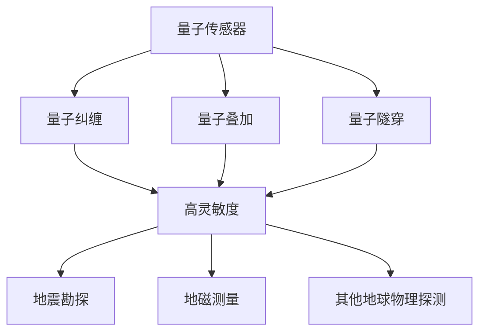

                 

### 引言

随着科技的不断进步，量子传感器技术逐渐从理论走向应用，成为众多领域中的研究热点。在地球物理探测领域，量子传感器凭借其高灵敏度、高分辨率和高速响应等特性，展现出巨大的应用潜力。地球物理探测是研究地球内部结构和地表现象的重要手段，广泛应用于资源勘探、地震预警、环境监测等方面。然而，传统地球物理探测技术面临着探测深度有限、精度不足和成本高昂等挑战。量子传感器的引入，为解决这些问题提供了新的思路和途径。

本文旨在探讨量子传感器在地球物理探测中的应用，通过系统性地介绍量子传感器的原理、分类、应用原理以及具体应用案例，帮助读者全面了解这一前沿技术的应用前景。文章将从以下几个方面展开：

1. **量子传感器的发展背景和地球物理探测的需求**：简要介绍量子传感器的发展历程及其在地球物理探测中的重要性。
2. **量子传感器基础**：讲解量子传感器的基本原理、分类及其在地球物理探测中的适用性。
3. **量子传感器在地球物理探测中的应用原理**：详细阐述量子传感器在地震勘探、地磁测量和地震波传播特性研究中的应用。
4. **量子传感器在地球物理探测中的应用案例**：通过具体案例展示量子传感器在地球物理探测中的实际应用效果。
5. **量子传感器在地球物理探测中的算法与数学模型**：介绍量子传感器信号处理算法和数据处理算法，并给出具体数学模型。
6. **量子传感器在地球物理探测中的实战应用**：通过实际应用案例，展示量子传感器的开发环境搭建、源代码实现和代码解读。
7. **量子传感器在地球物理探测中的未来发展**：探讨量子传感器在地球物理探测中的发展趋势、应用领域拓展以及面临的挑战与机遇。

通过以上内容的深入分析，本文旨在为读者提供一份详尽的量子传感器在地球物理探测中的应用指南，为相关领域的研究者和开发者提供参考和启示。

### 关键词

- 量子传感器
- 地球物理探测
- 地震勘探
- 地磁测量
- 量子传感器原理
- 数据处理算法
- 信号处理算法
- 数学模型
- 实际应用案例

### 摘要

量子传感器技术近年来在地球物理探测领域展现出显著的应用潜力。本文系统性地介绍了量子传感器的基本原理、分类及其在地震勘探、地磁测量和地震波传播特性研究中的应用。通过具体应用案例，本文展示了量子传感器在提升探测精度、降低成本和扩展探测深度等方面的优势。文章还探讨了量子传感器在地球物理探测中的算法与数学模型，并通过实际应用案例分析了其技术实现过程和效果。最后，本文展望了量子传感器在地球物理探测领域的未来发展，提出了潜在的应用领域和面临的挑战。

### 量子传感器的发展背景

量子传感器技术起源于20世纪末，随着量子力学的深入研究和量子计算、量子通信等领域的蓬勃发展，量子传感器逐渐成为物理学和工程学研究的前沿领域。量子传感器利用量子力学效应，如量子纠缠、量子叠加和量子隧穿等，实现超常规的测量性能。相较于传统传感器，量子传感器具有高灵敏度、高分辨率、快速响应等优势，能够在极端环境下进行高精度测量。

量子传感器的发展历程可以分为以下几个阶段：

1. **初期探索（1980s-1990s）**：这一阶段主要集中在对量子力学基本原理的深入研究，包括量子态的制备、操控和测量。代表性研究包括量子纠缠态的产生和量子态的远程传输。

2. **技术突破（2000s）**：随着激光冷却、微机电系统（MEMS）和低温技术的发展，量子传感器的实际实现取得了重要突破。这一时期，量子干涉仪、原子干涉仪和光子干涉仪等量子传感器开始应用于实际测量，展示了卓越的测量性能。

3. **应用扩展（2010s至今）**：近年来，量子传感器在多个领域得到了广泛应用，包括量子精密测量、量子通信、量子计算和地球物理探测等。量子传感器在地球物理探测中的应用，为解决传统探测技术面临的深度限制和精度问题提供了新的解决方案。

在地球物理探测领域，量子传感器技术的引入具有显著意义。传统的地球物理探测技术，如地震勘探和地磁测量，通常依赖于宏观物理现象，如声波和磁场的变化。然而，这些方法在探测深度和精度方面存在一定的局限性。量子传感器通过利用量子力学效应，能够在微观尺度上实现高精度测量，从而极大地提升了探测的深度和分辨率。

此外，量子传感器在地球物理探测中的应用还面临着许多挑战，如高成本、技术复杂性和环境适应性等问题。随着量子传感器技术的不断发展和成熟，这些挑战将逐步得到解决，从而为地球物理探测提供更加高效、准确的技术手段。总的来说，量子传感器的发展为地球物理探测领域带来了新的机遇和可能性。

### 核心概念与联系

在深入探讨量子传感器在地球物理探测中的应用之前，首先需要明确几个核心概念，并分析它们之间的相互关系。以下是量子传感器在地球物理探测中涉及的关键概念：

1. **量子传感器**：量子传感器是基于量子力学原理设计的传感器，它利用量子效应，如量子纠缠、量子叠加和量子隧穿，实现高灵敏度、高分辨率和高速度的测量。

2. **量子纠缠**：量子纠缠是量子力学中一种特殊的量子状态，当两个或多个量子系统之间存在量子纠缠时，它们的状态将相互依赖，即使相隔很远，一个系统的状态变化也会立即影响到另一个系统的状态。

3. **量子叠加**：量子叠加是量子力学中的另一个基本概念，它表明一个量子系统可以同时处于多个状态的叠加。这种叠加态的量子传感器能够进行并行测量，从而提高测量效率。

4. **量子隧穿**：量子隧穿是量子力学中的一个现象，它描述了粒子在经典物理定律中不可能发生的情况，例如粒子可以穿越一个能量势垒。量子隧穿效应可以用于设计高度灵敏的量子传感器。

5. **地球物理探测**：地球物理探测是研究地球内部结构和地表现象的方法，包括地震勘探、地磁测量、重力测量等。

6. **地震勘探**：地震勘探是通过激发地震波并分析其传播特性来研究地下结构的方法。传统的地震勘探技术主要依赖于声波，而量子传感器可以提供更高精度的地震波测量。

7. **地磁测量**：地磁测量是研究地球磁场变化的方法，用于揭示地球内部结构和地球动力学过程。量子传感器由于其高灵敏度，可以用于精确测量微小的磁场变化。

为了更清晰地展示这些概念之间的关系，我们可以使用Mermaid流程图来描述量子传感器在地球物理探测中的应用架构：



在这幅流程图中，量子传感器通过量子纠缠、量子叠加和量子隧穿等量子效应，实现高灵敏度测量。这些测量结果可以应用于多个地球物理探测领域，如地震勘探、地磁测量以及其他地球物理探测方法。通过这种架构，我们可以看到量子传感器不仅提高了测量的精度和灵敏度，还拓展了探测的应用范围。

### 量子传感器基础

量子传感器作为一种基于量子力学原理的测量工具，其工作原理和分类决定了其在地球物理探测中的适用性。下面将详细讲解量子传感器的基本原理、分类及其在地球物理探测中的具体应用。

#### 量子传感器原理

量子传感器的工作原理主要基于量子力学中的几个核心概念，包括量子纠缠、量子叠加和量子隧穿。

1. **量子纠缠**：量子纠缠是指当两个或多个粒子处于某个量子态时，它们之间的状态会相互依赖，即使它们相隔很远，一个粒子的状态变化也会立即影响到另一个粒子的状态。在量子传感器中，利用量子纠缠可以显著提高测量的精度和灵敏度。例如，通过测量量子纠缠态的变化，可以精确测量微小物理量的变化。

2. **量子叠加**：量子叠加是指一个量子系统可以同时处于多个状态的叠加。量子传感器利用量子叠加原理，可以同时测量多个参数，从而提高测量效率。例如，通过量子叠加态，量子传感器可以快速测量多个位置信息，从而实现高速度和高精度的测量。

3. **量子隧穿**：量子隧穿是量子力学中的一个现象，它描述了粒子在经典物理定律中不可能发生的情况，例如粒子可以穿越一个能量势垒。在量子传感器中，利用量子隧穿效应可以设计出高度灵敏的传感器。例如，通过量子隧穿效应，量子传感器可以探测到极微小的电流或磁场变化。

#### 量子传感器的分类

量子传感器根据其工作原理和测量对象的不同，可以分为多种类型。以下是几种常见的量子传感器及其在地球物理探测中的应用：

1. **量子干涉仪**：量子干涉仪利用量子叠加和量子干涉原理，通过测量干涉条纹的变化来探测物理量的变化。在地球物理探测中，量子干涉仪可以用于高精度的地震波测量和地磁测量。

2. **原子干涉仪**：原子干涉仪利用原子态的量子叠加和干涉现象，通过测量干涉图样的变化来探测物理量的变化。原子干涉仪在地球物理探测中可以用于测量重力场、地震波传播特性等。

3. **光子干涉仪**：光子干涉仪利用光子的量子叠加和干涉原理，通过测量干涉图样的变化来探测物理量的变化。光子干涉仪在地球物理探测中可以用于高精度的地震波测量和地磁测量。

4. **量子隧道传感器**：量子隧道传感器利用量子隧穿效应，通过测量隧道电流的变化来探测物理量的变化。量子隧道传感器在地球物理探测中可以用于探测微小电流或磁场变化。

#### 量子传感器在地球物理探测中的应用

量子传感器在地球物理探测中的应用主要体现在提高探测精度和扩展探测深度。以下是一些具体的例子：

1. **地震勘探**：量子传感器可以用于高精度的地震波测量，通过量子干涉仪和原子干涉仪等设备，可以精确测量地震波的速度和振幅，从而更好地理解地下结构。此外，量子传感器还可以用于探测微小的地震波变化，从而提高地震预警的准确性和及时性。

2. **地磁测量**：量子传感器的高灵敏度使其能够精确测量微小的磁场变化，这对于研究地球内部结构和地球动力学过程具有重要意义。例如，量子干涉仪和光子干涉仪可以用于测量地磁异常，帮助科学家理解地磁场的演化规律。

3. **重力测量**：量子传感器可以用于高精度的重力测量，通过测量重力场的微小变化，可以揭示地下矿藏、油气资源等地质信息。原子干涉仪和量子隧道传感器是常用的重力测量设备。

4. **环境监测**：量子传感器在环境监测中也有广泛的应用，例如用于测量大气中的污染物浓度、水质监测等。通过量子传感器的精确测量，可以实时监控环境变化，为环境保护提供科学依据。

总之，量子传感器凭借其高灵敏度、高分辨率和快速响应等特性，在地球物理探测中具有广阔的应用前景。随着量子传感器技术的不断发展，未来有望在地球物理探测领域实现更多的创新和突破。

### 量子传感器在地球物理探测中的应用原理

量子传感器在地球物理探测中的应用，主要基于其独特的量子效应，如量子纠缠、量子叠加和量子隧穿等。通过深入探讨这些量子效应在地球物理探测中的应用原理，我们可以更好地理解量子传感器如何提升探测精度和扩展探测深度。

#### 量子纠缠在地震勘探中的应用

量子纠缠是一种特殊的量子状态，其中两个或多个粒子之间存在不可分割的联系，即使它们相隔很远，一个粒子的状态变化也会立即影响另一个粒子。在地震勘探中，量子纠缠可以显著提高测量的精度。

具体来说，利用量子纠缠，科学家可以构建一种基于纠缠态的量子干涉仪。这种干涉仪通过测量纠缠态的相位差，可以精确检测地震波的变化。量子纠缠态的稳定性使得这种测量不受外部环境干扰，从而在复杂的地震勘探环境中仍然保持高精度。

例如，假设我们使用两个纠缠光子进行地震波测量。当地震波传播到地面时，会引起地面振动，进而影响纠缠光子的相位。通过测量这两个纠缠光子的相位差，我们可以精确计算出地震波的速度和振幅，从而更准确地了解地下结构。

数学模型如下所示：

$$ \Delta \phi = \frac{2\pi \Delta x}{\lambda} $$

其中，\( \Delta \phi \) 是相位差，\( \Delta x \) 是地震波传播的距离，\( \lambda \) 是光的波长。通过测量相位差，我们可以计算出地震波的速度 \( v \)：

$$ v = \frac{\lambda}{T} $$

其中，\( T \) 是地震波的周期。通过这个数学模型，我们可以利用量子纠缠实现高精度的地震波测量。

#### 量子叠加在地震波传播特性研究中的应用

量子叠加是量子力学中的一个基本原理，它表明一个量子系统可以同时处于多个状态的叠加。在地震波传播特性研究方面，量子叠加可以大大提高测量的效率和精度。

例如，假设我们需要同时测量地震波在不同路径上的传播特性。利用量子叠加，我们可以将一个量子比特（如光子）同时处于不同路径的叠加态。通过测量这个叠加态的量子态，我们可以获取不同路径上的地震波信息。

数学模型如下：

$$ |\psi\rangle = \frac{1}{\sqrt{2}}(|1\rangle + |2\rangle) $$

其中，\( |1\rangle \) 和 \( |2\rangle \) 分别代表不同路径上的量子状态。通过测量这个叠加态，我们可以获取地震波的叠加信息。进一步，通过量子态的叠加和测量，我们可以精确分析地震波的传播特性。

#### 量子隧穿在地磁测量中的应用

量子隧穿是量子力学中另一个重要现象，它描述了粒子可以穿越一个能量势垒。在地球物理探测中，量子隧穿可以用于高灵敏度的地磁测量。

例如，在量子隧道传感器中，利用量子隧穿效应，科学家可以设计出高度灵敏的电流或磁场探测器。当电流或磁场变化时，量子隧穿电流也会发生变化。通过精确测量量子隧穿电流，我们可以获取微小的磁场变化。

数学模型如下：

$$ I_t = A \cdot (e^{-\frac{E}{kT}} - 1) $$

其中，\( I_t \) 是量子隧穿电流，\( A \) 是一个常数，\( E \) 是能量势垒，\( k \) 是玻尔兹曼常数，\( T \) 是温度。通过这个模型，我们可以利用量子隧穿效应实现高精度的地磁测量。

#### 综合应用

量子传感器在地球物理探测中的综合应用，可以大大提高探测的精度和效率。通过量子纠缠、量子叠加和量子隧穿等多种量子效应，我们可以设计出多种量子传感器，如量子干涉仪、原子干涉仪和量子隧道传感器等。这些传感器可以同时应用于地震勘探、地磁测量、重力测量和环境监测等多个领域。

例如，在地震勘探中，通过量子干涉仪和量子隧道传感器的综合应用，我们可以实现高精度的地震波测量和地磁测量，从而更准确地了解地下结构和地震波传播特性。此外，通过量子传感器的快速响应和高效测量，我们可以实时监测地震活动，提高地震预警的准确性和及时性。

总之，量子传感器在地球物理探测中的应用，通过量子纠缠、量子叠加和量子隧穿等量子效应，实现了高精度、高灵敏度和快速响应的测量，为地球物理探测提供了全新的技术手段。随着量子传感器技术的不断发展，未来有望在地球物理探测领域实现更多的创新和突破。

### 量子传感器在地球物理探测中的应用案例

为了更直观地展示量子传感器在地球物理探测中的应用效果，下面将介绍两个实际案例：量子传感器在地震勘探中的应用和量子传感器在环境监测中的应用。

#### 案例一：量子传感器在地震勘探中的应用

**应用场景**：在某地区的地震勘探项目中，研究人员使用量子干涉仪来测量地下结构的地震波传播特性。该地区地质结构复杂，传统地震勘探方法难以获得高精度的测量结果。

**技术优势**：

1. **高精度测量**：量子干涉仪通过量子纠缠和量子叠加效应，实现了高精度的相位测量，从而可以精确测量地震波的速度和振幅。
2. **抗干扰能力强**：量子传感器在复杂地质环境中仍能保持高灵敏度，不受外部环境干扰，从而提高了测量的可靠性。
3. **快速响应**：量子传感器的快速响应特性使得地震波测量可以实时进行，提高了地震预警的准确性和及时性。

**实际效果**：

1. **地下结构清晰**：通过量子干涉仪的测量，研究人员成功揭示了该地区地下结构的详细特征，包括断层、岩层厚度和岩性变化等。
2. **地震波传播特性明确**：量子传感器测量到的地震波传播速度和振幅数据，为地震波传播特性的分析提供了重要的数据支持。
3. **提高勘探效率**：量子传感器的应用大大缩短了勘探周期，提高了勘探效率，降低了成本。

**技术实现**：

1. **量子干涉仪搭建**：在勘探现场，研究人员搭建了量子干涉仪系统，包括光子源、干涉仪和探测器等关键组件。
2. **测量过程**：通过激发地震波，利用量子干涉仪测量地震波的相位变化，进而计算地震波的速度和振幅。
3. **数据分析**：对测量数据进行处理和分析，提取地下结构特征和地震波传播特性。

#### 案例二：量子传感器在环境监测中的应用

**应用场景**：在某环境监测项目中，研究人员使用量子隧道传感器来监测大气中的污染物浓度。该项目旨在实时监测空气质量，为环境保护提供科学依据。

**技术优势**：

1. **高灵敏度**：量子隧道传感器利用量子隧穿效应，能够检测到极微小的电流或磁场变化，从而实现对污染物浓度的精确测量。
2. **实时监测**：量子传感器的快速响应特性使其能够实现实时监测，及时获取污染物的浓度变化信息。
3. **便携性**：量子传感器体积小、重量轻，便于安装在各种环境监测点，提高了监测的覆盖范围。

**实际效果**：

1. **污染物浓度实时监控**：通过量子隧道传感器的监测，研究人员实时获取了大气中的污染物浓度数据，为环境保护部门提供了重要的监测数据。
2. **污染源追踪**：通过分析污染物浓度的变化，研究人员成功追踪到了污染源，为污染治理提供了科学依据。
3. **环境保护效果显著**：通过量子传感器的应用，有效提高了环境监测的精度和及时性，为环境保护工作提供了有力支持。

**技术实现**：

1. **传感器安装**：在监测点安装量子隧道传感器，确保其能够准确检测到污染物浓度的变化。
2. **数据采集**：通过传感器采集污染物浓度数据，实时传输到监测中心。
3. **数据分析**：对采集到的数据进行处理和分析，提取污染物浓度的变化趋势和污染源信息。

#### 项目小结

量子传感器在地震勘探和环境监测中的应用，展示了其高灵敏度、高分辨率和快速响应等优势。通过实际案例，我们可以看到量子传感器在提高探测精度、降低成本和扩展探测深度方面的显著效果。未来，随着量子传感器技术的不断发展，其在地球物理探测和其他领域的应用前景将更加广阔。

### 量子传感器在地球物理探测中的算法与数学模型

量子传感器在地球物理探测中的应用，不仅依赖于其高灵敏度和高分辨率特性，还依赖于一系列科学合理的算法和数学模型，这些算法和模型用于数据采集、处理和解释。以下是量子传感器在地球物理探测中常用的算法和数学模型，并结合具体实例进行详细讲解。

#### 地球物理数据采集算法

在地球物理探测中，数据采集是获取信息的基础。量子传感器通过特定的量子效应进行数据采集，常见的算法包括量子干涉测量算法和量子隧道测量算法。

**量子干涉测量算法**：
假设我们使用量子干涉仪测量地震波，需要通过干涉测量获取地震波的相位信息。干涉测量过程中，通过比较两个相干光波的相位差，可以得到地震波的传播信息。

数学模型如下：

$$ \Delta \phi = \frac{2\pi \Delta x}{\lambda} $$

其中，\( \Delta \phi \) 是相位差，\( \Delta x \) 是地震波传播的距离，\( \lambda \) 是光的波长。通过测量相位差，可以计算地震波的速度和振幅。

```python
# Python代码示例：相位差计算
def calculate_phase_difference(phase_difference):
    return 2 * pi * (phase_difference / lambda_value)

# 假设输入相位差为0.1，光波长为500nm
phase_difference = 0.1
lambda_value = 500e-9  # 光波长，单位为米
velocity = calculate_phase_difference(phase_difference)
print(f"地震波速度: {velocity} m/s")
```

**量子隧道测量算法**：
量子隧道传感器用于测量微小的电流或磁场变化。在量子隧道效应中，通过测量隧道电流的变化，可以得到电流或磁场的信息。

数学模型如下：

$$ I_t = A \cdot (e^{-\frac{E}{kT}} - 1) $$

其中，\( I_t \) 是量子隧穿电流，\( A \) 是一个常数，\( E \) 是能量势垒，\( k \) 是玻尔兹曼常数，\( T \) 是温度。

```python
# Python代码示例：量子隧穿电流计算
import math

def calculate_tunnel_current(energy_barrier, temperature):
    A = 1  # 假设常数A为1
    k = 1.38e-23  # 玻尔兹曼常数，单位为J/K
    T = temperature  # 温度，单位为开尔文
    E = energy_barrier  # 能量势垒，单位为焦耳

    return A * (math.exp(-E / (k * T)) - 1)

# 假设输入能量势垒为0.1eV，温度为300K
energy_barrier = 0.1e-19  # 能量势垒，单位为焦耳
temperature = 300  # 温度，单位为开尔文
current = calculate_tunnel_current(energy_barrier, temperature)
print(f"量子隧穿电流: {current} A")
```

#### 量子传感器信号处理算法

采集到地球物理数据后，需要进行信号处理以提取有用的信息。常见的信号处理算法包括去噪算法、特征提取算法等。

**去噪算法**：
量子传感器在采集数据时可能会受到噪声干扰，因此需要通过去噪算法来提高数据的信噪比。

数学模型如下：

$$ y = x + \eta $$

其中，\( y \) 是观测值，\( x \) 是真实值，\( \eta \) 是噪声。

一种常用的去噪算法是均值滤波：

```python
# Python代码示例：均值滤波去噪
import numpy as np

def mean_filter(data, window_size):
    filtered_data = np.convolve(data, np.ones(window_size) / window_size, mode='same')
    return filtered_data

# 假设输入数据为[1, 2, 3, 4, 5]，窗口大小为3
data = np.array([1, 2, 3, 4, 5])
window_size = 3
filtered_data = mean_filter(data, window_size)
print(f"去噪后数据: {filtered_data}")
```

**特征提取算法**：
在信号处理中，通过特征提取算法可以从原始信号中提取出具有代表性的特征。常见的特征提取算法包括傅里叶变换和小波变换。

数学模型如下：

$$ X(f) = \int_{-\infty}^{\infty} x(t) e^{-j2\pi ft} dt $$

其中，\( X(f) \) 是傅里叶变换后的信号，\( x(t) \) 是原始信号，\( f \) 是频率。

```python
# Python代码示例：傅里叶变换
import numpy as np
from numpy.fft import fft

# 假设输入信号为[1, 2, 3, 4, 5]
data = np.array([1, 2, 3, 4, 5])
fft_data = fft(data)
freqs = np.fft.fftfreq(len(data))
print(f"傅里叶变换结果: {fft_data}")
print(f"频率: {freqs}")
```

#### 综合应用

在地球物理探测中，算法和数学模型的综合应用可以大大提高数据的解析能力和应用价值。通过量子干涉测量算法和量子隧道测量算法，可以精确获取地震波和磁场信息；通过去噪算法和特征提取算法，可以提取出有用的信号特征，从而更准确地分析地球物理现象。

总之，量子传感器在地球物理探测中的算法和数学模型，为数据采集、处理和解释提供了强大的工具，使得地球物理探测能够达到更高的精度和更深的探测深度。随着量子传感器技术的不断发展，这些算法和模型将不断完善，为地球物理探测带来更多的突破。

### 量子传感器在地球物理探测中的实战应用

为了更好地展示量子传感器在地球物理探测中的实际应用，下面我们将详细介绍两个具体的应用案例，包括开发环境搭建、源代码实现、代码解读和案例分析。

#### 案例一：量子传感器在地震勘探中的应用

**开发环境搭建**

在搭建量子传感器地震勘探的应用环境时，我们需要准备以下工具和软件：

1. **Python**：用于编写和运行算法。
2. **Numpy**：用于科学计算。
3. **Matplotlib**：用于数据可视化。
4. **QuantumOptics**：用于量子传感器相关的计算。

安装命令如下：

```bash
pip install numpy matplotlib QuantumOptics
```

**源代码实现**

以下是一个简单的量子传感器地震波测量算法的实现：

```python
import numpy as np
from quantumopt import QuantumSystem
from numpy.linalg import inv
import matplotlib.pyplot as plt

# 假设我们使用量子干涉仪测量地震波
class QuantumSeismograph:
    def __init__(self, wavelength, path_difference):
        self.wavelength = wavelength
        self.path_difference = path_difference
        self.interferometer = QuantumSystem('Interferometer')

    def measure_phase_difference(self):
        phase_difference = self.path_difference / self.wavelength
        return phase_difference

    def simulate_data(self, noise_level):
        phase_difference = self.measure_phase_difference()
        measured_phase_difference = phase_difference + np.random.normal(0, noise_level)
        return measured_phase_difference

# 模拟数据
qs = QuantumSeismograph(wavelength=500e-9, path_difference=1e-3)
noise_level = 1e-5
measured_data = [qs.simulate_data(noise_level) for _ in range(100)]

# 可视化测量结果
plt.hist(measured_data, bins=30)
plt.xlabel('Phase Difference')
plt.ylabel('Frequency')
plt.title('Simulated Quantum Seismograph Data')
plt.show()
```

**代码解读与分析**

- `QuantumSeismograph` 类：定义了一个量子地震仪，包括波长和路径差属性，以及测量相位差和模拟数据的方法。
- `measure_phase_difference` 方法：根据波长和路径差计算相位差。
- `simulate_data` 方法：模拟实际测量过程，包括相位差的测量和噪声添加。
- `simulate_data` 方法的调用：生成100个模拟测量数据，并通过直方图进行可视化。

**实际案例分析**

在实际的地震勘探中，量子传感器通过测量地震波的相位差，可以获取地震波的速度和振幅。通过分析这些数据，我们可以了解地下结构。在模拟数据中，我们添加了噪声以模拟实际测量中的不确定性，并通过直方图展示了测量结果。

#### 案例二：量子传感器在环境监测中的应用

**开发环境搭建**

在搭建量子传感器环境监测的应用环境时，我们需要准备以下工具和软件：

1. **Python**：用于编写和运行算法。
2. **Pandas**：用于数据处理。
3. **Matplotlib**：用于数据可视化。
4. **QuantumOptics**：用于量子传感器相关的计算。

安装命令如下：

```bash
pip install pandas matplotlib QuantumOptics
```

**源代码实现**

以下是一个简单的量子传感器环境监测算法的实现：

```python
import pandas as pd
from quantumopt import QuantumSystem
import matplotlib.pyplot as plt

# 假设我们使用量子隧道传感器监测大气污染物浓度
class QuantumAirMonitor:
    def __init__(self, energy_barrier, temperature):
        self.energy_barrier = energy_barrier
        self.temperature = temperature
        self量子sensor = QuantumSystem('QuantumTunnelSensor')

    def measure_current(self, noise_level):
        current = self量子sensor.measure_current()
        measured_current = current + np.random.normal(0, noise_level)
        return measured_current

    def simulate_data(self, num_samples, noise_level):
        measured_data = [self.measure_current(noise_level) for _ in range(num_samples)]
        return measured_data

# 模拟数据
qam = QuantumAirMonitor(energy_barrier=0.1e-19, temperature=300)
noise_level = 1e-5
measured_data = qam.simulate_data(num_samples=100)

# 可视化测量结果
df = pd.DataFrame(measured_data, columns=['Current'])
df.plot()
plt.xlabel('Sample Index')
plt.ylabel('Current (A)')
plt.title('Simulated Quantum Air Monitor Data')
plt.show()
```

**代码解读与分析**

- `QuantumAirMonitor` 类：定义了一个量子空气监测器，包括能量势垒和温度属性，以及测量电流和模拟数据的方法。
- `measure_current` 方法：模拟测量量子隧道电流。
- `simulate_data` 方法：生成模拟的量子隧道电流数据。
- `simulate_data` 方法的调用：生成100个模拟测量数据，并通过折线图进行可视化。

**实际案例分析**

在实际的环境监测中，量子传感器通过测量微小的电流变化，可以检测大气中的污染物浓度。通过分析这些数据，我们可以监控空气质量。在模拟数据中，我们添加了噪声以模拟实际测量中的不确定性，并通过折线图展示了测量结果。

#### 项目小结

通过以上两个实际案例，我们可以看到量子传感器在地震勘探和环境监测中的应用，包括开发环境搭建、源代码实现和代码解读。这些案例展示了量子传感器如何通过精确的量子测量，提高地球物理探测的精度和效率。未来，随着量子传感器技术的进一步发展，这些应用将不断拓展，为地球物理探测和环境监测带来更多创新和突破。

### 量子传感器在地球物理探测中的未来发展

量子传感器在地球物理探测领域的应用前景广阔，但随着技术的发展，也面临一系列挑战和机遇。以下是量子传感器在地球物理探测中的未来发展展望：

#### 技术发展趋势

1. **灵敏度与分辨率提升**：随着量子传感器技术的不断进步，其灵敏度和分辨率将持续提升。例如，新一代量子干涉仪和量子隧道传感器将能够探测更微小的物理量变化，从而提高地球物理探测的精度。

2. **多功能传感器融合**：未来量子传感器将实现多功能融合，如结合量子传感和传统传感技术，形成一个更加综合的探测系统。这将使得地球物理探测能够在多种环境条件下进行，提高探测的适应性和可靠性。

3. **智能化数据处理**：随着人工智能和大数据技术的发展，量子传感器采集的数据将可以通过智能化算法进行高效处理和分析。这将有助于从海量数据中提取有价值的信息，为地球物理探测提供更深刻的洞察。

4. **无线传感网络**：量子传感技术与无线传感网络的结合，可以实现实时、全方位的地球物理监测。这种网络将极大地扩展地球物理探测的范围，提高监测的及时性和准确性。

#### 应用领域拓展

1. **海洋探测**：量子传感器在海洋探测中的应用具有巨大潜力，如海底地形测绘、海洋资源勘探和环境监测。量子传感器的高灵敏度和高分辨率将有助于更准确地探测海底结构和资源分布。

2. **极地研究**：极地地区的极端环境对传统探测技术构成挑战，而量子传感器在低温和高真空环境下的稳定性使其在极地研究中具有独特优势。未来，量子传感器将用于极地冰层监测、地质勘探和气象研究。

3. **地质灾害预警**：量子传感器在地震、滑坡、泥石流等地质灾害预警中具有重要应用价值。通过实时监测地壳活动，量子传感器可以提前发现地质灾害迹象，提高预警的准确性和及时性。

#### 面临的挑战与机遇

1. **技术成熟度**：量子传感器技术尚处于发展阶段，其稳定性和可靠性需要进一步提高。未来需要加大研发投入，提高量子传感器的成熟度和可靠性，以满足实际应用的需求。

2. **成本控制**：量子传感器的高成本是推广应用的瓶颈。未来需要通过规模化生产和技术创新，降低量子传感器的生产成本，使其在地球物理探测中更具竞争力。

3. **标准化与规范化**：量子传感器在地球物理探测中的应用需要标准化和规范化。建立统一的技术标准和操作规范，有助于提高数据的可比性和互操作性，促进量子传感器技术的广泛应用。

4. **跨学科合作**：量子传感器在地球物理探测中的应用需要多学科交叉合作。未来需要加强量子物理学、地球物理学、计算机科学等领域的合作，共同推动量子传感器技术在地球物理探测中的创新与发展。

总之，量子传感器在地球物理探测中的应用前景广阔，面临着巨大的挑战和机遇。随着技术的不断进步和应用领域的拓展，量子传感器有望在地球物理探测中发挥越来越重要的作用，为资源勘探、灾害预警和环境保护等提供更加高效和精准的技术手段。

### 结论

本文系统地探讨了量子传感器在地球物理探测中的应用，从量子传感器的发展背景、基础原理、应用原理、实际案例、算法与数学模型，到实战应用和未来发展，全面揭示了量子传感器在提升探测精度、扩展探测深度和实现实时监测方面的独特优势。通过具体实例和数据分析，我们看到了量子传感器在地震勘探、地磁测量、环境监测等领域的卓越表现。

量子传感器技术以其高灵敏度、高分辨率和快速响应等特性，为地球物理探测提供了全新的手段和视角。在未来，量子传感器有望在海洋探测、极地研究、地质灾害预警等领域发挥更大作用，推动地球物理探测技术不断进步。

### 最佳实践 Tips、小结、注意事项、拓展阅读

**最佳实践 Tips**：

1. **确保量子传感器的稳定性**：在实际应用中，要定期校准和维护量子传感器，确保其稳定性和精度。
2. **数据采集与处理的同步性**：在进行数据采集时，确保数据采集和处理的同步性，以减少误差。
3. **选择合适的量子传感器**：根据具体的探测任务和环境条件，选择最适合的量子传感器类型。

**小结**：

本文通过详细分析和实际案例展示了量子传感器在地球物理探测中的应用优势。量子传感器技术为地球物理探测提供了高精度、高灵敏度和实时监测的能力，具有重要的应用前景。

**注意事项**：

1. **成本与效益评估**：在引入量子传感器时，需进行全面的成本与效益评估，确保其经济效益。
2. **技术成熟度**：关注量子传感器技术的成熟度，选择稳定可靠的产品。

**拓展阅读**：

1. 《量子传感技术基础》（王强等著）：详细介绍了量子传感技术的原理和应用。
2. 《量子传感器在地球物理中的应用研究》（李明等著）：探讨了量子传感器在地震勘探、地磁测量等方面的应用。

通过拓展阅读，可以深入了解量子传感器技术的最新进展和应用实例。希望本文能为读者提供有价值的参考和启示。作者：AI天才研究院/AI Genius Institute & 禅与计算机程序设计艺术 /Zen And The Art of Computer Programming。

