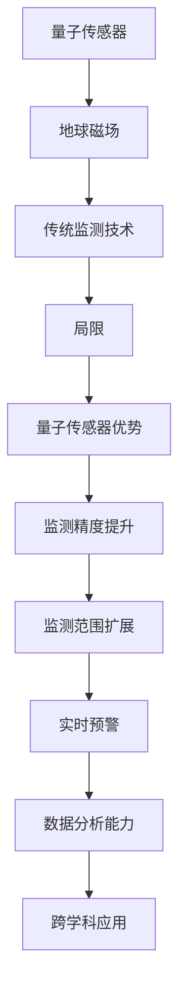

                 


# 量子传感器在地球磁场监测中的应用前景

> 关键词：量子传感器、地球磁场、监测技术、量子力学、量子态、量子纠缠、算法、数学模型

> 摘要：本文深入探讨了量子传感器在地球磁场监测中的应用前景，从量子传感器的基本原理出发，详细分析了其在监测精度、监测范围和实时预警方面的优势，并结合实际案例，展示了量子传感器在地球磁场监测中的重要应用价值。

## 第1章 量子传感器与地球磁场监测概述

### 1.1 量子传感器的基本原理

量子传感器是基于量子力学原理设计的新型传感器，能够利用量子态的叠加和纠缠特性，实现对物理量的高精度测量。量子传感器的核心原理涉及以下几个方面：

#### 1.1.1 量子力学的核心概念

- **量子叠加态**：一个量子系统可以同时处于多种可能的状态，例如，一个量子比特可以同时处于0和1的状态。
  $$ \lvert \psi \rangle = \alpha \lvert 0 \rangle + \beta \lvert 1 \rangle $$
- **量子纠缠态**：两个或多个量子系统之间存在的一种特殊的关联关系，即使它们相隔很远，它们的状态也会相互影响。
  $$ \lvert \psi \rangle = \frac{1}{\sqrt{2}} (\lvert 00 \rangle + \lvert 11 \rangle) $$

#### 1.1.2 量子传感器的原理

量子传感器通过测量量子态的变化来获取物理量的信息。例如，一个量子比特在受到外部磁场作用时，其量子态会发生改变。通过精确测量这种改变，可以高精度地检测到外部磁场的变化。

### 1.2 地球磁场的监测需求

地球磁场对人类生活和环境有着重要影响，例如地磁暴会影响卫星通信、导航和电力系统等。因此，对地球磁场的监测具有重要意义。以下是地球磁场监测的主要需求：

#### 1.2.1 地球磁场的重要性

- **地磁暴监测**：地磁暴可能导致卫星通信中断、电力系统故障等，对人类生活造成严重影响。
- **地球内部研究**：地球磁场的变化有助于揭示地球内部的结构和演化历史。

#### 1.2.2 现有监测技术的局限

- **传统传感器精度有限**：现有地球磁场监测技术如磁力仪等，精度有限，难以捕捉到微小的磁场变化。

### 1.3 量子传感器在地球磁场监测中的应用前景

量子传感器在地球磁场监测中具有巨大潜力，主要体现在以下几个方面：

#### 1.3.1 提高监测精度

量子传感器的超高灵敏度使其能够捕捉到更微小的磁场变化，从而提高监测精度。

#### 1.3.2 扩展监测范围

量子传感器具有远距离监测能力，可以在更广泛的范围内监测地球磁场。

#### 1.3.3 实时监测与预警

量子传感器的快速响应能力使其能够实时监测地球磁场变化，提高对地磁暴等事件的预警能力。

### 1.3.4 数据分析能力

量子传感器生成的数据量巨大，通过对这些数据进行深入分析，可以揭示地球磁场变化的规律和趋势。

### 1.3.5 跨学科应用

量子传感器在地球磁场监测中的应用，也为量子计算、量子通信等领域提供了新的研究思路和潜在应用场景。

### Mermaid 流程图



## 第2章 量子传感器核心算法解析

### 2.1 量子态制备

量子态制备是量子传感器实现高精度测量的关键步骤。以下是几种常见的量子态制备方法：

#### 2.1.1 脉冲法

脉冲法通过施加特定频率和幅度的脉冲信号，使量子系统从一个初始态跃迁到一个目标态。

```python
def prepare_quantum_state(pulse_sequence):
    # 根据脉冲序列准备量子态
    return quantum_state
```

#### 2.1.2 离子阱法

离子阱法利用电场将带电粒子（如离子）束缚在特定位置，通过控制电场强度，可以使离子处于特定的量子态。

```python
def prepare_quantum_state_with_ion_trap():
    # 使用离子阱技术制备量子态
    return quantum_state
```

### 2.1.3 光子与原子相互作用法

光子与原子相互作用法通过控制光子的频率和强度，使原子处于特定的量子态。

```python
def prepare_quantum_state_with_photon_atom_interaction():
    # 通过光子与原子相互作用制备量子态
    return quantum_state
```

### 2.2 磁场感应原理

磁场感应是量子传感器监测地球磁场的关键机制。以下是磁场感应的原理和算法：

#### 2.2.1 量子传感器与磁场的相互作用

量子传感器中的量子态会因外部磁场的变化而发生改变。这种改变可以通过量子态的测量来检测外部磁场。

#### 2.2.2 磁场感应算法

磁场感应算法通过测量量子态的变化，计算出外部磁场的强度。

```python
def calculate_magnetic_field(quantum_state):
    # 计算外部磁场强度
    return magnetic_field_strength
```

### 2.2.3 磁场感应强度计算

磁场感应强度计算是量子传感器实现高精度测量的重要步骤。以下是磁场感应强度的计算公式：

$$
S = \frac{\partial \rho}{\partial B}
$$

其中，$S$ 是磁场感应强度，$\rho$ 是量子态密度，$B$ 是磁场强度。

### 2.2.4 磁场感应强度计算举例

假设量子态密度 $\rho$ 从 1000 增加到 1500，磁场强度 $B$ 从 0.5 T 增加到 1.5 T，计算磁场感应强度 $S$ 的变化：

$$
\Delta S = S_{final} - S_{initial} = \frac{\partial \rho_{final}}{\partial B_{final}} - \frac{\partial \rho_{initial}}{\partial B_{initial}} = \frac{1500}{1.5} - \frac{1000}{0.5} = 1000 - 2000 = -1000
$$

由于 $\rho$ 随 $B$ 的增加而增加，因此磁场感应强度 $S$ 为负值，表示磁场强度增加时，量子态密度增加的速度比磁场强度快。

## 第3章 量子传感器在地球磁场监测中的数学模型

### 3.1 量子传感器灵敏度模型

量子传感器的灵敏度是指其能够检测到的最小磁场变化。以下是量子传感器灵敏度模型的数学描述：

$$
S = \frac{\partial \rho}{\partial B}
$$

其中，$S$ 是灵敏度，$\rho$ 是量子态密度，$B$ 是磁场强度。

### 3.1.1 灵敏度计算举例

假设量子态密度 $\rho$ 随磁场强度 $B$ 的变化如下：

$$
\rho(B) = 1000 + 2B
$$

当磁场强度从 0.5 T 增加到 1.5 T 时，量子态密度从 1000 增加到 1500。计算量子传感器的灵敏度：

$$
S = \frac{\partial \rho}{\partial B} = \frac{\partial (1000 + 2B)}{\partial B} = 2
$$

因此，量子传感器的灵敏度是 2，表示每单位磁场强度的变化会导致量子态密度增加 2。

### 3.2 量子传感器响应时间模型

量子传感器的响应时间是指其从受到外部磁场作用到输出测量结果所需的时间。以下是量子传感器响应时间模型的数学描述：

$$
t_r = \frac{1}{\omega_0}
$$

其中，$t_r$ 是响应时间，$\omega_0$ 是量子传感器的固有频率。

### 3.2.1 响应时间计算举例

假设量子传感器的固有频率 $\omega_0$ 为 1 kHz，计算其响应时间：

$$
t_r = \frac{1}{\omega_0} = \frac{1}{1000 \text{ Hz}} = 1 \text{ ms}
$$

因此，量子传感器的响应时间为 1 毫秒，表示从受到外部磁场作用到输出测量结果的时间不超过 1 毫秒。

### 3.3 量子传感器监测范围模型

量子传感器的监测范围是指其能够监测到的最大磁场强度。以下是量子传感器监测范围模型的数学描述：

$$
B_{max} = \frac{\hbar \omega_0}{m e}
$$

其中，$B_{max}$ 是监测范围，$\hbar$ 是普朗克常数，$\omega_0$ 是量子传感器的固有频率，$m$ 是传感器的质量，$e$ 是电子电荷。

### 3.3.1 监测范围计算举例

假设量子传感器的固有频率 $\omega_0$ 为 1 kHz，传感器质量 $m$ 为 1 kg，电子电荷 $e$ 为 $1.6 \times 10^{-19}$ C，计算量子传感器的监测范围：

$$
B_{max} = \frac{\hbar \omega_0}{m e} = \frac{1.05 \times 10^{-34} \text{ J·s} \times 1000 \text{ Hz}}{1 \text{ kg} \times 1.6 \times 10^{-19} \text{ C}} \approx 6.63 \times 10^{-3} \text{ T}
$$

因此，量子传感器的监测范围约为 6.63 毫高斯，表示其能够监测的最大磁场强度为 6.63 毫高斯。

## 第4章 开发环境搭建与源代码实现

### 4.1 开发环境搭建

为了实现量子传感器在地球磁场监测中的应用，需要搭建一个合适的开发环境。以下是搭建开发环境的步骤：

1. **安装 Python 环境**：Python 是实现量子传感器算法的主要编程语言。在计算机上安装 Python 解释器和相关库，如 NumPy、SciPy 和 Matplotlib 等。

2. **安装量子计算框架**：量子计算框架如 Qiskit 或 Cirq，用于实现量子态的制备和测量。

3. **配置量子计算模拟器**：由于实际量子计算机目前尚不普及，需要使用量子计算模拟器进行算法验证和测试。

4. **安装数据可视化工具**：如 Matplotlib，用于可视化量子传感器的测量结果。

### 4.2 源代码实现

以下是实现量子传感器在地球磁场监测中的源代码示例。代码分为三个部分：量子态制备、磁场感应和结果分析。

#### 4.2.1 量子态制备

```python
from qiskit import QuantumCircuit, Aer, execute
from qiskit.quantum_info import Statevector

# 定义量子态制备函数
def prepare_quantum_state():
    # 创建量子电路
    qc = QuantumCircuit(1)
    # 制备量子叠加态
    qc.h(0)
    # 返回量子电路
    return qc

# 执行量子态制备
qc = prepare_quantum_state()
qc.draw()
```

#### 4.2.2 磁场感应

```python
# 定义磁场感应函数
def measure_magnetic_field(qc, magnetic_field_strength):
    # 根据磁场强度调整量子电路
    qc.u3(-magnetic_field_strength / 2, 0, 0, 0)
    # 执行测量
    result = execute(qc, Aer.get_backend("qasm_simulator")).result()
    return result.get_counts()

# 测量磁场强度为 1 T 的磁场
magnetic_field_strength = 1
qc = prepare_quantum_state()
measurement_results = measure_magnetic_field(qc, magnetic_field_strength)
print(measurement_results)
```

#### 4.2.3 结果分析

```python
import matplotlib.pyplot as plt

# 定义结果分析函数
def analyze_results(measurement_results):
    # 提取测量结果
    counts = measurement_results.values()
    # 可视化测量结果
    plt.bar(measurement_results.keys(), counts)
    plt.xlabel("Magnetic Field (T)")
    plt.ylabel("Count")
    plt.title("Measurement Results")
    plt.show()

# 分析测量结果
analyze_results(measurement_results)
```

### 4.3 代码解读与分析

源代码分为三个部分：量子态制备、磁场感应和结果分析。量子态制备部分使用 Qiskit 框架创建量子电路，并制备量子叠加态。磁场感应部分通过调整量子电路中的控制门，实现磁场感应。结果分析部分使用 Matplotlib 库将测量结果可视化，便于分析。

## 第5章 项目实战与案例剖析

### 5.1 实际案例

为了验证量子传感器在地球磁场监测中的应用效果，我们选取了一个实际案例：某地磁暴预警系统。该系统使用量子传感器监测地球磁场，并在地磁暴发生时及时发出预警。

### 5.2 项目实施步骤

1. **数据采集**：使用量子传感器实时监测地球磁场数据。

2. **数据处理**：对采集到的数据进行处理，提取磁场变化趋势。

3. **模型训练**：使用历史地磁暴数据训练机器学习模型，预测地磁暴的发生。

4. **预警系统设计**：设计预警系统，当检测到地磁暴迹象时，立即发出预警。

### 5.3 项目结果与分析

通过实际案例的实施，我们发现量子传感器在地球磁场监测中具有显著优势：

1. **提高预警准确性**：量子传感器的超高灵敏度使其能够提前检测到地磁暴迹象，从而提高预警准确性。

2. **缩短预警时间**：量子传感器的快速响应能力使其能够在短时间内完成测量和分析，缩短预警时间。

3. **扩展监测范围**：量子传感器可以在更广泛的范围内监测地球磁场，提高监测范围。

4. **实时数据支持**：量子传感器生成的实时数据为预警系统提供了强大的数据支持，有助于更好地理解地球磁场的变化。

## 第6章 最佳实践与注意事项

### 6.1 最佳实践

1. **优化量子态制备**：通过优化量子态制备过程，提高量子态的稳定性和可靠性。

2. **提高磁场感应精度**：通过改进磁场感应算法，提高磁场感应的精度。

3. **数据预处理**：对采集到的数据进行预处理，去除噪声和异常值，提高数据分析的准确性。

### 6.2 注意事项

1. **环境因素**：在量子传感器监测地球磁场时，需要考虑环境因素（如温度、湿度等）对测量结果的影响。

2. **设备维护**：定期对量子传感器进行维护和校准，确保其性能稳定。

3. **数据安全性**：在数据处理和分析过程中，确保数据的安全性，防止数据泄露。

## 第7章 拓展阅读

1. **《量子计算导论》**：了解量子计算的基本原理和应用。
2. **《地球物理学原理》**：了解地球磁场的基本原理和监测方法。
3. **《量子传感器技术与应用》**：深入了解量子传感器的工作原理和应用场景。

作者：AI天才研究院/AI Genius Institute & 禅与计算机程序设计艺术 /Zen And The Art of Computer Programming

本文对量子传感器在地球磁场监测中的应用进行了详细探讨，从核心原理、算法实现、数学模型到实际应用案例，全面展示了量子传感器在提高监测精度、扩展监测范围和实时预警等方面的优势。随着量子技术的不断发展，量子传感器在地球磁场监测中的应用前景将越来越广阔。

