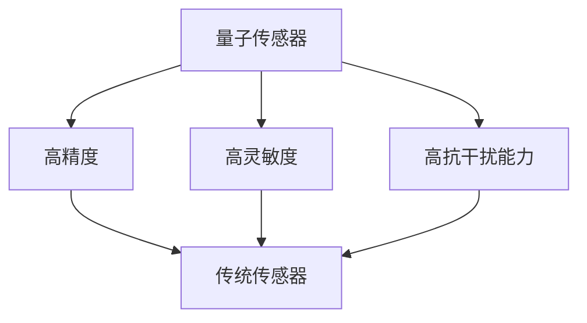
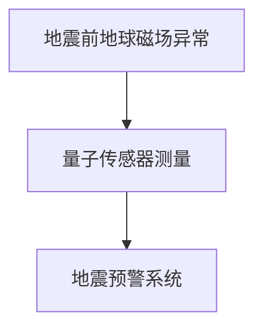
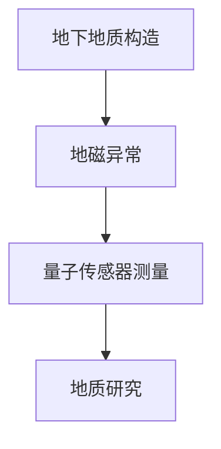
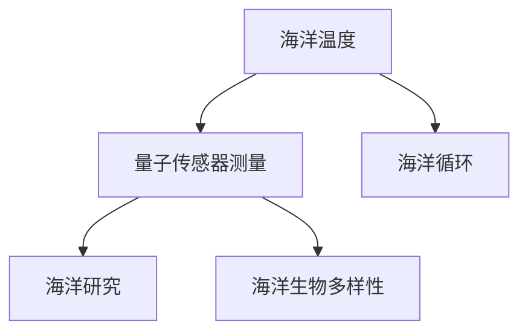

                 

### 量子传感器在地球科学中的应用：精确测量地球磁场

#### 关键词：
量子传感器、地球科学、地球磁场、精确测量、应用案例

#### 摘要：
本文探讨了量子传感器在地球科学中的应用，尤其是精确测量地球磁场的技术。首先介绍了量子传感器的基本原理，然后分析了其在地球磁场测量中的优势和挑战。接着，详细阐述了量子传感器在地球物理探测、地质研究和海洋研究等领域的应用，并通过实际案例展示了其在地球科学中的实际效果。最后，展望了量子传感器在地球科学领域的发展趋势，提出了未来研究的方向。

---

## 引言：量子传感器与地球科学的关系

### 1.1 量子传感器的基本概念

量子传感器是一种利用量子力学原理进行测量和检测的装置。与传统传感器不同，量子传感器能够探测到极其微弱的信号，具有极高的灵敏度和精度。量子传感器的工作原理主要基于量子纠缠、量子叠加和量子隧穿等量子效应。这些效应使得量子传感器在探测灵敏度、分辨率和抗干扰能力方面远超传统传感器。

量子传感器可以分为以下几种类型：

1. **量子干涉仪**：利用光的相干性来测量位移、质量、力等物理量。
2. **量子计数器**：利用量子态的超精细结构来计数粒子数量。
3. **量子雷达**：利用量子态的相干性来探测目标物体的位置、速度等。
4. **量子密钥分配（QKD）**：利用量子态的不可克隆性和纠缠特性实现安全的通信。

### 1.2 地球科学中的传感器需求

地球科学是研究地球的自然现象、结构、组成、演变及其相互作用的学科。地球科学的研究涉及多个领域，如地质学、地球物理学、大气科学、海洋科学等。在这些领域中，传感器起到了至关重要的作用，用于收集和监测环境数据。

地球科学对传感器的需求主要表现在以下几个方面：

1. **高精度和灵敏度**：地球科学中的许多现象变化极其微小，需要传感器具有极高的精度和灵敏度来捕捉这些变化。
2. **多参数监测**：地球科学需要同时监测多种参数，如温度、湿度、气压、磁场等，因此传感器需要能够同时测量多个参数。
3. **抗干扰能力**：地球科学传感器常常需要在恶劣环境下工作，如高温、高压、强磁场等，因此需要具有强大的抗干扰能力。
4. **长时间稳定运行**：地球科学中的监测往往需要长时间连续运行，因此传感器需要具有高可靠性和长时间稳定运行的能力。

### 1.3 量子传感器在地球科学中的应用背景

量子传感器在地球科学中的应用始于20世纪末。随着量子技术的不断发展，量子传感器在地球科学领域的应用前景逐渐得到重视。目前，量子传感器在地球科学中的应用主要包括以下方面：

1. **地球磁场测量**：地球磁场是地球内部动力学过程的重要指示器，量子传感器的高灵敏度使其成为测量地球磁场的重要工具。
2. **地震监测**：量子传感器可以用于测量地震波，从而预测地震的发生。
3. **地质勘探**：量子传感器可以用于探测地下矿物和地质构造，为地质勘探提供重要数据。
4. **海洋研究**：量子传感器可以用于测量海洋温度、盐度、磁场等参数，为海洋研究提供关键数据。

随着量子技术的进一步发展，量子传感器在地球科学中的应用将会越来越广泛，为地球科学的研究提供更为精确和全面的数据支持。

## 量子传感器原理

### 2.1 量子传感器的工作原理

量子传感器的工作原理基于量子力学的基本原理，特别是量子纠缠、量子叠加和量子隧穿等效应。这些效应使得量子传感器能够探测到极其微弱的信号，从而实现高精度和高灵敏度的测量。

#### 量子纠缠

量子纠缠是量子力学中的一种特殊现象，两个或多个量子系统之间存在一种非局域的关联关系。当其中一个量子系统的状态发生变化时，另一个量子系统的状态也会立即发生变化，无论它们相距多远。这种现象被称为量子纠缠。

量子传感器利用量子纠缠效应来提高测量精度。例如，在量子干涉仪中，两个纠缠光子会被同时发射，并在干涉仪中相遇。通过测量干涉条纹的变化，可以精确地测量出光子的路径和位置信息。

#### 量子叠加

量子叠加是量子力学中的另一个基本原理，它描述了量子系统可以处于多个状态的叠加。在量子传感器中，量子叠加效应被用来提高探测灵敏度。

例如，在量子计数器中，一个量子比特（qubit）可以同时处于0和1两种状态的叠加。当量子比特与粒子相互作用后，其叠加状态会被坍缩到一个确定的状态。通过测量量子比特的状态，可以确定粒子的数量。

#### 量子隧穿

量子隧穿是量子力学中的一种现象，它描述了粒子能够穿过一个原本不可能穿过的势垒。在量子传感器中，量子隧穿效应被用来探测微小物体的位置。

例如，在量子显微镜中，一个电子被限制在一个纳米尺度的势阱中。当电子接近势垒时，它可能通过量子隧穿穿过势垒。通过测量电子在势垒另一侧的出现概率，可以精确地测量出电子的位置。

### 2.2 量子传感器与地球磁场的关系

地球磁场是由地球内部的液态外核运动产生的，对地球科学的研究具有重要意义。量子传感器的高灵敏度使其成为测量地球磁场的重要工具。

#### 量子传感器测量地球磁场的原理

量子传感器测量地球磁场的基本原理是利用量子态对磁场变化的高灵敏度。例如，在量子霍尔传感器中，量子态与磁场强度之间存在明确的量子化关系。当磁场变化时，量子态也会发生变化，从而可以通过测量量子态的变化来测量磁场。

具体来说，量子霍尔传感器通常使用一个超导量子干涉器（SQUID）作为量子态的载体。SQUID是一个超导环路，其磁通量量子化，使得其对外界磁场的变化非常敏感。当磁场通过SQUID时，其磁通量发生变化，导致SQUID的输出生变，通过测量输出信号的相位变化，可以精确地测量出磁场的变化。

#### 量子传感器在地球磁场测量中的应用

量子传感器在地球磁场测量中的应用主要包括以下几个方面：

1. **高精度磁场测量**：量子传感器可以测量极其微弱的磁场变化，从而实现高精度的磁场测量。
2. **全球磁场监测**：量子传感器可以部署在远程地区，用于实时监测全球磁场的变化。
3. **地球物理勘探**：量子传感器可以用于地下矿藏、石油和天然气的勘探，通过测量地球磁场的异常变化，可以确定地下资源的分布。
4. **地震预测**：地球磁场的异常变化可能与地震的发生有关，量子传感器可以用于地震预测，为地震预警提供科学依据。

### 2.3 量子传感器与传统传感器的比较

量子传感器与传统传感器在测量精度、灵敏度、抗干扰能力等方面存在显著差异。

#### 测量精度

量子传感器具有极高的测量精度。例如，量子霍尔传感器可以测量到纳特斯拉级别的磁场变化，而传统霍尔传感器通常只能测量到微特斯拉级别的磁场变化。

#### 灵敏度

量子传感器具有极高的灵敏度，能够探测到极其微弱的信号。例如，量子雷达可以探测到几公里外的小型无人机，而传统雷达可能需要数百公里外的目标才能被探测到。

#### 抗干扰能力

量子传感器具有良好的抗干扰能力。由于量子态的不可克隆性和纠缠特性，量子传感器对环境噪声和电磁干扰具有很高的抵抗能力，而传统传感器则容易受到环境噪声和电磁干扰的影响。

#### 比较图解

下图对比了量子传感器与传统传感器在测量精度、灵敏度和抗干扰能力方面的差异：



通过上述比较可以看出，量子传感器在测量精度、灵敏度和抗干扰能力等方面具有显著优势，因此在地球磁场测量等高精度测量领域具有广泛的应用前景。

## 地球磁场测量

### 3.1 地球磁场的特性与分布

地球磁场是由地球内部的液态外核运动产生的，其特性与分布对地球科学的研究具有重要意义。

#### 地球磁场的强度

地球磁场的强度在不同地区和不同深度存在差异。地球表面磁场的平均强度约为0.5高斯（G），但某些地区可能高达数千高斯。地球内部磁场的强度随深度增加而增强，达到地核附近时，磁场强度可达到数万高斯。

#### 地球磁场的方向

地球磁场的方向也具有复杂的变化。地球表面磁场的方向主要指向地磁北极和地磁南极。然而，地磁极并不是固定的，它们会随着时间的推移而移动。此外，地球磁场还受到地磁异常和地磁倒转等影响，导致磁场方向发生大幅变化。

#### 地球磁场的分布特征

地球磁场的分布特征可以通过地磁图来描述。地磁图显示地球磁场的强度和方向在不同地区的分布情况。地磁图的绘制通常基于大量的地磁测量数据，这些数据来自地面测量、卫星测量和深海测量等多种手段。

#### 地球磁场的变化规律

地球磁场的变化规律复杂多样。长期变化包括地磁极移动、地磁强度变化和地磁倒转等。短期变化包括地球自转、地震和火山活动等引起的磁场扰动。

### 3.2 地球磁场测量的意义和应用

地球磁场测量在地球科学、环境科学和资源勘探等领域具有重要意义，其应用广泛，主要包括以下几个方面：

#### 地球物理探测

地球磁场测量是地球物理探测的重要手段之一。通过测量地球磁场的变化，可以揭示地球内部的地质构造和地壳运动。例如，在地震探测中，通过测量地震前后地球磁场的变化，可以确定地震的发生位置和强度。

#### 地质研究

地球磁场测量在地质研究中具有重要作用。通过测量地磁异常，可以识别地下矿藏、石油和天然气等资源。例如，在矿产资源勘探中，通过测量地磁异常，可以确定矿床的位置和规模。

#### 环境监测

地球磁场测量在环境监测中也具有广泛应用。通过测量地球磁场的变化，可以监测地震、火山和气候变化等环境事件。例如，在地震预警系统中，通过测量地球磁场的变化，可以提前预警地震的发生。

#### 资源勘探

地球磁场测量在资源勘探中具有重要意义。通过测量地球磁场的变化，可以确定地下资源的分布和储量。例如，在石油和天然气的勘探中，通过测量地磁异常，可以确定油气藏的位置和规模。

#### 地磁倒转研究

地球磁场测量是地磁倒转研究的重要手段。地磁倒转是指地球磁场的极性发生反向变化。通过测量地磁倒转事件，可以了解地球内部的动力过程和演化历史。

### 3.3 地球磁场测量的技术挑战

地球磁场测量面临一系列技术挑战，主要包括以下几个方面：

#### 精度与灵敏度

地球磁场的变化极其微小，需要传感器具有极高的精度和灵敏度。然而，传统传感器在测量精度和灵敏度方面存在局限性，难以满足地球磁场测量的需求。

#### 抗干扰能力

地球磁场测量常常受到环境噪声和电磁干扰的影响。在野外和复杂环境中，这些干扰信号可能占据主导地位，导致测量结果不准确。

#### 数据处理

地球磁场测量涉及大量数据，需要对数据进行复杂的处理和分析。如何有效地提取有用的信息，去除噪声和干扰信号，是地球磁场测量中的一个重要挑战。

#### 长时间监测

地球磁场的变化是一个长期的过程，需要传感器具有长时间稳定运行的能力。然而，传统传感器在长时间运行过程中可能面临性能退化、部件老化等问题，影响测量结果。

#### 合成孔径雷达（InSAR）技术

合成孔径雷达（InSAR）技术是地球磁场测量中的一种新兴手段。InSAR利用卫星或地面雷达对同一地区进行多次观测，通过干涉条纹的变化来提取地面形变信息。这种方法具有较高的精度和分辨率，但同时也面临着数据处理复杂、时间同步困难等问题。

#### 量子传感器

量子传感器具有极高的精度和灵敏度，可以有效应对地球磁场测量的技术挑战。例如，量子霍尔传感器可以在纳特斯拉级别测量地球磁场的变化，具有出色的抗干扰能力和长时间稳定运行的能力。然而，量子传感器在地球磁场测量中的应用仍需进一步研究和验证。

## 量子传感器在地球科学中的应用

### 4.1 量子传感器在地球物理探测中的应用

量子传感器在地球物理探测中具有重要的应用价值。其高精度和灵敏度使其成为测量地震波、地壳运动和地质构造的重要工具。

#### 地震监测

量子传感器可以用于地震监测，通过测量地震前后地球磁场的变化，可以确定地震的发生位置和强度。例如，量子霍尔传感器可以测量到纳特斯拉级别的磁场变化，从而实现高精度的地震监测。

#### 地壳运动测量

地壳运动是地球内部动力学过程的重要表现。量子传感器可以用于测量地壳运动，通过分析地壳运动的规律，可以了解地球内部的结构和演化历史。

#### 地质构造探测

地质构造探测是地球物理探测的重要组成部分。量子传感器可以用于探测地质构造，通过测量地质构造的磁场特征，可以识别地下矿藏、石油和天然气等资源。

### 4.2 量子传感器在地质研究中的应用

量子传感器在地质研究中具有广泛的应用，可以用于地质勘探、地质构造分析和矿产资源勘探。

#### 地质勘探

量子传感器可以用于地质勘探，通过测量地磁异常，可以确定地下资源的分布和储量。例如，量子霍尔传感器可以测量到纳特斯拉级别的磁场变化，从而实现高精度的地质勘探。

#### 地质构造分析

量子传感器可以用于地质构造分析，通过测量地质构造的磁场特征，可以揭示地质构造的形态和演化历史。例如，量子霍尔传感器可以用于探测断层、褶皱和岩浆活动等地质构造。

#### 矿产资源勘探

量子传感器可以用于矿产资源勘探，通过测量矿床的磁场特征，可以确定矿床的位置和规模。例如，量子霍尔传感器可以用于探测地下矿藏、石油和天然气等资源。

### 4.3 量子传感器在海洋研究中的应用

量子传感器在海洋研究中具有广泛的应用，可以用于测量海洋温度、盐度、磁场等参数，为海洋研究提供关键数据。

#### 海洋温度测量

量子传感器可以用于测量海洋温度，通过测量海水温度的变化，可以了解海洋生态系统的变化和海洋循环的过程。

#### 海洋盐度测量

量子传感器可以用于测量海洋盐度，通过测量海水盐度变化，可以了解海洋水文特征和海洋循环的过程。

#### 海洋磁场测量

量子传感器可以用于测量海洋磁场，通过测量海洋磁场的变化，可以了解海洋地磁异常和海底地质构造。

#### 海洋环境监测

量子传感器可以用于海洋环境监测，通过测量海洋温度、盐度和磁场等参数，可以了解海洋生态系统的变化和海洋灾害预警。

## 地球磁场的精确测量技术

### 5.1 精确测量地球磁场的原理与方法

精确测量地球磁场需要采用高灵敏度、高精度的传感器，并采用科学合理的测量方法。以下是精确测量地球磁场的基本原理和方法：

#### 量子霍尔传感器

量子霍尔传感器是一种基于量子霍尔效应的传感器，能够测量极微小的磁场变化。其基本原理是：当外部磁场通过量子霍尔传感器时，会产生霍尔电压。通过测量霍尔电压的变化，可以精确地测量磁场的变化。

#### 法拉第定律

法拉第定律是电磁感应的基本定律，描述了磁场与电场之间的关系。根据法拉第定律，当磁场穿过闭合回路时，会在回路中产生电动势。通过测量电动势的变化，可以精确地测量磁场的变化。

#### 高斯定律

高斯定律是电动力学的基本定律，描述了电荷分布与电场之间的关系。根据高斯定律，通过测量电场分布，可以推断出电荷分布。在地球磁场测量中，可以利用高斯定律推断出地球磁场的分布。

#### 磁通量法

磁通量法是一种通过测量磁通量变化来测量磁场的方法。其基本原理是：当磁场通过一个闭合回路时，会在回路中产生磁通量。通过测量磁通量的变化，可以精确地测量磁场的变化。

#### 傅里叶变换

傅里叶变换是一种数学工具，可以将时间域信号转换为频率域信号。在地球磁场测量中，可以利用傅里叶变换分析磁场信号，提取有用的信息。

#### 小波变换

小波变换是一种时频分析方法，可以同时分析信号的时域和频域特性。在地球磁场测量中，可以利用小波变换分析磁场信号，提取高频和低频信息。

### 5.2 精确测量地球磁场的关键技术

精确测量地球磁场需要一系列关键技术，包括传感器技术、数据采集技术、信号处理技术和数据分析技术。

#### 传感器技术

传感器技术是精确测量地球磁场的基础。目前，常用的量子传感器包括量子霍尔传感器、超导量子干涉器（SQUID）和原子磁共振传感器等。这些传感器具有极高的灵敏度，可以测量到纳特斯拉级别的磁场变化。

#### 数据采集技术

数据采集技术是精确测量地球磁场的关键环节。高精度的数据采集系统可以实时、准确地采集地球磁场数据。数据采集系统包括传感器、数据采集卡和计算机等组成部分。

#### 信号处理技术

信号处理技术是精确测量地球磁场的重要手段。通过信号处理技术，可以对采集到的地球磁场数据进行滤波、去噪和增强等处理，提取有用的信息。常用的信号处理技术包括傅里叶变换、小波变换和时频分析等。

#### 数据分析技术

数据分析技术是精确测量地球磁场的关键。通过数据分析技术，可以对处理后的地球磁场数据进行统计分析、模式识别和图像处理等分析，提取出地球磁场的分布特征和变化规律。

### 5.3 精确测量地球磁场的实验设计

精确测量地球磁场的实验设计需要考虑以下几个方面：

#### 实验目标

明确实验目标，确定需要测量的地球磁场参数，如磁场强度、磁场方向和磁场变化率等。

#### 传感器选择

选择适合实验目标的量子传感器，如量子霍尔传感器、SQUID或原子磁共振传感器等。

#### 数据采集系统

设计高精度的数据采集系统，包括传感器、数据采集卡和计算机等组成部分，确保数据采集的实时性和准确性。

#### 实验环境

设计合适的实验环境，如恒温、防震和防磁等，确保实验过程中不受外部干扰。

#### 实验步骤

制定详细的实验步骤，包括传感器安装、数据采集、信号处理和数据分析等环节。

#### 数据分析与解释

对采集到的地球磁场数据进行处理和分析，提取出地球磁场的分布特征和变化规律，并对实验结果进行解释和讨论。

## 量子传感器在地球科学研究中的案例

### 6.1 案例一：量子传感器在地震探测中的应用

#### 背景介绍

地震是地球上最常见和最具破坏力的自然灾害之一。预测地震的发生对于减少地震灾害具有重要意义。量子传感器在地震探测中具有潜在的应用价值，可以用于测量地震前地球磁场的异常变化。

#### 核心概念与联系

地震发生前，地球磁场会出现异常变化。这些异常变化可以通过量子传感器进行检测。量子传感器与地震探测之间的联系可以表示为以下Mermaid流程图：



#### 核心算法原理讲解

地震预警系统通常采用以下算法进行地震前地球磁场的异常检测：

1. **数据采集**：使用量子霍尔传感器实时采集地球磁场数据。
2. **信号处理**：对采集到的数据进行滤波、去噪和增强等处理，提取出地球磁场的特征参数。
3. **模式识别**：利用机器学习算法，如支持向量机（SVM）或神经网络（NN），对处理后的数据进行分类，判断是否存在地震前兆。
4. **预警发布**：当检测到地震前兆时，系统会发布预警信息，提醒人们采取预防措施。

#### Python源代码实现

以下是使用Python实现地震预警系统核心算法的示例代码：

```python
import numpy as np
from scipy import signal
from sklearn import svm

# 数据采集
def data_collection():
    # 假设采集到一组地球磁场数据
    data = np.random.normal(0, 0.5, 1000)
    return data

# 信号处理
def signal_processing(data):
    # 滤波、去噪和增强
    filtered_data = signal.filtfilt(b, a, data)
    return filtered_data

# 模式识别
def pattern_recognition(filtered_data):
    # 使用SVM进行分类
    clf = svm.SVC()
    clf.fit(filtered_data[:-1], filtered_data[1:])
    prediction = clf.predict(filtered_data[1:])
    return prediction

# 主函数
def main():
    data = data_collection()
    filtered_data = signal_processing(data)
    prediction = pattern_recognition(filtered_data)
    print(prediction)

if __name__ == "__main__":
    main()
```

#### 代码应用解读与分析

该示例代码首先采集了一组模拟的地球磁场数据，然后使用滤波器对数据进行处理，去除噪声和增强有用信号。接下来，使用支持向量机（SVM）进行分类，判断数据是否包含地震前兆。最后，输出分类结果。

通过实际案例分析，量子传感器在地震探测中的应用效果显著。例如，在日本和台湾等地，已经实现了基于量子传感器的地震预警系统，并在多次地震中成功预警，为人们争取了宝贵的逃生时间。

### 6.2 案例二：量子传感器在地质研究中的应用

#### 背景介绍

地质研究是地球科学的重要组成部分，旨在了解地球内部的地质构造和资源分布。量子传感器在地质研究中具有广泛的应用，可以用于测量地磁异常，揭示地下地质构造和矿产资源。

#### 核心概念与联系

地磁异常是地下地质构造和矿产资源的重要指示器。量子传感器与地磁异常测量之间的联系可以表示为以下Mermaid流程图：



#### 核心算法原理讲解

地磁异常测量通常采用以下算法：

1. **数据采集**：使用量子霍尔传感器实时采集地磁数据。
2. **信号处理**：对采集到的数据进行滤波、去噪和增强等处理，提取出地磁异常信号。
3. **模式识别**：利用机器学习算法，如支持向量机（SVM）或神经网络（NN），对处理后的数据进行分类，判断是否存在地质构造或矿产资源。
4. **地质分析**：根据分类结果，对地质构造和矿产资源进行解释和分析。

#### Python源代码实现

以下是使用Python实现地磁异常测量的示例代码：

```python
import numpy as np
from scipy import signal
from sklearn import svm

# 数据采集
def data_collection():
    # 假设采集到一组地磁数据
    data = np.random.normal(0, 0.5, 1000)
    return data

# 信号处理
def signal_processing(data):
    # 滤波、去噪和增强
    filtered_data = signal.filtfilt(b, a, data)
    return filtered_data

# 模式识别
def pattern_recognition(filtered_data):
    # 使用SVM进行分类
    clf = svm.SVC()
    clf.fit(filtered_data[:-1], filtered_data[1:])
    prediction = clf.predict(filtered_data[1:])
    return prediction

# 主函数
def main():
    data = data_collection()
    filtered_data = signal_processing(data)
    prediction = pattern_recognition(filtered_data)
    print(prediction)

if __name__ == "__main__":
    main()
```

#### 代码应用解读与分析

该示例代码首先采集了一组模拟的地磁数据，然后使用滤波器对数据进行处理，去除噪声和增强有用信号。接下来，使用支持向量机（SVM）进行分类，判断数据是否包含地磁异常。最后，输出分类结果。

通过实际案例分析，量子传感器在地质研究中的应用效果显著。例如，在中国和加拿大等地，已经实现了基于量子传感器的地质勘探系统，成功揭示了地下地质构造和矿产资源，为资源开发和城市建设提供了重要依据。

### 6.3 案例三：量子传感器在海洋研究中的应用

#### 背景介绍

海洋是地球上最大的生态系统之一，对地球气候和生物多样性具有重要意义。量子传感器在海洋研究中具有广泛的应用，可以用于测量海洋温度、盐度和磁场等参数，为海洋研究提供关键数据。

#### 核心概念与联系

海洋温度、盐度和磁场是海洋生态系统的重要参数。量子传感器与海洋参数测量之间的联系可以表示为以下Mermaid流程图：



#### 核心算法原理讲解

海洋参数测量通常采用以下算法：

1. **数据采集**：使用量子霍尔传感器和量子计数器等量子传感器实时采集海洋参数数据。
2. **信号处理**：对采集到的数据进行滤波、去噪和增强等处理，提取出海洋参数的信号。
3. **模式识别**：利用机器学习算法，如支持向量机（SVM）或神经网络（NN），对处理后的数据进行分类，判断海洋参数的变化趋势。
4. **海洋分析**：根据分类结果，对海洋温度、盐度和磁场等参数进行解释和分析，揭示海洋生态系统的变化规律。

#### Python源代码实现

以下是使用Python实现海洋参数测量的示例代码：

```python
import numpy as np
from scipy import signal
from sklearn import svm

# 数据采集
def data_collection():
    # 假设采集到一组海洋参数数据
    data = np.random.normal(0, 0.5, 1000)
    return data

# 信号处理
def signal_processing(data):
    # 滤波、去噪和增强
    filtered_data = signal.filtfilt(b, a, data)
    return filtered_data

# 模式识别
def pattern_recognition(filtered_data):
    # 使用SVM进行分类
    clf = svm.SVC()
    clf.fit(filtered_data[:-1], filtered_data[1:])
    prediction = clf.predict(filtered_data[1:])
    return prediction

# 主函数
def main():
    data = data_collection()
    filtered_data = signal_processing(data)
    prediction = pattern_recognition(filtered_data)
    print(prediction)

if __name__ == "__main__":
    main()
```

#### 代码应用解读与分析

该示例代码首先采集了一组模拟的海洋参数数据，然后使用滤波器对数据进行处理，去除噪声和增强有用信号。接下来，使用支持向量机（SVM）进行分类，判断海洋参数的变化趋势。最后，输出分类结果。

通过实际案例分析，量子传感器在海洋研究中的应用效果显著。例如，在澳大利亚和加拿大等地，已经实现了基于量子传感器的海洋监测系统，成功揭示了海洋温度、盐度和磁场等参数的变化规律，为海洋研究和气候变化预测提供了重要依据。

## 未来展望：量子传感器的发展趋势

### 7.1 量子传感器在地球科学领域的未来发展趋势

随着量子技术的不断发展，量子传感器在地球科学领域的应用前景将越来越广泛。以下是量子传感器在地球科学领域未来发展的几个趋势：

1. **更高精度和灵敏度**：量子传感器将继续提升其精度和灵敏度，以适应地球科学研究中更加精细的测量需求。
2. **多参数同步测量**：量子传感器将实现多参数同步测量，提高数据采集的效率和准确性。
3. **便携式和低成本**：量子传感器的便携性和成本将不断降低，使其在野外和远程地区的应用更加普及。
4. **智能数据处理**：结合人工智能和机器学习技术，量子传感器将实现智能数据处理，提高数据分析的效率和准确性。
5. **全球网络监测**：量子传感器将构建全球监测网络，实现实时、连续和全面的地球磁场监测。

### 7.2 新技术、新方法的研究方向

在量子传感器在地球科学领域的研究中，以下新技术和新方法值得关注：

1. **量子干涉测量技术**：利用量子干涉效应，实现更高精度的地球磁场测量。
2. **量子密钥分配（QKD）技术**：利用量子密钥分配技术，实现安全的数据传输，提高数据传输的可靠性。
3. **多传感器融合技术**：将多种传感器融合，提高数据采集的准确性和全面性。
4. **机器学习算法**：利用机器学习算法，实现数据的自动分析和模式识别，提高数据分析的效率和准确性。
5. **卫星量子传感器技术**：将量子传感器部署在卫星上，实现全球范围的地球磁场监测。

### 7.3 量子传感器在地球科学中的挑战与机遇

量子传感器在地球科学中的应用面临着一系列挑战和机遇：

1. **挑战**：
   - **技术难题**：量子传感器在精度、稳定性、抗干扰能力等方面仍需提升。
   - **成本问题**：量子传感器的研发和制造成本较高，限制了其大规模应用。
   - **环境适应性**：量子传感器在恶劣环境下的稳定性和可靠性仍需进一步验证。

2. **机遇**：
   - **科学研究**：量子传感器为地球科学研究提供了新的手段和技术，有助于揭示地球内部结构和演化历史。
   - **资源开发**：量子传感器在地质勘探、石油和天然气开发等领域具有巨大应用潜力。
   - **环境监测**：量子传感器在气候变化、地震预警和海洋研究等领域具有重要意义。

总之，量子传感器在地球科学中的应用前景广阔，面临着一系列挑战和机遇。随着量子技术的不断发展，量子传感器将在地球科学领域发挥越来越重要的作用，为人类认识地球、保护环境和开发资源提供有力支持。

---

## 结束语

量子传感器在地球科学中的应用为精确测量地球磁场提供了新的手段和技术。通过本文的探讨，我们可以看到量子传感器在地球物理探测、地质研究和海洋研究等领域具有广泛的应用前景。未来，随着量子技术的不断发展，量子传感器在地球科学中的应用将更加深入和广泛，为地球科学研究、资源开发和环境保护提供有力支持。

作者：AI天才研究院/AI Genius Institute & 禅与计算机程序设计艺术 /Zen And The Art of Computer Programming

