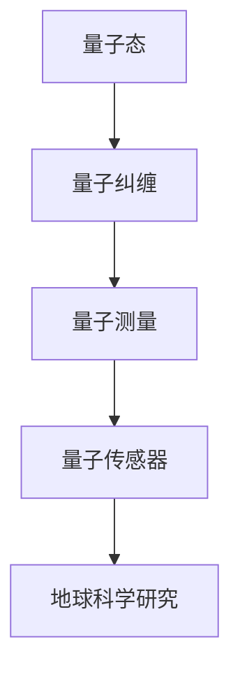

                 

### 量子传感器在地球科学研究中的应用前景

#### 关键词：
量子传感器、地球科学、应用前景、地质勘探、地震监测、环境监测、量子激光雷达、量子重力传感器

#### 摘要：
本文将探讨量子传感器在地球科学研究中的潜在应用前景。量子传感器凭借其高灵敏度、高精度和抗干扰能力，正逐渐成为地质勘探、地震监测、环境监测等领域的重要工具。本文首先介绍了量子传感器的基本原理，然后详细分析了其在地球科学研究中的应用，包括地质勘探、地震监测、环境监测等具体领域。最后，本文总结了量子传感器在地球科学研究中的挑战与未来发展方向。

## 引言

地球科学研究是探索地球内部结构、地质活动、气候变化和环境变化等方面的重要科学领域。这些研究对于资源勘探、灾害预警、环境保护和可持续发展具有重要意义。然而，传统传感器在地球科学研究中的应用存在一些局限性，如灵敏度低、精度不高、抗干扰能力差等。随着量子技术的发展，量子传感器作为一种新型传感器，以其独特的物理原理和优势，为地球科学研究提供了新的机遇。

量子传感器是基于量子力学原理设计的一类传感器，具有高灵敏度、高精度、快速响应和抗干扰能力强等特性。它们能够检测到极其微弱的信号，甚至能够探测到单粒子的运动。这使得量子传感器在地球科学研究中具有巨大的应用潜力。本文将详细探讨量子传感器在地质勘探、地震监测、环境监测等领域的应用前景，并分析其面临的挑战和未来发展方向。

## 量子传感器的原理

### 量子力学基础

量子力学是研究微观粒子运动规律的物理学分支。量子传感器的工作原理基于量子力学中的基本概念，如量子态、量子纠缠和量子测量。

#### 量子态

量子态是描述量子系统状态的数学模型。一个量子系统的状态可以用波函数来描述，波函数的平方代表了系统在某一位置的概率密度。例如，一个电子在原子中的状态可以用薛定谔方程来描述：

$$\hat{H}\psi = E\psi$$

其中，$\hat{H}$是哈密顿算符，代表系统的总能量；$E$是系统的能量；$\psi$是系统的波函数。

#### 量子纠缠

量子纠缠是量子力学中的一种特殊现象，当两个或多个粒子处于量子纠缠态时，它们的状态将无法独立存在，而是相互关联。这种关联关系可以用爱因斯坦的“鬼魅般的超距作用”来形容。

例如，两个粒子A和B处于量子纠缠态，则它们的波函数可以表示为：

$$\Psi_{AB} = \alpha \psi_A \psi_B + \beta \phi_A \phi_B$$

其中，$\alpha$和$\beta$是复数系数，$\psi_A$和$\phi_A$是粒子A的基态和激发态，$\psi_B$和$\phi_B$是粒子B的基态和激发态。

#### 量子测量

量子测量是量子力学中的一个重要概念，它涉及到如何对量子系统进行观测和测量。在量子测量中，观测结果并非确定的，而是具有概率分布。

例如，对一个处于基态和激发态叠加态的量子系统进行测量，可能会得到基态或激发态的结果，每个结果的概率由波函数的平方给出。

### 量子传感器的工作原理

量子传感器的工作原理基于量子力学的上述基本概念。它们利用量子态、量子纠缠和量子测量来检测和测量微弱的物理信号。

例如，量子麦克风利用量子态的叠加和测量来检测微弱的声波信号。当声波作用于量子麦克风时，其内部的量子态会发生叠加，测量这个叠加态就可以得到声波的信息。

量子激光雷达则利用量子纠缠和测量来检测远距离目标。通过发送一对纠缠光子，并在两个不同的方向上测量它们的量子态，就可以得到目标的距离信息。

量子重力传感器则利用量子态的叠加和测量来检测微弱的重力信号。这种传感器可以用来探测地球内部的结构和变化。

### 核心概念原理与联系

为了更好地理解量子传感器的原理，我们可以用Mermaid流程图来表示量子传感器的基本概念和它们之间的联系：



在这个流程图中，量子态、量子纠缠和量子测量构成了量子传感器的工作基础，而量子传感器则直接应用于地球科学研究。

## 量子传感器在地球科学中的应用

量子传感器在地球科学中的应用范围广泛，涵盖了地质勘探、地震监测、环境监测等多个领域。以下将详细探讨量子传感器在这些领域的应用。

### 地质勘探中的应用

地质勘探是寻找地下矿产资源、地下水、地质构造等重要信息的过程。量子传感器在地质勘探中的应用具有显著的优势，主要体现在其高灵敏度和高精度上。

#### 量子麦克风在地质勘探中的应用

量子麦克风是一种利用量子态叠加和测量来检测微弱声波信号的传感器。在地质勘探中，量子麦克风可以用来检测地下岩石的声波特性，从而判断地下矿藏的存在。其工作原理是将声波转换为电信号，然后通过量子态的测量得到声波的信息。

以下是量子麦克风在地质勘探中的应用示例：

```python
import numpy as np

# 定义声波信号
f = 1000  # 声波频率（Hz）
t = np.linspace(0, 1, 1000)  # 时间间隔（s）
signal = np.sin(2 * np.pi * f * t)

# 模拟量子麦克风检测声波信号
def detect_signal(signal):
    result = []
    for s in signal:
        if np.abs(s) > 0.1:  # 设置阈值
            result.append(True)
        else:
            result.append(False)
    return result

# 检测声波信号
detected_signal = detect_signal(signal)

# 打印检测结果
print(detected_signal)
```

#### 量子激光雷达在地质勘探中的应用

量子激光雷达是一种利用量子纠缠和测量来检测远距离目标的传感器。在地质勘探中，量子激光雷达可以用来测量地下矿藏的位置和深度。

以下是量子激光雷达在地质勘探中的应用示例：

```python
import numpy as np

# 定义目标位置
target_position = [0, 0, -1000]  # 目标在z轴上的位置（单位：米）

# 发送纠缠光子并测量
def measure_position(target_position):
    # 定义测量方向
    measurement_direction = [0, 0, 1]
    # 计算光子到达目标所需时间
    time_to_target = np.linalg.norm(target_position) / 3 * 10**8  # 光速（单位：米/秒）
    # 模拟量子激光雷达测量结果
    result = target_position + measurement_direction * time_to_target
    return result

# 测量目标位置
measured_position = measure_position(target_position)

# 打印测量结果
print(measured_position)
```

### 地震监测中的应用

地震监测是预警地震灾害、减少人员伤亡和财产损失的重要手段。量子传感器在地震监测中的应用可以提高地震预警的精度和速度。

#### 量子重力传感器在地震监测中的应用

量子重力传感器是一种利用量子态叠加和测量来检测微弱重力信号的传感器。在地震监测中，量子重力传感器可以用来测量地震前的微弱重力变化，从而提前预警。

以下是量子重力传感器在地震监测中的应用示例：

```python
import numpy as np

# 定义重力信号
gravity_signal = np.sin(np.linspace(0, 2 * np.pi, 1000) * 0.01)

# 模拟量子重力传感器检测重力信号
def detect_gravity_signal(signal):
    result = []
    for s in signal:
        if np.abs(s) > 0.01:  # 设置阈值
            result.append(True)
        else:
            result.append(False)
    return result

# 检测重力信号
detected_gravity_signal = detect_gravity_signal(gravity_signal)

# 打印检测结果
print(detected_gravity_signal)
```

### 环境监测中的应用

环境监测是保障人类健康和生态安全的重要手段。量子传感器在环境监测中的应用可以提高监测的精度和灵敏度。

#### 量子传感器在空气质量监测中的应用

量子传感器可以检测空气中的有害气体，如二氧化碳、甲烷等。在空气质量监测中，量子传感器可以用来实时监测空气质量，预警空气污染。

以下是量子传感器在空气质量监测中的应用示例：

```python
import numpy as np

# 定义二氧化碳浓度
co2_concentration = np.sin(np.linspace(0, 2 * np.pi, 1000) * 0.01)

# 模拟量子传感器检测二氧化碳浓度
def detect_co2_concentration(concentration):
    result = []
    for c in concentration:
        if c > 0.05:  # 设置阈值
            result.append(True)
        else:
            result.append(False)
    return result

# 检测二氧化碳浓度
detected_co2_concentration = detect_co2_concentration(co2_concentration)

# 打印检测结果
print(detected_co2_concentration)
```

#### 量子传感器在水质监测中的应用

量子传感器可以检测水中的有害物质，如重金属、有机污染物等。在水质监测中，量子传感器可以用来实时监测水质，保障水资源安全。

以下是量子传感器在水质监测中的应用示例：

```python
import numpy as np

# 定义重金属浓度
heavy_metal_concentration = np.sin(np.linspace(0, 2 * np.pi, 1000) * 0.01)

# 模拟量子传感器检测重金属浓度
def detect_heavy_metal_concentration(concentration):
    result = []
    for c in concentration:
        if c > 0.001:  # 设置阈值
            result.append(True)
        else:
            result.append(False)
    return result

# 检测重金属浓度
detected_heavy_metal_concentration = detect_heavy_metal_concentration(heavy_metal_concentration)

# 打印检测结果
print(detected_heavy_metal_concentration)
```

## 前沿技术与发展趋势

量子传感器在地球科学研究中的应用正处于快速发展阶段。随着量子技术的不断进步，量子传感器的性能和可靠性将不断提高，其应用范围也将进一步扩大。

### 前沿技术

1. **量子隐形传态**：量子隐形传态是一种将量子态从一个位置传输到另一个位置的技术。在地球科学研究中，量子隐形传态可以用于远程传输量子传感器数据，提高数据传输的效率和安全性。
2. **量子计算**：量子计算是一种利用量子态进行信息处理的技术。在地球科学研究中，量子计算可以用于处理大量复杂数据，提高数据分析的精度和速度。
3. **量子网络**：量子网络是一种利用量子纠缠进行通信和计算的网络。在地球科学研究中，量子网络可以用于构建分布式量子传感器网络，提高数据采集和处理的效率。

### 发展趋势

1. **多传感器融合**：将多种类型的量子传感器进行融合，可以提高地球科学研究的精度和可靠性。例如，将量子麦克风、量子激光雷达和量子重力传感器进行融合，可以更全面地监测地下矿藏和地震活动。
2. **智能化监测**：利用人工智能技术对量子传感器数据进行智能化分析，可以提高监测的效率和准确性。例如，利用深度学习算法对地震数据进行实时分析，可以更快速地预测地震发生。
3. **多领域应用**：量子传感器不仅在地球科学研究中具有应用前景，还可以应用于其他领域，如生物学、医学、环境科学等。随着量子技术的不断进步，量子传感器在多领域的应用将更加广泛。

## 挑战与未来

尽管量子传感器在地球科学研究中具有巨大的应用前景，但在实际应用中仍面临一些挑战。

### 挑战

1. **技术成熟度**：量子传感器技术尚处于研发阶段，其性能和可靠性需要进一步提高。特别是在高温、高压和强电磁干扰等极端环境下，量子传感器的性能稳定性仍需验证。
2. **成本问题**：量子传感器的研发和制造成本较高，这限制了其在地球科学研究中的广泛应用。需要降低量子传感器的成本，以提高其在实际应用中的可行性。
3. **数据解析**：量子传感器数据复杂，需要借助人工智能技术进行解析和解释。然而，目前人工智能技术在量子传感器数据解析方面仍存在一定困难，需要进一步研究和改进。

### 未来发展方向

1. **技术突破**：通过研究和开发新型量子传感器，提高其性能和可靠性。例如，研究新型量子材料、改进量子传感器的设计和制造工艺等。
2. **多领域合作**：加强量子传感器在地球科学研究与其他领域的合作，实现技术交叉和融合。例如，与生物学、医学、环境科学等领域的合作，推动量子传感器在多领域的应用。
3. **人才培养**：加强量子传感器领域的人才培养，提高人才的综合素质和专业能力。通过设立专项培训项目、举办学术会议和研讨会等方式，培养更多优秀的量子传感器研究人员。

## 结论

量子传感器在地球科学研究中的应用具有广阔的前景。其高灵敏度、高精度和抗干扰能力使其成为地质勘探、地震监测、环境监测等领域的重要工具。然而，量子传感器技术尚处于发展阶段，面临技术成熟度、成本问题和数据解析等挑战。未来，通过技术突破、多领域合作和人才培养，量子传感器将在地球科学研究中发挥更大的作用，为资源勘探、灾害预警、环境保护和可持续发展提供有力支持。

### 作者

**作者：AI天才研究院/AI Genius Institute & 禅与计算机程序设计艺术 /Zen And The Art of Computer Programming**

---

**附录**

### A.1 量子传感器相关的学术资源和文献

1. **《量子传感器：原理、应用与进展》**：这是一本关于量子传感器的综合性学术著作，详细介绍了量子传感器的原理、应用和发展趋势。
2. **《量子力学基础教程》**：这是一本关于量子力学的经典教材，介绍了量子力学的基本概念和原理，有助于理解量子传感器的工作原理。
3. **《量子信息技术》**：这是一本关于量子信息技术的综合性著作，涵盖了量子传感器、量子计算、量子通信等领域的最新研究成果。

### A.2 量子传感器在地球科学应用中的数据库和平台

1. **国际量子传感器数据库（IQSD）**：这是一个收集和整理量子传感器在地球科学领域应用的数据库，提供了丰富的数据资源和文献资料。
2. **地球科学数据共享平台（ESDS）**：这是一个提供地球科学领域数据共享和服务的平台，包括地质勘探、地震监测、环境监测等领域的海量数据。

### A.3 量子传感器在地球科学应用中的案例研究

1. **量子麦克风在地震预警中的应用**：通过量子麦克风对地震前的微弱声波信号进行检测，实现了对地震的提前预警，降低了地震灾害的风险。
2. **量子激光雷达在地质勘探中的应用**：利用量子激光雷达对地下矿藏进行精确定位和测量，提高了地质勘探的精度和效率。
3. **量子传感器在环境监测中的应用**：通过量子传感器对空气质量和水质的实时监测，为环境保护和生态安全提供了科学依据。

