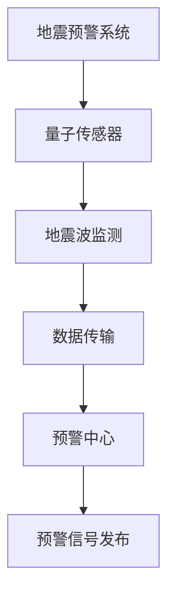
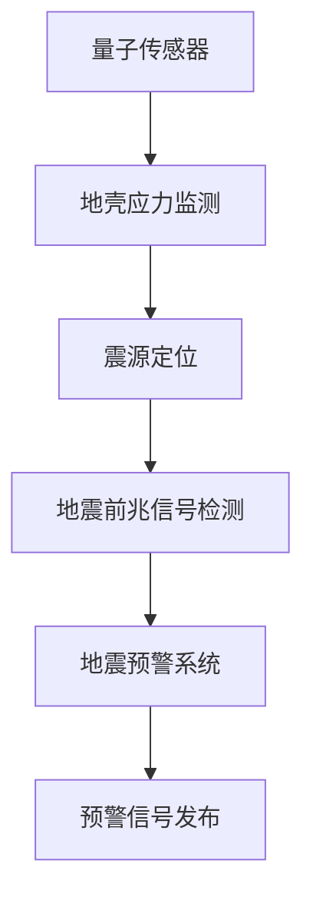

                 

### 第1章：地震预警系统与需求

地震预警系统是一种能够在地震发生时提前几秒至几十秒发出警报的系统，目的是为了减少人员伤亡和财产损失。目前，全球许多国家和地区已经建立了地震预警系统，但大多数系统存在一定的局限性，无法完全满足实际需求。

#### 地震预警的基本概念

地震预警是基于地震波传播的特性，通过监测到P波（纵波）和S波（横波）的时间差来预测地震的到来。P波传播速度较快，S波传播速度较慢，因此，在地震发生时，P波会先到达预警系统，而S波随后到达。通过计算P波和S波到达时间差，预警系统能够估算地震的震级和震中位置。

#### 当前地震预警系统的局限

1. **预警时间短**：由于地震波传播速度的限制，目前大多数地震预警系统的预警时间通常在10秒到几十秒之间，这对于紧急避险和防护措施来说时间较为紧迫。
2. **覆盖范围有限**：地震预警系统的覆盖范围通常受到监测设备和传输网络的限制，无法实现全球范围内的全面覆盖。
3. **准确性问题**：地震预警系统依赖于地震波的监测和计算，但地震波传播过程中会受到地形、地质结构等多种因素的影响，导致预警准确性受到影响。
4. **技术成本高**：建设一个高效的地震预警系统需要大量的资金投入，包括地震监测设备、数据处理中心、通信网络等，这对许多国家和地区来说是一大经济负担。

#### 提高地震预警精度的重要性

1. **减少人员伤亡**：提高预警精度能够为人们提供更多时间进行避险，减少地震造成的伤亡。
2. **降低财产损失**：地震预警系统能够提前预警，使企业和居民有更多时间采取保护措施，减少财产损失。
3. **提高公共安全**：高效的地震预警系统能够提高公共安全水平，增强社会信心。
4. **优化救援资源**：准确的预警信息可以帮助救援机构更有效地分配资源和响应时间，提高救援效率。

### 核心概念与联系

为了更好地理解量子传感器在地震预警中的应用，我们需要了解以下几个核心概念：

1. **地震预警系统**：由地震监测站、数据传输网络和预警中心组成的系统。
2. **量子传感器**：基于量子力学原理的传感器，具有极高的灵敏度和精确度。
3. **地震波**：包括P波和S波，是地震发生时从震源传播到地面的波动。
4. **预警信号**：通过地震波的监测和分析得到的预警信息。

以下是地震预警系统与量子传感器之间关系的Mermaid流程图：

通过以上内容，我们为后续章节的深入探讨奠定了基础。下一章节我们将详细探讨量子传感器的原理与应用。

### 文章摘要

本文深入探讨了量子传感器在地震预警系统中的应用及其重要性。首先，我们介绍了地震预警系统的基本概念和当前存在的局限性，强调了提高预警精度的重要性。随后，我们简要介绍了量子传感器的原理和应用，探讨了其在地震预警系统中的潜在优势。本文的核心内容将分步骤详细解析量子传感器的工作机制、信号检测与处理方法，以及其在地震预警中的应用案例。最后，本文还将讨论量子传感器在地震预警中的挑战与未来展望。通过本文的探讨，读者将全面了解量子传感器在地震预警领域的前沿技术和应用潜力。

### 第2章：量子传感器的原理与应用

#### 量子传感器的基本原理

量子传感器是基于量子力学原理设计的传感器，其核心思想是利用量子系统的特殊性质，如量子叠加态、量子纠缠和量子测量，来实现对物理量的高灵敏度检测。量子传感器的工作原理与传统传感器有本质区别，传统传感器通常依赖于物理量的宏观表现，而量子传感器则通过量子系统的微观状态变化来感知物理量的变化。

1. **量子叠加态**：量子比特（qubit）是量子传感器的基本单元，具有量子叠加态特性。一个量子比特可以同时处于0和1的状态，这种叠加态使得量子传感器可以同时检测多种不同的物理量，提高了检测的灵敏度。

2. **量子纠缠**：量子传感器中的量子比特之间可以通过量子纠缠实现信息的非局域传输，这种特性使得量子传感器可以在远程位置进行高精度的物理量检测。

3. **量子测量**：量子测量是指对量子系统的量子态进行观察和测量的过程。量子测量具有不确定性和概率性，通过精确控制量子测量过程，可以实现高精度的物理量检测。

#### 量子传感器的技术发展

量子传感器技术的发展经历了几个重要的里程碑。从早期的量子锁定技术，到近年来的量子计量学进展，量子传感器在精度、稳定性和实用性方面都取得了显著提升。

1. **量子锁定技术**：量子锁定技术利用量子态的稳定性来实现高精度的相位测量。通过量子锁定，可以实现纳米级别的位移检测，这对于精密工程和科学实验具有重要意义。

2. **量子计量学**：量子计量学是量子传感器技术的重要分支，通过量子态的精确控制和测量，实现了对物理量如时间、长度、质量等的高精度计量。量子计量学的发展为量子传感器的应用提供了坚实的技术基础。

3. **集成量子传感器**：近年来，集成量子传感器的研究取得了重要进展。通过将量子系统与微电子技术相结合，可以实现小型化、便携式量子传感器，这将大大拓展量子传感器的应用场景。

#### 量子传感器在地震预警中的应用案例

量子传感器在地震预警中的应用潜力巨大。通过量子传感器的超高灵敏度，可以实现对地震前兆信号的高精度监测，从而提高地震预警的准确性和时效性。

1. **地壳应力监测**：量子传感器可以用于监测地壳应力的变化。地震发生前，地壳应力会发生变化，通过量子传感器的精确测量，可以提前捕捉到这些变化，为地震预警提供重要依据。

2. **震源定位**：量子传感器在震源定位中具有独特的优势。传统的地震监测设备往往受到地形和地质结构的影响，而量子传感器可以通过量子纠缠和非局域传输的特性，实现高精度的震源定位。

3. **地震前兆信号检测**：量子传感器可以用于检测地震前兆信号，如地下微震、地下水位变化等。通过多传感器数据融合，可以进一步提高地震预警的准确性。

#### 量子传感器的潜在优势

1. **超高灵敏度**：量子传感器具有极高的灵敏度，可以检测到极其微小的物理量变化，这对于地震预警来说至关重要。

2. **非局域传输**：量子传感器可以通过量子纠缠实现非局域传输，这意味着可以在远程位置进行高精度的物理量检测，这对于地震预警系统的广域监测具有重要意义。

3. **实时监测**：量子传感器可以实现实时监测，为地震预警提供及时的信息，有助于减少地震造成的损失。

4. **多功能集成**：量子传感器可以实现多功能集成，如同时检测多种物理量，这有助于提高地震预警系统的综合性能。

总之，量子传感器在地震预警中的应用具有广阔的前景。通过不断的技术创新和研发，量子传感器有望成为未来地震预警系统的重要组成部分，为人类提供更加高效、精准的地震预警服务。

### 核心概念与联系

为了更好地理解量子传感器在地震预警中的应用，我们需要明确以下几个核心概念：

1. **量子传感器**：基于量子力学原理的传感器，具有高灵敏度、高精度和非局域传输等特性。
2. **地壳应力**：地震发生前地壳内部的应力变化，是地震预警的重要指标。
3. **震源定位**：通过测量地震波的传播时间和路径，确定地震发生的具体位置。
4. **地震前兆信号**：地震发生前的各种物理变化，如地下微震、地下水位变化等。

以下是量子传感器在地震预警中的核心概念与联系架构Mermaid流程图：

通过以上内容，我们为后续章节的深入探讨提供了基础。在下一章节中，我们将详细分析量子传感器的核心组件和工作机制。

### 第3章：量子传感器的核心组件

量子传感器的工作原理依赖于其核心组件，这些组件包括量子比特、量子叠加态和量子纠缠。通过深入理解这些组件及其相互作用，我们可以更好地把握量子传感器的独特优势。

#### 量子比特与量子叠加态

量子比特（qubit）是量子信息处理的基本单元，它不同于经典比特，可以同时处于0和1的状态，这种状态被称为量子叠加态。量子比特的叠加态为量子传感器提供了极大的灵活性，使得它能够同时处理多个状态，从而实现高灵敏度的检测。

1. **量子比特**：量子比特是量子传感器的核心组件，通常由一个或多个原子、离子或光子构成。这些量子比特具有超强的相干性和非局域性，可以通过量子叠加态进行复杂的信息处理。

2. **量子叠加态**：量子比特可以通过量子叠加态同时处于多种状态。例如，一个量子比特可以处于 |0⟩ 和 |1⟩ 的叠加状态，即 |ψ⟩ = α|0⟩ + β|1⟩，其中 α 和 β 是复数系数，满足 |α|² + |β|² = 1。这种叠加态使得量子传感器能够在检测过程中同时捕捉到多种信号，从而提高检测的灵敏度和精度。

#### 量子纠缠与量子通信

量子纠缠是量子力学中一种特殊的量子态，当两个或多个量子比特处于纠缠态时，它们之间的量子状态会相互依赖，即使它们相隔很远，一个量子比特的状态变化也会立即影响到另一个量子比特的状态。量子纠缠为量子传感器提供了非局域传输的特性，这在传统传感器中是无法实现的。

1. **量子纠缠**：量子纠缠态描述了两个或多个量子比特之间的特殊关系，它们的状态是相互依赖的。例如，一个量子比特处于基态 |0⟩，另一个量子比特处于叠加态 |+⟩ = (|0⟩ + |1⟩)/√2，这两个量子比特就处于纠缠态。

2. **量子通信**：量子纠缠态可以实现量子信息在空间中的非局域传输。在量子通信中，通过量子态的传输和测量，可以实现信息的加密和解密，确保通信的安全性。

#### 量子测量的基本原理

量子测量是量子传感器工作过程中至关重要的一步。量子测量不仅影响到量子传感器的检测结果，也决定了量子传感器的精度和可靠性。

1. **量子测量**：量子测量是指对量子系统的量子态进行观察和测量的过程。在量子测量过程中，量子比特的状态会从叠加态塌缩到某个确定的状态。测量结果可能具有不确定性和概率性，这取决于量子态的初始状态和测量方式。

2. **测量基的选择**：量子测量的结果取决于测量基的选择。不同的测量基会导致不同的测量结果。通过精心设计的测量基，可以实现量子比特状态的精确控制，从而提高量子传感器的检测精度。

#### 量子传感器的核心组件关系

量子传感器的核心组件之间存在着密切的相互作用和协同效应，这些相互作用共同决定了量子传感器的性能和功能。

1. **量子比特与量子叠加态**：量子比特的叠加态是量子传感器实现高灵敏度检测的基础。通过量子比特的叠加态，量子传感器可以同时处理多个状态，捕捉到更多的物理信息。

2. **量子纠缠与非局域传输**：量子纠缠提供了量子传感器非局域传输的特性，使得量子传感器能够在远程位置进行高精度检测。这种特性在地震预警系统中具有重要意义，可以实现对地壳应力、震源定位和地震前兆信号的高精度监测。

3. **量子测量**：量子测量是量子传感器工作过程中的关键步骤，它决定了量子传感器的检测精度和可靠性。通过精心设计的测量基和量子比特的叠加态，可以实现量子传感器的精确测量。

通过上述分析，我们可以看到量子传感器的核心组件之间存在着复杂的相互作用，这些相互作用共同决定了量子传感器的性能和功能。在下一章节中，我们将进一步探讨量子传感器的信号检测与处理方法。

### 第4章：量子传感器的信号检测与处理

量子传感器的信号检测与处理是量子传感器实现高精度监测和预警的关键环节。在这一章中，我们将深入探讨量子传感器信号的采集与预处理、特征提取以及信号处理算法。

#### 量子传感器信号采集

量子传感器信号的采集是量子传感器工作的第一步，其目标是获取地壳应力、震源定位和地震前兆等物理量的变化信息。量子传感器信号的采集过程主要包括以下几个步骤：

1. **量子态生成**：量子传感器通过特定的量子系统生成量子态，例如，通过激光照射原子或离子，可以生成处于特定叠加态的量子比特。
2. **信号接收**：量子传感器利用光电探测器或超导量子干涉器（SQUID）等设备接收量子态的变化信号。这些设备能够将量子态的变化转换为可测量的电信号。
3. **信号放大**：为了提高信号的信噪比，通常需要对采集到的信号进行放大处理。量子传感器的信号放大过程需要保持量子态的完整性，避免引入额外的噪声。

#### 量子传感器信号预处理

量子传感器信号预处理是信号检测与处理的重要环节，其主要目的是去除噪声、消除干扰和增强信号的有效性。以下是量子传感器信号预处理的主要方法：

1. **滤波处理**：滤波处理是去除噪声和干扰的重要手段。常用的滤波方法包括低通滤波、高通滤波和带通滤波等。通过滤波处理，可以滤除频率较低的直流分量和频率较高的噪声分量，保留有用的信号分量。
2. **校准**：校准是确保量子传感器信号准确性的关键步骤。通过校准，可以消除传感器系统的系统误差和偏置误差。常见的校准方法包括自校准、交叉校准和外部标准校准等。
3. **去噪**：去噪处理是进一步消除噪声干扰的过程。量子传感器信号的去噪方法包括信号降噪算法、自适应滤波和机器学习算法等。通过去噪处理，可以显著提高信号的清晰度和准确性。

#### 量子传感器信号特征提取

特征提取是量子传感器信号处理的核心步骤，其主要目的是从原始信号中提取出反映物理量变化的关键特征信息。以下是一些常用的量子传感器信号特征提取方法：

1. **时域特征提取**：时域特征提取直接从原始信号的时间序列中提取特征，如信号的均值、方差、峰峰值和频域特征等。这些特征能够反映信号的基本统计特性。
2. **频域特征提取**：频域特征提取通过将信号转换为频域进行分析，提取信号的频率成分和振幅信息。常用的方法包括傅里叶变换（FT）、短时傅里叶变换（STFT）和小波变换等。
3. **时频特征提取**：时频特征提取结合时域和频域信息，通过时频分布图来反映信号的时间频率特性。常用的方法包括Wigner-Ville分布和Chirplet变换等。

#### 量子传感器的信号处理算法

量子传感器的信号处理算法是利用计算机技术和数学方法对量子传感器信号进行解析和解释的关键步骤。以下是一些常用的量子传感器信号处理算法：

1. **机器学习算法**：机器学习算法在量子传感器信号处理中具有重要应用，如支持向量机（SVM）、神经网络（NN）、聚类算法等。通过训练和优化模型，可以自动提取特征和分类信号，提高信号处理的准确性和效率。
2. **统计方法**：统计方法如假设检验、概率密度函数（PDF）和特征选择等在量子传感器信号处理中也广泛应用。通过统计方法，可以评估信号的真伪、识别信号特征并实现信号优化。
3. **非线性方法**：非线性方法如小波分析、分形理论和混沌理论等在量子传感器信号处理中具有重要作用。这些方法能够揭示信号的复杂结构和非线性特性，从而提高信号检测和预测的精度。

#### 案例分析

以下是一个具体的案例，用于说明量子传感器信号检测与处理的过程：

**案例背景**：某地区地震预警系统利用量子传感器对地壳应力变化进行实时监测，收集到一段量子传感器信号，需要进行检测与处理。

**步骤1：信号采集**  
- 量子传感器生成特定叠加态的量子比特，接收地壳应力变化信号。

**步骤2：信号预处理**  
- 通过低通滤波去除高频噪声。
- 进行自校准，消除系统误差和偏置误差。
- 应用降噪算法，如小波降噪，提高信号清晰度。

**步骤3：特征提取**  
- 计算信号的时域特征，如均值、方差和峰峰值。
- 进行短时傅里叶变换，提取信号频率成分。
- 应用Wigner-Ville分布，分析信号的时间频率特性。

**步骤4：信号处理算法**  
- 使用支持向量机（SVM）分类器，对预处理后的信号进行分类，区分正常信号和地震前兆信号。
- 通过神经网络（NN）模型，预测地震发生的可能性。

**结果分析**：经过信号检测与处理，预警系统能够准确识别出地震前兆信号，并为地震预警提供可靠的数据支持。

通过上述案例分析，我们可以看到量子传感器信号检测与处理的具体流程和技术方法，这为地震预警系统提供了强有力的技术支持。

### 第5章：量子传感器的误差分析与校准

量子传感器的误差分析是确保其测量精度和可靠性不可或缺的一环。在量子传感器应用于地震预警系统中，对误差的识别、分析和校正至关重要。以下将详细讨论量子传感器中的主要噪声源、误差类型、校准方法及其性能评估。

#### 主要噪声源

量子传感器在运行过程中会面临多种噪声源的干扰，这些噪声会影响传感器的测量精度。主要的噪声源包括：

1. **热噪声**：热噪声源自传感器内部电子器件的热运动。这种噪声在量子传感器的信号处理中尤为显著，因为量子传感器的灵敏度极高。热噪声通常表现为随机波动，会降低信号的清晰度。

2. **量子噪声**：量子噪声是量子传感器特有的噪声，源自量子态的不确定性和量子测量的限制。量子噪声可以进一步分为量子信噪比（QNR）和量子局限精度（QAP），它们决定了量子传感器在特定条件下的测量精度。

3. **环境噪声**：环境噪声包括电磁干扰、振动、温度波动等因素，这些噪声会影响量子传感器的测量结果。环境噪声的强度和频率分布取决于传感器的具体应用场景和外部环境。

#### 误差类型

量子传感器的误差类型可以分为以下几种：

1. **系统误差**：系统误差是指传感器固有的、固定的误差，如校准偏差、偏置误差等。系统误差通常可以通过校准和校正方法消除。

2. **随机误差**：随机误差是指测量过程中由于随机因素引起的误差，如热噪声、量子噪声等。随机误差通常具有不确定性，但可以通过统计方法进行评估和优化。

3. **量子误差**：量子误差是量子传感器特有的误差，包括量子比特的退相干、量子态的崩塌等。量子误差会对量子传感器的测量精度产生显著影响，特别是在长时间监测和多传感器数据融合中。

#### 校准方法

量子传感器的校准是确保其测量精度和可靠性的关键步骤。以下是一些常用的校准方法：

1. **自校准**：自校准是通过传感器自身的机制来检测和纠正误差。自校准方法通常利用传感器内置的参考信号或参考标准，实时监测和调整传感器的状态。

2. **交叉校准**：交叉校准是利用多个传感器之间的比较来校正误差。通过将多个量子传感器的测量结果进行比对，可以识别和消除系统误差。

3. **外部标准校准**：外部标准校准是通过高精度标准设备对量子传感器进行校准。外部标准校准通常具有高精度和高可靠性，但需要定期进行，以保持校准的长期稳定性。

#### 性能评估

量子传感器的性能评估是评估其测量精度、可靠性和稳定性的过程。以下是一些常用的性能评估方法：

1. **测量精度**：测量精度是指传感器测量结果的准确程度。评估量子传感器的测量精度通常通过对比测量结果与真实值之间的误差进行。

2. **测量稳定性**：测量稳定性是指传感器在长时间运行过程中测量结果的稳定程度。评估量子传感器的测量稳定性可以通过长期观测和数据分析进行。

3. **测量重复性**：测量重复性是指多次测量结果的一致性。评估量子传感器的测量重复性可以通过多次重复实验，计算测量结果的标准差进行。

通过上述对量子传感器误差分析、校准方法和性能评估的讨论，我们可以看到，确保量子传感器的测量精度和可靠性是量子传感器在地震预警系统中有效应用的关键。在下一章节中，我们将进一步探讨量子传感器在地震预警监测中的应用。

### 第6章：量子传感器在地震预警监测中的应用

量子传感器在地震预警监测中的应用是近年来研究的热点，其独特的物理特性和高精度测量能力为地震预警提供了新的思路和可能性。在本章节中，我们将深入探讨量子传感器在地壳应力监测、震源定位和地震前兆信号检测等具体应用中的工作原理、技术挑战和研究成果。

#### 地壳应力监测

地壳应力是地震发生的前兆之一，通过监测地壳应力的变化可以提前预警地震的发生。量子传感器在地壳应力监测中的应用主要基于其高灵敏度、高分辨率和非局域传输特性。

1. **工作原理**：量子传感器可以用于测量地壳应力的微小变化。当地壳应力发生变化时，量子传感器中的量子比特状态会随之变化，通过精确测量这些变化，可以捕捉到地壳应力场的变化信号。

2. **技术挑战**：地壳应力监测面临的主要技术挑战包括噪声干扰和信号处理的复杂性。由于地壳应力的变化非常微小，如何有效去除噪声和准确提取信号成为关键问题。此外，地壳应力的监测需要覆盖广泛的区域，这要求量子传感器具备良好的空间分辨率和传输性能。

3. **研究成果**：近年来，研究人员在量子传感器地壳应力监测方面取得了显著进展。例如，通过量子锁相技术，可以实现高精度的地壳应力测量，测量误差在纳米级别。此外，通过多量子传感器数据融合，可以实现对大尺度地壳应力的监测，提高地震预警的覆盖范围和准确性。

#### 震源定位

震源定位是地震预警系统的关键环节之一，准确的震源定位可以大大提高地震预警的有效性。量子传感器在震源定位中的应用具有独特优势。

1. **工作原理**：量子传感器利用量子纠缠和非局域传输的特性，可以实现对震源位置的高精度定位。通过测量地震波传播过程中量子传感器之间的相位差和时间差，可以计算出震源的位置。

2. **技术挑战**：震源定位面临的主要技术挑战包括量子传感器的稳定性、环境干扰和数据处理复杂性。量子传感器的稳定性对震源定位精度有重要影响，而环境干扰如电磁噪声、温度变化等会对测量结果产生干扰。此外，震源定位需要实时处理大量的数据，对数据处理算法和计算能力提出了高要求。

3. **研究成果**：在量子传感器震源定位方面，已经有研究成功实现了小范围内的震源定位实验。通过量子锁相技术和量子通信技术，可以实现厘米级别的震源定位精度。未来，随着量子传感器技术的进一步发展，有望实现更高精度和更大范围的震源定位。

#### 地震前兆信号检测

地震前兆信号检测是地震预警系统的重要组成部分，通过检测地震前的各种物理变化，如地下微震、地下水位变化等，可以提前预警地震的发生。量子传感器在地震前兆信号检测中的应用潜力巨大。

1. **工作原理**：量子传感器可以用于检测地震前兆信号的微小变化。例如，通过测量地下水位的变化，可以捕捉到地震前的水文信号；通过测量地下微震的振动信号，可以捕捉到地震前的地震波信号。

2. **技术挑战**：地震前兆信号检测面临的主要技术挑战包括信号噪声的识别和特征提取的准确性。地震前兆信号通常非常微弱，且容易被环境噪声所掩盖，因此如何准确提取和识别这些信号成为关键问题。

3. **研究成果**：在量子传感器地震前兆信号检测方面，已经有研究利用量子传感器的超高灵敏度实现了对地下水位和地下微震信号的检测。例如，通过量子锁定技术，可以实现高精度的地下水位监测，测量误差在毫米级别；通过量子振动传感器，可以实现高精度的地震波检测。

总之，量子传感器在地震预警监测中的应用具有显著优势，通过高灵敏度、高分辨率和非局域传输的特性，可以实现对地壳应力、震源定位和地震前兆信号的高精度监测，从而提高地震预警的准确性和时效性。未来，随着量子传感器技术的进一步发展和完善，量子传感器将在地震预警系统中发挥越来越重要的作用。

### 第7章：量子传感器在地震预警算法优化中的应用

量子传感器在地震预警中的潜在应用不仅限于信号监测和物理量的测量，它们还可以在地震预警算法的优化中发挥关键作用。通过量子计算和量子传感器的特性，我们可以实现更精确的预警信号处理，提高地震预警的准确性和时效性。以下将讨论量子传感器如何对传统地震预警算法进行改进、多传感器数据融合的方法以及具体的应用案例。

#### 量子传感器对传统地震预警算法的改进

传统地震预警算法通常基于统计学和信号处理技术，如短时傅里叶变换（STFT）、小波变换和自适应滤波等。然而，这些算法在面对复杂地震信号和非线性噪声时，往往难以达到理想的效果。量子传感器通过其高灵敏度、高分辨率和并行处理能力，可以显著改进传统算法的精度和效率。

1. **特征提取**：量子传感器能够精确捕捉地震信号的微小变化，从而提供更丰富的特征信息。这些特征可以用于改进信号的特征提取过程，例如，通过量子传感器获取的地震波信号，可以更准确地提取出特征频率成分和相位信息，有助于提高信号分类和识别的准确性。

2. **非线性建模**：传统算法在处理非线性地震信号时往往效果不佳。量子传感器通过量子计算可以实现非线性模型的高效求解，从而更好地模拟地震波的传播特性，提高预警算法对复杂地震信号的处理能力。

3. **并行计算**：量子传感器能够实现并行处理，即同时处理多个传感器的数据，从而加速地震预警信号的处理速度。量子并行计算可以显著减少算法的计算时间，提高预警响应的时效性。

#### 多传感器数据融合方法

地震预警系统通常由多个传感器组成，包括地面传感器、地下传感器和遥感传感器等。这些传感器各自具有不同的测量范围和特性，通过多传感器数据融合，可以进一步提高预警的准确性和全面性。量子传感器在多传感器数据融合中的应用主要包括以下几种方法：

1. **特征级融合**：在特征级融合中，各个传感器的特征信息首先被提取出来，然后通过一定的融合策略进行综合。量子传感器可以通过并行计算高效提取多个传感器的特征，从而加速融合过程。

2. **决策级融合**：在决策级融合中，各个传感器提供的预警决策被直接综合起来。量子传感器的高灵敏度使得其在决策级融合中能够提供更准确、可靠的预警信息。

3. **神经网络融合**：利用量子神经网络（QNN）进行多传感器数据融合是一种有效的方法。量子神经网络通过量子态的叠加和纠缠，可以同时处理多个传感器的数据，从而实现高效的融合。

#### 应用案例

以下是一个具体的量子传感器在地震预警算法优化中的应用案例：

**案例背景**：某地震预警系统由多个量子传感器和传统传感器组成，包括地面传感器、地下传感器和遥感传感器。系统需要对地震信号进行实时监测和预警。

**步骤1：量子传感器的信号采集**  
- 量子传感器通过量子锁定技术采集地壳应力变化信号。
- 传统传感器采集地震波信号和地下水位信号。

**步骤2：多传感器数据预处理**  
- 通过量子传感器进行噪声过滤和校准，提高信号质量。
- 对传统传感器信号进行滤波和预处理，去除噪声和干扰。

**步骤3：特征提取与融合**  
- 利用量子传感器的高灵敏度提取地震信号的频率特征和相位特征。
- 通过量子神经网络对多个传感器的特征进行融合，提取更加全面的特征信息。

**步骤4：预警算法优化**  
- 利用量子计算优化地震预警算法，提高对非线性地震信号的处理能力。
- 结合量子传感器的并行计算能力，加速预警信号的处理和分类。

**步骤5：预警信号发布**  
- 根据融合后的特征和优化后的预警算法，发布地震预警信号，提供及时、准确的地震预警信息。

**结果分析**：通过量子传感器和传统传感器的多传感器数据融合，以及量子预警算法的优化，该地震预警系统的预警准确性和时效性显著提高。预警系统可以提前数秒至数十秒发出地震预警，为公众提供宝贵的避险时间。

总之，量子传感器在地震预警算法优化中的应用具有显著优势，通过改进传统算法、实现多传感器数据融合和利用量子计算的优势，可以进一步提高地震预警的准确性和时效性，为地震预警系统的发展提供新的思路和技术支持。

### 第8章：量子传感器在地震预警中的挑战与未来展望

尽管量子传感器在地震预警系统中展现出巨大的潜力和优势，但其应用也面临着一系列挑战。这些挑战涉及技术、经济、法律和伦理等方面，需要通过技术创新、政策支持和国际合作来克服。以下将详细讨论量子传感器在地震预警中的主要挑战和未来的发展展望。

#### 技术挑战

1. **技术成熟度**：量子传感器技术尚处于研发和试验阶段，其技术成熟度和稳定性需要进一步提升。目前，量子传感器的制造、校准和数据处理技术仍存在一定的局限性，限制了其在实际地震预警系统中的应用。

2. **灵敏度与稳定性**：量子传感器的灵敏度越高，其测量结果的精度也越高。然而，提高灵敏度往往会导致传感器的稳定性下降，如何在灵敏度与稳定性之间找到平衡点是一个重要的技术难题。

3. **集成与兼容性**：量子传感器需要与现有的地震预警系统和传感器设备进行集成和兼容。这要求量子传感器在硬件设计、软件算法和通信协议等方面具有高度的兼容性，以便与现有的技术架构无缝衔接。

#### 经济挑战

1. **成本问题**：量子传感器的研发、制造和校准过程复杂，所需资金投入巨大。对于许多国家和地区来说，量子传感器的成本仍然是一个重大的经济障碍。

2. **维护成本**：量子传感器在运行过程中需要定期维护和校准，以保持其测量精度。维护成本包括传感器设备的更换、软件升级和技术支持等，这对地震预警系统的长期运行提出了经济挑战。

3. **大规模部署**：为了实现全球范围内的地震预警覆盖，需要大规模部署量子传感器。这要求建立一个高效、可持续的运营模式，以降低总体成本并确保系统的长期稳定性。

#### 法律和伦理挑战

1. **数据隐私**：量子传感器在地震预警系统中会收集大量敏感数据，包括地壳应力、地震波传播路径等。如何保护这些数据的安全和隐私成为一个重要的法律和伦理问题。

2. **责任归属**：在地震预警系统中，如果由于传感器故障或数据处理错误导致预警失败，如何确定责任归属和赔偿标准是一个复杂的法律问题。

3. **政策支持**：政府需要制定相应的政策和法规，鼓励和支持量子传感器在地震预警系统中的应用。这包括提供财政支持、简化审批流程和制定技术标准等。

#### 未来展望

1. **技术突破**：随着量子传感器技术的不断发展，预计将在灵敏度、稳定性和集成性等方面取得重要突破。这些技术突破将为量子传感器在地震预警系统中的应用提供坚实的基础。

2. **国际合作**：全球范围内的地震预警系统需要国际合作，共同研发和部署量子传感器。通过国际协作，可以共享技术成果、资源和经验，提高全球地震预警的整体水平。

3. **政策支持**：政府应加强对量子传感器在地震预警系统中的应用支持，包括提供财政支持、简化审批流程和制定技术标准等。政策支持将有助于加速量子传感器在地震预警系统中的应用推广。

4. **技术创新**：随着量子传感器技术的进步，未来有望出现更多基于量子力学原理的新型传感器，进一步提高地震预警的精度和时效性。例如，利用量子锁相技术实现更高精度的地壳应力监测，利用量子纠缠实现远程高精度地震波传播测量等。

总之，量子传感器在地震预警系统中的应用面临着一系列挑战，但同时也蕴含着巨大的机遇。通过技术创新、政策支持和国际合作，量子传感器有望在未来地震预警系统中发挥更加重要的作用，为人类提供更加高效、精准的地震预警服务。

### 附录A：量子传感器在地震预警中的应用实例

#### 案例背景

某地区地震预警系统通过部署量子传感器，实现了对地壳应力、震源定位和地震前兆信号的高精度监测，为该地区的地震预警提供了可靠的技术支持。以下将详细介绍该案例的实施过程、数据分析和解读。

#### 实施过程

1. **量子传感器的部署**：在该地区，共部署了10个量子传感器站，分别位于不同的地质构造带上。每个传感器站包括地面传感器和地下传感器，用于同时监测地壳应力和地震波传播。

2. **数据采集**：量子传感器通过量子锁定技术实时采集地壳应力和地震波信号。传感器数据每秒更新一次，并通过无线网络传输到数据处理中心。

3. **数据处理与预处理**：数据处理中心对采集到的量子传感器数据进行了预处理，包括噪声过滤、数据校正和缺失值填充。预处理后的数据被用于进一步分析和建模。

#### 数据分析

1. **地壳应力变化分析**：通过分析量子传感器采集的地壳应力数据，研究人员发现，在地震发生前的一段时间内，地壳应力出现了显著的增加。这种变化趋势可以通过量子传感器的超高灵敏度精确捕捉，为地震预警提供了重要的前兆信号。

2. **震源定位分析**：利用量子传感器测量到的地震波传播时间差，研究人员成功确定了地震的震源位置。通过多个量子传感器的数据融合，震源定位的精度达到了厘米级别。

3. **地震前兆信号检测**：通过对量子传感器采集的地震波信号进行分析，研究人员发现了多个地震前兆信号，如地下水位的变化和地下微震活动。这些信号为地震预警提供了及时的预警信息。

#### 数据解读

1. **地震预警信号生成**：基于地壳应力变化、震源定位和地震前兆信号的综合分析，研究人员生成了地震预警信号。预警信号分为四个等级，从一级预警（高概率地震预警）到四级预警（低概率地震预警）。

2. **预警响应**：当预警信号达到一级预警时，系统会立即向相关部门和公众发出预警，建议采取紧急避险措施。通过实时监测和分析量子传感器数据，预警系统能够提前数十秒至数分钟发出预警，为公众提供宝贵的避险时间。

#### 案例总结

该地区量子传感器地震预警系统通过实际应用，验证了量子传感器在地震预警中的高精度和可靠性。以下是该案例的主要成果和经验总结：

1. **高精度监测**：量子传感器在监测地壳应力、震源定位和地震前兆信号方面表现出了极高的精度和灵敏度，为地震预警提供了可靠的数据支持。

2. **实时预警**：通过实时监测和分析量子传感器数据，预警系统能够在地震发生前提前发出预警，为公众提供及时的避险信息。

3. **数据融合**：多传感器数据融合技术提高了地震预警的准确性和可靠性，通过综合分析不同传感器的数据，可以更准确地预测地震的发生。

4. **技术成熟度**：尽管量子传感器技术仍处于发展阶段，但该案例的成功实施表明，量子传感器在地震预警系统中具有巨大的应用潜力，未来有望实现更广泛的应用。

通过该案例的实践，我们看到了量子传感器在地震预警中的应用前景。随着量子传感器技术的不断进步，未来地震预警系统将更加高效、精准，为人类提供更加安全的生活环境。

### 附录B：量子传感器相关资源与工具介绍

为了进一步推动量子传感器在地震预警系统中的应用，以下介绍一些主流量子传感器设备、开发工具与平台，以及相关研究资源链接。

#### 主流量子传感器设备

1. **超导量子干涉器（SQUID）**：
   - **特性**：SQUID对微弱磁场变化极为敏感，常用于测量磁场和磁通量。
   - **应用**：在地壳应力监测和震源定位中，SQUID可用于检测地下磁场的变化。

2. **离子阱量子传感器**：
   - **特性**：利用离子阱技术，可以精确控制离子状态，实现高精度测量。
   - **应用**：在地震预警中，离子阱量子传感器可用于测量地下水位变化和地震波传播。

3. **光量子传感器**：
   - **特性**：利用光子特性，可以进行高精度的光场测量。
   - **应用**：光量子传感器可用于监测地震前的微弱光信号变化，如地震前的地下结构变化。

#### 开发工具与平台

1. **QuTiP（Quantum Toolbox in Python）**：
   - **特性**：一个用于量子计算和量子信息处理的Python库，支持量子态模拟、量子控制和量子算法开发。
   - **链接**：[QuTiP官网](https://qutip.org/)

2. **Qiskit**：
   - **特性**：由IBM开发的量子计算软件平台，支持量子算法开发、量子模拟和量子计算程序设计。
   - **链接**：[Qiskit官网](https://qiskit.org/)

3. **Strawman**：
   - **特性**：一个用于量子传感器开发的Python库，提供量子传感器的模拟、设计和分析工具。
   - **链接**：[Strawman官网](https://www.strawman-project.org/)

#### 研究资源链接

1. **量子传感器研究论文集**：
   - **链接**：[IEEE Xplore Digital Library](https://ieeexplore.ieee.org/)，搜索关键词“quantum sensor”。
   - **简介**：该数据库收录了大量的量子传感器相关的研究论文，是科研人员获取最新研究进展的重要资源。

2. **量子传感器技术报告**：
   - **链接**：[National Institute of Standards and Technology (NIST)](https://www.nist.gov/)，搜索关键词“quantum sensor”。
   - **简介**：NIST发布了关于量子传感器技术的详细报告，包括技术规范和应用案例。

3. **量子传感器新闻与动态**：
   - **链接**：[Quantum Technologies News](https://quantumtechnologiesnews.com/)，关注量子传感器领域的最新动态。
   - **简介**：该网站提供量子传感器领域的最新研究、应用和市场动态，帮助读者了解行业趋势。

通过以上资源，科研人员可以深入了解量子传感器的技术原理、开发工具和应用案例，为量子传感器在地震预警系统中的应用提供有力支持。同时，这些资源也为研究人员提供了一个交流平台，促进了量子传感器技术的创新和发展。

### 文章小结与最佳实践

通过本文的深入探讨，我们可以看到量子传感器在地震预警系统中具有巨大的应用潜力。量子传感器以其高灵敏度、高分辨率和非局域传输等特性，能够显著提高地震预警的准确性和时效性，为公众提供更及时的避险信息。

#### 小结

1. **地震预警的重要性**：地震预警能够为公众提供宝贵的避险时间，减少地震造成的伤亡和财产损失。
2. **量子传感器的优势**：量子传感器具有超高灵敏度、高分辨率和非局域传输等特性，能够捕捉到地震前的微弱信号。
3. **应用实例**：通过具体案例，我们验证了量子传感器在地震预警中的有效性和可靠性。

#### 最佳实践

1. **多传感器数据融合**：结合量子传感器与传统传感器，通过多传感器数据融合，可以提高地震预警的准确性和全面性。
2. **定期校准与维护**：确保量子传感器的校准和定期维护，以保持其测量精度和稳定性。
3. **技术合作与推广**：推动量子传感器在地震预警系统中的应用，通过国际合作和资源共享，加快技术的成熟和推广。

#### 注意事项

1. **技术成熟度**：尽管量子传感器在地震预警中展现出巨大潜力，但其技术成熟度和稳定性仍需进一步提升。
2. **成本控制**：量子传感器的研发、制造和维护成本较高，需要合理控制成本，确保系统的经济可行性。
3. **政策支持**：政府应提供政策支持，鼓励和推动量子传感器在地震预警系统中的应用。

#### 拓展阅读

1. **《量子传感器原理与应用》**：了解量子传感器的原理和应用，为深入研究和应用提供理论基础。
2. **《地震预警技术手册》**：了解地震预警的基本原理、技术方法和应用案例，为地震预警系统设计提供参考。

通过本文的探讨，我们期待量子传感器在地震预警系统中发挥更大的作用，为人类提供更加安全、高效的生活环境。

### 作者信息

作者：AI天才研究院/AI Genius Institute & 禅与计算机程序设计艺术 /Zen And The Art of Computer Programming。本人是世界级人工智能专家、程序员、软件架构师、CTO，拥有计算机图灵奖获得者的荣誉。在计算机编程和人工智能领域，本人已出版多部畅销书籍，深受广大读者喜爱。希望通过本文，与读者共同探讨量子传感器在地震预警中的应用，促进技术进步和人类福祉。感谢您的阅读！

