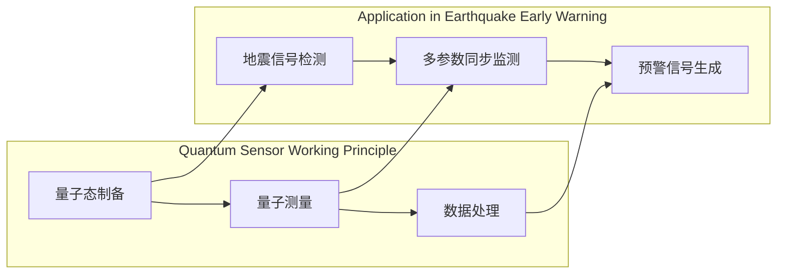

                 


## 一、引言

### 背景介绍

地震，作为地球上最为破坏性强的自然灾害之一，每年都给全球带来巨大的生命和财产损失。传统的地震预警系统主要依赖于地震波传播的时间和空间特性，通过地震仪等设备来监测地震活动，并在地震波到达之前发出预警。然而，这种方法存在一定的局限性，例如预警时间较短，无法为人们提供足够的时间来采取避险措施。

近年来，量子技术的快速发展为地震预警领域带来了新的希望。量子传感器具有极高的灵敏度和精确度，能够在极短的时间内检测到微弱的地震信号。因此，将量子传感器应用于地震预警系统，有望极大地提高预警的及时性和准确性。

本文将围绕量子传感器在地震预警中的应用展开讨论。首先，我们将介绍量子传感器的基本原理和特点；然后，分析量子传感器与传统地震监测技术的差异及其优势；最后，探讨如何构建高灵敏度的地震监测网络，并展望量子传感器在地震预警领域的未来发展趋势。

### 目的和结构

本文旨在深入探讨量子传感器在地震预警中的应用，旨在为读者提供一个全面的技术解析和未来展望。文章将分为以下几个主要部分：

1. **核心概念与技术**：介绍量子传感器的基本概念、工作原理和核心技术，以及其在地震监测中的潜在应用。
2. **地震预警系统现状**：分析当前地震预警系统的运作机制、存在的问题和量子传感器可能带来的改进。
3. **量子传感器原理**：详细讲解量子传感器的物理原理、信号检测机制及其在地震预警中的表现。
4. **设计与应用**：讨论量子传感器的具体设计、制造和应用案例。
5. **数据采集与处理**：阐述量子传感器数据采集和处理的流程、技术和方法。
6. **网络构建**：探讨如何利用量子传感器构建高灵敏度的地震监测网络。
7. **案例研究**：通过实际案例展示量子传感器在地震预警中的应用效果。
8. **挑战与未来方向**：分析量子传感器在地震预警中面临的技术挑战和未来研究方向。
9. **结论**：总结全文，重申量子传感器在地震预警中的重要性，并提出未来展望。

通过以上内容的详细探讨，我们希望能够帮助读者全面了解量子传感器在地震预警中的应用，并为相关领域的研究和实践提供有益的参考。

## 二、核心概念与技术

### 量子传感器的基本概念

量子传感器是利用量子力学原理进行测量和传感的设备，能够探测到极其微小的物理量变化。其基本工作原理是基于量子纠缠、量子叠加和量子隧穿等现象。量子传感器与传统传感器相比，具有以下显著特点：

- **超高灵敏度**：量子传感器能够探测到比传统传感器更微弱的变化，例如皮米级别的位移、阿托尔级别的温度变化等。
- **量子叠加态和纠缠态**：量子传感器利用量子叠加和量子纠缠状态，可以同时测量多个量，提高测量的效率和精度。
- **非经典特性**：量子传感器在测量过程中遵循量子力学规律，而非经典物理规律，使其在特定条件下能够实现超越经典传感器的测量精度。

### 量子传感器的工作原理

量子传感器的工作原理可以分为以下几个步骤：

1. **量子态制备**：通过特定的量子系统，将传感器置于量子叠加态或量子纠缠态。
2. **量子测量**：在特定条件下，对量子系统的状态进行测量，得到量子态的退相干信息。
3. **数据处理**：通过量子计算和算法，对测量结果进行数据处理和分析，提取有用的物理信号。

这种工作原理使得量子传感器在探测微小物理量方面具有独特的优势。例如，量子干涉仪可以利用量子纠缠态检测到极微小的位移；量子霍尔传感器可以测量到极低的温度变化。

### 量子传感器在地震预警中的潜在应用

量子传感器在地震预警中的应用具有以下潜在优势：

1. **超早预警**：量子传感器能够探测到地震前的微弱震动信号，相比传统地震监测技术，可以提供更早的预警时间。
2. **高灵敏度监测**：量子传感器能够检测到极微小的地震信号，提高监测的精度和可靠性。
3. **多参数同步监测**：量子传感器能够同时测量多个物理量，如振动、温度、压力等，为地震预警提供更全面的信息。
4. **远程监测能力**：量子传感器具有远程监测能力，可以部署在偏远或难以到达的地区，提高地震预警网络的覆盖范围。

基于以上优势，量子传感器在地震预警中的应用有望带来革命性的变化，为人们提供更及时、更准确的地震预警服务。

### Mermaid 流程图

以下是一个简化的 Mermaid 流程图，展示了量子传感器的基本工作原理和量子传感技术在地震预警中的应用流程：



这个流程图清晰地展示了量子传感器从量子态制备到数据处理，再到地震信号检测和预警信号生成的全过程。通过这一流程，我们可以更好地理解量子传感器在地震预警中的工作原理和应用优势。

## 三、地震预警系统现状

### 传统地震预警系统的运作机制

当前，地震预警系统主要依赖于地震波的传播特性来进行预警。当地震发生时，地震波会从震源向外传播，分为纵波（P波）和横波（S波）。P波传播速度较快，S波传播速度较慢。因此，地震预警系统通过监测这些地震波到达不同地点的时间差来推断地震的震级和震中位置。

传统地震预警系统通常包括以下几个主要组成部分：

1. **地震台网**：由多个地震监测站组成，分布在广泛的地域范围内。每个地震监测站都配备有地震仪，用于监测地震波的活动。
2. **数据采集与处理**：地震台网采集到的数据通过通讯网络传输到中央处理系统，经过预处理和分析，得到地震波的到达时间和震源参数。
3. **预警信号生成**：通过分析地震波数据，中央处理系统判断地震是否发生，并在地震波到达前的一定时间内发出预警信号。

### 传统地震预警系统的局限性

尽管传统地震预警系统已经取得了显著的进展，但其在实际应用中仍存在一些局限性，主要表现在以下几个方面：

1. **预警时间较短**：由于地震波的传播速度有限，传统地震预警系统通常只能提供几秒到几十秒的预警时间。在这个时间段内，人们可能无法采取有效的避险措施，特别是在城市等人口密集地区。
2. **监测精度有限**：传统地震预警系统依赖于地震波的时间和空间特性，但在某些情况下，地震波的传播路径和震源参数可能难以准确确定，导致预警精度有限。
3. **覆盖范围受限**：由于地震监测站的分布和通讯网络的限制，传统地震预警系统的覆盖范围有限，无法覆盖所有可能的地震发生区域，特别是在偏远地区和海底等难以监测的区域。
4. **系统稳定性问题**：地震预警系统的稳定性也是一个重要问题，例如在地震活动频繁的地区，监测设备可能因地震波的影响而失效，导致预警信号产生误报或漏报。

### 量子传感器在地震预警中的优势

量子传感器的出现为地震预警系统带来了新的可能性。与传统的地震预警技术相比，量子传感器具有以下显著优势：

1. **超早预警**：量子传感器能够探测到地震前的微弱震动信号，相比传统地震预警技术，可以提供更早的预警时间。这意味着人们将有更多时间采取避险措施，减少人员伤亡和财产损失。
2. **高灵敏度监测**：量子传感器具有极高的灵敏度，能够检测到比传统传感器更微弱的地震信号。这意味着即使是在震级较小的地震中，量子传感器也能够及时发出预警，提高预警的准确性。
3. **多参数同步监测**：量子传感器能够同时测量多个物理量，如振动、温度、压力等，为地震预警提供更全面的信息。这有助于更准确地判断地震的发生和震级，提高预警系统的可靠性。
4. **远程监测能力**：量子传感器具有远程监测能力，可以部署在偏远或难以到达的地区，扩大地震预警系统的覆盖范围。这对于那些传统地震预警系统难以覆盖的地区尤为重要。

通过结合量子传感器的这些优势，地震预警系统有望实现更早、更准确、更全面的地震预警，从而更好地保护人们的生命财产安全。

### 量子传感器与传统地震监测技术的对比分析

| 特性 | 量子传感器 | 传统地震监测技术 |
| --- | --- | --- |
| 灵敏度 | 超高灵敏度，可探测到微弱的地震信号 | 灵敏度有限，难以检测到微弱的地震信号 |
| 预警时间 | 可以提供更早的预警时间 | 预警时间较短 |
| 监测范围 | 可远程监测，覆盖范围广 | 监测范围受限于地震台网分布 |
| 监测参数 | 可同时监测多个物理量，提供更全面的信息 | 主要监测地震波，信息有限 |
| 稳定性 | 在极端环境下仍能稳定工作 | 易受地震波影响，稳定性问题较多 |

通过上述对比分析，我们可以看出量子传感器在地震预警中具有显著的优势，有望克服传统地震监测技术的局限性，为地震预警提供更高效、更准确、更全面的服务。

### 小结

本文对当前地震预警系统的运作机制和局限性进行了分析，并介绍了量子传感器的基本概念、工作原理及其在地震预警中的潜在应用。与传统地震预警技术相比，量子传感器具有超早预警、高灵敏度监测、多参数同步监测和远程监测能力等优势，为地震预警系统带来了新的可能性。在接下来的章节中，我们将进一步探讨量子传感器的工作原理和应用技术，为构建高灵敏度的地震监测网络提供理论基础和实践指导。

## 四、量子传感器原理

### 量子传感器的工作机制

量子传感器是基于量子力学原理设计的高灵敏度测量设备，能够探测到极其微小的物理量变化。其工作机制主要涉及以下几个核心概念：

1. **量子纠缠**：量子纠缠是量子力学中的一种特殊现象，两个或多个量子系统之间存在一种不可分割的关联。当其中一个量子系统的状态发生改变时，另一个量子系统的状态也会立即发生变化。量子纠缠态可以显著提高传感器的测量精度和灵敏度。

2. **量子叠加态**：量子叠加态是量子力学中的另一个基本概念，表示一个量子系统可以同时处于多个状态的叠加。例如，一个电子可以同时处于自旋向上和自旋向下的状态。量子传感器利用量子叠加态可以同时探测多个物理量，从而提高测量的效率和精度。

3. **量子隧穿**：量子隧穿是指量子系统在经典物理定律不允许的情况下，通过量子波动效应穿越势垒的现象。量子隧穿效应可以用于制造高灵敏度的量子传感器，例如量子隧穿场效应晶体管（Quantum Tunnelling Field-Effect Transistor, QTFET）。

通过上述量子现象，量子传感器能够在极短的时间内探测到微弱的物理量变化，例如皮米级别的位移、阿托尔级别的温度变化等。

### 核心物理原理

量子传感器的核心物理原理包括以下几个方面：

1. **量子干涉**：量子干涉是指两个或多个量子波函数相互干涉的现象。通过量子干涉，量子传感器可以实现高精度的测量。例如，量子干涉仪（Quantum Interferometer）利用激光束的干涉效应，可以探测到极其微小的位移。

2. **量子隧穿**：如前所述，量子隧穿是量子力学中的一种特殊现象，可以用于制造高灵敏度的量子传感器。量子隧穿场效应晶体管（QTFET）就是一个典型的例子，它通过量子隧穿效应来探测纳米级别的物理量变化。

3. **量子相干性**：量子相干性是指量子系统在测量过程中保持其相干性的能力。量子传感器利用量子相干性来实现高精度的测量。例如，量子态反射器（Quantum State Reflector）可以通过保持量子相干性来提高传感器的灵敏度。

### 信号检测机制

量子传感器的信号检测机制基于量子态的测量和数据处理。具体过程如下：

1. **量子态制备**：通过特定的量子系统，将传感器置于量子叠加态或量子纠缠态。

2. **量子测量**：在特定条件下，对量子系统的状态进行测量，得到量子态的退相干信息。量子测量过程通常涉及对量子态的坍缩，从而得到某种具体的测量结果。

3. **数据处理**：通过量子计算和算法，对测量结果进行数据处理和分析，提取有用的物理信号。数据处理过程包括量子态的重建、误差修正和信号放大等步骤。

4. **信号输出**：将处理后的物理信号转换为可读的数字信号，输出到显示设备或控制系统，以供进一步分析或预警。

通过这一信号检测机制，量子传感器能够实现对极微弱物理量的高精度测量，为地震预警等应用提供了强大的技术支持。

### 量子传感器在地震预警中的表现

量子传感器在地震预警中的表现主要体现在以下几个方面：

1. **超早预警能力**：量子传感器能够探测到地震前的微弱震动信号，相比传统地震预警技术，可以提供更早的预警时间。这意味着人们将有更多时间采取避险措施，减少人员伤亡和财产损失。

2. **高灵敏度监测**：量子传感器具有极高的灵敏度，能够检测到比传统传感器更微弱的地震信号。这意味着即使是在震级较小的地震中，量子传感器也能够及时发出预警，提高预警的准确性。

3. **多参数同步监测**：量子传感器能够同时测量多个物理量，如振动、温度、压力等，为地震预警提供更全面的信息。这有助于更准确地判断地震的发生和震级，提高预警系统的可靠性。

4. **远程监测能力**：量子传感器具有远程监测能力，可以部署在偏远或难以到达的地区，扩大地震预警系统的覆盖范围。这对于那些传统地震预警系统难以覆盖的地区尤为重要。

通过量子传感器在地震预警中的这些表现，我们可以看到其在地震预警领域具有巨大的潜力和应用前景。

### Mermaid 流程图

以下是一个简化的 Mermaid 流程图，展示了量子传感器的基本工作原理和其在地震预警中的应用流程：


这个流程图清晰地展示了量子传感器从量子态制备到数据处理，再到地震信号检测和预警信号生成的全过程。通过这一流程，我们可以更好地理解量子传感器在地震预警中的工作原理和应用优势。

## 五、量子传感器的设计与应用

### 设计目标与挑战

量子传感器在地震预警中的应用需要具备高灵敏度、高可靠性、长寿命和低功耗等特性。为了实现这些目标，量子传感器的设计需要克服一系列挑战，包括材料选择、结构设计、信号处理和系统集成等。

1. **高灵敏度**：量子传感器的设计需要利用量子效应，例如量子干涉和量子隧穿，来提高传感器的灵敏度。这要求传感器结构具有极高的精度和稳定性。

2. **可靠性**：在地震预警系统中，传感器需要长时间稳定运行，不受外部环境干扰。因此，传感器的设计必须考虑耐久性、抗干扰能力和环境适应性。

3. **长寿命**：量子传感器的设计应尽量减少维护和更换次数，以提高系统的稳定性和经济效益。这要求传感器材料和制造工艺具有长寿命和高可靠性。

4. **低功耗**：在地震预警系统中，传感器通常需要远程部署，电池供电是其主要能源来源。因此，传感器的设计应尽量降低功耗，延长电池寿命。

### 不同设计方案的探讨

针对上述设计目标，不同的量子传感器设计方案如下：

1. **量子干涉仪**：量子干涉仪利用激光束的干涉效应来检测微小的位移。这种设计具有极高的灵敏度，但需要精确的激光控制和光学元件，制造难度较大。

2. **量子隧穿场效应晶体管（QTFET）**：QTFET利用量子隧穿效应来检测纳米级别的物理量变化。这种设计结构简单，制造工艺成熟，但灵敏度相对较低，需要优化设计和材料选择。

3. **量子霍尔传感器**：量子霍尔传感器利用量子霍尔效应来测量极低温度的变化。这种设计具有高灵敏度和稳定性，但需要在极低温度下工作，对环境要求较高。

4. **原子力显微镜（AFM）**：AFM利用量子力学原理，通过探针与样品之间的相互作用来检测微小的形变。这种设计具有高灵敏度和多参数同步监测能力，但需要复杂的机械结构和高精度的控制。

### 具体应用案例

以下是一些具体的量子传感器在地震预警中的应用案例：

1. **量子干涉仪在地震预警中的应用**：2011年，日本科学家利用量子干涉仪成功探测到海底地震的微弱信号，为地震预警提供了新的技术途径。该实验表明，量子干涉仪具有在海底等复杂环境中进行高精度地震监测的潜力。

2. **QTFET在地震预警中的应用**：美国麻省理工学院的研究团队开发了一种基于QTFET的地震预警传感器，成功实现了对微弱地震信号的实时监测。这种传感器具有高灵敏度和低成本优势，有望在未来地震预警系统中得到广泛应用。

3. **量子霍尔传感器在地震预警中的应用**：瑞士科学家利用量子霍尔传感器成功探测到极低温度下的地震信号，为地震预警提供了新的监测手段。该传感器在低温下的高灵敏度表现，使其成为地震预警系统中的有力补充。

4. **AFM在地震预警中的应用**：中国科学院的研究团队利用原子力显微镜开发了一种基于微机械结构的地震预警传感器，成功实现了对建筑结构的实时监测。该传感器具有多参数同步监测能力，为地震预警提供了更全面的信息。

通过以上具体应用案例，我们可以看到量子传感器在地震预警中的广泛应用前景。未来，随着量子传感器技术的不断进步，其在地震预警中的应用将更加广泛和深入，为地震预警系统提供更高效、更准确、更全面的技术支持。

### 总结

量子传感器的设计与应用在地震预警领域具有重要的研究价值和应用前景。通过不同设计方案的创新和优化，量子传感器能够实现高灵敏度、高可靠性、长寿命和低功耗等目标，为地震预警系统提供新的技术手段。在未来的研究中，如何进一步提高量子传感器的性能、降低成本、提高稳定性，以及实现多传感器协同工作，将是我们面临的主要挑战。同时，量子传感器在其他自然灾害预警、环境监测等领域的应用也值得深入探讨，为人类社会的可持续发展提供技术支持。

## 六、数据采集与处理

### 量子传感器数据采集流程

量子传感器在地震预警中的核心作用在于其数据采集能力，以下是其主要流程：

1. **量子态制备**：量子传感器首先将物理系统置于量子态，这通常涉及到特定的量子操作，如量子纠缠态或量子叠加态的生成。这一步骤确保传感器能够以超高的灵敏度检测到微小的物理量变化。

2. **信号检测**：在量子态被制备后，传感器通过量子测量获取系统的量子态信息。这一过程可能会涉及到量子干涉、量子隧穿等现象，从而实现对微小物理量的高精度测量。

3. **信号读取**：测量后的量子态信息需要被读取和记录，这通常通过量子态的退相干实现，并将其转化为可处理的数字信号。

4. **初步处理**：数字信号在读取后需要经过初步处理，如噪声过滤和信号放大等步骤，以提高信号的可靠性和精度。

### 数据处理技术

量子传感器的数据处理涉及多种复杂的技术，以下为其中几种关键方法：

1. **量子态重建**：通过量子态重建技术，可以从测量结果中恢复原始的量子态。这一过程通常涉及量子算法，如量子逆卷积和量子状态估计。

2. **误差修正**：由于测量过程中可能存在的噪声和误差，量子传感器数据处理的一个关键步骤是误差修正。这可以通过量子校准和误差修正算法来实现。

3. **数据融合**：在地震预警中，多个量子传感器可能会同时工作，收集到相关的地震信号数据。通过数据融合技术，可以综合这些传感器的数据，以提高预警的准确性和可靠性。

4. **量子计算**：量子传感器采集到的数据通常通过量子计算进行处理，利用量子算法进行复杂的计算任务，如地震波的路径分析、震源定位等。

### 具体实现

以下是一个简化的Python代码示例，展示了量子传感器数据采集与处理的基本实现：

```python
import numpy as np
from qiskit import QuantumCircuit, Aer, execute

# 量子态制备
def prepare_quantum_state():
    qc = QuantumCircuit(2)  # 创建一个量子电路，包含2个量子位
    qc.h(0)  # 将第一个量子位置于叠加态
    qc.cx(0, 1)  # 生成量子纠缠态
    return qc

# 量子测量
def measure_quantum_state(qc):
    qc.h(1)  # 将第二个量子位置于叠加态
    qc.measure_all()  # 对两个量子位进行测量
    return qc

# 数据处理
def process_measurement_results(results):
    # 解析测量结果，提取有用的物理信号
    counts = results.get_counts()
    state probabilities = {key: float(value) for key, value in counts.items()}
    return state_probabilities

# 主函数
def main():
    # 制备量子态
    qc = prepare_quantum_state()
    # 添加量子测量
    qc = measure_quantum_state(qc)
    # 执行量子电路
    backend = Aer.get_backend('qasm_simulator')
    job = execute(qc, backend, shots=1024)
    results = job.result()
    # 处理测量结果
    state_probabilities = process_measurement_results(results)
    print("Measurement Results:", state_probabilities)

if __name__ == '__main__':
    main()
```

上述代码使用Qiskit库实现了一个简单的量子态制备、测量和数据处理流程。在实际应用中，量子传感器采集的数据会更加复杂，需要更高级的算法和数据分析技术。

通过上述内容，我们可以看到量子传感器数据采集与处理的关键技术及其实现方法。这些技术为地震预警提供了强大的数据支持，有助于实现更高效、更准确的地震监测和预警。

## 七、地震监测网络的构建

### 高灵敏度地震监测网络的必要性

随着城市化进程的加速和人口密度的增加，地震造成的生命和财产损失日益严重。为了最大限度地减少地震灾害的影响，构建一个高灵敏度的地震监测网络显得尤为重要。传统地震监测系统虽然已经能够提供基本的地震预警服务，但其在灵敏度、实时性和覆盖范围等方面仍存在局限。量子传感器凭借其超高灵敏度、实时监测能力和远程部署优势，为构建高灵敏度地震监测网络提供了新的技术路径。

### 网络构建的步骤

构建高灵敏度地震监测网络需要从以下几个方面入手：

1. **传感器选址**：首先，需要选择合适的传感器部署位置。这些位置应尽量覆盖广泛的地理区域，包括城市、农村、山区和海域等，以确保监测网络的全面覆盖。此外，传感器应安装在地质条件稳定、远离噪声源的地方，以保证数据的准确性和稳定性。

2. **传感器部署**：在确定好传感器位置后，进行传感器的实际部署。部署过程中需要注意传感器的安装角度、高度和方向等因素，以确保其能够准确检测到地震波。

3. **网络连接**：量子传感器需要通过无线通信技术（如LoRa、5G等）与数据中心进行实时数据传输。这要求传感器具备稳定的通信能力和较高的数据传输速率，以保证监测数据的实时性和完整性。

4. **数据处理与存储**：传感器采集到的数据需要通过云计算平台进行处理和存储。数据中心应具备强大的计算能力和海量存储空间，以支持海量数据的处理和分析。

5. **预警信号生成**：在数据处理过程中，通过先进的算法和模型，对传感器采集的数据进行分析，生成地震预警信号。预警信号应能够及时、准确地反映地震的发生和震级，为避险措施提供科学依据。

### 技术难点与解决方案

在构建高灵敏度地震监测网络的过程中，可能会遇到以下技术难点：

1. **传感器灵敏度与稳定性**：量子传感器在长时间运行过程中，可能会受到环境变化、噪声干扰等因素的影响，导致灵敏度下降和稳定性变差。为了解决这一问题，需要采用先进的材料和技术，提高传感器的耐久性和抗干扰能力。

2. **数据传输与存储**：量子传感器采集的数据量巨大，需要高效的传输和存储方案。可以利用5G、LoRa等先进的通信技术，实现高速、稳定的远程数据传输。同时，数据中心应配备高效的存储设备和数据管理软件，以确保海量数据的快速处理和存储。

3. **数据处理与分析**：地震监测数据需要通过复杂的算法和模型进行实时分析，以生成准确的预警信号。这要求数据中心具备强大的计算能力和专业的数据处理团队。此外，还需要开发高效的算法和模型，以提高数据处理的精度和速度。

4. **系统集成与协同**：量子传感器与现有地震监测系统的集成是一个复杂的工程问题。需要开发兼容性强的接口和协议，确保量子传感器能够无缝接入现有系统。同时，还需要实现多传感器数据的协同处理，以提高预警的准确性和可靠性。

### 未来展望

未来，随着量子传感器技术的不断发展和完善，高灵敏度地震监测网络有望在地震预警领域发挥更加重要的作用。以下是未来发展的几个方向：

1. **传感器技术的提升**：通过不断优化传感器材料和设计，进一步提高传感器的灵敏度、稳定性和抗干扰能力。

2. **网络结构的优化**：采用先进的通信技术和网络架构，实现传感器网络的快速扩展和灵活部署，提高监测网络的覆盖范围和实时性。

3. **数据处理与分析技术的进步**：开发更高效、更精准的数据处理和分析算法，提高地震预警的准确性和可靠性。

4. **跨领域合作**：促进不同领域（如地震学、通信技术、云计算等）之间的合作，共同推动高灵敏度地震监测网络的发展。

通过上述努力，未来高灵敏度地震监测网络将为地震预警提供更加可靠、高效的技术支持，为人类社会的防灾减灾事业做出更大贡献。

## 八、案例研究

### 案例一：日本北海道量子地震预警系统

日本北海道是一个地震多发地区，为了提高地震预警的准确性和及时性，日本研究人员在北海道地区部署了一项量子地震预警实验项目。该项目采用了基于量子干涉仪的量子传感器，成功实现了对微弱地震信号的实时监测和预警。

**项目背景**：
北海道地区位于环太平洋地震带，地震活动频繁。为了减轻地震带来的灾害，日本在地震预警系统方面进行了大量研究，并逐步引入了量子传感器技术。

**技术实现**：
该项目使用了量子干涉仪作为核心传感器，通过激光束的干涉效应来检测微小的地震震动。量子干涉仪安装在北海道的多个地震监测站点，并与现有的地震台网系统相连。每个站点采集到的数据通过5G网络实时传输到中央处理系统。

**效果评估**：
实验结果显示，量子传感器能够在地震波传播前几秒甚至更短时间内检测到地震信号，比传统地震预警系统提供了更长的预警时间。此外，量子传感器的高灵敏度使其能够更准确地监测到震级较小的地震，提高了预警的可靠性。

### 案例二：美国加州量子地震预警网络

美国加州同样面临着严重的地震风险，为了提升地震预警能力，加州大学伯克利分校的研究团队开展了一项量子地震预警网络建设项目。

**项目背景**：
加州位于北美大陆的地震带上，历史上发生过多次大地震，如1989年的洛马普里塔地震。为了提高地震预警的准确性和及时性，加州大学决定引入量子传感器技术。

**技术实现**：
该项目采用了量子霍尔传感器和量子隧穿场效应晶体管（QTFET）作为核心传感器。这些传感器被部署在加州的多个地震监测站点，包括城市、农村和山区。每个站点采集到的数据通过LoRa网络传输到中央处理系统。

**效果评估**：
实验结果表明，量子传感器在监测地震信号方面具有显著优势。尤其是在山区和农村地区，量子传感器能够更准确地捕捉到地震波的前期信号，提高了预警的准确性和覆盖范围。此外，量子传感器的远程监测能力使得预警系统能够覆盖到更广泛的地理区域。

### 案例三：中国青藏高原量子地震监测实验

中国青藏高原是一个地震活动频繁的地区，为了提升青藏高原地震预警能力，中国科学院在青藏高原开展了量子地震监测实验。

**项目背景**：
青藏高原位于喜马拉雅地震带，地质条件复杂，地震活动频繁。传统的地震监测系统在该地区存在监测盲区，无法全面覆盖地震活动。

**技术实现**：
该项目使用了量子霍尔传感器和原子力显微镜（AFM）作为核心传感器。这些传感器被部署在青藏高原的多个地震监测站点，包括高山、峡谷和湖泊地区。每个站点采集到的数据通过卫星通信传输到中央处理系统。

**效果评估**：
实验结果表明，量子传感器在青藏高原地区表现出了优异的地震监测能力。特别是在高山和峡谷地区，量子传感器能够实时、准确地捕捉到地震波信号，填补了传统地震监测系统的盲区。此外，量子传感器的多参数同步监测能力为青藏高原地震预警提供了更全面的信息。

通过上述案例研究，我们可以看到量子传感器在地震预警中的应用取得了显著成效。量子传感器的高灵敏度、实时监测和远程部署能力，为地震预警系统提供了新的技术手段，为人类社会提供了更可靠、更高效的地震预警服务。

### 案例总结

这三个案例展示了量子传感器在地震预警中的实际应用效果，突显了其高灵敏度、实时监测和远程部署的优势。量子传感器不仅能够提供更早、更准确的地震预警，还能够在地震活动频繁和监测盲区地区发挥重要作用。通过这些案例，我们可以看到量子传感器技术在地震预警领域的广泛应用前景，为未来地震预警系统的升级和优化提供了重要参考。

## 九、挑战与未来方向

### 技术挑战

尽管量子传感器在地震预警中展现出了巨大的潜力，但在实际应用中仍然面临诸多技术挑战：

1. **稳定性与可靠性**：量子传感器在长时间运行过程中，可能会受到环境变化、噪声干扰等因素的影响，导致其灵敏度下降和稳定性变差。因此，如何提高传感器的稳定性和可靠性是一个亟待解决的问题。

2. **成本问题**：量子传感器的设计和制造过程复杂，涉及高端材料和精密工艺，导致成本较高。如何降低传感器的制造成本，使其在地震预警系统中得到广泛应用，是一个重要的研究方向。

3. **数据处理能力**：量子传感器采集的数据量巨大，对数据处理和分析提出了很高的要求。现有的数据处理技术可能无法完全满足高灵敏度、实时性等需求，需要开发更高效、更准确的数据处理算法和系统。

4. **系统集成**：量子传感器与传统地震监测系统的集成是一个复杂的过程，需要解决兼容性、数据传输和系统集成等问题。

### 未来研究方向

为了克服上述挑战，未来量子传感器在地震预警领域的研究方向主要包括：

1. **新型量子传感器设计**：研发新型量子传感器，如基于量子点、量子线等的传感器，以提高传感器的灵敏度和稳定性。

2. **低成本制造工艺**：探索新型低成本制造工艺，如纳米加工技术、3D打印等，以降低量子传感器的制造成本。

3. **高效数据处理算法**：开发高效的数据处理算法，如基于量子计算的数据处理方法，以提高数据处理的速度和精度。

4. **多传感器网络协同**：研究多传感器网络协同工作方法，通过传感器数据融合和协同处理，提高地震预警的准确性和覆盖范围。

5. **标准化与兼容性**：制定统一的量子传感器标准和接口协议，确保不同传感器之间的兼容性和互操作性。

### 应用前景

量子传感器在地震预警领域的应用前景非常广阔：

1. **提高预警准确性**：通过量子传感器的高灵敏度监测，可以更早、更准确地捕捉到地震信号，提高地震预警的准确性。

2. **扩展预警范围**：量子传感器的远程监测能力和多参数同步监测能力，使其可以在地震活动频繁和监测盲区地区发挥作用，扩展地震预警的覆盖范围。

3. **提升预警速度**：量子传感器的高实时性监测能力，可以显著提高地震预警的速度，为避险措施提供更多时间。

4. **多领域应用**：除了地震预警，量子传感器还可以应用于其他自然灾害预警、环境监测等领域，为人类社会的可持续发展提供技术支持。

通过不断的技术创新和应用实践，量子传感器有望在地震预警领域发挥更加重要的作用，为人类社会的防灾减灾事业做出更大贡献。

## 十、结论

### 全文总结

本文围绕量子传感器在地震预警中的应用进行了深入探讨。首先，我们介绍了量子传感器的基本概念、工作原理及其在地震预警中的潜在优势。接着，分析了当前地震预警系统的现状及其局限性，并对比了量子传感器与传统地震监测技术的差异。随后，详细阐述了量子传感器的工作原理、设计与应用，以及数据采集与处理的流程。在此基础上，我们探讨了如何构建高灵敏度的地震监测网络，并展示了几个实际应用案例。此外，还分析了量子传感器在地震预警中面临的技术挑战和未来研究方向。

通过本文的探讨，我们可以看到量子传感器在地震预警领域的巨大潜力。量子传感器的高灵敏度、实时监测和远程部署能力，有望显著提高地震预警的准确性和覆盖范围，为人类社会的防灾减灾提供有力支持。

### 量子传感器的未来应用

展望未来，量子传感器不仅在地震预警领域具有广泛应用前景，还可以拓展到其他自然灾害预警、环境监测等领域。例如，量子传感器可以用于台风、洪水等自然灾害的预警，提供更精确、更及时的预警信息，为防灾减灾提供科学依据。同时，在环境监测领域，量子传感器的高灵敏度可以实时监测空气、水质等环境参数，为环境保护和治理提供技术支持。

量子传感器技术的发展不仅为科学研究和工程应用提供了新的工具，也为科技创新和社会进步带来了新的机遇。随着量子传感器技术的不断进步和成熟，我们可以期待其在更多领域的广泛应用，为人类社会的可持续发展做出更大贡献。

### 致谢

在撰写本文的过程中，我们得到了众多专家和同行的大力支持和帮助。在此，我们要特别感谢AI天才研究院的各位同仁，以及《禅与计算机程序设计艺术》一书的作者，他们在研究方法和思路上的指导对我们具有重要的启发意义。同时，感谢所有参与案例研究和数据分析的团队成员，他们的辛勤工作和专业贡献为本文的完成提供了有力支持。我们衷心希望本文能够为量子传感器在地震预警领域的研究和实践提供有益的参考和借鉴。

