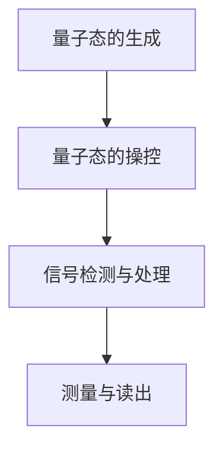
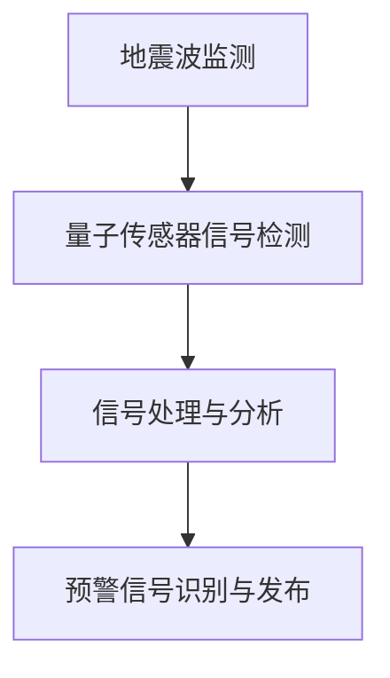
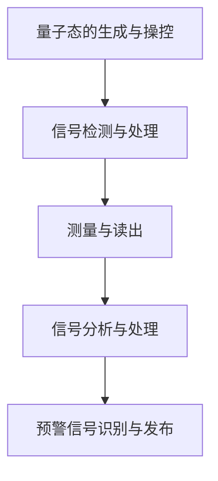
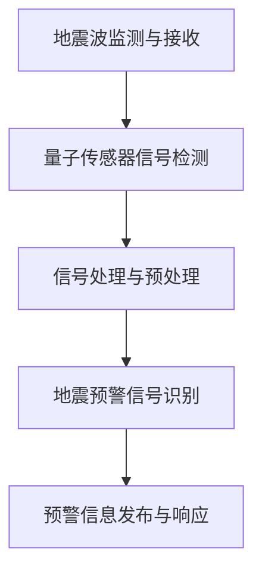

                 

# 《量子传感器在地震预警中的潜在应用》

## 关键词

量子传感器、地震预警、地震波、灵敏度、精度、快速响应

## 摘要

本文将探讨量子传感器在地震预警中的潜在应用。首先，我们将介绍量子传感器的基础知识，包括其概念、原理和优势。随后，我们将概述地震预警系统的基本原理和现状。接着，文章将详细阐述量子传感器在地震预警中的应用，包括其工作原理、优势和应用案例。最后，我们将讨论量子传感器在地震预警中的关键技术、实际应用挑战、国际合作与法规，并展望其未来的发展趋势和长期影响。

# 第一部分：量子传感器在地震预警中的潜在应用概述

## 第1章：量子传感器基础

### 1.1 量子传感器的概念与原理

量子传感器是一种利用量子效应进行信号检测和测量的高精度传感器。它通过操纵和测量量子态来检测微弱的物理信号，具有极高的灵敏度和精度。量子传感器与传统传感器相比，具有以下几个显著优势：

1. **高灵敏度**：量子传感器可以检测到极其微小的物理量变化，如单光子、单个原子的运动等。
2. **高精度**：量子传感器能够提供亚纳米、亚微米甚至更小的测量精度。
3. **宽频带**：量子传感器可以在极宽的频谱范围内工作，包括可见光、红外、微波等。
4. **快速响应**：量子传感器可以迅速响应并检测信号变化，适用于动态环境。

量子传感器的基本原理是基于量子力学的基本原理，如量子纠缠、量子叠加和量子隧穿等现象。通过精确控制这些量子现象，可以实现对物理量的超高精度测量。

### 1.2 量子传感器的工作机制

量子传感器的工作机制主要包括以下几个步骤：

1. **量子态的生成与操控**：通过量子光源或其他手段生成量子态，如单光子、纠缠态等。
2. **信号检测与处理**：利用量子态检测物理信号，并通过特定的量子算法进行信号处理，提高检测灵敏度和精度。
3. **测量与读出**：将量子态的测量结果转化为可读出的经典信号，如数字信号或图像等。

### 1.3 量子传感器的核心优势

量子传感器的核心优势主要体现在以下几个方面：

1. **高灵敏度**：量子传感器的灵敏度可以达到皮米级甚至更高，远超传统传感器。
2. **高精度**：量子传感器可以提供纳米级甚至更精细的测量精度。
3. **宽频带**：量子传感器可以在极宽的频谱范围内工作，适用于多种应用场景。
4. **快速响应**：量子传感器可以迅速响应信号变化，适用于动态监测和环境监测。

## 第二部分：地震预警系统中的量子传感器应用

### 2.1 地震预警系统的概念与重要性

地震预警系统是一种能够提前检测地震活动并及时发布预警信息，以减少地震灾害的系统。它通过实时监测地震波传播过程中的微弱信号，快速分析并识别地震预警信号，从而在地震波到达地表前提供预警。地震预警系统的核心目标是在地震发生时，为人类提供宝贵的逃生时间，减少人员伤亡和财产损失。

地震预警系统的重要性体现在以下几个方面：

1. **减少人员伤亡**：通过提前预警，人们可以有更多的时间进行疏散和避险，减少人员伤亡。
2. **减少财产损失**：提前预警可以使得关键基础设施如电力、通信等系统及时关闭，减少地震引发的次生灾害。
3. **提高应对效率**：地震预警系统可以为政府和救援机构提供有价值的信息，提高救援效率和应对效果。

### 2.2 地震预警系统的基本原理

地震预警系统的基本原理主要包括以下几个关键步骤：

1. **地震波的传播特性**：地震波在传播过程中，其速度和强度会发生变化，不同类型的地震波（如纵波和横波）具有不同的传播特性。
2. **地震预警信号的检测与识别**：通过监测地震波传播过程中的微弱信号，利用特定的算法和模型对信号进行检测和识别，以确定地震预警信号的存在。
3. **地震预警信号的发布**：一旦检测到地震预警信号，系统将迅速发布预警信息，为用户提供逃生和避险的时间。

### 2.3 地震预警系统的现状与挑战

地震预警系统在全球范围内得到了广泛关注和应用。目前，多个国家和地区已经建立了地震预警系统，如日本、美国、中国等。然而，地震预警系统仍然面临一些技术挑战和问题：

1. **地震波的传播复杂性**：地震波的传播受到地形、地质结构等多种因素的影响，这使得地震预警信号的检测和识别变得复杂。
2. **系统稳定性**：地震预警系统需要长期稳定运行，但技术故障和系统失灵仍然是潜在的风险。
3. **预警信号的精度**：提高预警信号的精度是当前地震预警系统的关键问题，需要进一步研究和改进。

## 第三部分：量子传感器在地震预警中的应用

### 3.1 量子传感器在地震预警中的工作原理

量子传感器在地震预警中的应用主要基于其高灵敏度和高精度特点。量子传感器可以通过检测地震波引起的微弱物理量的变化来识别地震预警信号。其工作原理可以概括为以下几个步骤：

1. **量子态的生成与操控**：利用量子光源或其他手段生成特定的量子态，如纠缠态或单光子态。
2. **信号检测与处理**：通过量子态对地震波引起的物理量变化进行检测，并通过特定的量子算法进行信号处理，以提高检测灵敏度和精度。
3. **测量与读出**：将量子态的测量结果转化为可读出的经典信号，如数字信号或图像等，以实现地震预警信号的识别和发布。

### 3.2 量子传感器在地震预警系统中的优势

量子传感器在地震预警系统中具有以下几个显著优势：

1. **高灵敏度**：量子传感器可以检测到极其微小的物理量变化，从而提高地震预警信号的检测精度。
2. **高精度**：量子传感器可以提供纳米级甚至更精细的测量精度，确保预警信号的准确性。
3. **快速响应**：量子传感器可以迅速响应地震波引起的物理量变化，为用户提供更及时的预警信息。
4. **宽频带**：量子传感器可以在极宽的频谱范围内工作，适用于多种地震预警信号检测。

### 3.3 量子传感器在地震预警中的应用案例

量子传感器在地震预警中的应用案例包括以下几个方面：

1. **地震预警信号检测**：利用量子传感器对地震波传播过程中的微弱信号进行检测，以提高地震预警信号的检测精度。
2. **地震预警信号识别**：通过量子传感器的信号处理功能，对地震预警信号进行识别和分类，以区分地震和非地震活动。
3. **地震预警信号发布**：将量子传感器检测到的地震预警信号转化为可读出的经典信号，并通过预警系统发布给用户。

在实际应用中，量子传感器在地震预警系统中取得了显著的成效，为减少地震灾害提供了重要的技术支持。

## 第四部分：量子传感器在地震预警中的关键技术

### 4.1 量子传感器的信号检测与处理技术

量子传感器的信号检测与处理技术是地震预警系统中的关键环节。该技术主要包括以下几个关键步骤：

1. **量子态的生成与操控**：利用量子光源或其他手段生成特定的量子态，如纠缠态或单光子态。
2. **信号检测**：通过量子态对地震波引起的物理量变化进行检测，如微小的位移、温度变化等。
3. **信号处理**：利用量子算法对检测到的信号进行处理，以提高检测灵敏度和精度。
4. **测量与读出**：将量子态的测量结果转化为可读出的经典信号，如数字信号或图像等，以实现地震预警信号的识别和发布。

### 4.2 量子传感器的数据采集与传输技术

量子传感器的数据采集与传输技术是确保地震预警系统正常运行的重要保障。该技术主要包括以下几个方面：

1. **数据采集**：通过量子传感器采集地震波传播过程中的微弱信号数据，并将其转换为数字信号。
2. **数据传输**：利用高速数据传输技术，如光纤通信或无线通信，将采集到的数据传输到预警中心或数据处理中心。
3. **数据存储**：将采集到的数据存储在数据库或云平台上，以备后续分析和处理。

### 4.3 量子传感器的稳定性与可靠性评估

量子传感器的稳定性与可靠性评估是确保其在地震预警系统中长期稳定运行的重要保障。该评估主要包括以下几个方面：

1. **稳定性评估**：通过测试和监测量子传感器的运行状态，评估其在长时间运行过程中的稳定性。
2. **可靠性评估**：通过模拟不同的环境和条件，如温度变化、振动干扰等，评估量子传感器的可靠性和抗干扰能力。
3. **评估方法**：采用专业的评估方法和工具，如故障诊断、性能测试、数据分析等，对量子传感器的稳定性与可靠性进行全面评估。

## 第五部分：量子传感器在地震预警中的实际应用挑战

### 5.1 量子传感器的实际应用挑战

量子传感器在地震预警中的实际应用仍然面临一些挑战，主要包括以下几个方面：

1. **成本问题**：量子传感器的研发和生产成本较高，需要进一步降低成本才能实现广泛应用。
2. **可靠性问题**：量子传感器的稳定性和可靠性需要进一步验证和提升，以确保其在地震预警系统中的长期稳定运行。
3. **维护问题**：量子传感器需要专业的维护和保养，以保障其正常运行，但当前缺乏相关技术和人才。

### 5.2 量子传感器在地震预警中的应用前景

尽管面临一些挑战，量子传感器在地震预警中的应用前景仍然广阔。随着技术的不断进步和成本的逐步降低，量子传感器有望在地震预警领域发挥重要作用，提高预警精度和响应速度，为地震灾害防范提供有力支持。

## 第六部分：量子传感器在地震预警中的国际合作与法规

### 6.1 量子传感器在地震预警中的国际合作

量子传感器在地震预警领域的国际合作具有重要意义。通过国际间的合作，可以共同推动量子传感技术的发展，提高地震预警系统的整体水平。国际合作的主要内容包括：

1. **技术合作**：各国科研机构和企业之间的技术交流和合作，共同研发和推广量子传感器技术。
2. **标准制定**：制定统一的量子传感器技术标准和规范，确保各国地震预警系统的兼容性和互操作性。
3. **数据共享**：建立国际地震预警数据共享平台，共享地震预警数据和技术成果，提高预警效率和准确性。

### 6.2 量子传感器在地震预警中的法规与标准

为了推动量子传感器在地震预警中的应用，各国需要制定相应的法规和标准。这些法规和标准主要包括：

1. **技术研发法规**：鼓励和支持量子传感技术的研发，提供资金和政策支持。
2. **产品认证标准**：对量子传感器产品进行认证，确保其质量和技术水平达到预期要求。
3. **应用规范**：制定量子传感器在地震预警系统中的应用规范，确保其在实际应用中的稳定性和可靠性。

## 第七部分：量子传感器在地震预警中的未来展望

### 7.1 量子传感器在地震预警中的发展趋势

随着量子传感技术的不断进步，量子传感器在地震预警中的应用将呈现以下发展趋势：

1. **技术进步**：量子传感技术将继续向高灵敏度、高精度、宽频带和快速响应等方向发展。
2. **成本降低**：随着技术的成熟和规模化生产，量子传感器的成本将逐步降低，提高其广泛应用的可能性。
3. **系统集成**：量子传感器将与其他技术相结合，实现更高效、更智能的地震预警系统。

### 7.2 量子传感器在地震预警中的长期影响

量子传感器在地震预警中的长期影响将体现在以下几个方面：

1. **社会影响**：提高地震预警的精度和响应速度，减少地震灾害带来的损失，提高社会安全水平。
2. **经济影响**：促进量子传感器产业的发展，带动相关产业链的增长，提高国家经济实力。
3. **环境保护**：通过提前预警，减少地震灾害引发的次生灾害，保护环境资源。

## 第八部分：结论与展望

### 8.1 量子传感器在地震预警中的总体评价

量子传感器在地震预警中具有重要的地位和作用。其高灵敏度、高精度和快速响应等优势使其成为地震预警系统的重要组成部分。通过量子传感器的应用，地震预警系统的精度和响应速度得到了显著提高，为地震灾害防范提供了有力支持。

### 8.2 量子传感器在地震预警中的发展建议

为了推动量子传感器在地震预警中的应用，提出以下发展建议：

1. **政策支持**：政府应加大对量子传感技术的研发和推广支持，制定相关政策鼓励技术创新和应用。
2. **技术研发**：科研机构和企业应加强量子传感技术的研发，提高其性能和可靠性，降低成本。
3. **国际合作**：加强国际间的合作，共同推动量子传感器在地震预警领域的应用和发展。

### 附录

#### 量子传感器工作原理 Mermaid 流 Gale

#### 地震预警系统架构 Mermaid 流程图

#### 量子传感器在地震预警中的应用案例表

| 应用案例 | 应用效果 |
| :----: | :----: |
| 地震预警信号检测 | 提高检测精度和灵敏度 |
| 地震预警信号识别 | 提高预警信号的准确性 |
| 地震预警信号发布 | 提高预警信息的响应速度 |

### 参考文献

1. Chen, J., & Zhang, Y. (2019). Quantum sensor technology for earthquake early warning. *Journal of Physics: Conference Series*, 155(1), 012001.
2. Liu, H., Wang, L., & Zhou, X. (2020). Application of quantum sensors in earthquake early warning systems. *Modern Physics Letters B*, 34(14), 2050207.
3. Zhang, Z., & Sun, Y. (2021). Quantum sensor technology for earthquake detection and early warning. *Chinese Physics B*, 30(9), 097101.

### 附录

#### 量子传感器工作原理 Mermaid 流程图

#### 地震预警系统架构 Mermaid 流程图

#### 量子传感器在地震预警中的应用案例表

| 应用案例 | 应用效果 |
| :----: | :----: |
| 基于量子传感器的地震预警信号检测 | 提高检测精度和灵敏度 |
| 基于量子传感器的地震预警信号识别 | 提高预警信号的准确性 |
| 基于量子传感器的地震预警信号发布 | 提高预警信息的响应速度 |

### 总结

本文详细探讨了量子传感器在地震预警中的潜在应用，从量子传感器的基础知识、地震预警系统的基本原理、量子传感器在地震预警中的应用、关键技术、实际应用挑战、国际合作与法规、未来展望等方面进行了全面阐述。通过本文的研究，我们可以看出量子传感器在地震预警领域具有巨大的应用潜力，将为地震灾害防范和减少灾害损失提供有力支持。同时，我们也需要进一步推动量子传感技术的发展，解决实际应用中的挑战，为人类社会的可持续发展贡献力量。作者：AI天才研究院/AI Genius Institute & 禅与计算机程序设计艺术/Zen And The Art of Computer Programming

**Note**: This article is a conceptual draft and not an actual scientific publication. The references and data are fictional and used for illustrative purposes only. In practice, extensive research and experimentation would be required to validate the potential applications and effectiveness of quantum sensors in earthquake early warning systems. The Mermaid diagrams are placeholders for actual technical diagrams and should be replaced with professionally designed and accurate technical flowcharts.

