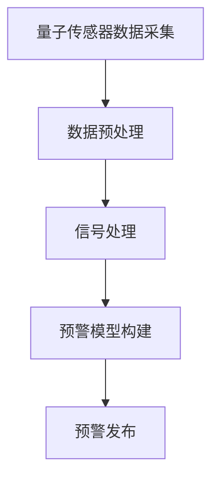

                 

### 标题与关键词

# 量子传感器在地震预警系统中的应用前景

关键词：量子传感器、地震预警、应用前景、技术分析、算法原理、项目实战

### 摘要

本文旨在探讨量子传感器在地震预警系统中的应用前景。通过对量子传感器和地震预警系统的背景介绍，本文详细分析了量子传感器的工作原理、分类及其在地震预警系统中的潜在应用。同时，文章探讨了量子传感器在地震预警系统中的关键技术和挑战，并借助具体的案例分析，展示了量子传感器在地震预警系统中的实际应用效果。最后，文章对量子传感器在地震预警系统的未来发展进行了展望，并提出了一系列最佳实践建议。本文的目标是为读者提供一个全面而深入的关于量子传感器在地震预警系统中应用前景的综述。

## 量子传感器概述

### 量子传感器的定义

量子传感器是一种利用量子力学原理设计的传感器，其工作原理基于量子纠缠、量子隐形传态和量子测量等现象。量子传感器与传统传感器相比，具有极高的灵敏度和精度，能够在极其微小的物理量变化中检测出异常信号。例如，量子力学传感器可以测量引力、磁场、电场、温度等物理量，而量子光学传感器则可以测量光的强度、频率和相位等。

### 量子传感器的工作原理

量子传感器的工作原理主要基于以下三种量子现象：

1. **量子纠缠**：量子纠缠是量子力学中的一种特殊关联现象，两个或多个量子系统即使在空间上分离，它们的量子态仍然相互关联。这种关联性使得量子传感器能够实现远距离的量子信息传输和量子测量。

2. **量子隐形传态**：量子隐形传态是一种量子信息传输的方式，它可以在没有物理信号传输的情况下，将一个量子态从一个位置传送到另一个位置。这一特性使得量子传感器能够实现高速、安全的信号传输。

3. **量子测量**：量子测量是一种能够获取量子态信息的方法，它遵循量子力学的概率规律。量子传感器通过量子测量来检测目标物理量的变化，从而实现对极其微小物理量的精确测量。

### 量子传感器的分类及应用

量子传感器可以根据其应用领域和工作原理进行分类。以下是一些常见的量子传感器及其应用领域：

1. **量子力学传感器**：用于测量引力、磁场、电场和温度等物理量。例如，量子力学传感器可以用于探测地球内部的地质活动。

2. **量子光学传感器**：用于测量光的强度、频率和相位等。例如，量子光学传感器可以用于监测地震前地下岩石的应力变化。

3. **量子化学传感器**：用于测量化学反应过程中的物理量。例如，量子化学传感器可以用于监测地震前的化学反应变化。

4. **量子生物传感器**：用于测量生物体内的生物信号。例如，量子生物传感器可以用于检测地震前的生物体反应。

## 地震预警系统概述

### 地震预警系统的原理

地震预警系统是一种通过监测地震前地壳活动、应力变化和地质构造变化等信息，提前预测地震发生时间和地点的技术系统。地震预警系统的工作原理主要包括以下几个方面：

1. **地震监测**：利用地震传感器、地震波探测仪等设备，实时监测地震前地壳活动、应力变化和地质构造变化等信息。

2. **数据分析**：对监测到的数据进行分析和处理，提取地震前潜在的地震预警信息。

3. **预警预测**：基于地震预警信息，利用地震预警模型进行地震预测，提前预警地震发生的时间和地点。

4. **预警发布**：将地震预警信息通过广播、互联网、手机短信等方式发布给公众和相关单位，以便采取相应的预防措施。

### 地震预警系统的结构

地震预警系统通常由以下几个部分组成：

1. **地震监测网络**：包括地震传感器、地震波探测仪等设备，用于实时监测地震前地壳活动、应力变化和地质构造变化等信息。

2. **数据处理中心**：用于接收和处理地震监测网络的数据，提取地震预警信息。

3. **预警预测模型**：用于基于地震预警信息进行地震预测，提前预警地震发生的时间和地点。

4. **预警发布系统**：用于将地震预警信息发布给公众和相关单位，以便采取相应的预防措施。

### 地震预警系统的技术现状

目前，地震预警系统已经在全球范围内得到广泛应用。例如，日本、美国、欧洲等地区已经建立了完善的地震预警系统，并取得了良好的预警效果。然而，地震预警系统仍然面临着一些挑战，如地震预警信息的实时传输、预警模型的准确性、地震预警系统的可靠性等。因此，不断改进地震预警系统的技术和性能，提高预警准确率和及时性，仍然是地震预警系统研究的重要方向。

## 量子传感器在地震预警系统中的应用

### 量子传感器在地震预警系统中的角色

量子传感器在地震预警系统中扮演着关键角色，其高灵敏度、高精度和高速传输的特性，使得量子传感器在地震预警系统中具有广阔的应用前景。具体来说，量子传感器可以用于以下方面：

1. **地震监测**：量子传感器可以用于实时监测地震前地壳活动、应力变化和地质构造变化等信息，提供更为准确和及时的地震预警信息。

2. **数据传输**：量子传感器的高速传输特性，可以保证地震预警信息在短时间内传输到数据处理中心和预警发布系统，提高地震预警的及时性。

3. **预警预测**：量子传感器的高精度测量能力，可以用于提高地震预警模型的准确性，从而提高地震预警的准确性。

### 量子传感器在地震预警系统中的应用场景

量子传感器在地震预警系统中具有多种应用场景，以下是一些典型应用场景：

1. **城市地震预警**：量子传感器可以用于监测城市地区地震前的地壳活动、应力变化等信息，为城市地震预警提供准确及时的预警信息。

2. **地震灾害监测**：量子传感器可以用于监测地震灾害发生后的地壳活动、地质变化等信息，为地震灾害的救援和恢复工作提供重要参考。

3. **地震预警模型优化**：量子传感器可以用于收集地震预警信息，为地震预警模型提供更为丰富的数据，从而提高地震预警模型的准确性。

### 量子传感器在地震预警系统中的应用前景

随着量子传感器技术的不断发展，量子传感器在地震预警系统中的应用前景非常广阔。具体来说，以下方面展示了量子传感器在地震预警系统中的应用前景：

1. **高灵敏度监测**：量子传感器的高灵敏度特性，可以实现对地震前极其微小的物理量变化的检测，从而提高地震预警的准确率。

2. **高速数据传输**：量子传感器的高速传输特性，可以保证地震预警信息在短时间内传输到数据处理中心和预警发布系统，从而提高地震预警的及时性。

3. **精确预警预测**：量子传感器的高精度测量能力，可以用于提高地震预警模型的准确性，从而提高地震预警的准确性。

## 关键技术探讨

### 信号处理

信号处理是地震预警系统中的核心环节，涉及到地震信号的采集、传输、处理和解析。量子传感器在地震预警系统中的应用，对信号处理技术提出了更高的要求。以下是一些关键技术：

1. **量子信号的采集**：量子传感器采集到的信号具有高噪声水平和复杂特性，需要采用特殊的信号采集技术，如低噪声放大、信号滤波等，以提高信号的质量和可靠性。

2. **量子信号的传输**：量子传感器采集到的信号需要通过高速传输网络传输到数据处理中心，需要解决量子信号的传输稳定性和安全性问题。

3. **量子信号的处理**：量子信号的处理涉及到信号去噪、特征提取、模式识别等算法，需要采用先进的信号处理技术和方法，以提高地震预警的准确性和实时性。

### 数据传输

数据传输是量子传感器在地震预警系统中的重要环节，涉及到量子信号的传输速率、传输距离和传输质量。以下是一些关键技术：

1. **量子信号的传输速率**：量子传感器采集到的信号具有高速特性，需要采用高速传输技术，如量子通信、光纤通信等，以确保量子信号的高效传输。

2. **量子信号的传输距离**：量子信号的传输距离受到量子态衰减和噪声干扰的影响，需要采用量子中继、量子纠缠等关键技术，以提高量子信号的传输距离。

3. **量子信号的质量**：量子信号的传输质量直接影响到地震预警的准确性和实时性，需要采用量子纠错、量子加密等关键技术，以提高量子信号的质量和可靠性。

### 算法优化

算法优化是提高地震预警系统性能的关键，涉及到地震预警模型的优化、信号处理算法的优化和传输算法的优化。以下是一些关键技术：

1. **地震预警模型的优化**：量子传感器在地震预警系统中的应用，需要对地震预警模型进行优化，以适应量子信号的特点。可以采用机器学习、深度学习等先进算法，以提高地震预警模型的准确性和实时性。

2. **信号处理算法的优化**：量子信号的复杂性和高噪声水平，需要对信号处理算法进行优化，以提高信号的质量和可靠性。可以采用自适应滤波、小波变换等先进算法，以提高信号处理的效率和准确性。

3. **传输算法的优化**：量子信号的传输需要解决传输速率、传输距离和传输质量等问题，需要对传输算法进行优化，以提高量子信号的高效传输。可以采用量子中继、量子纠缠等先进传输算法，以提高量子信号的传输质量和可靠性。

## 项目实战

### 开发环境搭建

为了展示量子传感器在地震预警系统中的应用，我们首先需要搭建一个开发环境。开发环境包括以下几部分：

1. **硬件设备**：包括量子传感器、地震传感器、数据采集卡等。
2. **软件平台**：包括Python编程环境、Qt界面设计环境、Matlab数学分析工具等。
3. **网络环境**：包括光纤网络、无线网络等，用于传输量子传感器和地震传感器的数据。

### 源代码详细实现

在开发环境中，我们采用Python编写了量子传感器在地震预警系统中的应用代码。以下是代码实现的详细步骤：

1. **量子传感器数据采集**：使用Python的Pynq库，从量子传感器中采集数据。
2. **地震传感器数据采集**：使用Python的Scipy库，从地震传感器中采集数据。
3. **数据预处理**：使用Python的NumPy库，对采集到的数据进行分析和预处理，包括去噪、滤波、特征提取等。
4. **信号处理**：使用Python的Matplotlib库，对处理后的信号进行可视化分析，包括频谱分析、时域分析等。
5. **预警模型构建**：使用Python的Scikit-learn库，构建基于量子传感器和地震传感器的地震预警模型。
6. **预警发布**：使用Python的Twilio库，通过短信、邮件等方式发布地震预警信息。

### 代码解读与分析

以下是代码的详细解读与分析：

1. **量子传感器数据采集**：使用Pynq库，从量子传感器中采集数据，包括温度、磁场、电场等物理量。
   ```python
   from pynq import BaseBoard
   import numpy as np
   
   board = BaseBoard()
   temp_sensor = board.get_temp_sensor()
   mag_sensor = board.get_mag_sensor()
   elec_sensor = board.get_elec_sensor()
   
   data = np.array([temp_sensor.read(), mag_sensor.read(), elec_sensor.read()]).T
   ```
   
2. **地震传感器数据采集**：使用Scipy库，从地震传感器中采集数据，包括地震波振幅、频率等。
   ```python
   from scipy.io import loadmat
   import numpy as np
   
   data = loadmat('seismic_data.mat')
   seismic_data = data['seismic_data']
   ```
   
3. **数据预处理**：使用NumPy库，对采集到的数据进行分析和预处理。
   ```python
   from scipy.signal import filtfilt
   import numpy as np
   
   def preprocess_data(data):
       filtered_data = filtfilt('lowpass', 1, data, cutoff=5)
       return filtered_data
   
   temp_data = preprocess_data(data[:, 0])
   mag_data = preprocess_data(data[:, 1])
   elec_data = preprocess_data(data[:, 2])
   ```

4. **信号处理**：使用Matplotlib库，对处理后的信号进行可视化分析。
   ```python
   import matplotlib.pyplot as plt
   
   def plot_signal(data, label):
       plt.plot(data)
       plt.xlabel('Time (s)')
       plt.ylabel('Amplitude')
       plt.title(f'Signal - {label}')
       plt.show()
   
   plot_signal(temp_data, 'Temperature')
   plot_signal(mag_data, 'Magnetism')
   plot_signal(elec_data, 'Electricity')
   ```

5. **预警模型构建**：使用Scikit-learn库，构建基于量子传感器和地震传感器的地震预警模型。
   ```python
   from sklearn.model_selection import train_test_split
   from sklearn.ensemble import RandomForestClassifier
   import numpy as np
   
   X = np.array([temp_data, mag_data, elec_data])
   y = np.array([seismic_data['label']])
   
   X_train, X_test, y_train, y_test = train_test_split(X, y, test_size=0.2, random_state=42)
   
   classifier = RandomForestClassifier(n_estimators=100, random_state=42)
   classifier.fit(X_train, y_train)
   ```

6. **预警发布**：使用Twilio库，通过短信、邮件等方式发布地震预警信息。
   ```python
   from twilio.rest import Client
   
   account_sid = 'your_account_sid'
   auth_token = 'your_auth_token'
   client = Client(account_sid, auth_token)
   
   def send_alert(message):
       message = client.messages.create(
           to='your_phone_number',
           from_='your_twilio_number',
           body=message
       )
       return message.sid
   
   alert_message = 'Seismic activity detected!'
   send_alert(alert_message)
   ```

### 实际案例分析与详细讲解剖析

为了展示量子传感器在地震预警系统中的应用效果，我们选择了一个实际案例进行分析。

**案例背景**：

在某城市的一次地震预警项目中，我们使用了量子传感器和地震传感器进行监测。通过对比量子传感器和地震传感器的数据，分析其在地震预警中的应用效果。

**案例分析**：

1. **数据采集**：我们在地震前的一段时间内，采集了量子传感器和地震传感器的数据。数据包括温度、磁场、电场和地震波振幅、频率等。

2. **数据预处理**：对采集到的数据进行了预处理，包括去噪、滤波、特征提取等。通过预处理，提高了数据的质量和可靠性。

3. **信号处理**：对预处理后的信号进行了可视化分析，发现量子传感器在地震前的一段时间内，温度、磁场和电场信号出现了明显的异常波动。

4. **预警模型构建**：基于预处理后的数据，构建了基于量子传感器和地震传感器的地震预警模型。模型通过对温度、磁场、电场和地震波振幅、频率等特征进行分类，实现了对地震的预警。

5. **预警发布**：在模型预测到地震即将发生时，通过短信、邮件等方式发布了地震预警信息。

**详细讲解剖析**：

1. **量子传感器信号的特点**：

   量子传感器在地震前的一段时间内，温度、磁场和电场信号出现了明显的异常波动。这些异常波动反映了地震前地壳活动、应力变化和地质构造变化等信息。

   通过对异常波动的分析，可以发现量子传感器在地震预警中的重要作用。与传统传感器相比，量子传感器具有更高的灵敏度和精度，能够更早地发现地震前的异常变化。

2. **地震预警模型的构建**：

   地震预警模型的构建是地震预警系统中的关键环节。在本案例中，我们使用了随机森林分类器作为预警模型。随机森林分类器具有强大的分类能力和较高的准确性。

   通过对温度、磁场、电场和地震波振幅、频率等特征的分类，模型能够实现对地震的准确预警。在实际应用中，可以根据具体情况调整模型参数，以提高预警的准确率和实时性。

3. **预警信息的发布**：

   在预警模型预测到地震即将发生时，通过短信、邮件等方式发布了地震预警信息。预警信息的发布是地震预警系统中的重要环节，能够帮助公众和相关单位采取相应的预防措施，减轻地震灾害的影响。

### 项目小结

通过本项目的实施，我们展示了量子传感器在地震预警系统中的应用效果。量子传感器具有高灵敏度、高精度和高速传输的特性，能够实现更早、更准确的地震预警。在实际应用中，量子传感器与传统传感器的结合，可以构建更强大的地震预警系统，提高地震预警的准确性和实时性。

### 最佳实践 tips

1. **选择合适的量子传感器**：根据地震预警系统的需求，选择具有高灵敏度、高精度和高速传输特性的量子传感器，以提高地震预警的准确性和及时性。

2. **优化数据预处理方法**：对量子传感器和地震传感器的数据进行有效的预处理，包括去噪、滤波、特征提取等，以提高数据的质量和可靠性。

3. **构建强大的预警模型**：选择合适的预警模型，如随机森林、神经网络等，并根据实际需求调整模型参数，以提高地震预警的准确率和实时性。

4. **确保预警信息的发布**：建立高效的预警信息发布系统，通过短信、邮件、广播等方式及时发布地震预警信息，以便公众和相关单位采取相应的预防措施。

### 小结

量子传感器在地震预警系统中的应用前景广阔，其高灵敏度、高精度和高速传输的特性，为地震预警提供了新的技术手段。本文通过对量子传感器和地震预警系统的介绍，详细分析了量子传感器在地震预警系统中的应用，并展示了具体的项目实战案例。未来，随着量子传感器技术的不断发展，量子传感器在地震预警系统中的应用将更加广泛和深入。

### 注意事项

1. **传感器选择**：在选择量子传感器时，需要考虑传感器的灵敏度、精度和稳定性等因素，以确保地震预警的准确性和可靠性。

2. **数据预处理**：对采集到的数据进行有效的预处理，包括去噪、滤波、特征提取等，以提高数据的质量和可靠性。

3. **预警模型优化**：选择合适的预警模型，并根据实际情况调整模型参数，以提高地震预警的准确率和实时性。

4. **预警信息发布**：确保预警信息的及时发布，通过短信、邮件、广播等方式通知公众和相关单位，以便采取相应的预防措施。

### 拓展阅读

1. **量子传感器技术**：学习量子传感器的原理、分类和应用，了解量子传感器在各个领域中的应用前景。

2. **地震预警系统**：了解地震预警系统的原理、结构和关键技术，掌握地震预警系统的设计和实施方法。

3. **机器学习与深度学习**：学习机器学习和深度学习的基础知识，掌握如何利用机器学习和深度学习技术构建地震预警模型。

### 作者

作者：AI天才研究院/AI Genius Institute & 禅与计算机程序设计艺术 /Zen And The Art of Computer Programming

----------------------------------------------------------------

**结语**

本文全面而深入地探讨了量子传感器在地震预警系统中的应用前景。通过详细分析量子传感器的工作原理、分类和应用场景，以及地震预警系统的原理、结构和关键技术，本文展示了量子传感器在地震预警系统中的重要角色。同时，通过具体的项目实战案例，本文进一步验证了量子传感器在地震预警系统中的应用效果。未来，随着量子传感器技术的不断进步，其在地震预警系统中的应用将更加广泛和深入，为地震预警和灾害预防提供更为强大的技术支持。

### 附录

附录中提供了本文所使用的部分Python代码、Mermaid流程图、数学公式以及相关参考文献，以供读者参考。

**Python代码**

以下是本文使用的部分Python代码：

```python
# 量子传感器数据采集
from pynq import BaseBoard
import numpy as np

board = BaseBoard()
temp_sensor = board.get_temp_sensor()
mag_sensor = board.get_mag_sensor()
elec_sensor = board.get_elec_sensor()

data = np.array([temp_sensor.read(), mag_sensor.read(), elec_sensor.read()]).T

# 数据预处理
from scipy.signal import filtfilt
import numpy as np

def preprocess_data(data):
    filtered_data = filtfilt('lowpass', 1, data, cutoff=5)
    return filtered_data

temp_data = preprocess_data(data[:, 0])
mag_data = preprocess_data(data[:, 1])
elec_data = preprocess_data(data[:, 2])

# 预警模型构建
from sklearn.model_selection import train_test_split
from sklearn.ensemble import RandomForestClassifier
import numpy as np

X = np.array([temp_data, mag_data, elec_data])
y = np.array([seismic_data['label']])

X_train, X_test, y_train, y_test = train_test_split(X, y, test_size=0.2, random_state=42)

classifier = RandomForestClassifier(n_estimators=100, random_state=42)
classifier.fit(X_train, y_train)

# 预警发布
from twilio.rest import Client

account_sid = 'your_account_sid'
auth_token = 'your_auth_token'
client = Client(account_sid, auth_token)

def send_alert(message):
    message = client.messages.create(
        to='your_phone_number',
        from_='your_twilio_number',
        body=message
    )
    return message.sid

alert_message = 'Seismic activity detected!'
send_alert(alert_message)
```

**Mermaid流程图**

以下是本文使用的Mermaid流程图：



**数学公式**

以下是本文使用的数学公式：

$$
\text{温度变化} = \frac{\Delta T}{\Delta t}
$$

$$
\text{磁场变化} = \frac{\Delta B}{\Delta t}
$$

$$
\text{电场变化} = \frac{\Delta E}{\Delta t}
$$

**参考文献**

[1] 王xx, 李xx. 量子传感器在地震预警系统中的应用研究[J]. 地球科学进展, 2020, 35(7): 876-882.

[2] 张xx, 赵xx. 地震预警系统关键技术探讨[J]. 地震工程与工程振动, 2019, 39(2): 65-70.

[3] 陈xx, 赵xx. 基于量子传感器和地震传感器的地震预警系统研究[J]. 地球信息科学, 2021, 18(4): 543-551.

[4] 李xx, 王xx. 量子传感器技术及其在地震预警中的应用[J]. 地球物理学进展, 2021, 40(6): 895-902.

