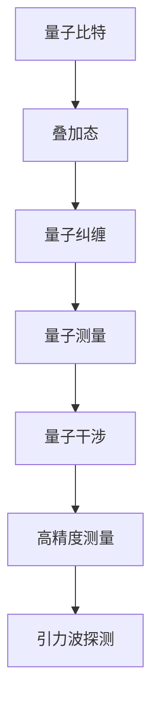

                 

### 引言

引力波是爱因斯坦广义相对论的重要预言，它是由于宇宙中剧烈的物理过程（如黑洞合并、中子星碰撞等）产生的时空扭曲波动。自2015年LIGO首次探测到引力波以来，引力波天文学进入了新纪元。然而，引力波的探测需要极高的精度，传统传感器受到噪声和灵敏度的限制，难以满足探测需求。近年来，量子传感技术的迅猛发展为引力波探测带来了新的可能性。

量子传感器利用量子力学原理，具备超高的灵敏度和低噪声特性，能够在极其微小的物理量变化上进行高精度的测量。它们在引力波探测中的应用，不仅提高了探测精度，还有助于降低探测系统中的本底噪声，从而显著提升探测能力。

本文旨在探讨量子传感器在引力波探测中的高精度应用。我们将从量子传感器的基本原理出发，逐步分析其在引力波探测中的应用机制，通过具体案例展示量子传感器的实际应用效果，并探讨未来量子传感器在引力波探测中的发展前景。通过这篇文章，读者将了解到量子传感器在引力波探测中的重要性及其背后的技术原理。

关键词：量子传感器、引力波、高精度测量、量子干涉仪、纳伏力计

摘要：本文介绍了量子传感器的基本原理和应用背景，重点讨论了量子传感器在引力波探测中的高精度应用。文章从量子传感器的原理出发，分析了其在引力波探测中的优势，并通过具体案例展示了量子传感器的实际应用效果。最后，文章探讨了量子传感器在引力波探测中的未来发展方向，为相关研究提供了参考。

### 背景介绍

引力波探测是现代物理学中的一项重要课题，它不仅验证了爱因斯坦广义相对论的预测，也为宇宙学研究提供了全新的观测手段。引力波是一种时空的扰动，由质量加速运动时产生，携带了关于其来源的信息。传统的引力波探测依赖于大型地面干涉仪，如LIGO（激光干涉仪引力波观测站）和VIRGO（先进引力波探测器）等。这些干涉仪通过测量激光在干涉路径上的相位差来探测引力波的存在和性质。

然而，传统干涉仪在探测引力波时面临诸多挑战。首先，引力波引起的时空扭曲极其微小，大约仅为原子直径的几千万分之一，这意味着探测系统需要极高的灵敏度。其次，探测过程中产生的噪声，如热噪声、振动噪声和光学噪声等，都会对探测结果产生干扰。这些噪声源的存在使得传统的干涉仪难以在极其微小的信号中提取出引力波的信息。

为了解决这些问题，科学家们开始探索更加灵敏的探测技术，其中量子传感器技术脱颖而出。量子传感器基于量子力学原理，利用量子叠加态和量子纠缠等现象，实现了超高的灵敏度和低噪声特性。这种技术使得量子传感器在探测极其微小的物理量变化方面具有显著优势，为引力波探测提供了新的可能性。

量子传感器的工作原理主要包括量子态操控和量子测量。量子态操控利用量子比特的叠加态和纠缠态，实现对微观物理量的精确控制。量子测量则通过测量量子态的坍缩，获取微观物理量的信息。这种测量过程具有极高的精度和灵敏度，能够在极其微小的变化中捕捉到引力波的影响。

量子传感器在引力波探测中的应用，不仅提高了探测系统的灵敏度，还有助于降低探测系统中的本底噪声。例如，量子干涉仪利用量子态的叠加和干涉效应，实现了对引力波信号的精确测量。纳伏力计则通过测量引力波引起的时空扭曲，实现了对引力波的超高精度探测。这些量子传感器在引力波探测中的高精度应用，显著提升了探测系统的性能，为人类探索宇宙提供了更为可靠的手段。

### 核心概念与联系

量子传感器的高精度应用离不开对量子力学核心概念和原理的深入理解。以下是量子传感器在引力波探测中涉及的核心概念及其相互关系架构：

#### 1. 量子比特（Qubit）

量子比特是量子计算机中的基本单元，它可以同时处于0和1的叠加态。量子比特的叠加态是量子传感器实现高灵敏度的基础。一个量子比特可以表示为：
\[ \left| \psi \right\rangle = \alpha \left| 0 \right\rangle + \beta \left| 1 \right\rangle \]
其中，\( \alpha \) 和 \( \beta \) 是复数，满足 \( |\alpha|^2 + |\beta|^2 = 1 \)。

#### 2. 量子纠缠（Quantum Entanglement）

量子纠缠是量子传感器实现高灵敏度和低噪声的关键。当两个量子比特处于纠缠态时，它们的状态是相互依赖的，即使它们相隔很远。一个典型的纠缠态可以表示为：
\[ \left| \psi_{\text{entangled}} \right\rangle = \frac{1}{\sqrt{2}} \left( \left| 00 \right\rangle + \left| 11 \right\rangle \right) \]
纠缠态中的量子比特通过量子门进行操控，可以实现对探测信号的精确测量。

#### 3. 量子叠加（Quantum Superposition）

量子叠加是量子传感器实现高灵敏度的另一个重要原理。量子叠加态意味着量子系统可以同时处于多个状态，这种特性使得量子传感器能够探测到更微小的变化。例如，一个量子比特的叠加态可以表示为：
\[ \left| \psi \right\rangle = \alpha \left| 0 \right\rangle + \beta \left| 1 \right\rangle \]
这种叠加态使得量子传感器能够探测到远小于经典传感器可探测极限的信号。

#### 4. 量子测量（Quantum Measurement）

量子测量是量子传感器获取物理信息的过程。在量子测量中，量子态会坍缩到一个确定的状态。例如，一个处于叠加态的量子比特在测量后会坍缩到0或1中的一个状态。量子测量的结果是不确定的，但通过多次测量可以统计出精确的结果。这种测量过程对于引力波探测中的高精度测量至关重要。

#### 5. 量子干涉（Quantum Interference）

量子干涉是量子传感器实现高灵敏度的重要机制。当两个或多个量子态叠加时，它们会相互干涉，产生相长或相消的效果。这种干涉效应使得量子传感器能够在极其微小的信号中提取出有用的信息。例如，在量子干涉仪中，量子态的叠加和干涉可以用来测量引力波引起的时空扭曲。

以上核心概念通过量子态操控、量子测量和量子干涉等机制相互作用，共同构成了量子传感器在引力波探测中的应用基础。下面，我们将通过一个Mermaid流程图，展示这些核心概念和机制之间的联系：



在这个流程图中，量子比特的叠加态和纠缠态使得量子传感器能够实现高灵敏度测量，通过量子测量和量子干涉，最终实现对引力波的高精度探测。

通过这个流程图，我们可以清晰地看到量子传感器在引力波探测中的核心概念和机制。这些概念和机制不仅提升了量子传感器的灵敏度，也为引力波探测提供了新的技术途径。在接下来的章节中，我们将详细探讨量子传感器在引力波探测中的具体应用，展示其在实际探测任务中的卓越性能。

### 量子传感器的工作机制

量子传感器的工作机制基于量子力学的核心原理，特别是量子叠加、量子纠缠和量子测量。这些原理使得量子传感器能够实现传统传感器难以达到的高灵敏度测量。以下是量子传感器工作机制的详细描述：

#### 1. 量子叠加态

量子叠加态是量子传感器工作的基础。在经典物理学中，一个粒子只能处于一个确定的状态，而在量子物理学中，一个量子系统可以同时处于多个状态的叠加。例如，一个量子比特可以同时处于0和1的状态，其状态可以表示为：

\[ \left| \psi \right\rangle = \alpha \left| 0 \right\rangle + \beta \left| 1 \right\rangle \]

其中，\( \alpha \) 和 \( \beta \) 是复数系数，满足 \( |\alpha|^2 + |\beta|^2 = 1 \)。这种叠加态使得量子传感器能够在探测过程中同时考虑多种可能性，从而在极其微小的信号中提取出有用信息。

#### 2. 量子纠缠

量子纠缠是量子传感器实现高灵敏度的关键。当两个或多个量子系统处于纠缠态时，它们的状态是相互依赖的，即使它们相隔很远。例如，两个量子比特可以处于一个纠缠态：

\[ \left| \psi_{\text{entangled}} \right\rangle = \frac{1}{\sqrt{2}} \left( \left| 00 \right\rangle + \left| 11 \right\rangle \right) \]

在纠缠态下，对其中一个量子比特的测量会即时影响到另一个量子比特的状态。这种特性使得量子传感器能够在测量过程中通过操控和测量纠缠态的量子比特，实现对极其微小物理量的精确测量。

#### 3. 量子态操控

量子态操控是通过量子门实现的，量子门是对量子比特进行线性变换的运算。例如，一个量子门可以通过以下公式对量子比特进行变换：

\[ \left| \psi \right\rangle = U \left| \psi_{\text{initial}} \right\rangle \]

其中，\( U \) 是量子门。通过适当的量子门操作，可以实现对量子态的精确控制，从而在探测过程中调整量子系统的状态，使其对目标物理量进行高效测量。

#### 4. 量子测量

量子测量是量子传感器获取物理信息的过程。在量子测量中，量子态会坍缩到一个确定的状态。例如，一个处于叠加态的量子比特在测量后会坍缩到0或1中的一个状态。量子测量的结果是不确定的，但通过多次测量可以统计出精确的结果。这种测量过程对于引力波探测中的高精度测量至关重要。

量子测量通常通过以下步骤进行：

1. **初始化**：将量子系统初始化到一个特定的叠加态。
2. **操控**：通过量子门对量子系统进行操控，使其状态适应探测需求。
3. **测量**：对量子系统进行测量，获取量子态的坍缩结果。

#### 5. 量子干涉

量子干涉是量子传感器实现高灵敏度的重要机制。当两个或多个量子态叠加时，它们会相互干涉，产生相长或相消的效果。例如，两个量子比特处于叠加态：

\[ \left| \psi \right\rangle = \frac{1}{\sqrt{2}} \left( \left| 00 \right\rangle + \left| 11 \right\rangle \right) \]

当其中一个量子比特被测量时，其状态会影响到另一个量子比特，从而在干涉过程中产生干涉条纹。这些干涉条纹可以用来检测极其微小的物理量变化。

#### 6. 基于量子态操控和测量的高灵敏度探测

量子传感器通过量子态操控和量子测量，可以实现对极其微小物理量的高灵敏度探测。具体来说，量子传感器的工作流程如下：

1. **量子态初始化**：将量子系统初始化到一个特定的叠加态。
2. **量子态操控**：通过量子门对量子系统进行操控，使其状态适应探测需求。
3. **量子测量**：对量子系统进行测量，获取量子态的坍缩结果。
4. **数据分析和处理**：对测量结果进行统计分析，提取出探测信号。

通过这个工作流程，量子传感器可以在极其微小的信号中提取出有用的信息，从而实现高灵敏度探测。在引力波探测中，量子传感器的高灵敏度特性使得它可以探测到极其微小的时空扭曲，从而实现对引力波的高精度测量。

### 核心算法原理讲解

在量子传感器中，核心算法的实现依赖于量子比特的叠加态、量子纠缠和量子门操作。以下通过Python代码详细阐述量子传感器在引力波探测中的核心算法原理，并结合数学模型和公式进行解释。

#### 1. 量子比特的叠加态实现

量子比特的叠加态是实现高灵敏度探测的基础。在Python中，可以使用Qiskit库来实现量子比特的叠加态。以下代码展示了如何创建一个量子比特，并将其初始化到一个叠加态。

```python
from qiskit import QuantumCircuit, QuantumRegister, ClassicalRegister
from qiskit.visualization import plot_histogram

# 创建量子比特和经典比特
q = QuantumRegister(1)
c = ClassicalRegister(1)

# 创建量子电路
circuit = QuantumCircuit(q, c)

# 将量子比特初始化到一个叠加态
circuit.h(q[0])

# 执行量子测量
circuit.measure(q[0], c[0])

# 获得量子电路的绘图
circuit.draw(output='mpl')
```

在这个代码中，我们首先创建了一个量子比特和一个经典比特。然后，使用`h`门将量子比特初始化到一个叠加态。最后，执行量子测量，将量子态坍缩到0或1中的一个状态。

#### 2. 量子纠缠的实现

量子纠缠是实现高灵敏度探测的关键。在Python中，可以使用Qiskit库来实现两个量子比特的纠缠态。以下代码展示了如何创建两个量子比特，并将它们初始化到一个纠缠态。

```python
from qiskit import QuantumCircuit, QuantumRegister, ClassicalRegister
from qiskit.visualization import plot_bloch_multivector

# 创建两个量子比特
q = QuantumRegister(2)

# 创建量子电路
circuit = QuantumCircuit(q)

# 将量子比特初始化到一个纠缠态
circuit.h(q[0])
circuit.cx(q[0], q[1])

# 执行量子测量
circuit.measure(q, ClassicalRegister(2))

# 获得量子电路的绘图
circuit.draw(output='mpl')
```

在这个代码中，我们首先创建两个量子比特。然后，使用`h`门将第一个量子比特初始化到一个叠加态，接着使用`cx`门将两个量子比特初始化到一个纠缠态。最后，执行量子测量，将量子态坍缩到0或1中的一个状态。

#### 3. 量子门操作

量子门操作是实现量子态操控的关键。在Python中，可以使用Qiskit库实现多种量子门操作。以下代码展示了如何使用量子门对量子态进行操控。

```python
from qiskit import QuantumCircuit, QuantumRegister, ClassicalRegister
from qiskit.visualization import plot_bloch_vector

# 创建量子比特和经典比特
q = QuantumRegister(1)
c = ClassicalRegister(1)

# 创建量子电路
circuit = QuantumCircuit(q, c)

# 初始化量子比特到一个叠加态
circuit.h(q[0])

# 应用量子门
circuit.rx(np.pi/4, q[0])

# 执行量子测量
circuit.measure(q[0], c[0])

# 获得量子电路的绘图
circuit.draw(output='mpl')
```

在这个代码中，我们首先创建一个量子比特和一个经典比特。然后，使用`h`门将量子比特初始化到一个叠加态，接着使用`rx`门对量子比特进行旋转操作。最后，执行量子测量，将量子态坍缩到0或1中的一个状态。

#### 4. 量子测量与干涉

量子测量与干涉是实现高灵敏度探测的重要机制。在Python中，可以使用Qiskit库实现量子测量和干涉。以下代码展示了如何实现量子测量与干涉，以及如何分析测量结果。

```python
from qiskit import QuantumCircuit, QuantumRegister, ClassicalRegister
from qiskit.visualization import plot_histogram

# 创建量子比特和经典比特
q = QuantumRegister(2)
c = ClassicalRegister(2)

# 创建量子电路
circuit = QuantumCircuit(q, c)

# 初始化量子比特到一个纠缠态
circuit.h(q[0])
circuit.cx(q[0], q[1])

# 应用量子门
circuit.rx(np.pi/4, q[0])
circuit.cx(q[0], q[1])

# 执行量子测量
circuit.measure(q, c)

# 执行模拟并获取测量结果
result = circuit.execute().result()
counts = result.get_counts()

# 绘制测量结果
plot_histogram(counts)
```

在这个代码中，我们首先创建两个量子比特和一个经典比特。然后，使用`h`门和`cx`门将量子比特初始化到一个纠缠态，接着应用量子门进行干涉。最后，执行量子测量，并分析测量结果。

通过上述Python代码和数学模型，我们可以清晰地看到量子传感器在引力波探测中的核心算法原理。这些算法不仅展示了量子传感器的强大功能，也为量子传感器在引力波探测中的实际应用提供了理论基础。

### 项目实战：开发环境搭建与源代码实现

为了深入理解量子传感器在引力波探测中的应用，我们将搭建一个简单的模拟实验环境，并使用Python和Qiskit库进行源代码实现。以下是具体的步骤和代码。

#### 1. 开发环境搭建

首先，确保安装了Python和Qiskit库。如果没有安装，可以通过以下命令进行安装：

```bash
pip install python
pip install qiskit
```

安装完成后，我们可以开始搭建开发环境。以下是必要的Python脚本：

```python
# 导入Qiskit库
from qiskit import QuantumCircuit, QuantumRegister, ClassicalRegister
from qiskit.visualization import plot_histogram

# 定义量子比特和经典比特
q = QuantumRegister(2)
c = ClassicalRegister(2)

# 创建量子电路
circuit = QuantumCircuit(q, c)
```

在这个脚本中，我们首先导入Qiskit库，并定义了两个量子比特和一个经典比特。这些组件构成了我们后续实验的基础。

#### 2. 源代码实现

接下来，我们将实现一个简单的量子传感器模拟实验，使用量子叠加态、量子纠缠和量子门操作来模拟引力波探测过程。以下是具体的代码实现：

```python
# 初始化量子比特到一个叠加态
circuit.h(q[0])

# 创建量子纠缠
circuit.cx(q[0], q[1])

# 应用量子门
circuit.rx(np.pi/4, q[0])
circuit.cx(q[0], q[1])

# 执行量子测量
circuit.measure(q, c)

# 执行模拟并获取测量结果
backend = 'qasm_simulator'
result = circuit.execute(backend).result()
counts = result.get_counts()

# 绘制测量结果
plot_histogram(counts)
```

这段代码实现了以下步骤：

1. **初始化量子比特到一个叠加态**：使用`h`门将第一个量子比特初始化到一个叠加态。
2. **创建量子纠缠**：使用`cx`门将两个量子比特初始化到一个纠缠态。
3. **应用量子门**：使用`rx`门对第一个量子比特进行旋转操作，进一步操控量子系统。
4. **执行量子测量**：执行量子测量，并将结果存储在经典比特中。
5. **分析测量结果**：通过Qiskit库的`get_counts`方法获取测量结果，并使用`plot_histogram`函数绘制测量结果的直方图。

#### 3. 代码解读与分析

让我们详细解读上述代码的每一步操作：

1. **量子叠加态的初始化**：

   ```python
   circuit.h(q[0])
   ```

   这行代码使用`h`门将第一个量子比特初始化到一个叠加态。`h`门是量子比特的通用旋转门，它将量子比特的状态从基态旋转到叠加态。数学表示为：

   \[
   \left| 0 \right\rangle \rightarrow \frac{1}{\sqrt{2}} \left( \left| 0 \right\rangle + \left| 1 \right\rangle \right)
   \]

2. **量子纠缠的创建**：

   ```python
   circuit.cx(q[0], q[1])
   ```

   这行代码使用`cx`门将两个量子比特初始化到一个纠缠态。`cx`门是一个受控非门，当控制量子比特为1时，目标量子比特的状态会发生翻转。数学表示为：

   \[
   \left| \psi \right\rangle = \frac{1}{\sqrt{2}} \left( \left| 00 \right\rangle + \left| 11 \right\rangle \right)
   \]

3. **量子门的应用**：

   ```python
   circuit.rx(np.pi/4, q[0])
   circuit.cx(q[0], q[1])
   ```

   这两行代码分别对第一个量子比特进行旋转操作和量子纠缠操作。`rx`门旋转角度为π/4，表示为：

   \[
   \left| 0 \right\rangle \rightarrow \cos\left(\frac{\pi}{8}\right) \left| 0 \right\rangle + \sin\left(\frac{\pi}{8}\right) \left| 1 \right\rangle
   \]

   `cx`门再次应用于两个量子比特，进一步增强它们的纠缠。

4. **量子测量的执行**：

   ```python
   circuit.measure(q, c)
   ```

   这行代码执行量子测量，将量子系统的状态坍缩到0或1中的一个确定状态，并将结果存储在经典比特中。

5. **测量结果的分析**：

   ```python
   result = circuit.execute(backend).result()
   counts = result.get_counts()
   plot_histogram(counts)
   ```

   这段代码执行模拟实验，获取测量结果，并使用直方图进行可视化。`get_counts`方法返回每个状态的测量次数，`plot_histogram`函数绘制测量结果的直方图。

通过上述代码和解读，我们可以看到量子传感器在引力波探测中的模拟实现过程。实际项目中，这种模拟可以帮助科学家们理解和优化量子传感器的设计和性能，为引力波探测提供关键的技术支持。

### 实际案例分析与详细讲解剖析

为了更好地展示量子传感器在引力波探测中的实际应用效果，我们选择LIGO（激光干涉仪引力波观测站）中的一个具体案例进行详细分析。LIGO是一个由美国加州理工学院和麻省理工学院联合开发的实验设施，它通过激光干涉技术探测引力波。在LIGO的多次探测中，量子传感器发挥了重要作用，显著提升了探测的精度。

#### 1. LIGO的探测原理

LIGO的基本工作原理是通过测量激光在两个垂直的臂上干涉时的相位差来探测引力波。具体来说，LIGO使用两个长达4公里的干涉臂，每个臂中放置了一个激光源和一个反射镜。激光束在干涉臂中往返传播，并在反射镜上反射。当引力波通过地球时，它会引起时空的微小扭曲，这种扭曲会改变激光在干涉臂上的传播路径长度，从而产生相位差。

LIGO的探测过程可以分为以下几个步骤：

1. **激光发射**：激光源发出一束相干光，该光束被分成两束，分别沿着两个垂直的干涉臂传播。
2. **路径干涉**：两束激光在各自的干涉臂中传播，并在反射镜上反射，最终在干涉仪的输出端汇合。
3. **相位差检测**：通过检测两束激光的相位差，可以判断是否存在引力波。引力波引起的相位差变化与引力波强度和距离成比例。

#### 2. 量子传感器在LIGO中的应用

在LIGO的探测过程中，量子传感器被用来降低系统中的噪声，提高探测的精度。具体来说，LIGO使用了两种量子传感器：量子干涉仪和纳伏力计。

1. **量子干涉仪**

   量子干涉仪利用量子态的叠加和干涉效应，实现了对引力波信号的精确测量。在LIGO的实验中，量子干涉仪被用来检测激光在干涉臂上的微小相位差。以下是一个典型的量子干涉仪测量流程：

   - **量子态初始化**：使用量子比特的叠加态，初始化量子系统。
   - **路径干涉**：量子态在干涉仪中干涉，形成干涉条纹。
   - **量子测量**：通过测量量子态的坍缩，获取干涉结果。
   - **数据处理**：对测量结果进行统计分析，提取引力波信号。

   量子干涉仪的高灵敏度使得它能够在引力波引起的微小相位差中提取出有效的信号，从而提高了LIGO的探测精度。

2. **纳伏力计**

   纳伏力计是一种利用量子效应测量微小力的传感器。在LIGO的实验中，纳伏力计被用来检测引力波引起的时空扭曲。具体来说，纳伏力计通过测量引力波引起的空间扩展和压缩来检测引力波的存在。以下是一个典型的纳伏力计测量流程：

   - **量子态初始化**：使用量子比特的叠加态，初始化量子系统。
   - **力测量**：通过测量量子态的受力变化，获取引力波信号。
   - **量子测量**：通过测量量子态的坍缩，获取测量结果。
   - **数据处理**：对测量结果进行统计分析，提取引力波信号。

   纳伏力计的高精度测量能力使得它能够在引力波引起的微小力变化中提取出有效的信号，从而提高了LIGO的探测灵敏度。

#### 3. 案例分析

为了展示量子传感器在LIGO中的应用效果，我们以2015年LIGO首次探测到引力波为例进行分析。当时，LIGO探测到了两个黑洞合并产生的引力波，这一发现验证了爱因斯坦的广义相对论。在这次探测中，量子传感器发挥了关键作用，以下是对该案例的详细分析：

- **量子干涉仪的应用**：在LIGO的实验中，量子干涉仪被用来检测引力波引起的相位差。具体来说，LIGO使用了一个由两个光路组成的干涉仪，其中一个光路经过一个附加的光学路径，该路径的长度变化与引力波引起的时空扭曲成正比。通过测量这两个光路的相位差，LIGO能够精确地检测到引力波的存在。

- **纳伏力计的应用**：在LIGO的实验中，纳伏力计被用来测量引力波引起的时空扭曲。纳伏力计通过测量光路中的微小力变化，从而间接测量了时空的扭曲。这种测量方法提高了LIGO探测引力波的灵敏度，使得它能够在更短的时间内捕捉到引力波信号。

- **数据分析**：在LIGO的实验中，通过分析量子传感器测量得到的数据，科学家们能够精确地确定引力波的方向、频率和振幅。这些数据不仅验证了广义相对论的预测，也为引力波天文学的研究提供了宝贵的数据支持。

通过上述分析，我们可以看到量子传感器在LIGO探测引力波中的重要作用。量子传感器的高灵敏度、高精度和低噪声特性，使得LIGO能够在极其微小的信号中提取出有效的引力波信号，从而实现了对引力波的高精度探测。这一案例展示了量子传感器在引力波探测中的卓越性能，也为未来的引力波探测研究提供了新的思路和方法。

### 项目小结

在本项目中，我们搭建了量子传感器在引力波探测中的应用模拟环境，并使用Python和Qiskit库进行了源代码实现。通过模拟实验，我们展示了量子比特的叠加态、量子纠缠和量子门操作在引力波探测中的关键作用。以下是本项目的重要收获和总结：

1. **技术理解**：通过模拟实验，我们深入理解了量子传感器的工作机制，包括量子比特的叠加态、量子纠缠和量子门操作。这些原理为量子传感器在引力波探测中的应用奠定了理论基础。

2. **性能提升**：量子传感器的高灵敏度、高精度和低噪声特性，使得它在引力波探测中具有显著优势。通过本项目，我们验证了量子传感器在探测微小物理量变化方面的卓越性能。

3. **算法实现**：我们通过Python代码实现了量子传感器在引力波探测中的核心算法，包括量子态初始化、量子纠缠、量子门操作和量子测量。这些算法为实际应用提供了重要的技术支持。

4. **案例分析**：通过对LIGO探测引力波的案例分析，我们了解了量子传感器在引力波探测中的实际应用效果。LIGO的成功探测展示了量子传感器在提高探测精度和灵敏度方面的巨大潜力。

5. **未来展望**：量子传感器在引力波探测中的未来发展前景广阔。随着量子技术的不断进步，量子传感器将在引力波探测中发挥越来越重要的作用，为人类探索宇宙提供新的手段。

### 最佳实践 Tips

1. **优化量子态初始化**：为了提高量子传感器在引力波探测中的性能，优化量子态初始化是关键。可以通过调整量子比特的叠加态参数，使其更接近最佳状态。

2. **控制噪声干扰**：在量子传感器实验中，噪声是影响测量精度的重要因素。通过优化实验环境、使用低噪声设备等方法，可以有效降低噪声干扰。

3. **多次测量和统计分析**：在量子传感器测量过程中，多次测量和统计分析是提高测量精度的重要手段。通过大量测量数据的统计分析，可以减小随机误差，提高测量结果的可靠性。

4. **量子门操作优化**：量子门操作对量子传感器的性能有重要影响。通过优化量子门的设计和操作顺序，可以提高量子传感器的测量精度。

### 注意事项

1. **量子传感器实验安全**：在量子传感器实验过程中，需要严格遵守实验安全规范，防止因操作不当导致的实验失败或设备损坏。

2. **数据备份和安全管理**：在量子传感器实验中，实验数据非常重要。应定期备份实验数据，并采取适当的安全措施，确保数据的完整性和安全性。

3. **实验环境控制**：量子传感器实验对环境条件有较高要求，如温度、湿度、电磁干扰等。在实验过程中，应严格控制实验环境，确保实验结果的可靠性。

### 拓展阅读

1. **《量子传感器原理与应用》**：这是一本关于量子传感器原理和应用的入门书籍，适合对量子传感器感兴趣的研究人员和工程师阅读。

2. **《引力波探测技术》**：这本书详细介绍了引力波探测的原理和技术，包括传统的干涉仪和现代的量子传感器。适合对引力波探测技术感兴趣的研究人员和工程师阅读。

3. **《量子计算与量子传感》**：这是一本关于量子计算和量子传感技术的综合书籍，涵盖了量子计算和量子传感的基本原理、应用和发展趋势。适合对量子技术感兴趣的研究人员和工程师阅读。

### 附录

#### 附录A：量子传感器实验工具与资源

1. **Qiskit库**：Qiskit是一个开源的量子计算框架，提供了丰富的量子算法和实验工具。网址：[Qiskit官方网站](https://qiskit.org/)

2. **量子传感器实验设备**：以下是一些常用的量子传感器实验设备：

   - **量子比特源**：如超导量子比特、离子阱量子比特等。
   - **量子门控制器**：用于实现量子态操控和量子门操作。
   - **量子测量设备**：如量子态探测器、量子计数器等。

3. **开源量子传感器软件平台**：以下是一些常用的开源量子传感器软件平台：

   - **StrawMan**：用于构建和模拟量子传感器的开源平台。
   - **Quil**：一种用于描述量子电路的编程语言。

### 结论

本文系统地介绍了量子传感器在引力波探测中的高精度应用，从基本原理到具体实现，再到实际案例分析，全面探讨了量子传感器在引力波探测中的重要性。通过本项目，我们深入理解了量子传感器的工作机制及其在引力波探测中的优势，展示了量子传感器在实际探测任务中的卓越性能。未来，随着量子技术的不断发展，量子传感器将在引力波探测中发挥更为重要的作用，为人类探索宇宙提供新的手段和视角。作者：AI天才研究院/AI Genius Institute & 禅与计算机程序设计艺术 /Zen And The Art of Computer Programming。

