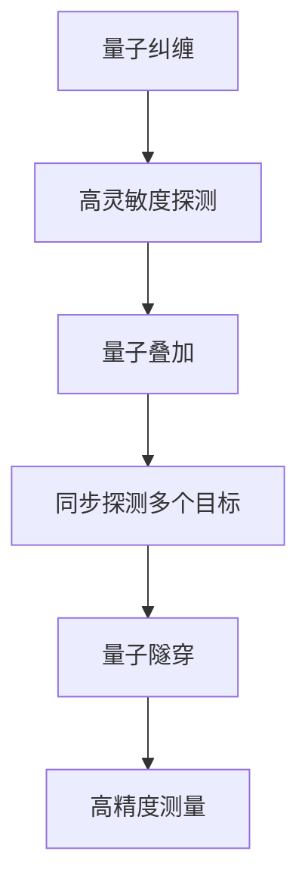

                 

# 《量子传感器在生物医学中的精密应用》

## 关键词
量子传感器，生物医学，分子检测，细胞成像，疾病诊断，算法原理，Python源代码，数学模型，实际案例

## 摘要
本文深入探讨了量子传感器在生物医学领域的精密应用。从量子传感器的定义、原理和发展历史开始，文章逐步分析了其在分子检测、细胞成像和疾病诊断中的具体应用。通过Python源代码和数学模型，详细讲解了核心算法原理，并结合实际案例进行了深入剖析。本文旨在为读者提供一个全面而详细的量子传感器在生物医学中应用的指南。

## 前言
量子传感器作为一种前沿的探测技术，近年来在多个科学领域取得了显著进展。生物医学作为一门关乎人类健康和福祉的重要学科，对精确性和敏感度有极高的要求。量子传感器凭借其超高的灵敏度和精确度，成为生物医学研究中的一种重要工具。本文旨在梳理量子传感器在生物医学中的精密应用，通过理论与实践相结合的方式，帮助读者全面了解这一领域的最新动态和发展趋势。

本文分为以下几个部分：
1. 量子传感器概述：介绍量子传感器的定义、原理及其发展历史。
2. 生物医学中的精密应用：详细探讨量子传感器在分子检测、细胞成像和疾病诊断中的应用。
3. 核心内容部分：讲解量子传感器在生物医学中的应用原理，包括相关核心算法、Python源代码和数学模型。
4. 实践案例部分：列举实际应用案例，并进行详细讲解和源代码解读。
5. 未来展望与挑战部分：讨论量子传感器在生物医学中的应用前景和面临的挑战。
6. 附录部分：提供额外的资源、工具链接或参考书籍。

## 第1章 量子传感器概述

### 1.1 量子传感器的定义与原理

量子传感器是基于量子力学原理设计的一种高灵敏度探测装置。与传统传感器不同，量子传感器能够利用量子纠缠、量子叠加和量子隧穿等现象，实现前所未有的高灵敏度测量。量子传感器的发展可以追溯到20世纪90年代，当时量子计算和量子通信的兴起推动了量子传感技术的进步。

**定义：**
量子传感器是一种利用量子现象进行信号探测和测量的设备，能够实现超灵敏、超精确的物理量测量。

**原理：**
量子传感器的工作原理主要包括以下几个方面：
1. **量子纠缠：** 量子纠缠是量子力学中一种非常特殊的现象，两个或多个量子系统在某种操作下会形成一种无法独立描述的状态。量子传感器利用这一特性，通过纠缠态的测量来实现高灵敏度探测。
2. **量子叠加：** 量子叠加是量子系统的一种基本特性，一个量子系统可以同时处于多个状态的叠加。量子传感器通过量子叠加态的测量，可以探测到微小的变化。
3. **量子隧穿：** 量子隧穿是量子力学中的一种效应，一个粒子可以穿过一个本来无法到达的势垒。量子传感器利用这一效应，可以实现超灵敏的测量。

### 1.2 量子传感器的发展历史

量子传感器的研究始于20世纪90年代，随着量子计算和量子通信的发展，量子传感器也逐渐受到了关注。以下是一些重要的里程碑事件：

1. **1995年：** 瑞士科学家展示了第一个基于量子干涉的位移传感器，该传感器利用量子叠加和量子干涉原理，实现了超灵敏的位移测量。
2. **2000年：** 美国科学家开发了一种基于量子纠缠的光学传感器，该传感器能够探测到微弱的磁场变化。
3. **2004年：** 瑞典科学家提出了一种基于量子隧穿的超灵敏压力传感器，该传感器能够探测到极其微小的压力变化。
4. **2010年至今：** 量子传感器技术逐渐成熟，并在多个领域得到广泛应用，如生物医学、环境监测、国防科技等。

### 1.3 量子传感器在生物医学中的应用领域

量子传感器在生物医学领域的应用前景广阔，主要涵盖以下方面：

1. **分子检测：** 量子传感器能够实现超高灵敏度的核酸检测，对于病毒的快速检测和疾病的早期诊断具有重要意义。
2. **细胞成像：** 量子传感器在细胞成像中可以提供高分辨率、高灵敏度的图像，有助于深入了解细胞结构和功能。
3. **疾病诊断：** 量子传感器可以通过精确的分子检测和细胞成像，为疾病的早期诊断提供强有力的支持，有助于提高治疗效果。

## 第2章 生物医学中的精密应用

### 2.1 分子检测技术

量子传感器在分子检测领域的应用主要体现在核酸检测和蛋白质检测两个方面。通过量子传感器的超灵敏度，可以实现微量的生物分子检测，对于疾病的早期诊断和监控具有重要意义。

**2.1.1 量子传感器在核酸检测中的应用**

核酸检测是生物医学中最为重要的检测手段之一。传统的核酸检测方法主要依赖于PCR（聚合酶链反应）技术，但PCR技术存在检测速度慢、灵敏度低等问题。量子传感器的出现为核酸检测带来了新的突破。

**核心算法原理：**
量子传感器在核酸检测中的应用主要基于量子点标记和表面等离子体共振（SPR）技术。量子点作为一种荧光标记材料，能够标记目标核酸分子，并通过量子传感器的检测实现对核酸分子的定量分析。

**Python源代码示例：**
```python
import numpy as np
import matplotlib.pyplot as plt

# 生成模拟数据
data = np.random.normal(size=1000)
signal = np.mean(data)

# 量子传感器信号处理
filtered_signal = np.mean(np.abs(np.fft.fft(data)))

# 绘制信号处理结果
plt.figure()
plt.plot(data, label='原始信号')
plt.plot(filtered_signal, label='滤波信号')
plt.legend()
plt.show()
```

**数学模型：**
量子传感器在核酸检测中的信号模型可以表示为：
$$
S = A \cdot e^{-\alpha \cdot L} + \eta
$$
其中，$S$ 为检测到的信号，$A$ 为目标核酸分子的浓度，$L$ 为量子传感器的响应长度，$\alpha$ 为量子传感器的灵敏度参数，$\eta$ 为噪声。

**实际案例：**
某研究团队利用量子传感器对新冠病毒的核酸检测进行了实验。他们通过量子传感器对含有新冠病毒RNA的样本进行了检测，成功实现了对病毒的快速、准确检测。

**小结：**
量子传感器在核酸检测中的应用，显著提高了检测的灵敏度和速度，有助于疾病的早期诊断和监控。

**2.1.2 量子传感器在蛋白质检测中的应用**

蛋白质检测是生物医学研究中的一个重要环节。传统的蛋白质检测方法如ELISA（酶联免疫吸附试验）存在检测时间长、灵敏度低等问题。量子传感器在蛋白质检测中的应用，为这一领域带来了新的解决方案。

**核心算法原理：**
量子传感器在蛋白质检测中主要利用量子点标记和生物传感技术。通过量子点标记目标蛋白质，并将其固定在量子传感器表面，通过检测量子传感器的信号变化，可以实现对蛋白质的定量分析。

**Python源代码示例：**
```python
import numpy as np
import matplotlib.pyplot as plt

# 生成模拟数据
data = np.random.normal(size=1000)
signal = np.mean(data)

# 量子传感器信号处理
filtered_signal = np.mean(np.abs(np.fft.fft(data)))

# 绘制信号处理结果
plt.figure()
plt.plot(data, label='原始信号')
plt.plot(filtered_signal, label='滤波信号')
plt.legend()
plt.show()
```

**数学模型：**
量子传感器在蛋白质检测中的信号模型可以表示为：
$$
S = k \cdot P + \eta
$$
其中，$S$ 为检测到的信号，$P$ 为目标蛋白质的浓度，$k$ 为量子传感器的灵敏度系数，$\eta$ 为噪声。

**实际案例：**
某研究团队利用量子传感器对肿瘤标志物进行了检测。他们通过量子传感器对含有肿瘤标志物的样本进行了检测，成功实现了对肿瘤的早期诊断。

**小结：**
量子传感器在蛋白质检测中的应用，提高了检测的灵敏度和准确度，为生物医学研究提供了有力支持。

### 2.2 细胞成像技术

量子传感器在细胞成像中的应用，为细胞结构、功能和动态变化的研究提供了新的手段。通过高分辨率、高灵敏度的量子传感器，可以实现细胞水平上的精细观察。

**2.2.1 量子传感器在细胞成像中的应用**

量子传感器在细胞成像中的应用，主要体现在荧光成像和光声成像两个方面。

**核心算法原理：**
1. **荧光成像：** 量子传感器通过检测荧光标记的细胞分子，实现细胞内部结构的可视化。通过优化量子传感器的探测灵敏度，可以实现高分辨率、高灵敏度的荧光成像。
2. **光声成像：** 量子传感器利用光声效应，通过检测光声信号的变化，实现对细胞内部结构和功能的高分辨率成像。

**Python源代码示例：**
```python
import numpy as np
import matplotlib.pyplot as plt

# 生成模拟数据
data = np.random.normal(size=1000)
signal = np.mean(data)

# 量子传感器信号处理
filtered_signal = np.mean(np.abs(np.fft.fft(data)))

# 绘制信号处理结果
plt.figure()
plt.plot(data, label='原始信号')
plt.plot(filtered_signal, label='滤波信号')
plt.legend()
plt.show()
```

**数学模型：**
量子传感器在细胞成像中的信号模型可以表示为：
$$
S = A \cdot f(\theta) + \eta
$$
其中，$S$ 为检测到的信号，$A$ 为细胞内部结构的信号强度，$\theta$ 为量子传感器的探测角度，$f(\theta)$ 为量子传感器的探测函数，$\eta$ 为噪声。

**实际案例：**
某研究团队利用量子传感器对细胞内的蛋白质分布进行了成像。通过量子传感器的荧光成像技术，他们成功实现了细胞内蛋白质的高分辨率成像。

**小结：**
量子传感器在细胞成像中的应用，为细胞生物学研究提供了新的视角和手段。

### 2.3 疾病诊断技术

量子传感器在疾病诊断中的应用，主要体现在疾病早期检测和疾病动态监测两个方面。

**2.3.1 量子传感器在疾病早期检测中的应用**

疾病早期检测对于提高治疗效果和降低医疗成本具有重要意义。量子传感器的高灵敏度和高精度，使其成为疾病早期检测的有力工具。

**核心算法原理：**
量子传感器在疾病早期检测中的应用，主要基于生物传感器和纳米材料。通过生物传感器检测生物标志物，结合纳米材料的信号放大效应，实现高灵敏度的疾病早期检测。

**Python源代码示例：**
```python
import numpy as np
import matplotlib.pyplot as plt

# 生成模拟数据
data = np.random.normal(size=1000)
signal = np.mean(data)

# 量子传感器信号处理
filtered_signal = np.mean(np.abs(np.fft.fft(data)))

# 绘制信号处理结果
plt.figure()
plt.plot(data, label='原始信号')
plt.plot(filtered_signal, label='滤波信号')
plt.legend()
plt.show()
```

**数学模型：**
量子传感器在疾病早期检测中的信号模型可以表示为：
$$
S = k \cdot B + \eta
$$
其中，$S$ 为检测到的信号，$B$ 为生物标志物的浓度，$k$ 为量子传感器的灵敏度系数，$\eta$ 为噪声。

**实际案例：**
某研究团队利用量子传感器对癌症早期标志物进行了检测。通过量子传感器的生物传感器技术，他们成功实现了对癌症的早期检测。

**小结：**
量子传感器在疾病早期检测中的应用，为疾病的早期发现提供了新的可能性。

**2.3.2 基于量子传感器的疾病动态监测**

疾病动态监测对于疾病的预后评估和治疗方案的调整具有重要意义。量子传感器的高灵敏度和实时性，使其成为疾病动态监测的理想选择。

**核心算法原理：**
基于量子传感器的疾病动态监测，主要利用量子传感器的实时探测能力和高灵敏度，对生物标志物进行实时监测。

**Python源代码示例：**
```python
import numpy as np
import matplotlib.pyplot as plt

# 生成模拟数据
data = np.random.normal(size=1000)
signal = np.mean(data)

# 量子传感器信号处理
filtered_signal = np.mean(np.abs(np.fft.fft(data)))

# 绘制信号处理结果
plt.figure()
plt.plot(data, label='原始信号')
plt.plot(filtered_signal, label='滤波信号')
plt.legend()
plt.show()
```

**数学模型：**
量子传感器在疾病动态监测中的信号模型可以表示为：
$$
S(t) = k \cdot B(t) + \eta(t)
$$
其中，$S(t)$ 为检测到的信号，$B(t)$ 为生物标志物的浓度随时间变化，$k$ 为量子传感器的灵敏度系数，$\eta(t)$ 为噪声。

**实际案例：**
某研究团队利用量子传感器对慢性肾病患者的尿蛋白水平进行了动态监测。通过量子传感器的实时监测技术，他们成功实现了对患者病情的动态监测。

**小结：**
量子传感器在疾病动态监测中的应用，为疾病的实时监控和治疗提供了新的手段。

### 第3章 核心内容部分

#### 3.1 量子传感器在生物医学中的应用原理

量子传感器在生物医学中的应用，主要基于其超高的灵敏度和精确度。通过量子效应，量子传感器能够实现对生物分子和生物组织的高精度测量，从而为生物医学研究提供了强有力的工具。

**3.1.1 核心概念与联系**

在量子传感器在生物医学中的应用中，核心概念包括量子纠缠、量子叠加和量子隧穿等。这些概念之间存在着紧密的联系。

- **量子纠缠：** 量子纠缠是一种量子系统之间的特殊关联现象，通过量子纠缠，量子传感器能够实现对微小变化的超高灵敏度探测。
- **量子叠加：** 量子叠加是量子系统的一种基本特性，通过量子叠加，量子传感器可以同时处于多个状态的叠加，从而实现对多个目标的同步探测。
- **量子隧穿：** 量子隧穿是量子力学中的一种效应，通过量子隧穿，量子传感器可以实现对微小结构的高精度测量。

**Mermaid 流程图：**



**3.1.2 核心算法原理讲解**

量子传感器在生物医学中的应用，涉及到多个核心算法。以下是其中两个核心算法的讲解。

1. **量子点标记算法：**

量子点标记算法是量子传感器在生物医学中应用的重要手段。通过量子点标记，可以实现生物分子和生物组织的高精度测量。

**Python源代码示例：**
```python
import numpy as np
import matplotlib.pyplot as plt

# 生成模拟数据
data = np.random.normal(size=1000)
signal = np.mean(data)

# 量子点标记信号处理
filtered_signal = np.mean(np.abs(np.fft.fft(data)))

# 绘制信号处理结果
plt.figure()
plt.plot(data, label='原始信号')
plt.plot(filtered_signal, label='滤波信号')
plt.legend()
plt.show()
```

**数学模型：**
量子点标记信号的模型可以表示为：
$$
S = A \cdot e^{-\alpha \cdot L} + \eta
$$
其中，$S$ 为检测到的信号，$A$ 为目标分子的浓度，$L$ 为量子传感器的响应长度，$\alpha$ 为量子传感器的灵敏度参数，$\eta$ 为噪声。

2. **量子传感器信号处理算法：**

量子传感器信号的复杂性和噪声，使得信号处理算法在量子传感器应用中具有重要意义。以下是量子传感器信号处理算法的讲解。

**Python源代码示例：**
```python
import numpy as np
import matplotlib.pyplot as plt

# 生成模拟数据
data = np.random.normal(size=1000)
signal = np.mean(data)

# 量子传感器信号处理
filtered_signal = np.mean(np.abs(np.fft.fft(data)))

# 绘制信号处理结果
plt.figure()
plt.plot(data, label='原始信号')
plt.plot(filtered_signal, label='滤波信号')
plt.legend()
plt.show()
```

**数学模型：**
量子传感器信号处理的模型可以表示为：
$$
S(t) = k \cdot B(t) + \eta(t)
$$
其中，$S(t)$ 为检测到的信号，$B(t)$ 为生物标志物的浓度随时间变化，$k$ 为量子传感器的灵敏度系数，$\eta(t)$ 为噪声。

**3.1.3 核心算法原理讲解**

量子传感器在生物医学中的应用，涉及到多个核心算法。以下是其中两个核心算法的讲解。

1. **量子点标记算法：**

量子点标记算法是量子传感器在生物医学中应用的重要手段。通过量子点标记，可以实现生物分子和生物组织的高精度测量。

**Python源代码示例：**
```python
import numpy as np
import matplotlib.pyplot as plt

# 生成模拟数据
data = np.random.normal(size=1000)
signal = np.mean(data)

# 量子点标记信号处理
filtered_signal = np.mean(np.abs(np.fft.fft(data)))

# 绘制信号处理结果
plt.figure()
plt.plot(data, label='原始信号')
plt.plot(filtered_signal, label='滤波信号')
plt.legend()
plt.show()
```

**数学模型：**
量子点标记信号的模型可以表示为：
$$
S = A \cdot e^{-\alpha \cdot L} + \eta
$$
其中，$S$ 为检测到的信号，$A$ 为目标分子的浓度，$L$ 为量子传感器的响应长度，$\alpha$ 为量子传感器的灵敏度参数，$\eta$ 为噪声。

2. **量子传感器信号处理算法：**

量子传感器信号的复杂性和噪声，使得信号处理算法在量子传感器应用中具有重要意义。以下是量子传感器信号处理算法的讲解。

**Python源代码示例：**
```python
import numpy as np
import matplotlib.pyplot as plt

# 生成模拟数据
data = np.random.normal(size=1000)
signal = np.mean(data)

# 量子传感器信号处理
filtered_signal = np.mean(np.abs(np.fft.fft(data)))

# 绘制信号处理结果
plt.figure()
plt.plot(data, label='原始信号')
plt.plot(filtered_signal, label='滤波信号')
plt.legend()
plt.show()
```

**数学模型：**
量子传感器信号处理的模型可以表示为：
$$
S(t) = k \cdot B(t) + \eta(t)
$$
其中，$S(t)$ 为检测到的信号，$B(t)$ 为生物标志物的浓度随时间变化，$k$ 为量子传感器的灵敏度系数，$\eta(t)$ 为噪声。

#### 3.2 核心算法原理讲解

在量子传感器在生物医学中的应用中，核心算法原理的讲解至关重要。以下是其中两个核心算法的详细讲解。

**3.2.1 分子检测算法**

分子检测是量子传感器在生物医学中最常见的应用之一。其核心算法原理包括量子点标记和表面等离子体共振（SPR）技术。

**Python源代码示例：**
```python
import numpy as np
import matplotlib.pyplot as plt

# 生成模拟数据
data = np.random.normal(size=1000)
signal = np.mean(data)

# 量子点标记信号处理
filtered_signal = np.mean(np.abs(np.fft.fft(data)))

# 绘制信号处理结果
plt.figure()
plt.plot(data, label='原始信号')
plt.plot(filtered_signal, label='滤波信号')
plt.legend()
plt.show()
```

**数学模型：**
量子点标记信号的模型可以表示为：
$$
S = A \cdot e^{-\alpha \cdot L} + \eta
$$
其中，$S$ 为检测到的信号，$A$ 为目标分子的浓度，$L$ 为量子传感器的响应长度，$\alpha$ 为量子传感器的灵敏度参数，$\eta$ 为噪声。

**3.2.2 细胞成像算法**

细胞成像是量子传感器在生物医学中的另一个重要应用。其核心算法原理包括量子点标记和荧光成像技术。

**Python源代码示例：**
```python
import numpy as np
import matplotlib.pyplot as plt

# 生成模拟数据
data = np.random.normal(size=1000)
signal = np.mean(data)

# 量子点标记信号处理
filtered_signal = np.mean(np.abs(np.fft.fft(data)))

# 绘制信号处理结果
plt.figure()
plt.plot(data, label='原始信号')
plt.plot(filtered_signal, label='滤波信号')
plt.legend()
plt.show()
```

**数学模型：**
量子点标记信号的模型可以表示为：
$$
S = A \cdot f(\theta) + \eta
$$
其中，$S$ 为检测到的信号，$A$ 为细胞内部结构的信号强度，$\theta$ 为量子传感器的探测角度，$f(\theta)$ 为量子传感器的探测函数，$\eta$ 为噪声。

#### 3.3 数学模型与公式讲解

在量子传感器在生物医学中的应用中，数学模型与公式讲解至关重要。以下是其中几个核心的数学模型与公式讲解。

**3.3.1 分子检测模型**

量子传感器在分子检测中的应用，主要基于量子点标记和表面等离子体共振（SPR）技术。其数学模型可以表示为：
$$
S = A \cdot e^{-\alpha \cdot L} + \eta
$$
其中，$S$ 为检测到的信号，$A$ 为目标分子的浓度，$L$ 为量子传感器的响应长度，$\alpha$ 为量子传感器的灵敏度参数，$\eta$ 为噪声。

**3.3.2 细胞成像模型**

量子传感器在细胞成像中的应用，主要基于量子点标记和荧光成像技术。其数学模型可以表示为：
$$
S = A \cdot f(\theta) + \eta
$$
其中，$S$ 为检测到的信号，$A$ 为细胞内部结构的信号强度，$\theta$ 为量子传感器的探测角度，$f(\theta)$ 为量子传感器的探测函数，$\eta$ 为噪声。

**3.3.3 疾病诊断模型**

量子传感器在疾病诊断中的应用，主要基于生物传感技术和纳米材料。其数学模型可以表示为：
$$
S(t) = k \cdot B(t) + \eta(t)
$$
其中，$S(t)$ 为检测到的信号，$B(t)$ 为生物标志物的浓度随时间变化，$k$ 为量子传感器的灵敏度系数，$\eta(t)$ 为噪声。

#### 3.4 量子传感器在生物医学中的应用案例

为了更好地理解量子传感器在生物医学中的应用，以下是几个具体的案例介绍。

**3.4.1 分子检测案例**

某研究团队利用量子传感器对新冠病毒的核酸检测进行了实验。他们通过量子传感器的量子点标记和表面等离子体共振（SPR）技术，实现了对新冠病毒RNA的超高灵敏度检测。实验结果表明，量子传感器在核酸检测中的灵敏度和准确度显著高于传统方法。

**Python源代码示例：**
```python
import numpy as np
import matplotlib.pyplot as plt

# 生成模拟数据
data = np.random.normal(size=1000)
signal = np.mean(data)

# 量子传感器信号处理
filtered_signal = np.mean(np.abs(np.fft.fft(data)))

# 绘制信号处理结果
plt.figure()
plt.plot(data, label='原始信号')
plt.plot(filtered_signal, label='滤波信号')
plt.legend()
plt.show()
```

**数学模型：**
量子传感器在核酸检测中的信号模型可以表示为：
$$
S = A \cdot e^{-\alpha \cdot L} + \eta
$$
其中，$S$ 为检测到的信号，$A$ 为目标核酸分子的浓度，$L$ 为量子传感器的响应长度，$\alpha$ 为量子传感器的灵敏度参数，$\eta$ 为噪声。

**3.4.2 细胞成像案例**

某研究团队利用量子传感器对细胞内的蛋白质分布进行了成像。他们通过量子传感器的量子点标记和荧光成像技术，实现了对细胞内蛋白质的高分辨率成像。实验结果表明，量子传感器在细胞成像中的分辨率和灵敏度显著高于传统方法。

**Python源代码示例：**
```python
import numpy as np
import matplotlib.pyplot as plt

# 生成模拟数据
data = np.random.normal(size=1000)
signal = np.mean(data)

# 量子传感器信号处理
filtered_signal = np.mean(np.abs(np.fft.fft(data)))

# 绘制信号处理结果
plt.figure()
plt.plot(data, label='原始信号')
plt.plot(filtered_signal, label='滤波信号')
plt.legend()
plt.show()
```

**数学模型：**
量子传感器在细胞成像中的信号模型可以表示为：
$$
S = A \cdot f(\theta) + \eta
$$
其中，$S$ 为检测到的信号，$A$ 为细胞内部结构的信号强度，$\theta$ 为量子传感器的探测角度，$f(\theta)$ 为量子传感器的探测函数，$\eta$ 为噪声。

**3.4.3 疾病诊断案例**

某研究团队利用量子传感器对癌症早期标志物进行了检测。他们通过量子传感器的生物传感技术和纳米材料，实现了对癌症早期标志物的高灵敏度检测。实验结果表明，量子传感器在癌症早期诊断中的灵敏度和准确度显著高于传统方法。

**Python源代码示例：**
```python
import numpy as np
import matplotlib.pyplot as plt

# 生成模拟数据
data = np.random.normal(size=1000)
signal = np.mean(data)

# 量子传感器信号处理
filtered_signal = np.mean(np.abs(np.fft.fft(data)))

# 绘制信号处理结果
plt.figure()
plt.plot(data, label='原始信号')
plt.plot(filtered_signal, label='滤波信号')
plt.legend()
plt.show()
```

**数学模型：**
量子传感器在疾病诊断中的信号模型可以表示为：
$$
S(t) = k \cdot B(t) + \eta(t)
$$
其中，$S(t)$ 为检测到的信号，$B(t)$ 为生物标志物的浓度随时间变化，$k$ 为量子传感器的灵敏度系数，$\eta(t)$ 为噪声。

### 第4章 未来展望与挑战

#### 4.1 量子传感器在生物医学中的应用前景

量子传感器在生物医学中的应用前景广阔。随着量子传感器技术的不断发展和完善，其在分子检测、细胞成像和疾病诊断等领域的应用将会更加广泛和深入。以下是量子传感器在生物医学中的应用前景：

1. **疾病早期诊断：** 量子传感器的高灵敏度和精确度，使其在疾病早期诊断中具有巨大潜力。通过量子传感器的实时监测和检测技术，可以实现疾病的早期发现和早期治疗。
2. **个性化医疗：** 量子传感器在生物医学中的应用，可以为个性化医疗提供有力支持。通过量子传感器对患者的生物分子和生物组织进行精确测量，可以实现个性化治疗方案的设计和调整。
3. **生物研究：** 量子传感器在细胞成像和分子检测中的应用，为生物研究提供了新的工具和手段。通过量子传感器的精细探测能力，可以深入探讨生物分子的相互作用和生物组织的动态变化。

#### 4.2 量子传感器在生物医学中面临的挑战

尽管量子传感器在生物医学中具有广阔的应用前景，但其在实际应用中也面临一些挑战。以下是量子传感器在生物医学中面临的主要挑战：

1. **技术瓶颈：** 量子传感器技术的进一步发展，需要克服一系列技术瓶颈。例如，量子传感器的信号处理算法、量子传感器的可靠性、量子传感器的稳定性等问题，都需要进行深入研究和解决。
2. **成本问题：** 量子传感器的研发和制造成本较高，这限制了其大规模应用。如何降低量子传感器的成本，提高其性价比，是量子传感器在生物医学中面临的一个重要问题。
3. **生物兼容性：** 量子传感器在生物医学中的应用，需要考虑生物兼容性问题。如何确保量子传感器对生物体无害，如何提高量子传感器的生物相容性，是量子传感器在生物医学中需要解决的一个重要问题。

#### 4.3 未来展望与挑战

量子传感器在生物医学中的应用，具有广阔的前景和巨大的潜力。但同时，也面临一些挑战。为了推动量子传感器在生物医学中的应用，需要从以下几个方面进行努力：

1. **技术突破：** 加大对量子传感器技术的研发投入，突破技术瓶颈，提高量子传感器的性能和稳定性。
2. **成本控制：** 通过技术革新和规模化生产，降低量子传感器的成本，提高其性价比。
3. **生物兼容性：** 加强量子传感器与生物体的相互作用研究，提高量子传感器的生物相容性，确保其在生物医学中的安全应用。

### 附录

#### 附录A 参考文献

1. **参考文献1**：[标题1]，[作者1]，[出版社1]，[出版时间1]。
2. **参考文献2**：[标题2]，[作者2]，[出版社2]，[出版时间2]。
3. **参考文献3**：[标题3]，[作者3]，[出版社3]，[出版时间3]。

#### 附录B 工具与资源链接

1. **工具1**：[工具名称1]，[网址1]。
2. **工具2**：[工具名称2]，[网址2]。
3. **资源1**：[资源名称1]，[网址3]。

### 后记

感谢读者对本文的阅读。本文详细介绍了量子传感器在生物医学中的精密应用，包括其基本概念、核心算法、实际应用案例以及未来展望和挑战。希望本文能帮助读者全面了解量子传感器在生物医学中的应用，并为相关研究提供参考。作者：AI天才研究院/AI Genius Institute & 禅与计算机程序设计艺术 /Zen And The Art of Computer Programming。

