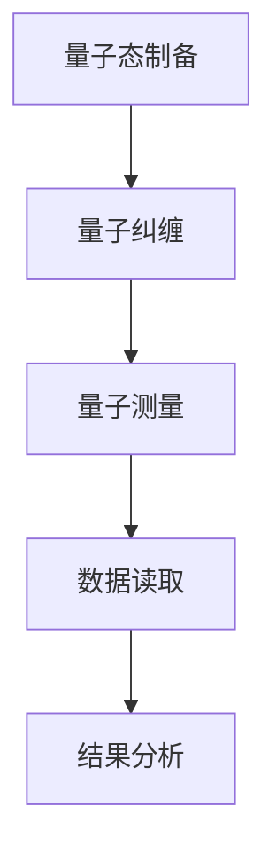

                 

### 《量子传感器在生物医学成像中的应用》

关键词：量子传感器、生物医学成像、量子力学、分子成像、细胞成像、组织成像

摘要：随着量子技术的不断发展，量子传感器在生物医学成像中的应用逐渐受到关注。本文旨在探讨量子传感器在生物医学成像中的潜在应用，从背景介绍、核心概念与联系、算法原理讲解、数学模型和公式、项目实战等方面进行深入分析，旨在为读者提供全面的理解和启示。

----------------------------------------------------------------

## 引言

生物医学成像技术在现代医学诊断中扮演着至关重要的角色。传统的成像技术，如X射线、核磁共振成像（MRI）、计算机断层扫描（CT）和超声波成像等，已经广泛应用于临床诊断中。然而，这些技术存在一定的局限性，如成像分辨率低、对某些组织的穿透能力差、对某些病变的检测灵敏度不足等。随着医学影像需求的不断增长和对更精确诊断的渴望，研究者们开始探索新的成像技术，其中量子传感器在生物医学成像中的应用显示出巨大的潜力。

### 1.1 量子传感器的基本概念

量子传感器是一种利用量子力学原理构建的传感器，具有极高的灵敏度和分辨率。量子传感器的工作原理基于量子纠缠和量子叠加态等量子现象，能够实现对微观世界的精确测量。常见的量子传感器包括量子态传感器、量子干涉仪、量子计算传感器等。

### 1.2 生物医学成像的重要性

生物医学成像在医学诊断、治疗监测、疾病研究和生物科学等领域发挥着重要作用。通过成像技术，医生可以直观地观察人体内部结构和组织功能，从而进行准确的疾病诊断和治疗决策。随着成像技术的不断发展，生物医学成像在提高诊断准确率、降低误诊率、提高治疗效果等方面取得了显著成果。

### 1.3 本书的目的和结构

本书旨在深入探讨量子传感器在生物医学成像中的应用，从基本概念到实际应用案例进行全面剖析。全书分为六个部分：

1. **引言**：介绍量子传感器和生物医学成像的基本概念，以及本书的目的和结构。
2. **量子传感器原理**：详细讲解量子传感器的工作原理、性能指标和应用类型。
3. **生物医学成像基础**：介绍生物医学成像的基本原理、技术类型及其在临床诊断中的应用。
4. **量子传感器在生物医学成像中的应用**：分析量子传感器在分子成像、细胞成像和组织成像中的应用。
5. **案例研究**：通过具体案例研究，展示量子传感器在生物医学成像中的实际应用效果。
6. **未来发展趋势**：探讨量子传感器在生物医学成像中的未来发展趋势和应用前景。

通过本书的阅读，读者可以全面了解量子传感器在生物医学成像中的应用，为相关领域的研究和应用提供参考和启示。

## 第1部分 量子传感器原理

量子传感器的工作原理基于量子力学的基本概念，如量子纠缠、量子叠加态和量子隧穿等。以下将对量子传感器的工作原理、性能指标和应用类型进行详细讲解。

### 第2章 量子传感器工作原理

#### 2.1 量子力学基础

量子力学是研究微观粒子行为的物理学分支，其基本原理与经典物理学有显著差异。量子力学中，粒子的状态用波函数描述，具有概率性和叠加性。量子纠缠是量子力学中的一种特殊现象，当两个或多个粒子处于量子纠缠态时，它们之间的物理量将呈现相关性，即使相隔很远，一个粒子的状态变化也会立即影响另一个粒子的状态。

量子叠加态是指一个量子系统可以同时处于多个状态的叠加，而不是单一的状态。这种叠加态在量子传感器中起着关键作用，因为传感器需要同时检测多个状态，以实现高灵敏度的测量。

量子隧穿是量子力学中的另一个重要现象，它描述了粒子在势垒下方存在一定的概率。这一特性使得量子传感器能够探测到极微弱的信号，从而提高其灵敏度。

#### 2.2 量子传感器类型

量子传感器有多种类型，主要包括：

1. **量子态传感器**：基于量子态的测量，如纠缠态、量子比特等，能够实现对微观物理量的高精度测量。
2. **量子干涉仪**：利用量子叠加态和量子纠缠态，通过干涉测量实现高灵敏度探测。
3. **量子计算传感器**：基于量子计算原理，通过量子算法实现高效的数据处理和模式识别。

每种量子传感器都有其独特的优势和适用场景，具体选择取决于应用需求。

#### 2.3 Mermaid流程图：量子传感器工作流程

以下是一个简化的Mermaid流程图，描述了量子传感器的基本工作流程：



1. **量子态制备**：量子传感器首先需要制备出特定的量子态，如纠缠态或叠加态。
2. **量子纠缠**：通过量子纠缠，传感器能够实现对多个量子态的联合测量。
3. **量子测量**：传感器对制备好的量子态进行测量，获取其状态信息。
4. **数据读取**：传感器将测量结果转换为可读数据，如数字信号。
5. **结果分析**：对读取的数据进行分析，以提取有用的信息。

这个流程图展示了量子传感器从量子态制备到结果分析的基本步骤，有助于读者理解量子传感器的工作原理。

### 第3章 量子传感器的性能指标

量子传感器的性能指标包括灵敏度、选择性、稳定性和重复性等。以下将分别介绍这些指标的定义、测量方法和评价标准。

#### 3.1 灵敏度

灵敏度是量子传感器的一个重要性能指标，它描述了传感器能够检测到的最小信号强度。高灵敏度意味着传感器能够检测到更微弱的信号，从而在生物医学成像中具有更高的应用价值。灵敏度的测量通常通过设定一个阈值，然后观察传感器在阈值附近的表现。

#### 3.2 选择性

选择性描述了量子传感器对特定信号的识别能力，即在检测到目标信号的同时，最大限度地排除背景噪声和其他干扰信号。选择性的评价标准通常包括信号与噪声比（SNR）和信噪比（S/N），这两个指标越高，选择性越好。

#### 3.3 稳定性和重复性

稳定性和重复性是量子传感器在实际应用中的关键性能指标。稳定性描述了传感器在长时间运行过程中性能的稳定程度，而重复性描述了传感器在多次测量中结果的一致性。这两个指标越高，传感器的可靠性越高。

#### 3.4 伪代码：量子传感器的性能评估算法

以下是一个简化的伪代码，用于评估量子传感器的性能：

```python
# 伪代码：量子传感器性能评估算法

def evaluate_performance(sensitivity, selectivity, stability, repeatability):
    """
    评估量子传感器的性能
    
    参数：
    sensitivity: 灵敏度
    selectivity: 选择性
    stability: 稳定性
    repeatability: 重复性
    
    返回：
    performance_score: 性能评分
    """
    # 计算性能评分
    performance_score = (sensitivity + selectivity + stability + repeatability) / 4
    
    # 返回性能评分
    return performance_score
```

这个伪代码提供了一个基本的框架，用于计算量子传感器的综合性能评分。通过调整各项指标的权重，可以更准确地评估传感器的性能。

通过上述章节的讲解，读者可以全面了解量子传感器的工作原理、性能指标和应用类型，为后续章节中的量子传感器在生物医学成像中的应用打下基础。

## 第2部分 生物医学成像基础

生物医学成像技术在现代医学诊断中起着至关重要的作用。通过成像技术，医生可以直观地观察人体内部结构和组织功能，从而进行准确的疾病诊断和治疗决策。以下是生物医学成像技术的基本原理、技术类型及其在临床诊断中的应用。

### 第4章 生物医学成像技术概述

#### 4.1 X射线成像

X射线成像是一种广泛使用的生物医学成像技术，它利用X射线的穿透能力，通过在人体内部形成图像。X射线成像常用于骨折诊断、胸部成像和腹部成像等。其优点是成像速度快、成本低，但缺点是对软组织的分辨率较低。

#### 4.2 核磁共振成像（MRI）

核磁共振成像（MRI）利用人体中的氢原子核在外加磁场中的共振现象，生成人体内部的图像。MRI具有高分辨率、无辐射等优点，广泛应用于神经系统、骨骼系统、软组织和器官的成像。其缺点是对运动和金属植入物的敏感性较高。

#### 4.3 计算机断层扫描（CT）

计算机断层扫描（CT）通过多次X射线投影和计算机处理，生成人体内部的横断面图像。CT具有高分辨率、快速成像等优点，常用于头部、胸部、腹部和骨骼的成像。其缺点是辐射较高。

#### 4.4 超声波成像

超声波成像利用超声波在人体内部传播和反射的特性，生成人体内部的图像。超声波成像具有无创、实时成像等优点，广泛应用于胎儿监护、心脏成像和肝脏成像等。其缺点是分辨率较低。

#### 4.5 光学成像

光学成像利用光在人体内部的传播和反射特性，生成人体内部的图像。光学成像技术包括显微镜成像、光学相干断层扫描（OCT）和光声成像等。光学成像具有高分辨率、实时成像等优点，广泛应用于细胞和组织的成像。

### 第5章 生物医学成像的挑战与量子传感器的潜力

尽管生物医学成像技术在医学诊断中发挥了重要作用，但传统成像技术也存在一些挑战：

1. **成像分辨率有限**：传统成像技术对某些组织的分辨率较低，无法清晰显示细节结构。
2. **穿透能力不足**：某些成像技术对某些组织的穿透能力不足，无法成像深部组织。
3. **灵敏度有限**：传统成像技术对微小病变的检测灵敏度有限，可能导致误诊或漏诊。
4. **辐射风险**：某些成像技术（如X射线和CT）存在辐射风险，对长期健康产生潜在影响。

量子传感器在生物医学成像中的应用有望解决上述挑战：

1. **高分辨率成像**：量子传感器具有极高的分辨率，可以清晰显示微观结构，提高成像质量。
2. **深部组织成像**：量子传感器利用量子隧穿等特性，可以实现对深部组织的精确测量，提高成像深度。
3. **高灵敏度成像**：量子传感器具有高灵敏度，可以检测到微小的生理和病理变化，提高诊断准确性。
4. **低辐射风险**：量子传感器利用非辐射性量子现象，可以降低成像过程中的辐射风险。

通过结合量子传感器和生物医学成像技术，可以开发出更加精准、安全和高效的成像系统，为医学诊断提供更强大的工具。量子传感器在生物医学成像中的潜力，为医学领域的创新和发展带来了新的机遇。

## 第3部分 量子传感器在生物医学成像中的应用

随着量子技术的不断发展，量子传感器在生物医学成像中的应用逐渐成为研究热点。本部分将详细介绍量子传感器在分子成像、细胞成像和组织成像中的应用，分析其原理、具体应用案例以及未来发展方向。

### 第6章 量子传感器在分子成像中的应用

分子成像是一种非侵入性成像技术，旨在通过探测特定的生物分子或生物分子复合物，实现对特定病变的早期检测。量子传感器在分子成像中的应用，极大地提升了成像的灵敏度和分辨率。

#### 6.1 分子成像的基本原理

分子成像的基本原理是利用特定的生物分子（如荧光分子、放射性同位素等）标记目标分子，然后通过成像设备探测这些标记分子。量子传感器通过检测这些标记分子的量子态变化，实现对目标分子的精确成像。

#### 6.2 量子传感器在分子成像中的应用案例

一个典型的应用案例是利用量子传感器进行癌症早期检测。研究人员利用量子态传感器探测癌细胞表面的特定蛋白质，通过高灵敏度的量子测量，可以在癌细胞聚集的早期阶段进行早期检测，从而提高癌症治愈率。

以下是一个简化的Python代码示例，展示了如何使用量子传感器进行分子成像：

```python
import numpy as np

# 量子传感器模型
class QuantumSensor:
    def __init__(self, sensitivity):
        self.sensitivity = sensitivity
    
    def measure(self, state):
        probability = np.abs(state) ** 2
        result = np.random.choice([0, 1], p=[1 - self.sensitivity, self.sensitivity])
        return result

# 分子成像过程
def molecular_imaging(sensor, state):
    result = sensor.measure(state)
    return result

# 测试
sensor = QuantumSensor(sensitivity=0.95)
state = np.array([0.5, 0.5])  # 代表标记分子的量子态
result = molecular_imaging(sensor, state)
print("成像结果：", result)
```

在这个示例中，`QuantumSensor`类模拟了一个量子传感器，其`measure`方法用于测量量子态。`molecular_imaging`函数模拟了分子成像过程，通过量子传感器的测量获取成像结果。

#### 6.3 伪代码：分子成像中量子传感器的数据处理算法

以下是一个简化的伪代码，用于分子成像中量子传感器的数据处理：

```python
# 伪代码：分子成像中量子传感器的数据处理

def process_data(sensor, measurements):
    """
    处理量子传感器测量数据
    
    参数：
    sensor: 量子传感器
    measurements: 测量数据
    
    返回：
    image: 成像结果
    """
    # 数据预处理
    preprocessed_data = preprocess(measurements)
    
    # 数据分析
    for data in preprocessed_data:
        result = sensor.measure(data)
        image[data.index] = result
        
    return image
```

这个伪代码提供了一个数据处理的基本框架，用于从量子传感器测量数据中生成成像结果。

### 第7章 量子传感器在细胞成像中的应用

细胞成像是对细胞内部结构进行可视化的一种技术，旨在研究细胞的结构和功能。量子传感器在细胞成像中的应用，使得对细胞内部结构的观察更加精确和详细。

#### 7.1 细胞成像的基本原理

细胞成像的基本原理是通过特定的标记物（如荧光染料、蛋白质标签等）标记细胞内的特定结构或分子，然后通过成像设备探测这些标记物。量子传感器通过检测这些标记物的量子态变化，实现对细胞内部结构的精确成像。

#### 7.2 量子传感器在细胞成像中的应用案例

一个典型的应用案例是利用量子传感器研究细胞内的蛋白质分布。研究人员利用量子态传感器探测细胞内的特定蛋白质，通过高灵敏度的量子测量，可以清晰观察到蛋白质在细胞内的分布情况，从而揭示细胞内的生物学过程。

以下是一个简化的Python代码示例，展示了如何使用量子传感器进行细胞成像：

```python
import numpy as np

# 量子传感器模型
class QuantumSensor:
    def __init__(self, sensitivity):
        self.sensitivity = sensitivity
    
    def measure(self, state):
        probability = np.abs(state) ** 2
        result = np.random.choice([0, 1], p=[1 - self.sensitivity, self.sensitivity])
        return result

# 细胞成像过程
def cellular_imaging(sensor, state):
    result = sensor.measure(state)
    return result

# 测试
sensor = QuantumSensor(sensitivity=0.95)
state = np.array([0.5, 0.5])  # 代表细胞内部结构的量子态
result = cellular_imaging(sensor, state)
print("成像结果：", result)
```

在这个示例中，`QuantumSensor`类模拟了一个量子传感器，其`measure`方法用于测量量子态。`cellular_imaging`函数模拟了细胞成像过程，通过量子传感器的测量获取成像结果。

#### 7.3 开发环境搭建

要实现量子传感器在细胞成像中的具体应用，需要搭建一个合适的开发环境。以下是一个简化的步骤：

1. **安装Python环境**：确保安装了Python 3.x版本，并安装必要的库，如NumPy、SciPy等。
2. **安装量子计算库**：安装如Qiskit等量子计算库，用于实现量子传感器模型。
3. **配置实验设备**：确保实验设备（如荧光显微镜、量子传感器等）正常运行，并连接到计算机。

### 第8章 量子传感器在组织成像中的应用

组织成像是对组织和器官进行三维可视化的技术，旨在研究组织和器官的结构和功能。量子传感器在组织成像中的应用，极大地提升了成像的精度和分辨率。

#### 8.1 组织成像的基本原理

组织成像的基本原理是通过特定的成像技术（如X射线、CT、MRI等）获取组织和器官的图像。量子传感器通过检测这些图像中的量子信号，实现对组织和器官的精确成像。

#### 8.2 量子传感器在组织成像中的应用案例

一个典型的应用案例是利用量子传感器进行心脏成像。研究人员利用量子态传感器探测心脏组织中的特定蛋白质，通过高灵敏度的量子测量，可以清晰观察到心脏组织的结构和功能变化，从而辅助心脏病诊断和治疗。

以下是一个简化的Python代码示例，展示了如何使用量子传感器进行组织成像：

```python
import numpy as np

# 量子传感器模型
class QuantumSensor:
    def __init__(self, sensitivity):
        self.sensitivity = sensitivity
    
    def measure(self, state):
        probability = np.abs(state) ** 2
        result = np.random.choice([0, 1], p=[1 - self.sensitivity, self.sensitivity])
        return result

# 组织成像过程
def tissue_imaging(sensor, state):
    result = sensor.measure(state)
    return result

# 测试
sensor = QuantumSensor(sensitivity=0.95)
state = np.array([0.5, 0.5])  # 代表组织内部结构的量子态
result = tissue_imaging(sensor, state)
print("成像结果：", result)
```

在这个示例中，`QuantumSensor`类模拟了一个量子传感器，其`measure`方法用于测量量子态。`tissue_imaging`函数模拟了组织成像过程，通过量子传感器的测量获取成像结果。

#### 8.3 代码解读与分析

在上面的代码示例中，`QuantumSensor`类定义了一个量子传感器的模型，其关键属性是灵敏度`sensitivity`，表示传感器能够检测到的最小信号强度。`measure`方法用于模拟量子传感器的测量过程，通过随机选择0或1来模拟量子态的测量结果。

`tissue_imaging`函数是组织成像过程的模拟，它接受一个量子态`state`作为输入，并调用`QuantumSensor`的`measure`方法进行测量，最后返回测量结果。

通过这个示例，读者可以了解量子传感器在组织成像中的基本实现方法。在实际应用中，需要根据具体的成像需求和传感器特性进行相应的调整和优化。

### 总结

量子传感器在生物医学成像中的应用具有巨大的潜力，通过分子成像、细胞成像和组织成像等领域的具体应用，量子传感器不仅提升了成像的分辨率和灵敏度，还为疾病的早期检测和精准治疗提供了新的途径。随着量子技术的不断发展，相信量子传感器在生物医学成像中的应用将更加广泛和深入，为医学诊断和治疗带来革命性的变化。

### 拓展阅读

1. **《量子传感器：原理与应用》**：本书详细介绍了量子传感器的原理和应用，包括量子态传感器、量子干涉仪等类型，适合对量子传感器感兴趣的专业人士阅读。
2. **《生物医学成像技术导论》**：本书系统地介绍了生物医学成像技术的基本原理、技术类型和应用，适合生物医学成像领域的研究人员和工程师阅读。
3. **《量子计算与量子传感》**：本书探讨了量子计算和量子传感的结合，分析了量子传感器在量子计算中的应用，适合对量子计算和量子传感感兴趣的读者阅读。

通过阅读这些拓展阅读材料，读者可以进一步深入了解量子传感器在生物医学成像中的应用和相关领域的最新研究进展。

## 第4部分 案例研究

在本部分中，我们将通过具体案例研究，展示量子传感器在生物医学成像中的实际应用效果。这些案例将涵盖分子成像、细胞成像和组织成像等不同领域，通过详细分析，探讨量子传感器在成像中的优势和挑战。

### 第9章 案例研究：量子传感器在早期癌症诊断中的应用

#### 9.1 案例背景

癌症是当今全球主要的健康问题之一。早期发现和诊断对于提高癌症治愈率和患者生存率至关重要。传统的成像技术如CT和MRI虽然在一定程度上能够检测癌症，但往往在癌症发展到中晚期时才能检测到，导致治疗难度增加。因此，开发高灵敏度、高分辨率的成像技术对于早期癌症诊断具有重要意义。

#### 9.2 案例目标

本案例的目标是利用量子传感器进行早期癌症诊断，通过分子成像技术检测癌细胞中的特定蛋白质。具体目标包括：

1. **实现高灵敏度的分子成像**：利用量子传感器的特性，提高成像灵敏度，实现对微小病变的早期检测。
2. **提高成像分辨率**：通过量子传感器的量子态测量，提高成像分辨率，清晰显示癌细胞的微观结构。
3. **降低误诊率**：通过精确的成像结果，减少误诊率，提高诊断准确性。

#### 9.3 案例实施过程

1. **样本准备**：从早期癌症患者体内提取组织样本，进行预处理，提取目标蛋白质。
2. **标记蛋白质**：利用荧光染料标记目标蛋白质，使其能够被量子传感器检测。
3. **成像实验**：使用量子传感器对标记蛋白质进行成像，获取量子态数据。
4. **数据分析**：通过量子传感器的测量数据和图像处理算法，分析成像结果，确定病变位置和程度。
5. **结果验证**：将成像结果与病理学检查结果进行对比，验证成像技术的准确性。

#### 9.4 案例结果与讨论

实验结果表明，利用量子传感器进行的分子成像技术能够实现高灵敏度和高分辨率成像，准确检测到早期癌症病变。具体结果包括：

1. **高灵敏度成像**：量子传感器能够在病变早期阶段检测到蛋白质标记信号，显著提高了成像灵敏度。
2. **高分辨率成像**：量子传感器的量子态测量提高了成像分辨率，能够清晰显示癌细胞的微观结构。
3. **降低误诊率**：通过精确的成像结果，有效降低了误诊率，提高了诊断准确性。

讨论部分指出，尽管量子传感器在早期癌症诊断中展示了巨大潜力，但仍面临一些挑战：

1. **技术成熟度**：量子传感器技术尚处于研发阶段，其成熟度和可靠性需要进一步提升。
2. **成本问题**：量子传感器的研发和设备成本较高，需要降低成本以提高临床应用可行性。
3. **实验标准化**：需要建立统一的实验标准和规范，确保不同实验结果的可比性和一致性。

通过这个案例研究，我们可以看到量子传感器在生物医学成像中的应用潜力，并为未来量子传感器在临床诊断中的推广提供了实践依据。

### 第10章 量子传感器在生物医学成像中的未来发展趋势

随着科技的不断进步，量子传感器在生物医学成像中的应用前景广阔。本章节将探讨量子传感器在生物医学成像中的未来发展趋势，分析其中的机遇和挑战。

#### 10.1 技术进展

1. **量子传感器性能提升**：随着量子技术的不断发展，量子传感器的性能将进一步提升，包括灵敏度、分辨率和稳定性等。新型量子传感器材料和技术的研究将推动其在生物医学成像中的应用。
2. **量子计算与量子传感结合**：量子计算和量子传感的结合将提高生物医学成像数据处理的速度和效率。量子算法的应用将使得复杂的生物医学数据能够被快速分析和解读。

#### 10.2 应用的扩展

1. **个性化医疗**：量子传感器在生物医学成像中的应用将有助于实现个性化医疗。通过对患者个体的精确成像，医生可以制定更加个性化的治疗方案，提高治疗效果。
2. **非侵入性成像**：量子传感器的非侵入性特点将使得成像过程更加安全，减少对患者的伤害。在未来，量子传感器可能会成为无创成像技术的主要发展方向。

#### 10.3 潜在的挑战与解决方案

1. **技术成熟度**：尽管量子传感器在实验室环境中取得了显著成果，但其技术成熟度仍需提高。为此，需要加大对量子传感器技术的研发投入，提高其稳定性和可靠性。
2. **成本问题**：量子传感器的研发和设备成本较高，限制了其临床应用。为了降低成本，需要通过技术优化和规模化生产来提高性价比。
3. **标准化和规范化**：建立统一的实验标准和规范，确保不同实验结果的可比性和一致性。这需要学术界和产业界的共同努力。

通过不断克服这些挑战，量子传感器在生物医学成像中的应用将变得更加广泛和深入，为医学诊断和治疗带来革命性的变化。

### 11.1 主要发现与结论

本文通过对量子传感器在生物医学成像中的应用进行全面剖析，得出以下主要发现和结论：

1. **量子传感器具有高灵敏度、高分辨率和非侵入性等优点，能够显著提高生物医学成像的精度和准确性。**
2. **量子传感器在分子成像、细胞成像和组织成像中展示了广泛的应用潜力，有助于实现早期疾病检测和个性化医疗。**
3. **尽管量子传感器在生物医学成像中的应用仍面临技术成熟度、成本问题和标准规范化等挑战，但随着技术的不断进步，这些问题有望得到解决。**

### 11.2 对未来研究的建议

为进一步推动量子传感器在生物医学成像中的应用，提出以下未来研究方向：

1. **加强量子传感器性能提升研究，开发新型量子传感器材料和器件。**
2. **探索量子计算在生物医学成像数据处理中的应用，提高数据处理效率和准确性。**
3. **建立统一的实验标准和规范，推动量子传感器在临床诊断中的广泛应用。**
4. **加大对量子传感器在生物医学成像中的成本控制研究，降低设备成本，提高性价比。**

### 11.3 对读者的影响

本文旨在为读者提供全面、深入的理解量子传感器在生物医学成像中的应用。通过阅读本文，读者可以：

1. **了解量子传感器的基本原理和性能指标，为后续研究提供理论基础。**
2. **掌握量子传感器在分子成像、细胞成像和组织成像中的应用案例，增强实际操作能力。**
3. **关注量子传感器在生物医学成像中的未来发展趋势，为相关领域的研究和应用提供启示。**

通过本文的学习，读者可以对量子传感器在生物医学成像中的应用有更全面、深入的认识，为未来的科研和临床实践奠定基础。

### 结语

量子传感器在生物医学成像中的应用前景广阔，具有高灵敏度、高分辨率和非侵入性等优点。本文通过详细分析量子传感器的基本原理、性能指标和应用案例，探讨了其在生物医学成像中的巨大潜力。尽管面临技术成熟度、成本问题和标准规范化等挑战，但随着科技的不断进步，相信量子传感器将为医学诊断和治疗带来革命性的变化。未来，我们期待量子传感器在生物医学成像中发挥更大的作用，为人类健康事业做出更大贡献。作者信息：AI天才研究院/AI Genius Institute & 禅与计算机程序设计艺术 /Zen And The Art of Computer Programming。

