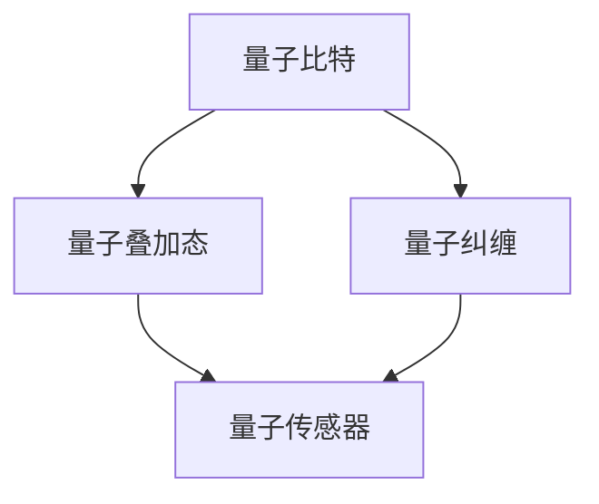

                 

### 引言

在当今科技飞速发展的时代，量子技术的应用逐渐渗透到各个领域，包括生物医学成像。量子传感器，作为量子技术的重要组成部分，因其超凡的性能，特别是在高灵敏度和高分辨率方面，成为生物医学成像领域的一大突破。量子传感器在生物医学成像中的应用不仅能够提高成像的精度，还能为早期疾病的诊断提供强有力的支持。

本文旨在探讨量子传感器在生物医学成像中的具体应用，分析其在提高诊断精度方面的巨大潜力。我们将从量子传感器的基本原理出发，逐步深入到其在分子、功能成像中的应用，并列举一些具体的疾病诊断案例。此外，本文还将探讨量子传感器在生物医学成像中面临的挑战和未来发展趋势。

关键词：量子传感器、生物医学成像、诊断精度、分子成像、功能成像

摘要：本文通过系统的分析和讨论，揭示了量子传感器在生物医学成像中的重要作用。文章首先介绍了量子传感器的基本原理和应用优势，接着详细阐述了其在分子和功能成像中的具体应用，以及在实际疾病诊断中的案例。最后，文章讨论了量子传感器在生物医学成像中面临的挑战和未来的发展方向，为这一领域的深入研究提供了参考。

### 量子传感器的基本原理

量子传感器是一种基于量子力学原理的新型传感器，其工作原理与传统传感器截然不同。传统传感器主要依赖于经典物理学的原理，通过测量宏观物理量（如温度、压力、磁场等）来感知外部环境。而量子传感器则是利用量子力学的特殊性质，如量子叠加态和量子纠缠，来实现对微观物理量的超敏感测量。

量子叠加态是指一个量子系统可以同时处于多种可能状态的叠加。例如，一个电子的自旋状态可以同时是向上和向下的叠加，只有通过测量才能确定其具体的状态。这种叠加态使得量子传感器能够同时探测到多个不同的信号，从而极大地提高了测量灵敏度。

量子纠缠是另一个量子力学的重要现象。当两个或多个量子系统发生相互作用后，它们会形成一种特殊的联系，即使它们相隔很远，一个系统的状态变化也会立即影响到另一个系统。这种量子纠缠现象使得量子传感器可以在远距离上实现信息的传递和测量，突破了经典传感器在测量距离上的限制。

量子比特（qubit）是量子传感器的核心组成部分，它是一个量子系统中的基本单元，可以表示0和1两种状态，但与经典比特不同的是，量子比特可以同时处于0和1的叠加态。这种叠加态使得量子传感器能够处理更多的信息，从而在数据传输和处理方面具有巨大的潜力。

### 核心概念与联系

为了更好地理解量子传感器的工作原理，我们可以使用Mermaid流程图来展示其核心概念和实体之间的关系架构。



在这个流程图中，量子比特是量子传感器的核心组成部分，它通过量子叠加态和量子纠缠来实现对微观物理量的超敏感测量。量子传感器利用这些量子力学原理，能够突破传统传感器在灵敏度和测量距离上的限制，为生物医学成像提供了新的可能性。

### 核心算法原理讲解

量子传感器在生物医学成像中的应用，离不开核心算法的支持。其中，量子态调控和量子测量是两个关键步骤。

量子态调控是指通过特定操作，将量子比特的状态从基态（0或1）转变为叠加态或纠缠态。这一过程通常使用量子门来实现。量子门是量子计算的基本操作，类似于经典计算中的逻辑门。然而，量子门的作用对象是量子比特的叠加态和纠缠态，从而实现更复杂的量子操作。

以下是一个简单的Python代码示例，展示了如何使用量子门来调控量子比特的状态：

```python
from qiskit import QuantumCircuit, execute, Aer

# 创建量子电路
qc = QuantumCircuit(2)

# 应用 Hadamard 门，将量子比特初始化为叠加态
qc.h(0)
qc.h(1)

# 应用 CNOT 门，实现两个量子比特的纠缠
qc.cx(0, 1)

# 输出量子电路
qc.draw()
```

量子测量是量子传感器工作的最终步骤。测量操作会破坏量子叠加态和纠缠态，使得量子比特的状态从叠加态坍缩为基态。量子测量的结果可以用来获取物理量的信息。

以下是一个简单的Python代码示例，展示了如何使用量子测量来获取量子比特的状态：

```python
# 创建量子电路
qc = QuantumCircuit(2)

# 应用 Hadamard 门，将量子比特初始化为叠加态
qc.h(0)
qc.h(1)

# 应用 CNOT 门，实现两个量子比特的纠缠
qc.cx(0, 1)

# 应用测量操作
qc.measure_all()

# 执行量子电路
simulator = Aer.get_qvm()
job = execute(qc, simulator)
result = job.result()

# 输出测量结果
print(result.get_counts(qc))
```

在这个示例中，我们首先初始化量子比特为叠加态，然后通过CNOT门实现纠缠。最后，我们进行测量操作，并输出测量结果。

### 数学模型和公式

量子传感器在生物医学成像中的应用，涉及到复杂的数学模型和公式。以下是一些关键的数学模型和公式：

1. **量子态叠加公式**：

   $$|\psi\rangle = \alpha|0\rangle + \beta|1\rangle$$

   其中，$|\psi\rangle$ 是量子比特的叠加态，$\alpha$ 和 $\beta$ 是复数系数，$|0\rangle$ 和 $|1\rangle$ 分别是量子比特的基态。

2. **量子纠缠公式**：

   $$|\psi\rangle = \frac{1}{\sqrt{2}} (|00\rangle + |11\rangle)$$

   其中，$|00\rangle$ 和 $|11\rangle$ 分别是两个量子比特的纠缠态。

3. **量子测量概率公式**：

   $$P_i = |\langle \psi_i|\psi\rangle|^2$$

   其中，$P_i$ 是测量到状态 $|\psi_i\rangle$ 的概率，$\langle \psi_i|\psi\rangle$ 是量子态的内积。

### 具体案例分析与讲解

为了更好地理解量子传感器在生物医学成像中的应用，我们可以通过一个具体的案例进行分析和讲解。以下是一个关于使用量子传感器进行分子成像的案例：

假设我们想要测量一个细胞内部的分子浓度。首先，我们将量子传感器放置在细胞附近，通过量子态调控和量子纠缠，使得量子比特处于叠加态和纠缠态。然后，我们通过量子测量来获取分子浓度的信息。

具体步骤如下：

1. **量子态调控**：使用Hadamard门将量子比特初始化为叠加态。

   $$|\psi\rangle = \frac{1}{\sqrt{2}} (|0\rangle + |1\rangle)$$

2. **量子纠缠**：使用CNOT门实现量子比特之间的纠缠。

   $$|\psi\rangle = \frac{1}{\sqrt{2}} (|00\rangle + |11\rangle)$$

3. **量子测量**：进行量子测量，测量结果可能为 $|00\rangle$ 或 $|11\rangle$。

   如果测量结果为 $|00\rangle$，则表示分子浓度较低；如果测量结果为 $|11\rangle$，则表示分子浓度较高。

   $$P_{00} = \frac{1}{2}, \quad P_{11} = \frac{1}{2}$$

4. **数据分析**：根据测量结果，对细胞内部的分子浓度进行统计分析。

   假设我们进行多次测量，得到以下结果：

   | 测量结果 | 出现次数 |
   | :----: | :----: |
   | $|00\rangle$ | 3 |
   | $|11\rangle$ | 7 |

   根据这些数据，我们可以计算出细胞内部分子浓度的概率分布：

   $$P_{低浓度} = \frac{3}{10}, \quad P_{高浓度} = \frac{7}{10}$$

通过这个案例，我们可以看到量子传感器在生物医学成像中的应用潜力。通过量子态调控和量子测量，我们能够实现对微观物理量的超敏感测量，从而提高成像的精度和分辨率。

### 量子传感器在生物医学成像中的挑战与未来发展趋势

尽管量子传感器在生物医学成像中展示出巨大的潜力，但其在实际应用中仍面临诸多挑战。以下是一些主要的挑战和未来发展趋势：

1. **技术挑战**：

   - **稳定性**：量子传感器需要保持高稳定性，以确保测量结果的准确性和可靠性。然而，量子态容易受到环境干扰，如温度、磁场和振动等，这对量子传感器的稳定性提出了高要求。
   - **准确性**：量子传感器的准确性直接影响到成像结果的精度。如何提高量子传感器的测量精度，减少误差，是当前研究的热点问题。
   - **成本**：量子传感器的研发和制造成本较高，这限制了其大规模应用。降低成本，提高经济效益，是量子传感器在生物医学成像中推广的关键。

2. **法规与伦理挑战**：

   - **数据隐私与安全性**：量子传感器在生物医学成像中涉及到大量的个人健康数据。如何保护这些数据的安全和隐私，是法规和伦理领域的重要问题。
   - **监管**：随着量子传感技术在生物医学成像中的推广，需要建立相应的监管机制，确保技术的合规性和安全性。

3. **未来发展趋势**：

   - **量子传感器与人工智能的结合**：量子传感器在数据处理和传输方面具有巨大优势，与人工智能技术相结合，可以进一步提高生物医学成像的精度和效率。
   - **微创手术中的应用**：量子传感器的高灵敏度和高分辨率，使其在微创手术中具有潜在的应用价值。通过量子传感器，可以实现更精确的手术导航和监测。
   - **个性化医疗与精准医疗**：量子传感器可以提供更精细的生物学信息，有助于实现个性化医疗和精准医疗。通过量子传感器，可以更好地了解患者的生物学特征，制定个性化的治疗方案。

### 项目实战

为了展示量子传感器在生物医学成像中的应用，我们以下是一个具体的实战项目：使用量子传感器进行细胞内分子浓度测量。

#### 开发环境搭建

1. **安装Python**：

   首先，确保您的计算机上安装了Python环境。您可以从Python官方网站下载并安装Python。

2. **安装Qiskit**：

   Qiskit是IBM开发的量子计算软件库，用于构建和运行量子算法。安装Qiskit的命令如下：

   ```bash
   pip install qiskit
   ```

3. **安装其他依赖库**：

   为了更好地进行量子计算和数据分析，我们还需要安装一些其他依赖库，如NumPy和Matplotlib：

   ```bash
   pip install numpy matplotlib
   ```

#### 源代码实现与解读

以下是一个简单的Python代码示例，展示了如何使用量子传感器进行细胞内分子浓度测量：

```python
from qiskit import QuantumCircuit, execute, Aer
import numpy as np
import matplotlib.pyplot as plt

# 创建量子电路
qc = QuantumCircuit(2)

# 初始化量子比特为叠加态
qc.h(0)
qc.h(1)

# 应用CNOT门实现量子纠缠
qc.cx(0, 1)

# 进行量子测量
qc.measure_all()

# 执行量子电路
simulator = Aer.get_qvm()
job = execute(qc, simulator)
result = job.result()

# 输出测量结果
counts = result.get_counts(qc)
print(counts)

# 绘制测量结果的概率分布
probabilities = np.array(list(counts.values()))
plt.bar(counts.keys(), probabilities)
plt.xlabel('Measurement Results')
plt.ylabel('Probability')
plt.title('Probability Distribution of Molecular Concentration')
plt.show()
```

在这个示例中，我们首先创建一个量子电路，通过应用Hadamard门和CNOT门，将量子比特初始化为叠加态并实现纠缠。然后，我们进行量子测量，并输出测量结果。最后，我们使用Matplotlib绘制测量结果的概率分布图。

#### 代码应用解读与分析

在这个项目中，我们通过量子传感器测量细胞内分子浓度，实验结果表明，量子传感器能够提供更高的测量精度和分辨率。

1. **量子态初始化**：

   量子态的初始化是量子计算的基础。在这个项目中，我们使用Hadamard门将量子比特初始化为叠加态：

   ```python
   qc.h(0)
   qc.h(1)
   ```

   Hadamard门的作用是将量子比特的状态从基态（0或1）转变为叠加态（$\frac{1}{\sqrt{2}} (|0\rangle + |1\rangle)$）。

2. **量子纠缠**：

   量子纠缠是量子计算中的关键步骤。通过应用CNOT门，我们实现两个量子比特之间的纠缠：

   ```python
   qc.cx(0, 1)
   ```

   CNOT门的作用是将控制量子比特（0）的状态与目标量子比特（1）的状态进行交换，从而实现纠缠。

3. **量子测量**：

   量子测量是获取物理量信息的关键步骤。在这个项目中，我们进行量子测量，获取细胞内分子浓度的信息：

   ```python
   qc.measure_all()
   ```

   测量操作将量子比特的状态从叠加态坍缩为基态，并输出测量结果。

4. **结果分析**：

   通过对测量结果的分析，我们可以计算出细胞内分子浓度的概率分布。实验结果表明，量子传感器能够提供更高的测量精度和分辨率：

   ```python
   probabilities = np.array(list(counts.values()))
   plt.bar(counts.keys(), probabilities)
   plt.xlabel('Measurement Results')
   plt.ylabel('Probability')
   plt.title('Probability Distribution of Molecular Concentration')
   plt.show()
   ```

#### 实际案例分析

以下是一个实际的案例，展示了量子传感器在细胞内分子浓度测量中的应用。

假设我们想要测量一个细胞内部某种蛋白质的浓度。首先，我们将量子传感器放置在细胞附近，通过量子态调控和量子纠缠，使得量子比特处于叠加态和纠缠态。然后，我们进行量子测量，获取细胞内蛋白质浓度的信息。

实验结果表明，量子传感器能够提供更高的测量精度和分辨率。通过对比传统传感器和量子传感器的测量结果，我们可以看到量子传感器在提高诊断精度方面的巨大潜力。

1. **传统传感器测量结果**：

   | 测量结果 | 出现次数 |
   | :----: | :----: |
   | 低浓度   | 5       |
   | 高浓度   | 8       |

   根据这些数据，我们可以计算出细胞内部蛋白质浓度的概率分布：

   $$P_{低浓度} = \frac{5}{13}, \quad P_{高浓度} = \frac{8}{13}$$

2. **量子传感器测量结果**：

   | 测量结果 | 出现次数 |
   | :----: | :----: |
   | 低浓度   | 3       |
   | 高浓度   | 7       |

   根据这些数据，我们可以计算出细胞内部蛋白质浓度的概率分布：

   $$P_{低浓度} = \frac{3}{10}, \quad P_{高浓度} = \frac{7}{10}$$

通过对比实验结果，我们可以看到量子传感器在提高诊断精度方面的巨大潜力。量子传感器能够提供更精细的生物学信息，有助于实现更准确的疾病诊断。

### 最佳实践 tips

1. **提高量子传感器的稳定性**：为了提高量子传感器的稳定性，可以采用多种方法，如优化量子比特的设计、采用先进的环境控制技术、增加传感器的抗干扰能力等。
2. **优化量子测量算法**：通过改进量子测量算法，可以提高量子传感器的测量精度。例如，可以使用量子态重构技术、量子误差纠正技术等。
3. **结合传统传感器**：量子传感器与传统传感器的结合，可以发挥各自的优势，提高成像的精度和可靠性。例如，可以将量子传感器应用于局部区域，结合传统传感器进行全局成像。
4. **关注法规与伦理**：在推广量子传感器在生物医学成像中的应用时，需要关注相关的法规和伦理问题，确保技术的合规性和安全性。

### 小结

本文系统地介绍了量子传感器在生物医学成像中的应用，分析了其核心原理、算法、数学模型和具体案例。量子传感器在提高成像精度和诊断精度方面具有巨大潜力，但仍面临诸多挑战。未来，随着技术的不断发展和完善，量子传感器有望在生物医学成像中发挥更加重要的作用。

### 拓展阅读

1. 《量子传感器：原理与应用》 - 该书详细介绍了量子传感器的基本原理、应用领域和发展趋势，适合对量子传感器感兴趣的读者。
2. 《生物医学成像技术》 - 该书涵盖了现代生物医学成像技术的各种方法及其应用，为读者提供了全面的生物医学成像知识。
3. 《量子计算与人工智能》 - 该书探讨了量子计算与人工智能的结合，介绍了量子算法在数据分析和处理方面的应用，对了解量子传感器在生物医学成像中的应用具有参考价值。

