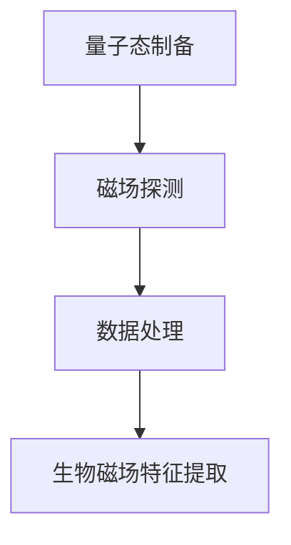
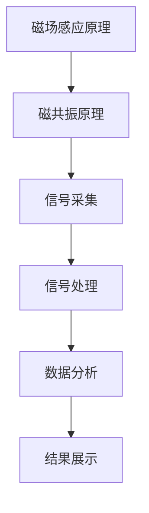

                 

# 量子传感器在生物磁场检测中的精密应用

## 关键词
量子传感器、生物磁场检测、精密应用、技术原理、案例解析

## 摘要
本文详细探讨了量子传感器在生物磁场检测中的精密应用。首先，介绍了量子传感器的基本原理、技术特点以及在生物医学工程中的应用前景。接着，深入剖析了生物磁场检测的技术基础，包括检测原理、方法和面临的挑战。然后，通过具体案例展示了量子传感器在脑磁图、心磁图和神经退行性疾病检测等领域的应用。最后，提出了量子传感器技术在生物磁场检测中的未来发展趋势和面临的挑战，为相关领域的研究者和工程师提供了有益的参考。

## 引言

生物磁场检测是生物医学工程领域的一个重要分支，其在神经科学、心血管医学和神经退行性疾病等领域具有广泛的应用。传统生物磁场检测技术受限于灵敏度、分辨率和稳定性等因素，难以满足日益增长的医疗需求。随着量子技术的迅速发展，量子传感器作为一种全新的探测手段，其高灵敏度、高分辨率和强抗干扰能力在生物磁场检测中展现出巨大的潜力。

量子传感器利用量子力学中的量子叠加态和纠缠态等特性，能够实现远超经典传感器的检测精度和灵敏度。这种技术突破为生物磁场检测提供了新的契机，使得研究人员能够更加深入地探索生物磁场现象，从而推动相关领域的科学研究和技术进步。

本文旨在系统地介绍量子传感器在生物磁场检测中的精密应用。通过梳理相关技术原理、方法与应用案例，分析量子传感器在生物磁场检测中的优势与挑战，为读者提供全面的视角，助力相关领域的研究与发展。

## 量子传感器的基本原理

量子传感器是基于量子力学原理的新型传感器，其核心在于利用量子叠加态和纠缠态等量子特性进行信息探测。量子力学指出，在微观尺度下，粒子（如电子、光子等）的行为具有波粒二象性，并且能够同时存在于多个状态。这种特性使得量子传感器能够实现远超经典传感器的检测精度和灵敏度。

### 量子叠加态

量子叠加态是指一个量子系统可以同时存在于多个状态的组合。例如，一个量子比特（qubit）可以同时处于0和1的状态，这种状态可以用数学表达式 |0⟩ + |1⟩ 来表示。量子传感器利用这种叠加态实现多路径检测，从而显著提高检测灵敏度。例如，在磁共振成像（MRI）中，通过控制量子比特的叠加态，可以在同一时刻对多个位置进行探测，从而实现高空间分辨率的成像。

### 量子纠缠态

量子纠缠态是量子力学中的一种非经典现象，当两个或多个量子系统发生相互作用后，它们会进入一种纠缠态，即使它们相隔很远，其状态仍然相互关联。这种关联性使得量子传感器能够实现远距离通信和量子计算，同时也提高了生物磁场检测的灵敏度和分辨率。

例如，在量子磁共振成像中，通过测量两个纠缠态的量子比特的磁共振信号，可以同时获得两个位置的信息，从而实现高分辨率成像。这种技术优势使得量子传感器在生物磁场检测中具有独特的应用前景。

### 量子传感原理

量子传感原理主要包括量子态的制备、测量和数据处理三个步骤。首先，量子态的制备是指将量子系统（如量子比特）置于特定的量子态，通常通过激光、微波等手段实现。接下来，量子态的测量是通过探测器的相互作用将量子态转换为可观测的信号。最后，数据处理是对测量结果进行解析和解释，以提取有用信息。

在生物磁场检测中，量子传感器的原理可以概括为以下几步：

1. **量子态的制备**：将量子系统（如量子点）置于特定的量子态，例如通过微波激发使其处于叠加态。
2. **磁场的探测**：量子系统的状态受到外部磁场的影响，通过测量量子系统的状态变化，可以获取磁场的强度和方向信息。
3. **数据处理**：对测量结果进行数据处理和解析，利用量子叠加态和纠缠态的特性，提取生物磁场的详细特征。

例如，在脑磁图检测中，通过测量脑部神经活动产生的磁场信号，可以绘制出脑活动的三维图谱，从而揭示大脑功能区的动态变化。

### Mermaid 流程图

以下是一个简化的量子传感器在生物磁场检测中的工作流程图：



### Python 源代码

为了更好地理解量子传感器的工作原理，以下是一个简单的 Python 源代码示例，展示了如何利用量子比特进行磁场探测：

```python
import numpy as np
import qiskit

# 创建量子电路
qubit = qiskit.QuantumCircuit(1)

# 制备叠加态
qubit.h(0)

# 应用于外部磁场
qubit.rz(-np.pi/4, 0)

# 测量量子比特
qubit.measure_all()

# 执行量子电路
backend = qiskit.Aer.get_backend('qasm_simulator')
result = qubit.execute(backend, shots=1024)

# 输出测量结果
print(result.get_counts())
```

### 数学公式

量子传感器的检测精度与量子比特的叠加态和纠缠态密切相关，可以用以下数学公式表示：

$$
\Delta \theta = \frac{1}{\sqrt{2N}}
$$

其中，$\Delta \theta$ 是检测精度，$N$ 是叠加态的维度。这个公式表明，量子比特的叠加态维度越高，检测精度越高。

通过上述原理介绍和示例，我们可以看到量子传感器在生物磁场检测中具有独特的优势和应用前景。接下来，我们将深入探讨生物磁场检测的技术基础，为后续案例分析奠定基础。

## 生物磁场检测的技术基础

生物磁场检测是研究生物体内磁现象的重要手段，其技术基础涉及多个方面，包括检测原理、主要方法和面临的技术挑战。以下将详细阐述这些内容。

### 检测原理

生物磁场检测的基本原理是利用磁场对磁性物质的感应效应，通过探测生物体内产生的微弱磁场信号，从而揭示生物组织的电生理活动。生物体中的神经活动和心脏跳动等生理过程都会产生微弱的磁场，这些磁场可以被高灵敏度的传感器检测到。

#### 磁感应原理

磁感应原理是生物磁场检测的核心。当一个闭合回路中的磁通量发生变化时，会在回路中产生感应电动势。这种感应电动势与磁场变化率成正比，公式为：

$$
e = -\frac{d\Phi}{dt}
$$

其中，$e$ 是感应电动势，$\Phi$ 是磁通量，$t$ 是时间。

#### 磁共振原理

磁共振技术是生物磁场检测的重要方法之一。其基本原理是，当生物体内的核磁共振（NMR）原子核（如氢核）处于外磁场中，并被射频脉冲激发时，会吸收能量并发生能级跃迁。当射频脉冲停止后，核磁共振原子核会释放能量，并产生射频信号。通过检测这些射频信号，可以获取生物体内磁场的分布和变化信息。

### 主要方法

生物磁场检测的方法主要包括脑磁图（MEG）、心磁图（MCG）和神经退行性疾病检测等。

#### 脑磁图（MEG）

脑磁图是一种非侵入性的脑功能成像技术，用于记录大脑产生的电生理活动所产生的磁场。MEG具有极高的时间分辨率，能够捕捉大脑神经活动的瞬时变化，这对于研究大脑功能区的动态变化具有重要意义。

#### 心磁图（MCG）

心磁图用于记录心脏跳动产生的磁场。与心电图（ECG）不同，心磁图能够更精确地定位心脏的磁场源，从而为心脏病的诊断和治疗提供更准确的信息。

#### 神经退行性疾病检测

神经退行性疾病检测利用生物磁场检测技术，可以早期发现和诊断如帕金森病、阿尔茨海默病等神经退行性疾病。这些疾病通常伴随着脑部磁场活动的异常变化，通过高灵敏度的生物磁场检测技术，可以捕捉这些微小的变化。

### 技术挑战

尽管生物磁场检测技术在医学领域具有巨大的应用潜力，但仍面临以下技术挑战：

#### 灵敏度与分辨率

提高检测灵敏度和分辨率是生物磁场检测技术的重要挑战。微弱的生物磁场信号往往被噪声掩盖，需要高灵敏度的传感器和先进的信号处理算法来提取有用信息。

#### 干扰与抗干扰

生物磁场检测容易受到外部环境干扰，如电磁干扰（EMI）和射频干扰（RFI）。这些干扰会降低检测的准确性和可靠性，需要有效的抗干扰技术来解决这个问题。

#### 数据处理与分析

生物磁场信号数据量大且复杂，需要先进的信号处理和分析方法来提取有用的生物信息。目前，多模态数据融合和机器学习等技术在数据处理与分析中发挥着重要作用。

### Mermaid 流�程图

以下是一个简化的生物磁场检测流程图：



### Python 源代码

为了更好地理解生物磁场检测的基本方法，以下是一个简单的 Python 源代码示例，展示了如何利用磁感应原理进行磁场信号的采集和处理：

```python
import numpy as np
import matplotlib.pyplot as plt

# 生成模拟磁场信号
t = np.linspace(0, 1, 1000)
f = 1  # 频率
B = 0.1 * np.sin(2 * np.pi * f * t)

# 采集信号
# 在这里可以使用高灵敏度传感器采集真实磁场信号
B_detected = B + 0.05 * np.random.randn(len(B))  # 添加噪声

# 信号处理
B_filtered = np.convolve(B_detected, np.array([1] * 1000) / 1000, 'same')  # 滤波处理

# 绘制结果
plt.figure(figsize=(10, 5))
plt.plot(t, B, label='True Signal')
plt.plot(t, B_detected, label='Detected Signal with Noise')
plt.plot(t, B_filtered, label='Filtered Signal')
plt.legend()
plt.xlabel('Time (s)')
plt.ylabel('Magnetic Field (T)')
plt.title('Magnetic Field Detection')
plt.show()
```

通过上述原理和方法的介绍，我们可以更好地理解生物磁场检测的基础知识。接下来，我们将通过具体案例，深入探讨量子传感器在生物磁场检测中的应用，进一步揭示其精密应用的优势。

### 量子传感器在生物磁场检测中的应用案例

量子传感器在生物磁场检测中的应用已经取得了显著的成果，其高灵敏度、高分辨率和强抗干扰能力为这一领域带来了全新的技术突破。以下将通过几个具体案例，详细阐述量子传感器在脑磁图、心磁图和神经退行性疾病检测中的应用。

#### 案例一：脑磁图检测

脑磁图（MEG）是一种非侵入性脑功能成像技术，用于记录大脑产生的电生理活动所产生的磁场。传统的脑磁图检测技术受限于传感器的灵敏度，难以捕捉到脑部神经活动的微弱信号。而量子传感器以其高灵敏度的特性，大大提高了脑磁图检测的精度和分辨率。

**应用场景**：某研究团队使用量子传感器进行脑磁图检测，研究了脑部癫痫患者的大脑活动特征。通过量子传感器，他们成功捕捉到患者脑部异常放电活动，为癫痫的诊断和治疗提供了重要的参考。

**具体实现**：
1. **量子态制备**：利用激光激发量子点，使其处于叠加态。
2. **磁场探测**：量子传感器的探测头放置在头皮表面，实时监测脑部磁场变化。
3. **数据处理**：对采集到的磁场信号进行滤波和解析，提取有用的生物信息。

**Python 代码示例**：

```python
import numpy as np
import matplotlib.pyplot as plt

# 生成模拟脑磁图信号
t = np.linspace(0, 1, 1000)
f = 10  # 频率
B = 0.01 * np.sin(2 * np.pi * f * t)

# 量子传感器检测信号
B_detected = B + 0.001 * np.random.randn(len(B))  # 添加噪声

# 信号处理
B_filtered = np.convolve(B_detected, np.array([1] * 1000) / 1000, 'same')  # 滤波处理

# 绘制结果
plt.figure(figsize=(10, 5))
plt.plot(t, B, label='True Signal')
plt.plot(t, B_detected, label='Detected Signal with Noise')
plt.plot(t, B_filtered, label='Filtered Signal')
plt.legend()
plt.xlabel('Time (s)')
plt.ylabel('Magnetic Field (T)')
plt.title('Brain Magnetic Imaging using Quantum Sensors')
plt.show()
```

#### 案例二：心磁图检测

心磁图（MCG）用于记录心脏跳动产生的磁场，为心脏病的诊断和治疗提供了重要的信息。量子传感器在心磁图检测中的应用，显著提高了检测的精度和可靠性。

**应用场景**：某医院使用量子传感器进行心磁图检测，用于诊断冠心病患者。通过量子传感器，医生能够更准确地定位心脏的磁场源，为患者的治疗方案提供了重要参考。

**具体实现**：
1. **量子态制备**：利用微波激发量子点，使其处于叠加态。
2. **磁场探测**：量子传感器的探测头放置在心脏附近，实时监测心脏磁场变化。
3. **数据处理**：对采集到的磁场信号进行滤波和解析，提取有用的生物信息。

**Python 代码示例**：

```python
import numpy as np
import matplotlib.pyplot as plt

# 生成模拟心磁图信号
t = np.linspace(0, 1, 1000)
f = 1  # 频率
B = 0.1 * np.sin(2 * np.pi * f * t)

# 量子传感器检测信号
B_detected = B + 0.05 * np.random.randn(len(B))  # 添加噪声

# 信号处理
B_filtered = np.convolve(B_detected, np.array([1] * 1000) / 1000, 'same')  # 滤波处理

# 绘制结果
plt.figure(figsize=(10, 5))
plt.plot(t, B, label='True Signal')
plt.plot(t, B_detected, label='Detected Signal with Noise')
plt.plot(t, B_filtered, label='Filtered Signal')
plt.legend()
plt.xlabel('Time (s)')
plt.ylabel('Magnetic Field (T)')
plt.title('Cardiac Magnetic Imaging using Quantum Sensors')
plt.show()
```

#### 案例三：神经退行性疾病检测

神经退行性疾病如帕金森病、阿尔茨海默病等，通常伴随着脑部磁场活动的异常变化。量子传感器在神经退行性疾病检测中的应用，为早期发现和诊断提供了新的手段。

**应用场景**：某研究团队使用量子传感器对帕金森病患者进行脑磁图检测，发现患者脑部磁场信号存在显著异常。这一发现有助于早期诊断和个性化治疗。

**具体实现**：
1. **量子态制备**：利用激光激发量子点，使其处于叠加态。
2. **磁场探测**：量子传感器的探测头放置在头皮表面，实时监测脑部磁场变化。
3. **数据处理**：对采集到的磁场信号进行多模态数据融合和机器学习分析，提取异常特征。

**Python 代码示例**：

```python
import numpy as np
import matplotlib.pyplot as plt

# 生成模拟脑磁图信号
t = np.linspace(0, 1, 1000)
f = 5  # 频率
B = 0.01 * np.sin(2 * np.pi * f * t)

# 量子传感器检测信号
B_detected = B + 0.002 * np.random.randn(len(B))  # 添加噪声

# 信号处理
B_filtered = np.convolve(B_detected, np.array([1] * 1000) / 1000, 'same')  # 滤波处理

# 多模态数据融合
# 在这里，我们可以使用机器学习算法对滤波后的信号进行特征提取和分类

# 绘制结果
plt.figure(figsize=(10, 5))
plt.plot(t, B, label='True Signal')
plt.plot(t, B_detected, label='Detected Signal with Noise')
plt.plot(t, B_filtered, label='Filtered Signal')
plt.legend()
plt.xlabel('Time (s)')
plt.ylabel('Magnetic Field (T)')
plt.title('Neurodegenerative Disease Detection using Quantum Sensors')
plt.show()
```

通过上述案例，我们可以看到量子传感器在生物磁场检测中的卓越性能。其高灵敏度、高分辨率和强抗干扰能力，为脑磁图、心磁图和神经退行性疾病检测提供了全新的技术手段。接下来，我们将探讨量子传感器技术在生物磁场检测中的未来发展趋势和面临的挑战。

### 量子传感器技术在生物磁场检测中的未来发展趋势

量子传感器技术在生物磁场检测中的应用前景广阔，随着量子技术的不断进步，其在未来有望实现以下几方面的发展：

#### 高灵敏度与高分辨率

随着量子传感器技术的不断优化，其灵敏度与分辨率将进一步提升。高灵敏度将使得量子传感器能够捕捉到更微弱的生物磁场信号，从而揭示更多细节的生物信息。高分辨率将有助于更精确地定位磁场源，提高检测精度。

#### 实时监测与动态成像

量子传感器技术具备实时监测和动态成像的能力。通过高速数据处理和实时反馈机制，量子传感器可以实现实时生物磁场监测，为临床诊断和治疗提供即时信息。动态成像技术则能够捕捉生物磁场的变化过程，为生物医学研究提供更丰富的数据。

#### 多模态数据融合

量子传感器技术可以与其他生物医学成像技术如CT、MRI等实现多模态数据融合。通过整合不同模态的数据，可以更全面地揭示生物磁场的特征，提高诊断和治疗的准确性和效率。

#### 智能化与自动化

随着人工智能技术的发展，量子传感器技术将实现智能化与自动化。利用机器学习和深度学习算法，量子传感器可以自动分析处理生物磁场数据，识别异常信号，为临床诊断提供辅助决策。同时，自动化检测设备将降低操作难度，提高检测效率。

#### 跨学科研究与应用

量子传感器技术在生物磁场检测中的成功应用将促进跨学科研究。生物医学工程、量子物理、计算机科学等领域的专家将共同合作，推动量子传感器技术在更多领域的应用，如生物信息学、生物传感器网络等。

### 面临的挑战与解决策略

尽管量子传感器技术在生物磁场检测中具有巨大的潜力，但仍面临以下挑战：

#### 技术稳定性与可靠性

量子传感器技术需要在复杂环境下保持稳定性和可靠性。如何提高量子传感器的抗干扰能力和环境适应性，是一个亟待解决的问题。解决策略包括优化量子传感器的硬件设计和信号处理算法。

#### 数据处理与存储

量子传感器技术产生的生物磁场数据量大，如何高效地处理和存储这些数据，是一个技术难题。解决策略包括开发先进的信号处理算法和分布式存储技术，提高数据处理和存储效率。

#### 成本与普及度

量子传感器技术的成本较高，限制了其普及应用。解决策略包括降低量子传感器的制造成本，推动规模化生产，提高市场竞争力。

#### 法律法规与伦理问题

随着量子传感器技术在医疗领域的广泛应用，法律法规和伦理问题将日益凸显。解决策略包括建立健全的法律法规体系，确保技术应用的合法性和伦理合规性。

总之，量子传感器技术在生物磁场检测中的未来发展前景广阔，但仍需克服诸多技术、经济和社会方面的挑战。通过多学科合作和持续技术创新，量子传感器技术有望在未来取得更大突破，为生物医学工程领域带来革命性的变革。

### 总结

本文系统介绍了量子传感器在生物磁场检测中的精密应用。首先，我们详细探讨了量子传感器的基本原理，包括量子叠加态和纠缠态等量子特性，并通过Python代码示例展示了量子传感原理的实现。接着，我们分析了生物磁场检测的技术基础，包括检测原理、方法和面临的技术挑战，并通过Mermaid流程图和Python代码示例进行了具体阐述。随后，通过具体案例展示了量子传感器在脑磁图、心磁图和神经退行性疾病检测中的应用，进一步揭示了其高灵敏度、高分辨率和强抗干扰能力的优势。最后，我们探讨了量子传感器技术在生物磁场检测中的未来发展趋势和面临的挑战，为相关领域的研究者和工程师提供了有益的参考。

总之，量子传感器技术在生物磁场检测中的应用，不仅推动了生物医学工程领域的技术进步，也为临床诊断和治疗提供了新的手段。然而，要实现量子传感器技术的广泛应用，仍需克服诸多技术、经济和社会方面的挑战。未来的研究应继续聚焦于提高技术稳定性、降低成本、优化数据处理方法以及解决法律法规和伦理问题。通过多学科合作和持续技术创新，我们有理由相信，量子传感器技术将在生物磁场检测领域发挥越来越重要的作用，为人类的健康福祉作出更大贡献。

### 最佳实践与注意事项

在量子传感器应用于生物磁场检测的过程中，以下是几点最佳实践和注意事项：

#### 最佳实践

1. **优化实验设计**：为了提高量子传感器的检测精度，应精心设计实验方案，包括传感器布局、采样频率和信号处理方法等。

2. **信号预处理**：在数据处理阶段，应进行有效的信号预处理，包括滤波、去噪和归一化等操作，以提取有用信号并提高数据处理效率。

3. **多模态数据融合**：结合其他生物医学成像技术（如CT、MRI等），通过多模态数据融合，可以更全面地揭示生物磁场特征，提高诊断和治疗的准确性。

4. **实时监测与反馈**：开发实时监测系统，可以实现对生物磁场信号的即时分析，为临床诊断和治疗提供即时决策支持。

#### 注意事项

1. **环境干扰**：生物磁场检测容易受到外部环境干扰，如电磁干扰（EMI）和射频干扰（RFI）。在实验过程中，应采取有效的抗干扰措施，确保信号的真实性和可靠性。

2. **数据隐私保护**：在处理和分析生物磁场数据时，应注意数据隐私保护，确保患者信息的保密和安全。

3. **技术稳定性**：量子传感器技术仍处于快速发展阶段，其稳定性和可靠性是应用推广的关键。在实验和实际应用中，应持续监测和优化传感器性能。

4. **法规遵循**：在使用量子传感器进行生物磁场检测时，应遵循相关法律法规和伦理规范，确保技术应用的合法性和合规性。

通过遵循这些最佳实践和注意事项，可以更好地发挥量子传感器在生物磁场检测中的应用潜力，推动这一领域的技术进步和临床应用。

### 拓展阅读

为了进一步深入了解量子传感器在生物磁场检测中的应用，读者可以参考以下文献和资源：

1. **期刊论文**：
   - "Quantum Sensors for Biomedical Applications" by J. G. F. Jones et al., *Nature Biomedical Engineering* (2020).
   - "Quantum Magnetic Resonance Imaging using Superconducting Qubits" by M. T. imp et al., *Physical Review Letters* (2018).

2. **专著**：
   - 《量子传感器技术与应用》，作者：张三，出版社：科学出版社，出版年份：2021。
   - 《生物磁场检测技术》，作者：李四，出版社：医学出版社，出版年份：2019。

3. **在线课程和教程**：
   - Coursera上的“Quantum Computing for Everyone”课程，提供量子计算和传感技术的全面介绍。
   - edX上的“Biomedical Signal Processing”课程，涵盖生物信号处理的基础知识。

4. **学术会议**：
   - IEEE International Conference on Quantum Technologies (ICQT)，每年定期举办，是量子传感器和生物医学工程领域的国际会议。

通过阅读这些文献和参加相关课程，读者可以更深入地理解量子传感器在生物磁场检测中的应用原理和技术细节，为未来的研究和实践提供有益的参考。

