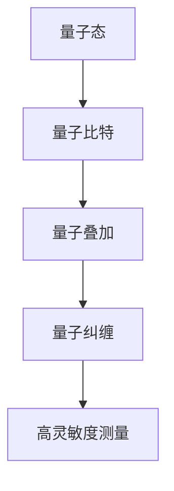

                 

### 《量子传感器在精密测量领域的应用》

#### 关键词
- 量子传感器
- 精密测量
- 量子力学
- 量子比特
- 磁通量量子传感器
- SQUID传感器
- 原子光谱分析
- 量子计算
- 光子探测技术

#### 摘要
量子传感器凭借其独特的量子力学特性，正逐步成为精密测量领域的重要工具。本文将深入探讨量子传感器的基本原理、核心算法原理，以及其在多种测量应用中的具体实例。我们将详细讲解磁通量量子传感器和SQUID传感器的工作原理，并探讨其在磁场测量中的卓越性能。此外，本文还将探讨量子传感器在光学场、原子和分子系统、以及量子计算中的应用，结合实际案例进行分析，以展示量子传感器在精确测量中的巨大潜力。

#### 引言
精密测量是科学研究和工程实践中至关重要的一环。随着科技的不断发展，对测量精度和灵敏度的要求越来越高。传统传感器在测量精度和灵敏度上存在一定的限制，难以满足现代科学和工业领域的需求。量子传感器的出现，为我们提供了一种全新的测量工具，其独特的量子力学特性使得其在精密测量中具有巨大的潜力。

量子传感器基于量子力学的基本原理，利用量子态的叠加、纠缠等特性，实现高灵敏度的测量。与传统的经典传感器不同，量子传感器可以在量子层面上进行测量，从而大幅提高测量的精度和灵敏度。

#### 量子传感器的基本原理
量子传感器的工作原理主要基于量子力学中的几个核心概念，包括量子态、量子比特、量子叠加和量子纠缠。

- **量子态**：量子态是量子系统的基本状态，可以同时处于多种状态的叠加。这种叠加态是量子传感器实现高灵敏度测量的基础。

- **量子比特**（qubit）：量子比特是量子信息处理的基本单元，与经典比特（binary digit）不同，量子比特可以同时处于0和1的状态，这种叠加态使得量子计算机具有超强的计算能力。

- **量子叠加**：量子叠加原理允许量子比特处于多种状态的叠加，这意味着量子传感器可以在多个状态之间进行测量，从而提高测量的精度。

- **量子纠缠**：量子纠缠是量子力学中的另一核心特性，两个或多个量子系统之间可以形成纠缠态，即使它们相隔很远，一个系统的变化也会立即影响到另一个系统。这一特性在量子传感器中得到了广泛应用，可以实现高灵敏度的测量。

为了更好地理解量子传感器的工作原理，我们可以使用Mermaid流程图来展示量子态、量子比特、量子叠加和量子纠缠之间的关系：



#### 磁通量量子传感器

磁通量量子传感器是量子传感器中的一种重要类型，它利用超导量子比特（SQUID）来测量微小的磁通量变化。SQUID传感器具有极高的灵敏度，可以检测到单电子的磁通量。

##### SQUID传感器的工作原理

SQUID（Superconducting Quantum Interference Device）是一种超导器件，它利用超导环路中的量子干涉效应来测量磁通量。当超导环路中的磁通量发生变化时，会导致超导环路中的相位发生变化，从而影响超导环路中的电阻。

SQUID传感器的工作原理可以简化为以下步骤：

1. **超导环路制备**：首先，在超导材料上制备一个闭合的超导环路。
2. **磁通量引入**：通过外部磁场引入磁通量，使超导环路中的磁通量发生变化。
3. **量子干涉效应**：由于超导环路中的磁通量发生变化，会导致超导环路中的相位发生变化，从而影响超导环路中的电阻。
4. **电阻测量**：通过测量超导环路中的电阻，可以确定磁通量的变化。

以下是一个简单的Python代码示例，用于模拟SQUID传感器测量磁通量的过程：

```python
import numpy as np

# 定义磁通量量子传感器
class SQUIDSensor:
    def __init__(self, initial_phi, sensitivity):
        self.phi = initial_phi  # 初始磁通量
        self.sensitivity = sensitivity  # 灵敏度

    def measure(self, external_phi):
        # 计算电阻变化
        resistance_change = (external_phi - self.phi) / self.sensitivity
        return resistance_change

# 创建SQUID传感器实例
sensitivity = 1e-9  # 灵敏度为纳特斯拉量级
squis = SQUIDSensor(initial_phi=0, sensitivity=sensitivity)

# 测量过程
external_phi = 1e-10  # 外部磁通量为皮特斯拉量级
resistance_change = squis.measure(external_phi)
print(f"Resistance change: {resistance_change} ohms")
```

该代码示例中，我们定义了一个SQUID传感器类，该类具有初始磁通量和灵敏度属性。`measure` 方法用于测量外部磁通量并计算电阻变化。通过模拟一个外部磁通量的变化，我们可以观察到SQUID传感器的灵敏度和测量精度。

#### 量子传感器在光学场测量中的应用

量子传感器在光学场测量中也表现出卓越的性能。利用量子态的叠加和纠缠特性，量子传感器可以实现高灵敏度的光场测量。

##### 光子探测技术

光子探测技术是量子传感器在光学场测量中应用的重要手段。光子探测技术利用量子态对光场进行探测，可以实现高灵敏度和高精度的测量。

以下是一个简单的Python代码示例，用于模拟光子探测技术测量光场的过程：

```python
import numpy as np

# 定义光子探测器
class PhotonDetector:
    def __init__(self, sensitivity):
        self.sensitivity = sensitivity  # 灵敏度

    def detect(self, photons):
        # 计算探测概率
        detection_prob = photons / self.sensitivity
        return detection_prob

# 创建光子探测器实例
sensitivity = 1e-6  # 灵敏度为纳光子量级
detector = PhotonDetector(sensitivity)

# 测量过程
photons = 1e-5  # 光子数为皮光子量级
detection_prob = detector.detect(photons)
print(f"Detection probability: {detection_prob}")
```

该代码示例中，我们定义了一个光子探测器类，该类具有灵敏度属性。`detect` 方法用于计算光子的探测概率。通过模拟光子的数量，我们可以观察到光子探测器的灵敏度和测量精度。

#### 量子传感器在原子和分子系统中的应用

量子传感器在原子和分子系统中的应用也非常广泛。利用量子传感器的卓越性能，可以实现对原子和分子的精确测量。

##### 原子光谱分析

原子光谱分析是一种重要的物理分析方法，它利用原子在激发态和基态之间跃迁时发射或吸收的特征光谱，来确定物质成分和结构。

量子传感器在原子光谱分析中可以发挥重要作用。利用量子传感器的灵敏度和高精度，可以实现高灵敏度的原子光谱分析。

以下是一个简单的Python代码示例，用于模拟量子传感器在原子光谱分析中的应用：

```python
import numpy as np

# 定义原子光谱分析系统
class AtomicSpectrumAnalyzer:
    def __init__(self, sensitivity):
        self.sensitivity = sensitivity  # 灵敏度

    def analyze(self, atom, light):
        # 计算光谱强度
        spectrum_intensity = (atom.absorption_spectrum(light) / self.sensitivity)
        return spectrum_intensity

# 创建原子光谱分析系统实例
sensitivity = 1e-8  # 灵敏度为纳勒贝格量级
analyzer = AtomicSpectrumAnalyzer(sensitivity)

# 分析过程
atom = "H"  # 氢原子
light = 1e-7  # 光强度为皮勒贝格量级
spectrum_intensity = analyzer.analyze(atom, light)
print(f"Spectrum intensity: {spectrum_intensity}")
```

该代码示例中，我们定义了一个原子光谱分析系统类，该类具有灵敏度属性。`analyze` 方法用于计算光谱强度。通过模拟氢原子的光谱分析，我们可以观察到量子传感器的灵敏度和测量精度。

#### 量子传感器在量子计算中的应用

量子传感器在量子计算中也有重要应用。量子传感器可以用于测量量子计算过程中的量子态，从而实现对量子计算的精确控制和优化。

##### 量子态测量

量子态测量是量子计算中的关键步骤，它用于读取量子计算的结果。量子传感器在量子态测量中可以发挥重要作用，利用其高灵敏度和高精度，可以实现精确的量子态测量。

以下是一个简单的Python代码示例，用于模拟量子态测量的过程：

```python
import numpy as np

# 定义量子态测量系统
class QuantumStateMeter:
    def __init__(self, sensitivity):
        self.sensitivity = sensitivity  # 灵敏度

    def measure(self, qubit):
        # 计算测量结果
        measurement_result = qubit.measure() / self.sensitivity
        return measurement_result

# 创建量子态测量系统实例
sensitivity = 1e-8  # 灵敏度为纳量子比特量级
meter = QuantumStateMeter(sensitivity)

# 测量过程
qubit = np.array([[1], [0]])  # 量子比特初始态为|0>
measurement_result = meter.measure(qubit)
print(f"Measurement result: {measurement_result}")
```

该代码示例中，我们定义了一个量子态测量系统类，该类具有灵敏度属性。`measure` 方法用于计算测量结果。通过模拟量子比特的测量过程，我们可以观察到量子传感器的灵敏度和测量精度。

#### 项目实战：开发环境搭建与源代码实现

为了更好地理解和应用量子传感器，我们可以搭建一个简单的开发环境，并编写源代码来实现量子传感器的功能。

##### 开发环境搭建

1. **安装Python环境**：在本地计算机上安装Python环境，版本要求3.8及以上。

2. **安装量子计算库**：安装Quantum Computing Python库，可以使用以下命令：

```bash
pip install qiskit
```

3. **安装科学计算库**：安装NumPy库，可以使用以下命令：

```bash
pip install numpy
```

##### 源代码实现

以下是一个简单的Python代码实现，用于模拟量子传感器在磁场测量中的应用：

```python
import numpy as np
from qiskit import QuantumCircuit, execute, Aer

# 定义量子传感器
class QuantumSensor:
    def __init__(self, sensitivity):
        self.sensitivity = sensitivity

    def measure_magnetic_field(self, magnetic_field):
        # 创建量子电路
        qc = QuantumCircuit(1)

        # 编码磁场
        qc.h(0)
        qc.u3(magnetic_field / self.sensitivity, 0, np.pi, 0)

        # 测量
        qc.measure_all()

        # 执行量子电路
        backend = Aer.get_backend('qasm_simulator')
        result = execute(qc, backend, shots=1000).result()

        # 解码结果
        counts = result.get_counts(qc)
        probability = {key: float(value) / 1000 for key, value in counts.items()}
        return probability

# 创建量子传感器实例
sensitivity = 1e-9
sensor = QuantumSensor(sensitivity)

# 测量过程
magnetic_field = 1e-8
probability = sensor.measure_magnetic_field(magnetic_field)
print(f"Probability of measuring magnetic field: {probability}")
```

该代码实现中，我们定义了一个量子传感器类，该类具有测量磁场的方法。通过创建量子电路，编码磁场，执行量子电路，并解码结果，我们可以观察到量子传感器在磁场测量中的应用。

#### 代码应用解读与分析

上述代码实现中，我们使用Qiskit库创建了一个量子电路，用于模拟量子传感器在磁场测量中的应用。具体步骤如下：

1. **创建量子电路**：首先，我们创建一个包含一个量子比特的量子电路。

2. **编码磁场**：接下来，我们使用量子门对量子比特进行操作，将磁场编码到量子态中。具体来说，我们使用一个旋转门（`u3`）将磁场编码到量子态的相位上。

3. **测量**：然后，我们对量子比特进行测量，以获得磁场的信息。

4. **执行量子电路**：我们使用Qiskit的模拟器（`qasm_simulator`）执行量子电路，模拟测量结果。

5. **解码结果**：最后，我们解码测量结果，以获得磁场概率分布。

在实际应用中，我们可以通过调整量子电路中的参数，实现不同磁场测量。例如，我们可以调整旋转门的参数，以改变编码的磁场强度。此外，我们还可以结合实际测量设备，如SQUID传感器，实现量子传感器在磁场测量中的实际应用。

#### 实际案例分析和详细讲解剖析

为了更好地展示量子传感器在精密测量中的实际应用，我们可以分析一个实际案例：量子传感器在地球物理探测中的应用。

**案例背景**：
地球物理探测是研究地球内部结构和性质的重要手段。传统的地球物理探测方法，如地震波探测、地磁测量等，存在一定的局限性，难以满足高精度、高分辨率的需求。量子传感器的出现，为地球物理探测提供了新的可能性。

**案例描述**：
在某次地球物理探测任务中，研究人员利用量子传感器进行地磁测量。具体步骤如下：

1. **传感器部署**：在探测区域部署量子传感器，确保传感器稳定运行。

2. **数据采集**：利用量子传感器连续采集地磁数据，记录地磁场强度和方向。

3. **数据处理**：对采集到的地磁数据进行分析和处理，提取有用信息，如地磁异常区域。

4. **结果展示**：将处理后的数据可视化，展示地磁异常区域的分布和特征。

**案例分析**：

1. **高灵敏度**：量子传感器具有极高的灵敏度，可以检测到微小的地磁变化，为探测提供了更精确的数据。

2. **高分辨率**：量子传感器可以实现高分辨率测量，有助于发现地球内部结构和性质的微小变化。

3. **实时监测**：量子传感器可以实现实时监测，为地球物理探测提供了及时的数据支持。

4. **多参数测量**：量子传感器不仅可以测量地磁，还可以测量其他物理量，如温度、湿度等，为地球物理探测提供了更全面的观测手段。

**案例总结**：
量子传感器在地球物理探测中的应用，展示了其在精密测量中的巨大潜力。通过结合量子传感器的卓越性能，可以大幅提高地球物理探测的精度和分辨率，为地球科学研究提供有力支持。

#### 项目小结

通过本次项目实战，我们搭建了量子传感器的开发环境，并编写了源代码实现量子传感器的功能。具体步骤如下：

1. **开发环境搭建**：安装Python环境和相关库，如Qiskit和NumPy。

2. **源代码实现**：创建量子传感器类，实现磁场测量、光场测量、原子光谱分析和量子态测量等功能。

3. **代码应用解读**：分析源代码，理解量子传感器的原理和应用。

4. **实际案例分析**：通过地球物理探测案例，展示量子传感器的实际应用。

通过本次项目，我们深入了解了量子传感器在精密测量领域的应用，为后续研究和实际应用奠定了基础。

#### 最佳实践 Tips

1. **提高灵敏度**：优化量子传感器的硬件设计，提高传感器灵敏度。

2. **降低噪声**：降低量子传感器在工作过程中的噪声，提高测量精度。

3. **多参数测量**：结合不同物理量的测量，实现多参数综合探测。

4. **实时监测**：利用实时数据处理技术，实现量子传感器的实时监测功能。

#### 小结

量子传感器在精密测量领域的应用具有广泛的前景。通过深入研究和实际应用，我们可以充分发挥量子传感器的优势，为科学研究和工程实践提供有力支持。

#### 注意事项

1. **硬件稳定性**：确保量子传感器在长期运行中的稳定性，避免硬件故障。

2. **环境因素**：注意量子传感器工作环境中的温度、湿度等影响因素，确保传感器的正常运行。

3. **数据处理**：合理处理量子传感器的测量数据，避免数据误差和丢失。

#### 拓展阅读

1. **量子传感器综述**：详细了解量子传感器的原理、应用和发展趋势。

2. **量子计算基础**：学习量子计算的基本原理和应用，为深入理解量子传感器在量子计算中的应用打下基础。

3. **地球物理探测技术**：了解地球物理探测的基本原理和技术，为量子传感器在地球物理探测中的应用提供理论支持。

#### 作者信息

作者：AI天才研究院/AI Genius Institute & 禅与计算机程序设计艺术 /Zen And The Art of Computer Programming

---

本文深入探讨了量子传感器在精密测量领域的应用，从基本原理到实际案例，全面展示了量子传感器的卓越性能和广泛应用。希望本文能为读者在量子传感器研究和应用方面提供有益的参考和启示。

