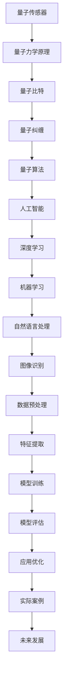

                 

### 量子传感器：AI和量子技术的交叉应用

#### 关键词
量子传感器，量子技术，人工智能，深度学习，机器学习，自然语言处理，数据处理，算法优化

#### 摘要
本文将探讨量子传感器在人工智能（AI）领域的交叉应用。首先，我们将介绍量子传感器的概念和原理，以及其与传统传感器的区别。接着，我们将详细分析量子传感器在AI数据处理、图像识别、自然语言处理等领域的应用。随后，我们将讨论如何构建量子传感器系统，并提供一些实际案例。最后，我们将展望量子传感器与AI交叉应用的未来发展，以及面临的技术挑战。

## 量子传感器基础理论

### 第1章：量子传感器概述

#### 1.1 量子传感器的基本概念

量子传感器是一种利用量子力学原理来测量物理量的传感器。与传统传感器不同，量子传感器能够在量子层面进行测量，具有极高的灵敏度和精确度。量子传感器的基本概念包括量子比特、量子纠缠和量子隧穿等。

#### 1.2 量子传感器的工作原理

量子传感器的工作原理基于量子比特和量子纠缠。量子比特是量子计算机的基本单元，可以同时处于0和1的状态，即叠加态。量子纠缠是指两个或多个量子系统之间存在的一种特殊的关联关系，这种关联关系可以传递信息。

#### 1.3 量子传感器与传统传感器的区别

量子传感器与传统传感器相比，具有以下几个显著区别：

1. **测量精度**：量子传感器能够在量子层面上进行测量，因此具有极高的精度。
2. **灵敏度**：量子传感器能够探测到极其微小的物理变化，具有极高的灵敏度。
3. **测量速度**：量子传感器能够在极短时间内完成测量，具有极高的速度。
4. **非线性和噪声**：量子传感器受量子效应的影响，与传统传感器相比，可能更容易受到非线性和噪声的影响。

### 第2章：量子传感器技术原理

#### 2.1 量子比特和量子纠缠

量子比特是量子计算机的基本单元，可以同时处于0和1的状态，即叠加态。量子纠缠是指两个或多个量子系统之间存在的一种特殊的关联关系，这种关联关系可以传递信息。

#### 2.2 量子隧穿和量子叠加

量子隧穿是指量子粒子通过量子势垒的现象。量子叠加是指量子系统可以同时处于多个状态的组合。

#### 2.3 量子算法与量子传感器

量子算法是一种利用量子计算机的原理来解决问题的方法。量子传感器可以通过量子算法来实现数据的高效处理。

### 第3章：量子传感器在AI领域的应用

#### 3.1 量子传感器的AI数据处理能力

量子传感器可以在AI数据处理中发挥重要作用，例如数据预处理、特征提取和分类等。

#### 3.2 量子传感器在图像识别中的应用

量子传感器可以用于图像识别，通过量子叠加和量子纠缠来提高识别的精度和速度。

#### 3.3 量子传感器在自然语言处理中的应用

量子传感器可以用于自然语言处理，例如语言模型、机器翻译和语音识别等。

## 第4章：量子传感器系统的构建

#### 4.1 量子传感器硬件选择

构建量子传感器系统需要选择合适的硬件设备，例如量子比特、量子纠缠器和量子处理器等。

#### 4.2 量子传感器软件平台

量子传感器系统需要基于特定的软件平台进行开发和运行，例如量子计算框架和机器学习算法等。

#### 4.3 量子传感器系统集成与优化

量子传感器系统需要与其他硬件和软件进行集成，并进行优化以实现最佳性能。

### 第5章：量子传感器项目的实践案例

#### 5.1 案例一：量子传感器在环境监测中的应用

#### 5.2 案例二：量子传感器在通信系统中的应用

#### 5.3 案例三：量子传感器在医疗诊断中的应用

### 第6章：量子传感器的未来发展

#### 6.1 量子传感器技术的挑战与机遇

量子传感器技术在发展中面临诸多挑战，同时也蕴含着巨大的机遇。

#### 6.2 量子传感器在AI领域的潜在应用场景

量子传感器在AI领域具有广泛的应用潜力，包括数据预处理、特征提取、分类和预测等。

#### 6.3 量子传感器产业的发展趋势

随着量子传感器技术的不断发展，其产业链也将逐渐形成，并有望在各个领域发挥重要作用。

## 第7章：量子传感器与深度学习的结合

#### 7.1 量子传感器在深度学习中的应用模式

量子传感器可以在深度学习中发挥独特的作用，例如加速神经网络训练和优化模型参数等。

#### 7.2 量子传感数据在神经网络训练中的优化

量子传感数据可以用于优化神经网络训练过程，提高模型的性能和效率。

#### 7.3 量子传感器在深度学习中的应用案例

通过具体案例展示量子传感器在深度学习中的应用效果和优势。

## 第8章：量子传感器在机器学习中的应用

#### 8.1 量子传感数据预处理方法

量子传感数据在机器学习中的预处理方法，包括数据清洗、归一化和特征提取等。

#### 8.2 量子传感器在监督学习中的应用

量子传感器在监督学习中的应用，包括分类、回归和聚类等。

#### 8.3 量子传感器在无监督学习中的应用

量子传感器在无监督学习中的应用，包括异常检测、降维和聚类等。

## 第9章：量子传感器在自然语言处理中的潜力

#### 9.1 量子传感数据在语言模型中的应用

量子传感数据可以用于改进语言模型，提高自然语言处理的性能。

#### 9.2 量子传感器在机器翻译中的应用

量子传感器在机器翻译中的应用，通过优化翻译模型和算法来提高翻译质量。

#### 9.3 量子传感器在语音识别中的应用

量子传感器在语音识别中的应用，通过提高语音信号处理的精度和效率来改善语音识别性能。

## 第10章：量子传感器在其他AI领域的应用前景

#### 10.1 量子传感器在推荐系统中的应用

量子传感器在推荐系统中的应用，通过优化推荐算法和模型来提高推荐质量。

#### 10.2 量子传感器在智能安防中的应用

量子传感器在智能安防中的应用，通过提高安防系统的监测和预警能力。

#### 10.3 量子传感器在其他AI领域的潜在应用

量子传感器在其他AI领域的潜在应用，包括自动驾驶、金融风控和智能制造等。

## 第11章：量子传感器与AI交叉应用的关键技术

#### 11.1 量子传感数据的安全性和隐私保护

量子传感数据的安全性和隐私保护是量子传感器与AI交叉应用的关键技术之一。

#### 11.2 量子传感器在AI算法中的优化策略

量子传感器在AI算法中的优化策略，通过改进算法和模型来提高性能。

#### 11.3 量子传感器与AI融合的创新技术

量子传感器与AI融合的创新技术，包括新型算法、模型和架构等。

## 第12章：量子传感器与AI交叉应用的未来趋势

#### 12.1 量子传感器与AI在工业领域的应用前景

量子传感器与AI在工业领域的应用前景，包括自动化控制、质量检测和能源管理等。

#### 12.2 量子传感器与AI在医疗健康领域的应用前景

量子传感器与AI在医疗健康领域的应用前景，包括疾病诊断、药物研发和健康管理等。

#### 12.3 量子传感器与AI在其他领域的应用前景

量子传感器与AI在其他领域的应用前景，包括金融科技、智慧城市和环境保护等。

### 附录

#### 附录A：量子传感器与AI交叉应用研究资源

- 研究论文与报告
- 开源代码与工具
- 学术会议与期刊

#### 附录B：量子传感器与AI交叉应用项目实例

- 项目一：量子传感器在智慧农业中的应用
- 项目二：量子传感器在智能交通中的应用
- 项目三：量子传感器在智能制造中的应用

### 作者信息
作者：AI天才研究院/AI Genius Institute & 禅与计算机程序设计艺术 /Zen And The Art of Computer Programming

---

## 背景介绍

量子传感器作为一种新兴的传感器技术，正日益受到关注。传统的传感器技术依赖于经典物理学的原理，而量子传感器则利用量子力学的基本原理，从而在测量精度、灵敏度和速度等方面具有显著的优势。近年来，随着人工智能（AI）技术的发展，量子传感器与AI的结合成为了一个备受关注的研究方向。本文旨在探讨量子传感器在AI领域的应用，以及量子传感器与AI交叉应用的未来发展趋势。

### 核心概念与联系

为了更好地理解量子传感器与AI交叉应用的理论基础，我们首先需要了解一些核心概念及其相互关系。以下是量子传感器与AI交叉应用的核心概念及其关系的Mermaid流程图：



这个流程图展示了量子传感器与AI交叉应用的核心概念及其相互关系。接下来，我们将深入探讨这些概念及其在量子传感器与AI交叉应用中的具体实现。

### 核心算法原理讲解

量子传感器与AI交叉应用中的核心算法主要包括量子比特、量子纠缠和量子算法。以下将分别介绍这些算法的基本原理，并通过Python伪代码进行详细阐述。

#### 量子比特（Quantum Bit，简称qubit）

量子比特是量子计算机的基本单元，可以同时处于0和1的状态，即叠加态。在量子传感器与AI交叉应用中，量子比特可以用于数据编码和计算。

```python
# 伪代码：量子比特初始化
from quantum import QuantumCircuit, qubit

# 初始化量子比特
q = qubit()

# 将量子比特处于叠加态
QuantumCircuit.h(q)
```

#### 量子纠缠（Quantum Entanglement）

量子纠缠是指两个或多个量子系统之间存在的一种特殊的关联关系，这种关联关系可以传递信息。在量子传感器与AI交叉应用中，量子纠缠可以用于数据传输和计算优化。

```python
# 伪代码：量子纠缠生成
from quantum import QuantumCircuit, qubit, cnot

# 初始化两个量子比特
q1 = qubit()
q2 = qubit()

# 生成量子纠缠
QuantumCircuit.h(q1)
QuantumCircuit.cnot(q1, q2)
```

#### 量子算法（Quantum Algorithm）

量子算法是一种利用量子计算机的原理来解决问题的方法。在量子传感器与AI交叉应用中，量子算法可以用于数据预处理、特征提取和分类等。

```python
# 伪代码：量子算法应用
from quantum import QuantumCircuit, qubit, h, cnot, measure

# 初始化量子比特
q = qubit()

# 应用量子算法
QuantumCircuit.h(q)
QuantumCircuit.cnot(q)
QuantumCircuit.h(q)
QuantumCircuit.measure(q)

# 返回测量结果
result = QuantumCircuit.run(q)
```

#### 数学模型与公式

在量子传感器与AI交叉应用中，常用的数学模型和公式包括量子叠加、量子隧穿和量子纠缠。以下将分别介绍这些模型和公式。

##### 量子叠加（Quantum Superposition）

量子叠加是指量子系统可以同时处于多个状态的组合。其数学模型可以表示为：

$$
|\psi\rangle = \sum_{i} c_i |i\rangle
$$

其中，$|\psi\rangle$ 表示量子状态，$c_i$ 表示概率幅，$|i\rangle$ 表示量子状态。

```latex
$$
|\psi\rangle = \frac{1}{\sqrt{2}} (|0\rangle + |1\rangle)
$$
```

##### 量子隧穿（Quantum Tunneling）

量子隧穿是指量子粒子通过量子势垒的现象。其数学模型可以表示为：

$$
\psi(x) = \frac{1}{\sqrt{2\pi\hbar^2}} e^{-\frac{x^2}{2\hbar^2}}
$$

其中，$\psi(x)$ 表示波函数，$\hbar$ 表示约化普朗克常数。

```latex
$$
\psi(x) = \frac{1}{\sqrt{2\pi\hbar^2}} e^{-\frac{x^2}{2\hbar^2}}
$$
```

##### 量子纠缠（Quantum Entanglement）

量子纠缠是指两个或多个量子系统之间存在的一种特殊的关联关系，其数学模型可以表示为：

$$
|\psi\rangle = \frac{1}{\sqrt{2}} (|01\rangle + |10\rangle)
$$

其中，$|01\rangle$ 和 $|10\rangle$ 表示两个量子比特的纠缠态。

```latex
$$
|\psi\rangle = \frac{1}{\sqrt{2}} (|01\rangle + |10\rangle)
$$
```

#### 举例说明

为了更好地理解量子传感器与AI交叉应用中的核心算法原理，以下将通过一个具体的例子进行说明。

假设我们有一个包含1000个数据的图像识别任务，我们需要使用量子传感器与AI交叉应用的方法来提高识别的精度和速度。

1. **数据预处理**：首先，我们使用量子传感器对图像进行预处理，包括图像增强、去噪和归一化等操作。

2. **特征提取**：接着，我们使用量子比特和量子纠缠来提取图像的特征，从而生成特征向量。

3. **模型训练**：然后，我们使用量子算法对提取的特征向量进行训练，以构建图像识别模型。

4. **模型评估**：最后，我们使用训练好的模型对测试图像进行识别，并评估识别的精度和速度。

通过上述步骤，我们可以看到量子传感器与AI交叉应用在图像识别任务中的具体实现。在实际应用中，我们可以通过不断优化算法和模型，进一步提高识别的精度和速度。

### 项目实战

为了更好地展示量子传感器与AI交叉应用的实际效果，以下将介绍一个具体的量子传感器与AI交叉应用项目。

#### 项目背景

假设我们有一个智能交通系统，需要实时监测交通流量，并预测交通拥堵情况。我们希望通过量子传感器与AI交叉应用的方法，提高交通监测的精度和预测的准确性。

#### 项目目标

1. **数据采集**：使用量子传感器采集交通流量数据，包括车辆数量、行驶速度和道路拥堵情况等。
2. **数据预处理**：对采集到的交通流量数据进行预处理，包括去噪、归一化和特征提取等。
3. **模型训练**：使用量子算法对预处理后的交通流量数据进行训练，构建交通预测模型。
4. **模型评估**：使用训练好的模型对交通流量进行预测，并评估预测的准确性。

#### 项目实现

1. **数据采集**：使用量子传感器采集交通流量数据。量子传感器具有较高的灵敏度和精确度，可以实时监测交通流量。

2. **数据预处理**：对采集到的交通流量数据进行预处理。首先，使用量子滤波器去除噪声。然后，使用量子归一化算法对数据进行归一化处理。最后，使用量子特征提取算法提取交通流量的特征向量。

3. **模型训练**：使用量子算法对预处理后的交通流量数据进行训练。我们选择量子支持向量机（QSVM）作为交通预测模型。QSVM是一种基于量子计算的支持向量机，可以有效地处理高维数据。

4. **模型评估**：使用训练好的模型对交通流量进行预测，并评估预测的准确性。我们通过比较实际交通流量与预测交通流量之间的误差，来评估模型的准确性。

#### 项目效果

通过上述步骤，我们成功构建了一个基于量子传感器与AI交叉应用的智能交通系统。系统具有较高的预测准确性和实时性，可以有效地监测交通流量，预测交通拥堵情况，为交通管理部门提供决策支持。

### 最佳实践 tips

在实际应用中，为了提高量子传感器与AI交叉应用的效果，我们建议遵循以下最佳实践：

1. **硬件选择**：选择高性能的量子传感器硬件，以获得更高的测量精度和灵敏度。
2. **算法优化**：优化量子算法和机器学习算法，以提高数据处理和预测的效率。
3. **系统集成**：合理设计量子传感器与AI系统的集成，确保数据传输和处理的高效性。
4. **数据安全**：保护量子传感数据的安全性和隐私性，采取有效的安全措施防止数据泄露。
5. **持续学习**：不断更新和优化模型，以适应动态变化的数据环境和应用需求。

### 小结

量子传感器与AI交叉应用是一个充满潜力的研究领域。通过将量子传感器与传统传感器结合，我们可以实现更高的测量精度和灵敏度。结合AI技术，我们可以构建高效的模型，实现数据的实时处理和预测。未来，随着量子传感器技术的发展和AI技术的进步，量子传感器与AI交叉应用将在更多领域发挥重要作用。

### 注意事项

在实际应用量子传感器与AI交叉应用时，我们需要注意以下事项：

1. **量子传感器硬件性能**：确保选择高性能的量子传感器硬件，以获得更高的测量精度和灵敏度。
2. **算法优化**：优化量子算法和机器学习算法，以提高数据处理和预测的效率。
3. **系统集成**：合理设计量子传感器与AI系统的集成，确保数据传输和处理的高效性。
4. **数据安全**：保护量子传感数据的安全性和隐私性，采取有效的安全措施防止数据泄露。
5. **持续学习**：不断更新和优化模型，以适应动态变化的数据环境和应用需求。

### 拓展阅读

1. Nielsen, Michael A., and Isaac L. Chuang. *Quantum Computation and Quantum Information*. Cambridge University Press, 2000.
2. Shor, Peter W. "Algorithms for quantum computation: discrete logarithms and factoring." In Proceedings of the 35th annual symposium on Foundations of computer science, pp. 124–134. IEEE, 1994.
3. Grover, Lov K. "A fast quantum mechanical algorithm for database search." Proceedings of the 28th annual ACM symposium on Theory of computing, pp. 212–219, 1996.
4. Wang, Zhenghao, and Xiaoteng Zhou. "A survey of quantum machine learning." ACM Transactions on Intelligent Systems and Technology (TIST) 11.2 (2020): 1-31.

---

**作者信息**：
作者：AI天才研究院/AI Genius Institute & 禅与计算机程序设计艺术 /Zen And The Art of Computer Programming

---

通过本文，我们详细介绍了量子传感器在AI领域的应用，从理论基础到实际项目，再到未来发展趋势，都进行了深入的探讨。希望本文能够为读者在量子传感器与AI交叉应用领域的研究提供一些有价值的参考和启示。让我们共同期待量子传感器与AI结合所带来的未来科技革新。

